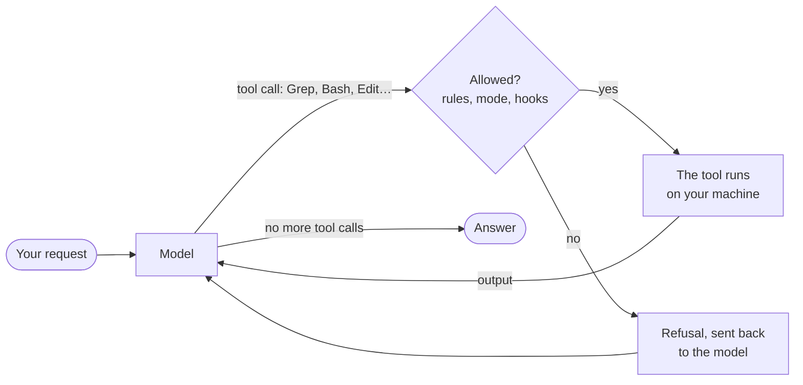

import { Tabs, TabItem } from '@astrojs/starlight/components';

An IDE refactoring is a fixed program: *Rename symbol* always does the same thing, and you can read its source. A coding agent is a program that asks a language model **what to do next**, does it, shows the model the result, and asks again. This lesson looks at that loop, installs the two agents of the course, and runs a first task that only reads.

## The loop

The model never touches your files. It only produces text, and part of that text can be a **tool call**: "read `AGENTS.md`", "run `git status`". The agent program, which the Claude Code documentation calls the [agentic harness](https://code.claude.com/docs/en/how-claude-code-works), decides whether the call may run, runs it, and sends the output back to the model as the next message:



The documentation describes three phases that blend together: gather context, take action, verify results. Each round trip is a **turn**, and everything the model has seen so far, your request, the files it read and the command outputs, sits in its **context window**, which lesson 2 looks at.

Two consequences for a C# or Java developer:

- **The permission check is code, not a request to the model.** "Permission rules are enforced by Claude Code, not by the model" ([permissions](https://code.claude.com/docs/en/permissions)). A rule that says no is a `false` in the harness; an instruction in a Markdown file that says "never push" is a sentence the model may or may not follow.
- **The tools are ordinary programs.** `Bash` runs a shell, `Edit` replaces a string in a file, `Grep` is ripgrep. What the agent can break is what those programs can break with your user account.

Claude Code's built-in tools are listed in the [tools reference](https://code.claude.com/docs/en/tools-reference): `Read`, `Glob` and `Grep` need no permission inside the working directory; `Edit`, `Write`, `Bash`, `PowerShell`, `WebFetch` and `Skill` do. `Glob` and `Grep` are absent by default on macOS, Linux and WSL, where the model searches with read-only shell commands instead. Codex has equivalent tools with other names; its hooks see the shell as `Bash` and file edits as `apply_patch` ([Codex hooks](https://learn.chatgpt.com/docs/hooks)).

## Install

Claude Code needs a Pro, Max, Team, Enterprise or Console account; "the free Claude.ai plan does not include Claude Code access" ([setup](https://code.claude.com/docs/en/setup)). The Codex CLI signs in with a ChatGPT account or an API key ([Codex authentication](https://learn.chatgpt.com/docs/auth)).

<Tabs syncKey="os">
<TabItem label="Windows">

In PowerShell, the native installers from the [Claude Code setup page](https://code.claude.com/docs/en/setup) and the [Codex CLI page](https://learn.chatgpt.com/docs/codex/cli):

```powershell
irm https://claude.ai/install.ps1 | iex
powershell -ExecutionPolicy ByPass -c "irm https://chatgpt.com/codex/install.ps1 | iex"
```

Claude Code also installs with `winget install Anthropic.ClaudeCode`, which doesn't update itself. On my machine, Claude Code came from the native installer (`C:\Users\<you>\.local\bin\claude.exe`) and Codex from npm (`npm install -g @openai/codex`), which needs Node.js. The Codex PowerShell installer is *to verify*: I haven't run it.

[Git for Windows](https://git-scm.com/downloads/win) is recommended but no longer required: "If Git for Windows is not installed, Claude Code uses PowerShell as the shell tool instead" ([setup](https://code.claude.com/docs/en/setup)). Claude Code's sandbox isn't available on native Windows; Codex has its own Windows sandbox ([Windows sandbox](https://learn.chatgpt.com/docs/windows/windows-sandbox)).

</TabItem>
<TabItem label="Linux / WSL">

```bash
curl -fsSL https://claude.ai/install.sh | bash
curl -fsSL https://chatgpt.com/codex/install.sh | sh
```

Both commands are *to verify*: I haven't installed either agent on Linux for this course. Codex doesn't support WSL 1 ([Codex on WSL](https://learn.chatgpt.com/docs/windows/wsl)).

</TabItem>
<TabItem label="macOS">

```bash
curl -fsSL https://claude.ai/install.sh | bash
curl -fsSL https://chatgpt.com/codex/install.sh | sh
```

Or with Homebrew, `brew install --cask claude-code` and `brew install --cask codex`. All of these are *to verify*: I haven't installed either agent on macOS for this course.

</TabItem>
</Tabs>

Then, in any terminal:

```text
> claude --version
2.1.271 (Claude Code)
> codex --version
codex-cli 0.154.0
```

`claude doctor` prints a diagnosis without starting a session. Captured on 2026-09-14 around 22:25 UTC, shortened:

```text
Claude Code doctor
…

Running: native (2.1.271)
Platform: win32-x64
Config install method: native
Auto-updates: enabled
Auto-update channel: latest
Last update attempt: success → 2.1.271 (2026-09-14)

No installation issues found.
```

I started this lesson on 2.1.270; the native installation updated itself to 2.1.271 in the background around 22:14 UTC ([auto-updates](https://code.claude.com/docs/en/setup)). An npm or Homebrew installation doesn't. A behavior you observed on Monday can change on Tuesday without you running anything; the [journal](../journal/) notes which capture ran on which version.

:::caution[An API key overrides your subscription]
If `ANTHROPIC_API_KEY` is set in your environment, an interactive session asks once whether to use it instead of your subscription, and `claude -p` uses it without asking ([authentication](https://code.claude.com/docs/en/authentication)): a script can bill per token without you noticing. `/status` in a session shows which one is used. This course never uses an API key.
:::

## A first task that only reads

Start in the repository, and ask a question whose answer you can check. `claude -p` runs one request without the interactive interface ([headless mode](https://code.claude.com/docs/en/headless)); `--allowedTools` lets the listed tools run without a prompt (it doesn't remove the others: that's `--tools`), and `--output-format json` adds the metadata. Run from the root of this repository on 2026-09-14 at 22:10 UTC, Claude Code 2.1.270:

```bash
claude -p "Which course folders under src/content/docs have a journal.md with unchecked progress items (lines starting with '- [ ]')? For each, give the folder and the number of unchecked items, as a Markdown table. Don't modify any file." --allowedTools "Read,Grep,Glob" --output-format json
```

The `result` field, as the model wrote it:

```text
Seven of the 22 `journal.md` files under `src/content/docs` have lines starting with `- [ ]`, 100 in all. Nothing was modified.

| Folder | Unchecked items |
|---|---:|
| `streeling/` | 31 |
| `fr/streeling/` | 31 |
| `es/streeling/` | 31 |
| `java-for-csharp/` | 2 |
| `fr/java-for-csharp/` | 2 |
| `es/java-for-csharp/` | 2 |
| `v-for-csharp-java/` | 1 |

- **Streeling:** `journal.md` is the one file in that section written by hand; the sync script generates the rest.
- **V course:** it only has an English journal so far, with no `fr/` or `es/` copy.
- **Fully checked:** `rust-for-csharp-java`, `wsl-containers`, `github-actions`, `duckdb` and `ladybugdb` have no unchecked items in any language.
- **Indented items:** only lines that start with `- [ ]` were counted, so an unchecked item nested under another item wouldn't show up.
```

And a few other fields: `"num_turns": 3`, `"duration_ms": 12087`, `"permission_denials": []`. Three turns: the model searched with `Grep`, got the counts, and answered. **Check the answer**: `grep -c '\- \[ \]' src/content/docs/*/journal.md` gives the same counts. The remark about Streeling's journal isn't in any journal file: it comes from this repository's `AGENTS.md`, which the agent loaded before its first turn. Lesson 2 explains how.

The same request with Codex, `codex exec "…"`, the same evening, shortened:

```text
OpenAI Codex v0.154.0
--------
workdir: C:\Users\spare\source\repos\learn
model: gpt-6-astra
provider: openai
approval: on-request
sandbox: read-only
…
--------
…
ERROR: You've hit your usage limit. Visit https://chatgpt.com/codex/settings/usage to purchase more credits or try again at Sep 19th, 2026 9:42 AM.
```

A subscription has limits, and a script that calls an agent has to expect this failure like any other. The Codex sessions of this lot are *to verify* after that date; the commands that don't call the model (`codex mcp add`, `codex mcp list`) work, and lesson 4 uses them.

## Permission modes

Claude Code asks before an action according to its **permission mode** ([permission modes](https://code.claude.com/docs/en/permission-modes)):

| Mode | Runs without asking | Use it for |
|---|---|---|
| `default` (shown as *Manual*) | reads only | learning the tool, sensitive repositories |
| `acceptEdits` | reads, file edits, and `mkdir`, `touch`, `mv`, `cp` in the working directories | a task you will review as a diff |
| `plan` | reads, plus commands the auto-mode checks approve when auto mode is available; no edits until you approve a plan | exploring before changing |
| `auto` | everything, with background safety checks by a second model, the classifier | long tasks, with the checks as a safety net, not a guarantee |
| `dontAsk` | only what rules allow; anything else is refused | CI |
| `bypassPermissions` | everything | "isolated containers and VMs only" |

`Shift+Tab` cycles through the modes in a session, and `--permission-mode` sets one for a run. The starting mode depends on the plan and on your settings: interactive sessions on Pro, Max and Team plans start in `auto`; Enterprise plans and API keys start in `default`; `claude -p` starts in `default`, **unless a settings file says otherwise**: `--permission-mode` wins, then `permissions.defaultMode` in a settings file, then the built-in default.

That exception bit me. This machine's user settings contain `"defaultMode": "auto"`, and `claude -p "Create a file named hello.txt containing the word hi…"` created the file without asking. The same request with `--permission-mode default`, on 2026-09-14 at 22:22 UTC, in an empty repository:

```json
{
 "num_turns": 2,
 "is_error": false,
 "permission_denials": [
  {
   "tool_name": "Write",
   "tool_input": {
    "file_path": "C:\\Users\\spare\\…\\ctxA\\hello.txt",
    "content": "hi"
   }
  }
 ],
 "result": "It didn't work: the request for permission to write `hello.txt` wasn't approved, so no file was created. If you approve the write, I can try again."
}
```

In `-p` mode there's nobody to answer the prompt, so the call is refused, the refusal goes back to the model, and the model reports it. `is_error` stays `false`: the run succeeded, the task didn't. A script must read `permission_denials`, not only the exit code.

Writes to a few **protected paths** are never auto-approved, except in `bypassPermissions`, and allow rules don't change that: `.git`, `.vscode`, `.idea`, `.claude`, `.mvn`, `.devcontainer`, `.mcp.json`, shell profiles such as `.bashrc`, and others listed in [protected paths](https://code.claude.com/docs/en/permission-modes#protected-paths). `default` and `acceptEdits` prompt, `auto` sends them to the classifier, `dontAsk` refuses.

## Permission rules

Rules refine the mode, in `.claude/settings.json` (committed, shared with the team), `.claude/settings.local.json` (yours only) or `~/.claude/settings.json` (all your projects) ([settings](https://code.claude.com/docs/en/settings)):

```json
{
  "permissions": {
    "allow": ["Bash(dotnet build *)", "Bash(dotnet test *)"],
    "ask": ["Bash(git push *)"],
    "deny": ["Read(./.env)", "Read(./**/appsettings.Development.json)"]
  }
}
```

"Rules are evaluated in order: deny, then ask, then allow. The first match in that order determines the outcome" ([permissions](https://code.claude.com/docs/en/permissions)). `Bash(dotnet test *)` matches `dotnet test` alone or followed by anything; the space matters, so `Bash(ls *)` doesn't match `lsof`. A compound command such as `dotnet build && git push` must match rule by rule, subcommand by subcommand.

The documentation is explicit about the limit: a Bash rule "isn't a security boundary around the program". `Bash(curl *)` in `deny` stops `curl https://example.com`, not `/usr/bin/curl https://example.com` or `sh -c 'curl https://example.com'`; `Bash(git push *)` doesn't stop `git -C . push origin main`. A built-in set of read-only commands, `ls`, `cat`, `grep`, `find`, read-only `git` and a few others, runs without a prompt in every mode. For a real boundary, use a sandbox or a container; for a check that reads the command the way you want, a hook (lesson 3).

## Codex: a sandbox and an approval policy

Codex separates **what a command can touch**, the sandbox, from **when to ask you**, the approval policy ([approvals and security](https://learn.chatgpt.com/docs/agent-approvals-security)):

| | Values in 0.154.0 |
|---|---|
| `--sandbox` | `read-only`, `workspace-write`, `danger-full-access` |
| `--ask-for-approval` (interactive `codex`) | `on-request`: the model asks when it needs to go beyond the sandbox; `never`: failures go straight back to the model |

In a Git repository the interactive preset is *Auto*, `workspace-write` with `on-request`; "by default, `codex exec` runs in a read-only sandbox" ([non-interactive mode](https://learn.chatgpt.com/docs/non-interactive-mode)), which the header of the capture above shows. The sandbox is enforced by the operating system (Seatbelt on macOS, bubblewrap and seccomp on Linux and WSL 2, a dedicated sandbox on native Windows), so a command in `read-only` can't write, whatever its command line looks like. Network access is off by default in `workspace-write`. Older tutorials use `--full-auto` and `--ask-for-approval untrusted`: `codex exec` 0.154.0 rejects the first (`unexpected argument '--full-auto'`), and the `untrusted` policy is retired. The new `--approve-for-me` sends approval requests to an automatic review, in `workspace-write`.

Claude Code's equivalent is its [sandbox](https://code.claude.com/docs/en/sandboxing), `/sandbox`, which isolates the Bash tool's file system and network on macOS, Linux and WSL 2, not on native Windows.

## Key takeaways

- The model only proposes tool calls; the harness checks them, runs them and returns their output. A turn is one round trip.
- Permission modes and rules are enforced by the agent program. Instructions in Markdown files are not.
- `claude -p` and `codex exec` run one task from a script. Check `permission_denials` and the answer itself, not only the exit code.
- Your settings files change the defaults: `claude -p` followed this machine's `defaultMode: auto`.
- Bash permission rules match text. Sandboxes restrict what the process can do.
- Agents update themselves, and subscriptions run out: date every capture.

## Exercises

1. The first task allowed `Read,Grep,Glob`. In `-p` mode with `--permission-mode default`, what happens if the model runs `grep -c` through `Bash` instead? And if it runs `sed -i` to "fix" a journal?

<details>
<summary>Solution</summary>

`--allowedTools` doesn't restrict the tool list, it only approves the listed tools. `Bash` stays available, and `grep` is one of the built-in read-only commands that run without a prompt in every mode: the command runs, and on macOS, Linux and WSL, where the `Grep` tool is absent by default, that is exactly what the model does. `sed -i` isn't read-only: in `-p` mode nobody can approve it, so the harness refuses it before anything runs, sends the refusal to the model, and lists it in `permission_denials`, like the `Write` refusal above. The run still exits with 0 and `is_error: false`. To remove `Bash` entirely, pass `--tools "Read,Grep,Glob"`. On this machine, where the user settings say `defaultMode: auto`, `sed -i` would have gone to the classifier instead: pass `--permission-mode` explicitly in scripts.

</details>

2. Write the `permissions` block of a `.claude/settings.json` for a .NET solution: the agent may build and test without asking, must ask before any `git push`, and may never read `appsettings.Development.json` files or anything under `secrets/`.

<details>
<summary>Solution</summary>

```json
{
  "permissions": {
    "allow": ["Bash(dotnet build *)", "Bash(dotnet test *)"],
    "ask": ["Bash(git push *)"],
    "deny": ["Read(./**/appsettings.Development.json)", "Read(./secrets/**)"]
  }
}
```

`Read` and `Edit` rules use gitignore patterns relative to the current directory when they start with `./` ([permissions](https://code.claude.com/docs/en/permissions)). `deny` wins over `allow`, so a later broad `allow` rule doesn't reopen the secrets. `Bash(dotnet build *)` also matches a bare `dotnet build`. The `ask` rule is a convenience, not a guarantee: the documentation itself shows that `git -C . push origin main` isn't stopped by `Bash(git push *)`. Lesson 3 writes a hook that parses the command instead.

</details>

3. A nightly CI job must ask Codex to summarize the week's commits into a file, and nothing else. Which options do you pass to `codex exec`, and what can still go wrong?

<details>
<summary>Solution</summary>

`codex exec --sandbox read-only -o summary.md "Summarize the commits of the last 7 days"`: read-only is already the default of `codex exec`, but writing it makes the intent visible, and `-o` (`--output-last-message`) writes the final message to a file and still prints it ([non-interactive mode](https://learn.chatgpt.com/docs/non-interactive-mode)); the file is written by the Codex CLI, not by a command inside the sandbox, so the agent itself needs no write access (*to verify*: I couldn't run it past the usage limit). In CI you also need credentials (`CODEX_API_KEY` for `codex exec`), and a Git repository or `--skip-git-repo-check`. What can still go wrong: the usage limit of the capture above, a summary that is plausible but wrong, and a model that follows instructions found in commit messages. The output is text written by a model: review it or treat it as untrusted.

</details>

## Sources

- Claude Code: [how it works](https://code.claude.com/docs/en/how-claude-code-works), [setup](https://code.claude.com/docs/en/setup), [authentication](https://code.claude.com/docs/en/authentication), [tools reference](https://code.claude.com/docs/en/tools-reference), [headless mode](https://code.claude.com/docs/en/headless), [permission modes](https://code.claude.com/docs/en/permission-modes), [permissions](https://code.claude.com/docs/en/permissions), [settings](https://code.claude.com/docs/en/settings), [sandboxing](https://code.claude.com/docs/en/sandboxing)
- Codex: [CLI](https://learn.chatgpt.com/docs/codex/cli), [authentication](https://learn.chatgpt.com/docs/auth), [non-interactive mode](https://learn.chatgpt.com/docs/non-interactive-mode), [approvals and security](https://learn.chatgpt.com/docs/agent-approvals-security), [Windows sandbox](https://learn.chatgpt.com/docs/windows/windows-sandbox)
