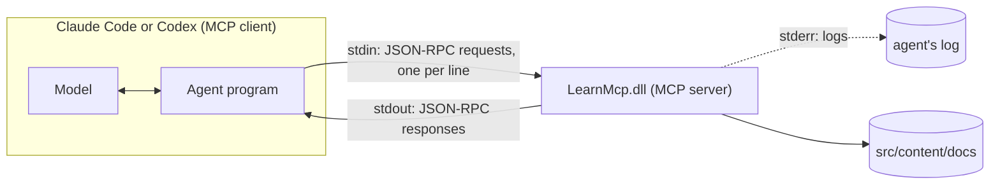

Hooks and skills change how an agent uses the tools it has. The [Model Context Protocol](https://modelcontextprotocol.io/) (MCP) gives it new ones: a server exposes tools, the agent lists them, the model calls them. If you've written a gRPC service or a JSON-RPC endpoint, you know most of it already. The server of this lesson is about 120 lines of C# with the [official C# SDK](https://github.com/modelcontextprotocol/csharp-sdk), and CI tests it on three OSes without any agent.

## The architecture



The agent starts the server as a child process and speaks [JSON-RPC 2.0](https://www.jsonrpc.org/specification) over its standard streams. The [stdio transport](https://modelcontextprotocol.io/specification/2026-07-28/basic/transports/stdio) has one rule that .NET developers break on their first try: "The server **MUST NOT** write anything to its `stdout` that is not a valid MCP message." A `Console.WriteLine` for debugging, or a logger writing to the console, corrupts the stream. Logs go to stderr. MCP also has an HTTP transport, for remote servers; this lesson stays local.

## The server

[`mcp/LearnMcp/Program.cs`](https://github.com/spareilleux/learn/blob/13143d3a4d1d7d7b97fd087d4ad89c00e42fe788/code/agentic-coding/mcp/LearnMcp/Program.cs#L5-L15) is a [generic host](https://learn.microsoft.com/dotnet/core/extensions/generic-host), like any .NET worker service:

```csharp
var builder = Host.CreateApplicationBuilder(args);

// stdout carries the protocol: every log line goes to stderr
builder.Logging.AddConsole(options => options.LogToStandardErrorThreshold = LogLevel.Trace);

builder.Services
    .AddMcpServer()
    .WithStdioServerTransport()
    .WithToolsFromAssembly();

await builder.Build().RunAsync();
```

`WithToolsFromAssembly` finds static classes marked `[McpServerToolType]` and exposes their `[McpServerTool]` methods. [`ScaleTools.cs`](https://github.com/spareilleux/learn/blob/13143d3a4d1d7d7b97fd087d4ad89c00e42fe788/code/agentic-coding/mcp/LearnMcp/ScaleTools.cs#L15-L19) declares the first tool:

```csharp
[McpServerTool(Name = "scale_notes", ReadOnly = true, Idempotent = true)]
[Description("Spells the seven notes of a diatonic scale, one letter per degree: 'F major' gives Bb, not A#.")]
public static string[] ScaleNotes(
    [Description("Root note: a letter A to G, optionally followed by # or b, for example C, F# or Bb")] string root,
    [Description("major, minor, or a mode name: ionian, dorian, phrygian, lydian, mixolydian, aeolian, locrian")] string mode = "major")
```

The SDK turns the signature into a JSON Schema and the `[Description]` attributes into the text the model reads; these descriptions are the tool's whole documentation, for a reader that can't open your source. Invalid input throws [`McpException`](https://github.com/spareilleux/learn/blob/13143d3a4d1d7d7b97fd087d4ad89c00e42fe788/code/agentic-coding/mcp/LearnMcp/ScaleTools.cs#L54), which the SDK sends back as a tool error.

The second tool, [`course_outline`](https://github.com/spareilleux/learn/blob/13143d3a4d1d7d7b97fd087d4ad89c00e42fe788/code/agentic-coding/mcp/LearnMcp/CourseTools.cs#L11-L37), shows two more things: a parameter of type `IConfiguration` is injected by the host, not exposed to the model, and it reads the `--docs` command-line argument; and the course name is validated against `[a-z0-9-]` before it becomes a path, because the model will pass whatever it's given, `../..` included.

## Speaking MCP by hand

Before trusting an SDK, look at the wire. `LearnMcp.Check raw` starts the server and sends the lines of a `.jsonl` file one at a time, printing each reply. CI runs it for both eras of the protocol.

### The legacy handshake, up to 2025-11-25

Until revision [2025-11-25](https://modelcontextprotocol.io/specification/2025-11-25/basic/lifecycle), a session starts with `initialize`. [`expected-legacy.txt`](https://github.com/spareilleux/learn/blob/13143d3a4d1d7d7b97fd087d4ad89c00e42fe788/code/agentic-coding/mcp/expected-legacy.txt), lines shortened with `…`:

```text
--> {"jsonrpc":"2.0","id":1,"method":"initialize","params":{"protocolVersion":"2025-11-25","capabilities":{},"clientInfo":{"name":"by-hand","version":"1.0"}}}
<-- {"result":{"protocolVersion":"2025-11-25","capabilities":{"logging":{},"tools":{"listChanged":true}},"serverInfo":{"name":"LearnMcp","version":"1.0.0.0"}},"id":1,"jsonrpc":"2.0"}
--> {"jsonrpc":"2.0","method":"notifications/initialized"}
--> {"jsonrpc":"2.0","id":2,"method":"tools/list"}
<-- {"result":{"tools":[{"name":"course_outline",…,"annotations":{"readOnlyHint":true}},{"name":"scale_notes",…,"annotations":{"idempotentHint":true,"readOnlyHint":true}}]},"id":2,"jsonrpc":"2.0"}
--> {"jsonrpc":"2.0","id":3,"method":"tools/call","params":{"name":"scale_notes","arguments":{"root":"F","mode":"major"}}}
<-- {"result":{"content":[{"type":"text","text":"[\u0022F\u0022,\u0022G\u0022,\u0022A\u0022,\u0022Bb\u0022,\u0022C\u0022,\u0022D\u0022,\u0022E\u0022]"}]},"id":3,"jsonrpc":"2.0"}
--> {"jsonrpc":"2.0","id":4,"method":"tools/call","params":{"name":"scale_notes","arguments":{"root":"H"}}}
<-- {"result":{"content":[{"type":"text","text":"An error occurred invoking \u0027scale_notes\u0027: \u0027H\u0027 is not a note: use a letter A to G, optionally followed by # or b."}],"isError":true},"id":4,"jsonrpc":"2.0"}
exit code: 0
```

Three details. The `string[]` came back as JSON inside a text block, with `"` escaped as `\u0022` by System.Text.Json's default encoder. `ReadOnly = true` became `readOnlyHint`, a hint the specification says clients "**MUST** consider … to be untrusted unless they come from trusted servers". And `H` produced a **result** with `isError: true`, not a JSON-RPC error.

### The stateless revision, 2026-07-28

The [current revision](https://modelcontextprotocol.io/specification/2026-07-28/changelog) removes the handshake: "Every request now carries its protocol version and client capabilities in `_meta`", and servers "MUST implement" [`server/discover`](https://modelcontextprotocol.io/specification/2026-07-28/server/discover). [`expected-stateless.txt`](https://github.com/spareilleux/learn/blob/13143d3a4d1d7d7b97fd087d4ad89c00e42fe788/code/agentic-coding/mcp/expected-stateless.txt):

```text
--> {"jsonrpc":"2.0","id":1,"method":"server/discover","params":{"_meta":{"io.modelcontextprotocol/protocolVersion":"2026-07-28","io.modelcontextprotocol/clientCapabilities":{},"io.modelcontextprotocol/clientInfo":{"name":"by-hand","version":"1.0"}}}}
<-- {"result":{"supportedVersions":["2026-07-28"],"capabilities":{"logging":{},"tools":{"listChanged":true}},"ttlMs":0,"cacheScope":"private","resultType":"complete","_meta":{"io.modelcontextprotocol/serverInfo":{"name":"LearnMcp","version":"1.0.0.0"}}},"id":1,"jsonrpc":"2.0"}
--> {"jsonrpc":"2.0","id":2,"method":"tools/call","params":{"name":"scale_notes","arguments":{"root":"Bb","mode":"minor"},"_meta":{…}}}
<-- {"result":{"content":[{"type":"text","text":"[\u0022Bb\u0022,\u0022C\u0022,\u0022Db\u0022,\u0022Eb\u0022,\u0022F\u0022,\u0022Gb\u0022,\u0022Ab\u0022]"}],"resultType":"complete","_meta":{"io.modelcontextprotocol/serverInfo":{"name":"LearnMcp","version":"1.0.0.0"}}},"id":2,"jsonrpc":"2.0"}
exit code: 0
```

The same server, SDK 2.2.0, answers both eras. Without the `_meta` block, `server/discover` answered with the JSON-RPC error `-32602`: the request "requires per-request metadata declaring a supported protocol version". Two traps of a raw pipe, found while writing the tool: the server may answer requests out of order, so the raw mode waits for each reply before sending the next line; and it doesn't answer notifications at all.

## Testing with the SDK's client

The default mode of [`LearnMcp.Check`](https://github.com/spareilleux/learn/blob/13143d3a4d1d7d7b97fd087d4ad89c00e42fe788/code/agentic-coding/mcp/LearnMcp.Check/Program.cs#L19-L25) starts the server the way an agent does:

```csharp
var transport = new StdioClientTransport(new StdioClientTransportOptions
{
    Name = "learn",
    Command = "dotnet",
    Arguments = [server, "--docs", docs],
});
await using var client = await McpClient.CreateAsync(transport);
```

then lists the tools and calls them with good and bad arguments. Part of [`expected.txt`](https://github.com/spareilleux/learn/blob/13143d3a4d1d7d7b97fd087d4ad89c00e42fe788/code/agentic-coding/mcp/expected.txt):

```text
server: LearnMcp, protocol 2026-07-28
…
scale_notes {"root":"Eb","mode":"dorian"}
  isError: False
  ["Eb","F","Gb","Ab","Bb","C","Db"]
scale_notes {"root":"C","mode":"blues"}
  isError: True
  An error occurred invoking 'scale_notes': Unknown mode 'blues'. Use major, minor or one of: ionian, dorian, phrygian, lydian, mixolydian, aeolian, locrian.
course_outline {"course":"../.."}
  isError: True
  An error occurred invoking 'course_outline': '../..' is not a course folder name.
does_not_exist {}
  McpProtocolException: Request failed (remote): Unknown tool: 'does_not_exist'
```

The client negotiated 2026-07-28. The two kinds of failure follow the [tools specification](https://modelcontextprotocol.io/specification/2026-07-28/server/tools): an unknown tool is a **protocol error**, which the C# client throws as an exception; bad arguments are a **tool execution error**, `isError: true`, which "clients **SHOULD** provide … to language models to enable self-correction". Write your error messages for the model: say what was wrong and what's valid.

This is the part of an MCP server you can test like any other code, and it's where most bugs are. What the model does with the tools is the part you can't.

## Registering it in Claude Code

`claude mcp add` writes the configuration; `--scope project` puts it in `.mcp.json`, committed with the repository ([Claude Code MCP](https://code.claude.com/docs/en/mcp)). On 2026-09-14 at 22:56 UTC, in an empty Git repository:

```text
> claude mcp add --scope project learn -- dotnet code/agentic-coding/mcp/LearnMcp/bin/Release/net10.0/LearnMcp.dll --docs src/content/docs
Added stdio MCP server learn with command: dotnet code/agentic-coding/mcp/LearnMcp/bin/Release/net10.0/LearnMcp.dll --docs src/content/docs to project config
File modified: C:\…\mcpadd\.mcp.json
> claude mcp get learn
learn:
  Scope: Project config (shared via .mcp.json)
  Status: ⏸ Pending approval (run `claude` to approve)
  Type: stdio
  Command: dotnet
  Args: code/agentic-coding/mcp/LearnMcp/bin/Release/net10.0/LearnMcp.dll --docs src/content/docs
  Environment:

To remove this server, run: claude mcp remove learn -s project
```

Everything after `--` goes to the server untouched. A project server waits for each developer's approval in an interactive session; `claude -p` doesn't ask, and "connects the servers in its `.mcp.json`, even in a folder you've never trusted" ([headless mode](https://code.claude.com/docs/en/headless)), the same caution as for hooks in lesson 3.

The tools appear to the model as `mcp__learn__scale_notes` and `mcp__learn__course_outline`, and permission rules use those names ([the example settings](https://github.com/spareilleux/learn/blob/13143d3a4d1d7d7b97fd087d4ad89c00e42fe788/code/agentic-coding/config/claude/settings.json) allows both). A capture on 2026-09-14 at 22:11 UTC, Claude Code 2.1.270, in a scratch repository with a copy of the server and of the docs:

```bash
claude -p "Spell the D dorian scale and the notes of Gb major with the scale_notes tool of the learn MCP server, then list the pages of the ladybugdb course with course_outline. Answer briefly." --allowedTools "mcp__learn__scale_notes,mcp__learn__course_outline" --output-format stream-json --verbose
```

The transcript, shortened:

```text
init          mcp_servers: … {"name": "learn", "status": "pending"} …
ToolSearch    {"query": "+learn scale_notes course_outline", "max_results": 5}
  result      tool_reference mcp__learn__course_outline, tool_reference mcp__learn__scale_notes, …
mcp__learn__scale_notes {"root": "D", "mode": "dorian"}    → ["D","E","F","G","A","B","C"]
mcp__learn__scale_notes {"root": "Gb", "mode": "major"}    → ["Gb","Ab","Bb","Cb","Db","Eb","F"]
mcp__learn__course_outline {"course": "ladybugdb"}         → index.md: LadybugDB — Mission …
```

Five turns, and the model called both `scale_notes` in parallel. It split "D dorian" into the two parameters on its own, from the schema. Note the first call: MCP tools aren't in the model's context at startup. With [tool search](https://code.claude.com/docs/en/mcp#scale-with-mcp-tool-search), on by default, the model only knows tool names and searches for a tool's schema when it needs it, which keeps dozens of servers from filling the context. `Gb major` came back with `Cb`, the correct spelling; a pitch-class implementation would have said `B`.

### A path that doesn't expand

The example [`.mcp.json`](https://github.com/spareilleux/learn/blob/13143d3a4d1d7d7b97fd087d4ad89c00e42fe788/code/agentic-coding/config/claude/.mcp.json) uses paths relative to the repository root. The obvious alternative, `${CLAUDE_PROJECT_DIR}` like in hooks, fails. Three variants of the same server, on 2026-09-14 at 22:54 UTC:

```json
{
  "mcpServers": {
    "expanded":  { "command": "dotnet", "args": ["${CLAUDE_PROJECT_DIR}/server/LearnMcp.dll", "--docs", "${CLAUDE_PROJECT_DIR}/docs"] },
    "defaulted": { "command": "dotnet", "args": ["${CLAUDE_PROJECT_DIR:-.}/server/LearnMcp.dll", "--docs", "${CLAUDE_PROJECT_DIR:-.}/docs"] },
    "relative":  { "command": "dotnet", "args": ["server/LearnMcp.dll", "--docs", "docs"] }
  }
}
```

`claude mcp list` warned: "[expanded] mcpServers.expanded: Missing environment variables: CLAUDE_PROJECT_DIR". In a `claude -p` session, `expanded` failed with `CONNECTION_CLOSED` and the other two connected. The documentation explains it: `CLAUDE_PROJECT_DIR` "is set in the server's environment, not in Claude Code's own environment, so referencing it via `${VAR}` expansion in the `command` or `args` … requires a default such as `${CLAUDE_PROJECT_DIR:-.}`". A server can also read the variable itself at startup. Hooks and MCP servers look alike in configuration, and the same variable follows different rules in each.

## Registering it in Codex

Codex keeps MCP servers in `config.toml`, `~/.codex/config.toml` by default or `.codex/config.toml` in a trusted project ([Codex MCP](https://learn.chatgpt.com/docs/extend/mcp)). With `CODEX_HOME` pointing to an empty folder, on 2026-09-14 at 22:57 UTC, Codex CLI 0.154.0, from the root of this repository (a warning about PATH aliases in a temporary folder removed):

```text
> codex mcp add learn -- dotnet code/agentic-coding/mcp/LearnMcp/bin/Release/net10.0/LearnMcp.dll --docs src/content/docs
Added global MCP server 'learn'.
> codex mcp list
Name   Command  Args                                                                                       Env  Cwd  Status   Auth
learn  dotnet   code/agentic-coding/mcp/LearnMcp/bin/Release/net10.0/LearnMcp.dll --docs src/content/docs  -    -    enabled  Unsupported
```

and the file it wrote:

```toml
[mcp_servers.learn]
command = "dotnet"
args = ["code/agentic-coding/mcp/LearnMcp/bin/Release/net10.0/LearnMcp.dll", "--docs", "src/content/docs"]
```

`codex mcp list` doesn't start the server: "enabled" means configured, not connected. [The example `config.toml`](https://github.com/spareilleux/learn/blob/13143d3a4d1d7d7b97fd087d4ad89c00e42fe788/code/agentic-coding/config/codex/config.toml) adds two keys: `startup_timeout_sec = 30`, because the default is 10 seconds and a first `dotnet` start can be slower; and `default_tools_approval_mode = "approve"`, one of `auto`, `prompt`, `writes` and `approve`, where "the `writes` mode prompts for tools that aren't marked read-only". Codex also has `cwd`, `enabled_tools` and `disabled_tools` per server. A session that actually calls the tools is *to verify*, after the usage limit of lesson 1; so is the working directory the relative paths resolve against when `cwd` isn't set.

Older articles show Codex itself as an MCP server, `codex mcp-server`: "The `codex mcp-server` command and the standalone `codex-mcp-server` binary have been removed" ([Codex MCP server removal](https://learn.chatgpt.com/docs/mcp-server)).

## The GA case: tool design matters more than the protocol

[GuitarAlchemist/ga](https://github.com/GuitarAlchemist/ga/tree/a826864f3a012cad88e415954bf57eca0ce12aa6/GaMcpServer) has a real MCP server, `GaMcpServer`, with the same host setup as `LearnMcp`, logs to stderr included, ModelContextProtocol 1.3.0 instead of 2.2.0, and governance middleware from `Microsoft.AgentGovernance`. It exposes dozens of music theory tools. One of them, [`GetScaleNotes`](https://github.com/GuitarAlchemist/ga/blob/a826864f3a012cad88e415954bf57eca0ce12aa6/GaMcpServer/Tools/ScaleTool.cs#L50-L80), does the same job as `scale_notes`:

```csharp
[McpServerTool]
[Description(
    "Get the 7 scale notes for a key string such as 'G major' or 'A minor'. " +
    "Returns a JSON array of {degree, note, pitchClass} objects suitable for fretboard overlays or theory analysis. " +
    "pitchClass is 0-11 (C=0, C#=1 … B=11). Supports major and natural minor only.")]
public static string GetScaleNotes(
    [Description("Key string in 'Root mode' format, e.g. 'G major', 'A minor', 'Bb major'")] string key)
{
    …
    string[] noteNames = ["C", "C#", "D", "D#", "E", "F", "F#", "G", "G#", "A", "A#", "B"];
    …
    var rootIndex = Array.IndexOf(noteNames, root);
    if (rootIndex < 0)
        return $"Unknown root note '{root}'. Use sharps (e.g. C#, F#) not flats for black keys.";

    var offsets = mode.StartsWith("minor") ? minor : major;
```

The same server, called from the session that wrote this lesson on 2026-09-14 around 22:57 UTC, from a local build of ga whose `GetScaleNotes` has the same code:

| Call | Result |
|---|---|
| `get_scale_notes("F major")` | F G A **A#** C D E |
| `get_scale_notes("Bb major")` | "Unknown root note 'Bb'. Use sharps (e.g. C#, F#) not flats for black keys." |
| `get_scale_notes("D dorian")` | D E **F#** G A B **C#**, the notes of D major |
| `get_key_notes("Key of F")` | F G A **Bb** C D E |

Each row is a tool-design lesson, and none is about MCP:

- **The description promises what the code refuses.** The parameter's example is `'Bb major'`, which the tool rejects. The model reads the description, not the code.
- **Errors are returned as ordinary results.** The rejection is a normal string, without `isError`, so a client can't tell it from data. `LearnMcp` throws `McpException` instead.
- **Silent fallbacks produce plausible wrong answers.** Every mode that doesn't start with "minor" is treated as major. The description says "major and natural minor only", but a model asked for D dorian receives seven valid-looking notes, and has no reason to doubt them.
- **Two tools of one server disagree.** `get_key_notes` spells F major with `Bb`, `get_scale_notes` with `A#`. The model can call either, depending on the words of the request.
- **Pitch classes are not note names.** `A#` and `Bb` are the same key on a piano and different notes in F major: spelling is part of the answer for a guitarist reading the result, which is why `scale_notes` works from letters.

These are findings about a public repository at a pinned commit; this course doesn't change ga, and they're listed in the [journal](../journal/) for its author.

## Key takeaways

- An MCP server is a process that speaks JSON-RPC over stdin and stdout; stdout is reserved for the protocol, logs go to stderr.
- With the C# SDK, a server is a generic host, `AddMcpServer().WithStdioServerTransport().WithToolsFromAssembly()`, and tools are attributed static methods; descriptions are the documentation the model reads.
- Revision 2026-07-28 is stateless: no `initialize`, `_meta` on every request, `server/discover`. SDK 2.2.0 serves both eras.
- Bad arguments are a tool result with `isError: true`, an unknown tool is a protocol error; write error messages that tell the model what's valid.
- Test the server with an MCP client in CI; that's deterministic. What a model does with the tools is not.
- `.mcp.json` and `claude mcp add --scope project` for Claude Code, `[mcp_servers.x]` and `codex mcp add` for Codex. Don't use `${CLAUDE_PROJECT_DIR}` in `.mcp.json` without a default.
- Most MCP bugs are tool-design bugs: descriptions that lie, errors that look like data, silent fallbacks.

## Exercises

1. Add `Console.WriteLine($"Spelling {root} {mode}");` at the start of `ScaleNotes`, rebuild, and run both modes of `LearnMcp.Check`. Predict what breaks before you run it.

<details>
<summary>Solution</summary>

I tried it on 2026-09-14 in a copy of `code/agentic-coding/mcp`. The raw legacy session shows the protocol stream corrupted:

```text
--> {"jsonrpc":"2.0","id":3,"method":"tools/call","params":{"name":"scale_notes","arguments":{"root":"F","mode":"major"}}}
<-- Spelling F major
--> {"jsonrpc":"2.0","id":4,"method":"tools/call","params":{"name":"scale_notes","arguments":{"root":"H"}}}
<-- Spelling H major
exit code: 0
```

The line the client reads as the reply isn't JSON, and `check.sh` would fail on this comparison. The surprise is the SDK client: its output was **identical** to `expected.txt`, so `check.sh` would have passed. It skips lines that aren't JSON-RPC messages. A test that only goes through a tolerant client doesn't prove the server follows the specification, which is why CI also runs the raw sessions; whether Claude Code and Codex are as tolerant is *to verify*. In a tool method, log with an injected `ILogger`, which `Program.cs` sends to stderr, or with `Console.Error`.

</details>

2. Rewrite ga's `GetScaleNotes` contract, without changing its code, so that a model can't be misled: what would you change in the descriptions, and what would you change in the error handling?

<details>
<summary>Solution</summary>

Descriptions: remove `'Bb major'` from the examples, and say in the tool description that roots use sharps only and that modes other than major and minor are **rejected**, which means changing the fallback: `mode.StartsWith("minor") ? minor : major` accepts `dorian` as major. Error handling: throw `McpException` (or return a result with `isError: true`) for an unknown root and an unknown mode, with the list of valid values, so that the client and the model see a failure. Better still, spell by letter like `scale_notes`, and accept flats: the description then becomes true. And make `get_scale_notes` and `get_key_notes` share one implementation, with a test that they agree.

</details>

3. Your team wants the `learn` server in both agents for everyone who clones the repository, without anybody running `claude mcp add` or `codex mcp add`. Which files do you commit, and what does each developer still have to do?

<details>
<summary>Solution</summary>

Commit `.mcp.json` at the root for Claude Code and `.codex/config.toml` with `[mcp_servers.learn]` for Codex, with paths relative to the repository root, and a README line saying to build the server first (`dotnet build code/agentic-coding/mcp/LearnMcp -c Release`), since both files point to the build output. Each developer still has to approve the project server in an interactive `claude` session, and trust the project in Codex, which is what enables the project's `.codex/` layer. Both are deliberate: a cloned repository shouldn't start processes on your machine without you agreeing, even though `claude -p` does. Whether Codex resolves the relative `args` against the repository root when started in a subdirectory is *to verify*. A server that finds its data from the location of its own assembly, or from `CLAUDE_PROJECT_DIR` in its environment, avoids the question.

</details>

## Sources

- MCP specification 2026-07-28: [stdio transport](https://modelcontextprotocol.io/specification/2026-07-28/basic/transports/stdio), [versioning](https://modelcontextprotocol.io/specification/2026-07-28/basic/versioning), [server/discover](https://modelcontextprotocol.io/specification/2026-07-28/server/discover), [tools](https://modelcontextprotocol.io/specification/2026-07-28/server/tools), [changes since 2025-11-25](https://modelcontextprotocol.io/specification/2026-07-28/changelog); [2025-11-25 lifecycle](https://modelcontextprotocol.io/specification/2025-11-25/basic/lifecycle)
- [C# SDK](https://github.com/modelcontextprotocol/csharp-sdk), [ModelContextProtocol 2.2.0 on NuGet](https://www.nuget.org/packages/ModelContextProtocol/2.2.0)
- Claude Code: [MCP](https://code.claude.com/docs/en/mcp), [headless mode](https://code.claude.com/docs/en/headless)
- Codex: [MCP](https://learn.chatgpt.com/docs/extend/mcp), [Codex MCP server removal](https://learn.chatgpt.com/docs/mcp-server)
