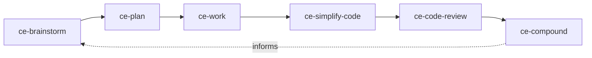

[Every's Compound Engineering plugin](https://github.com/EveryInc/compound-engineering-plugin/tree/6be0932b91dc369508da19e6e2bc753b4c038830) packages a complete engineering loop. This lesson is pinned to commit `6be0932b` and plugin version 3.27.0, checked on 2026-09-20.

Its distinctive idea is compounding: a solved, non-obvious problem becomes a durable `docs/solutions/` artifact that later planning can retrieve. The goal is not to run more agents; it is to make the next similar change easier and safer.

## Install and set up

For Claude Code:

```text
/plugin marketplace add EveryInc/compound-engineering-plugin
/plugin install compound-engineering
```

For the Codex CLI:

```bash
codex plugin marketplace add EveryInc/compound-engineering-plugin
codex plugin add compound-engineering@compound-engineering-plugin
```

Restart the host if required, then invoke `ce-setup` using the host's syntax. Claude-style hosts use `/ce-setup`; Codex uses `$ce-setup`. Review the proposed `.compound-engineering/config.yaml` before accepting it. Team configuration is tracked; checkout-local preferences belong in `config.local.yaml`. Never put credentials or command-line secrets in either file.

## The explicit loop



Run one small feature or bug through every stage:

```text
ce-brainstorm <problem and user outcome>
ce-plan
ce-work
ce-simplify-code
ce-code-review
ce-compound
```

At each boundary, inspect the artifact:

| Stage | Evidence to retain |
|---|---|
| Brainstorm / plan | requirements, alternatives, scope and verification command |
| Work | commits and host-owned test output |
| Simplify | behavior-preserving diff |
| Review | findings against the named fixed point |
| Compound | a reusable solution containing the failure, cause and verified repair |

`lfg` automates much of this pipeline and may push or open a pull request when a remote exists. Learn the explicit loop first. Merging is a separate authority and must not be inferred from an autonomous mode.

## How the three systems fit

| System | Primary role | Best first exercise |
|---|---|---|
| Matt Pocock skills | Small, composable engineering procedures | One tracer bullet from requirements to two-axis review |
| Sandcastle | Isolated agent execution and branch/commit handling | One Docker run, one named branch, one iteration |
| Compound Engineering | End-to-end lifecycle with durable learning | One small change from brainstorm through `ce-compound` |

Do not install overlapping workflow suites into the same first fixture. Learn each system's native vocabulary and artifacts. They can later be composed only after the boundary says who may write, commit, push, merge, use credentials, spend money and declare completion.

## Exercise

Choose a previously solved bug whose root cause is absent from the repository documentation. Reproduce the explicit loop in a disposable branch, then inspect the `docs/solutions/` entry. A second planning pass should be able to find the learning and avoid rediscovering the same cause. If it cannot, the loop has not compounded.

The exact commands above were verified against upstream source, but no plugin was installed and no model-backed run was performed while writing this lesson. Record such an experiment in the [journal](../journal/) before claiming it works in this repository.

