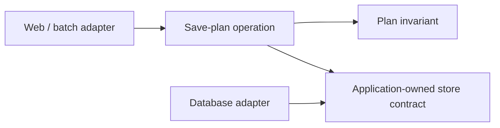

## Compare decisions, not shapes

The patterns overlap. A modular monolith can contain layered modules; one module can use onion dependency rules and hexagonal adapters. A deployment topology cannot be inferred from a concentric diagram.

The primary definitions come from [Microsoft's architecture guide](https://learn.microsoft.com/dotnet/architecture/modern-web-apps-azure/common-web-application-architectures), [Palermo's onion article](https://jeffreypalermo.com/2008/07/the-onion-architecture-part-1/), [Martin's clean architecture article](https://blog.cleancoder.com/uncle-bob/2012/08/13/the-clean-architecture.html), [Cockburn's ports and adapters article](https://alistair.cockburn.us/hexagonal-architecture) and the concrete module model in [Spring Modulith](https://docs.spring.io/spring-modulith/reference/fundamentals.html). The following comparison applies their ideas to our invented practice-plan case.

| Pattern | Main question | Practice-plan arrangement | Hidden cost / strongest counterargument |
|---|---|---|---|
| Layered | Which responsibilities call which? | Handler → application → data access; rule remains a separate function | Downward coupling can spread storage types; a small CRUD workflow may nevertheless need nothing more |
| Onion | Which dependencies are allowed toward the domain? | Plan rule at the center; save contract inward, storage implementation outward | An anemic domain may gain rings and mappings without useful behavior |
| Clean | Which policy owns a boundary? | Plan invariant, save use case, input/output models, external controller and persistence | A presenter and multiple models for one tiny response can obscure the work |
| Hexagonal | Which purposeful conversations cross inside/outside? | Web and batch drive `SavePlan`; store implements a driven save conversation | One interface per class adds indirection; ports should follow real conversations |
| Modular monolith | Who owns data and behavior inside one deployment? | Practice owns plans; Catalog owns shapes; Practice uses Catalog's public contract | Shared tables and internal imports can silently erase the boundary; enforcement is work |

Layering does not forbid dependency inversion. Onion need not use exactly four rings. Clean architecture's policy direction is not a demand for four projects. Hexagonal architecture does not require six ports. Spring Modulith is one implementation of module rules, not the definition of every modular monolith.

## Separate source dependencies from runtime calls

For an inward dependency design, the application owns `PlanStore`, and the database adapter implements it. At runtime the application still calls the adapter. Source dependency and control flow therefore point differently at this boundary.

These arrows denote **source dependencies**, not network requests. The composition root selects the database adapter. No dependency injection framework is necessary to demonstrate the rule.

In the modular candidate, Catalog can return an immutable shape summary and revision. Practice may not reach into Catalog's internal tables just because both run in one process. Decide explicitly whether one database transaction spans both modules; sharing a database does not automatically create independent ownership.

## Choose with a change probe

Add the batch importer, then simulate a storage API change. The layered candidate passes if validation is reused and storage changes stay contained. Add a port if a concrete external dependency blocks that outcome. Add a module boundary if separate ownership and a stable public contract justify it.

Reject the additional abstraction if it neither protects an invariant nor reduces the change's affected responsibilities. Retain it when an architecture check detects an otherwise easy violation. [Spring Modulith's verification rules](https://docs.spring.io/spring-modulith/reference/verification.html) illustrate checks for cycles and access to module internals; equivalent checks must match the language and repository actually used.

## Exercise — Two valid designs

Draw the save operation as (A) three layers in one project and (B) a Practice module with inward dependencies. For each, name one legal and one illegal dependency. Which should a two-person team select today?

Worked solution

A: the handler may call the application operation; a validation rule importing a web request type violates our chosen rule boundary. B: the database adapter may implement Practice's save contract; Catalog importing Practice's internal persistence model violates ownership. Both can satisfy the same behavior tests. Start with A under our assumptions unless the team can name and demonstrate an ownership violation B prevents. Team size alone is not decisive: a two-person team maintaining a complex, long-lived domain might justify B. Document that evidence instead of counting rings.

