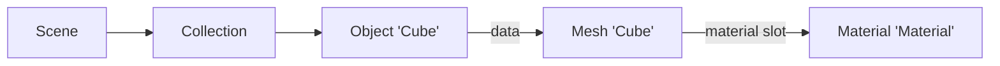

import { Tabs, TabItem } from '@astrojs/starlight/components';

Code: the lesson's script, [`scripts/l01_datablocks.py`](https://github.com/spareilleux/learn/blob/ced9808/code/blender/scripts/l01_datablocks.py), its report [`expected/l01_datablocks.txt`](https://github.com/spareilleux/learn/blob/ced9808/code/blender/expected/l01_datablocks.txt), and the runner [`check.sh`](https://github.com/spareilleux/learn/blob/ced9808/code/blender/check.sh).

## The version

[Blender](https://www.blender.org/) has two kinds of releases: a regular one every few months, and a **long-term support (LTS)** release, which keeps getting bug-fix updates long after the next regular releases. On 16 September 2026, the [LTS page](https://www.blender.org/download/lts/) lists two maintained LTS series, 5.2 and 4.5, both last updated on 15 September 2026, to 5.2.2 and 4.5.14.

The course pins **Blender 5.2.2 LTS**, commit [`d13f752e3b9c`](https://projects.blender.org/blender/blender/src/commit/d13f752e3b9c4f8c261cda552b1021f8bcc0382c) of the `blender-v5.2-release` branch. Blender is free software under the [GNU General Public License](https://www.blender.org/about/license/): the license covers the program, not what you make with it.

## Installing Blender

Blender publishes an archive per platform on [download.blender.org](https://download.blender.org/release/Blender5.2/), with a `blender-5.2.2.sha256` file that lists the checksum of each one. An archive needs no installer and changes nothing in the system, so you can keep several versions side by side; that is how this course installs it.

<Tabs syncKey="os">
<TabItem label="Windows">

Download `blender-5.2.2-windows-x64.zip` (404,453,484 bytes), check it, and extract it:

```powershell
Invoke-WebRequest https://download.blender.org/release/Blender5.2/blender-5.2.2-windows-x64.zip -OutFile blender-5.2.2-windows-x64.zip
(Get-FileHash blender-5.2.2-windows-x64.zip -Algorithm SHA256).Hash.ToLower()
# 3849d17a682cba006075aaa3f3597ecb5c9c30ec31035b2e092c53e40679b535
Expand-Archive blender-5.2.2-windows-x64.zip -DestinationPath G:\learn-lab\blender
G:\learn-lab\blender\blender-5.2.2-windows-x64\blender.exe --version
```

On the author's machine, `Get-FileHash` gave the hash above; the download and extraction commands are *to verify* as written, since the archive was downloaded and extracted another way. The site also has `.msi` and `.msix` installers, and a build for Windows on Arm. [winget](https://learn.microsoft.com/windows/package-manager/winget/) has the package `BlenderFoundation.Blender`, but on 16 September 2026 `winget show` still listed 5.2.1, one version behind: check the version before you rely on it (*to verify*: installing it with winget).

</TabItem>
<TabItem label="Linux / WSL">

Download `blender-5.2.2-linux-x64.tar.xz` (383,295,504 bytes), check it, and extract it:

```bash
curl -LO https://download.blender.org/release/Blender5.2/blender-5.2.2-linux-x64.tar.xz
curl -L https://download.blender.org/release/Blender5.2/blender-5.2.2.sha256 | grep linux-x64 | sha256sum -c
tar -xJf blender-5.2.2-linux-x64.tar.xz
./blender-5.2.2-linux-x64/blender --version
```

These are the commands of the course's CI job on Ubuntu. Blender is also published as a [Snap](https://snapcraft.io/blender) and on [Flathub](https://flathub.org/apps/org.blender.Blender) (*to verify*: both, and which version they carry). Under WSL, `--background` runs work as they do on Linux; the interface needs WSLg (*to verify*).

</TabItem>
<TabItem label="macOS">

Blender 5.2.2 ships for Apple Silicon only: the checksum file lists `blender-5.2.2-macos-arm64.dmg` (346,286,611 bytes) and no Intel build. Download it, check it, and copy the application out of the disk image:

```bash
curl -LO https://download.blender.org/release/Blender5.2/blender-5.2.2-macos-arm64.dmg
curl -L https://download.blender.org/release/Blender5.2/blender-5.2.2.sha256 | grep macos-arm64 | shasum -a 256 -c
hdiutil attach -nobrowse -mountpoint /tmp/blender-dmg blender-5.2.2-macos-arm64.dmg
cp -R /tmp/blender-dmg/Blender.app ~/Applications/
hdiutil detach /tmp/blender-dmg
~/Applications/Blender.app/Contents/MacOS/Blender --version
```

These are the commands of the course's CI job on macOS. Opening the `.dmg` in Finder and dragging Blender to Applications does the same.

</TabItem>
</Tabs>

On the author's machine:

```text
$ blender --version
Blender 5.2.2 LTS
	build date: 2026-09-15
	build time: 01:37:04
	build commit date: 2026-09-14
	build commit time: 15:14
	build hash: d13f752e3b9c
	build branch: blender-v5.2-release
	build platform: Windows
	build type: Release
```

The full output goes on with the compiler and linker flags.

## Blender without a window

Blender is an application, but its executable is also a command-line tool. The [command-line arguments](https://docs.blender.org/manual/en/5.2/advanced/command_line/arguments.html) that matter for this course are:

- `--background` (`-b`): no window. The Python scripts run, then Blender quits.
- `--factory-startup`: ignore your preferences and your startup file, and start from the factory scene. Two machines then start from the same state.
- `--python <file>` and `--python-expr <code>`: run a script.
- `--python-exit-code 1`: exit with code 1 if the script raises an exception. Without it, Blender prints the traceback and exits with 0, and CI can't tell.
- `--`: everything after it is left to the script, in `sys.argv`.

```text
$ blender --background --factory-startup --python-expr "import bpy; print([o.name for o in bpy.data.objects])"
['Camera', 'Cube', 'Light']
Blender 5.2.2 LTS (hash d13f752e3b9c built 2026-09-15 01:37:04)

Blender quit
```

In this run, the script's output came before Blender's banner. Every script in this course runs like this, from `check.sh`:

```bash
blender --background --factory-startup --python-exit-code 1 --python scripts/l01_datablocks.py -- out
```

## The interface

Start Blender without `--background`. The first time, a Quick Setup dialog asks for the language, theme and keymap; keep the defaults, which the manual and this course use.


The window is divided into **areas**, and each area shows an **editor**: the [3D Viewport](https://docs.blender.org/manual/en/5.2/editors/3dview/index.html) in the middle, the [Outliner](https://docs.blender.org/manual/en/5.2/editors/outliner/interface.html) at the top right (the scene's tree), the [Properties editor](https://docs.blender.org/manual/en/5.2/editors/properties_editor.html) below it, and the Timeline at the bottom. The menu at the top left of each area changes its editor type. The tabs along the top (Layout, Modeling, Sculpting, UV Editing, Shading…) are [workspaces](https://docs.blender.org/manual/en/5.2/interface/window_system/workspaces.html): saved arrangements of areas for one task, like an IDE's perspectives.

A few shortcuts from the default keymap ([`blender_default.py`](https://projects.blender.org/blender/blender/src/commit/d13f752e3b9c4f8c261cda552b1021f8bcc0382c/scripts/presets/keyconfig/keymap_data/blender_default.py)) cover most of navigation. Shortcuts act on the area under the mouse pointer, not on the area you last clicked:

| Action | Shortcut |
|---|---|
| Orbit, pan, zoom the view | middle mouse drag, Shift + middle mouse drag, wheel |
| Frame the selection | numpad `.` |
| Front, right, top views | numpad `1`, `3`, `7` (Ctrl for the opposite side) |
| Move, rotate, scale the selection | `G`, `R`, `S`, then optionally `X`, `Y` or `Z` to lock an axis |
| Switch between Object Mode and Edit Mode | `Tab` |
| Search for any command | `F3` |
| Maximize the area under the pointer | `Ctrl` + `Space` |
| Duplicate, linked duplicate | `Shift` + `D`, `Alt` + `D` |

Object Mode works on whole objects; Edit Mode works on the vertices, edges and faces of one mesh (lesson 2). The manual's [navigation page](https://docs.blender.org/manual/en/5.2/editors/3dview/navigate/index.html) covers the rest, including laptops without a numpad or a middle button.

Two things help a developer. In **Edit › Preferences › Interface**, turn on [**Python Tooltips**](https://docs.blender.org/manual/en/5.2/editors/preferences/interface.html): a field's tooltip then shows its Python information, such as `bpy.data.objects["Cube"].location`. And the **Scripting** workspace has a Python console, next to an [Info editor](https://docs.blender.org/manual/en/5.2/editors/info_editor.html) that logs the operators you run.

## The .blend file is a database

Save the scene and you get a `.blend` file. It is not a document with a fixed structure: it is closer to a database, with one table per type of **data-block**. The [manual](https://docs.blender.org/manual/en/5.2/files/data_blocks.html) calls them data-blocks, the Python API calls them [`ID`](https://docs.blender.org/api/5.2/bpy.types.ID.html)s, and `bpy.data` gives access to all the tables. The script prints the ones that aren't empty in the factory scene:

```text
== What bpy.data holds (non-empty collections)
bpy.data.cameras: ['Camera']
bpy.data.scenes: ['Scene']
bpy.data.objects: ['Camera', 'Cube', 'Light']
bpy.data.materials: ['Dots Stroke', 'Material']
bpy.data.meshes: ['Cube']
bpy.data.lights: ['Light']
bpy.data.screens: ['Animation', 'Compositing', 'Geometry Nodes', 'Layout', 'Modeling', 'Rendering', 'Scripting', 'Sculpting', 'Shading', 'Texture Paint', 'UV Editing']
bpy.data.window_managers: ['WinMan']
bpy.data.images: ['Render Result', 'Viewer Node']
bpy.data.worlds: ['World']
bpy.data.collections: ['Collection']
bpy.data.palettes: ['Palette']
bpy.data.linestyles: ['LineStyle']
bpy.data.workspaces: ['Animation', 'Compositing', 'Geometry Nodes', 'Layout', 'Modeling', 'Rendering', 'Scripting', 'Sculpting', 'Shading', 'Texture Paint', 'UV Editing']
```

The workspaces and screens are in the list: the interface layout is saved in the file, next to the scene. `Dots Stroke` is the default material for Grease Pencil, Blender's 2D drawing objects.

### Objects and their data

An **object** holds where something is (location, rotation, scale, parent) and points to its **data**, which holds what it is: a mesh, a camera, a light. The material is a third data-block, which the mesh points to:

```text
== The factory startup scene
scene 'Scene' engine BLENDER_EEVEE frames 1 - 250
collection 'Scene Collection' objects []
  collection 'Collection' objects ['Camera', 'Cube', 'Light']
object 'Camera' type CAMERA data Camera 'Camera' location (7.359, -6.926, 4.958)
object 'Cube' type MESH data Mesh 'Cube' location (0.000, 0.000, 0.000)
object 'Light' type LIGHT data PointLight 'Light' location (4.076, 1.005, 5.904)

== An object points to its data
cube.data is bpy.data.meshes['Cube']: True
mesh 'Cube' vertices 8 edges 12 faces 6 loops 24
material slots [('DATA', 'Material')]
users: object 1 mesh 1 material 1
```



In C# or Java terms, an object and its mesh are two instances, and the object holds a reference to the mesh. The difference is that Blender counts the references: each data-block has a `users` count, like a COM object's reference count or a `shared_ptr`'s use count.

### Linked and full duplicates

**Shift + D** duplicates an object and, by default, its mesh. **Alt + D** makes a *linked duplicate*: a new object that points to the same mesh. Which data Shift + D copies is a preference (Edit › Preferences › Editing › Duplicate Data): meshes and lights yes, materials no. The script does both by hand:

```python
linked = cube.copy()  # a new object, the same mesh
full = cube.copy()
full.data = mesh.copy()  # a new object and a new mesh
```

```text
== Linked duplicate (Alt+D) and full duplicate (Shift+D)
after the linked duplicate: objects 4 meshes 1 mesh users 2
after the full duplicate: meshes [('Cube', 2), ('Cube.001', 1)]
the material is shared by both meshes: material users 2
```

Editing the mesh of a linked duplicate in Edit Mode changes every object that uses it. The course's fretboard (lesson 2) uses this for its 22 frets: one mesh, 22 objects.

### Orphans, fake users, and what saving keeps

Removing an object doesn't remove its mesh. The mesh stays in `bpy.data` with zero users, an **orphan**. Blender doesn't free it while the file is open, but **saving skips data-blocks that have no users**. To keep a data-block with no users, give it a **fake user** (the shield icon next to its name), which counts as one user:

```text
== Orphans and fake users
after removing the object 'Full': meshes [('Cube', 2), ('Cube.001', 0)]
a new mesh with a fake user: users 1 use_fake_user True
meshes written to the file: ['Cube', 'Kept']
objects written to the file: ['Camera', 'Cube', 'Light', 'Linked']
orphans_purge: {'FINISHED'} meshes left [('Cube', 2), ('Kept', 1)]
```

`bpy.data.libraries.load` opens a `.blend` file and lists what it contains without loading it: the orphan `Cube.001` wasn't written. **File › Clean Up › Purge Unused Data** (`bpy.ops.outliner.orphans_purge`) removes orphans from the open file.

This is a garbage collector that runs when you save, with reference counts instead of reachability. It surprises people who expect a saved file to hold what they see in the outliner's *Blender File* view: a material you made and haven't assigned yet is gone after saving and reopening.

### Names

A data-block's name is its key in its table, so names are unique per type, not across types. Blender adds `.001`, `.002` to resolve a clash. Names are limited to 255 bytes: [`DNA_ID.h`](https://projects.blender.org/blender/blender/src/commit/d13f752e3b9c4f8c261cda552b1021f8bcc0382c/source/blender/makesdna/DNA_ID.h#L366-L367) reserves 2 characters for the type code and 256 for the name, with its terminating zero.

```text
== Names are unique per type
D.meshes.new('Cube').name: 'Cube.001'
a material may also be called 'Cube': 'Cube'
a 300-character name is cut to 255 characters
```

Scripts should keep the object `new` returns, not look it up again by the name they asked for.

## RNA: properties that describe themselves

Every field you see in the interface is an **RNA property**, Blender's reflection layer. The Python API, the interface, animation and drivers all go through it. Each property carries metadata, like a C# `PropertyInfo` with attributes, or a JavaBeans `PropertyDescriptor`:

```text
== RNA: properties describe themselves
Object.location: type FLOAT subtype TRANSLATION unit LENGTH array_length 3
default [0.0, 0.0, 0.0]
repr(cube): bpy.data.objects['Cube']
repr(cube.location): Vector((0.0, 0.0, 0.0))
path_from_id('location'): location
path_resolve('location'): Vector((0.0, 0.0, 0.0))
Object has 141 RNA properties; Mesh has 71
an ID's own properties: ['rna_type', 'name', 'name_full', 'id_type', 'session_uid', 'is_evaluated', 'original', 'users']
```

The subtype `TRANSLATION` and the unit `LENGTH` are why the interface shows `location` as three distances in meters. The `repr` of a data-block is the Python expression that finds it again, and `path_from_id` gives the *data path* of a property from its data-block: lesson 7 animates properties through those paths. The [API overview](https://docs.blender.org/api/5.2/info_overview.html) and its [gotchas page](https://docs.blender.org/api/5.2/info_gotcha.html) are worth reading once.

| Blender | C# or Java |
|---|---|
| `bpy.data.meshes`, `bpy.data.objects`… | one table or `DbSet` per type |
| data-block (`ID`) with `users` | a reference-counted object |
| object → data → material | objects holding references to shared instances |
| orphans skipped when saving | garbage collection at serialization time |
| fake user | a GC root |
| RNA property with subtype and unit | `PropertyInfo` with attributes, `PropertyDescriptor` |

## Key takeaways

- Blender 5.2.2 LTS installs from an archive checked against `blender-5.2.2.sha256`; `--background --factory-startup --python-exit-code 1` runs a script reproducibly and fails when the script fails.
- The window is made of areas showing editors; workspaces are saved layouts, and they are stored in the `.blend` file too.
- A `.blend` file is a database of data-blocks, one table per type, with names unique per type.
- Objects point to data, and data to materials; each data-block counts its users.
- Saving skips data-blocks with no users, unless they have a fake user.
- RNA describes every property, and it is what the Python API, the interface and animation share.

## Exercises

1. In the factory scene, remove the `Cube` object, save, and open the file again. Which meshes and materials does the file contain, and with how many users?
2. Make a linked duplicate of the cube. Which API lists, for the mesh and the material, the data-blocks that use them?
3. Before running it, predict what `blender --background --factory-startup --python-expr "import bpy; bpy.data.objects.remove(bpy.data.objects['Cube']); print(len(bpy.data.meshes))"` prints, and why.

<details>
<summary>Solution 1</summary>

```text
== Exercise 1: remove the Cube object, save, and reload
before saving: mesh 'Cube' users 0 | material 'Material' users 1
after reloading: meshes [] | materials [('Material', 0)]
```

The orphan mesh isn't written. The material is: when saving, the orphan mesh still counted as one user. After reloading, the mesh is gone, so the material has no users; it will be dropped at the next save.

</details>

<details>
<summary>Solution 2</summary>

[`bpy.data.user_map`](https://docs.blender.org/api/5.2/bpy.types.BlendData.html#bpy.types.BlendData.user_map) returns, for each data-block, the set of data-blocks that use it:

```python
users = bpy.data.user_map(subset=[bpy.data.meshes["Cube"], bpy.data.materials["Material"]])
```

```text
== Exercise 2: who uses a data-block?
bpy.data.meshes['Cube'] is used by ["bpy.data.objects['Cube']", "bpy.data.objects['Twin']"]
bpy.data.materials['Material'] is used by ["bpy.data.meshes['Cube']"]
```

</details>

<details>
<summary>Solution 3</summary>

It prints `1`. Removing the object leaves the mesh in `bpy.data.meshes`, with zero users; only saving, or purging, would drop it.

</details>

## Sources

- Blender, [LTS releases](https://www.blender.org/download/lts/), [license](https://www.blender.org/about/license/), and the [5.2.2 downloads](https://download.blender.org/release/Blender5.2/).
- Blender 5.2 manual: [installing](https://docs.blender.org/manual/en/5.2/getting_started/installing/index.html), [command-line arguments](https://docs.blender.org/manual/en/5.2/advanced/command_line/arguments.html), [interface](https://docs.blender.org/manual/en/5.2/interface/index.html), [keymap](https://docs.blender.org/manual/en/5.2/interface/keymap/index.html), [data-blocks](https://docs.blender.org/manual/en/5.2/files/data_blocks.html), [linked duplicates](https://docs.blender.org/manual/en/5.2/scene_layout/object/editing/duplicate_linked.html).
- Blender 5.2 Python API: [`ID`](https://docs.blender.org/api/5.2/bpy.types.ID.html), [`BlendDataLibraries`](https://docs.blender.org/api/5.2/bpy.types.BlendDataLibraries.html), [overview](https://docs.blender.org/api/5.2/info_overview.html), [gotchas](https://docs.blender.org/api/5.2/info_gotcha.html).
- Blender source at 5.2.2: [`DNA_ID.h`](https://projects.blender.org/blender/blender/src/commit/d13f752e3b9c4f8c261cda552b1021f8bcc0382c/source/blender/makesdna/DNA_ID.h), [`blender_default.py`](https://projects.blender.org/blender/blender/src/commit/d13f752e3b9c4f8c261cda552b1021f8bcc0382c/scripts/presets/keyconfig/keymap_data/blender_default.py).
