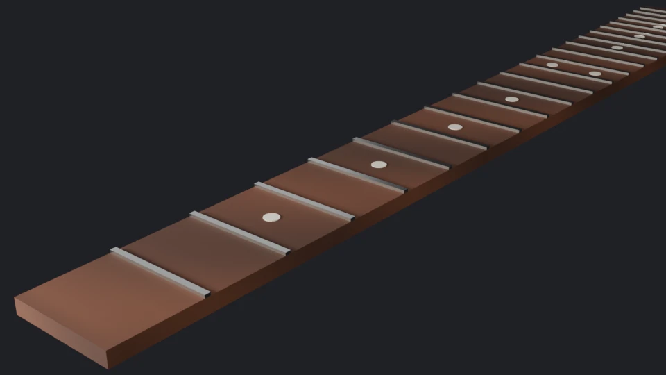
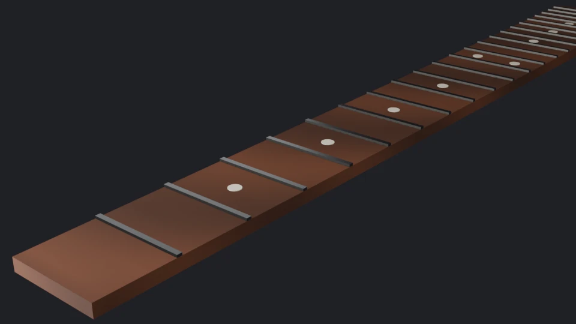
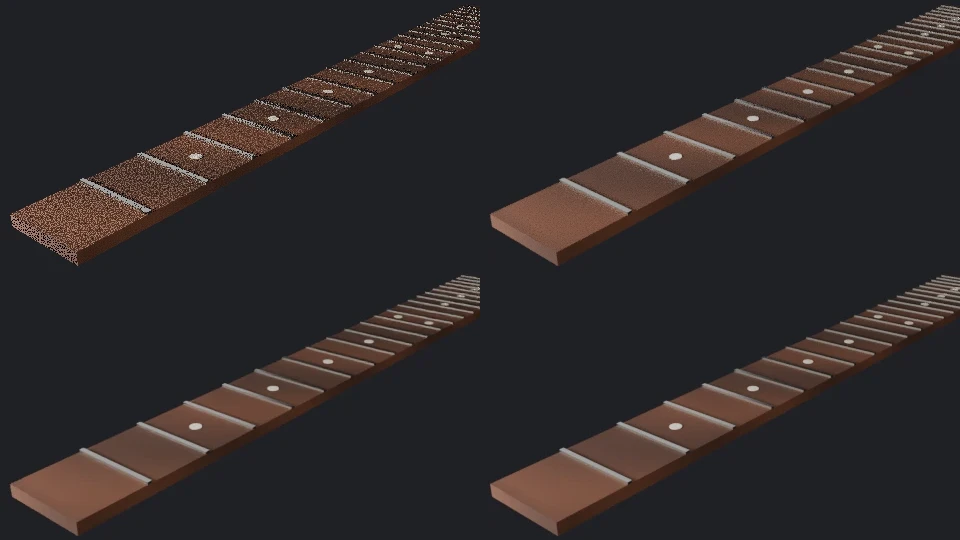

Code: the lesson's script, [`scripts/l04_render.py`](https://github.com/spareilleux/learn/blob/ced9808/code/blender/scripts/l04_render.py), the scene in [`scripts/stage.py`](https://github.com/spareilleux/learn/blob/ced9808/code/blender/scripts/stage.py), the images in [`scripts/render_images.py`](https://github.com/spareilleux/learn/blob/ced9808/code/blender/scripts/render_images.py), and the report, [`expected/l04_render.txt`](https://github.com/spareilleux/learn/blob/ced9808/code/blender/expected/l04_render.txt).

## Lights

Blender has four [light types](https://docs.blender.org/manual/en/5.2/render/lights/light_object.html): **point**, **spot**, **area** and **sun**. A point, spot or area light's power is in watts, and a sun's strength in watts per square meter, since it lights everything from infinitely far away. These are watts of radiant power, the light actually emitted, not the electrical watts on a bulb's box. Light from a point, spot or area light falls off with the square of the distance.

An **area light** emits from a rectangle or a disk. The larger it is compared with its distance to the object, the softer the shadows and the broader the highlights, as with a photographer's softbox. The size doesn't change the power: a larger light at the same wattage spreads it over more area.

[`stage.py`](https://github.com/spareilleux/learn/blob/ced9808/code/blender/scripts/stage.py) lights the fretboard the way a studio lights a product, with **three-point lighting**: a *key* light that gives the main shape and shadows, a weaker *fill* light on the other side that lifts the shadows, and a *rim* light behind that outlines the edges against the background:

```text
== Lights and camera
Fill: AREA 0.6 W size 0.50 m color (0.85, 0.90, 1.00) location (0.35, 0.45, 0.25)
Key: AREA 3.0 W size 0.25 m color (1.00, 0.95, 0.88) location (0.05, -0.45, 0.45)
Rim: AREA 4.0 W size 0.10 m color (1.00, 1.00, 1.00) location (-0.25, 0.20, 0.12)
camera: lens 50.0 mm sensor 36.0 mm horizontal field of view 39.6 degrees location (-0.120, -0.200, 0.140)
world background: (0.020, 0.020, 0.025) strength 1.00
```

The key is slightly warm and the fill slightly cool, a common choice. The watts look small because the scene is small: the lights are 30 to 65 cm from a fretboard 48 cm long. The first version used 12, 3 and 15 W, and the render was so bright that the rosewood looked gray. The **world** is the environment around the scene: here a dark, almost black gray, which also lights the scene a little from every direction.

Lights and cameras look down their local −Z axis. The script aims them with a quaternion:

```python
def aim(obj, target):
    """Points an object's -Z axis (where cameras and lights look) at a target, with +Y up."""
    direction = Vector(target) - obj.location
    obj.rotation_euler = direction.to_track_quat("-Z", "Y").to_euler()
```

A **Track To** constraint does the same and follows the target when it moves; lesson 7 covers constraints. The camera's 50 mm lens on the default 36 mm sensor gives a horizontal field of view of 2 × atan(18 / 50) = 39.6°, a "normal" lens in photography.

## From light values to pixels: the view transform

A renderer computes **scene-referred** values: linear quantities of light, from 0 to far above 1 in a highlight. A screen shows **display-referred** values: 8 bits per channel, in sRGB. The [view transform](https://docs.blender.org/manual/en/5.2/render/color_management/displays_views.html) converts one into the other:

```text
== Color management
display device sRGB | view transform AgX | look None | exposure 0.0 | gamma 1.0
```

The default, **AgX**, is a tone-mapping curve that the manual describes as improving on Filmic, with 16.5 stops of dynamic range, and desaturating very bright colors the way film does. **Standard** applies only the sRGB curve and clips everything above 1. The choice changes the PNG and the image on screen, but not the linear values an EXR file keeps (exercise 3). three.js has the same pipeline and offers AgX too ([three.js lesson 3](../../threejs/03-color-tone-mapping-environments/)).

## Two render engines

Blender 5.2 ships three engines, `BLENDER_EEVEE`, `BLENDER_WORKBENCH` and `CYCLES`. Workbench draws the viewport's solid shading. The other two render the same scenes and the same shader nodes, in two different ways:

- **[EEVEE](https://docs.blender.org/manual/en/5.2/render/eevee/index.html)** is a **rasterizer**, like a game engine or three.js: it draws each triangle on the GPU and approximates shadows, reflections and indirect light with techniques that cost a fixed amount per frame. It is fast and interactive, and it renders through the GPU, also in the background: the course's CI, which has no GPU, doesn't run it (*to verify*: EEVEE on a machine without one).
- **[Cycles](https://docs.blender.org/manual/en/5.2/render/cycles/index.html)** is a **path tracer**: for each pixel it follows random light paths through the scene, bouncing off surfaces, and averages them. It is physically based: soft shadows, reflections and indirect light come out right without tricks, but the result is noisy until enough paths have been averaged. It runs on the CPU, or on a GPU through CUDA or OptiX (NVIDIA), HIP (AMD), oneAPI (Intel) or Metal (Apple), as the [GPU rendering page](https://docs.blender.org/manual/en/5.2/render/cycles/gpu_rendering.html) lists.





On the author's machine, an Intel Core Ultra 9 285K (24 threads) and an RTX 5080 with driver 610.88, both renders at 960 × 540 took:

| Render | 1st Blender process | 2nd process | 3rd process |
|---|---|---|---|
| Cycles, CPU, 256 samples, denoised | 4.01 s | 4.40 s | 4.05 s |
| Cycles, GPU with OptiX, 256 samples, denoised | 3.08 s | 1.89 s | 1.45 s |
| EEVEE, 64 samples | 11.78 s | 1.14 s, then 0.19 s | 0.92 s, then 0.28 s |

Each figure is the duration of one call to `bpy.ops.render.render` in [`render_images.py`](https://github.com/spareilleux/learn/blob/ced9808/code/blender/scripts/render_images.py), run three times as separate Blender processes; the second and third runs rendered EEVEE twice. The first EEVEE render compiled the scene's shaders. The later processes took about a second for their first EEVEE render, which suggests a shader cache on disk (*to verify*), and the second render in the same process took a fraction of that. The GPU was slower on its first run too. At this size and on this scene, the GPU beats the CPU by a factor of about 3 and EEVEE beats both, once warm. These are single runs on one scene, not a benchmark.

## Cycles: noise and samples

A pixel's value in Cycles is a **Monte Carlo estimate**: the average of N random samples. The error of such an average shrinks like 1/√N, so halving the noise takes four times the samples. The script checks it. It renders the scene at 160 × 90 with 4096 samples as a reference, then with fewer samples, with adaptive sampling and denoising turned off, saves each render as a 32-bit EXR, and measures the root mean square difference of the linear values from the reference:

```text
== Cycles settings
device CPU | samples 4096 | adaptive True threshold 0.010 | denoise True OPENIMAGEDENOISE | seed 0 | max bounces 12 | clamp indirect 10.0

== Noise against the sample count (160 x 90, no adaptive sampling, no denoising)
reference: 4096 samples, mean linear RGB (0.051, 0.036, 0.036)
   1 samples: RMS difference from the reference 0.0519
   4 samples: RMS difference from the reference 0.0233 | previous / this 2.23
  16 samples: RMS difference from the reference 0.0122 | previous / this 1.90
  64 samples: RMS difference from the reference 0.0065 | previous / this 1.88
 256 samples: RMS difference from the reference 0.0028 | previous / this 2.29
```

Each fourfold increase divides the error by about 2, as 1/√N predicts. The ratios wander between 1.88 and 2.29 because the reference has its own noise, and a 160 × 90 image is a small sample. The first line shows the factory defaults: 4096 samples at most ([`properties.py`](https://projects.blender.org/blender/blender/src/commit/d13f752e3b9c4f8c261cda552b1021f8bcc0382c/intern/cycles/blender/addon/properties.py#L485-L490)), adaptive sampling, and denoising.



Top left, 1 sample; top right, 16; bottom left, 16 with OpenImageDenoise; bottom right, 256.

### Adaptive sampling

With [adaptive sampling](https://docs.blender.org/manual/en/5.2/render/cycles/render_settings/sampling.html), Cycles stops sampling a pixel once its estimated noise falls under the **noise threshold**, so flat background pixels stop early and the edges of the frets keep going. The sample count becomes a maximum. Exercise 2 measures what it saves.

### The seed

The random numbers come from a sampler initialized with a **seed**, like `new Random(seed)` in C# or Java. The same seed gives the same image; another seed gives the same average with a different noise pattern:

```text
== The seed
16 samples, seed 0 twice: identical True | seed 0 and seed 1: identical False RMS between them 0.0173
```

For an animation, **Use Animated Seed** changes the seed on each frame, because a noise pattern that stays still while the image moves is more visible than one that changes.

Reproducibility goes further than one machine. The script saves the 16-sample render as an 8-bit PNG and hashes its pixels:

```text
== The same render, 8 bits after the view transform
pixels sha256 52b315b4edce59f3eaad17709705db365ed4cefa92c2c5a15053bef2d06be536
mean 8-bit RGB (48.5, 42.5, 43.4)
```

`check.sh` compares that hash, and in the course's CI it is the same on Windows and Linux on x86-64 and on macOS on Apple Silicon ([run 35172142583](https://github.com/spareilleux/learn/actions/runs/35172142583)): the CPU renders of this scene are bit-identical across the three OSes and two CPU architectures. That was a result, not an assumption; the script first printed the hash without comparing it, until a CI run showed the three matched. GPU renders were not compared.

### Denoising

A denoiser is a neural network that estimates the clean image from a noisy render, using extra passes such as the surfaces' colors and normals. Cycles offers Intel's [OpenImageDenoise](https://www.openimagedenoise.org/), on the CPU or a GPU, and NVIDIA's OptiX denoiser:

```text
== Denoising
16 samples + OpenImageDenoise: RMS difference from the reference 0.0101 | without: 0.0122
```

The denoised image looks far cleaner than the noisy one, as the image above shows, but its error against the reference is only about 17 % lower. The noise is gone, but the denoiser has to guess the detail under it, and at 160 × 90 the frets and inlays are a few pixels wide: its guesses are smooth, not exact. Denoising helps most when the details are large compared with the pixels, and a few more samples help it guess better.

## Key takeaways

- Point, spot and area lights are in watts of radiant power, the sun in watts per square meter; the size of an area light sets how soft its shadows are.
- Renders are linear; the view transform, AgX by default, maps them to the display, and an EXR keeps the linear values.
- EEVEE rasterizes on the GPU and is fast once its shaders are compiled; Cycles path-traces on the CPU or GPU and is physically based but noisy.
- Cycles noise falls like 1/√N: four times the samples for half the noise. Adaptive sampling spends samples where the noise is.
- A fixed seed gives identical renders; here the CPU render was bit-identical on Windows, Linux and macOS.
- Denoising removes noise, not error: it guesses the detail it can't see.

## Exercises

1. Double the key light's power, render 256 samples, and compare the mean linear RGB with the reference. Why doesn't the mean double?
2. Turn adaptive sampling on with a noise threshold of 0.01 and at most 4096 samples. How does its error compare with 256 samples without it, and how long does it take?
3. Switch the view transform to **Standard** and render 16 samples again, to a PNG and to an EXR. What changes?

<details>
<summary>Solution 1</summary>

```text
== Exercise 1: twice the key light
mean linear RGB at 256 samples: key 6 W (0.063, 0.041, 0.039) | key 3 W (reference) (0.051, 0.036, 0.036)
```

The mean rises by about 24 % in red, not 100 %. Light adds up: the fill, the rim and the world didn't change, and much of the image is background that the key doesn't reach. Doubling a light doubles only its own contribution.

</details>

<details>
<summary>Solution 2</summary>

```text
== Exercise 2: adaptive sampling
adaptive, threshold 0.01, at most 4096 samples: RMS difference from the reference 0.0018
```

Its error, 0.0018, is lower than that of 256 samples (0.0028). On the author's machine it took 0.26 s against 1.40 s for the 4096-sample reference without adaptive sampling, and about 0.1 s for 256 samples. The timings are the lines `check.sh` doesn't compare.

</details>

<details>
<summary>Solution 3</summary>

```text
== Exercise 3: the Standard view transform
mean 8-bit RGB: Standard (54.5, 48.3, 49.8) | AgX (48.5, 42.5, 43.4)
the linear EXR is the same under both view transforms: True
```

The PNG is brighter with Standard: AgX compresses the tones to leave room for highlights, and Standard doesn't. The EXR is identical, because it holds the linear values from before the view transform.

</details>

## Sources

- Blender 5.2 manual: [light objects](https://docs.blender.org/manual/en/5.2/render/lights/light_object.html), [displays and views](https://docs.blender.org/manual/en/5.2/render/color_management/displays_views.html), [EEVEE](https://docs.blender.org/manual/en/5.2/render/eevee/index.html), [Cycles](https://docs.blender.org/manual/en/5.2/render/cycles/index.html), [sampling](https://docs.blender.org/manual/en/5.2/render/cycles/render_settings/sampling.html), [GPU rendering](https://docs.blender.org/manual/en/5.2/render/cycles/gpu_rendering.html), [light paths](https://docs.blender.org/manual/en/5.2/render/cycles/render_settings/light_paths.html).
- Blender source at 5.2.2: Cycles' render settings in [`intern/cycles/blender/addon/properties.py`](https://projects.blender.org/blender/blender/src/commit/d13f752e3b9c4f8c261cda552b1021f8bcc0382c/intern/cycles/blender/addon/properties.py).
- [OpenImageDenoise](https://www.openimagedenoise.org/).
- M. Pharr, W. Jakob, G. Humphreys, [Physically Based Rendering: From Theory to Implementation](https://pbr-book.org/), 4th edition, chapter 2 on Monte Carlo integration.
