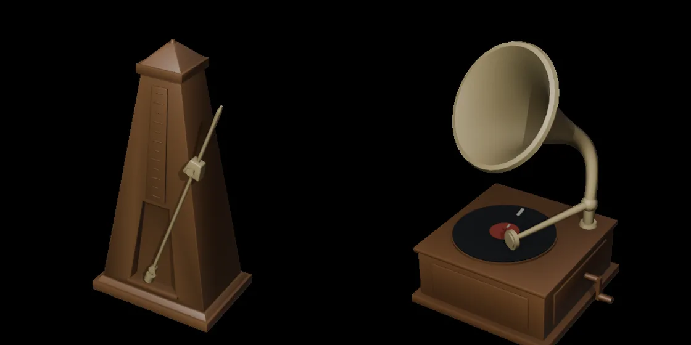

## Progress

- [x] Blender 5.2.2 LTS (commit `d13f752e3b9c`), installed from the portable archive
- [x] `check.sh`: each lesson's `bpy` script run with `--background --factory-startup`, its report compared with `expected/`
- [x] CI on Ubuntu, Windows and macOS, with Cycles on the CPU
- [x] Lesson 1: the interface, and the .blend file as a database
- [x] Lesson 2: polygonal modeling and modifiers
- [x] Lesson 3: materials, UVs, and what glTF keeps of them
- [x] Lesson 4: lights, cameras, and rendering with EEVEE and Cycles
- [x] French and Spanish translations
- [x] A cleanup pipeline for `.glb` models generated in ComfyUI, tried on two Hunyuan3D models
- [x] Two procedural models in `bpy`, compared with the generated ones
- [ ] Lesson 5: scripting with `bpy`

## 2026-09-16 — Versions and setup

- Blender's LTS page lists 5.2.2 and 4.5.14, both released on 15 September 2026. The course pins 5.2.2, tag `v5.2.2`, commit `d13f752e3b9c4f8c261cda552b1021f8bcc0382c`.
- The Windows archive is 404,453,484 bytes, and its SHA-256 matches `blender-5.2.2.sha256`. It is extracted on a separate drive, and nothing is installed in the system.
- winget still offered 5.2.1 on the day of 5.2.2's release. The checksum file lists no Intel build for macOS, only `macos-arm64`.
- The pages of projects.blender.org answer `403` to `curl`, but its API doesn't: `/api/v1/repos/blender/blender/raw/<path>?ref=<sha>` returned the files at the pinned commit. The Python files quoted in the lessons (the glTF exporter, Cycles' properties) are identical to the ones in the installed build, apart from line endings.
- Lesson 1 order: `bpy` comes into every lesson from the first one, instead of waiting for lesson 5; the mission explains why.

## 2026-09-16 — Scripts, CI and what they showed

- The first CI run passed on all three OSes. Each job took about a minute, of which `check.sh` took 25 to 27 s; the rest is the download (about 350 to 400 MB) and unpacking. The 4096-sample reference render of lesson 4 took 13 to 18 s on the runners, against 1.4 s on the author's 24-thread CPU.
- The hash of the 16-sample Cycles render, 8-bit after AgX, was the same on Windows and Linux on x86-64 and on macOS on Apple Silicon. `check.sh` first printed it without comparing; after that run, it compares it.
- The `.blend` file saved by lesson 1 is 96,061 bytes on the author's machine and on the Linux runner, 96,053 on the Windows runner and 96,055 on the macOS one: its size isn't compared.
- The generated rosewood texture was far too dark at first. `Image.pixels` on an 8-bit sRGB image stores the given values as bytes, without conversion, and the script had converted the color to linear first. Lesson 3 tells the story.
- The glTF exporter dropped a Noise Texture connected to the Roughness without a message in its log, leaving glTF's default roughness of 1. It doesn't apply modifiers unless `export_apply` is set. And `export_format="GLTF_EMBEDDED"` is refused unless a preference of the add-on enables it, although the manual documents the format.
- In 5.2, reading `Material.use_nodes` prints a `DeprecationWarning`: it will be removed in 6.0. `RenderSettings.engine`'s enum, read from the class, lists only `BLENDER_EEVEE`, while setting `BLENDER_WORKBENCH` or `CYCLES` works.
- The first lights (12, 3 and 15 W) were far too strong for a scene half a meter wide; the lesson uses 3, 0.6 and 4 W.

## 2026-09-16 — Images

- The renders come from `scripts/render_images.py`: Cycles on the CPU for the lesson images, and Cycles with OptiX and EEVEE for the timings, run under the machine's GPU lock since other work shares the GPU.
- The interface screenshot comes from Blender started with a window and a script that selects the cube, moves the pointer out of the way, and calls `bpy.ops.screen.screenshot` from a timer. With `--factory-startup`, the Quick Setup splash covered the viewport, so the capture used a separate user configuration folder (`BLENDER_USER_CONFIG`) whose preferences turn the splash off. Quitting from the script still wrote `quit.blend` to the system's temporary folder.

## 2026-09-17 — Models generated in ComfyUI, cleaned in Blender

The request: real 3D models from ComfyUI, brought into Blender and shown here with what went wrong. The generation is the work of Atlas, another working session of this project, with its script `objets.py` (not published): it made a metronome and a gramophone with ComfyUI (see the [ComfyUI course](../../comfyui/)), in two steps:

1. [SDXL base 1.0](https://huggingface.co/stabilityai/stable-diffusion-xl-base-1.0) drew each object alone on a white background, seen three-quarters from slightly above: 1024 × 1024 px, 30 steps, CFG 6.5, `dpmpp_2m` with the `karras` scheduler, seeds 5101 (metronome) and 5110 (gramophone).
2. [Hunyuan3D 2.0](https://github.com/Tencent-Hunyuan/Hunyuan3D-2), with the fp16 weights repackaged by Comfy-Org ([`hunyuan3d-dit-v2_fp16`](https://huggingface.co/Comfy-Org/hunyuan3D_2.0_repackaged)) and ComfyUI's native nodes ([Comfy's tutorial](https://docs.comfy.org/tutorials/3d/hunyuan3D-2)), turned each image into a mesh: `ImageOnlyCheckpointLoader` → `CLIPVisionEncode` (crop `center`) → `Hunyuan3Dv2Conditioning` → `EmptyLatentHunyuan3Dv2` (resolution 3072) → `KSampler` (30 steps, CFG 5, `euler`/`normal`, seed 7) → `VAEDecodeHunyuan3D` (8000 chunks, octree resolution 380) → `VoxelToMesh` (surface net, threshold 0.6) → `SaveGLB`. ComfyUI v0.36.0.

The Hunyuan3D 2.0 license doesn't apply in the European Union, the United Kingdom and South Korea, and its clause 5.c forbids displaying outputs outside that territory. This site can be read there, so neither the models nor renders of them are published here: the findings below are described in words.

The cleanup pipeline was written for this course by L2, the session that writes it. Blender ran [`scripts/glb_pipeline.py`](https://github.com/spareilleux/learn/blob/9480173/code/blender/scripts/glb_pipeline.py) in the background on each file. It merges vertices by distance, removes floating parts, recalculates normals, scales to a real size, decimates, reports the mesh before and after, renders a Cycles turntable, exports a `.glb` with modifiers applied, and reads it back. CI runs it on a small pick built in `bpy`, with the flaws of a generated mesh (`scripts/pipeline_check.py`), with and without a voxel remesh: the reports, remesh included, were identical on the three runners.

What the turntable renders showed. The metronome kept its pyramid, its base and its winding key; the dial, the scale markings and the pendulum of the image came out as relief on the front face, with a rough surface before the remesh and a smoother one after. The gramophone's horn was full of torn triangles before the remesh and closed after it, and a slab under the cabinet broke into a few fragments.

What the reports said:

| | Metronome | Gramophone |
|---|---|---|
| Hunyuan3D `.glb` | 15,944,172 bytes | 17,421,112 bytes |
| Vertices, triangles | 438,348, 890,140 | 433,806, 1,017,760 |
| Non-manifold edges | 19,084 | 189,748 |
| Loose parts | 86 | 20 |
| UVs, textures | none, none | none, none |
| Decimate to 20,000 triangles | 882,644 → 43,302, target missed | 1,004,809 → 317,253, target missed |
| Cleaned `.glb`, without remesh | 632,484 bytes | 5,835,300 bytes |
| Voxel remesh, then Decimate | 1.2 mm: 223,100 → 20,000 | 3 mm: 195,848 → 20,000 |
| After remesh: non-manifold edges, loose parts | 0, 1 | 0, 3 |
| Cleaned `.glb`, with remesh | 361,100 bytes | 361,000 bytes |

- **No texture, so no baked lighting.** The planned failure, lighting painted into the texture, didn't happen: this workflow outputs shape only, with one empty material and no UV map. The wood, the brass and the dial of the SDXL images are lost; colors and materials have to be made in Blender.
- **Topology.** A surface net builds its surface on a voxel grid. Where a wall is thinner than a voxel, like the gramophone's horn, both sides probably fall on the same edges: the report counted 189,748 non-manifold edges there, against 19,084 on the solid metronome. [Decimate](https://docs.blender.org/manual/en/5.2/modeling/modifiers/generate/decimate.html) in Collapse mode stopped far above its target on both models, and the first version of the pipeline printed only the ratio it had asked for. The report now prints the triangles obtained and says when the target is missed.
- **Voxel remesh.** The [Remesh modifier](https://docs.blender.org/manual/en/5.2/modeling/modifiers/generate/remesh.html) in Voxel mode rebuilds a closed surface. After it, Decimate reached 20,000 triangles exactly, and both meshes had no boundary and no non-manifold edges. Its cost: detail smaller than the voxel is lost, and thin walls break into crumbs. The pipeline now runs its floater filter a second time after the remesh; it removed 22 crumbs from the metronome and 2 from the gramophone. The two gramophone fragments that remain hold more than 1% of the faces.
- **Invented back.** The metronome's back and sides, which the image doesn't show, came out as flat, plausible faces. The engraved dial, the scale markings and the pendulum of the image became relief on the front face: Hunyuan3D reads painted detail as shape.
- **The background.** The line where the white floor meets the white wall under the gramophone became a slab under the cabinet. The floater filter kept it, and the remesh only broke it into fragments. The fix belongs before the 3D step, in the cutout of the image.
- **Small things.** The metronome held one vertex without any face: glTF drops it, so the size read back was smaller than the size written. The pipeline now deletes such vertices. The origin is put back at the bottom after the remesh without scaling again, so the remeshed metronome is 22.98 cm tall instead of 23.
- **Time, on the author's machine.** 17 to 29 s per model for the whole pipeline, including import and export; 0.15 to 0.36 s per turntable frame at 512 × 512 px and 32 samples, Cycles on the CPU. The real sizes (23 cm and 60 cm tall) are choices for this test, not measurements.

## 2026-09-19 — Orbital cathedral: composition before generation

A procedural Blender study reuses the course's `stage.aim` and `stage.area_light` helpers. Hypothesis before rendering: a low-sample CPU preview is sufficient to judge the composition before spending GPU time on ComfyUI.

- Windows, Blender 5.2.2 LTS, Cycles CPU, 8 threads, 24 samples, 1100 × 700 pixels, 314 objects.
- First render: **6.698 s**. The oblique camera put foreground pillars across the focal rings; visual inspection rejected that composition.
- Second render: **7.025 s**. A centered camera reveals the rings and the processional causeway. Both render processes exited with code 0; the script checks the scene objects and the PNG output.
- Verdict: confirmed for detecting this framing problem, not for final image quality. Total render time: **13.723 s**; GPU render time: **0 s**.
- Source: `code/blender/scripts/orbital_cathedral.py`. Local evidence: `C:/tmp/blender-comfy-scenes-20260919/orbital-v1/` and `orbital-v2/`, each with a PNG, editable blend and JSON report. These files are not published.
- The user's open Blender scene was not modified. The live MCP connection was unavailable; a separate factory-startup process produced the study.
- ComfyUI on port 8188 was unavailable. No ComfyUI inference, paid API or model download occurred. The linked Claude artifact's source remains unread: this is an original study, not its adaptation.
- Non-fatal warnings: deprecated `use_nodes` assignments and bundled brush paths that Blender could not make relative. Linux/macOS execution, portability of the blend, materials refinement and the ComfyUI stage remain **to verify**.

## 2026-09-22 — Modelling in bpy against image-to-3D

The same two objects, a metronome and a gramophone, were made twice: generated from an SDXL image by Hunyuan3D 2.0 (the entry above), then modelled in `bpy`. The second way was chosen after reading the Hunyuan3D license, whose clause 5.c forbids displaying its outputs outside a territory that excludes the European Union, the United Kingdom and South Korea — the ComfyUI course tells that side of the story in [lesson 8](../../comfyui/08-recent-models-quantization/#read-the-license-before-publishing-an-output). The scripts were written by an agent of the orchestrator session; they are kept in the course, at [`scripts/atlas/`](https://github.com/spareilleux/learn/blob/50da8f8/code/blender/scripts/atlas/), because they make the comparison concrete.

| | Hunyuan3D 2.0, then cleaned | Modelled in `bpy` |
|---|---|---|
| Metronome: triangles | 890,140, then 43,302 after Decimate, 20,000 after a voxel remesh | 3,370 |
| Gramophone: triangles | 1,017,760, then 317,253, 20,000 after a remesh | 5,950 |
| `.glb` | 15.9 MB and 17.4 MB raw; 361 KB each after the remesh | 91,176 and 150,944 bytes |
| Non-manifold edges | 19,084 and 189,748 | 0 and 0 |
| Parts, names | one block, `Material_0` | `corps`, `tige`, `poids`; `caisse`, `pavillon`, `disque`, `etiquette`, `repere` |
| Animation | none | pendulum ±19.99° in 1.5 s; record 720° in 1.54 s |
| Materials | none | one Principled color per part |
| Scale and axes | to be given by hand after the fact | 1 unit tall, base on the origin, front towards +Z |

- **What the code buys.** Each part is a named object, so the page that loads the model can give it its own material and animate it. The metronome's pendulum turns around a pivot, and the gramophone's record around another; both animations are exported to glTF and loop cleanly. Nothing is left to interpret: the height is exactly 1, the base sits on the origin, the front faces +Z.
- **What it costs.** About 510 lines of modelling for the two objects, plus 120 for the check, and the model is exactly as detailed as the code says: the scale on the metronome is twelve extruded ticks, not an engraved plate; the wood is a color, not a grain. An image-to-3D model gives a shape in one minute that would take an hour to model, with the defects described in the entry above.
- **Reading the file back.** [`scripts/atlas_check.py`](https://github.com/spareilleux/learn/blob/50da8f8/code/blender/scripts/atlas_check.py) builds both models, then opens each `.glb` twice: once as bytes, parsing the JSON chunk to print the node tree, the materials and the animation samplers, and once through the importer, for the triangle counts and the bounding box. The rotation curve is unwrapped key by key, so the report shows the real angles rather than quaternions: `0.000 s: 0.00 deg, 0.367 s: 19.99 deg, 0.750 s: 0.00 deg`, and whether the first key equals the last. CI compares the whole report with `expected/`.
- **glTF's axes.** Blender works Z-up with the front towards −Y; the exporter writes Y-up with the front towards +Z. The check prints the bounding box in glTF axes, which is what the consumer of the file sees: `x [-0.2495, 0.2495], y [0.0000, 1.0000], z [-0.1747, 0.1747]`.
- **A detail of the exporter.** The record's 720° in 1.54 s are written as 155 keys, not as two keys with a turn count: glTF stores rotations as quaternions, which cannot say "two turns". A player interpolating between two quaternions takes the short way, so a full turn has to be cut into keys.
- **Memory.** Blender is only started here when at least 12 GB of memory are free. The night before, a Cycles bake of another scene crashed inside Embree while building its BVH, with 1 GB free on a 64 GB machine.

## 2026-09-22 — Occlusion baked into vertices, and telling a real effect from a darker one

The question came from another page of this project, the [Banc de Placement](../artifacts/#banc-de-placement): a room drawn by a hand-written WebGL2 renderer — a guitar, a desk, a rug, six point lights — where nothing quite sits on anything. Would occlusion baked in Blender and shipped as one byte per vertex be worth its weight in a page? Nothing in that page was changed: the bake, the patched shader and the three measurements below all ran on a local copy.

**The bake.** A headless capture of the page wrote out its draw calls — 803 draws over 518 meshes — of which 220 never move. Those were rebuilt in Blender and baked with Cycles into a point color attribute, `bpy.ops.object.bake(type="AO", target="VERTEX_COLORS")`: 21,533 vertices, 25.9 s for the ambient occlusion pass and 24.4 s for the indirect one. One byte per vertex is 21,533 bytes; carried as base64 inside the page's JSON it is 39,856. A patched copy of the page binds it as a vertex attribute and multiplies one term of its shader by it.

**Two figures, three measurements.** The same three camera angles each time, and the same two numbers: the percentage of pixels whose Rec.601 luminance moves by more than 4.5/255, and the shift in mean luminance. The three views are called `default`, `low-left` and `high-right` below.

| | changed pixels | mean shift | mean luminance | luminance spread |
|---|---|---|---|---|
| occlusion on the ambient term | 4.2, 5.0, 4.4 % | 1.23, 1.24, 1.30 | −0.4 | −0.16, −0.10, −0.07 |
| also on what the six lights diffuse | 47.8, 35.6, 52.1 % | 6.98, 5.64, 6.84 | −6.1 | −1.27, −0.18, −0.57 |
| the same, with the exposure put back | 58.3, 41.2, 59.7 % | 6.84, 6.25, 6.52 | 0.0 | +1.44, +1.82, +1.95 |

- **The first path changes almost nothing.** Multiplying only the ambient term by the occlusion moves 4 to 5 % of the pixels by a mean of 1.2 on 255. In that shader the ambient coefficient runs from 0.026 to 0.105 depending on the material, so the term it scales is a small part of the final color: there was little there to take away. 40 kB for that is a bad trade.
- **The second looked spectacular, and that was the problem.** Multiplying what the six lights diffuse by the occlusion darkens the whole image: the mean luminance falls 6.1 on 255, about 10 % of exposure. A flat 0.9 over the image would also "change 48 % of the pixels", and would show nothing at all. So the third measurement puts the mean luminance back where it was — one gain in linear light, the way an exposure change works, rather than on the sRGB bytes — and asks the same two questions again.
- **The percentage of changed pixels went up, from 47.8 to 58.3 %.** Undoing the darkening was supposed to make it collapse. The gain alone pushes nearly every pixel past the threshold, so the figure was measuring exposure in both directions: it could never have answered the question. **A percentage of changed pixels means nothing without exposure control** — and a figure that rises when the confounder is removed is not a weak measurement, it is the wrong one.
- **What answers it is the spread of the luminance.** A pure exposure change leaves the standard deviation alone once the gain is undone, and that is exactly what the ambient path does: +0.04, +0.09, +0.11, which is noise. The diffuse path widens it by 1.44, 1.82 and 1.95 while the mean stays fixed — the lit side rises while the hollows fall. That is what local contrast is. The criterion generalizes: to tell whether an effect is real or merely darker, hold the mean and look at the spread.
- **The cross-check.** The mean shift barely moves when the exposure is put back, 6.98 → 6.84 on the first view: the darkening was not what produced it. Two figures react to the renormalization in opposite ways — one feeds on it, the other ignores it — and both point the same way. That is what makes the verdict hold.
- **Verdict: confirmed.** Occlusion baked per vertex buys real contact shading here, for about 40 kB, but only on the second path: on the diffuse term, not on the ambient one alone.
- **Where it stops, at the same level as the result.** Three views of a single scene. And only the 220 static draws are baked: a baked shadow is glued to its geometry, so an object moved over a baked floor neither carries its shadow nor receives one. The technique holds for what does not move, and a reader taking it up should know that before budgeting the bytes.
- **Not published.** The bake, the patched page and the measurement script live outside the repository and are not published, and the artifact itself was left untouched.

## To verify

- Installing with winget, Snap and Flathub, and the versions they carry.
- The PowerShell download and extraction commands of lesson 1, as written.
- The interface under WSLg.
- EEVEE on a machine without a GPU, and whether EEVEE's faster later starts come from a shader cache on disk.
- Whether GPU renders with a fixed seed are reproducible, across runs and across GPUs.
