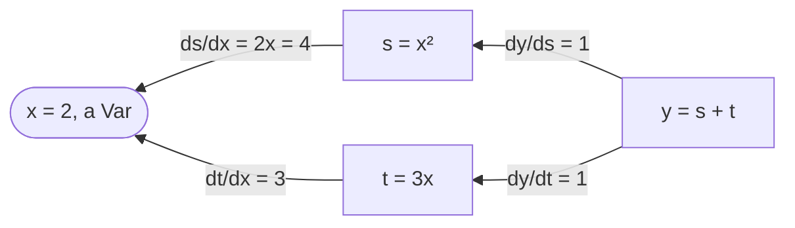

Training a model means following the gradient of a loss downhill, and the [IX course, lesson 2](../../machine-learning-ix/02-linear-regression/) worked that gradient out by hand for a straight line. Frameworks compute it for any expression built from their operations: that is automatic differentiation, in its reverse mode, the *backpropagation* of neural networks. This lesson uses Candle's, checks it three ways, then trains the IX course's line with it and runs the same gradient through IX's own implementation.

The code is [`examples/l04_autodiff.rs`](https://github.com/spareilleux/learn/blob/c45b150/code/candle/course/examples/l04_autodiff.rs), [`examples/l04_linear_regression.rs`](https://github.com/spareilleux/learn/blob/c45b150/code/candle/course/examples/l04_linear_regression.rs) and [`examples/l04_exercises.rs`](https://github.com/spareilleux/learn/blob/c45b150/code/candle/course/examples/l04_exercises.rs).

## Three names

| Candle | What it is | PyTorch |
|---|---|---|
| [`Var`](https://docs.rs/candle-core/0.11.0/candle_core/struct.Var.html) | a tensor marked as a variable: the operations that use it are recorded | a tensor with `requires_grad=True` |
| [`Tensor::backward`](https://docs.rs/candle-core/0.11.0/candle_core/struct.Tensor.html#method.backward) | walks the recorded graph from a result back to its variables | `loss.backward()` |
| [`GradStore`](https://docs.rs/candle-core/0.11.0/candle_core/backprop/struct.GradStore.html) | the gradients, looked up by tensor | the `.grad` field of each tensor |

The difference in the last row shapes the rest. PyTorch writes each gradient into the tensor, and adds to it on the next `backward` until you call `zero_grad`. Candle returns a new map from each `backward` call and changes no tensor.

## A first derivative

`y = x² + 3x` at `x = 2`, whose derivative `2x + 3` is 7 ([lines 10-18](https://github.com/spareilleux/learn/blob/c45b150/code/candle/course/examples/l04_autodiff.rs#L10-L18)):

```rust
let x = Var::new(2f64, &dev)?;
let y = (x.sqr()? + x.affine(3., 0.)?)?;
let grads = y.backward()?;
println!("y {}", y.to_scalar::<f64>()?);
println!(
    "dy/dx {}",
    grads.get(&x).expect("x is a Var").to_scalar::<f64>()?
);
```

```text
== y = x^2 + 3x at x = 2, so dy/dx = 2x + 3 = 7
y 10
dy/dx 7
```

A `Var` dereferences to a `Tensor`, so `x.sqr()` works as on any tensor. `affine(3., 0.)` computes `3x + 0`; `x * 3.0` would do the same. `grads.get(&x)` returns an `Option`: `None` when the result doesn't depend on `x`.

[`backward`](https://github.com/huggingface/candle/blob/31f35b147389700ed2a178ee66a91c3cc25cc80d/candle-core/src/backprop.rs#L165-L200) sorts the nodes behind `y` so that each comes before its inputs, seeds `y`'s own gradient with ones, then for each node applies the chain rule and adds the result to the gradient of each input:

```rust
pub fn backward(&self) -> Result<GradStore> {
    let sorted_nodes = self.sorted_nodes();
    let mut grads = GradStore::new();
    grads.insert(self, self.ones_like()?.contiguous()?);
    for node in sorted_nodes.iter() {
        if node.is_variable() {
            continue;
        }
        let grad = grads
            .remove(node)
            .expect("candle internal error - grad not populated");
```



`x` receives 4 through `s` and 3 through `t`, and the two add up to 7.

## Which tensors get a gradient

[Lines 20-39](https://github.com/spareilleux/learn/blob/c45b150/code/candle/course/examples/l04_autodiff.rs#L20-L39) mix a `Var` with plain tensors:

```rust
let w = Var::new(&[1f32, -2., 3.], &dev)?;
let c = Tensor::new(&[4f32, 5., 6.], &dev)?;
let loss = w.mul(&c)?.sqr()?.sum_all()?; // sum((w * c)^2), d/dw = 2 * w * c^2
let grads = loss.backward()?;
```

```text
== which tensors get a gradient
d loss / dw: shape [3], F32, [32, -100, 216]
2 * w * c^2 by hand: shape [3], F32, [32, -100, 216]
d loss / dc, c a plain tensor: shape [3], F32, [8, 40, 108]
tensors in the GradStore: 2
loss = sum(w * exp(c)): gradient for e true, for c false
```

The gradient for `w` matches the derivative by hand. The surprise is `c`: a plain tensor, never marked, and it has a gradient too, `2 · w² · c`. Reading [`backprop.rs`](https://github.com/huggingface/candle/blob/31f35b147389700ed2a178ee66a91c3cc25cc80d/candle-core/src/backprop.rs#L165-L200) explains it. The walk visits only the nodes that lead to a `Var`, but each visited node hands a gradient to **all** its inputs, and nothing removes the gradients of inputs that aren't nodes. So a plain tensor that is a direct input of a recorded operation gets one; a plain tensor one step further, like `c` behind `e = c.exp()`, doesn't, because `exp` of a plain tensor was never recorded.

It is harmless for the result and costs work: for the linear regression below, Candle computes a gradient for the 52 page counts and the 52 build times too. The `GradStore` of that example holds 4 tensors, `w`, `b`, `x` and `y`, which a scratch program printing each tensor's id confirmed.

## Adding up, seeds, and no accumulation

[Lines 41-63](https://github.com/spareilleux/learn/blob/c45b150/code/candle/course/examples/l04_autodiff.rs#L41-L63) check three rules:

```rust
let h = w.affine(1., 1.)?; // h = w + 1
let twice = h.mul(&h)?.sum_all()?; // sum(h * h), d/dw = 2h
let v = w.sqr()?; // [w0^2, w1^2, w2^2]
let first = loss.backward()?;
let second = loss.backward()?;
```

```text
== a tensor used twice adds up its gradients
d sum(h*h) / dw: shape [3], F32, [4, -2, 8]

== backward on a tensor that isn't a scalar starts from ones
d v / dw, seeded with ones: shape [3], F32, [2, -4, 6]
d sum(v) / dw: shape [3], F32, [2, -4, 6]

== each backward returns a new GradStore: nothing accumulates between calls
first: shape [3], F32, [32, -100, 216]
second: shape [3], F32, [32, -100, 216]
```

- **A tensor used twice** receives both contributions: `h · h` gives `h` a gradient of `h` from each side, `2h = [4, -2, 8]` for `w = [1, -2, 3]`.
- **A result that isn't a scalar** is seeded with ones, which is the gradient of its sum. PyTorch refuses `backward()` on a non-scalar without an explicit `gradient` argument; Candle accepts it silently, so a loss you forgot to reduce still "works".
- **Two calls give the same gradients.** There is no `zero_grad` to forget. The flip side: to add gradients over several batches, you add the `GradStore`s yourself.

## What stops a gradient

[Lines 65-81](https://github.com/spareilleux/learn/blob/c45b150/code/candle/course/examples/l04_autodiff.rs#L65-L81):

```rust
let stopped = w.detach().mul(&c)?.sum_all()?;
let rounded = w.affine(0.5, 0.)?.round()?.sum_all()?;
let through_max = w.max_keepdim(D::Minus1)?.sum_all()?;
```

```text
== detach and operations without a gradient
through detach: gradient for w None
through round: gradient for w None
through max: d max(w) / dw: shape [3], F32, [0, 0, 1]
```

- `detach` cuts the graph, as in lesson 3.
- `round`, `floor`, `ceil` and `sign` have a derivative of zero almost everywhere, and the walk skips them ([`backprop.rs`, lines 114-117](https://github.com/huggingface/candle/blob/31f35b147389700ed2a178ee66a91c3cc25cc80d/candle-core/src/backprop.rs#L114-L117)). The result is `None`, not a tensor of zeros, so code that `unwrap`s the gradient panics. Integer tensors get no gradient either: a `Var` of `u32` gets `None` (below).
- `max` sends the whole gradient to the largest element, `3` at index 2.

The gradients themselves are detached from the graph ([lines 176-182](https://github.com/huggingface/candle/blob/31f35b147389700ed2a178ee66a91c3cc25cc80d/candle-core/src/backprop.rs#L176-L182)), so a gradient of a gradient, a second derivative, isn't available: the comment there calls second-order derivatives out of scope. An environment variable read on the next line, `CANDLE_GRAD_DO_NOT_DETACH`, keeps them attached (*to verify*, the course hasn't tried it).

## Checking against finite differences

A derivative by hand works for small expressions. For any function, the **central difference** `(f(a + ε) − f(a − ε)) / 2ε` approximates each partial derivative, one element at a time. [Lines 83-106](https://github.com/spareilleux/learn/blob/c45b150/code/candle/course/examples/l04_autodiff.rs#L83-L106) compare it with `backward` for `sum(tanh(a · b))`, a matrix product followed by a non-linearity, in `f64`:

```rust
let f = |a: &Tensor| -> candle_core::Result<Tensor> { a.matmul(&b)?.tanh()?.sum_all() };
let analytic = f(a.as_tensor())?.backward()?.get(&a).unwrap().clone();
let eps = 1e-6;
```

```text
== matmul against finite differences, f64
backward: shape [2, 3], F64, [0.007283, 0.001819, -0.007278, 0.420743, -0.419782, 1.259154]
finite differences: shape [2, 3], F64, [0.007283, 0.001819, -0.007278, 0.420743, -0.419782, 1.259154]
largest gap below 1e-8: true
```

Use `f64` for this check: with `f32`, `ε = 1e-6` is lost in rounding, and a larger `ε` makes the approximation itself worse. It is the check to run when you write a custom operation with its own backward pass.

## `Var::set`

To update a parameter, [`Var::set`](https://github.com/huggingface/candle/blob/31f35b147389700ed2a178ee66a91c3cc25cc80d/candle-core/src/variable.rs#L130-L151) copies new values into the variable's buffer ([lines 108-125](https://github.com/spareilleux/learn/blob/c45b150/code/candle/course/examples/l04_autodiff.rs#L108-L125)):

```text
== Var::set changes the value in place
p after set: shape [2], F32, [10, 20]
a clone taken before set sees it: shape [2], F32, [10, 20]
p.set(&p.detach()): error: cannot set variable cannot set a variable to a tensor that is derived from its value
p.set(3 values): error: shape mismatch in set, lhs: [2], rhs: [3]
p.set(f64 values): error: dtype mismatch in copy_strided, lhs: F64, rhs: F32
gradient for a u32 Var: None
```

- **The update is in place**, the only mutation of a tensor this course has met: a clone taken before `set` shares the buffer (lesson 3) and sees the new values.
- **A value that shares the variable's buffer is refused**, and `detach` shares it. `w - lr · grad` is a new tensor, so a descent step passes.
- **The shape and the element type must match**; the dtype error names `copy_strided`, the internal operation, with `lhs` and `rhs` in the reverse order of `set`.

[`candle-nn`'s optimizers](https://docs.rs/candle-nn/0.11.0/candle_nn/optim/index.html) do the same `set` for you (lesson 5). This lesson writes the step by hand, to compare it with the IX course.

## The IX course's linear regression

The IX course fits `seconds = w · pages + b` to the build times of this site, on the first 52 of 65 builds in commit order, with the mean squared error as the loss. [`data/builds.csv`](https://github.com/spareilleux/learn/blob/c45b150/code/candle/data/builds.csv) is a copy of its data, and [lines 25-32](https://github.com/spareilleux/learn/blob/c45b150/code/candle/course/examples/l04_linear_regression.rs#L25-L32) write the loss with tensor operations:

```rust
fn mse(x: &Tensor, y: &Tensor, w: &Tensor, b: &Tensor) -> candle_core::Result<Tensor> {
    x.broadcast_mul(w)?
        .broadcast_add(b)?
        .sub(y)?
        .sqr()?
        .mean_all()
}
```

`w` and `b` are scalar tensors, shape `[]`, and the pages a vector of 52, hence the `broadcast_` operations (lesson 2).

### The gradient, three ways

At `w = 0, b = 0`, by Candle, by the formulas of the IX course, and by [`ix-autograd`](https://github.com/GuitarAlchemist/ix/tree/490c39533627d296bf9f8f050e6fafc14d7a20c2/crates/ix-autograd), IX's own automatic differentiation, pinned at commit `490c395` in [`Cargo.toml`](https://github.com/spareilleux/learn/blob/c45b150/code/candle/Cargo.toml) ([lines 52-115](https://github.com/spareilleux/learn/blob/c45b150/code/candle/course/examples/l04_linear_regression.rs#L52-L115)):

```rust
let w = Var::new(0f64, &dev)?;
let b = Var::new(0f64, &dev)?;
let loss = mse(&x, &y, &w, &b)?;
let grads = loss.backward()?;
// ix-autograd: the same graph on its tape, with x as an (n, 1) matrix and w, b as (1, 1)
let mut ctx = DiffContext::new(ExecutionMode::Train);
let state = LinearRegressionTool::build_graph(
    &mut ctx,
    IxTensor::from_array(column(&pages)),
    IxTensor::from_array_with_grad(scalar(0.0)),
    IxTensor::from_array_with_grad(scalar(0.0)),
    IxTensor::from_array(column(&seconds)),
)?;
let ix_grads = ctx.backward(state.loss, ArrayD::from_elem(IxDyn(&[]), 1.0))?;
```

```text
== closed form in plain Rust, f64, 52 builds
seconds = 0.041707 * pages + 9.708880

== gradient of the loss at w = 0, b = 0, raw pages
candle:  loss 314.923077, dw -6724.461538, db -34.769231
by hand:              dw -6724.461538, db -34.769231
ix:      loss 314.923077, dw -6724.461538, db -34.769231
candle and ix agree to 1e-9: true
tape nodes in ix: 10, nodes behind candle's loss: 11
gradients ix computed: 10, gradients candle kept: 4
```

The closed form is the IX course's line, to six decimals. The three gradients agree. The two implementations are built differently:

| | Candle | ix-autograd at `490c395` |
|---|---|---|
| Where the graph lives | in the tensors: each holds the operation that made it | on a tape, a list in a `DiffContext` that the operations append to |
| What is recorded | only operations that lead to a `Var` | every operation on the context, inputs included |
| The walk | a topological sort from the result | the tape in reverse index order, since an input always has a smaller index ([`ops.rs`, lines 382-440](https://github.com/GuitarAlchemist/ix/blob/490c39533627d296bf9f8f050e6fafc14d7a20c2/crates/ix-autograd/src/ops.rs#L382-L440)) |
| Gradients returned | variables and the plain inputs next to the graph (4 here) | every node on the path (10) |
| Element types, devices | `f16` to `f64`, integers, CPU, CUDA, Metal | `f64` on the CPU, over `ndarray` |
| Operations with a backward pass | most of its operations, from `matmul` to convolutions | `add`, `sub`, `mul`, `sum`, `matmul`, `div_scalar`, and an FFT magnitude behind a feature |

Both add up the contributions of a node used twice (IX with `+=` on its map), and both return a fresh map on each call. IX's tape is the textbook [Wengert list](https://en.wikipedia.org/wiki/Automatic_differentiation), small enough to read in one sitting; lesson 1 quoted its note that a Candle backend may come later.

### Descent with `Var::set`

[Lines 117-139](https://github.com/spareilleux/learn/blob/c45b150/code/candle/course/examples/l04_linear_regression.rs#L117-L139) repeat the IX course's descent on the raw page counts, with its two learning rates, printing the loss after the step as the IX course does:

```rust
for step in 1..=1000 {
    let grads = mse(&x, &y, &w, &b)?.backward()?;
    w.set(&(w.as_tensor() - (grads.get(&w).unwrap() * lr)?)?)?;
    b.set(&(b.as_tensor() - (grads.get(&b).unwrap() * lr)?)?)?;
```

```text
== gradient descent with Var::set, raw pages
learning rate 3e-5: step 1 loss 4.957e2 step 10 loss 3.373e4 step 1000 loss 4.538e207 -> w -3.4661e101, b -1.6887e99
learning rate 1e-5: step 1 loss 3.354e1 step 10 loss 1.565e1 step 1000 loss 1.561e1 -> w 8.8911e-2, b 2.0477e-2
```

The losses at steps 1, 10 and 1000 are the IX course's, digit for digit: `3e-5` diverges, `1e-5` crawls, and the course's explanation (the curvature of the loss is about 360,000 times larger in its steepest direction than in its flattest) holds for any framework. `w - lr · grad` needs its parentheses and `?`: `Tensor - Tensor` gives a `Result`, and `Result<Tensor> - f64` doesn't compile (lesson 2).

### Standardized, in `f64` and `f32`

On standardized pages `z = (pages − mean) / sd`, a learning rate of 0.1 converges in 100 steps. [Lines 141-162](https://github.com/spareilleux/learn/blob/c45b150/code/candle/course/examples/l04_linear_regression.rs#L141-L162) run it in both float types and convert the result back to raw pages:

```rust
for dtype in [DType::F64, DType::F32] {
    let z = x.affine(1.0 / sd_x, -mean_x / sd_x)?.to_dtype(dtype)?;
    let yt = y.to_dtype(dtype)?;
    let ws = Var::zeros((), dtype, &dev)?;
    let bs = Var::zeros((), dtype, &dev)?;
```

```text
== gradient descent with Var::set, standardized pages, learning rate 0.1, 100 steps
F64: ws 2.605694, bs 17.384615 -> w 0.041707, b 9.708880, gap to the closed form 2.0e-9
F32: ws 2.605694, bs 17.384611 -> w 0.041707, b 9.708877, gap to the closed form 2.8e-6
```

`f64` lands on the IX course's `ws 2.605694, bs 17.384615`. `f32` misses `b` in the sixth decimal: its roughly seven significant digits don't hold `17.384615` plus the rounding of 52 squared errors. For a model of build times, it doesn't matter; for comparing two implementations to `1e-9`, as above, use `f64`. The `f32` sum of the same numbers may also round differently on another processor (*to verify* on macOS ARM, where the course's CI hasn't run yet).

## Key takeaways

- A `Var` is recorded, `backward` returns a `GradStore`, and `grads.get(&tensor)` gives an `Option`. Nothing is written into the tensors and nothing accumulates between calls.
- Gradients also go to plain tensors that are direct inputs of recorded operations: correct, but extra work.
- `backward` on a non-scalar is seeded with ones, silently. `round`, `floor`, `ceil`, `sign` and integer tensors give `None`, not zeros. Second derivatives aren't supported by default.
- Check a gradient against central finite differences, in `f64`.
- `Var::set` updates in place, refuses a value sharing its buffer, and needs the same shape and type.
- Candle and ix-autograd give the IX course's gradient and descent to the digit; they differ in where the graph lives and what they return.

## Exercises

1. For logistic regression, `p = sigmoid(x · w + b)` and the loss is the mean of `−(y log p + (1 − y) log(1 − p))`. Compute the gradient with Candle for `x = [[1, 2], [2, −1], [−1, −3], [0.5, 0.5]]`, `y = [1, 0, 0, 1]`, `w = [0.3, −0.2]`, `b = 0.1`, without a sigmoid function, and check it against the formula `x^T (p − y) / n`.

<details>
<summary>Solution</summary>

[Lines 9-32](https://github.com/spareilleux/learn/blob/c45b150/code/candle/course/examples/l04_exercises.rs#L9-L32):

```rust
let z = x.matmul(&w.unsqueeze(1)?)?.squeeze(1)?.broadcast_add(&b)?;
let p = z.neg()?.exp()?.affine(1., 1.)?.recip()?;
let one_minus_y = y.affine(-1., 1.)?;
let loss = (y.mul(&p.log()?)? + one_minus_y.mul(&p.affine(-1., 1.)?.log()?)?)?
    .mean_all()?
    .neg()?;
let grads = loss.backward()?;
// By hand: dL/dw = x^T (p - y) / n, dL/db = mean(p - y)
let err = p.detach().sub(&y)?;
```

```text
== exercise 1: gradient of the logistic loss
loss 0.867068
candle dw: shape [2], F64, [0.022982, -0.934574]
candle db: shape [], F64, [0.086767]
by hand dw: shape [2], F64, [0.022982, -0.934574]
by hand db: shape [], F64, [0.086767]
```

`sigmoid(z) = 1 / (1 + exp(−z))` is written with `neg`, `exp`, `affine` and `recip`, and `backward` goes through each. The formula by hand is short because the derivative of the log loss through a sigmoid simplifies to `p − y`; the automatic version doesn't know that and multiplies every local derivative, with the same result. `p.detach()` keeps the check out of the graph. Candle also has [`candle_nn::ops::sigmoid`](https://docs.rs/candle-nn/0.11.0/candle_nn/ops/fn.sigmoid.html) and [`candle_nn::loss::binary_cross_entropy_with_logit`](https://docs.rs/candle-nn/0.11.0/candle_nn/loss/fn.binary_cross_entropy_with_logit.html), for lesson 5.

</details>

2. Fit `seconds = a · z² + b · z + c` on the same 52 builds, with `z` the standardized pages, by gradient descent from zeros with a learning rate of 0.05. Print the loss at steps 1, 100 and 2000. Does the curve do better than the line, whose loss is 5.908583 in the IX course?

<details>
<summary>Solution</summary>

[Lines 34-81](https://github.com/spareilleux/learn/blob/c45b150/code/candle/course/examples/l04_exercises.rs#L34-L81):

```rust
let loss_of = |a: &Tensor, b: &Tensor, c: &Tensor| -> candle_core::Result<Tensor> {
    zz.broadcast_mul(a)?
        .add(&z.broadcast_mul(b)?)?
        .broadcast_add(c)?
        .sub(&y)?
        .sqr()?
        .mean_all()
};
for step in 1..=2000 {
    let grads = loss_of(&qa, &qb, &qc)?.backward()?;
    for v in [&qa, &qb, &qc] {
        v.set(&(v.as_tensor() - (grads.get(v).unwrap() * 0.05)?)?)?;
    }
```

```text
== exercise 2: seconds = a z^2 + b z + c on the standardized pages
step 1: loss 208.415392
step 100: loss 5.952060
step 2000: loss 5.899971
a -0.096816, b 2.603830, c 17.481431
```

The curve reaches 5.899971 against 5.908583 for the line: 0.15% better on the data it was trained on, which says nothing yet about builds it hasn't seen, and a third parameter can always fit the training set at least as well. `a` is small and negative, a slight flattening for large page counts. `z²` is computed once, outside the loop, as a plain tensor, and `loss_of` takes the three `Var`s as `&Tensor` through `Deref`. `z²` ranges further than `z`, so the learning rate is 0.05 instead of 0.1: a sensible first guess (*to verify* how close 0.1 comes to diverging). To judge the curve properly, split the builds as lesson 1 of the IX course does.

</details>

## Sources

- Candle at `31f35b1`: [`backprop.rs`](https://github.com/huggingface/candle/blob/31f35b147389700ed2a178ee66a91c3cc25cc80d/candle-core/src/backprop.rs), [`variable.rs`](https://github.com/huggingface/candle/blob/31f35b147389700ed2a178ee66a91c3cc25cc80d/candle-core/src/variable.rs); [`Var`](https://docs.rs/candle-core/0.11.0/candle_core/struct.Var.html) and [`GradStore`](https://docs.rs/candle-core/0.11.0/candle_core/backprop/struct.GradStore.html) on docs.rs
- IX at `490c395`: [`ix-autograd`](https://github.com/GuitarAlchemist/ix/tree/490c39533627d296bf9f8f050e6fafc14d7a20c2/crates/ix-autograd), its [`ops.rs`](https://github.com/GuitarAlchemist/ix/blob/490c39533627d296bf9f8f050e6fafc14d7a20c2/crates/ix-autograd/src/ops.rs) and [`tools/linear_regression.rs`](https://github.com/GuitarAlchemist/ix/blob/490c39533627d296bf9f8f050e6fafc14d7a20c2/crates/ix-autograd/src/tools/linear_regression.rs)
- [PyTorch: autograd mechanics](https://docs.pytorch.org/docs/stable/notes/autograd.html)
- Baydin, Pearlmutter, Radul and Siskind, [Automatic differentiation in machine learning: a survey](https://jmlr.org/papers/v18/17-468.html), JMLR 18, 2018
