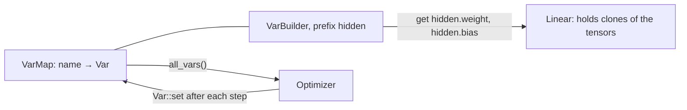

Lesson 4 wrote each gradient step by hand with `Var::set`. [`candle-nn`](https://docs.rs/candle-nn/0.11.0/candle_nn/) packages the pieces a training loop repeats: layers, a store for their variables, losses and optimizers. This lesson takes them one at a time and checks each against what it should compute, then trains a classifier on a public data set, [Iris](https://archive.ics.uci.edu/dataset/53/iris). The nine predictions about the results were written in the [journal](../journal/#2026-09-30--lesson-5-predictions-before-the-first-run) before any of this code existed; the journal compares them with what the programs print.

The code is [`examples/l05_modules.rs`](https://github.com/spareilleux/learn/blob/40470dc/code/candle/course/examples/l05_modules.rs), [`l05_losses.rs`](https://github.com/spareilleux/learn/blob/40470dc/code/candle/course/examples/l05_losses.rs), [`l05_optimizers.rs`](https://github.com/spareilleux/learn/blob/40470dc/code/candle/course/examples/l05_optimizers.rs), [`l05_iris.rs`](https://github.com/spareilleux/learn/blob/40470dc/code/candle/course/examples/l05_iris.rs) and [`l05_exercises.rs`](https://github.com/spareilleux/learn/blob/40470dc/code/candle/course/examples/l05_exercises.rs), with helpers in [`src/lib.rs`](https://github.com/spareilleux/learn/blob/40470dc/code/candle/course/src/lib.rs).

## Six names

| Candle | What it is | PyTorch |
|---|---|---|
| [`Module`](https://docs.rs/candle-core/0.11.0/candle_core/trait.Module.html) | a trait with one method, `forward(&self, &Tensor) -> Result<Tensor>` | `nn.Module` |
| [`Linear`](https://docs.rs/candle-nn/0.11.0/candle_nn/linear/struct.Linear.html), [`linear`](https://docs.rs/candle-nn/0.11.0/candle_nn/linear/fn.linear.html) | a weight and an optional bias; the function creates them in a `VarMap` | `nn.Linear` |
| [`seq`](https://docs.rs/candle-nn/0.11.0/candle_nn/sequential/fn.seq.html), [`Sequential`](https://docs.rs/candle-nn/0.11.0/candle_nn/sequential/struct.Sequential.html) | modules applied one after the other | `nn.Sequential` |
| [`VarMap`](https://docs.rs/candle-nn/0.11.0/candle_nn/var_map/struct.VarMap.html), [`VarBuilder`](https://docs.rs/candle-nn/0.11.0/candle_nn/var_builder/type.VarBuilder.html) | the variables by name, and the handle layers use to create or fetch them | the parameters a module registers, its `state_dict` |
| [`loss`](https://docs.rs/candle-nn/0.11.0/candle_nn/loss/index.html) | `cross_entropy`, `nll`, `mse`, `binary_cross_entropy_with_logit`, `huber` | `torch.nn.functional` |
| [`Optimizer`](https://docs.rs/candle-nn/0.11.0/candle_nn/optim/trait.Optimizer.html), [`SGD`](https://docs.rs/candle-nn/0.11.0/candle_nn/optim/struct.SGD.html), [`AdamW`](https://docs.rs/candle-nn/0.11.0/candle_nn/optim/struct.AdamW.html) | a trait and its two implementations | `torch.optim` |

## A layer is a struct with `forward`

[`Linear`](https://github.com/huggingface/candle/blob/31f35b147389700ed2a178ee66a91c3cc25cc80d/candle-nn/src/linear.rs#L42-L79) computes `x · wᵀ + b`, with `w` of shape `(out, in)` as in PyTorch. It can be built from any two tensors ([lines 31-43](https://github.com/spareilleux/learn/blob/40470dc/code/candle/course/examples/l05_modules.rs#L31-L43)):

```rust
let w = Tensor::new(&[[1f64, 2.], [3., 4.], [5., 6.]], &dev)?;
let b = Tensor::new(&[0.5f64, -0.5, 0.], &dev)?;
let layer = Linear::new(w, Some(b));
let x = Tensor::new(&[[10f64, 100.], [1., 1.]], &dev)?;
show("layer.forward(&x)", &layer.forward(&x)?, 1)?;
```

```text
== a Linear layer from given tensors: y = x · wᵀ + b
x: shape [2, 2], F64, [10.0, 100.0, 1.0, 1.0]
layer.forward(&x): shape [2, 3], F64, [210.5, 429.5, 650.0, 3.5, 6.5, 11.0]
x.matmul(&w.t()) + b: shape [2, 3], F64, [210.5, 429.5, 650.0, 3.5, 6.5, 11.0]
```

`forward` is a method of the `Module` trait, defined in `candle-core` and re-exported by `candle-nn`. Without the trait in scope, the call doesn't compile ([`lib.rs`, lines 303-313](https://github.com/spareilleux/learn/blob/40470dc/code/candle/course/src/lib.rs#L303-L313)), and rustc says which import is missing:

```text
error[E0599]: no method named `forward` found for struct `candle_nn::Linear` in the current scope
help: trait `Module` which provides `forward` is implemented but not in scope; perhaps you want to import it
    |
  1 + use candle_core::Module;
```

`use candle_nn::Module` works as well: it is the same trait.

`seq()` chains modules, and [`Activation::Relu`](https://docs.rs/candle-nn/0.11.0/candle_nn/activation/enum.Activation.html) is one too ([lines 45-56](https://github.com/spareilleux/learn/blob/40470dc/code/candle/course/examples/l05_modules.rs#L45-L56)). `forward_all` returns the output of every layer, which helps when a network gives a surprising result:

```rust
let model = seq()
    .add(Linear::new(Tensor::new(&[[1f64, -1.], [-1., 1.]], &dev)?, None))
    .add(Activation::Relu)
    .add(Linear::new(Tensor::new(&[[1f64, 1.]], &dev)?, None));
for (i, t) in model.forward_all(&x)?.iter().enumerate() {
    show(&format!("after layer {i}"), t, 1)?;
}
```

```text
== a Sequential: Linear, ReLU, Linear
model.len(): 3
after layer 0: shape [2, 2], F64, [-90.0, 90.0, 0.0, 0.0]
after layer 1: shape [2, 2], F64, [0.0, 90.0, 0.0, 0.0]
after layer 2: shape [2, 1], F64, [90.0, 0.0]
```

The ReLU zeroes the `-90`. A small oddity: [`Sequential::len`](https://github.com/huggingface/candle/blob/31f35b147389700ed2a178ee66a91c3cc25cc80d/candle-nn/src/sequential.rs#L16-L26) returns an `i64`, not a `usize`.

## Where the weights live: `VarMap` and `VarBuilder`

A layer built by `linear(in, out, vb)` doesn't own its weights. It asks the `VarBuilder` for a tensor named `weight` of shape `(out, in)`, and the builder asks the `VarMap` behind it, which creates the variable the first time and returns the same one afterwards ([lines 58-92](https://github.com/spareilleux/learn/blob/40470dc/code/candle/course/examples/l05_modules.rs#L58-L92)):

```rust
let varmap = VarMap::new();
let vb = VarBuilder::from_varmap(&varmap, DType::F64, &dev);
let hidden = linear(4, 16, vb.pp("hidden"))?;
let _out = linear(16, 3, vb.pp("out"))?;
```

```text
== a VarMap behind a VarBuilder: linear(4, 16) and linear(16, 3)
hidden.bias: [16]
hidden.weight: [16, 4]
out.bias: [3]
out.weight: [3, 16]
parameters: 131, all_vars(): 4 variables
hidden.weight asked again with Init::Const(0.): same tensor true, values still nonzero true
hidden.weight asked with the shape (4, 16): error: shape mismatch on hidden.weight: [4, 16] <> [16, 4]
```



- **`pp` adds a prefix**, and the names are paths: `hidden.weight`, `out.bias`. They are the names `safetensors` files use, which is how lesson 6 will load published weights into the same layers.
- **The layer and the map share the storage.** `Linear` holds a clone of the variable's tensor, and a clone shares the buffer (lesson 3), so when the optimizer calls `Var::set` on the map's variables, the layer sees the new values.
- **Asking again returns what the map holds**, whatever initialization you pass ([`var_map.rs`, lines 94-116](https://github.com/huggingface/candle/blob/31f35b147389700ed2a178ee66a91c3cc25cc80d/candle-nn/src/var_map.rs#L94-L116)); only the shape is checked.
- **A `VarMap` is a `HashMap` behind a mutex**: `all_vars()` returns the variables in no particular order. The optimizers don't care, but anything that prints or compares them must sort the names, as this lesson's helpers do.

## How `linear` initializes

[`linear`](https://github.com/huggingface/candle/blob/31f35b147389700ed2a178ee66a91c3cc25cc80d/candle-nn/src/linear.rs#L84-L94) draws the weights from `DEFAULT_KAIMING_NORMAL` ([`init.rs`, lines 105-109](https://github.com/huggingface/candle/blob/31f35b147389700ed2a178ee66a91c3cc25cc80d/candle-nn/src/init.rs#L105-L109)): a normal distribution of standard deviation `gain / √in`, with the ReLU gain `√2` ([He et al., 2015](https://arxiv.org/abs/1502.01852)). The biases are uniform in `±1/√in`. [PyTorch's `nn.Linear`](https://docs.pytorch.org/docs/2.14/generated/torch.nn.Linear.html) draws both uniformly in `±1/√in`, so its weights have a standard deviation of `1/√(3 · in)`. [Lines 94-125](https://github.com/spareilleux/learn/blob/40470dc/code/candle/course/examples/l05_modules.rs#L94-L125) measure a `linear(512, 512)`; the values are random, so the program prints checks rather than digits:

```text
== the initialization of linear(512, 512), f64
weights: 262144 values, |mean| < 0.001 true, sd within 1% of √(2 / 512) = 0.0625 true
share beyond 2 sd within half a point of 4.55%, as a normal distribution: true
PyTorch's nn.Linear: sd 1/√(3 · 512) = 0.0255; candle's is 2.449 times larger
biases: 512 values, all within ±1/√512 = ±0.0442 true, sd within 10% of 0.0255 true
```

The thresholds are wide enough to hold on every run: with 262,144 weights, the measured standard deviation varies by about 0.14%, so 1% is seven times that. The share beyond two standard deviations tells the normal distribution from a uniform one, which has none.

The ratio is `√6 ≈ 2.449`. It doesn't matter when you load trained weights, which replace the initial ones. It matters when you port a model from PyTorch and train it from scratch: the same architecture starts with weights about 2.45 times larger, which can change the learning rate that works. Candle's choice follows the paper's advice for ReLU networks, and `init.rs` cites PyTorch's `init.py` as its source; PyTorch's own `nn.Linear` simply uses another default.

## Seeded weights

Lesson 2 found that the CPU generator can't be seeded: `Device::Cpu.set_seed(42)` returns an error. So two `VarMap`s filled by the same calls differ, and so would every output of this lesson that depends on training. [`reseed`](https://github.com/spareilleux/learn/blob/40470dc/code/candle/course/src/lib.rs#L78-L104) overwrites every variable with values from [SplitMix64](https://prng.di.unimi.it/splitmix64.c), a 64-bit generator ten lines long ([`lib.rs`, lines 53-76](https://github.com/spareilleux/learn/blob/40470dc/code/candle/course/src/lib.rs#L53-L76)), visiting the names in sorted order:

```rust
let bound = if name.ends_with(".weight") {
    (6.0 / var.dims()[1] as f64).sqrt()
} else if let Some(layer) = name.strip_suffix(".bias") {
    match data.get(&format!("{layer}.weight")) {
        Some(weight) => 1.0 / (weight.dims()[1] as f64).sqrt(),
        None => candle_core::bail!("{name} has no matching weight"),
    }
}
```

The weights are uniform in `±√(6 / in)`, whose standard deviation is `√(2 / in)`, the same as `linear`'s normal draw; the biases keep `linear`'s range. A uniform draw needs one multiplication and one addition per value, which IEEE 754 rounds the same way on every processor, while a normal draw needs `ln` and `cos`, which come from each system's math library and may differ in the last bit. [Lines 127-152](https://github.com/spareilleux/learn/blob/40470dc/code/candle/course/examples/l05_modules.rs#L127-L152):

```text
== two VarMaps filled by the same calls
same values: false
after reseed(&varmap, 5) on both: same values true
hidden.weight, first row: shape [4], F64, [0.811031, -0.095405, -0.839404, -0.109659]
all 64 weights within ±√(6 / 4) = ±1.2247: true
```

## Losses

### `cross_entropy`

[`cross_entropy`](https://github.com/huggingface/candle/blob/31f35b147389700ed2a178ee66a91c3cc25cc80d/candle-nn/src/loss.rs#L41-L47) takes raw scores (logits) of shape `(n, classes)` and the classes as integers, computes [`log_softmax`](https://github.com/huggingface/candle/blob/31f35b147389700ed2a178ee66a91c3cc25cc80d/candle-nn/src/ops.rs#L31-L38), then [`nll`](https://github.com/huggingface/candle/blob/31f35b147389700ed2a178ee66a91c3cc25cc80d/candle-nn/src/loss.rs#L14-L30), which picks each row's value at its target with `gather` and averages the negatives. [Lines 32-68](https://github.com/spareilleux/learn/blob/40470dc/code/candle/course/examples/l05_losses.rs#L32-L68) compare it with the formula written in plain Rust, then feed it logits of 1000:

```rust
// −log softmax at the target, i.e. log Σ exp(z − max) − (z_target − max), averaged over the rows
let by_hand = logits
    .iter()
    .zip(targets)
    .map(|(row, t)| {
        let max = row.iter().copied().fold(f64::MIN, f64::max);
        row.iter().map(|v| (v - max).exp()).sum::<f64>().ln() - (row[t as usize] - max)
    })
    .sum::<f64>()
    / 3.0;
```

```text
== cross_entropy against the formula, f64
candle 0.2458859914, by hand 0.2458859914, agree to 1e-12: true

== logits of 1000, 0 and -1000, f64
target 0: cross_entropy 0.0
target 1: cross_entropy 1000.0
target 2: cross_entropy 2000.0
ops::log_softmax: shape [1, 3], F64, [0.0, -1000.0, -2000.0]
log(exp(z) / sum(exp(z))), written naively: shape [1, 3], F64, [NaN, -inf, -inf]
```

`log_softmax` subtracts each row's maximum before `exp`, so the largest exponent is `exp(0) = 1` and nothing overflows. Written naively, `exp(1000)` is infinite in `f64` (the limit is about `exp(709.8)`), and `∞ / ∞` is NaN. Prefer `cross_entropy` on logits to a softmax followed by a logarithm.

### The targets `nll` accepts

[Lines 70-91](https://github.com/spareilleux/learn/blob/40470dc/code/candle/course/examples/l05_losses.rs#L70-L91):

```text
== the targets nll accepts
i64 targets: ok
f32 targets: error: unsupported dtype F64 for op gather
a target out of range, 4 of 4 classes: error: gather invalid index 4 with dim size 4
target u32::MAX in the second row: loss 0.1725049744, (row 1 + row 3) / 3 = 0.1725049744, / 2 = 0.2587574616
```

- **Targets must be integers** (`u8`, `u32` or `i64`). The error for `f32` targets names the wrong type: `F64` is the type of the logits. [`gather` on the CPU](https://github.com/huggingface/candle/blob/31f35b147389700ed2a178ee66a91c3cc25cc80d/candle-core/src/cpu_backend/mod.rs#L2883-L2890) reports `self.dtype()`, the source's type, where the unsupported one is the indices'; `index_select`, `scatter`, `scatter_add` and `index_add` do the same (read in the source, lines 2879 to 2973, not run), and `main` at [`5ba5d5b`](https://github.com/huggingface/candle/tree/5ba5d5b468b5b1df40e82dd3d556987bedeea041) still does.
- **An index out of range is an error**, not a silent read.
- **`u32::MAX` is skipped**: `gather` writes 0 for an index equal to its type's maximum ([lines 623-626](https://github.com/huggingface/candle/blob/31f35b147389700ed2a178ee66a91c3cc25cc80d/candle-core/src/cpu_backend/mod.rs#L623-L626)), a deliberate rule since [pull request #2940](https://github.com/huggingface/candle/pull/2940). In a loss, that row contributes nothing, but `nll` still divides by the batch size: the result is the sum of the two other rows divided by **3**. PyTorch's [`CrossEntropyLoss`](https://docs.pytorch.org/docs/2.14/generated/torch.nn.CrossEntropyLoss.html) has an `ignore_index` that averages "over non-ignored targets", which would divide by 2. Neither `nll`'s documentation nor `gather`'s mentions the rule.

### Binary cross-entropy with logits: NaN for a right answer

For a yes-or-no output, the loss is `−(y · log p + (1 − y) · log(1 − p))` with `p = sigmoid(x)`. [`binary_cross_entropy_with_logit`](https://github.com/huggingface/candle/blob/31f35b147389700ed2a178ee66a91c3cc25cc80d/candle-nn/src/loss.rs#L64-L74) computes exactly that: the sigmoid first, then both logarithms. [Lines 93-137](https://github.com/spareilleux/learn/blob/40470dc/code/candle/course/examples/l05_losses.rs#L93-L137) compare it, one logit at a time, with the stable form `max(x, 0) − x · y + log(1 + exp(−|x|))` ([lines 23-27](https://github.com/spareilleux/learn/blob/40470dc/code/candle/course/examples/l05_losses.rs#L23-L27)):

```rust
fn stable_bce(x: &Tensor, y: &Tensor) -> candle_core::Result<Tensor> {
    let log_term = (x.abs()?.neg()?.exp()? + 1.0)?.log()?;
    (x.relu()? - (x * y)?)?.add(&log_term)?.mean_all()
}
```

```text
== binary_cross_entropy_with_logit, one logit at a time
type, logit, target: candle's loss and gradient | the stable form's loss and gradient
F32, 16, 1: 1.192e-7 -1.192e-7 | 1.192e-7 -1.192e-7
F32, 17, 1: NaN NaN | 0.000e0 0.000e0
F32, -100, 0: NaN NaN | 0.000e0 4e-44
F32, 17, 0: inf NaN | 1.700e1 1.000e0
F32, -100, 1: inf NaN | 1.000e2 -1.000e0
F64, 36, 1: 2.220e-16 -2.220e-16 | 2.220e-16 -2.220e-16
F64, 37, 1: NaN NaN | 0.000e0 0.000e0
F64, -800, 0: NaN NaN | 0.000e0 0.000e0
a batch of the logits 16 and 17, targets 1, F32: mean loss NaN
binary_cross_entropy_with_logit with U32 targets: error: dtype mismatch in mul, lhs: U32, rhs: F32
```

- **A confident, correct prediction gives NaN.** In `f32`, `exp(−17) ≈ 4.1e−8` is less than half the gap between 1 and the next `f32` (`2⁻²⁴ ≈ 6.0e−8`), so `1 + exp(−17)` rounds to 1 and the sigmoid returns exactly 1. Then `1 − p = 0`, `log 0 = −∞`, and the term `(1 − y) · log(1 − p)` is `0 · (−∞)`, which is NaN. `exp(−16) ≈ 1.1e−7` survives the rounding. In `f64`, the same edge falls between 36 and 37 (`2⁻⁵³ ≈ 1.1e−16`). For target 0, it happens when `exp(−x)` overflows: below `x ≈ −88.7` in `f32` and `−709.8` in `f64`.
- **A confident, wrong prediction gives infinity** instead of the right value, 17 or 100: `log 0` on the other side.
- **The gradient is NaN in all six failing cases**, so one such row in a batch makes the mean NaN, and the optimizer would write NaN into every weight.
- **The stable form stays finite** and its gradient is `sigmoid(x) − y`; the `4e-44` is that gradient at `−100`, `exp(−100)`, a subnormal `f32` printed with one digit. It's the formula PyTorch's [`BCEWithLogitsLoss`](https://docs.pytorch.org/docs/2.14/generated/torch.nn.BCEWithLogitsLoss.html) relies on, "the log-sum-exp trick". Without a `log1p` in Candle 0.11.0, `log(1 + exp(−16))` still rounds: both forms print `1.192e-7` where the exact loss is `1.125e-7`. Finite, not exact.
- **The documentation says the target is "a tensor of u32"**; it has to be a float tensor of the logits' type.

[Issue #2561](https://github.com/huggingface/candle/issues/2561) has reported the instability since October 2024 and is still open; `main` at `5ba5d5b` computes the loss the same way. To train a binary classifier with Candle 0.11.0, write the stable form, five lines above.

## Optimizers

`Optimizer` is a trait, and `new` is one of its functions: `SGD::new` doesn't compile without `use candle_nn::Optimizer` (`E0599`, "no function or associated item named `new` found for struct `SGD`", [`lib.rs`, lines 315-325](https://github.com/spareilleux/learn/blob/40470dc/code/candle/course/src/lib.rs#L315-L325)); here too, rustc suggests the import. Its `backward_step(&loss)` calls `backward`, then `step`, which updates every variable that has a gradient with `Var::set`.

### SGD and AdamW, against the algorithms

[`SGD`](https://github.com/huggingface/candle/blob/31f35b147389700ed2a178ee66a91c3cc25cc80d/candle-nn/src/optim.rs#L31-L70) has no momentum, as its comment says: a step is `θ − lr · g`. [`AdamW`](https://github.com/huggingface/candle/blob/31f35b147389700ed2a178ee66a91c3cc25cc80d/candle-nn/src/optim.rs#L117-L183) is Adam with decoupled weight decay ([Loshchilov and Hutter, 2019](https://arxiv.org/abs/1711.05101)), with PyTorch's defaults: learning rate 0.001, betas 0.9 and 0.999, ε `1e-8`, weight decay 0.01. [Lines 34-72](https://github.com/spareilleux/learn/blob/40470dc/code/candle/course/examples/l05_optimizers.rs#L34-L72) run three steps on `Σ (θ − 1)²` next to [PyTorch's algorithm](https://docs.pytorch.org/docs/2.14/generated/torch.optim.AdamW.html), written by hand:

```rust
for i in 0..3 {
    let g = 2.0 * (p[i] - target[i]);
    m[i] = m[i] * beta1 + g * (1.0 - beta1);
    v[i] = v[i] * beta2 + g * g * (1.0 - beta2);
    let m_hat = m[i] * (1.0 / (1.0 - beta1.powi(step)));
    let v_hat = v[i] * (1.0 / (1.0 - beta2.powi(step)));
    p[i] = p[i] * (1.0 - lr * weight_decay) - m_hat / (v_hat.sqrt() + eps) * lr;
}
```

```text
== one SGD step, learning rate 0.1, f64
candle  [0.6, -0.8, 1.8]
by hand [0.6, -0.8, 1.8]
bit for bit: true

== three AdamW steps, learning rate 0.1, the other parameters at their defaults
ParamsAdamW { lr: 0.1, beta1: 0.9, beta2: 0.999, eps: 1e-8, weight_decay: 0.01 }
step 1: candle [0.599499999000, -1.148750000222, 1.898000000500], by hand [0.599499999000, -1.148750000222, 1.898000000500], within 1e-12 true, bit for bit true
step 2: candle [0.697722949537, -1.047747696713, 1.796525861893], by hand [0.697722949537, -1.047747696713, 1.796525861893], within 1e-12 true, bit for bit true
step 3: candle [0.793378661636, -0.947100267638, 1.695937627111], by hand [0.793378661636, -0.947100267638, 1.695937627111], within 1e-12 true, bit for bit true
```

Bit for bit, because the transcription performs the same operations in the same order as `optim.rs`, and IEEE 754 rounds each addition, multiplication, division and square root the same way everywhere. The first AdamW step moves each parameter by the learning rate, plus the small decay, whatever the size of its gradient: at step 1, `m̂ / √v̂` is `g / |g|`. PyTorch 2.14's implementation orders the operations differently: it divides `√v` by `√(1 − β₂ᵗ)` and folds `1 / (1 − β₁ᵗ)` into the step size ([`adam.py`, lines 533-546](https://github.com/pytorch/pytorch/blob/v2.14.0/torch/optim/adam.py#L533-L546)). It should agree with these numbers to rounding, not to the bit (*to verify*, the course runs no PyTorch).

### What an optimizer keeps

[Lines 74-95](https://github.com/spareilleux/learn/blob/40470dc/code/candle/course/examples/l05_optimizers.rs#L74-L95):

```text
== the variables an optimizer keeps
SGD::new with a U32 and an F32 variable: ok, it keeps 1
AdamW::new with the same two variables: ok
a step on a loss of `used` only: used changed true, unused changed false
```

Both constructors filter out variables whose type isn't a float ([`optim.rs`, lines 44-47](https://github.com/huggingface/candle/blob/31f35b147389700ed2a178ee66a91c3cc25cc80d/candle-nn/src/optim.rs#L44-L47) and [line 123](https://github.com/huggingface/candle/blob/31f35b147389700ed2a178ee66a91c3cc25cc80d/candle-nn/src/optim.rs#L123)), without an error. And `step` skips a variable that has no gradient, also without a word. Both are reasonable, and both hide the same mistake: a layer whose variables never reach the optimizer, or don't take part in the loss, simply doesn't learn. Passing `varmap.all_vars()` avoids the first.

## Iris

Fisher's Iris data set (1936) measures 150 flowers, 50 of each of three species, in four numbers: the length and width of the sepal and of the petal, in centimetres. Setosa is easy to separate from the other two; versicolor and virginica overlap. The course commits the UCI Machine Learning Repository's two files, unchanged, under CC BY 4.0: [`data/README.md`](https://github.com/spareilleux/learn/blob/40470dc/code/candle/data/README.md) gives their source and SHA-256. It trains on `bezdekIris.data`, the corrected one (exercise 1).

### Split, model and training

[`iris::split`](https://github.com/spareilleux/learn/blob/40470dc/code/candle/course/src/lib.rs#L139-L179) holds out every fifth flower of each species, 10 per species, and standardizes the four measurements with the means and standard deviations of the 120 training flowers only, so nothing about the test set leaks into training. [`iris::model`](https://github.com/spareilleux/learn/blob/40470dc/code/candle/course/src/lib.rs#L187-L193) is 4 → 16 → 3 with a ReLU, 131 parameters, and [`iris::train`](https://github.com/spareilleux/learn/blob/40470dc/code/candle/course/src/lib.rs#L195-L211) is the whole loop:

```rust
pub fn train<O: Optimizer>(
    model: &Sequential,
    opt: &mut O,
    x: &Tensor,
    y: &Tensor,
    epochs: usize,
) -> Result<Vec<f64>> {
    let mut losses = Vec::with_capacity(epochs);
    for _ in 0..epochs {
        let loss = loss::cross_entropy(&model.forward(x)?, y)?;
        losses.push(loss.to_dtype(DType::F64)?.to_scalar::<f64>()?);
        opt.backward_step(&loss)?;
    }
    Ok(losses)
}
```

With 120 rows, each epoch is one step on the whole training set: no batches, no shuffling, nothing random once the weights are seeded. [`l05_iris.rs`, lines 52-98](https://github.com/spareilleux/learn/blob/40470dc/code/candle/course/examples/l05_iris.rs#L52-L98) train with `AdamW` at a learning rate of 0.01 for 300 epochs:

```text
== data: bezdekIris.data
150 rows; training 120, test 30; per species in the test set: [10, 10, 10]
training means (cm): [5.8658, 3.0550, 3.7700, 1.2050]
training sds (cm):   [0.8484, 0.4378, 1.7796, 0.7555]

== AdamW, learning rate 0.01, 300 full-batch epochs, F64
F64, loss at epoch 1: 2.1380, 10: 0.9078, 50: 0.2556, 100: 0.1139, 200: 0.0484, 300: 0.0356
after training: loss 0.0355, training 118/120, test 29/30
test confusion matrix (rows: species, columns: prediction)
  setosa     [10, 0, 0]
  versicolor [0, 10, 0]
  virginica  [0, 1, 9]
  test row 23: ["6.0", "2.2", "5.0", "1.5"] cm, a virginica taken for a versicolor
```

The loss of the seeded weights, 2.138, is above `ln 3 ≈ 1.099`, the loss of a model that answers one third for each species: on average, the initial network gives the right species a probability of `exp(−2.138) ≈ 0.12` (a geometric mean), less than a third. The network gets 29 of the 30 test flowers right. The one error is row 120 of the file, a virginica with short petals (5.0 cm) and a petal width of 1.5 cm, measurements in the range of versicolor; no setosa is misclassified. Thirty test flowers make each error worth 3.3 points of accuracy, and this is one split with one seed: the run shows that the pieces work together, not how well this network classifies irises in general.

### `f32`, and plain SGD

[Lines 100-126](https://github.com/spareilleux/learn/blob/40470dc/code/candle/course/examples/l05_iris.rs#L100-L126) repeat the training from the same seeded weights, in `f32`, then with `SGD` at a learning rate of 0.1:

```text
== the same training in F32, from the same weights
F32, loss at epoch 1: 2.1380, 10: 0.9078, 50: 0.2556, 100: 0.1139, 200: 0.0484, 300: 0.0356
final loss within 1e-4 of F64 true, same 30 test predictions true

== plain SGD, learning rate 0.1, from the same weights, F64
SGD, loss at epoch 1: 2.1380, 10: 0.6089, 50: 0.2990, 100: 0.2027, 200: 0.1189, 300: 0.0848
after training: loss 0.0846, test 29/30, higher than AdamW's: true
```

`f32` follows `f64` to four decimals at every reported epoch and makes the same 30 predictions: for a network this small, half the memory costs nothing visible. `SGD` is ahead at epoch 10 and behind from epoch 50 on, ending with a training loss more than twice AdamW's, for the same test score. The usual explanation, not measured here: a single learning rate for every direction is too small where the loss is flat, which lesson 4 saw in the extreme, and AdamW's division by `√v̂` gives each parameter its own step size.

## Key takeaways

- A layer is a struct that implements `Module`; `linear` creates its variables in a `VarMap` through a `VarBuilder`, named by path (`hidden.weight`), and the layer shares their storage with the map, so optimizer steps reach it.
- `linear` initializes weights with a Kaiming normal, `√6 ≈ 2.45` times PyTorch's `nn.Linear` in standard deviation. Candle's CPU generator can't be seeded: for reproducible training, overwrite the variables yourself.
- `cross_entropy` is stable for large logits. Its targets are integers; `u32::MAX` silently skips a row but still counts it in the mean.
- `binary_cross_entropy_with_logit` returns NaN for confident correct predictions and infinity for confident wrong ones, from `|x| ≈ 17` in `f32`. Write the stable form.
- `SGD` (no momentum) and `AdamW` match their algorithms to the bit. Both drop non-float variables and skip variables without a gradient, silently.
- On Iris, 131 parameters and 300 full-batch AdamW steps classify 29 of 30 held-out flowers; `f32` gives the same predictions.

## Exercises

1. UCI's archive holds two versions of Iris, `iris.data` and `bezdekIris.data`. Find the rows where they differ, and say which version matches Fisher's paper.

<details>
<summary>Solution</summary>

[Lines 23-35](https://github.com/spareilleux/learn/blob/40470dc/code/candle/course/examples/l05_exercises.rs#L23-L35):

```rust
let old = include_str!("../../data/iris.data");
let new = include_str!("../../data/bezdekIris.data");
for (i, (a, b)) in old.lines().zip(new.lines()).enumerate() {
    if a != b {
        println!("row {}: iris.data {a}, bezdekIris.data {b}", i + 1);
    }
}
```

```text
== exercise 1: iris.data against bezdekIris.data
row 35: iris.data 4.9,3.1,1.5,0.1,Iris-setosa, bezdekIris.data 4.9,3.1,1.5,0.2,Iris-setosa
row 38: iris.data 4.9,3.1,1.5,0.1,Iris-setosa, bezdekIris.data 4.9,3.6,1.4,0.1,Iris-setosa
rows 35 and 38 of iris.data are identical: true
```

In `iris.data`, rows 35 and 38 hold the same four measurements, and both differ from the paper; the archive's own `iris.names` lists the corrections, which `bezdekIris.data` carries. The corrected file is named after James Bezdek, first of the five authors of a 1999 note on the discrepancies, [*Will the real iris data please stand up?*](https://doi.org/10.1109/91.771092). In this lesson's split, row 35 is a test flower (position 34 among the setosas) and row 38 a training one; both are setosas, the easy species, so the results would probably not change with `iris.data` (*to verify*). Pin the file and its hash, as `data/README.md` does: a famous data set is not a fixed one.

</details>

2. Write SGD with momentum yourself, with PyTorch's rule from its [SGD documentation](https://docs.pytorch.org/docs/2.14/generated/torch.optim.SGD.html): the buffer `b` starts as the first gradient, then `b = μ · b + g`, and the step is `θ − lr · b`. Train the Iris network for 300 epochs at a learning rate of 0.01, with `μ = 0` and `μ = 0.9`, from the seeded weights. Check that `μ = 0` matches Candle's `SGD`.

<details>
<summary>Solution</summary>

[Lines 41-75](https://github.com/spareilleux/learn/blob/40470dc/code/candle/course/examples/l05_exercises.rs#L41-L75):

```rust
for _ in 0..300 {
    let grads = loss::cross_entropy(&model.forward(&x)?, &y)?.backward()?;
    for (var, buffer) in vars.iter().zip(buffers.iter_mut()) {
        let g = grads.get(var).unwrap();
        // PyTorch's rule: the buffer starts as the first gradient, then b = μ b + g; θ = θ − lr b
        let b = match buffer.take() {
            None => g.clone(),
            Some(b) => ((b * momentum)? + g)?,
        };
        var.set(&var.sub(&(&b * 0.01)?)?)?;
        *buffer = Some(b);
    }
}
```

```text
== exercise 2: SGD with momentum 0.9, written with Var::set, learning rate 0.01
momentum 0: loss after 300 epochs 0.3730
momentum 0.9: loss after 300 epochs 0.0843
candle's SGD, same learning rate: 0.3730
```

With `μ = 0.9`, a gradient that keeps the same direction adds up to `1 / (1 − μ) = 10` times its size, so the run behaves much like plain SGD at a learning rate of 0.1: 0.0843 here against 0.0846 in the lesson. The buffers live outside the variables, one per variable, in a `Vec<Option<Tensor>>`; that is all an optimizer's state is, and why Candle's `AdamW` keeps two `Var`s per parameter. `μ = 0` gives Candle's `SGD` to the four decimals printed, and should match it to the bit, since `0 · b + g` is exactly `g`.

</details>

3. Save a trained `VarMap` with `save`, then load it into a new `VarMap` in two orders: after building the model's layers, and before. Do the layers end up with the trained weights both times?

<details>
<summary>Solution</summary>

[Lines 77-105](https://github.com/spareilleux/learn/blob/40470dc/code/candle/course/examples/l05_exercises.rs#L77-L105):

```rust
let mut first = VarMap::new();
let _model = iris::model(VarBuilder::from_varmap(&first, DType::F64, &dev))?;
first.load(&path)?;
let mut second = VarMap::new();
second.load(&path)?;
let _model = iris::model(VarBuilder::from_varmap(&second, DType::F64, &dev))?;
```

```text
== exercise 3: save, then load in the two possible orders
layers built, then load: same values true
load into an empty VarMap: ok, 0 variables
then the layers: same values false
```

[`VarMap::load`](https://github.com/huggingface/candle/blob/31f35b147389700ed2a178ee66a91c3cc25cc80d/candle-nn/src/var_map.rs#L39-L54) only overwrites the variables the map already holds; its documentation says that values for other variables "are not kept". Loading into an empty map succeeds and keeps nothing, and the layers built afterwards get fresh random weights, with no error at any point. Build the model first, then load. For published weights, lesson 6 will use a `VarBuilder` that reads the file itself, [`from_mmaped_safetensors`](https://github.com/huggingface/candle/blob/31f35b147389700ed2a178ee66a91c3cc25cc80d/candle-nn/src/var_builder.rs#L642), so no `VarMap` is involved.

</details>

## Sources

- Candle at `31f35b1`: [`linear.rs`](https://github.com/huggingface/candle/blob/31f35b147389700ed2a178ee66a91c3cc25cc80d/candle-nn/src/linear.rs), [`init.rs`](https://github.com/huggingface/candle/blob/31f35b147389700ed2a178ee66a91c3cc25cc80d/candle-nn/src/init.rs), [`var_map.rs`](https://github.com/huggingface/candle/blob/31f35b147389700ed2a178ee66a91c3cc25cc80d/candle-nn/src/var_map.rs), [`loss.rs`](https://github.com/huggingface/candle/blob/31f35b147389700ed2a178ee66a91c3cc25cc80d/candle-nn/src/loss.rs), [`optim.rs`](https://github.com/huggingface/candle/blob/31f35b147389700ed2a178ee66a91c3cc25cc80d/candle-nn/src/optim.rs), [`ops.rs`](https://github.com/huggingface/candle/blob/31f35b147389700ed2a178ee66a91c3cc25cc80d/candle-nn/src/ops.rs), [`cpu_backend/mod.rs`](https://github.com/huggingface/candle/blob/31f35b147389700ed2a178ee66a91c3cc25cc80d/candle-core/src/cpu_backend/mod.rs); [`candle-nn` on docs.rs](https://docs.rs/candle-nn/0.11.0/candle_nn/)
- PyTorch 2.14 documentation: [`nn.Linear`](https://docs.pytorch.org/docs/2.14/generated/torch.nn.Linear.html), [`CrossEntropyLoss`](https://docs.pytorch.org/docs/2.14/generated/torch.nn.CrossEntropyLoss.html), [`BCEWithLogitsLoss`](https://docs.pytorch.org/docs/2.14/generated/torch.nn.BCEWithLogitsLoss.html), [`SGD`](https://docs.pytorch.org/docs/2.14/generated/torch.optim.SGD.html), [`AdamW`](https://docs.pytorch.org/docs/2.14/generated/torch.optim.AdamW.html)
- Fisher, [The use of multiple measurements in taxonomic problems](https://doi.org/10.1111/j.1469-1809.1936.tb02137.x), Annals of Eugenics 7(2), 1936; the data set: Fisher, R. (1936). Iris [Dataset]. UCI Machine Learning Repository, [doi:10.24432/C56C76](https://doi.org/10.24432/C56C76), CC BY 4.0
- Bezdek, Keller, Krishnapuram, Kuncheva and Pal, [Will the real iris data please stand up?](https://doi.org/10.1109/91.771092), IEEE Transactions on Fuzzy Systems 7(3), 1999
- He, Zhang, Ren and Sun, [Delving deep into rectifiers](https://arxiv.org/abs/1502.01852), 2015; Kingma and Ba, [Adam](https://arxiv.org/abs/1412.6980), 2014; Loshchilov and Hutter, [Decoupled weight decay regularization](https://arxiv.org/abs/1711.05101), 2019
- Steele, Lea and Flood, [Fast splittable pseudorandom number generators](https://doi.org/10.1145/2660193.2660195), OOPSLA 2014; Vigna's [`splitmix64.c`](https://prng.di.unimi.it/splitmix64.c)
