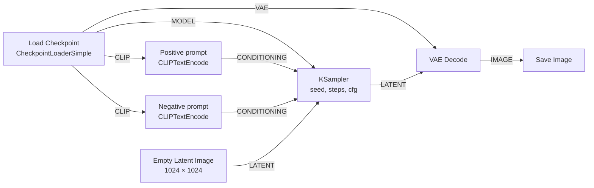

import { Tabs, TabItem } from '@astrojs/starlight/components';

Code: the workflow of this lesson, [`workflows/01-txt2img.api.json`](https://github.com/spareilleux/learn/blob/a1a9bffadaa7156b91ca9c2c2b8885e9e9862dd5/code/comfyui/workflows/01-txt2img.api.json), and the course's C# tool, whose `png-info` command is in [`csharp/Png.cs`](https://github.com/spareilleux/learn/blob/a1a9bffadaa7156b91ca9c2c2b8885e9e9862dd5/code/comfyui/csharp/Png.cs).

## What ComfyUI is, for a C# or Java developer

[ComfyUI](https://github.com/Comfy-Org/ComfyUI) generates images, and more recently video, audio and 3D models, with diffusion models. You don't write a script: you build a graph of nodes in the browser, and a Python server runs it. Each node does one thing, such as loading a model file, encoding a prompt, or sampling, and passes its results to the next nodes through typed connections.

Two pieces work together:

- **The server** is a Python program, `main.py`, built on [PyTorch](https://pytorch.org/) and [aiohttp](https://docs.aiohttp.org/). It holds the node definitions, a queue of prompts, and a cache of node results, and it serves an HTTP and WebSocket API on port 8188.
- **The frontend** is a web application, published as the Python package `comfyui-frontend-package` and served by the same server. It draws the graph, and when you press Run it converts the graph into a *prompt* and posts it to the API. Lesson 3 looks at both JSON formats, and lesson 4 calls the API from C# and Java.

If you have used [TPL Dataflow](https://learn.microsoft.com/dotnet/standard/parallel-programming/dataflow-task-parallel-library) or a build system, the model is familiar. Nodes are blocks with typed inputs and outputs. The server only runs the nodes that an output node needs, in dependency order. And like an incremental build, it skips a node whose inputs haven't changed since the last run and reuses its cached result.

A node is a Python class. Here is `EmptyImage`, one of the simplest, in [`nodes.py`](https://github.com/Comfy-Org/ComfyUI/blob/ee71d5c4993f29086b27fde1629a945ae48425bf/nodes.py#L1979-L2001) at v0.36.0:

```python
class EmptyImage:
    @classmethod
    def INPUT_TYPES(s):
        return {"required": { "width": ("INT", {"default": 512, "min": 1, "max": MAX_RESOLUTION, "step": 1}),
                              "height": ("INT", {"default": 512, "min": 1, "max": MAX_RESOLUTION, "step": 1}),
                              "batch_size": ("INT", {"default": 1, "min": 1, "max": 4096}),
                              "color": ("INT", {"default": 0, "min": 0, "max": 0xFFFFFF, "step": 1, "display": "color"}),
                              }}
    RETURN_TYPES = ("IMAGE",)
    FUNCTION = "generate"
```

`INPUT_TYPES` declares the inputs and their constraints, `RETURN_TYPES` the outputs, and `FUNCTION` names the method the server calls. In C# terms, it is a class whose attributes describe its parameters, discovered by reflection. The server publishes these declarations as JSON at `/object_info`, and the frontend builds its widgets from them. You don't need to write Python in this course until lesson 11, which covers custom nodes.

## The versions

| Piece | Version |
|---|---|
| ComfyUI | [**v0.36.0**](https://github.com/Comfy-Org/ComfyUI/releases/tag/v0.36.0), commit [`ee71d5c`](https://github.com/Comfy-Org/ComfyUI/commit/ee71d5c4993f29086b27fde1629a945ae48425bf), released on 15 September 2026 |
| Frontend | `comfyui-frontend-package` 1.52.7, the version `requirements.txt` pins |
| Python and PyTorch | Python 3.13.14 and PyTorch 2.13.0 for CUDA 13.0, as shipped in the Windows portable build |
| Model | [Stable Diffusion XL base 1.0](https://huggingface.co/stabilityai/stable-diffusion-xl-base-1.0), revision `4621659` |
| Machine | Windows 11, an NVIDIA GeForce RTX 5080 with 16 GB, driver 610.88, 64 GB of RAM |

ComfyUI publishes a release about every week, and its [README](https://github.com/Comfy-Org/ComfyUI/blob/ee71d5c4993f29086b27fde1629a945ae48425bf/README.md) warns that commits between release tags "may be very unstable and break many custom nodes". Every link to ComfyUI's code in this course points at the v0.36.0 commit, so the line numbers stay right.

## Installing ComfyUI

<Tabs syncKey="os">
<TabItem label="Windows">

The [portable build](https://docs.comfy.org/installation/comfyui_portable_windows) bundles its own Python, PyTorch and ComfyUI in one archive. For a recent NVIDIA card, download `ComfyUI_windows_portable_nvidia.7z` from the [v0.36.0 release](https://github.com/Comfy-Org/ComfyUI/releases/tag/v0.36.0): 1,917,442,353 bytes, about 1.8 GB. Extract it with 7-Zip or with Explorer, then start it:

```powershell
cd ComfyUI_windows_portable
.\run_nvidia_gpu.bat
```

The batch file runs `.\python_embeded\python.exe -s ComfyUI\main.py --windows-standalone-build`. The release also has builds for older NVIDIA cards (CUDA 12.6), for AMD and for Intel GPUs; this course only ran the NVIDIA one.

</TabItem>
<TabItem label="Linux / WSL">

There is no official installer or container image, so you install ComfyUI as a Python application, in a virtual environment. The [manual install page](https://docs.comfy.org/installation/manual_install) uses conda; a `venv` works the same way:

```bash
git clone --depth 1 --branch v0.36.0 https://github.com/Comfy-Org/ComfyUI.git
cd ComfyUI
python3.13 -m venv .venv
source .venv/bin/activate
# NVIDIA GPU (CUDA 13.0)
pip install torch torchvision torchaudio --extra-index-url https://download.pytorch.org/whl/cu130
# or, without a GPU:
# pip install torch==2.13.0 torchvision==0.28.0 torchaudio --index-url https://download.pytorch.org/whl/cpu
pip install -r requirements.txt
python main.py
```

The CPU variant is what the course's CI runs on Ubuntu. The CUDA variant is *to verify*: the course's GPU machine runs Windows.

</TabItem>
<TabItem label="macOS">

On Apple Silicon, PyTorch runs on the GPU through [MPS](https://docs.pytorch.org/docs/stable/notes/mps.html), Apple's Metal backend. The install is the same as on Linux, with PyTorch from PyPI:

```bash
git clone --depth 1 --branch v0.36.0 https://github.com/Comfy-Org/ComfyUI.git
cd ComfyUI
python3.13 -m venv .venv
source .venv/bin/activate
pip install torch==2.13.0 torchvision==0.28.0 torchaudio
pip install -r requirements.txt
python main.py
```

The course's CI runs these commands on a macOS runner and uses the CPU only. Rendering SDXL on an M-series GPU is *to verify*: the [README](https://github.com/Comfy-Org/ComfyUI/blob/ee71d5c4993f29086b27fde1629a945ae48425bf/README.md) recommends a nightly PyTorch for Apple Silicon.

</TabItem>
</Tabs>

When the server is ready, its log ends with `To see the GUI go to: http://127.0.0.1:8188`. It listens on 127.0.0.1 only. The `--listen` flag opens it to the network, but the server has no login among its [startup flags](https://docs.comfy.org/development/comfyui-server/startup-flags): anyone who reaches the port can queue work, upload files and read your outputs.

The course reuses a portable build that was already on the machine, without changing it. So it starts the server with its own base directory, which holds the input, output, temp, user and custom node folders, and it keeps the model folder of the install:

```powershell
.\python_embeded\python.exe -s ComfyUI\main.py --base-directory D:\comfy-course `
  --models-directory .\ComfyUI\models --database-url sqlite:///:memory: --disable-auto-launch
```

`--database-url sqlite:///:memory:` keeps the server's small asset database in memory instead of in the user folder. Two surprises came up with `--base-directory` at v0.36.0:

- The server stopped at startup with `FileNotFoundError` when the base directory had no `custom_nodes` folder, because it lists that folder before loading anything ([`main.py`, lines 198 to 201](https://github.com/Comfy-Org/ComfyUI/blob/ee71d5c4993f29086b27fde1629a945ae48425bf/main.py#L198-L201)). Creating the empty folder is enough.
- The flag moves the models folder too, unless `--models-directory` points elsewhere.

On this machine the server answered in about 10 seconds. The start of its log says what it found:

```text
Total VRAM 16303 MB, total RAM 65235 MB
pytorch version: 2.13.0+cu130
Set vram state to: NORMAL_VRAM
Device: cuda:0 NVIDIA GeForce RTX 5080 : cudaMallocAsync
DynamicVRAM support detected and enabled
Python version: 3.13.14 (tags/v3.13.14:fd17997, Jun 10 2026, 13:03:48) [MSC v.1944 64 bit (AMD64)]
ComfyUI version: 0.36.0
comfyui-frontend-package version: 1.52.7
Starting server

To see the GUI go to: http://127.0.0.1:8188
```

## A model, and its license

ComfyUI ships no model. A diffusion *checkpoint* is one file that holds three networks, which lesson 2 explains: a denoising network, one or more text encoders, and a VAE. This course starts with [Stable Diffusion XL base 1.0](https://huggingface.co/stabilityai/stable-diffusion-xl-base-1.0), published by Stability AI in July 2023. It is old by 2026 standards, but it runs in 16 GB, needs no account to download, and is what most tutorials and custom nodes were first written for. Lesson 8 compares it with recent models.

| File | Size | SHA-256 |
|---|---|---|
| [`sd_xl_base_1.0.safetensors`](https://huggingface.co/stabilityai/stable-diffusion-xl-base-1.0/blob/main/sd_xl_base_1.0.safetensors) | 6,938,078,334 bytes | `31e35c80fc4829d14f90153f4c74cd59c90b779f6afe05a74cd6120b893f7e5b` |

Put it in `models/checkpoints/`, and check its hash with `certutil -hashfile <file> SHA256` on Windows, `sha256sum` on Linux, or `shasum -a 256` on macOS; the file on this course's machine matched. The [`safetensors`](https://huggingface.co/docs/safetensors/index) format holds tensors and a JSON header, and no code, unlike older `.ckpt` files, which are Python pickles that can run code when loaded. The server log says `Checkpoint files will always be loaded safely.`

The model is under the [CreativeML Open RAIL++-M License](https://huggingface.co/stabilityai/stable-diffusion-xl-base-1.0/blob/main/LICENSE.md). A RAIL license gives broad rights to use and share the model and its outputs, and adds use restrictions listed in an attachment. Read it before you use the model in a product: this course doesn't interpret it. The model card adds its own limits: "The model does not achieve perfect photorealism", "The model cannot render legible text", and "Faces and people in general may not be generated properly." The course's images contain no real people and no brands.

No model file is in the repository: the course's CI uses workflows that need none.

## The text-to-image graph

The simplest graph that makes an image has seven nodes:



| Node | What it does | Outputs |
|---|---|---|
| `CheckpointLoaderSimple` | reads the checkpoint file and splits it into its three networks | `MODEL`, `CLIP`, `VAE` |
| `CLIPTextEncode`, twice | turns a prompt into vectors the model is conditioned on: what you want, and what you don't | `CONDITIONING` |
| `EmptyLatentImage` | makes a blank latent image, a tensor of zeros one eighth of the image size | `LATENT` |
| `KSampler` | adds noise from the seed, then removes it step by step, guided by the prompts | `LATENT` |
| `VAEDecode` | decodes the latent into pixels | `IMAGE` |
| `SaveImage` | writes a PNG to the output folder | none: it is an *output node* |

The types in capitals are how the frontend knows what can connect to what. A `LATENT` output only plugs into a `LATENT` input, the way a compiler checks argument types. `SaveImage` is an output node: when you queue the graph, the server starts from the output nodes and works back through their inputs. A node that no output needs doesn't run.

## A first image, with curl

In the browser, you would load this graph from the templates, type a prompt, and press Run. The API does the same thing without the browser. The course's file [`workflows/01-txt2img.api.json`](https://github.com/spareilleux/learn/blob/a1a9bffadaa7156b91ca9c2c2b8885e9e9862dd5/code/comfyui/workflows/01-txt2img.api.json) describes the seven nodes in the *API format*: one entry per node, keyed by an id, with its type and its inputs. An input is either a value, or a link written `["4", 1]`, which means output 1 of node 4:

```json
  "3": {
    "class_type": "KSampler",
    "inputs": {
      "seed": 42,
      "steps": 25,
      "cfg": 7.0,
      "sampler_name": "euler",
      "scheduler": "normal",
      "denoise": 1.0,
      "model": ["4", 0],
      "positive": ["6", 0],
      "negative": ["7", 0],
      "latent_image": ["5", 0]
    }
  },
```

To queue it, post it under a `prompt` key:

<Tabs syncKey="os">
<TabItem label="Windows">

```powershell
$workflow = Get-Content code\comfyui\workflows\01-txt2img.api.json -Raw
$body = '{"prompt": ' + $workflow + '}'
Invoke-RestMethod -Method Post -Uri http://127.0.0.1:8188/prompt -ContentType application/json -Body $body
```

</TabItem>
<TabItem label="Linux / WSL">

```bash
curl -s -X POST http://127.0.0.1:8188/prompt -H 'Content-Type: application/json' \
  -d "{\"prompt\": $(cat code/comfyui/workflows/01-txt2img.api.json)}"
```

</TabItem>
<TabItem label="macOS">

```bash
curl -s -X POST http://127.0.0.1:8188/prompt -H 'Content-Type: application/json' \
  -d "{\"prompt\": $(cat code/comfyui/workflows/01-txt2img.api.json)}"
```

</TabItem>
</Tabs>

The server checks the graph, puts it in its queue, and answers at once, before anything runs:

```json
{"prompt_id": "fbbda761-f93f-4d80-9403-0a5d47fc3306", "number": 0, "node_errors": {}}
```

`number` is the position in the queue. When the prompt has run, `GET /history/<prompt_id>` returns what it produced; here, trimmed:

```json
"outputs": {"9": {"images": [{"filename": "metronome_00001_.png", "subfolder": "l01", "type": "output"}]}},
"status": {"status_str": "success", "completed": true, "messages": [
  ["execution_start", {"prompt_id": "fbbda761-…", "timestamp": 1789575897123}],
  ["execution_cached", {"nodes": [], "prompt_id": "fbbda761-…", "timestamp": 1789575897124}],
  ["execution_success", {"prompt_id": "fbbda761-…", "timestamp": 1789575911832}]]}
```


*Rendered by ComfyUI v0.36.0: Stable Diffusion XL base 1.0, seed 42, 25 steps, `euler` sampler, `normal` scheduler, CFG 7, 1024 × 1024, workflow [`01-txt2img.api.json`](https://github.com/spareilleux/learn/blob/a1a9bffadaa7156b91ca9c2c2b8885e9e9862dd5/code/comfyui/workflows/01-txt2img.api.json), reduced to 768 × 768 for this page.*

The prompt asked for "a brass metronome on an old wooden workbench". SDXL drew something closer to an hourglass. The image is still a correct result: the model makes what its training data associates with the words, and a metronome is a rare object. Lesson 2 changes the seed and the settings: with seed 43, the object comes closer to a metronome.

## What the time goes to

The log shows how the server spent the 14.71 seconds of this first run:

```text
Requested to load SDXLClipModel
Model SDXLClipModel prepared for dynamic VRAM loading. 1560MB Staged. 0 patches attached. Force pre-loaded 180 weights: 400 KB.
Requested to load SDXL
Model SDXL prepared for dynamic VRAM loading. 4896MB Staged. 0 patches attached. Force pre-loaded 512 weights: 1197 KB.
100%|##########| 25/25 [00:03<00:00,  6.39it/s]
Requested to load AutoencoderKL
Model AutoencoderKL prepared for dynamic VRAM loading. 159MB Staged. 0 patches attached. Force pre-loaded 112 weights: 91 KB.
Prompt executed in 14.71 seconds
```

The two text encoders take 1.5 GB, the denoising network 4.9 GB, and the VAE 159 MB. The 25 steps themselves took about 4 seconds, at 6.4 steps per second, after a 6.5-second first step in which the model was initialized. The rest went to reading the 6.9 GB file and moving weights to the GPU.

| Run | Time |
|---|---|
| First run after the server started | 14.71 s, then 12.99 s and 13.30 s after two restarts |
| Same graph, new seed: only the sampler, the decoder and the save run again | 4.53 to 4.89 s |
| Same graph, only the file name prefix changed: only `SaveImage` runs | 0.07 to 0.09 s |

The last line is the cache at work: the history says `"execution_cached": {"nodes": ["4", "5", "6", "7", "3", "8"]}`, and `SaveImage` writes the cached image under its new name. When nothing at all has changed, even `SaveImage` is in the list, and no new file is written.

## Where the image went

`SaveImage` wrote `output/l01/metronome_00001_.png`: the prefix `l01/metronome` gives a subfolder and a name, and the server adds a five-digit counter. The PNG also holds the prompt that made it. The course's C# tool lists the file's chunks:

```text
> dotnet out/csharp/comfy.dll png-info output/l01/metronome_00001_.png
chunk IHDR: 1 x, 13 bytes
chunk tEXt: 1 x, 921 bytes
chunk IDAT: 23 x, 3146752 bytes once inflated
chunk IEND: 1 x, 0 bytes
text prompt: 914 characters: {"4": {"class_type": "CheckpointLoaderSimple", "inputs": {"c...
image: 1024 x 1024, 3 channels, pixel SHA-256 698e7867e7fc04fb
```

The `tEXt` chunk named `prompt` holds the API-format graph as JSON: open the PNG in ComfyUI's frontend, and it rebuilds the graph. Lesson 3 reads both chunks, and explains why a PNG saved from the browser has a second one.

## Key takeaways

- ComfyUI is a Python server that runs graphs of typed nodes, and a browser frontend that edits them. The API takes the same graphs as the browser.
- The server runs only what an output node needs, and caches node results: an unchanged graph runs in a tenth of a second.
- The Windows portable build is one archive. On Linux and macOS, ComfyUI is a Python application in a virtual environment.
- A checkpoint holds a denoising network, text encoders and a VAE. SDXL base 1.0 is 6.9 GB, under the CreativeML Open RAIL++-M License, and draws what its training data suggests, not always what you asked for.
- The server has no authentication: keep it on 127.0.0.1.

## Exercises

1. Queue the lesson's workflow twice with the same inputs, then once with `"seed": 43`. Compare the three entries of `/history`: which nodes ran each time?
2. `GET /object_info/EmptyLatentImage` returns the declaration of a node. What are the minimum size and the step of `width`, and why would a latent image need a step?
3. Change the negative prompt to an empty string and queue the workflow. Which nodes run again, and why does `CLIPTextEncode` node 6 not?

<details>
<summary>Solution 1</summary>

The first run has `"execution_cached": {"nodes": []}`: every node ran. The second lists all seven nodes, `SaveImage` included, and writes no new file: its `outputs` name the same `metronome_00001_.png` as the first run. The third lists nodes 4, 5, 6 and 7: the checkpoint, the empty latent and both prompts are reused, and `KSampler`, `VAEDecode` and `SaveImage` run, because the seed is an input of `KSampler` and the other two come after it in the graph.

</details>

<details>
<summary>Solution 2</summary>

```json
"width": ["INT", {"default": 512, "min": 16, "max": 16384, "step": 8, "tooltip": "The width of the latent images in pixels."}]
```

The minimum is 16 and the step 8. The node creates a tensor of `width // 8` by `height // 8` ([`nodes.py`, line 1265](https://github.com/Comfy-Org/ComfyUI/blob/ee71d5c4993f29086b27fde1629a945ae48425bf/nodes.py#L1265)): the VAE encodes 8 pixels into one latent position, so a width that isn't a multiple of 8 would be cut. The server's own `max`, 16384, is `MAX_RESOLUTION`; the `/object_info` answer gives the number, not the name.

</details>

<details>
<summary>Solution 3</summary>

Node 7, the negative prompt, runs again because its `text` input changed, and so do `KSampler`, `VAEDecode` and `SaveImage`, which depend on it. Node 6 has the same inputs as before, the same `text` and the same link to node 4's `CLIP`, so the server reuses its cached output. A node's cached result is reused when its own inputs, and those of the nodes it depends on, are unchanged.

</details>

## Sources

- ComfyUI at v0.36.0: [`nodes.py`](https://github.com/Comfy-Org/ComfyUI/blob/ee71d5c4993f29086b27fde1629a945ae48425bf/nodes.py), [`main.py`](https://github.com/Comfy-Org/ComfyUI/blob/ee71d5c4993f29086b27fde1629a945ae48425bf/main.py), [`comfy/cli_args.py`](https://github.com/Comfy-Org/ComfyUI/blob/ee71d5c4993f29086b27fde1629a945ae48425bf/comfy/cli_args.py), [README](https://github.com/Comfy-Org/ComfyUI/blob/ee71d5c4993f29086b27fde1629a945ae48425bf/README.md), [release v0.36.0](https://github.com/Comfy-Org/ComfyUI/releases/tag/v0.36.0).
- ComfyUI documentation: [Windows portable](https://docs.comfy.org/installation/comfyui_portable_windows), [manual install](https://docs.comfy.org/installation/manual_install), [system requirements](https://docs.comfy.org/installation/system_requirements), [text to image](https://docs.comfy.org/tutorials/basic/text-to-image), [server routes](https://docs.comfy.org/development/comfyui-server/comms_routes).
- [Stable Diffusion XL base 1.0 model card](https://huggingface.co/stabilityai/stable-diffusion-xl-base-1.0) and [license](https://huggingface.co/stabilityai/stable-diffusion-xl-base-1.0/blob/main/LICENSE.md); D. Podell et al., [SDXL: Improving Latent Diffusion Models for High-Resolution Image Synthesis](https://arxiv.org/abs/2307.01952), 2023.
