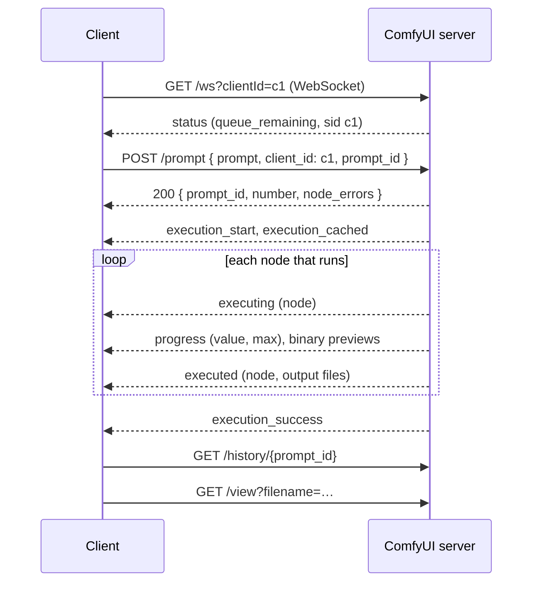

Code: the C# client in [`csharp/ComfyClient.cs`](https://github.com/spareilleux/learn/blob/a1a9bffadaa7156b91ca9c2c2b8885e9e9862dd5/code/comfyui/csharp/ComfyClient.cs), the Java client in [`java/src/main/java/dev/learn/comfy/Main.java`](https://github.com/spareilleux/learn/blob/a1a9bffadaa7156b91ca9c2c2b8885e9e9862dd5/code/comfyui/java/src/main/java/dev/learn/comfy/Main.java), the workflow CI runs without a model in [`workflows/solid-color.api.json`](https://github.com/spareilleux/learn/blob/a1a9bffadaa7156b91ca9c2c2b8885e9e9862dd5/code/comfyui/workflows/solid-color.api.json), and the server script for CI in [`server.sh`](https://github.com/spareilleux/learn/blob/a1a9bffadaa7156b91ca9c2c2b8885e9e9862dd5/code/comfyui/server.sh).

## The routes a client needs

The server's API is what the browser uses; there is no separate public API. The [routes page](https://docs.comfy.org/development/comfyui-server/comms_routes) lists them, and [`server.py`](https://github.com/Comfy-Org/ComfyUI/blob/ee71d5c4993f29086b27fde1629a945ae48425bf/server.py) at v0.36.0 has a few more. Every route is also served under an `/api` prefix, which is what the frontend calls.

| Route | What a client does with it |
|---|---|
| `GET /ws?clientId=…` | opens the WebSocket that carries the progress of the client's prompts |
| `POST /prompt` | validates a prompt and queues it; answers with its id, or with `error` and `node_errors` |
| `GET /history/{prompt_id}` | the outputs and status of a finished prompt |
| `GET /view?filename=…&subfolder=…&type=output` | the bytes of an output file |
| `GET /object_info`, `/object_info/{class}` | the node definitions, as used in lesson 3 |
| `GET /queue`, `POST /queue` | the running and pending prompts; delete pending ones |
| `POST /interrupt` | stops the prompt that is running |
| `POST /free` | unloads models, and frees memory |
| `GET /system_stats` | versions, RAM and VRAM |
| `POST /upload/image` | sends an input image, for lesson 5 |

The v0.36.0 code also has `/api/jobs` routes, to list, read and cancel jobs, which the documentation doesn't mention yet. This course doesn't use them.

## One prompt, step by step



Three details decide whether a client works:

- **Connect first, and pass the same client id.** The server sends a prompt's progress only to the WebSocket whose `clientId` matches the prompt's `client_id`. It doesn't replay events: when a client reconnects with the same id, the handler only sends the node running at that moment, if any ([`server.py`, lines 269 to 290](https://github.com/Comfy-Org/ComfyUI/blob/ee71d5c4993f29086b27fde1629a945ae48425bf/server.py#L269-L290)). A client that connects after posting can miss everything; `/history` is the fallback.
- **The client can choose the prompt id.** `POST /prompt` accepts a `prompt_id`, which must be a UUID "in the canonical lowercase hyphenated form" ([`comfy_execution/jobs.py`](https://github.com/Comfy-Org/ComfyUI/blob/ee71d5c4993f29086b27fde1629a945ae48425bf/comfy_execution/jobs.py#L34-L44)). Choosing it before posting avoids a race: the client knows which events are its own before the answer to the POST arrives. `Guid.NewGuid().ToString()` in C# and `UUID.randomUUID().toString()` in Java both give that form.
- **Stop on `execution_success`, `execution_error` or `execution_interrupted`.** The Python example in ComfyUI's repository waits for an `executing` message with `node` set to `null` ([`script_examples/websockets_api_example.py`, lines 37 to 39](https://github.com/Comfy-Org/ComfyUI/blob/ee71d5c4993f29086b27fde1629a945ae48425bf/script_examples/websockets_api_example.py#L37-L39)). The server still sends one, after writing the history ([`main.py`, line 374](https://github.com/Comfy-Org/ComfyUI/blob/ee71d5c4993f29086b27fde1629a945ae48425bf/main.py#L373-L374)), but the three explicit messages say how the prompt ended.

## The C# client

The client is a command of the course's tool: `comfy run <server> <workflow> [--set node.input=value]... [--out dir]`. It uses [`HttpClient`](https://learn.microsoft.com/dotnet/api/system.net.http.httpclient) and [`ClientWebSocket`](https://learn.microsoft.com/dotnet/api/system.net.websockets.clientwebsocket), with no package. Connecting and posting:

```csharp
string clientId = Guid.NewGuid().ToString("N");
using var socket = new ClientWebSocket();
var wsUri = new UriBuilder(server) { Scheme = server.Scheme == "https" ? "wss" : "ws", Path = "/ws", Query = $"clientId={clientId}" }.Uri;
await socket.ConnectAsync(wsUri, cancel.Token);

// The client can choose the prompt id: a lowercase UUID.
string promptId = Guid.NewGuid().ToString();
var request = new JsonObject { ["prompt"] = workflow, ["client_id"] = clientId, ["prompt_id"] = promptId };
using var response = await http.PostAsJsonAsync("prompt", request, cancel.Token);
```

A WebSocket message can arrive in several frames, so the receive loop reads until `EndOfMessage` before parsing. Text messages are JSON with a `type` and a `data` object; binary messages are previews:

```csharp
using var message = new MemoryStream();
WebSocketReceiveResult result;
do
{
    result = await socket.ReceiveAsync(buffer, cancel);
    if (result.MessageType == WebSocketMessageType.Close) throw new IOException("the server closed the WebSocket");
    message.Write(buffer, 0, result.Count);
} while (!result.EndOfMessage);
```

When the prompt has succeeded, the client reads `/history/{prompt_id}`, downloads each image with `/view`, and decodes it with the PNG reader of lesson 3 to print its pixel hash.

Against the GPU server of lessons 1 and 2, started with `--preview-method taesd`, on the lesson 1 workflow:

```text
> dotnet out/csharp/comfy.dll run http://127.0.0.1:8188 workflows/01-txt2img.api.json
POST /prompt: 200
status: connected, queue_remaining 0
execution_start
execution_cached: []
executing: node 4
executing: node 5
executing: node 7
executing: node 6
executing: node 3
progress: node 3, 1/25
binary message: type 1, 29080 bytes
progress: node 3, 2/25
binary message: type 1, 42113 bytes
…
progress: node 3, 25/25
binary message: type 1, 73406 bytes
executing: node 8
executing: node 9
executed: node 9, l01/metronome_00002_.png
execution_success
GET /view node 9: l01/metronome_00002_.png, 1024 x 1024, pixel SHA-256 698e7867e7fc04fb
```

The pixel hash is lesson 1's, on a freshly started server. The binary messages are the previews that the browser shows during sampling: a 4-byte big-endian event type, 1 for a preview image, then a 4-byte image format, 1 for JPEG, then the image, as [`server.py`](https://github.com/Comfy-Org/ComfyUI/blob/ee71d5c4993f29086b27fde1629a945ae48425bf/server.py#L1305-L1336) writes them. With the default `--preview-method none` there are none. `taesd` decodes each step's latent with a small approximate VAE, so the previews cost time: sampling ran at 4.9 steps per second instead of 6.4.

## The Java client

The Java client does the same with [`java.net.http.HttpClient`](https://docs.oracle.com/en/java/javase/25/docs/api/java.net.http/java/net/http/HttpClient.html), its [`WebSocket`](https://docs.oracle.com/en/java/javase/25/docs/api/java.net.http/java/net/http/WebSocket.html), and [Jackson](https://github.com/FasterXML/jackson) 3.2.2 for JSON. Java's WebSocket is callback-based: a [`WebSocket.Listener`](https://docs.oracle.com/en/java/javase/25/docs/api/java.net.http/java/net/http/WebSocket.Listener.html) receives parts of messages, and asks for the next one with `request(1)`. The client gathers each complete message and puts it in a `BlockingQueue`, so the main thread can read the events in order, like the C# loop:

```java
@Override
public CompletionStage<?> onText(WebSocket socket, CharSequence data, boolean last) {
    text.append(data);
    if (last) {
        messages.add(new Message(text.toString(), null));
        text.setLength(0);
    }
    socket.request(1);
    return null;
}
```

The Java client computes the same pixel hash with [`ImageIO`](https://docs.oracle.com/en/java/javase/25/docs/api/java.desktop/javax/imageio/ImageIO.html), from each pixel's red, green and blue bytes. On the same GPU server, with seed 43:

```text
> java -jar java/target/comfy.jar run http://127.0.0.1:8188 workflows/01-txt2img.api.json --set 3.seed=43
POST /prompt: 200
status: connected, queue_remaining 0
execution_start
execution_cached: [4, 5, 6, 7]
executing: node 3
progress: node 3, 1/25
binary message: type 1, 36289 bytes
…
executing: node 8
executing: node 9
executed: node 9, l01/metronome_00003_.png
execution_success
GET /view node 9: l01/metronome_00003_.png, 1024 x 1024, pixel SHA-256 3dd47bf04931ccaa
```

`3dd47bf04931ccaa` is the hash of the seed-43 render of lesson 2, made twenty minutes earlier on another start of the server: same pixels. The checkpoint and both prompts came from the cache of the C# client's run, since the cache belongs to the server, not to a client.

## What CI checks

GitHub's runners have no GPU, and the course puts no model in the repository. [`solid-color.api.json`](https://github.com/spareilleux/learn/blob/a1a9bffadaa7156b91ca9c2c2b8885e9e9862dd5/code/comfyui/workflows/solid-color.api.json) needs neither: an `EmptyImage` node makes a 64 × 48 image of one color, `ImageInvert` inverts it, and two `SaveImage` nodes save both. [`comfyui-examples.yml`](https://github.com/spareilleux/learn/blob/a1a9bffadaa7156b91ca9c2c2b8885e9e9862dd5/.github/workflows/comfyui-examples.yml) clones ComfyUI at v0.36.0, installs PyTorch for the CPU on Ubuntu, Windows and macOS, and runs `check.sh`, which starts the server with `--cpu` and runs both clients. The C# client, twice, then on the broken workflow of lesson 3:

```text
--- C#, first run
POST /prompt: 200
status: connected, queue_remaining 0
execution_start
execution_cached: []
executing: node 1
executing: node 3
executed: node 3, ci/solid_00001_.png
executing: node 2
executing: node 4
executed: node 4, ci/inverted_00001_.png
execution_success
GET /view node 3: ci/solid_00001_.png, 64 x 48, pixel SHA-256 da28b3b4fc5883a2
GET /view node 4: ci/inverted_00001_.png, 64 x 48, pixel SHA-256 252fab8d4cbe179f
--- C#, same workflow again
POST /prompt: 200
status: connected, queue_remaining 0
execution_start
execution_cached: [1, 2, 3, 4]
executed: node 4, ci/inverted_00001_.png
executed: node 3, ci/solid_00001_.png
execution_success
GET /view node 4: ci/inverted_00001_.png, 64 x 48, pixel SHA-256 252fab8d4cbe179f
GET /view node 3: ci/solid_00001_.png, 64 x 48, pixel SHA-256 da28b3b4fc5883a2
--- C#, a broken workflow
POST /prompt: 400
error prompt_outputs_failed_validation: Prompt outputs failed validation
  node 4 (CheckpointLoaderSimple): value_not_in_list: ckpt_name: 'sd_xl_base_1.0.safetensors' not in []
  node 3 (KSampler): exception_during_inner_validation: '12'
exit code 1
```

Three things in this output were learned the hard way:

- **A cached run still sends `executed`.** The second run executes nothing, but the server replays each output node's result, with the file names of the first run, and writes no new file.
- **The order of the output nodes changes from one server start to the next.** The first version of `check.sh` failed on its second try: `executed: node 3` and `executed: node 4` had swapped. The server keeps the output nodes it validated in a Python set ([`execution.py`, lines 1186 to 1282](https://github.com/Comfy-Org/ComfyUI/blob/ee71d5c4993f29086b27fde1629a945ae48425bf/execution.py#L1186-L1282)), and Python randomizes the hash of strings at each start, so the iteration order of a set of node ids changes. [`server.sh`](https://github.com/spareilleux/learn/blob/a1a9bffadaa7156b91ca9c2c2b8885e9e9862dd5/code/comfyui/server.sh) sets `PYTHONHASHSEED=0` so that CI's output can be compared. A real client must not depend on that order.
- **Only the first `status` message is printed.** It answers the connection and carries the session id. The server sends more as its queue changes, two per prompt in every run of this course, but nothing documents how many, so the clients don't print them.

The Java client runs the same workflow with `--set 1.color=65280`, pure green, so that the server doesn't answer from its cache, and the broken workflow; its output is in [`expected/04-run-java.txt`](https://github.com/spareilleux/learn/blob/a1a9bffadaa7156b91ca9c2c2b8885e9e9862dd5/code/comfyui/expected/04-run-java.txt). Both clients print the same pixel hashes for the same images, and both hashes are the same on the three operating systems.

What CI doesn't check: previews, `progress` messages, which the solid-color nodes don't send, and `execution_error`. The clients print an execution error's node, type and message from the fields in the server's code, but no run of this course has produced one yet, so that path is *to verify*.

## Around the happy path

- **Timeouts.** A first SDXL run took 15 seconds here, and a large video workflow can take many minutes. The clients give up after 20 minutes without a message. A long-running service should rather keep the WebSocket open, reconnect with the same client id when it drops, and read `/history/{prompt_id}` to catch up.
- **Interrupting.** `POST /interrupt` with no body stops what is running, whoever queued it; with `{"prompt_id": …}`, the v0.36.0 code stops it only if that prompt is the one running ([`server.py`, lines 1163 to 1193](https://github.com/Comfy-Org/ComfyUI/blob/ee71d5c4993f29086b27fde1629a945ae48425bf/server.py#L1163-L1193)). A prompt that hasn't started is removed from the queue with `POST /queue` and `{"delete": [prompt_id]}`. Neither was run for this lesson: *to verify*.
- **One server, one queue.** Prompts run one at a time, in queue order, whatever client posted them. Two clients share the server's cache, which is why the Java run above reused the C# run's text encodings.
- **No authentication.** Everything above works for anyone who can reach the port. Lesson 12, on production, puts the server behind something that checks who is calling.

## Key takeaways

- A client opens the WebSocket with its client id, posts the prompt with the same client id and, ideally, a prompt id it chose, follows the messages until `execution_success`, `execution_error` or `execution_interrupted`, then reads `/history` and downloads the files with `/view`.
- In C#, `HttpClient` and `ClientWebSocket` are enough; in Java, `java.net.http` and a JSON library. Both must reassemble messages that arrive in several frames.
- Binary WebSocket messages are previews: an event type, an image format, and a JPEG or PNG.
- Don't rely on the order of output nodes, on the number of `status` messages, or on getting new files from a cached run.

## Your turn

Add to the C# or the Java client the one thing this lesson left out: a progress display fed by the `progress` messages, or a `POST /interrupt` triggered from the keyboard. Then unplug the network cable — or stop the server — in the middle of a run, and see what your client does. A client that hangs forever on a closed socket is the most common bug in this kind of code.

## Exercises

1. Run the C# client twice on the lesson 1 workflow with `--set 9.filename_prefix="l04/again"` the second time. Which messages does the second run print, and does it write a file?
2. Add a `--timeout` option to the C# client, and make it call `POST /interrupt` when the time runs out. What does the WebSocket say next?
3. The Java client's `onBinary` copies the buffer it receives into a new one. Why not keep the `ByteBuffer` that the listener receives?

<details>
<summary>Solution 1</summary>

The second run prints `execution_cached: [4, 5, 6, 7, 3, 8]`, then `executing: node 9`, `executed: node 9, l04/again_00001_.png`, and `execution_success`. Only `SaveImage` runs, because its `filename_prefix` input changed, and it writes a new file from the cached image. Lesson 1 measured this case at 0.07 to 0.09 seconds.

</details>

<details>
<summary>Solution 2</summary>

```csharp
using var cancel = new CancellationTokenSource(timeout);
try
{
    string outcome = await FollowEvents(socket, promptId, cancel.Token);
}
catch (OperationCanceledException)
{
    await http.PostAsJsonAsync("interrupt", new JsonObject { ["prompt_id"] = promptId });
    // ...then keep reading, with a new token, until execution_interrupted
}
```

Cancelling a pending `ReceiveAsync` is expected to leave the `ClientWebSocket` aborted, so the client would reconnect with the same client id to read what follows; the server should then send `execution_interrupted`, with the node that was running. None of this solution has been run: *to verify*, including the state of the socket after cancellation, and whether the reconnection arrives in time to see the message or `/history` is the only place left to read the outcome.

</details>

<details>
<summary>Solution 3</summary>

The [`WebSocket.Listener`](https://docs.oracle.com/en/java/javase/25/docs/api/java.net.http/java/net/http/WebSocket.Listener.html) documentation says, for `onBinary`: "Do not access the ByteBuffer after this CompletionStage has completed." The client returns `null`, which counts as a stage already completed. Keeping the buffer and reading it later on the main thread would break that rule, and could read bytes that the implementation has reused. Copying it, as the client does, avoids that; so does converting the text parts to a `String` before returning from `onText`.

</details>

## Sources

- ComfyUI documentation: [server routes](https://docs.comfy.org/development/comfyui-server/comms_routes), [messages](https://docs.comfy.org/development/comfyui-server/comms_messages), [API examples](https://docs.comfy.org/development/comfyui-server/api-examples).
- ComfyUI at v0.36.0: [`server.py`](https://github.com/Comfy-Org/ComfyUI/blob/ee71d5c4993f29086b27fde1629a945ae48425bf/server.py), [`protocol.py`](https://github.com/Comfy-Org/ComfyUI/blob/ee71d5c4993f29086b27fde1629a945ae48425bf/protocol.py), [`main.py`](https://github.com/Comfy-Org/ComfyUI/blob/ee71d5c4993f29086b27fde1629a945ae48425bf/main.py), [`execution.py`](https://github.com/Comfy-Org/ComfyUI/blob/ee71d5c4993f29086b27fde1629a945ae48425bf/execution.py), [`comfy_execution/jobs.py`](https://github.com/Comfy-Org/ComfyUI/blob/ee71d5c4993f29086b27fde1629a945ae48425bf/comfy_execution/jobs.py).
- .NET: [`ClientWebSocket`](https://learn.microsoft.com/dotnet/api/system.net.websockets.clientwebsocket), [`HttpClient`](https://learn.microsoft.com/dotnet/api/system.net.http.httpclient), [WebSockets in .NET](https://learn.microsoft.com/dotnet/fundamentals/networking/websockets).
- Java 25: [`HttpClient`](https://docs.oracle.com/en/java/javase/25/docs/api/java.net.http/java/net/http/HttpClient.html), [`WebSocket`](https://docs.oracle.com/en/java/javase/25/docs/api/java.net.http/java/net/http/WebSocket.html), [`WebSocket.Listener`](https://docs.oracle.com/en/java/javase/25/docs/api/java.net.http/java/net/http/WebSocket.Listener.html).
