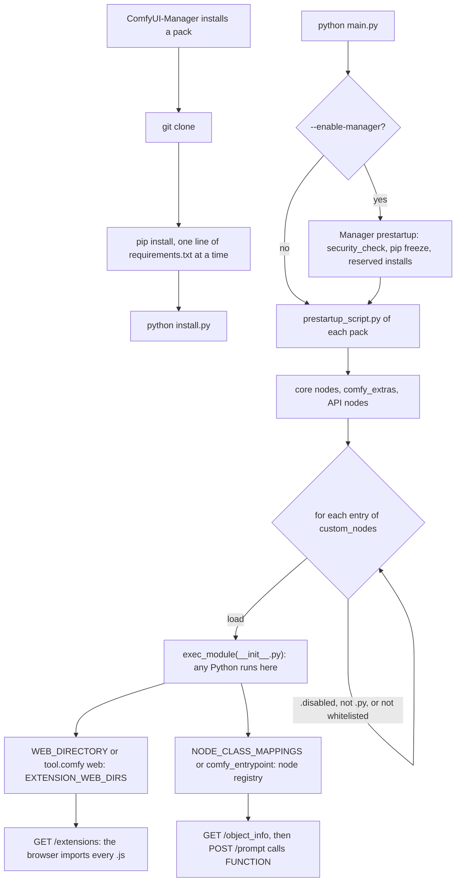

Code: the Guitar Alchemist node pack in [`custom-nodes/ga/`](https://github.com/spareilleux/learn/tree/22f2bf71c21d2cc4f426c0e917e7e19dbfca5bc3/code/comfyui/custom-nodes/ga), with its tests and workflows, and the audit script, its fixture and the pickle demo in [`custom-nodes/audit/`](https://github.com/spareilleux/learn/tree/22f2bf71c21d2cc4f426c0e917e7e19dbfca5bc3/code/comfyui/custom-nodes/audit).

Every node of the first ten lessons came with ComfyUI. Lesson 6 needed a pose preprocessor that the core doesn't have, and lesson 8 met GGUF files that only a custom node loads. A custom node is a folder of Python code that ComfyUI imports into its own process at startup, with the rights of the user who started it. There is no sandbox, no permission and no signature. This lesson reads how the loading works, writes a small pack, and then looks at the risks: what the installer checks, what has already gone wrong, how to read a pack before installing it, and how to limit the damage if you install a bad one.

## How ComfyUI loads a pack

### The folder and the import

At startup, [`init_external_custom_nodes`](https://github.com/Comfy-Org/ComfyUI/blob/ee71d5c4993f29086b27fde1629a945ae48425bf/nodes.py#L2344-L2389) lists every folder registered as `custom_nodes`, by default `ComfyUI/custom_nodes/` or `custom_nodes/` under `--base-directory`, and tries each entry:

- a file that doesn't end in `.py` is skipped, and so is a name ending in `.disabled`;
- with `--disable-all-custom-nodes`, only the names given to `--whitelist-custom-nodes` load;
- with `--enable-manager`, ComfyUI-Manager can block an entry ("Blocked by policy"); in 4.2.2 its [`should_be_disabled`](https://github.com/Comfy-Org/ComfyUI-Manager/blob/bd4ede2237c97b3a71569a0301a0be9db226c7e9/comfyui_manager/__init__.py#L68-L80) only blocks an old copy of the Manager itself installed as a custom node.

Then [`load_custom_node`](https://github.com/Comfy-Org/ComfyUI/blob/ee71d5c4993f29086b27fde1629a945ae48425bf/nodes.py#L2246-L2342) imports the pack with [`importlib`](https://docs.python.org/3/library/importlib.html): a single `.py` file, or the folder's `__init__.py`. The line that matters is `module_spec.loader.exec_module(module)`, line 2266. It runs the whole module, top to bottom, before ComfyUI has looked at anything it contains. Whatever `__init__.py` imports, starts or downloads happens here, even if the pack then turns out to define no node.

After the import, ComfyUI reads three names from the module:

- `NODE_CLASS_MAPPINGS`, a dict from a node's unique name to its class; without it, a V3 pack exports `comfy_entrypoint` instead, and without either, the log says "Skip … due to the lack of NODE_CLASS_MAPPINGS or comfy_entrypoint (need one)";
- `NODE_DISPLAY_NAME_MAPPINGS`, the names shown in the interface;
- `WEB_DIRECTORY`, a folder of JavaScript, or the `web` key under `[tool.comfy]` in the pack's `pyproject.toml`.

A node name that already exists in ComfyUI's core is ignored (the `ignore` set of built-in names), so a pack can't replace `KSampler` through the mapping. It can still replace anything by other means: the pack is ordinary Python in the same process. ComfyUI knows it, and [`hook_breaker_ac10a0.py`](https://github.com/Comfy-Org/ComfyUI/blob/ee71d5c4993f29086b27fde1629a945ae48425bf/hook_breaker_ac10a0.py#L1-L17) opens with "Prevent custom nodes from hooking anything important": it saves `comfy.model_management.cast_to` before the packs load and puts it back afterwards. It protects one function, for stability. It is not a security boundary, and it doesn't try to be one.

If the import raises, ComfyUI logs the traceback, "Cannot import … module for custom nodes", and carries on. The [lifecycle page](https://docs.comfy.org/custom-nodes/backend/lifecycle) says so: "If there is an error in your code, Comfy will continue, but will report the module as having failed to load. So check the Python console!"

### Before the import: `prestartup_script.py`

Earlier still, [`execute_prestartup_script`](https://github.com/Comfy-Org/ComfyUI/blob/ee71d5c4993f29086b27fde1629a945ae48425bf/main.py#L183-L237) runs the `prestartup_script.py` of every pack folder that has one, long before the nodes are loaded. Packs use it to patch paths or settings early. rgthree-comfy has one; so does ComfyUI-Manager, which uses it to run its own `security_check()`.

### The browser side: `WEB_DIRECTORY`

Every folder registered in `EXTENSION_WEB_DIRS` is served under `/extensions/<pack>/` ([server.py, line 1246](https://github.com/Comfy-Org/ComfyUI/blob/ee71d5c4993f29086b27fde1629a945ae48425bf/server.py#L1246-L1247)), and [`GET /extensions`](https://github.com/Comfy-Org/ComfyUI/blob/ee71d5c4993f29086b27fde1629a945ae48425bf/server.py#L356-L370) returns the list of all their `.js` files. The frontend imports each of them into the page. A pack's JavaScript therefore runs in the browser tab of everyone who opens the interface, with access to the page, the queue API and whatever the page can reach. [ComfyUI's JavaScript overview](https://docs.comfy.org/custom-nodes/js/javascript_overview) describes the extension hooks.

`WEB_DIRECTORY` is a convention, not a gate. [ComfyUI-Impact-Pack's `__init__.py`](https://github.com/ltdrdata/ComfyUI-Impact-Pack/blob/429d0159ad429e64d2b3916e6e7be9c22d025c3c/__init__.py#L449-L453) writes into ComfyUI's dictionary directly: `nodes.EXTENSION_WEB_DIRS["ComfyUI-Impact-Pack"] = os.path.join(...)`, with the comment "Inject directly into EXTENSION_WEB_DIRS instead of WEB_DIRECTORY". It works, because the pack's Python can change any object of the server.

### At install time: `requirements.txt` and `install.py`

ComfyUI itself never installs anything. ComfyUI-Manager does, in [`execute_install_script`](https://github.com/Comfy-Org/ComfyUI-Manager/blob/bd4ede2237c97b3a71569a0301a0be9db226c7e9/comfyui_manager/glob/manager_core.py#L1997-L2039): after cloning a pack, it runs `pip install` for each line of its `requirements.txt`, then `python install.py` if the file exists. On Windows, [`try_install_script`](https://github.com/Comfy-Org/ComfyUI-Manager/blob/bd4ede2237c97b3a71569a0301a0be9db226c7e9/comfyui_manager/glob/manager_core.py#L1903-L1925) doesn't run them at once: it reserves them, and the Manager's prestartup runs them at the next start. Either way, the pack's code and its dependencies' code run before you ever add one of its nodes to a graph.



## A pack of Guitar Alchemist nodes

The course's pack draws what [Guitar Alchemist](https://github.com/GuitarAlchemist/ga) (GA) knows about the fretboard, as images a ComfyUI graph can use. It has three nodes:

| Node | Inputs | Outputs |
|---|---|---|
| `GAChordDiagram` (GA Chord Diagram) | `chord`: a voicing from the low E like `x32010` or `x-10-12-12-12-10`, or a symbol such as `C`, `Am`, `G7`, `Bm7b5`; `size`: 128 to 2048 pixels | `image`: a black-on-white chord chart, size × size; `ga_diagram`: the same voicing in GA's order |
| `GAFretboardControlMap` (GA Fretboard Control Map) | `source`: `chord` or `scale`; `chord`; `key` and `mode`; `fret_start` 0 to 23 and `fret_end` 1 to 24; `width` and `height`, 256 to 2048 in steps of 8, 1024 by default; `line_width`; optional `note_style`, `ring` (a black disc with a white outline, the default) or `filled` (a white disc), and `inlays`, `show` or `hide`; the chord `xxxxxx` draws an empty neck | `lines`: white edges on black, like a Canny map; `depth`: a depth-like map, nearer is brighter; `layout`: JSON with the board, the fret wires and strings, and each note's and inlay's center and radius in pixels |
| `GAScalePrompt` (GA Scale Prompt) | `key`, `mode`, `subject` | `prompt`: a text fragment, the same every time |

### The theory, computed locally

The nodes don't call a GA server. They compute from tables copied out of GA's source, pinned on a commit, and [`theory.py`](https://github.com/spareilleux/learn/blob/22f2bf71c21d2cc4f426c0e917e7e19dbfca5bc3/code/comfyui/custom-nodes/ga/theory.py#L1-L18) cites each one:

- the tuning is GA's `Tuning.Default`, ["E2 A2 D3 G3 B3 E4"](https://github.com/GuitarAlchemist/ga/blob/a826864f3a012cad88e415954bf57eca0ce12aa6/Common/GA.Domain.Core/Instruments/Tuning.cs#L23), which GA [stores highest string first](https://github.com/GuitarAlchemist/ga/blob/a826864f3a012cad88e415954bf57eca0ce12aa6/Common/GA.Domain.Core/Instruments/Tuning.cs#L86-L109);
- the modes are the rotations of GA's [`Scale.Major`](https://github.com/GuitarAlchemist/ga/blob/a826864f3a012cad88e415954bf57eca0ce12aa6/Common/GA.Domain.Core/Theory/Tonal/Scales/Scale.cs#L53), with the names of [`MajorScaleDegree.ToName`](https://github.com/GuitarAlchemist/ga/blob/a826864f3a012cad88e415954bf57eca0ce12aa6/Common/GA.Domain.Core/Theory/Tonal/Primitives/Diatonic/MajorScaleDegree.cs#L52-L62).

The order of the strings needs care. Chord charts write a voicing from string 6, the low E: open C major is `x32010`. GA numbers the strings from [string 1, "the first string (Highest pitch)"](https://github.com/GuitarAlchemist/ga/blob/a826864f3a012cad88e415954bf57eca0ce12aa6/Common/GA.Domain.Core/Instruments/Primitives/Str.cs#L35-L43), and its diagrams read `0-1-0-2-3-x`, as the [music theory course's lesson 3](../../music-theory-ga/03-chords-and-voicings/) found. The nodes take the chart order, which is what a guitarist types, and return GA's order in `ga_diagram`, so a workflow can pass it on to GA.

The modes are spelled with one letter per degree, then an accidental: C Dorian is `C D Eb F G A Bb`. GA's `Note.Chromatic.ToAccidented` gives every black key a sharp name, so the same scale would come out with `D#` and `A#`; the [music theory course](../../music-theory-ga/03-chords-and-voicings/) describes that spelling issue.

### A node class

A V1 node is a plain class. Here is the chord diagram, from [`nodes.py`](https://github.com/spareilleux/learn/blob/22f2bf71c21d2cc4f426c0e917e7e19dbfca5bc3/code/comfyui/custom-nodes/ga/nodes.py#L25-L45):

```python
class GAChordDiagram:
    """A chord chart for a voicing (x32010, low E first) or a known symbol (C, Am, G7, Bm7b5...)."""

    @classmethod
    def INPUT_TYPES(cls):
        return {
            "required": {
                "chord": ("STRING", {"default": "x32010", "multiline": False}),
                "size": ("INT", {"default": 512, "min": 128, "max": 2048, "step": 8}),
            }
        }

    RETURN_TYPES = ("IMAGE", "STRING")
    RETURN_NAMES = ("image", "ga_diagram")
    FUNCTION = "draw"
    CATEGORY = CATEGORY
    DESCRIPTION = "Draws a chord diagram. ga_diagram is the same voicing in GA's order, high E first."

    def draw(self, chord, size):
        _, frets = theory.resolve_chord(chord)
        return (to_image(drawing.chord_diagram(frets, size)), theory.ga_diagram(frets))
```

`INPUT_TYPES` is what `/object_info` publishes, and what lesson 3 validated workflows against. `FUNCTION` names the method the executor calls, with one keyword argument per input, and the method returns a tuple with one value per `RETURN_TYPES` entry. An `IMAGE` is a float32 tensor of shape `[batch, height, width, channels]` with values from 0 to 1, as [`LoadImage` builds it](https://github.com/Comfy-Org/ComfyUI/blob/ee71d5c4993f29086b27fde1629a945ae48425bf/nodes.py#L1784-L1785). The pack's `to_image` stacks [Pillow](https://pillow.readthedocs.io/en/stable/) images into that shape, and returns a [NumPy](https://numpy.org/doc/stable/) array when PyTorch is missing, which is what the tests use.

The pack's `__init__.py` has one line of code, `from .nodes import NODE_CLASS_MAPPINGS, NODE_DISPLAY_NAME_MAPPINGS`. There is no `WEB_DIRECTORY`, no `requirements.txt`, no `install.py` and no `prestartup_script.py`: NumPy and Pillow are already in ComfyUI's requirements.

The drawings use no font. The only digits, the fret number next to a diagram that starts above fret 5, come from a 3 × 5 grid in [`drawing.py`](https://github.com/spareilleux/learn/blob/22f2bf71c21d2cc4f426c0e917e7e19dbfca5bc3/code/comfyui/custom-nodes/ga/drawing.py#L11-L36), and Pillow's [`ImageDraw`](https://pillow.readthedocs.io/en/stable/reference/ImageDraw.html) draws lines and ellipses without anti-aliasing. The pixels then depend on the inputs and on the Pillow version, not on the fonts of a machine. The frets of the control map are spaced like a real neck, where fret *n* sits at 1 − 2<sup>−n/12</sup> of the scale length.

![Six chord charts in a row, black on white, low E string on the left and the nut at the top. C: a cross over string 6, dots on fret 3 of string 5, fret 2 of string 4 and fret 1 of string 2, circles over strings 3 and 1. G: dots on fret 3 of strings 6 and 1 and fret 2 of string 5, three open strings. A minor: a cross, then dots on fret 2 of strings 4 and 3 and fret 1 of string 2. F: dots on fret 1 of strings 6, 2 and 1, fret 3 of strings 5 and 4, fret 2 of string 3. E7: dots on fret 2 of string 5 and fret 1 of string 3, four open strings. B minor seven flat five: crosses over strings 6 and 1, dots on frets 2, 3, 2 and 3 of strings 5 to 2.](../../../assets/comfyui/l11-chord-diagrams.webp)

*Drawn by the GA Chord Diagram node with Pillow, not by a diffusion model: `C`, `G`, `Am`, `F`, `E7` and `Bm7b5`, 256 pixels each, the images of [`expected/`](https://github.com/spareilleux/learn/tree/22f2bf71c21d2cc4f426c0e917e7e19dbfca5bc3/code/comfyui/custom-nodes/ga/expected).*

![Two fretboard maps, one above the other. Above, white lines on black: the neck from the nut to fret 5, six strings, a thick nut on the left, two small inlay circles, and the C major chord as white rings: fret 3 on the A string, fret 2 on the D string, fret 1 on the B string, and two rings left of the nut for the open G and high E strings. Below, the depth version of A Aeolian from fret 5 to fret 12: a grey fingerboard, lighter strings and fret wires, and white dots on every note of the A minor scale.](../../../assets/comfyui/l11-control-maps.webp)

*Drawn by the GA Fretboard Control Map node with Pillow: the `lines` output for the chord `C`, frets 0 to 5, and the `depth` output for A Aeolian, frets 5 to 12; both 1024 × 1024, cropped around the neck and reduced.*

### Testing a node without ComfyUI

Because a node is a class, the tests import the pack as ComfyUI does, as a package named after its folder, and call the methods. They need NumPy and Pillow, not ComfyUI, PyTorch or a GPU. [`test_ga.py`](https://github.com/spareilleux/learn/blob/22f2bf71c21d2cc4f426c0e917e7e19dbfca5bc3/code/comfyui/custom-nodes/ga/tests/test_ga.py) checks that each chord shape plays exactly the pitch classes of its symbol, that `x32010` becomes `0-1-0-2-3-x`, how six modes are spelled, and it compares every image with a PNG in `expected/`, pixel for pixel:

```text
$ python -m unittest discover -s code/comfyui/custom-nodes/ga/tests -v
test_bad_fret_range (test_ga.NodesTest.test_bad_fret_range) ... ok
test_chord_diagrams (test_ga.NodesTest.test_chord_diagrams) ... ok
test_control_map_options (test_ga.NodesTest.test_control_map_options) ... ok
test_control_maps (test_ga.NodesTest.test_control_maps) ... ok
test_empty_neck (test_ga.NodesTest.test_empty_neck) ... ok
test_layout_matches_pixels (test_ga.NodesTest.test_layout_matches_pixels) ... ok
test_mappings (test_ga.NodesTest.test_mappings) ... ok
test_scale_prompt (test_ga.NodesTest.test_scale_prompt) ... ok
test_unknown_chord (test_ga.NodesTest.test_unknown_chord) ... ok
test_every_shape_plays_its_symbol (test_ga.TheoryTest.test_every_shape_plays_its_symbol) ... ok
test_ga_order_is_high_e_first (test_ga.TheoryTest.test_ga_order_is_high_e_first) ... ok
test_modes_are_spelled_with_one_letter_per_degree (test_ga.TheoryTest.test_modes_are_spelled_with_one_letter_per_degree) ... ok
test_scale_positions (test_ga.TheoryTest.test_scale_positions) ... ok
test_voicing_formats (test_ga.TheoryTest.test_voicing_formats) ... ok

----------------------------------------------------------------------
Ran 14 tests in 4.113s

OK
```

That ran on Windows 11 with Python 3.14.2, NumPy 2.4.2 and Pillow 12.1.1. Whether other Pillow versions draw the same pixels is *to verify*; `UPDATE=1` rewrites the PNGs.

### Loading it into a real ComfyUI

To see the whole load path, the course copied the pack into a throwaway base directory on another drive and started ComfyUI v0.36.0 on the CPU, with the Python of the portable build and the flags of lesson 4's `server.sh`:

```bash
mkdir -p "$BASE/custom_nodes"
cp -r code/comfyui/custom-nodes/ga "$BASE/custom_nodes/ga"
PYTHONHASHSEED=0 "$COMFYUI_PYTHON" -s "$COMFYUI_DIR/main.py" --cpu --port 8199 \
  --base-directory "$BASE" --database-url sqlite:///:memory: --disable-auto-launch
```

The log lists the pack with its import time:

```text
[INFO] Import times for custom nodes:
[INFO]    0.0 seconds: G:\learn-33\comfyui-base\custom_nodes\ga
```

`GET /object_info/GAChordDiagram` then returned the class as the interface sees it, including `"display_name": "GA Chord Diagram"`, `"category": "Guitar Alchemist"` and `"python_module": "custom_nodes.ga"`. Posting [`ga-nodes-cpu.api.json`](https://github.com/spareilleux/learn/blob/22f2bf71c21d2cc4f426c0e917e7e19dbfca5bc3/code/comfyui/custom-nodes/ga/workflows/ga-nodes-cpu.api.json), which feeds the three nodes into `SaveImage` and `PreviewAny`, gave `"node_errors": {}`, "Prompt executed in 0.06 seconds", and these outputs in the history:

```json
{"5": {"images": [{"filename": "map-E-Phrygian_00001_.png", "subfolder": "ga", "type": "output"}]},
 "7": {"text": ["flamenco poster, inspired by the E Phrygian mode (E F G A B C D), minor with a lowered second, dark and tense mood"]},
 "2": {"images": [{"filename": "chord-Cmaj7_00001_.png", "subfolder": "ga", "type": "output"}]},
 "3": {"text": ["0-0-0-2-3-x"]}}
```

The `chord-Cmaj7` PNG that `SaveImage` wrote has the same pixels as `expected/chord-Cmaj7.png`. Three more starts showed the switches of the loader. With `--disable-all-custom-nodes`, the log says "Skipping loading of custom nodes" and `/object_info/GAChordDiagram` returns `{}`. With `--disable-all-custom-nodes --whitelist-custom-nodes ga`, the pack loads again. With the folder renamed `ga.disabled`, it doesn't.

For the ControlNet of lesson 6, [`ga-chord-controlnet.api.json`](https://github.com/spareilleux/learn/blob/22f2bf71c21d2cc4f426c0e917e7e19dbfca5bc3/code/comfyui/custom-nodes/ga/workflows/ga-chord-controlnet.api.json) is `06-canny.api.json` with `LoadImage` and `Canny` replaced by the fretboard map. It hasn't been rendered yet: *to verify*.

## What ComfyUI-Manager checks, and what it doesn't

In v0.36.0, the Manager is no longer a custom node you clone: it is a pip package, pinned in ComfyUI's [`manager_requirements.txt`](https://github.com/Comfy-Org/ComfyUI/blob/ee71d5c4993f29086b27fde1629a945ae48425bf/manager_requirements.txt) as `comfyui_manager==4.2.2`, and enabled with [`--enable-manager`](https://github.com/Comfy-Org/ComfyUI/blob/ee71d5c4993f29086b27fde1629a945ae48425bf/comfy/cli_args.py#L161-L164). The course compared the 42 `.py`, `.json` and `.md` files of the 4.2.2 wheel on [PyPI](https://pypi.org/project/comfyui-manager/4.2.2/) with the repository's `4.2.2` tag, commit `bd4ede22`: all identical.

It installs from two sources: the [Comfy Registry](https://registry.comfy.org/), where publishers upload versioned packs, and a curated list of git repositories, the "default channel". Its safeguards come in three kinds.

**Where the request comes from.** The [security policy](https://github.com/Comfy-Org/ComfyUI-Manager/blob/bd4ede2237c97b3a71569a0301a0be9db226c7e9/README.md#L317-L359) sorts features by risk and allows them by `security_level` (`strong`, `normal`, `normal-`, `weak`) and by where the server listens. The code is short, [`is_allowed_security_level`](https://github.com/Comfy-Org/ComfyUI-Manager/blob/bd4ede2237c97b3a71569a0301a0be9db226c7e9/comfyui_manager/glob/utils/security_utils.py#L22-L48):

- installing a pack from the default channel, updating, uninstalling and installing a model are `middle+`: allowed at `normal` when the server listens on a loopback address or `network_mode` is `personal_cloud`, refused otherwise;
- switching the ComfyUI version and "Fix nodepack" are `high+`: they need `weak` or `normal-` on loopback;
- installing from an arbitrary git URL, and `pip install` of arbitrary packages, no longer depend on `security_level`: they need `allow_git_url_install` or `allow_pip_install` set to `true` in `config.ini`, both `False` by default, and a loopback listener ([`is_dedicated_install_allowed`](https://github.com/Comfy-Org/ComfyUI-Manager/blob/bd4ede2237c97b3a71569a0301a0be9db226c7e9/comfyui_manager/common/manager_security.py#L86-L102)).

"Loopback" is decided by `ipaddress.ip_address(args.listen).is_loopback`. A value that isn't a single address, such as the `0.0.0.0,::` that a bare `--listen` gives, raises `ValueError` and counts as not loopback, which fails closed.

**What the pack depends on.** For a batch install, [`get_risky_level`](https://github.com/Comfy-Org/ComfyUI-Manager/blob/bd4ede2237c97b3a71569a0301a0be9db226c7e9/comfyui_manager/glob/utils/security_utils.py#L51-L75) compares the requested files and pip packages with the ones the Manager's lists declare. A URL it doesn't know is `high+`, a pip package it doesn't know is blocked.

**Known bad names.** At every start, the Manager's prestartup runs [`security_check()`](https://github.com/Comfy-Org/ComfyUI-Manager/blob/bd4ede2237c97b3a71569a0301a0be9db226c7e9/comfyui_manager/common/security_check.py#L93-L106). It runs `pip freeze`, and it looks for a `ComfyUI_LLMVISION` folder, for the pip versions `ultralytics==8.3.41`, `ultralytics==8.3.42`, `litellm==1.82.7` and `litellm==1.82.8`, for a package named `AppleBotzz`, and for a few files such as `%LocalAppData%\rundll64.exe`. If one is present, it prints removal steps.

What it doesn't check matters as much:

- **the code.** Nothing in the install path reads a pack's Python or JavaScript. [`execute_install_script`](https://github.com/Comfy-Org/ComfyUI-Manager/blob/bd4ede2237c97b3a71569a0301a0be9db226c7e9/comfyui_manager/glob/manager_core.py#L1997-L2039) runs pip and `install.py` as they are. The Comfy Registry's [standards](https://docs.comfy.org/registry/standards) forbid `eval` and `exec`, runtime `pip install` through `subprocess`, and obfuscation, and Comfy's [January 2025 security update](https://blog.comfy.org/p/comfyui-2025-jan-security-update) says "We use AI and static analysis tools to scan potential mechanisms that custom nodes might be a security threat and alert a private channel." How that scan works and what it catches isn't published: *to verify*;
- **the dependencies' code.** A pip package the lists declare is trusted by name. A new release of that name is not reviewed, which is exactly how the ultralytics miner arrived;
- **updates.** An update pulls whatever the pack's repository or registry entry now contains;
- **the requirement lines themselves.** The Manager passes each line to `pip install`, so a `git+https://…` or a wheel URL in `requirements.txt` is installed like a name.

## The same problem in C# and Java

A .NET developer knows the shape of this risk. A NuGet package can ship `build/<package_id>.props` and `.targets` files. With `PackageReference`, restore writes them into `{projectName}.nuget.g.props` and `.targets`, which MSBuild imports ([MSBuild props and targets in a package](https://learn.microsoft.com/nuget/concepts/msbuild-props-and-targets)). A target can run an `Exec` task, so adding a package can run code on the next build, on a developer machine or a CI agent. Java has the same with [Maven plugins](https://maven.apache.org/guides/introduction/introduction-to-plugins.html): "Maven consists of a core engine which provides basic project-processing capabilities and build-process management, and a host of plugins which are used to execute the actual build tasks." A plugin is Java code, and adding one to the POM runs it at build time.

Python has three moments where a package runs code:

| Moment | Python | .NET | Java |
|---|---|---|---|
| Install | building a source distribution runs its build backend, for example `setup.py` ([PEP 517](https://peps.python.org/pep-0517/)); a wheel runs nothing at install | nothing: "With PackageReference, install.ps1 and uninstall.ps1 PowerShell scripts are not executed" ([migrating to PackageReference](https://learn.microsoft.com/nuget/consume-packages/migrate-packages-config-to-package-reference)) | nothing at download |
| Build | — | `.props` and `.targets` from the package | plugins of the POM |
| Start | a `.pth` file in `site-packages`: "Lines starting with `import` (followed by space or tab) are executed" ([site](https://docs.python.org/3/library/site.html)) | [module initializers](https://learn.microsoft.com/dotnet/api/system.runtime.compilerservices.moduleinitializerattribute) when the assembly loads | static initializers when a class initializes |
| Import | the module's top-level code | — | — |

ComfyUI adds its own moments on top: `install.py` after an install, `prestartup_script.py` and `__init__.py` at every start, and JavaScript in the browser. `pip install --only-binary :all:` ([pip install](https://pip.pypa.io/en/stable/cli/pip_install/)) refuses source distributions and so removes the install-time moment, but not the others. The `.pth` row isn't theoretical, as the next section shows.

## Incidents

**ComfyUI_LLMVISION, June 2024.** A pack advertised as bringing GPT-4 and Claude 3 into ComfyUI stole browser passwords, credit card data and browsing history and sent them to a Discord server, according to [vpnMentor's report of 9 June 2024](https://www.vpnmentor.com/news/comfyui-malicious-custom-node/), which credits the Reddit user who found it after attempted logins on their accounts. The malicious code wasn't in the node itself but in what it installed: modified builds of the `openai` and `anthropic` libraries. ComfyUI-Manager's [removal guide](https://github.com/Comfy-Org/ComfyUI-Manager/blob/bd4ede2237c97b3a71569a0301a0be9db226c7e9/comfyui_manager/common/security_check.py#L14-L28), still in 4.2.2, lists the package versions to delete (`openai-1.16.3.dist-info`, `anthropic-0.21.4.dist-info` and others), a `%LocalAppData%\rundll64.exe`, and ends with "Change all of your passwords, everywhere." Its detection flags an installed `anthropic` whose metadata requires `pycrypto`, a dependency the real library doesn't declare.

**ultralytics, December 2024.** Versions of the [Ultralytics](https://github.com/ultralytics/ultralytics) YOLO library on PyPI ran the XMRig miner. [OSV's PYSEC-2024-154](https://osv.dev/vulnerability/PYSEC-2024-154) lists 8.3.41 to 8.3.46 and says "This code was injected into the PyPI release artifacts and was not present in the public GitHub repository." The entry point was a GitHub Actions script injection through a branch name, described by [William Woodruff](https://blog.yossarian.net/2024/12/06/zizmor-ultralytics-injection). The issue that raised the alarm, [ultralytics#18027](https://github.com/ultralytics/ultralytics/issues/18027), is titled "Discrepancy between what's in GitHub and what's been published to PyPI for v8.3.41". [ComfyUI's statement of 5 December 2024](https://blog.comfy.org/p/comfyui-statement-on-the-ultralytics-crypto-miner-situation) explains the link with ComfyUI: "Ultralytics is not a core ComfyUI dependency but it is a dependency of some very popular custom nodes like the ComfyUI-Impact-Pack." It names 8.3.41 and 8.3.42, on Mac and Linux, and says the Manager "will also automatically pin the ultralytics version to 8.3.40". The pack's own code was clean, which is exactly what a read of the pack cannot catch.

**Vulnerable nodes, December 2024.** [Snyk Labs](https://labs.snyk.io/resources/hacking-comfyui-through-custom-nodes/) published four CVEs: [CVE-2024-21574](https://nvd.nist.gov/vuln/detail/CVE-2024-21574) in ComfyUI-Manager, whose `/customnode/install` endpoint didn't validate the `pip` field, so a request could "trigger a pip install on a user controlled package or URL, resulting in remote code execution (RCE) on the server" ([GHSA-7p9r-9x76-5h9r](https://github.com/advisories/GHSA-7p9r-9x76-5h9r)); CVE-2024-21575, a path traversal in ComfyUI-Impact-Pack's `/upload/temp` ([GHSA-6mx8-m8xp-f2vc](https://github.com/advisories/GHSA-6mx8-m8xp-f2vc)); CVE-2024-21576 and CVE-2024-21577, `eval` on inputs in ComfyUI-Bmad-Nodes and ComfyUI_AceNodes. These are mistakes, not malware, but with ComfyUI reachable from a network they give the same result. The article notes that a file write is enough: "attackers to drop malicious .py files into the ./custom_nodes directory. These files are automatically loaded when the server restarts".

**ComfyUI-Manager's configuration, CVE-2025-67303.** Before version 3.38, the Manager kept `config.ini` under `user/default/ComfyUI-Manager/`, which ComfyUI's `/userdata` API reads and writes. The advisory, [GHSA-95pq-hr8p-f5g7](https://github.com/advisories/GHSA-95pq-hr8p-f5g7), lists what an attacker could do through it, starting with "Lower the security level from "strong" to "weak"". In v0.36.0, directories starting with `__` are "System Users" that [`get_public_user_directory`](https://github.com/Comfy-Org/ComfyUI/blob/ee71d5c4993f29086b27fde1629a945ae48425bf/folder_paths.py#L154-L215) refuses to serve over HTTP, and the Manager keeps its files in `user/__manager/`.

**litellm, March 2026.** [OSV's PYSEC-2026-2](https://osv.dev/vulnerability/PYSEC-2026-2) describes two releases of the [litellm](https://docs.litellm.ai/) library, 1.82.7 and 1.82.8, uploaded to PyPI "After an API Token exposure from an exploited Trivy dependency", that harvested SSH keys, cloud credentials and tokens. Version 1.82.8 shipped a `litellm_init.pth`, and the Manager's check explains the consequence: it "executes malware on ANY Python startup, even without importing litellm". The Manager added both versions to its check on 26 March 2026, two days after the advisory. litellm isn't a ComfyUI dependency; the check exists because any pack may pull it in.

## Auditing a pack before installing it

Reading a pack is the only check that looks at its code, and a script can say where to start. [`audit.py`](https://github.com/spareilleux/learn/blob/22f2bf71c21d2cc4f426c0e917e7e19dbfca5bc3/code/comfyui/custom-nodes/audit/audit.py) uses only the standard library and never imports the pack. It parses each Python file with [`ast`](https://docs.python.org/3/library/ast.html), resolves import aliases (`import subprocess as sp`, `from urllib.request import urlopen`), and reports:

- the files that run by themselves: `__init__.py`, `prestartup_script.py`, `install.py`, `requirements.txt`;
- processes, `pip install` from code, `eval`, `exec` and `compile`, base64 or zlib decoding, pickle, `torch.load`, network calls and downloads;
- which of those calls sit outside any function, so they run as soon as the file is imported (a call under `if __name__ == "__main__":` doesn't count);
- requirement lines that install from a URL, a git repository, a wheel or another index;
- in JavaScript, `fetch`, `WebSocket` or `EventSource` on an absolute URL, `XMLHttpRequest`, `eval` and `new Function`.

Its tests run it on a [fixture](https://github.com/spareilleux/learn/tree/22f2bf71c21d2cc4f426c0e917e7e19dbfca5bc3/code/comfyui/custom-nodes/audit/fixtures/suspicious_pack) that gathers these patterns in a harmless form, with `.invalid` URLs and commands that only echo, and on the GA pack:

```text
$ python code/comfyui/custom-nodes/audit/audit.py code/comfyui/custom-nodes/ga
== ga: 27 files, 5 Python, 0 JavaScript, web folder: no
   autorun            1  file that runs without being asked
```

Then the course cloned six popular packs into a folder outside the repository and pinned them on the commits of 16 September 2026. [ComfyUI-GGUF](https://github.com/city96/ComfyUI-GGUF/tree/6ea2651e7df66d7585f6ffee804b20e92fb38b8a) is the loader lesson 8 mentions; [comfyui_controlnet_aux](https://github.com/Fannovel16/comfyui_controlnet_aux/tree/59b1fc411ede8623b2997855b8018f0b3b6cf49f) has the pose preprocessors lesson 6 lacked; the others are [ComfyUI-Impact-Pack](https://github.com/ltdrdata/ComfyUI-Impact-Pack/tree/429d0159ad429e64d2b3916e6e7be9c22d025c3c), [ComfyUI-VideoHelperSuite](https://github.com/Kosinkadink/ComfyUI-VideoHelperSuite/tree/4d907bee61e92c2e65af3bd6383a4e4d356126d1), [rgthree-comfy](https://github.com/rgthree/rgthree-comfy/tree/2c5342a8cb0eaecaabf61435a5f37dd594c510ba) and [ComfyUI_essentials](https://github.com/cubiq/ComfyUI_essentials/tree/9d9f4bedfc9f0321c19faf71855e228c93bd0dc9). Each had between 1,187 and 4,185 GitHub stars that day.

```text
$ python audit.py ComfyUI-GGUF comfyui_controlnet_aux ComfyUI-Impact-Pack ComfyUI-VideoHelperSuite rgthree-comfy ComfyUI_essentials
== ComfyUI-GGUF: 16 files, 9 Python, 0 JavaScript, web folder: no
   autorun            2  file that runs without being asked
== comfyui_controlnet_aux: 746 files, 667 Python, 0 JavaScript, web folder: no
   autorun            2  file that runs without being asked
   subprocess        19  starts a process (subprocess, os.system, os.popen, os.exec*)
   eval-exec          3  evaluates code from a string (eval, exec, compile)
   obfuscation        3  decodes data that may be code (base64, zlib, marshal)
   pickle            12  unpickles data (pickle, dill, joblib, torch.load with weights_only=False, numpy allow_pickle=True)
   torch-load        72  torch.load without weights_only: restricted by default since PyTorch 2.6, full pickle before
   network            8  network call (urllib, requests, httpx, aiohttp client, socket)
   download           2  downloads files or models (hf_hub_download, snapshot_download, torch.hub, wget)
== ComfyUI-Impact-Pack: 105 files, 31 Python, 7 JavaScript, web folder: yes
   autorun            3  file that runs without being asked
   subprocess         4  starts a process (subprocess, os.system, os.popen, os.exec*)
   pip-runtime        2  installs packages at run time (pip install from code)
   obfuscation        1  decodes data that may be code (base64, zlib, marshal)
   network            2  network call (urllib, requests, httpx, aiohttp client, socket)
   download           1  downloads files or models (hf_hub_download, snapshot_download, torch.hub, wget)
   requirement-url    1  requirement installed from a URL, a git repository, a local wheel or another index
== ComfyUI-VideoHelperSuite: 45 files, 13 Python, 3 JavaScript, web folder: yes
   autorun            2  file that runs without being asked
   subprocess        20  starts a process (subprocess, os.system, os.popen, os.exec*)
   js-network         1  browser code calling fetch, WebSocket or EventSource on an absolute URL, or XMLHttpRequest
== rgthree-comfy: 259 files, 45 Python, 160 JavaScript, web folder: yes
   autorun            3  file that runs without being asked
   subprocess         8  starts a process (subprocess, os.system, os.popen, os.exec*)
   network            2  network call (urllib, requests, httpx, aiohttp client, socket)
   import-time        2  one of the calls above sits outside any function: it runs as soon as the file is imported or run
   js-network         4  browser code calling fetch, WebSocket or EventSource on an absolute URL, or XMLHttpRequest
   js-eval            4  browser code evaluating a string as code (eval, new Function)
== ComfyUI_essentials: 23 files, 11 Python, 2 JavaScript, web folder: yes
   autorun            2  file that runs without being asked
```

A count is where reading starts. With `--details 40`, the script prints each place, and reading them gives a picture that no count does. None of what follows suggests bad intent; these are ordinary ways to build a pack, and each one is a reason to know what you install.

- **ComfyUI-GGUF and ComfyUI_essentials** have nothing beyond their `__init__.py` and a `requirements.txt` of package names.
- **comfyui_controlnet_aux** vendors large research code bases (mmcv, mmseg, MeshGraphormer), which is where most of its findings are: `eval(nms_type)` in the vendored mmcv, `os.system` in hand-mesh training tools, and 72 `torch.load` calls without `weights_only`. Its preprocessors download their weights from Hugging Face on first use, through [`hf_hub_download`](https://huggingface.co/docs/huggingface_hub/guides/download) in `src/custom_controlnet_aux/util.py`, line 331. The only call at module level, a `torch.load` in `pidi/model.py`, sits under `if __name__ == '__main__':` and doesn't count.
- **ComfyUI-Impact-Pack** has an [`install.py`](https://github.com/ltdrdata/ComfyUI-Impact-Pack/blob/429d0159ad429e64d2b3916e6e7be9c22d025c3c/install.py#L85-L90) that downloads the SAM model `sam_vit_b_01ec64.pth` from `dl.fbaipublicfiles.com`, a `requirements.txt` with `git+https://github.com/facebookresearch/sam2`, and [`additional_dependencies.py`](https://github.com/ltdrdata/ComfyUI-Impact-Pack/blob/429d0159ad429e64d2b3916e6e7be9c22d025c3c/modules/impact/additional_dependencies.py#L5-L12), which runs `pip install onnxruntime` when the import fails. The script can't follow calls across files; reading shows that `impact_onnx.py` calls it at import, and that `ONNXDetector.detect` imports `impact_onnx` inside the method, so the pip install happens the first time an ONNX detector runs.
- **ComfyUI-VideoHelperSuite** starts `ffmpeg`, `gifski` and `yt-dlp` with `subprocess`, which is its purpose. Its one `XMLHttpRequest` posts to ComfyUI's own `/upload/image`, built with `api.apiURL`.
- **rgthree-comfy** has a `prestartup_script.py`, and a `requests.get` in `py/server/utils_info.py` that asks `https://civitai.com/api/v1/model-versions/by-hash/<sha256>` for a model's information when the interface requests it, which sends the hash of a local model file to Civitai. Its two import-time findings are in `__commit__.py`, a maintainer script that the pack's `__init__.py` doesn't import. Its `js-eval` findings are in a vendored `tree-sitter.js`.

The limits are plain: a script that matches names can't see a URL built from a variable, code fetched at run time, a call through `getattr`, or anything inside a dependency. It found nothing in ultralytics' consumers because the problem wasn't in them. Use it to choose what to read, never as a verdict.

## Pickle, `safetensors` and `weights_only`

A `.ckpt`, `.pt` or `.pth` file saved by PyTorch is a zip with a [pickle](https://docs.python.org/3/library/pickle.html) inside, and the pickle documentation starts with a warning: "The pickle module is not secure. Only unpickle data you trust." A pickle doesn't store data only; it stores how to rebuild objects, and that can be any callable. [`pickle_demo.py`](https://github.com/spareilleux/learn/blob/22f2bf71c21d2cc4f426c0e917e7e19dbfca5bc3/code/comfyui/custom-nodes/audit/pickle_demo.py) makes one whose "payload" only calls `print`, then loads it three ways. With the portable build's Python and PyTorch:

```text
pickle: 151 bytes; the opcodes name a callable to run:
  contains builtins and print
pickle.loads:
  -> this line was printed by the unpickler, while loading the data
  result: {'weights': [0.1, 0.2], 'extra': None}
torch 2.13.0+cu130, torch.save: 1705 bytes
torch.load(weights_only=True):
  UnpicklingError: Weights only load failed. This file can still be loaded, to do so you have two options, do those steps only if you trust the source of the checkpoint.
  WeightsUnpickler error: Unsupported global: GLOBAL print was not an allowed global by default. Please use `torch.serialization.add_safe_globals([print])` or the `torch.serialization.safe_globals([print])` context manager to allowlist this global if you trust this class/function.
torch.load(weights_only=False):
  -> this line was printed by the unpickler, while loading the data
  result keys: ['extra', 'weights']
```

`weights_only=True` only lets tensors, containers and allowlisted types through. It became the default in [PyTorch 2.6](https://github.com/pytorch/pytorch/releases/tag/v2.6.0), released in January 2025: "we have changed the default value for `weights_only` parameter of `torch.load`." That is why the audit reports a `torch.load` without the argument separately: with PyTorch 2.6 or later it is restricted, with an older PyTorch it runs anything. ComfyUI itself passes the argument explicitly: [`load_torch_file`](https://github.com/Comfy-Org/ComfyUI/blob/ee71d5c4993f29086b27fde1629a945ae48425bf/comfy/utils.py#L158-L191) reads `.safetensors` with the `safetensors` library and everything else with `torch.load(ckpt, map_location=device, weights_only=True, **torch_args)`, and the startup log says "Checkpoint files will always be loaded safely." A custom node that calls `torch.load(..., weights_only=False)`, or `pickle.load` directly, skips that protection.

[safetensors](https://huggingface.co/docs/safetensors/index) avoids the question: a JSON header followed by raw tensor bytes, with nothing to execute. [Lesson 7](../07-lora/#reading-a-loras-header) reads such a header without loading the weights. Prefer `.safetensors` files, and treat any other format as code. The Manager's legacy interface applies the same rule to models: in [`legacy/manager_server.py`](https://github.com/Comfy-Org/ComfyUI-Manager/blob/bd4ede2237c97b3a71569a0301a0be9db226c7e9/comfyui_manager/legacy/manager_server.py#L1713-L1724), a model file that isn't `.safetensors` and isn't in its default list needs a `high+` level.

## Isolating ComfyUI

No check makes a pack safe, so limit what a bad one can reach. From cheapest to strongest:

- **Keep the listener on loopback.** ComfyUI has no authentication. `--listen` defaults to `127.0.0.1` ([cli_args.py](https://github.com/Comfy-Org/ComfyUI/blob/ee71d5c4993f29086b27fde1629a945ae48425bf/comfy/cli_args.py#L63)); anyone who reaches the port can queue a workflow, and with a node that calls `eval` on an input, that means running code. The Manager's own rules tighten when the listener isn't local.
- **One environment per install.** The portable build has its own `python_embeded`, and a manual install should have its own venv. Packages that a pack installs then stay out of your other Python projects, and deleting the folder deletes them. It protects your other environments, not your files.
- **A user without rights.** Run ComfyUI as a standard user that can't write outside its folders, never as an administrator. Credential theft like ComfyUI_LLMVISION's still reads what that user can read, so don't use your everyday account.
- **A container.** A container sees only what you mount into it. The [WSL containers course](../../wsl-containers/) covers the pieces: [limits](../../wsl-containers/06-resources-and-limits/) on memory and CPU, [volumes](../../wsl-containers/07-volumes-and-a-real-service/) that mount only a models folder and an output folder, and [networking](../../wsl-containers/10-networking-kubernetes-gui/#api-containers-start-without-a-network), including containers started without a network. GPU access from a container is lesson 12's subject.
- **Block outbound traffic.** After the models and packs are installed, a running ComfyUI needs no internet access for local models. A firewall rule that blocks its outbound traffic stops exfiltration like the LLMVISION Discord upload, and also breaks the preprocessors that download on first use: download them first. `--disable-api-nodes` "Also prevents the frontend from communicating with the internet" ([cli_args.py](https://github.com/Comfy-Org/ComfyUI/blob/ee71d5c4993f29086b27fde1629a945ae48425bf/comfy/cli_args.py#L216)).
- **Switch packs off.** `--disable-all-custom-nodes` with `--whitelist-custom-nodes` lets through only the packs you name, and renaming a folder to `*.disabled` removes one. Both were checked above.
- **Read the diff before updating.** Pin each pack on a commit, and before `git pull`, read `git log -p <old>..<new>`, especially `__init__.py`, `install.py`, `prestartup_script.py`, `requirements.txt` and JavaScript. Run the audit on both commits and compare. The Manager's [snapshots](https://github.com/Comfy-Org/ComfyUI-Manager/blob/bd4ede2237c97b3a71569a0301a0be9db226c7e9/README.md#L116-L125) save the state of an install before an "Update All", so you can go back to it.

## GA experiment

The GA pack is the course's own example of everything above. Its `__init__.py` imports two dictionaries; nothing runs at import but definitions; it declares no dependency, no JavaScript and no install script; the audit reports only the `__init__.py` that every pack has; and it has run in a throwaway base directory on the CPU, loaded and unloaded by the three switches. Its tests run without ComfyUI, and its images are compared pixel for pixel.

Its next step is a real render. The fretboard map goes into lesson 6's ControlNet in `ga-chord-controlnet.api.json`, a series of chords from C to Bm7b5 gives necks with the right fingerings, and `GAScalePrompt` gives one cover per mode. Lesson 14, the Guitar Alchemist lab (coming), will run those series and measure whether the ControlNet keeps the dots where GA put them.

## Key takeaways

- A custom node pack is Python that ComfyUI imports into its own process: `exec_module` runs `__init__.py` before ComfyUI reads `NODE_CLASS_MAPPINGS`, `prestartup_script.py` runs even earlier, and `WEB_DIRECTORY` code runs in every browser that opens the interface.
- ComfyUI-Manager adds `pip install` of `requirements.txt` and `python install.py` at install. Its checks decide who may install what and from where, and flag a list of known bad names; nothing reads the code.
- A node is a plain class: test it by importing it and calling its `FUNCTION`, without ComfyUI or a GPU.
- The incidents came through dependencies and releases more than through node code: modified `openai` and `anthropic` builds, an ultralytics release that wasn't in its repository, a `.pth` file in litellm.
- An audit script tells you where to read; it can't tell you a pack is safe.
- Prefer `.safetensors`; any `torch.load` without `weights_only=True`, or on PyTorch before 2.6, can run code.
- Limit the damage: loopback only, one environment, a user without rights, a container, no outbound traffic, a whitelist of packs, and a read diff before each update.

## Your turn

Take a pack you actually want to install and audit it before it goes anywhere near your ComfyUI. Run the course's script on a clone, then read, with your own eyes, the three files it points at first: `__init__.py`, anything named `install`, and whatever the `WEB_DIRECTORY` serves. Write down what the pack does at import time, what it downloads and where from. If you cannot answer those three questions after reading, that is an answer too.

## Exercises

1. Write a fourth GA node, `GAVoicingNotes`, that takes a voicing and returns a `STRING` with the note names from the low E, like `C3 E3 G3 C4 E4` for `x32010`. Write its test first.
2. Add a line `import subprocess; subprocess.run(["echo", "hello"])` at the top of a copy of the GA pack's `__init__.py`, and run `audit.py` on the copy. Which rules fire? Then move the call into a function and run it again.
3. A pack's `requirements.txt` contains `torch==2.1.0` and `numpy<2`. The audit reports nothing for this file except `autorun`. What does ComfyUI-Manager 4.2.2 do with each line on a portable build that has PyTorch 2.13 and NumPy 2? Read `is_blacklisted` in `manager_core.py` and `pip_downgrade_blacklist` in `prestartup_script.py`.
4. With ComfyUI started with `--listen 0.0.0.0` and `security_level = normal` in the Manager's `config.ini`, can a client on the local network install a pack from the default channel? From a git URL with `allow_git_url_install = true`? Answer from `is_allowed_security_level` and `is_dedicated_install_allowed`.
5. Run `pickle_demo.py --torch` with a Python that has PyTorch older than 2.6, or read the release notes: what does `torch.load(buffer)` without `weights_only` do there, and what does it do on 2.13?
6. Pick a pack you use, pin it on its current commit, and compare `audit.py --details 20` on that commit and on the commit of a year earlier. What appeared?

<details>
<summary>Solution 1</summary>

```python
NOTE_NAMES = ("C", "C#", "D", "D#", "E", "F", "F#", "G", "G#", "A", "A#", "B")


def voicing_notes(frets, tuning=STANDARD_TUNING):
    """x32010 -> 'C3 E3 G3 C4 E4': MIDI 60 is C4."""
    names = []
    for open_note, fret in zip(tuning, frets):
        if fret is not None:
            midi = open_note + fret
            names.append(f"{NOTE_NAMES[midi % 12]}{midi // 12 - 1}")
    return " ".join(names)
```

The test: `self.assertEqual(theory.voicing_notes(theory.parse_voicing("x32010")), "C3 E3 G3 C4 E4")`, and `"E2 C3 E3 G3 C4 E4"` for `032010`, the values of the music theory course's lesson 3. The node class has `RETURN_TYPES = ("STRING",)`, `FUNCTION = "notes"`, and a new entry in both mappings. The names use sharps, like GA; spelling them from a key needs the key as an input.

</details>

<details>
<summary>Solution 2</summary>

At the top of the file, `subprocess` fires once, and `import-time` fires once for the same line, because the call sits outside any function. In a function, only `subprocess` remains: the call no longer runs when ComfyUI imports the pack, but when something calls the function. Both are worth reading; the first runs at every start, whether or not you use the pack's nodes.

</details>

<details>
<summary>Solution 3</summary>

When the Manager runs a `pip install` line itself, [`try_install_script`](https://github.com/Comfy-Org/ComfyUI-Manager/blob/bd4ede2237c97b3a71569a0301a0be9db226c7e9/comfyui_manager/glob/manager_core.py#L1903-L1925) first asks [`is_blacklisted`](https://github.com/Comfy-Org/ComfyUI-Manager/blob/bd4ede2237c97b3a71569a0301a0be9db226c7e9/comfyui_manager/glob/manager_core.py#L184-L207). `torch` is in [`pip_downgrade_blacklist`](https://github.com/Comfy-Org/ComfyUI-Manager/blob/bd4ede2237c97b3a71569a0301a0be9db226c7e9/comfyui_manager/prestartup_script.py#L26), with `torchaudio`, `torchsde`, `torchvision`, `transformers`, `safetensors` and `kornia`: for `torch==2.1.0`, the operator is `==` and the installed 2.13 is newer, so the line is skipped and the CUDA build stays. `numpy` isn't on that list, so `pip install "numpy<2"` runs and downgrades NumPy for the whole install, which can break ComfyUI or other packs that need NumPy 2. The Manager then calls `pip_fixer.fix_broken()`; which packages it restores is *to verify*. And the NumPy 1.x release pip picks is one nobody reviewed for this install. With the unified resolver enabled, the per-pack install is deferred to a batch at startup, which has its own copy of the downgrade rule.

</details>

<details>
<summary>Solution 4</summary>

`0.0.0.0` isn't a loopback address, and the default `network_mode` isn't `personal_cloud`. A pack from the default channel is `middle+`: `is_allowed_security_level('middle+')` returns `False` when the listener is neither local nor `personal_cloud`, whatever the level. The git URL install goes through `is_dedicated_install_allowed(True, "0.0.0.0", "public")`, which is `True and (False or False)`: refused too. The flag alone doesn't open it on a network listener. The Manager's safeguards assume the network position; ComfyUI's own `/prompt` has no such check.

</details>

<details>
<summary>Solution 5</summary>

Before PyTorch 2.6, the default was `weights_only=False`: `torch.load(buffer)` prints the payload's line and returns both keys, like the last case of the demo, and since PyTorch 2.4 a warning says the argument wasn't specified ([2.4 release notes](https://github.com/pytorch/pytorch/releases/tag/v2.4.0)). From 2.6 on, the default is `True`, and on 2.13 the call raises the same `UnpicklingError` as the explicit `weights_only=True`. That the warning text matches exactly is *to verify*: the course ran the demo only with 2.13.

</details>

<details>
<summary>Solution 6</summary>

The answer depends on the pack. Look first at new `autorun` files (an `install.py` or `prestartup_script.py` that didn't exist), new `requirement-url` lines, new `import-time` findings, and JavaScript that gained `fetch` calls. Then read `git log -p` for exactly those files. A count that goes up isn't bad news by itself: a pack that adds video export adds `subprocess` calls to `ffmpeg`.

</details>

## Sources

- ComfyUI at v0.36.0: [`nodes.py`](https://github.com/Comfy-Org/ComfyUI/blob/ee71d5c4993f29086b27fde1629a945ae48425bf/nodes.py#L2220-L2389), [`main.py`](https://github.com/Comfy-Org/ComfyUI/blob/ee71d5c4993f29086b27fde1629a945ae48425bf/main.py#L183-L237), [`server.py`](https://github.com/Comfy-Org/ComfyUI/blob/ee71d5c4993f29086b27fde1629a945ae48425bf/server.py#L356-L370), [`comfy/cli_args.py`](https://github.com/Comfy-Org/ComfyUI/blob/ee71d5c4993f29086b27fde1629a945ae48425bf/comfy/cli_args.py), [`comfy/utils.py`](https://github.com/Comfy-Org/ComfyUI/blob/ee71d5c4993f29086b27fde1629a945ae48425bf/comfy/utils.py#L158-L191), [`folder_paths.py`](https://github.com/Comfy-Org/ComfyUI/blob/ee71d5c4993f29086b27fde1629a945ae48425bf/folder_paths.py#L154-L215), [`hook_breaker_ac10a0.py`](https://github.com/Comfy-Org/ComfyUI/blob/ee71d5c4993f29086b27fde1629a945ae48425bf/hook_breaker_ac10a0.py).
- ComfyUI documentation: [custom nodes overview](https://docs.comfy.org/custom-nodes/overview), [walkthrough](https://docs.comfy.org/custom-nodes/walkthrough), [lifecycle](https://docs.comfy.org/custom-nodes/backend/lifecycle), [JavaScript extensions](https://docs.comfy.org/custom-nodes/js/javascript_overview), [Registry overview](https://docs.comfy.org/registry/overview), [standards](https://docs.comfy.org/registry/standards), [pyproject specification](https://docs.comfy.org/registry/specifications).
- ComfyUI-Manager 4.2.2, commit `bd4ede22`: [security policy](https://github.com/Comfy-Org/ComfyUI-Manager/blob/bd4ede2237c97b3a71569a0301a0be9db226c7e9/README.md#L317-L359), [`security_utils.py`](https://github.com/Comfy-Org/ComfyUI-Manager/blob/bd4ede2237c97b3a71569a0301a0be9db226c7e9/comfyui_manager/glob/utils/security_utils.py), [`manager_security.py`](https://github.com/Comfy-Org/ComfyUI-Manager/blob/bd4ede2237c97b3a71569a0301a0be9db226c7e9/comfyui_manager/common/manager_security.py), [`security_check.py`](https://github.com/Comfy-Org/ComfyUI-Manager/blob/bd4ede2237c97b3a71569a0301a0be9db226c7e9/comfyui_manager/common/security_check.py), [`manager_core.py`](https://github.com/Comfy-Org/ComfyUI-Manager/blob/bd4ede2237c97b3a71569a0301a0be9db226c7e9/comfyui_manager/glob/manager_core.py#L1903-L2039).
- Comfy blog: [statement on the Ultralytics crypto miner situation](https://blog.comfy.org/p/comfyui-statement-on-the-ultralytics-crypto-miner-situation), 5 December 2024; [ComfyUI 2025 Jan security update](https://blog.comfy.org/p/comfyui-2025-jan-security-update).
- Incidents and advisories: [vpnMentor on ComfyUI_LLMVISION](https://www.vpnmentor.com/news/comfyui-malicious-custom-node/); [PYSEC-2024-154](https://osv.dev/vulnerability/PYSEC-2024-154) and [ultralytics#18027](https://github.com/ultralytics/ultralytics/issues/18027); W. Woodruff, [Ultralytics injection](https://blog.yossarian.net/2024/12/06/zizmor-ultralytics-injection); [Snyk Labs, Hacking ComfyUI through custom nodes](https://labs.snyk.io/resources/hacking-comfyui-through-custom-nodes/); [CVE-2024-21574](https://nvd.nist.gov/vuln/detail/CVE-2024-21574); [GHSA-6mx8-m8xp-f2vc](https://github.com/advisories/GHSA-6mx8-m8xp-f2vc); [CVE-2025-67303](https://nvd.nist.gov/vuln/detail/CVE-2025-67303) and [GHSA-95pq-hr8p-f5g7](https://github.com/advisories/GHSA-95pq-hr8p-f5g7); [PYSEC-2026-2](https://osv.dev/vulnerability/PYSEC-2026-2) and [litellm's security update](https://docs.litellm.ai/blog/security-update-march-2026).
- Python and PyTorch: [`pickle`](https://docs.python.org/3/library/pickle.html), [`site` and `.pth` files](https://docs.python.org/3/library/site.html), [`ast`](https://docs.python.org/3/library/ast.html), [PEP 517](https://peps.python.org/pep-0517/), [pip install](https://pip.pypa.io/en/stable/cli/pip_install/), [`torch.load`](https://docs.pytorch.org/docs/stable/generated/torch.load.html), [PyTorch 2.6 release notes](https://github.com/pytorch/pytorch/releases/tag/v2.6.0), [safetensors](https://huggingface.co/docs/safetensors/index).
- .NET and Java: [MSBuild props and targets in a package](https://learn.microsoft.com/nuget/concepts/msbuild-props-and-targets), [Maven plugins](https://maven.apache.org/guides/introduction/introduction-to-plugins.html).
- Guitar Alchemist at `a826864f`: [`Tuning.cs`](https://github.com/GuitarAlchemist/ga/blob/a826864f3a012cad88e415954bf57eca0ce12aa6/Common/GA.Domain.Core/Instruments/Tuning.cs), [`Str.cs`](https://github.com/GuitarAlchemist/ga/blob/a826864f3a012cad88e415954bf57eca0ce12aa6/Common/GA.Domain.Core/Instruments/Primitives/Str.cs), [`Scale.cs`](https://github.com/GuitarAlchemist/ga/blob/a826864f3a012cad88e415954bf57eca0ce12aa6/Common/GA.Domain.Core/Theory/Tonal/Scales/Scale.cs), [`MajorScaleDegree.cs`](https://github.com/GuitarAlchemist/ga/blob/a826864f3a012cad88e415954bf57eca0ce12aa6/Common/GA.Domain.Core/Theory/Tonal/Primitives/Diatonic/MajorScaleDegree.cs).
