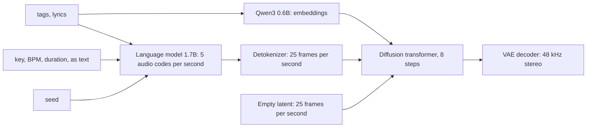

import { Tabs, TabItem } from '@astrojs/starlight/components';

Code: the workflows in API format in [`audio/workflows/`](https://github.com/spareilleux/learn/tree/a5c8533c8411a80a382e94cadbd1d9bfe4d01777/code/comfyui/audio/workflows), the runs of this lesson in [`audio/runs/`](https://github.com/spareilleux/learn/tree/a5c8533c8411a80a382e94cadbd1d9bfe4d01777/code/comfyui/audio/runs), the pipeline [`pipeline.py`](https://github.com/spareilleux/learn/blob/a5c8533c8411a80a382e94cadbd1d9bfe4d01777/code/comfyui/audio/pipeline.py), the measurement scripts [`analyze.py`](https://github.com/spareilleux/learn/blob/a5c8533c8411a80a382e94cadbd1d9bfe4d01777/code/comfyui/audio/analyze.py), [`measure.py`](https://github.com/spareilleux/learn/blob/a5c8533c8411a80a382e94cadbd1d9bfe4d01777/code/comfyui/audio/measure.py) and [`wer.py`](https://github.com/spareilleux/learn/blob/a5c8533c8411a80a382e94cadbd1d9bfe4d01777/code/comfyui/audio/wer.py), the workflow validator [`validate.py`](https://github.com/spareilleux/learn/blob/a5c8533c8411a80a382e94cadbd1d9bfe4d01777/code/comfyui/audio/validate.py), and the tests, all run by [`audio/check.sh`](https://github.com/spareilleux/learn/blob/a5c8533c8411a80a382e94cadbd1d9bfe4d01777/code/comfyui/audio/check.sh) and the workflow [`comfyui-audio.yml`](https://github.com/spareilleux/learn/blob/a5c8533c8411a80a382e94cadbd1d9bfe4d01777/.github/workflows/comfyui-audio.yml).

The first lessons generated images. ComfyUI's core also generates sound: music with lyrics, sound effects, and the audio track of a video. The graph is the same kind of graph, with a loader, a text encoder, an empty latent, a sampler and a VAE decoder; what changes is what a latent stands for and what the text encoder does with a prompt. This lesson reads that in the v0.36.0 source, runs two model families on an RTX 5080, measures what came out against what was asked, and then looks at what the core doesn't do, speech, and at what it takes to add it.

Every clip below was generated for this lesson and normalized to −16 LUFS by the lesson's pipeline. Its caption gives the model, the seed, the workflow and the license. The course measured the clips with scripts; it didn't judge them by ear, and neither the measurements nor this text claim they sound good.

## The `AUDIO` type

Images travel between nodes as tensors; so does sound. An `AUDIO` value is a Python dictionary with two keys: `waveform`, a float tensor shaped `[batch, channels, samples]`, and `sample_rate`, an integer. In C# terms it is NAudio's `WaveFormat` plus a `float[]` per channel; in Java, an `AudioFormat` plus the samples of an `AudioInputStream`, already decoded to floats.

`LoadAudio` decodes a file with [PyAV](https://pyav.basswood-io.com/), the FFmpeg bindings that ComfyUI requires, so it reads whatever FFmpeg reads, including the audio track of a video. Integer samples become floats between −1 and 1, and the node adds the batch dimension ([`nodes_audio.py`, lines 333 to 400](https://github.com/Comfy-Org/ComfyUI/blob/ee71d5c4993f29086b27fde1629a945ae48425bf/comfy_extras/nodes_audio.py#L333-L400)):

```python
waveform, sample_rate = load(audio_path)
audio = {"waveform": waveform.unsqueeze(0), "sample_rate": sample_rate}
```

Its list of files is the input folder filtered by content type, audio and video ([line 364](https://github.com/Comfy-Org/ComfyUI/blob/ee71d5c4993f29086b27fde1629a945ae48425bf/comfy_extras/nodes_audio.py#L364)), and like `LoadImage` its cache key is the SHA-256 of the file ([lines 384 to 390](https://github.com/Comfy-Org/ComfyUI/blob/ee71d5c4993f29086b27fde1629a945ae48425bf/comfy_extras/nodes_audio.py#L384-L390)): replace the file, and the next run reloads it.

Two nodes end a graph:

- **`PreviewAudio`** writes a FLAC file into the temporary folder, under a random `ComfyUI_temp_` name, so the browser can play it ([`_ui.py`, lines 417 to 430](https://github.com/Comfy-Org/ComfyUI/blob/ee71d5c4993f29086b27fde1629a945ae48425bf/comfy_api/latest/_ui.py#L417-L430)).
- **`SaveAudioAdvanced`** writes into the output folder, in FLAC, MP3 or Opus ([`nodes_audio.py`, lines 251 to 296](https://github.com/Comfy-Org/ComfyUI/blob/ee71d5c4993f29086b27fde1629a945ae48425bf/comfy_extras/nodes_audio.py#L251-L296)). `SaveAudio`, `SaveAudioMP3` and `SaveAudioOpus` still exist, marked deprecated.

`SaveAudioAdvanced` has a *dynamic combo*: the `quality` input exists only when `format` is `mp3` or `opus`. In API format, such a sub-input is written with a dot, `"format.quality"`. Sent without it, a workflow with `"format": "mp3"` comes back from the CPU server of the CI with `Required input is missing: quality`, and with `"format.quality": "nope"`, with `Value not in list: format.quality: 'nope' not in ['V0', '128k', '320k']`. Saved files also carry the workflow: `ffprobe` shows a `prompt` tag in the FLAC and Opus files, the same JSON that lesson 3 found in PNG files.

The `audio` category of the core has 15 nodes, and they are plumbing: `LoadAudio`, `RecordAudio`, `PreviewAudio`, the four save nodes, `EmptyAudio`, `TrimAudioDuration`, `SplitAudioChannels`, `JoinAudioChannels`, `AudioConcat`, `AudioMerge`, `AudioAdjustVolume` and `AudioEqualizer3Band`. The CI's workflow, [`15-cpu-empty-audio.api.json`](https://github.com/spareilleux/learn/blob/a5c8533c8411a80a382e94cadbd1d9bfe4d01777/code/comfyui/audio/workflows/15-cpu-empty-audio.api.json), uses three of them to save two seconds of silence without a model.

## Latents: an audio VAE compresses time

Lesson 2's VAE turns a 1024 × 1024 image into a 128 × 128 latent with 4 or 16 channels. An audio VAE does the same along time: a latent frame stands for a fixed number of samples, and the diffusion model works on the short sequence of frames, never on the 48,000 samples of each second. The core detects which VAE a file holds from its tensor names, in [`sd.py`](https://github.com/Comfy-Org/ComfyUI/blob/ee71d5c4993f29086b27fde1629a945ae48425bf/comfy/sd.py#L697-L731), and the numbers differ per model:

| VAE | Sample rate | Samples per latent frame | Latent frames per second | Channels |
|---|---|---|---|---|
| Stable Audio Open 1.0 | 44.1 kHz | 2,048 | 21.5 | 64 |
| ACE-Step 1.5 | 48 kHz | 1,920 | 25 | 64 |
| Stable Audio 3 | 44.1 kHz | 4,096 | 10.8 | 256 |

The empty latent nodes turn seconds into frames. `EmptyLatentAudio`, written for Stable Audio Open 1.0, computes `round((seconds * 44100 / 2048) / 2) * 2` frames of 64 channels ([`nodes_audio.py`, lines 31 to 34](https://github.com/Comfy-Org/ComfyUI/blob/ee71d5c4993f29086b27fde1629a945ae48425bf/comfy_extras/nodes_audio.py#L31-L34)); `EmptyAceStep1.5LatentAudio` computes `round(seconds * 48000 / 1920)` ([`nodes_ace.py`, lines 103 to 107](https://github.com/Comfy-Org/ComfyUI/blob/ee71d5c4993f29086b27fde1629a945ae48425bf/comfy_extras/nodes_ace.py#L103-L107)). Stable Audio 3 has no node of its own: its template uses `EmptyLatentAudio`, and the sampler fixes the shape. When the latent is all zeros, `fix_empty_latent_channels` repeats it to the model's channel count and rescales its length by the ratio of the two frame sizes, here 2,048 / 4,096 ([`sample.py`, lines 45 to 69](https://github.com/Comfy-Org/ComfyUI/blob/ee71d5c4993f29086b27fde1629a945ae48425bf/comfy/sample.py#L45-L69), called by `KSampler` at [`nodes.py`, line 1574](https://github.com/Comfy-Org/ComfyUI/blob/ee71d5c4993f29086b27fde1629a945ae48425bf/nodes.py#L1574)). A latent that isn't empty, from `VAEEncodeAudio`, isn't touched.

The files of this lesson agree with that arithmetic, with one exception. ACE-Step runs of 6, 10, 20, 30 and 40 seconds gave exactly 288,000, 480,000, 960,000, 1,440,000 and 1,920,000 samples. Stable Audio 3 runs of 3 and 10 seconds gave 131,072 and 442,368 samples, 32 and 108 frames of 4,096; a 4-second run gave 180,224 samples, 44 frames, where the formula gives 43. The Stable Audio 3 decoder pads its input to a multiple of a chunk size ([`vae_sa3.py`, lines 300 to 304](https://github.com/Comfy-Org/ComfyUI/blob/ee71d5c4993f29086b27fde1629a945ae48425bf/comfy/ldm/audio/vae_sa3.py#L300-L304)), which would explain the extra frame: *to verify*.

`VAEDecodeAudio` has one more step that matters when you measure loudness: it divides the waveform by five times its standard deviation whenever that product exceeds 1 ([`nodes_audio.py`, lines 108 to 110](https://github.com/Comfy-Org/ComfyUI/blob/ee71d5c4993f29086b27fde1629a945ae48425bf/comfy_extras/nodes_audio.py#L108-L110)). Loud outputs are scaled down; quiet ones are left as they are. That is a safety against clipping, not a loudness standard: the raw music clips of this page measured between −11.4 and −21.2 LUFS, and a room tone −39.9 LUFS, which is why the pipeline at the end of this lesson normalizes with FFmpeg.

## Music with ACE-Step 1.5

### Which ACE-Step

The v0.36.0 core supports two generations of [ACE-Step](https://github.com/ace-step/ACE-Step-1.5), a music model by ACE Studio and StepFun. Version 1.0 has `TextEncodeAceStepAudio` and `EmptyAceStepLatentAudio`; version 1.5 has `TextEncodeAceStepAudio1.5`, `EmptyAceStep1.5LatentAudio` and an experimental `ReferenceTimbreAudio` for covers ([`nodes_ace.py`](https://github.com/Comfy-Org/ComfyUI/blob/ee71d5c4993f29086b27fde1629a945ae48425bf/comfy_extras/nodes_ace.py)). The template the core ships, `Text to Audio (ACE-Step 1.5)`, loads four files from [Comfy-Org/ace_step_1.5_ComfyUI_files](https://huggingface.co/Comfy-Org/ace_step_1.5_ComfyUI_files/tree/694a9723ff772285c73f0700caacf944d3f02f8d): the turbo diffusion model, two text encoders and the VAE. The course uses the same files, except the second text encoder: the 1.7B language model instead of the 4B one, which saves 4.7 GB of download and of memory.

| File | Role | Size | SHA-256 |
|---|---|---|---|
| `acestep_v1.5_turbo.safetensors` | diffusion transformer, 8 steps | 4.79 GB | `3f6e0797…e422d7` |
| `qwen_0.6b_ace15.safetensors` | text and lyrics embeddings | 1.19 GB | `fd4590c8…aa7a7` |
| `qwen_1.7b_ace15.safetensors` | language model that plans the audio | 3.71 GB | `ed63e924…ebd710` |
| `ace_1.5_vae.safetensors` | audio VAE, 48 kHz stereo | 0.34 GB | `6de92e3a…cb2bb` |

The upstream repository, [ACE-Step/Ace-Step1.5](https://huggingface.co/ACE-Step/Ace-Step1.5/tree/19671f406d603126926c1b7e2adc169acbcade22), is under the MIT License, and its card says "You can strictly use the generated music for commercial purposes"; the repackaged files carry Apache 2.0 on Hugging Face. Neither license restricts publishing outputs or where they are used, and the card says the training data is licensed, royalty-free and synthetic.

### Tags, lyrics and metadata go through a language model

`TextEncodeAceStepAudio1.5` has the inputs you expect from a music prompt, `tags`, `lyrics`, `bpm`, `duration`, `timesignature`, `language` and `keyscale`, and some you might not: `seed`, `generate_audio_codes`, `cfg_scale`, `temperature`, `top_p`, `top_k` and `min_p` ([`nodes_ace.py`, lines 31 to 61](https://github.com/Comfy-Org/ComfyUI/blob/ee71d5c4993f29086b27fde1629a945ae48425bf/comfy_extras/nodes_ace.py#L31-L61)). Those are the settings of a language model, and the tokenizer shows what happens ([`ace15.py`, lines 208 to 274](https://github.com/Comfy-Org/ComfyUI/blob/ee71d5c4993f29086b27fde1629a945ae48425bf/comfy/text_encoders/ace15.py#L208-L274)):

- The key, tempo, time signature and duration become text. They are written as YAML inside a `<think>` block of a chat prompt for the language model, and as a `# Metas` list for the embedding model:

  ```python
  lm_template = "<|im_start|>system\n# Instruction\nGenerate audio semantic tokens based on the given conditions:\n\n<|im_end|>\n<|im_start|>user\n# Caption\n{}\n\n# Lyric\n{}\n<|im_end|>\n<|im_start|>assistant\n{}\n\n<|im_end|>\n"
  ```

- The language model then generates *audio codes*, five per second of music: `tokens_duration = duration * 5`, used as both the minimum and the maximum number of tokens ([lines 226 to 230](https://github.com/Comfy-Org/ComfyUI/blob/ee71d5c4993f29086b27fde1629a945ae48425bf/comfy/text_encoders/ace15.py#L226-L230)). The sampling loop is the one of any chat model: logits restricted to the audio token range, classifier-free guidance between the prompt and a negative prompt with an empty `<think>` block, temperature, top-k, top-p, and a `torch.Generator` seeded with the node's `seed` ([lines 30 to 140](https://github.com/Comfy-Org/ComfyUI/blob/ee71d5c4993f29086b27fde1629a945ae48425bf/comfy/text_encoders/ace15.py#L30-L140)).
- The 0.6B model embeds the caption and, separately, the lyrics ([lines 323 to 339](https://github.com/Comfy-Org/ComfyUI/blob/ee71d5c4993f29086b27fde1629a945ae48425bf/comfy/text_encoders/ace15.py#L323-L339)).

In the diffusion model, a detokenizer expands each audio code into five frames, from 5 to 25 frames per second, the rate of the VAE's latent, and those frames are the "hints" the transformer denoises around ([`ace_step15.py`, lines 1077 to 1112](https://github.com/Comfy-Org/ComfyUI/blob/ee71d5c4993f29086b27fde1629a945ae48425bf/comfy/ldm/ace/ace_step15.py#L1077-L1112)). With `generate_audio_codes` off, no plan is generated, and the model starts from a built-in silence latent instead ([`model_base.py`, lines 2516 to 2553](https://github.com/Comfy-Org/ComfyUI/blob/ee71d5c4993f29086b27fde1629a945ae48425bf/comfy/model_base.py#L2516-L2553)).



This matters for what you can expect. Nothing in the graph forces a key or a tempo: `C major` and `90` are words in a prompt, which the language model was trained to follow. The measurements below check how well it does.

The graph is the template's, in API format: [`15-ace-step.api.json`](https://github.com/spareilleux/learn/blob/a5c8533c8411a80a382e94cadbd1d9bfe4d01777/code/comfyui/audio/workflows/15-ace-step.api.json). `ModelSamplingAuraFlow` sets the flow-matching shift to 3, and `KSampler` runs 8 steps of `euler` at CFG 1, because the turbo model was distilled to need no guidance. The negative conditioning is the positive one zeroed by `ConditioningZeroOut`. The seed is set twice, on the text encoder for the audio codes and on `KSampler` for the noise; the runs of this lesson always set both to the same value.

### Running it, and how long it takes

The 21 runs are in [`runs/ace-step.json`](https://github.com/spareilleux/learn/blob/a5c8533c8411a80a382e94cadbd1d9bfe4d01777/code/comfyui/audio/runs/ace-step.json), each a list of `--set node.input=value` changes to the workflow, and `pipeline.py batch` queued them one after the other on a ComfyUI started with its own base directory. On the RTX 5080, with 12.3 GB of VRAM free when the batch started, the server log says:

- The first run took 38.8 s, most of it loading: the two text encoders were staged as 4,672 MB, the diffusion model as 4,564 MB, and the VAE loaded as 321.7 MB, with ComfyUI's dynamic VRAM loading.
- A 20-second clip then took 4.3 to 4.5 s, a 10-second clip 3.2 s, and a 40-second clip 8.5 s.
- The same 20-second clip without audio codes took 1.9 s: the language model's planning is more than half of the time.

### Seed, duration, tags, lyrics

The loop that the next measurements start from asks for `solo acoustic guitar loop, fingerpicked, warm, dry studio recording, instrumental`, lyrics `[Instrumental]`, `C major`, 90 BPM, 4/4, 20 seconds, seed 1.

<audio controls preload="none" src="../../comfyui/audio/15-loop-c-seed1.mp3"></audio>

*Generated by ComfyUI v0.36.0: ACE-Step 1.5 turbo with Qwen3 0.6B and 1.7B, seed 1, 8 steps, `euler`, `simple`, CFG 1, shift 3, run `loop-c-seed1` of `runs/ace-step.json`, workflow [`15-ace-step.api.json`](https://github.com/spareilleux/learn/blob/a5c8533c8411a80a382e94cadbd1d9bfe4d01777/code/comfyui/audio/workflows/15-ace-step.api.json). MIT License. Normalized to −16 LUFS, MP3 at 96 kb/s.*

[`measure.py`](https://github.com/spareilleux/learn/blob/a5c8533c8411a80a382e94cadbd1d9bfe4d01777/code/comfyui/audio/measure.py) reads each saved FLAC file and prints its format, a hash of its samples and its peak. For ACE-Step runs, it also compares the requested key and tempo with what [`analyze.py`](https://github.com/spareilleux/learn/blob/a5c8533c8411a80a382e94cadbd1d9bfe4d01777/code/comfyui/audio/analyze.py) hears. The key is the Krumhansl-Kessler estimate: the average chroma of the clip, computed with [librosa](https://librosa.org/doc/latest/index.html)'s `chroma_cqt`, correlated with the 24 major and minor key profiles; `r` is the best correlation. The tempo is librosa's `beat_track`. A synthetic C-F-G-C clip at 120 BPM, which the tests build, comes out as C major with r = 0.97 and 117.5 BPM.

```text
$ python measure.py runs/ace-step.json G:/learn-lab/comfyui/audio/runs/ace
loop-c-seed1: 48000 Hz, 2 ch, 20.00 s, samples 3a0f4dc422dd21cc, peak 1.00 | asked C major, 90 BPM; heard C major (r=0.66), 92.3 BPM | key yes, tempo ratio 1.03
loop-c-seed1-again: 48000 Hz, 2 ch, 20.00 s, samples 3a0f4dc422dd21cc, peak 1.00 | asked C major, 90 BPM; heard C major (r=0.66), 92.3 BPM | key yes, tempo ratio 1.03
loop-c-seed2: 48000 Hz, 2 ch, 20.00 s, samples 06a7e133106ce1ce, peak 0.90 | asked C major, 90 BPM; heard G major (r=0.49), 161.5 BPM | key no, tempo ratio 1.79
loop-c-seed3: 48000 Hz, 2 ch, 20.00 s, samples b13fe842c3eef028, peak 1.00 | asked C major, 90 BPM; heard C major (r=0.42), 60.1 BPM | key yes, tempo ratio 0.67
loop-c-10s: 48000 Hz, 2 ch, 10.00 s, samples 388373d59bbef315, peak 0.77 | asked C major, 90 BPM; heard G major (r=0.67), 95.7 BPM | key no, tempo ratio 1.06
loop-c-40s: 48000 Hz, 2 ch, 40.00 s, samples 1ab6165dd90985c5, peak 1.00 | asked C major, 90 BPM; heard A minor (r=0.41), 89.1 BPM | key relative, tempo ratio 0.99
loop-c-no-codes: 48000 Hz, 2 ch, 20.00 s, samples ef78ea83a483aef3, peak 1.00 | asked C major, 90 BPM; heard C major (r=0.69), 89.1 BPM | key yes, tempo ratio 0.99
loop-tags-rock: 48000 Hz, 2 ch, 20.00 s, samples bc707dd2c2b04877, peak 1.00 | asked C major, 90 BPM; heard C major (r=0.66), 89.1 BPM | key yes, tempo ratio 0.99
```

What those lines show:

- **Same seed, same samples, but not for the reason you might think.** `loop-c-seed1-again` has the same hash, but the server log says it ran in 0.06 s: every node's inputs were identical except the file name prefix, so ComfyUI reused its cache and only the save node ran. The real test is a fresh server. Stopped, restarted, and given the same two runs, it produced the same sample hashes, `3a0f4dc422dd21cc` for the loop and `f892c13bf2b0f920` for the jingle below. That was on one GPU with one driver; across GPUs, lesson 2's caveats apply: *to verify*.
- **Another seed, another piece.** Seed 2 was heard in G major, the dominant of C, and seed 3 in C major with a weaker correlation. The seed drives the language model's sampling of the audio codes and the diffusion noise, so it changes more than the texture.
- **Duration changes the piece too.** 10 seconds of seed 1 is not the first half of 20 seconds of seed 1: the language model writes 50 codes instead of 100, and the key came out as G major. At 40 seconds, the estimate was A minor, the relative minor of C, with a low r.
- **Without audio codes**, the result was still C major at 89 BPM, the closest of the three loops to the request, in less than half the time. With one clip, that says nothing general.
- **New tags, same key and tempo.** `loop-tags-rock` kept the key, tempo and seed and changed the tags to `distorted electric guitar riff, heavy rock, drums, instrumental`. The key and tempo were held; whether the clip sounds like rock, the scripts can't say.

<audio controls preload="none" src="../../comfyui/audio/15-loop-c-seed2.mp3"></audio>

*Generated by ComfyUI v0.36.0: the same workflow and prompt, seed 2, run `loop-c-seed2`. Heard as G major at 161.5 BPM. MIT License. Normalized to −16 LUFS, MP3 at 96 kb/s.*

<audio controls preload="none" src="../../comfyui/audio/15-loop-c-no-codes.mp3"></audio>

*Generated by ComfyUI v0.36.0: the same workflow and prompt, seed 1, `generate_audio_codes` false, run `loop-c-no-codes`. MIT License. Normalized to −16 LUFS, MP3 at 96 kb/s.*

<audio controls preload="none" src="../../comfyui/audio/15-loop-tags-rock.mp3"></audio>

*Generated by ComfyUI v0.36.0: the same workflow, seed 1, C major, 90 BPM, tags `distorted electric guitar riff, heavy rock, drums, instrumental`, run `loop-tags-rock`. MIT License. Normalized to −16 LUFS, MP3 at 96 kb/s.*

### Key and tempo, eight requests

The sweep keeps the loop's tags and seed 1, and changes the key and the tempo:

| Asked | Heard key | r | Heard tempo | Key | Tempo ratio |
|---|---|---|---|---|---|
| C major, 90 BPM | C major | 0.66 | 92.3 | yes | 1.03 |
| C major, 70 BPM | G major | 0.72 | 143.6 | no | 2.05 |
| E minor, 100 BPM | E minor | 0.65 | 66.3 | yes | 0.66 |
| A major, 140 BPM | A major | 0.86 | 143.6 | yes | 1.03 |
| F# minor, 80 BPM | F# minor | 0.49 | 80.7 | yes | 1.01 |
| Bb major, 120 BPM | F# major | 0.43 | 117.5 | no | 0.98 |
| D minor, 60 BPM | D minor | 0.74 | 117.5 | yes | 1.96 |
| G major, 160 BPM | G major | 0.59 | 83.4 | yes | 0.52 |
| Eb major, 95 BPM | F# major | 0.50 | 95.7 | no | 1.01 |

Across the 20 distinct music runs of the lesson (the cached repeat left out), the key estimate matched the request 12 times, found the relative minor once and missed 7 times. The tempo estimate was within 7% of the request 12 times; 7 times it was close to double, half or two thirds of it, including the song below, and once it was unrelated, 1.79 times the request for seed 2. A beat tracker often locks on half or double the tempo a musician would count, so a ratio of 2 or 0.5 is as likely to be the estimator's mistake as the model's; the course didn't count the beats by ear, and the ratios near 2 stay *to verify*. The two misses in flat keys, Bb and Eb major, both heard as F# major, are the pattern that stands out, from one seed each.

### The Guitar Alchemist examples, and a failure

A **jingle** for a lesson intro: `short cheerful intro jingle for an online guitar lesson, bright acoustic guitar strum, glockenspiel, handclaps, ends on a clear final chord, instrumental`, G major, 110 BPM, 6 seconds. Seeds 1 and 2 were both heard in G major at 112.3 BPM, with r = 0.87 and 0.51.

<audio controls preload="none" src="../../comfyui/audio/15-jingle-seed1.mp3"></audio>

*Generated by ComfyUI v0.36.0: ACE-Step 1.5 turbo, seed 1, G major, 110 BPM, 6 s, run `jingle-seed1`, workflow [`15-ace-step.api.json`](https://github.com/spareilleux/learn/blob/a5c8533c8411a80a382e94cadbd1d9bfe4d01777/code/comfyui/audio/workflows/15-ace-step.api.json). MIT License. Normalized to −16 LUFS, MP3 at 96 kb/s.*

A **song** with original lyrics about building a chord, `gentle folk song, acoustic guitar, soft female vocals, intimate`, D major, 80 BPM, 30 seconds:

```text
[verse]
Find the root and then the third
Stack a fifth and hear the chord
[chorus]
One, four, five, and home again
```

It was heard in D major with r = 0.87, and at 152 BPM, close to double the request. [Whisper](https://github.com/SYSTRAN/faster-whisper) large-v3, the transcriber of the speech section below, heard "Find the root and then the third Stack a fifth and hear the chord Four and five and home": the verse is intact, and the chorus lost "One" and "again", a word error rate of 3 in 20.

<audio controls preload="none" src="../../comfyui/audio/15-song-lyrics.mp3"></audio>

*Generated by ComfyUI v0.36.0: ACE-Step 1.5 turbo, seed 1, D major, 80 BPM, 30 s, lyrics above, run `song-lyrics`. The voice is the model's; no real singer's voice was asked for. MIT License. Normalized to −16 LUFS, MP3 at 96 kb/s.*

A **jazz ii-V-I** is where it failed. The tags were `jazz guitar trio playing a ii-V-I progression, Dm7 G7 Cmaj7, medium swing, clean archtop guitar, upright bass, brushes on snare, instrumental`, C major, 120 BPM, 20 seconds. `measure.py --chords` labels each bar with the closest of 60 chord templates (major, minor, 7, maj7 and m7 on 12 roots), bars counted from the beat tracker:

```text
jazz-251-seed1: 48000 Hz, 2 ch, 20.00 s, samples c3e2218b5183858c, peak 1.00 | asked C major, 120 BPM; heard D major (r=0.36), 123.0 BPM | key no, tempo ratio 1.03
      1.04 s  G      r=0.38
      3.04 s  C#maj7 r=0.57
      5.04 s  C#maj7 r=0.50
      7.04 s  Dm     r=0.66
      9.03 s  Bbmaj7 r=0.40
     11.05 s  Ab     r=0.59
     13.05 s  C#maj7 r=0.64
     15.05 s  Bm     r=0.57
jazz-251-seed2: 48000 Hz, 2 ch, 20.00 s, samples 3b84301e70e82c49, peak 1.00 | asked C major, 120 BPM; heard F minor (r=0.34), 60.1 BPM | key no, tempo ratio 0.50
      0.98 s  C      r=0.37
      4.97 s  Dm7    r=0.29
      8.99 s  Fm7    r=0.60
```

Neither seed shows a Dm7, G7, Cmaj7 cycle, and both key correlations are the lowest of the lesson, which is what harmony that doesn't settle in one key gives. The chord labels themselves are weak evidence: on the synthetic C-F-G-C clip, whose chords the tests know, the bars came out shifted and labelled `Cmaj7`, `C`, `Fmaj7`, `G7`, so treat them as a hint. What can be said is that a chord progression written in the tags was not followed as a progression, in two tries out of two. The tags are a caption for a language model, not a score: ACE-Step 1.5 takes a key, a tempo and a time signature, and nothing in its inputs is a chord.

<audio controls preload="none" src="../../comfyui/audio/15-jazz-251-seed1.mp3"></audio>

*Generated by ComfyUI v0.36.0: ACE-Step 1.5 turbo, seed 1, C major, 120 BPM, 20 s, run `jazz-251-seed1`. The requested progression is not what the analysis found. MIT License. Normalized to −16 LUFS, MP3 at 96 kb/s.*

## Sound effects with Stable Audio 3

The core has two Stable Audio families. [Stable Audio Open 1.0](https://huggingface.co/stabilityai/stable-audio-open-1.0) conditions on a T5 text encoder and on two numbers, `seconds_start` and `seconds_total`, set by `ConditioningStableAudio`. Stable Audio 3, whose files Comfy-Org repackaged in [Comfy-Org/stable-audio-3](https://huggingface.co/Comfy-Org/stable-audio-3/tree/96fc663283cde94cb631bc84f6c9ece7bbe2bf25), uses a [T5Gemma](https://huggingface.co/google/t5gemma-b-b-ul2) text encoder and only `seconds_total`, which the model computes from the latent's length when no node sets it: `int(noise.shape[-1] / 10.7666)`, the number of frames divided by frames per second ([`model_base.py`, lines 877 to 906](https://github.com/Comfy-Org/ComfyUI/blob/ee71d5c4993f29086b27fde1629a945ae48425bf/comfy/model_base.py#L877-L906)). The core ships two templates for the 9.2 GB medium model. The course uses the two small models, [one trained for sound effects](https://huggingface.co/stabilityai/stable-audio-3-small-sfx/tree/ae12755283df9d62ca39a9b050a39a0b607b8c20) and [one for music](https://huggingface.co/stabilityai/stable-audio-3-small-music/tree/0fef1392cd842149a2b6d445e181c97608faac06), each 2.27 GB, with the same text encoder:

| File | Size | SHA-256 |
|---|---|---|
| `stable_audio_3_small_sfx.safetensors` | 2.27 GB | `ed9cf1b6…2e515` |
| `stable_audio_3_small_music.safetensors` | 2.27 GB | `da85866b…4b64` |
| `t5gemma_b_b_ul2.safetensors` | 1.19 GB | `1e1eba25…150e` |

The text encoder file is not Google's: `google/t5gemma-b-b-ul2` publishes a file with another hash, and Comfy-Org's is a conversion of it.

The graph, [`15-stable-audio-sfx.api.json`](https://github.com/spareilleux/learn/blob/a5c8533c8411a80a382e94cadbd1d9bfe4d01777/code/comfyui/audio/workflows/15-stable-audio-sfx.api.json), is the template's without its prompt-writing branch: `CheckpointLoaderSimple` for the model and its VAE, `CLIPLoader` with type `stable_audio` for T5Gemma, two `CLIPTextEncode`, `EmptyLatentAudio`, and `KSampler` with 8 steps of `lcm` at CFG 1, as the template sets for these adversarially post-trained models.

### Two licenses

The weights are under the [Stability AI Community License](https://huggingface.co/stabilityai/stable-audio-3-small-sfx/blob/ae12755283df9d62ca39a9b050a39a0b607b8c20/LICENSE.md), dated July 5, 2024, the same file in the three Stable Audio 3 repositories, and the text encoder under the [Gemma Terms of Use](https://ai.google.dev/gemma/terms), last modified April 1, 2026. What they say about outputs, word for word:

- Stability, section IV.c.(iii): "As between You and Stability AI, You own any outputs generated from the Models or Derivative Works to the extent permitted by applicable law." Its definition of Derivative Works ends with "but do not include the output of any Model."
- Stability, section III, for commercial use: "If at any time You or Your Affiliate(s), either individually or in aggregate, generate more than USD $1,000,000 in annual revenue (…), any licenses granted to You under this Agreement shall terminate as of such date." Commercial use also requires registering with Stability AI.
- Stability, section IV.a, only when you distribute the models or a product that uses them: a copy of the agreement, a "Notice" file, and "Powered by Stability AI" displayed. Both licenses are granted "worldwide" (Stability, sections II and III); the Gemma terms have no territorial clause.
- Stability, section IV.b: outputs may not be used "to create or improve any foundational generative AI model".
- Gemma, section 3.3: "Google claims no rights in Outputs you generate using Gemma. You and your users are solely responsible for Outputs and their subsequent uses."

Publishing the clips of this lesson on a public site is allowed by both. The site distributes no weights, so the notice and "Powered by Stability AI" obligations don't apply; each clip still says which model made it.

### A pick, a fret squeak, a room

[`runs/stable-audio.json`](https://github.com/spareilleux/learn/blob/a5c8533c8411a80a382e94cadbd1d9bfe4d01777/code/comfyui/audio/runs/stable-audio.json) has seven runs. The first took 11.8 s with the loading, the text encoder staged as 537 MB, the model as 875 MB and the VAE as 406 MB; the next ones took 0.5 to 0.9 s each. The raw loudness, from the first pass of FFmpeg's `loudnorm`:

| Run | Prompt | Length | Peak | Loudness |
|---|---|---|---|---|
| `pick-seed1` | a single guitar pick plucking one steel acoustic guitar string, close microphone, dry | 4.09 s | 0.41 | −29.2 LUFS |
| `pick-seed2` | the same, seed 2 | 4.09 s | 0.32 | −30.1 LUFS |
| `fret-squeak` | fingers sliding along wound acoustic guitar strings, fret squeak, close microphone | 2.97 s | 0.17 | −27.2 LUFS |
| `studio-room` | quiet recording studio room tone, soft air conditioning hum, distant muffled footsteps | 10.03 s | 0.14 | −39.9 LUFS |

<audio controls preload="none" src="../../comfyui/audio/15-pick-seed1.mp3"></audio>

*Generated by ComfyUI v0.36.0: Stable Audio 3 small SFX with T5Gemma, seed 1, 8 steps, `lcm`, `simple`, CFG 1, 4 s, run `pick-seed1` of `runs/stable-audio.json`, workflow [`15-stable-audio-sfx.api.json`](https://github.com/spareilleux/learn/blob/a5c8533c8411a80a382e94cadbd1d9bfe4d01777/code/comfyui/audio/workflows/15-stable-audio-sfx.api.json). Stability AI Community License and Gemma Terms of Use. Normalized by the pipeline, to −17.7 LUFS (see exercise 3), MP3 at 96 kb/s.*

<audio controls preload="none" src="../../comfyui/audio/15-fret-squeak.mp3"></audio>

*Generated by ComfyUI v0.36.0: Stable Audio 3 small SFX, seed 1, 3 s, run `fret-squeak`. Stability AI Community License and Gemma Terms of Use. Normalized to −16.9 LUFS, MP3 at 96 kb/s.*

<audio controls preload="none" src="../../comfyui/audio/15-studio-room.mp3"></audio>

*Generated by ComfyUI v0.36.0: Stable Audio 3 small SFX, seed 1, 10 s, run `studio-room`. Stability AI Community License and Gemma Terms of Use. Raised from −39.9 to −16.7 LUFS by the pipeline, so its hiss is 23 dB louder than generated; a room tone is meant to sit far below the music. MP3 at 96 kb/s.*

The music model takes its tempo and key in the prompt, as text. `acoustic guitar loop, 100 BPM, C major, fingerpicked`, 10 seconds, gave C major (r = 0.90) at 99.4 BPM with seed 1, and C major (r = 0.93) at 136.0 BPM with seed 2. The same prompt on the sound-effects model gave G major (r = 0.80) at 99.4 BPM.

<audio controls preload="none" src="../../comfyui/audio/15-music-loop-100.mp3"></audio>

*Generated by ComfyUI v0.36.0: Stable Audio 3 small music with T5Gemma, seed 1, 10 s, run `music-loop-100`, workflow [`15-stable-audio-sfx.api.json`](https://github.com/spareilleux/learn/blob/a5c8533c8411a80a382e94cadbd1d9bfe4d01777/code/comfyui/audio/workflows/15-stable-audio-sfx.api.json) with `ckpt_name` changed. Stability AI Community License and Gemma Terms of Use. Normalized to −16.4 LUFS, MP3 at 96 kb/s.*

## Sound for a video

Two things in the v0.36.0 core touch video sound, and neither was run for this lesson.

- **LTX-2.x generates video and audio together.** `LTXVEmptyLatentAudio` sizes an audio latent from a number of video frames and a frame rate, `LTXVAudioVAEDecode` turns it into `AUDIO`, and the model class `LTXAV` denoises both ([`nodes_lt_audio.py`](https://github.com/Comfy-Org/ComfyUI/blob/ee71d5c4993f29086b27fde1629a945ae48425bf/comfy_extras/nodes_lt_audio.py#L93-L166)). Its audio VAE works on a mel spectrogram and ends with a vocoder ([`audio_vae.py`](https://github.com/Comfy-Org/ComfyUI/blob/ee71d5c4993f29086b27fde1629a945ae48425bf/comfy/ldm/lightricks/vae/audio_vae.py)). The core's `Text to Video (LTX-2.5)` template needs a 21.5 GB transformer and a 15.4 GB text encoder, both quantized to int8, which is more than this machine's 16 GB of VRAM holds at once and more than the course downloads without asking. The [LTX-2.x Community License](https://github.com/Lightricks/LTX-2/blob/a95ab856bf29407b6b066ede0abe1846050db56c/LICENSE-2_x), dated August 11, 2026, allows publishing outputs ("Licensor claims no rights in the Output you generate using LTX-2.x", section 5), and requires a paid license from entities with annual revenue of at least $10,000,000. Whether LTX-2.5 fits in 16 GB with offloading, and how good its sound is: *to verify*.
- **MMAudio's VAE is there, MMAudio isn't.** [`comfy/ldm/mmaudio`](https://github.com/Comfy-Org/ComfyUI/tree/ee71d5c4993f29086b27fde1629a945ae48425bf/comfy/ldm/mmaudio) holds only a VAE and a BigVGAN vocoder, which `sd.py` loads for a 16 kHz model ([lines 905 to 921](https://github.com/Comfy-Org/ComfyUI/blob/ee71d5c4993f29086b27fde1629a945ae48425bf/comfy/sd.py#L905-L921)), and the LTX audio VAE borrows its Gaussian distribution class. No node samples a video-to-audio model with it. Which model uses this VAE in the core, if any: *to verify*.

Without either, sound for a video in the core is the video lesson's frames plus a separate audio graph: generate a clip of the video's length with ACE-Step or Stable Audio, and mux the two with FFmpeg.

## Speech: not in the core

There is no local text-to-speech model in ComfyUI v0.36.0. Started with `--disable-api-nodes`, the server lists 666 node types in `/object_info`, and none of their names or display names contains "speech", "TTS" or "voice"; the 15 nodes of the `audio` category are the plumbing listed at the start of this lesson. The core's music models can sing lyrics, which is not the same thing.

The speech nodes that do exist are *API nodes*, which send your text to a paid service and download the result: `ElevenLabsTextToSpeech` ([`nodes_elevenlabs.py`, line 240](https://github.com/Comfy-Org/ComfyUI/blob/ee71d5c4993f29086b27fde1629a945ae48425bf/comfy_api_nodes/nodes_elevenlabs.py#L240)), `FishAudioTextToSpeech` ([`nodes_fishaudio.py`, line 185](https://github.com/Comfy-Org/ComfyUI/blob/ee71d5c4993f29086b27fde1629a945ae48425bf/comfy_api_nodes/nodes_fishaudio.py#L185)) and `HeyGenTextToSpeechNode` ([`nodes_heygen.py`, line 696](https://github.com/Comfy-Org/ComfyUI/blob/ee71d5c4993f29086b27fde1629a945ae48425bf/comfy_api_nodes/nodes_heygen.py#L696)), with voice cloning nodes next to them. They need a Comfy account with credits, and they are the reason [`--disable-api-nodes`](https://github.com/Comfy-Org/ComfyUI/blob/ee71d5c4993f29086b27fde1629a945ae48425bf/comfy/cli_args.py#L216) exists. For local speech, you need a custom node pack, and lesson 11's rules apply.

### Choosing and reading a pack

The course picked [comfyui-kokoro](https://github.com/stavsap/comfyui-kokoro/tree/cfb59b5605b351e196182c836f0b48c1a784e52f), 66 GitHub stars, Apache 2.0, pinned on its last commit of February 23, 2026. It wraps [Kokoro-82M](https://huggingface.co/hexgrad/Kokoro-82M), an 82-million-parameter model under Apache 2.0, through [kokoro-onnx](https://github.com/thewh1teagle/kokoro-onnx), which runs it with [ONNX Runtime](https://onnxruntime.ai/). It is small enough to read in full: an `__init__.py` of two lines and one Python file of 291 lines.

Lesson 11's audit, before installing:

```text
$ python code/comfyui/custom-nodes/audit/audit.py comfyui-kokoro --details 40
== comfyui-kokoro: 16 files, 2 Python, 0 JavaScript, web folder: no
   autorun            2  file that runs without being asked
                        __init__.py  imported by ComfyUI at every start
                        requirements.txt  installed with pip by ComfyUI-Manager
   network            2  network call (urllib, requests, httpx, aiohttp client, socket)
                        ComfyUIKokoro.py:97  with requests.get(url, stream=True, allow_redirects=True) as response:
                        ComfyUIKokoro.py:122  r = requests.get(url)
```

Reading the code and the dependencies adds what the counts can't say:

- **At import**, the file imports NumPy, PyTorch, `kokoro_onnx`, `requests` and `tqdm`, and defines three classes. Nothing runs.
- **At the first run**, each node calls `download_model` and `download_voices` ([`ComfyUIKokoro.py`, lines 96 to 137](https://github.com/stavsap/comfyui-kokoro/blob/cfb59b5605b351e196182c836f0b48c1a784e52f/ComfyUIKokoro.py#L96-L137)). The model comes from a release of a fork, `github.com/taylorchu/kokoro-onnx/releases/download/v0.2.0/kokoro.onnx`, not from kokoro-onnx's own releases; the 54 voices come from `hexgrad/Kokoro-82M` on the `main` branch, not a pinned commit. Neither download is checked against a hash, and both are written into the pack's own folder. The voices are read with `torch.load(content, weights_only=True)`, the safe mode of lesson 11.
- **The fork's file is the official one.** Downloaded both ways, `kokoro.onnx` from the fork and `kokoro-v1.0.onnx` from kokoro-onnx's `model-files-v1.0` release have the same 325,532,387 bytes and the same SHA-256, `7d5df8ec…36a6c5`. That was true on September 17, 2026; nothing stops a release asset from changing.
- **Dependencies are unpinned**: `kokoro-onnx`, `onnxruntime`, `numpy`, `requests`, `tqdm`. On September 17, 2026, they resolved to kokoro-onnx 0.6.1 (MIT), onnxruntime 1.30.0, phonemizer 3.4.0 and espeakng-loader 0.2.4. The last one ships a prebuilt [eSpeak NG](https://github.com/espeak-ng/espeak-ng) library and its data, which phonemizer loads to turn text into phonemes. eSpeak NG is under the GPL 3.0, which matters if you redistribute an install, not for the audio it produces.
- **kokoro-onnx** reads the voices with `np.load(voices_path)`, whose default refuses pickles, and makes no network call; its only URLs are in error messages.
- **The voices are recordings of people.** Kokoro's [`VOICES.md`](https://huggingface.co/hexgrad/Kokoro-82M/blob/f3ff3571791e39611d31c381e3a41a3af07b4987/VOICES.md) says "Support for non-English languages may be absent or thin due to weak G2P and/or lack of training data", lists less than 11 hours of French training data, and credits the French voice `ff_siwis` to the [SIWIS](https://datashare.ed.ac.uk/handle/10283/2353) dataset, the recordings of a real speaker. The model's license allows publishing its output; this course still doesn't publish synthetic speech in a voice made from a real person's recordings, so this section gives transcripts and measurements, not clips.

The install, in the isolated instance only, with the dependencies pinned to what was reviewed, and the two model files placed by hand so that the pack never downloads anything. The course ran the Windows commands, with [uv](https://docs.astral.sh/uv/) into the instance's own virtual environment:

<Tabs syncKey="os">
<TabItem label="Windows">

```powershell
git clone https://github.com/stavsap/comfyui-kokoro "$env:COMFY_BASE\custom_nodes\comfyui-kokoro"
git -C "$env:COMFY_BASE\custom_nodes\comfyui-kokoro" checkout cfb59b5605b351e196182c836f0b48c1a784e52f
uv pip install --python .\venv\Scripts\python.exe kokoro-onnx==0.6.1 onnxruntime==1.30.0 phonemizer==3.4.0 espeakng-loader==0.2.4 dlinfo==2.0.0 joblib==1.6.0 cloudpickle==3.1.2 flatbuffers==25.12.19 protobuf==7.36.1
Copy-Item kokoro-v1.0.onnx "$env:COMFY_BASE\custom_nodes\comfyui-kokoro\kokoro_v1.onnx"
Copy-Item voices-v1.0.bin "$env:COMFY_BASE\custom_nodes\comfyui-kokoro\voices_v1.bin"
```

</TabItem>
<TabItem label="Linux / WSL">

```bash
git clone https://github.com/stavsap/comfyui-kokoro "$COMFY_BASE/custom_nodes/comfyui-kokoro"
git -C "$COMFY_BASE/custom_nodes/comfyui-kokoro" checkout cfb59b5605b351e196182c836f0b48c1a784e52f
uv pip install --python ./venv/bin/python kokoro-onnx==0.6.1 onnxruntime==1.30.0 phonemizer==3.4.0 espeakng-loader==0.2.4 dlinfo==2.0.0 joblib==1.6.0 cloudpickle==3.1.2 flatbuffers==25.12.19 protobuf==7.36.1
cp kokoro-v1.0.onnx "$COMFY_BASE/custom_nodes/comfyui-kokoro/kokoro_v1.onnx"
cp voices-v1.0.bin "$COMFY_BASE/custom_nodes/comfyui-kokoro/voices_v1.bin"
```

</TabItem>
<TabItem label="macOS">

```bash
git clone https://github.com/stavsap/comfyui-kokoro "$COMFY_BASE/custom_nodes/comfyui-kokoro"
git -C "$COMFY_BASE/custom_nodes/comfyui-kokoro" checkout cfb59b5605b351e196182c836f0b48c1a784e52f
uv pip install --python ./venv/bin/python kokoro-onnx==0.6.1 onnxruntime==1.30.0 phonemizer==3.4.0 espeakng-loader==0.2.4 dlinfo==2.0.0 joblib==1.6.0 cloudpickle==3.1.2 flatbuffers==25.12.19 protobuf==7.36.1
cp kokoro-v1.0.onnx "$COMFY_BASE/custom_nodes/comfyui-kokoro/kokoro_v1.onnx"
cp voices-v1.0.bin "$COMFY_BASE/custom_nodes/comfyui-kokoro/voices_v1.bin"
```

</TabItem>
</Tabs>

The Linux and macOS commands are *to verify*, and so are these exact wheels on those systems. On Windows, uv installed 9 packages, and ONNX Runtime reported the `AzureExecutionProvider` and `CPUExecutionProvider`: Kokoro runs on the CPU here. The pack imported in 0.0 s at the server's start.

### Three languages, measured

The graph is three nodes, [`15-kokoro-tts.api.json`](https://github.com/spareilleux/learn/blob/a5c8533c8411a80a382e94cadbd1d9bfe4d01777/code/comfyui/audio/workflows/15-kokoro-tts.api.json): `KokoroSpeaker` picks a voice, `KokoroGenerator` takes the text, the speed and a language, and `SaveAudioAdvanced` saves the `AUDIO` it returns. [`runs/kokoro.json`](https://github.com/spareilleux/learn/blob/a5c8533c8411a80a382e94cadbd1d9bfe4d01777/code/comfyui/audio/runs/kokoro.json) says three sentences of this course in English with `af_heart`, in French with `ff_siwis` and in Spanish with `ef_dora`. Each took 2.6 to 4.7 s on the CPU, 6.9 s for the first one.

To measure intelligibility without judging by ear, [`wer.py`](https://github.com/spareilleux/learn/blob/a5c8533c8411a80a382e94cadbd1d9bfe4d01777/code/comfyui/audio/wer.py) transcribes each clip with Whisper large-v3 through faster-whisper, int8 on the CPU, beam 5, temperature 0, and computes the word error rate: the edit distance between the sentence and the transcript, in words, divided by the number of words of the sentence, after lowercasing and removing punctuation. Whisper's own errors count too, so a WER is an upper bound on the speech model's.

| Clip | WER | Errors / words | Whisper heard |
|---|---|---|---|
| en 1 | 0.217 | 5 / 23 | Welcome to Lesson 15. A C major 7 chord stacks a major 3rd, a perfect 5th, and a major 7th on the root. |
| en 2 | 0.0 | 0 / 18 | The sampler removes noise from the latent in eight steps, then the VAE decodes it into a waveform. |
| en 3 | 0.0 | 0 / 21 | Save the workflow as JSON, queue it through the API, and download the file when the history says it is done. |
| fr 1 | 0.28 | 7 / 25 | Bienvenue dans la leçon 15. Un accord de N doufles majeure 7 en pile une tierce majeure, une quinte juste et une septième majeure sur la fondamentale. |
| fr 2 | 0.053 | 1 / 19 | L'échantillonneur retire le bruit du latent en huit étapes, puis le verre le décode en forme d'onde. |
| fr 3 | 0.167 | 4 / 24 | Enregistrez le nWorkflow frange son, mettez-le en fil par l'API et téléchargez le fichier quand l'historique indique qu'il est terminé. |
| es 1 | 0.08 | 2 / 25 | Bienvenidos a la lección 15. Un acorde de do mayor 7 apila una tercera mayor, una quinta justa y una séptima mayor sobre la fundamental. |
| es 2 | 0.0 | 0 / 21 | El muestreador quita el ruido del latente en ocho pasos y luego el VAE lo decodifica en una forma de onda. |
| es 3 | 0.0 | 0 / 25 | Guarda el flujo de trabajo en JSON, ponlo en la cola con la API y descarga el archivo cuando el historial diga que ha terminado. |

The sentences were:

- en: "Welcome to lesson fifteen. A C major seven chord stacks a major third, a perfect fifth and a major seventh on the root." / "The sampler removes noise from the latent in eight steps, then the VAE decodes it into a waveform." / "Save the workflow as JSON, queue it through the API, and download the file when the history says it is done."
- fr: "Bienvenue dans la leçon quinze. Un accord de do majeur sept empile une tierce majeure, une quinte juste et une septième majeure sur la fondamentale." / "L'échantillonneur retire le bruit du latent en huit étapes, puis le VAE le décode en forme d'onde." / "Enregistrez le workflow en JSON, mettez-le en file par l'API, et téléchargez le fichier quand l'historique indique qu'il est terminé."
- es: "Bienvenidos a la lección quince. Un acorde de do mayor siete apila una tercera mayor, una quinta justa y una séptima mayor sobre la fundamental." / "El muestreador quita el ruido del latente en ocho pasos, y luego el VAE lo decodifica en una forma de onda." / "Guarda el flujo de trabajo en JSON, ponlo en la cola con la API y descarga el archivo cuando el historial diga que ha terminado."

Read the errors, not only the rates. All 5 errors of English sentence 1 and both of Spanish sentence 1 are Whisper writing numbers as digits, "15" for "fifteen" and "3rd" for "third": the speech was right. French is where Kokoro failed. "do majeur" became "N doufles majeure", "le VAE" became "le verre", because the French phonemes read the acronym as a word, and "le workflow en JSON" became "le nWorkflow frange son". The server log shows why for the last one: phonemizer warned `1 utterances containing language switches` and `extra phones may appear in the "fr-fr" phoneset` for the two French sentences with English words, that eSpeak NG pronounced with English phonemes inside French speech. "en file" heard as "en fil" is a homophone, Whisper's choice. Counting only the speech errors, French is at 5 of 25, 1 of 19 and 3 of 24 words; English and Spanish at 0.

## Automating it: a pipeline through the API

Lesson 4's clients followed a prompt over the WebSocket. For audio jobs that last seconds, [`pipeline.py`](https://github.com/spareilleux/learn/blob/a5c8533c8411a80a382e94cadbd1d9bfe4d01777/code/comfyui/audio/pipeline.py) polls `/history` once a second instead, with Python's standard library only, and adds the step that a site or a game needs after generation: consistent loudness and a small file.

1. `POST /prompt` with a workflow, after `--set node.input=value` changes. A rejected workflow prints the server's `node_errors`.
2. `GET /history/{prompt_id}` until the status is `success` or `error`.
3. `GET /view` for each file that a save node reports under `audio`.
4. [FFmpeg](https://ffmpeg.org/)'s [`loudnorm`](https://ffmpeg.org/ffmpeg-filters.html#loudnorm) filter, in two passes: the first measures integrated loudness, true peak and loudness range; the second applies a linear gain computed from the measurement, to −16 LUFS with a −1.5 dBTP ceiling, and encodes [Opus](https://opus-codec.org/) at 48 kHz.

−16 LUFS is the level [Apple asks of podcasts](https://podcasters.apple.com/support/893-audio-requirements), "around -16 dB LKFS, with a +/- 1 dB tolerance"; [Spotify normalizes music](https://support.spotify.com/artists/article/loudness-normalization/) to −14 dB LUFS. The target is a command-line option.

A real run, 8 seconds of the loop with seed 7, against the lesson's server:

```text
$ python pipeline.py run http://127.0.0.1:8196 workflows/15-ace-step.api.json --set 5.seed=7 --set 8.seed=7 --set 5.duration=8.0 --set 7.seconds=8.0 --set 10.filename_prefix=l15/demo --out out
queued
success after 24.2 s
node 10: l15/demo_00001.flac -> out\demo_00001.flac
  -13.9 LUFS -> demo_00001.opus, -16.0 LUFS, 96455 bytes
```

The 24.2 s include loading the models into a server that had just started. The FLAC file is 400,921 bytes; the Opus file, 96,455. The clips of this page went through the same `encode` function to MP3, which more browsers play:

```text
$ python pipeline.py encode loop-c-seed1_00001.flac 15-loop-c-seed1.mp3
-18.5 LUFS -> -16.4 LUFS
$ python pipeline.py encode pick-seed1_00001.flac 15-pick-seed1.mp3
-29.2 LUFS -> -17.7 LUFS
$ python pipeline.py encode studio-room_00001.flac 15-studio-room.mp3
-39.9 LUFS -> -16.7 LUFS
```

The eleven clips of this page weigh 1.9 MB together.

The code is checked without a GPU. `check.sh unit` validates every workflow and every run against node definitions saved from the lesson's server, [`object_info.audio.json`](https://github.com/spareilleux/learn/blob/a5c8533c8411a80a382e94cadbd1d9bfe4d01777/code/comfyui/audio/data/object_info.audio.json), with the same rules as the server (types, links, bounds, lists, dynamic combos), and runs the tests: the pipeline against a fake ComfyUI, the loudness target with FFmpeg, the key and tempo estimates on synthetic clips, and the WER. `check.sh server` starts ComfyUI v0.36.0 on the CPU, runs the silent workflow through `pipeline.py`, and compares the transcript. CI runs the first on Ubuntu, Windows and macOS, and the second on Ubuntu.

## Key takeaways

- `AUDIO` is `waveform` `[batch, channels, samples]` plus `sample_rate`; loading goes through PyAV, saving through `SaveAudioAdvanced`, whose `quality` is written `format.quality` in API format.
- An audio latent is a sequence of frames: 25 per second for ACE-Step 1.5, 10.8 for Stable Audio 3. The empty latent nodes turn seconds into frames, and `KSampler` adapts an empty latent to the model.
- ACE-Step 1.5 turns tags, lyrics, key, tempo and duration into text for a language model, which writes five audio codes per second; the seed and the duration change that plan, and nothing enforces the key or the tempo.
- Measured on 20 runs, the key matched 12 times; a chord progression written in the tags was not followed, twice. Measure before you trust a prompt, and read the estimator's own errors, such as a tempo at double speed.
- Same seed on the same machine gave the same samples after a restart; a repeated prompt in a running server only hits the cache.
- Stable Audio 3's small models make sound effects and short music in under a second each on a 16 GB GPU; their outputs are yours under the Stability AI Community License, which ends for companies above USD 1,000,000 in revenue.
- The core has no local speech model, only paid API nodes. A speech pack is a custom node pack: audit it, pin its dependencies, place its files by hand, and measure it; Kokoro was intelligible in English and Spanish and made real errors in French.
- Normalize loudness after generation: the decoder only prevents clipping. Two-pass `loudnorm` reaches −16 LUFS unless the true-peak ceiling forbids the gain.

## Exercises

1. A graph asks `EmptyAceStep1.5LatentAudio` for 10 seconds and `TextEncodeAceStepAudio1.5` for a `duration` of 20. How many latent frames and how many audio codes are there, and what does the diffusion model do with the difference? And with 20 seconds of latent and a `duration` of 10?
2. Measure five more seeds of the C major loop, 4 to 8, and count how many are heard in C major. Write the runs file, queue it with `pipeline.py batch`, and read `measure.py`'s output.
3. The pick clip reached −17.7 LUFS, not −16. Why, from the raw clip's numbers and FFmpeg's documentation of `loudnorm`? What would you change to reach −16, and what would it cost?
4. Kokoro read "le VAE" as "le verre". Rewrite the French sentence so that the acronym is spelled out, run it, and measure it with `wer.py`.
5. A workflow sets `"bpm": 400` and `"keyscale": "H major"` on `TextEncodeAceStepAudio1.5`. What does `validate.py` report, and what would the server say?
6. Change the ACE-Step workflow to save an MP3 at 320 kb/s through the API. Which inputs of node 10 change?

<details>
<summary>Solution 1</summary>

Latent: `round(10 * 48000 / 1920)` = 250 frames. Codes: the tokenizer rounds the duration up and asks the language model for exactly `20 * 5` = 100 codes, which the detokenizer turns into 500 frames of hints. `prepare_condition` then keeps the first 250 frames of hints, `lm_hints[:, :src_latents.shape[1], :]` ([`ace_step15.py`, line 1104](https://github.com/Comfy-Org/ComfyUI/blob/ee71d5c4993f29086b27fde1629a945ae48425bf/comfy/ldm/ace/ace_step15.py#L1104)): you get the first half of a 20-second plan, and the language model spent time on the second half for nothing.

In the other direction, 500 latent frames and 50 codes: since `50 * 5` is less than 500, the codes are padded up to `ceil(500 / 5)` = 100 with the constant token `35847` before being expanded ([lines 1096 to 1097](https://github.com/Comfy-Org/ComfyUI/blob/ee71d5c4993f29086b27fde1629a945ae48425bf/comfy/ldm/ace/ace_step15.py#L1096-L1097)), so the second half of the latent is guided by a repeated filler code rather than by a plan. How that sounds was not measured: *to verify*. Keep the two numbers equal, as the lesson's runs do.

</details>

<details>
<summary>Solution 2</summary>

```json
[
  {"name": "loop-c-seed4", "workflow": "../workflows/15-ace-step.api.json",
   "set": ["5.seed=4", "8.seed=4", "10.filename_prefix=l15/loop-c-seed4"]}
]
```

Repeat the entry for seeds 5 to 8. The workflow's defaults are already the loop's tags, C major, 90 BPM and 20 seconds, so the seeds and the prefix are the only changes. Then:

```bash
python pipeline.py batch http://127.0.0.1:8188 runs/seeds.json --out out/seeds
python measure.py runs/seeds.json out/seeds
```

The course ran seeds 1 to 3 only: 2 of 3 were heard in C major. With 8 seeds, a count is still a small sample; report it with the r values, and listen to the ones below 0.5.

</details>

<details>
<summary>Solution 3</summary>

The raw pick is at −29.2 LUFS with a sample peak of 0.41, about −7.7 dBFS. Reaching −16 LUFS needs +13.2 dB, which would put the peak near +5.5 dBFS, above the −1.5 dBTP ceiling. FFmpeg's documentation of `loudnorm` says that in linear mode, "the change in integrated loudness shouldn't result in a true peak which exceeds the target TP", and that otherwise "normalization mode will revert to dynamic"; the dynamic mode then limits the peaks and lands below the target on a 4-second clip dominated by one transient. To reach −16, raise the ceiling (`TP=0`, and accept a louder attack), or compress the attack before normalizing, which changes the sound of the pick. For short effects, a peak target instead of a loudness target is often the better rule.

</details>

<details>
<summary>Solution 4</summary>

Write the letters the way French reads them, for example "puis le vé-a-eu le décode en forme d'onde", or avoid the acronym, "puis le décodeur le transforme en forme d'onde", and set it on node 2:

```bash
python pipeline.py run http://127.0.0.1:8188 workflows/15-kokoro-tts.api.json --set "2.text=puis le vé-a-eu le décode en forme d'onde." --set 2.lang=\"French\" --out out/fr --bitrate ""
python wer.py --model faster-whisper-large-v3 --lang fr --text "puis le VAE le décode en forme d'onde." out/fr/kokoro_00001.flac
```

Compare the WER with the reference sentence, not with the respelled text. The course didn't run this variant: *to verify*.

</details>

<details>
<summary>Solution 5</summary>

`validate.py` checks the inputs against the saved definitions, as the tests do:

```text
node 5 (TextEncodeAceStepAudio1.5) bpm: 400 is outside [10, 300]
node 5 (TextEncodeAceStepAudio1.5) keyscale: 'H major' is not one of 34 options
```

The server rejects the prompt with a 400 and a `node_errors` entry for node 5, which `pipeline.py` prints before exiting with code 2. "H" is the German name of B, and the list only has English note names.

</details>

<details>
<summary>Solution 6</summary>

`format` becomes `mp3`, and the dynamic sub-input `format.quality` appears, with `V0`, `128k` or `320k`:

```bash
python pipeline.py run http://127.0.0.1:8188 workflows/15-ace-step.api.json --set 10.format=\"mp3\" --set 10.format.quality=\"320k\" --bitrate ""
```

`--set` splits on the first dot only, so the input name is `format.quality`. Without it, the server answers `Required input is missing: quality`. `--bitrate ""` skips FFmpeg, since the file is already compressed.

</details>

## Sources

- ComfyUI at v0.36.0, commit `ee71d5c`: [`comfy_extras/nodes_audio.py`](https://github.com/Comfy-Org/ComfyUI/blob/ee71d5c4993f29086b27fde1629a945ae48425bf/comfy_extras/nodes_audio.py), [`comfy_extras/nodes_ace.py`](https://github.com/Comfy-Org/ComfyUI/blob/ee71d5c4993f29086b27fde1629a945ae48425bf/comfy_extras/nodes_ace.py), [`comfy/text_encoders/ace15.py`](https://github.com/Comfy-Org/ComfyUI/blob/ee71d5c4993f29086b27fde1629a945ae48425bf/comfy/text_encoders/ace15.py), [`comfy/ldm/ace/ace_step15.py`](https://github.com/Comfy-Org/ComfyUI/blob/ee71d5c4993f29086b27fde1629a945ae48425bf/comfy/ldm/ace/ace_step15.py), [`comfy/model_base.py`](https://github.com/Comfy-Org/ComfyUI/blob/ee71d5c4993f29086b27fde1629a945ae48425bf/comfy/model_base.py), [`comfy/sample.py`](https://github.com/Comfy-Org/ComfyUI/blob/ee71d5c4993f29086b27fde1629a945ae48425bf/comfy/sample.py), [`comfy/sd.py`](https://github.com/Comfy-Org/ComfyUI/blob/ee71d5c4993f29086b27fde1629a945ae48425bf/comfy/sd.py), [`comfy/ldm/audio/vae_sa3.py`](https://github.com/Comfy-Org/ComfyUI/blob/ee71d5c4993f29086b27fde1629a945ae48425bf/comfy/ldm/audio/vae_sa3.py), [`comfy_extras/nodes_lt_audio.py`](https://github.com/Comfy-Org/ComfyUI/blob/ee71d5c4993f29086b27fde1629a945ae48425bf/comfy_extras/nodes_lt_audio.py), [`comfy_api/latest/_ui.py`](https://github.com/Comfy-Org/ComfyUI/blob/ee71d5c4993f29086b27fde1629a945ae48425bf/comfy_api/latest/_ui.py).
- ACE-Step: [ACE-Step 1.5 repository](https://github.com/ace-step/ACE-Step-1.5), [model card](https://huggingface.co/ACE-Step/Ace-Step1.5/tree/19671f406d603126926c1b7e2adc169acbcade22), [ComfyUI files](https://huggingface.co/Comfy-Org/ace_step_1.5_ComfyUI_files/tree/694a9723ff772285c73f0700caacf944d3f02f8d); J. Gong et al., [ACE-Step 1.5: Pushing the Boundaries of Open-Source Music Generation](https://arxiv.org/abs/2602.00744), 2026.
- Stability AI: [Stable Audio 3 small SFX](https://huggingface.co/stabilityai/stable-audio-3-small-sfx/tree/ae12755283df9d62ca39a9b050a39a0b607b8c20), [Stable Audio 3 small music](https://huggingface.co/stabilityai/stable-audio-3-small-music/tree/0fef1392cd842149a2b6d445e181c97608faac06), [Community License](https://huggingface.co/stabilityai/stable-audio-3-small-sfx/blob/ae12755283df9d62ca39a9b050a39a0b607b8c20/LICENSE.md), [ComfyUI files](https://huggingface.co/Comfy-Org/stable-audio-3/tree/96fc663283cde94cb631bc84f6c9ece7bbe2bf25); Z. Evans et al., [Stable Audio 3](https://arxiv.org/abs/2605.17991), 2026. Google: [T5Gemma](https://huggingface.co/google/t5gemma-b-b-ul2), [Gemma Terms of Use](https://ai.google.dev/gemma/terms).
- Lightricks: [LTX-2.x Community License](https://github.com/Lightricks/LTX-2/blob/a95ab856bf29407b6b066ede0abe1846050db56c/LICENSE-2_x).
- Speech: [comfyui-kokoro](https://github.com/stavsap/comfyui-kokoro/tree/cfb59b5605b351e196182c836f0b48c1a784e52f), [Kokoro-82M](https://huggingface.co/hexgrad/Kokoro-82M), [kokoro-onnx](https://github.com/thewh1teagle/kokoro-onnx), [ONNX Runtime](https://onnxruntime.ai/), [eSpeak NG](https://github.com/espeak-ng/espeak-ng), [SIWIS French speech synthesis database](https://datashare.ed.ac.uk/handle/10283/2353), [faster-whisper](https://github.com/SYSTRAN/faster-whisper).
- Measurement: [librosa](https://librosa.org/doc/latest/index.html); D. Temperley, "What's Key for Key? The Krumhansl-Schmuckler Key-Finding Algorithm Reconsidered", *Music Perception* 17(1), 1999, DOI 10.2307/40285812, which describes the Krumhansl-Kessler profiles.
- Loudness and formats: FFmpeg [`loudnorm`](https://ffmpeg.org/ffmpeg-filters.html#loudnorm), [PyAV](https://pyav.basswood-io.com/), [Opus](https://opus-codec.org/), ITU-R [BS.1770](https://www.itu.int/rec/R-REC-BS.1770), [Apple Podcasts audio requirements](https://podcasters.apple.com/support/893-audio-requirements), [Spotify loudness normalization](https://support.spotify.com/artists/article/loudness-normalization/).
