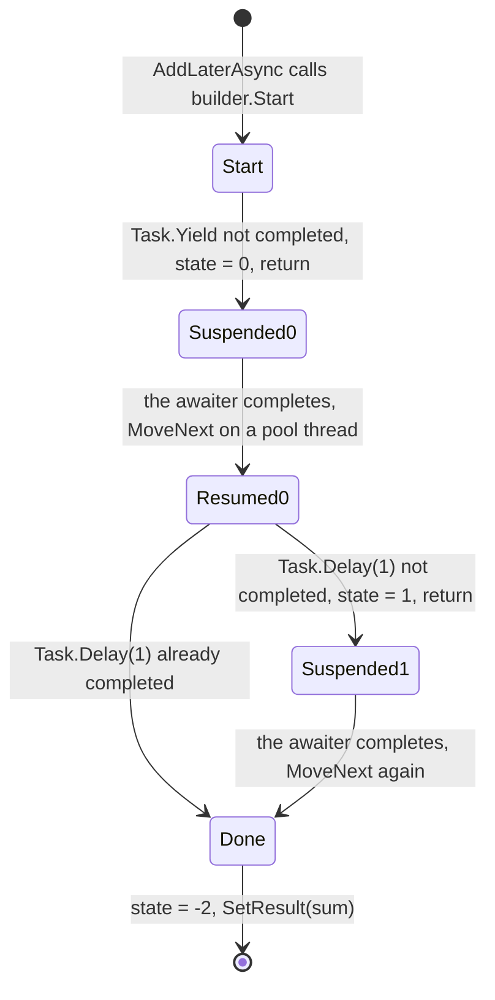
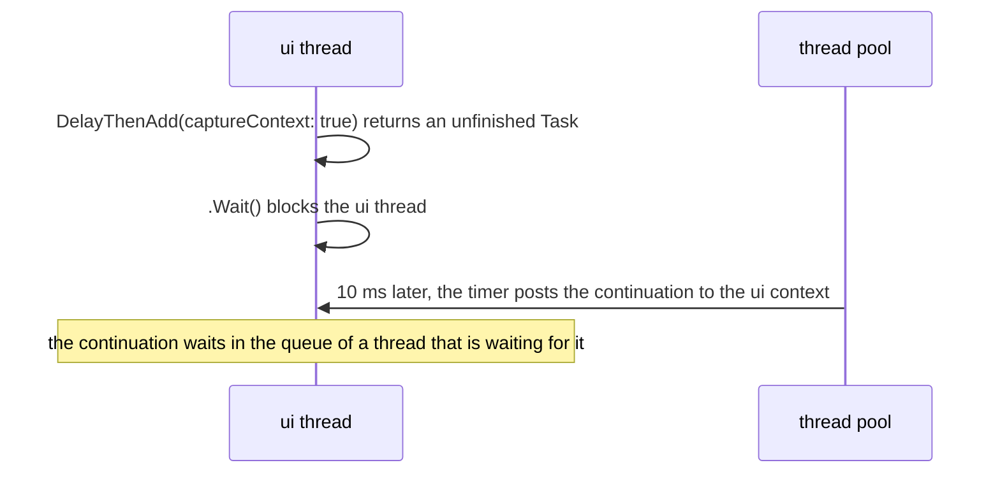

You have written `async` and `await` for years, and you know the rules of thumb: don't block on async code, return `ValueTask` on hot paths, add `ConfigureAwait(false)` in libraries. This lesson opens the method the compiler actually emits for `await`, then checks each rule against a program: what a call allocates, on which thread the code after `await` runs, which exception you catch, and where a cancellation goes. Two pieces of Guitar Alchemist code serve as case studies: a `Try` helper that deadlocks under a synchronization context and swallows cancellation, and a cache that keeps a thread-pool thread asleep for every value.

GA links point to commit [`a826864`](https://github.com/GuitarAlchemist/ga/tree/a826864f3a012cad88e415954bf57eca0ce12aa6); runtime links point to commit [`4271d88`](https://github.com/dotnet/runtime/tree/4271d88e0aebf3d04f188f1334c2220d80555ef6) of `dotnet/runtime`, tagged `v10.0.12`.

## Running the lesson's program

```bash
bash code/csharp-advanced/check.sh                                   # every lesson, compared with expected/
dotnet run --project code/csharp-advanced/Advanced -c Release -- l3  # this lesson only, after check.sh
```

The code is [`Advanced/Lesson3.cs`](https://github.com/spareilleux/learn/blob/8ba378e7ea22a64a57b3e45b45afa4c85afa85a3/code/csharp-advanced/Advanced/Lesson3.cs), and the method decompiled below is in [`Snippets/Async.cs`](https://github.com/spareilleux/learn/blob/8ba378e7ea22a64a57b3e45b45afa4c85afa85a3/code/csharp-advanced/Snippets/Async.cs). The one line starting with `# ` depends on the processor count; the lesson quotes it from the author's machine, an Intel Core Ultra 9 285K with 24 cores, and from the CI runners.

## What the compiler does with `await`

Here is a small async method with two `await`s and a local variable that lives across them:

```csharp
public static async Task<int> AddLaterAsync(int left, int right)
{
    await Task.Yield();
    var sum = left + right;
    await Task.Delay(1);
    return sum;
}
```

There is no `async` in the IL. The compiler turns the method body into a *state machine*: a type that implements [`IAsyncStateMachine`](https://learn.microsoft.com/dotnet/api/system.runtime.compilerservices.iasyncstatemachine), whose `MoveNext` method runs the body up to the next `await` that isn't finished yet, records where it stopped, and returns. `check.sh` decompiles the Release build with [`ilspycmd`](https://github.com/icsharpcode/ILSpy/tree/master/ICSharpCode.ILSpyCmd) at C# 4 language level, before `async` existed, so that ILSpy can't rebuild the `await`s ([`expected/l3-state-machine.txt`](https://github.com/spareilleux/learn/blob/8ba378e7ea22a64a57b3e45b45afa4c85afa85a3/code/csharp-advanced/expected/l3-state-machine.txt)). The method itself has become a stub that creates the state machine and starts it:

```csharp
[AsyncStateMachine(typeof(<AddLaterAsync>d__0))]
public static Task<int> AddLaterAsync(int left, int right)
{
	<AddLaterAsync>d__0 stateMachine = default(<AddLaterAsync>d__0);
	stateMachine.<>t__builder = AsyncTaskMethodBuilder<int>.Create();
	stateMachine.left = left;
	stateMachine.right = right;
	stateMachine.<>1__state = -1;
	stateMachine.<>t__builder.Start(ref stateMachine);
	return stateMachine.<>t__builder.Task;
}
```

The parameters and the local `sum` have become fields, because they must survive between two calls to `MoveNext`. The state field, `<>1__state`, says where to resume: -1 at the start, 0 after the first `await`, 1 after the second, -2 when finished. [`AsyncTaskMethodBuilder<int>`](https://learn.microsoft.com/dotnet/api/system.runtime.compilerservices.asynctaskmethodbuilder-1) creates and completes the `Task<int>` the caller gets. And `MoveNext` contains the body, cut at each `await`:

```csharp
private void MoveNext()
{
	int num = <>1__state;
	int result;
	try
	{
		TaskAwaiter awaiter;
		YieldAwaitable.YieldAwaiter awaiter2;
		if (num != 0)
		{
			if (num == 1)
			{
				awaiter = <>u__2;
				<>u__2 = default(TaskAwaiter);
				num = (<>1__state = -1);
				goto IL_00d5;
			}
			awaiter2 = Task.Yield().GetAwaiter();
			if (!awaiter2.IsCompleted)
			{
				num = (<>1__state = 0);
				<>u__1 = awaiter2;
				<>t__builder.AwaitUnsafeOnCompleted(ref awaiter2, ref this);
				return;
			}
		}
		else
		{
			awaiter2 = <>u__1;
			<>u__1 = default(YieldAwaitable.YieldAwaiter);
			num = (<>1__state = -1);
		}
		awaiter2.GetResult();
		<sum>5__2 = left + right;
		awaiter = Task.Delay(1).GetAwaiter();
		if (!awaiter.IsCompleted)
		{
			num = (<>1__state = 1);
			<>u__2 = awaiter;
			<>t__builder.AwaitUnsafeOnCompleted(ref awaiter, ref this);
			return;
		}
		goto IL_00d5;
		IL_00d5:
		awaiter.GetResult();
		result = <sum>5__2;
	}
	catch (Exception exception)
	{
		<>1__state = -2;
		<>t__builder.SetException(exception);
		return;
	}
	<>1__state = -2;
	<>t__builder.SetResult(result);
}
```

Each `await x` follows the same pattern: get an *awaiter* with `x.GetAwaiter()`, and check `IsCompleted`. If the operation is already finished, the code goes on without leaving `MoveNext`: that's the fast path, and it costs no more than a method call. Otherwise, it saves the state and the awaiter in fields, asks the builder to call `MoveNext` again when the awaiter completes, and returns to its caller, which gets a `Task` that isn't finished yet. `GetResult()` returns the value or rethrows the exception of the awaited operation. An exception anywhere in the body goes to `SetException`, which faults the task instead of propagating up the stack.



The program reads the same type with reflection ([`Lesson3.cs#L68-L79`](https://github.com/spareilleux/learn/blob/8ba378e7ea22a64a57b3e45b45afa4c85afa85a3/code/csharp-advanced/Advanced/Lesson3.cs#L68-L79)):

```text
== The state machine behind AsyncMachine.AddLaterAsync (reflection)
[AsyncStateMachine(typeof(<AddLaterAsync>d__0))], a struct implementing IAsyncStateMachine
  public  Int32                          <>1__state
  public  AsyncTaskMethodBuilder<Int32>  <>t__builder
  public  Int32                          left
  public  Int32                          right
  private Int32                          <sum>5__2
  private YieldAwaitable.YieldAwaiter    <>u__1
  private TaskAwaiter                    <>u__2
AddLaterAsync(2, 3).Result = 5
```

In Release, the state machine is a struct: it lives on the caller's stack while the method runs synchronously, and costs nothing if no `await` has to wait. The first time one does, the builder copies it into a heap object, an `AsyncStateMachineBox<TStateMachine>` that is also the `Task` returned to the caller ([`AsyncTaskMethodBuilderT.cs#L215-L228`](https://github.com/dotnet/runtime/blob/4271d88e0aebf3d04f188f1334c2220d80555ef6/src/libraries/System.Private.CoreLib/src/System/Runtime/CompilerServices/AsyncTaskMethodBuilderT.cs#L215-L228)). In Debug, the compiler emits a class instead, so that the debugger and Edit and Continue can work with it; `check.sh` decompiles the Debug build of the same method too:

```text
		private sealed class <AddLaterAsync>d__0 : IAsyncStateMachine
```

The mechanics are described in the [C# language specification on async functions](https://learn.microsoft.com/dotnet/csharp/language-reference/language-specification/classes#1514-async-functions) and, in much more depth, in Stephen Toub's [How async/await really works in C#](https://devblogs.microsoft.com/dotnet/how-async-await-really-works/).

### What the state machine rules out

Because locals become fields of a type that can end up on the heap, a few things you can write in a synchronous method don't compile in an async one. Every snippet below is compiled by [`CompileFail/Program.cs`](https://github.com/spareilleux/learn/blob/8ba378e7ea22a64a57b3e45b45afa4c85afa85a3/code/csharp-advanced/CompileFail/Program.cs), like in lesson 1. A `ref`, `in` or `out` parameter would become a field holding a reference into the caller's stack:

```csharp
public static async Task NextAsync(ref int fret)
{
    await Task.Yield();
    fret++;
}
```

```text
l3_ref_parameter.cs(4,48): error CS1988: Async methods cannot have ref, in or out parameters
```

A `Span<T>` can't be a field of an ordinary type (lesson 1). Since C# 13, an async method may declare a span local, as long as it isn't used after an `await`. This one is, three times:

```csharp
public static async Task<int> SumAsync(int[] frets)
{
    Span<int> window = frets.AsSpan(0, 3);
    await Task.Yield();
    return window[0] + window[1] + window[2]; // the span would outlive the stack frame
}
```

```text
l3_span_across_await.cs(8,16): error CS4007: Instance of type 'System.Span<int>' cannot be preserved across 'await' or 'yield' boundary.
l3_span_across_await.cs(8,28): error CS4007: Instance of type 'System.Span<int>' cannot be preserved across 'await' or 'yield' boundary.
l3_span_across_await.cs(8,40): error CS4007: Instance of type 'System.Span<int>' cannot be preserved across 'await' or 'yield' boundary.
```

This error is reported late, when the compiler rewrites the method into its state machine: a checker that stops at `GetDiagnostics()` doesn't see it, which is why `CompileFail` emits every snippet. Finally, a `lock` belongs to a thread, and the code after an `await` may run on another one:

```csharp
public async Task TuneAsync()
{
    lock (_gate)
    {
        await Task.Delay(10); // the continuation may run on another thread
    }
}
```

```text
l3_await_in_lock.cs(10,13): error CS1996: Cannot await in the body of a lock statement
```

To hold a lock across an `await`, use [`SemaphoreSlim.WaitAsync`](https://learn.microsoft.com/dotnet/api/system.threading.semaphoreslim.waitasync), which isn't tied to a thread.

## `Task` or `ValueTask`: what completing synchronously costs

When an async method finishes without waiting, the builder still has to return a finished `Task<int>`. [`SetResult`](https://github.com/dotnet/runtime/blob/4271d88e0aebf3d04f188f1334c2220d80555ef6/src/libraries/System.Private.CoreLib/src/System/Runtime/CompilerServices/AsyncTaskMethodBuilderT.cs#L467-L480) calls `Task.FromResult`, which returns a cached task for `null`, `true`, `false` and the integers from -1 to 8 ([`Task.cs#L5386-L5416`](https://github.com/dotnet/runtime/blob/4271d88e0aebf3d04f188f1334c2220d80555ef6/src/libraries/System.Private.CoreLib/src/System/Threading/Tasks/Task.cs#L5386-L5416), [`TaskCache.cs#L18-L21`](https://github.com/dotnet/runtime/blob/4271d88e0aebf3d04f188f1334c2220d80555ef6/src/libraries/System.Private.CoreLib/src/System/Threading/Tasks/TaskCache.cs#L18-L21)), and allocates a new one for anything else. A [`ValueTask<int>`](https://learn.microsoft.com/dotnet/api/system.threading.tasks.valuetask-1) is a struct that holds either the result or a `Task`, so a synchronous result needs no allocation. The program measures one call of each, with `await Task.CompletedTask` as the only `await` ([`Lesson3.cs#L85-L104`](https://github.com/spareilleux/learn/blob/8ba378e7ea22a64a57b3e45b45afa4c85afa85a3/code/csharp-advanced/Advanced/Lesson3.cs#L85-L104)):

```text
== Completing synchronously: bytes allocated by one call
TaskOf(5)                   0  (Task<int> results from -1 to 8 are cached)
TaskOf(500)                72
ValueTaskOf(500)            0
Task.FromResult(true)       0
```

72 bytes is a `Task<int>` object. It is small, but a method called millions of times, a cache lookup or a buffered read that is usually synchronous, pays it on every call. When the method does wait, both kinds allocate the state machine box, and `ValueTask` saves nothing. BenchmarkDotNet's [`Benchmarks/AsyncBenchmarks.cs`](https://github.com/spareilleux/learn/blob/8ba378e7ea22a64a57b3e45b45afa4c85afa85a3/code/csharp-advanced/Benchmarks/AsyncBenchmarks.cs) measures the four cases:

```bash
cd code/csharp-advanced
dotnet run -c Release --project Benchmarks -- --filter "*AsyncBenchmarks*"
```

On the author's machine (BenchmarkDotNet 0.15.8, .NET 10.0.12, Intel Core Ultra 9 285K, Windows 11):

| Method                          | Mean       | Error      | StdDev     | Ratio | RatioSD | Gen0   | Allocated | Alloc Ratio |
|-------------------------------- |-----------:|-----------:|-----------:|------:|--------:|-------:|----------:|------------:|
| TaskCompletedSynchronously      |   8.417 ns |  0.1833 ns |  0.5317 ns |  1.00 |    0.09 | 0.0038 |      72 B |        1.00 |
| ValueTaskCompletedSynchronously |   2.264 ns |  0.0717 ns |  0.1662 ns |  0.27 |    0.03 |      - |         - |        0.00 |
| TaskAfterYield                  | 784.608 ns |  9.1445 ns |  8.5537 ns | 93.60 |    6.27 | 0.0048 |      96 B |        1.33 |
| ValueTaskAfterYield             | 829.301 ns | 12.2729 ns | 11.4801 ns | 98.94 |    6.67 | 0.0048 |     104 B |        1.44 |

- Completing synchronously, `ValueTask<int>` allocates nothing and runs in about a quarter of the time: the 72-byte `Task<int>` and its initialization are gone.
- After a real `await Task.Yield()`, both allocate the box, 96 bytes for the `Task` version and 104 for the `ValueTask` one, whose box is a different type that implements `IValueTaskSource` instead of deriving from `Task`. Marking the method with the attribute `[AsyncMethodBuilder(typeof(PoolingAsyncValueTaskMethodBuilder<>))]` makes it reuse those boxes from a pool ([`PoolingAsyncValueTaskMethodBuilder<TResult>`](https://learn.microsoft.com/dotnet/api/system.runtime.compilerservices.poolingasyncvaluetaskmethodbuilder-1)); the course hasn't measured it, *to verify*. Both take about 800 ns, most of it spent queueing the continuation to the thread pool and switching threads. `ValueTask` is not faster there, and was slightly slower in this run.

So `ValueTask` pays off only where the synchronous path is the common one.

`ValueTask` has a price in usage, not in bytes. A `ValueTask` may be backed by a pooled [`IValueTaskSource`](https://learn.microsoft.com/dotnet/api/system.threading.tasks.sources.ivaluetasksource-1) that is reused as soon as its result has been read, so its [API reference](https://learn.microsoft.com/dotnet/api/system.threading.tasks.valuetask-1#remarks) lists what you must never do with one: await it twice, call `AsTask()` twice, or read `.Result` or `.GetAwaiter().GetResult()` before the operation has completed. The same rules are in the type's source comments ([`ValueTask.cs#L30-L53`](https://github.com/dotnet/runtime/blob/4271d88e0aebf3d04f188f1334c2220d80555ef6/src/libraries/System.Private.CoreLib/src/System/Threading/Tasks/ValueTask.cs#L30-L53)). Return `ValueTask` from methods that usually complete synchronously and are awaited directly; keep `Task` as the default everywhere else ([Understanding the whys, whats, and whens of ValueTask](https://devblogs.microsoft.com/dotnet/understanding-the-whys-whats-and-whens-of-valuetask/)).

## `SynchronizationContext`: where the code after `await` runs

When an `await` has to wait, the awaiter captures [`SynchronizationContext.Current`](https://learn.microsoft.com/dotnet/api/system.threading.synchronizationcontext.current) and, when the operation completes, posts the rest of the method to that context. In a console application or ASP.NET Core there is none, and the continuation runs on a thread-pool thread. In WPF, Windows Forms, .NET MAUI or a Blazor component, the context is the UI thread's: code after `await` can touch the UI again. [`ConfigureAwait(false)`](https://learn.microsoft.com/dotnet/api/system.threading.tasks.task.configureawait) says "don't capture it".

The course program has no UI, so it builds a context of its own: [`SingleThreadContext`](https://github.com/spareilleux/learn/blob/8ba378e7ea22a64a57b3e45b45afa4c85afa85a3/code/csharp-advanced/Advanced/Lesson3.cs#L310-L355), a dedicated thread named `ui` that runs the callbacks posted to it one after the other, like a UI message loop. `ui.Run` posts an async function to that thread and waits, from the main thread, until it has finished ([`Lesson3.cs#L106-L136`](https://github.com/spareilleux/learn/blob/8ba378e7ea22a64a57b3e45b45afa4c85afa85a3/code/csharp-advanced/Advanced/Lesson3.cs#L106-L136)):

```text
== SynchronizationContext: where the code after await runs
before await:                     on ui True
after await Task.Delay:           on ui True
after ConfigureAwait(false):      on ui False, pool thread True
```

The timer that completes `Task.Delay` fires on a pool thread, yet the first continuation came back to the `ui` thread through the captured context. After `ConfigureAwait(false)`, it stayed on the pool thread.

### The classic deadlock

Now the function running on the `ui` thread *blocks* on async code, with `.Wait()` or `.Result`, the way an event handler that can't be `async` sometimes does:

```csharp
ui.Run(() =>
{
    var captured = DelayThenAdd(captureContext: true);
    Line($"awaits with the context, .Wait(1 s):         completed {captured.Wait(TimeSpan.FromSeconds(1))}");
    var free = DelayThenAdd(captureContext: false);
    Line($"awaits with ConfigureAwait(false), .Wait(10 s): completed {free.Wait(TimeSpan.FromSeconds(10))}");
    var gaTry = Try.OfAsync(() => DelayThenAdd(captureContext: false));
    Line($"GA Try.OfAsync(...), .Wait(1 s):             completed {gaTry.Wait(TimeSpan.FromSeconds(1))}");
    return Task.CompletedTask;
});

static async Task<int> DelayThenAdd(bool captureContext)
{
    await Task.Delay(10).ConfigureAwait(captureContext);
    return 2 + 3;
}
```

```text
== Blocking on async code from the ui thread
awaits with the context, .Wait(1 s):         completed False
awaits with ConfigureAwait(false), .Wait(10 s): completed True
GA Try.OfAsync(...), .Wait(1 s):             completed False
```



The first task never completes: its continuation is queued to the `ui` thread, which is blocked waiting for that very task. Without a timeout, the application would freeze. With `ConfigureAwait(false)`, the continuation runs on the pool and the task completes.

The third line is GA's [`Try.OfAsync`](https://github.com/GuitarAlchemist/ga/blob/a826864f3a012cad88e415954bf57eca0ce12aa6/Common/GA.Core/Functional/Try.cs#L62-L73), which wraps an operation's result or exception in a `Try<T>`:

```csharp
public static async Task<Try<T>> OfAsync<T>(Func<Task<T>> operation)
{
    try
    {
        var result = await operation();
        return Try<T>.Success(result);
    }
    catch (Exception ex)
    {
        return Try<T>.Failure(ex);
    }
}
```

The operation passed in is careful, and uses `ConfigureAwait(false)`. It doesn't help: `OfAsync`'s own `await` captures the context, and deadlocks the same way. `ConfigureAwait(false)` protects only the `await` it is written on, so a library must put it on *every* `await`, at every level. That's the actual rule behind the folklore, spelled out in the [ConfigureAwait FAQ](https://devblogs.microsoft.com/dotnet/configureawait-faq/): application code that needs its context doesn't use it; general-purpose library code, which can't know who calls it, does. Better still, don't block on async code at all.

## Exceptions: `await` rethrows one, the task keeps them all

A task can fail with several exceptions, when it combines several operations. [`Task.WhenAll`](https://learn.microsoft.com/dotnet/api/system.threading.tasks.task.whenall) waits for all of them and faults with all of their exceptions; `await` then throws only the first one, not an `AggregateException` like `.Wait()` does ([`Lesson3.cs#L138-L164`](https://github.com/spareilleux/learn/blob/8ba378e7ea22a64a57b3e45b45afa4c85afa85a3/code/csharp-advanced/Advanced/Lesson3.cs#L138-L164)):

```text
== Exceptions: await rethrows the first one, the Task keeps them all
Task.Exception holds 2: first, second; await threw InnerExceptions[0]: True
ConfigureAwaitOptions.SuppressThrowing: no exception
```

The program sorts the messages before printing them: the order of `InnerExceptions` is the order in which the tasks failed, and it varies from one run to the next. When you need every failure, catch the exception and read `task.Exception.InnerExceptions`. The second line shows [`ConfigureAwaitOptions.SuppressThrowing`](https://learn.microsoft.com/dotnet/api/system.threading.tasks.configureawaitoptions), added in .NET 8: the `await` waits for the task to finish and ignores its outcome, useful to wait for a background task you are shutting down. It exists only for `Task`, not `Task<T>`, which would have no result to return.

## Cancellation

Cancellation in .NET is cooperative: a [`CancellationTokenSource`](https://learn.microsoft.com/dotnet/standard/threading/cancellation-in-managed-threads) sets a flag, and every operation that received its token checks the flag or registers a callback. A cancelled operation throws [`OperationCanceledException`](https://learn.microsoft.com/dotnet/api/system.operationcanceledexception), or its subclass `TaskCanceledException`, carrying the token ([`Lesson3.cs#L166-L196`](https://github.com/spareilleux/learn/blob/8ba378e7ea22a64a57b3e45b45afa4c85afa85a3/code/csharp-advanced/Advanced/Lesson3.cs#L166-L196)):

```text
== Cancellation
Task.Delay(10 s, token cancelled after 50 ms): TaskCanceledException, e.CancellationToken == token True
linked token after parent.Cancel(): IsCancellationRequested True
Task.Delay(10 s).WaitAsync(50 ms): TimeoutException
GA Try.OfAsync(cancelled task): IsFailure True, TaskCanceledException, no exception thrown
```

- Comparing `e.CancellationToken` with your own token tells a cancellation you asked for from one that came from somewhere else, such as an HTTP client's timeout.
- [`CancellationTokenSource.CreateLinkedTokenSource`](https://learn.microsoft.com/dotnet/api/system.threading.cancellationtokensource.createlinkedtokensource) creates a token cancelled when any of its parents is: the request's token combined with a per-operation timeout.
- [`WaitAsync`](https://learn.microsoft.com/dotnet/api/system.threading.tasks.task.waitasync) stops *waiting* after a timeout, and throws `TimeoutException`. It doesn't stop the operation, which keeps running without anyone to observe it: pass a token to the operation itself when it accepts one.

The last line is GA's `Try.OfAsync` again. Its `catch (Exception ex)` also catches `OperationCanceledException`, and turns the cancellation into an ordinary failure. The caller that cancelled gets a `Try` in the failure state instead of an exception, the code that follows the call keeps running as if a normal error had happened, and a framework such as ASP.NET Core, which recognizes a cancelled request by its `OperationCanceledException`, never sees it. Code that catches every exception should let cancellation through, with `catch (Exception ex) when (ex is not OperationCanceledException)`.

## `IAsyncEnumerable<T>` and `[EnumeratorCancellation]`

An `async` method that returns [`IAsyncEnumerable<T>`](https://learn.microsoft.com/dotnet/csharp/asynchronous-programming/generate-consume-asynchronous-stream) can both `await` and `yield return`, and is consumed with `await foreach`. The compiler generates one state machine for both. The consumer passes its token with `WithCancellation(token)`; that token reaches the iterator's parameter only if the parameter is marked [`[EnumeratorCancellation]`](https://learn.microsoft.com/dotnet/api/system.runtime.compilerservices.enumeratorcancellationattribute) ([`Lesson3.cs#L198-L231`](https://github.com/spareilleux/learn/blob/8ba378e7ea22a64a57b3e45b45afa4c85afa85a3/code/csharp-advanced/Advanced/Lesson3.cs#L198-L231)):

```csharp
static async IAsyncEnumerable<int> Frets([EnumeratorCancellation] CancellationToken token = default)
{
    for (var fret = 0; fret < 12; fret++)
    {
        await Task.Delay(1, token);
        yield return fret;
    }
}
```

The consumer cancels after the third fret:

```text
== IAsyncEnumerable: the token reaches the iterator through [EnumeratorCancellation]
frets 0 1 2, then TaskCanceledException
```

Without the attribute, the compiler only warns. Exercise 3 shows what that warning means at run time.

```text
l3_missing_enumerator_cancellation.cs(4,47): warning CS8425: Async-iterator 'Frets.AllAsync(CancellationToken)' has one or more parameters of type 'CancellationToken' but none of them is decorated with the 'EnumeratorCancellation' attribute, so the cancellation token parameter from the generated 'IAsyncEnumerable<>.GetAsyncEnumerator' will be unconsumed
```

## Time without sleeping threads: GA's `LazyWithExpiration`

GA's [`LazyWithExpiration<T>`](https://github.com/GuitarAlchemist/ga/blob/a826864f3a012cad88e415954bf57eca0ce12aa6/Common/GA.Core/Utilities/LazyWithExpiration.cs#L20-L40) computes a value on first use and computes it again once it has expired. It measures the expiration by starting a task that sleeps:

```csharp
if (!_lazyObject.IsValueCreated)
{
    Task.Factory.StartNew(() =>
    {
        Thread.Sleep(_expirationTime);
        _expired = true;
    });
}
```

[`Task.Factory.StartNew`](https://learn.microsoft.com/dotnet/api/system.threading.tasks.taskfactory.startnew) runs the delegate on the thread pool, and `Thread.Sleep` holds that thread for the whole expiration time, doing nothing. The pool creates threads on demand up to its minimum, the number of processors by default, and beyond that adds them only gradually ([The managed thread pool](https://learn.microsoft.com/dotnet/standard/threading/the-managed-thread-pool)). The program creates 64 values that expire after one second, reads them, then measures how long a trivial `Task.Run(() => 0)` waits for a thread ([`Lesson3.cs#L233-L255`](https://github.com/spareilleux/learn/blob/8ba378e7ea22a64a57b3e45b45afa4c85afa85a3/code/csharp-advanced/Advanced/Lesson3.cs#L233-L255)):

```text
== GA LazyWithExpiration: one sleeping thread-pool thread per expiring value
sum of the 64 values: 2016
# thread pool threads: 3 before, 25 after; a Task.Run(() => 0) took 2016 ms
```

The two 2016s are a coincidence: 0 + 1 + … + 63 = 2016, and the wait happened to last 2,016 ms. With 24 cores, the sleepers took the pool's threads for about two seconds before the unrelated work item got one. On the CI runners, with 3 or 4 cores, the same `Task.Run` waited 11,001 ms on Linux, 9,878 ms on Windows and 11,722 ms on macOS. In a web server, that's every request stalled: *thread-pool starvation*, caused here by a cache.

Waiting for time to pass needs a timer, not a thread; and a cache that only needs to know whether a value is old doesn't even need a timer. It can compare timestamps when the value is read. [`TimeProvider`](https://learn.microsoft.com/dotnet/standard/datetime/timeprovider-overview), added in .NET 8, makes the clock injectable, so a test can advance time instead of sleeping. The course's [`ExpiringLazy<T>`](https://github.com/spareilleux/learn/blob/8ba378e7ea22a64a57b3e45b45afa4c85afa85a3/code/csharp-advanced/Advanced/Lesson3.cs#L277-L308) does that, with a `ManualClock` for the test (the [`Microsoft.Extensions.TimeProvider.Testing`](https://www.nuget.org/packages/Microsoft.Extensions.TimeProvider.Testing) package provides a complete `FakeTimeProvider`):

```csharp
public sealed class ExpiringLazy<T>(Func<T> create, TimeSpan expiration, TimeProvider clock)
{
    private readonly Lock _lock = new();
    private (T Value, DateTimeOffset CreatedAt)? _entry;

    public T Value
    {
        get
        {
            lock (_lock)
            {
                var now = clock.GetUtcNow();
                if (_entry is not { } entry || now - entry.CreatedAt >= expiration)
                {
                    entry = (create(), now);
                    _entry = entry;
                }
                return entry.Value;
            }
        }
    }
}
```

```text
== An expiring cache without a sleeping thread: TimeProvider
t=0:     Value 1
t=4 min: Value 1
t=6 min: Value 2
```

The value is computed once, kept at 4 minutes, and computed again at 6 minutes, in a test that runs in no time. The lock is a [`System.Threading.Lock`](https://learn.microsoft.com/dotnet/api/system.threading.lock), which `lock` uses directly since C# 13; lesson 10 comes back to it.

## If you know Spring and Reactor

Reactor answers this lesson's question the other way round. C# rewrites sequential code into a state machine so that it can suspend; Reactor asks you to describe the work as a chain of operators, and runs it when someone subscribes. Both moments allocate, and not the same way: assembling `.map(...)` creates one `Publisher` object, once, while each subscription creates one subscriber object per operator ([`FluxMap`](https://github.com/reactor/reactor-core/blob/main/reactor-core/src/main/java/reactor/core/publisher/FluxMap.java) builds a `MapSubscriber` in `subscribeOrReturn`). The [Reactor course](../../spring-cloud-reactor/02-reactor-mono-and-flux/#assembly-and-subscription) runs both.

| C# | Reactor |
|---|---|
| the compiler generates a state machine for each `async` method | no code generation: operators are objects, and `subscribe` builds a second chain, of subscribers |
| a `Task` is hot: it is already running, and awaiting it twice gives the same result | a pipeline is [cold](https://projectreactor.io/docs/core/release/reference/advancedFeatures/reactor-hotCold.html): each subscriber runs it again. `cache()` turns it hot; `Mono.just(lookUp())` is the trap, because its argument ran at assembly, and `Mono.defer` is the fix |
| `ValueTask` saves the allocation of a synchronous completion | the equivalent saving is fusion: [`Fuseable`](https://projectreactor.io/docs/core/release/api/reactor/core/Fuseable.html) lets adjacent operators share one queue instead of one per stage, and a scalar source is replaced by a cheaper operator at assembly. Reactor publishes no figure for it |
| `await` resumes on the captured `SynchronizationContext` | nothing captures anything. [`publishOn`](https://projectreactor.io/docs/core/release/reference/coreFeatures/schedulers.html) changes the thread for the operators below it; `subscribeOn` changes the thread the whole chain subscribes on, and only the closest one counts |
| `ConfigureAwait(false)` opts out of a capture you never asked for | `publishOn` opts *in* to a thread change you did ask for |
| blocking under a single-threaded context deadlocks | `block()` from a thread marked [`NonBlocking`](https://projectreactor.io/docs/core/release/api/reactor/core/scheduler/NonBlocking.html) throws instead of deadlocking; [BlockHound](https://github.com/reactor/BlockHound) catches the blocking calls that check misses |
| `AsyncLocal<T>` flows with the execution context | `Context` and `ContextView` travel with the subscription, written downstream and read upstream |
| a `CancellationToken` you pass down by hand and check | `cancel()` travels up the subscription on its own — as a request to stop *eventually*: the [Reactive Streams rules](https://github.com/reactive-streams/reactive-streams-jvm) say a subscriber must still be ready for items already requested (rule 2.8) |
| `await` rethrows the first exception, and the task keeps them all | an error is terminal: it ends the sequence, and an error-handling operator doesn't resume it, it starts a new sequence in its place |
| `IAsyncEnumerable<T>` and `[EnumeratorCancellation]` | `Flux<T>`, where the consumer asks with `request(n)` |
| `TimeProvider` to make time testable | `StepVerifier.withVirtualTime`, which installs a virtual-time scheduler — hence its `Supplier`: the pipeline must be built inside the lambda |

Put the two deadlocks side by side. In C#, blocking deadlocks because a context you never asked for captured the continuation, and the fix is to stop blocking. In Reactor, blocking fails because you are on a thread that refuses to block, and the fix is [`Mono.fromCallable(...).subscribeOn(Schedulers.boundedElastic())`](https://projectreactor.io/docs/core/release/reference/faq.html) joined with `flatMap` — again, not blocking. The rule survives the translation; only the error message changes.

What does change is the price of blocking. Virtual threads ([JEP 444](https://openjdk.org/jeps/444), final in Java 21) make a blocked thread almost free, and [JEP 491](https://openjdk.org/jeps/491) removed the `synchronized` pinning that came with them, so the thread-per-request style is viable again for code that waits. The [Reactor course](../../spring-cloud-reactor/03-reactor-under-the-hood/#virtual-threads-or-reactive) weighs the two models; .NET has no equivalent, and `async` remains the only way to wait without holding a thread.

## Exercises

1. `ThreeDelaysAsync` awaits `Task.Delay(1)` three times in a row. How many awaiter fields does its state machine have? Predict, then check with reflection or `ilspycmd`.
2. Fix GA's `Try.OfAsync` so that it doesn't deadlock when called and blocked on from the `ui` thread, and lets cancellation propagate. Check both with the program's `SingleThreadContext` and a cancelled task.
3. Remove `[EnumeratorCancellation]` from `Frets`, keep `WithCancellation(cts.Token)` and the cancellation after the third fret, and run the loop again. What happens, and why?

<details>
<summary>Solutions</summary>

1. One. The compiler needs one field per awaiter *type* whose value must survive a suspension, not one per `await`: the three `await`s store the same kind of `TaskAwaiter` in the same field, and each one clears it after use so the task can be collected ([`Lesson3.cs#L25-L30`](https://github.com/spareilleux/learn/blob/8ba378e7ea22a64a57b3e45b45afa4c85afa85a3/code/csharp-advanced/Advanced/Lesson3.cs#L25-L30)). `AddLaterAsync` had two fields because it awaited two different awaiter types.

    ```text
    1. ThreeDelaysAsync: 1 awaiter field (TaskAwaiter <>u__1), result 3
    ```

2. Add `ConfigureAwait(false)` to the `await`, and exclude `OperationCanceledException` from the `catch` with an exception filter ([`Lesson3.cs#L260-L275`](https://github.com/spareilleux/learn/blob/8ba378e7ea22a64a57b3e45b45afa4c85afa85a3/code/csharp-advanced/Advanced/Lesson3.cs#L260-L275)):

    ```csharp
    public static async Task<Try<T>> OfAsync<T>(Func<Task<T>> operation)
    {
        try
        {
            var result = await operation().ConfigureAwait(false);
            return Try<T>.Success(result);
        }
        catch (Exception ex) when (ex is not OperationCanceledException)
        {
            return Try<T>.Failure(ex);
        }
    }
    ```

    ```text
    2. TryFixed.OfAsync(...) on the ui thread, .Wait(10 s): completed True
       TryFixed.OfAsync(cancelled task): TaskCanceledException, e.CancellationToken == token True
    ```

    The fixed version completes on the `ui` thread, and the cancellation reaches the caller with its own token.

3. The loop runs to the end, frets 0 to 11, and completes normally. `WithCancellation` passes the token to `GetAsyncEnumerator`; without the attribute, the generated enumerator has nowhere to put it, and the iterator's `token` parameter keeps its default value, `CancellationToken.None`. Cancelling does nothing, which is exactly what warning CS8425 says. Since the program disables that warning on purpose ([`Lesson3.cs#L56-L66`](https://github.com/spareilleux/learn/blob/8ba378e7ea22a64a57b3e45b45afa4c85afa85a3/code/csharp-advanced/Advanced/Lesson3.cs#L56-L66)), nothing else tells you.

    ```text
    3. without [EnumeratorCancellation]: frets 0 1 2 3 4 5 6 7 8 9 10 11, then completed
    ```

</details>

## Key takeaways

- An `async` method compiles to a stub and a state machine: locals become fields, each `await` checks `IsCompleted`, and a suspension saves the state, registers `MoveNext` as the continuation and returns.
- In Release the state machine is a struct, copied to the heap only on the first real suspension. An async method that completes synchronously allocates only its `Task<T>`, and nothing for cached results or with `ValueTask<T>`.
- `ValueTask` saves an allocation on synchronous paths, and must be awaited exactly once.
- `await` resumes on the captured `SynchronizationContext`. Blocking on async code from a single-threaded context deadlocks unless *every* `await` below it uses `ConfigureAwait(false)`, which is why libraries write it everywhere and applications shouldn't block at all.
- `await` rethrows the first exception; the task keeps all of them.
- Cancellation is cooperative. Don't catch `OperationCanceledException` along with other exceptions, pass the token to the operation rather than only to `WaitAsync`, and mark an async iterator's token `[EnumeratorCancellation]`.
- Never wait for time with `Thread.Sleep` on the thread pool: compare timestamps from a `TimeProvider`, or use `Task.Delay` or a timer.

## Sources

- Microsoft Learn: [Asynchronous programming with async and await](https://learn.microsoft.com/dotnet/csharp/asynchronous-programming/), [Async functions in the C# specification](https://learn.microsoft.com/dotnet/csharp/language-reference/language-specification/classes#1514-async-functions), [Cancellation in managed threads](https://learn.microsoft.com/dotnet/standard/threading/cancellation-in-managed-threads), [Generate and consume async streams](https://learn.microsoft.com/dotnet/csharp/asynchronous-programming/generate-consume-asynchronous-stream), [The managed thread pool](https://learn.microsoft.com/dotnet/standard/threading/the-managed-thread-pool), [What is TimeProvider?](https://learn.microsoft.com/dotnet/standard/datetime/timeprovider-overview).
- The .NET blog, by Stephen Toub: [How async/await really works in C#](https://devblogs.microsoft.com/dotnet/how-async-await-really-works/), [ConfigureAwait FAQ](https://devblogs.microsoft.com/dotnet/configureawait-faq/), [Understanding the whys, whats, and whens of ValueTask](https://devblogs.microsoft.com/dotnet/understanding-the-whys-whats-and-whens-of-valuetask/).
- dotnet/runtime at `v10.0.12` (commit `4271d88`): [`AsyncTaskMethodBuilderT.cs`](https://github.com/dotnet/runtime/blob/4271d88e0aebf3d04f188f1334c2220d80555ef6/src/libraries/System.Private.CoreLib/src/System/Runtime/CompilerServices/AsyncTaskMethodBuilderT.cs#L215-L228), [`Task.cs`](https://github.com/dotnet/runtime/blob/4271d88e0aebf3d04f188f1334c2220d80555ef6/src/libraries/System.Private.CoreLib/src/System/Threading/Tasks/Task.cs#L5386-L5416), [`TaskCache.cs`](https://github.com/dotnet/runtime/blob/4271d88e0aebf3d04f188f1334c2220d80555ef6/src/libraries/System.Private.CoreLib/src/System/Threading/Tasks/TaskCache.cs#L18-L21), [`ValueTask.cs`](https://github.com/dotnet/runtime/blob/4271d88e0aebf3d04f188f1334c2220d80555ef6/src/libraries/System.Private.CoreLib/src/System/Threading/Tasks/ValueTask.cs#L30-L53).
- Guitar Alchemist at `a826864`: [`Try.cs`](https://github.com/GuitarAlchemist/ga/blob/a826864f3a012cad88e415954bf57eca0ce12aa6/Common/GA.Core/Functional/Try.cs#L62-L73), [`LazyWithExpiration.cs`](https://github.com/GuitarAlchemist/ga/blob/a826864f3a012cad88e415954bf57eca0ce12aa6/Common/GA.Core/Utilities/LazyWithExpiration.cs#L20-L40).
