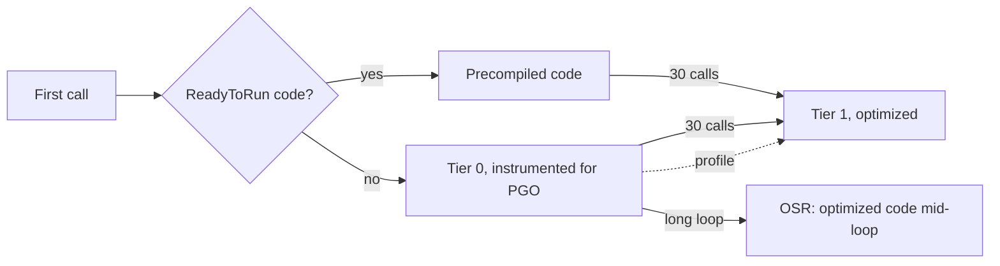

The first three lessons measured bytes, which are exact. This lesson measures time, which isn't. A timing depends on the processor, on what else the machine is doing, on the JIT's tier, and on details of the benchmark that are easy to get wrong. The lesson starts with how [BenchmarkDotNet](https://benchmarkdotnet.org/) deals with all that, then puts four pieces of performance folklore to the test on Guitar Alchemist code: "the JIT needs warming up", "`SearchValues` beats a loop", "`FrozenDictionary` beats `Dictionary`", and "SIMD beats a scalar loop".

GA links point to commit [`a826864`](https://github.com/GuitarAlchemist/ga/tree/a826864f3a012cad88e415954bf57eca0ce12aa6); runtime links point to commit [`4271d88`](https://github.com/dotnet/runtime/tree/4271d88e0aebf3d04f188f1334c2220d80555ef6) of `dotnet/runtime`, tagged `v10.0.12`.

## Running the lesson's program and its benchmarks

```bash
bash code/csharp-advanced/check.sh                                   # every lesson, compared with expected/
dotnet run --project code/csharp-advanced/Advanced -c Release -- l4  # this lesson only, after check.sh
cd code/csharp-advanced
dotnet run -c Release --project Benchmarks -- --filter "*SearchBenchmarks*"   # one benchmark class
```

[`Advanced/Lesson4.cs`](https://github.com/spareilleux/learn/blob/8ba378e7ea22a64a57b3e45b45afa4c85afa85a3/code/csharp-advanced/Advanced/Lesson4.cs) checks that the code being compared computes the same results; CI compares its output on three OSes. The timings come from [`Benchmarks/`](https://github.com/spareilleux/learn/tree/8ba378e7ea22a64a57b3e45b45afa4c85afa85a3/code/csharp-advanced/Benchmarks), run one class at a time on the author's machine:

```text
BenchmarkDotNet v0.15.8, Windows 11 (10.0.26200.9445/25H2/2025Update/HudsonValley2)
Intel Core Ultra 9 285K 3.70GHz, 1 CPU, 24 logical and 24 physical cores
.NET SDK 10.0.112
  [Host]     : .NET 10.0.12 (10.0.12, 10.0.1226.42308), X64 RyuJIT x86-64-v3
  DefaultJob : .NET 10.0.12 (10.0.12, 10.0.1226.42308), X64 RyuJIT x86-64-v3
```

CI runs every benchmark once with `--job Dry`, which checks that they run and measures nothing. Timings are never compared in CI: a shared runner's timings vary from one run to the next more than most of the differences below.

## How BenchmarkDotNet measures

A benchmark is a public method marked `[Benchmark]` in a public class. `BenchmarkSwitcher` generates a separate project for each class, builds it in Release, and runs each benchmark in its own process, so that one benchmark's JIT state, GC state and static fields don't leak into the next ([How it works](https://benchmarkdotnet.org/articles/guides/how-it-works.html)). In that process, it goes through stages, which the log shows. Here is `VoicingWithSpans` from lesson 2, cut down:

```text
OverheadJitting  1: 1 op, 297100.00 ns, 297.1000 us/op
WorkloadJitting  1: 1 op, 1748700.00 ns, 1.7487 ms/op
WorkloadPilot    1: 16 op, 5800.00 ns, 362.5000 ns/op
WorkloadPilot    2: 32 op, 6600.00 ns, 206.2500 ns/op
...
WorkloadPilot   15: 262144 op, 39632100.00 ns, 151.1845 ns/op
WorkloadPilot   16: 524288 op, 66413500.00 ns, 126.6737 ns/op
WorkloadPilot   17: 1048576 op, 32909200.00 ns, 31.3847 ns/op
WorkloadPilot   18: 2097152 op, 66566700.00 ns, 31.7415 ns/op
...
OverheadActual   1: 16777216 op, 22217200.00 ns, 1.3242 ns/op
...
WorkloadWarmup   1: 16777216 op, 529044400.00 ns, 31.5335 ns/op
...
// BeforeActualRun
WorkloadActual   1: 16777216 op, 745563700.00 ns, 44.4391 ns/op
WorkloadActual   2: 16777216 op, 787768100.00 ns, 46.9546 ns/op
```

- **Jitting** calls the method once, so that the time of JIT compilation isn't counted as a measurement.
- **Pilot** doubles the number of calls per iteration until an iteration lasts long enough to be timed precisely: here 16,777,216 calls, about half a second.
- **Overhead** runs the same loop around an empty method; its time is subtracted from the workload's.
- **Warmup** repeats iterations until the time per call stops changing, then **Actual** runs the iterations that the statistics use: at least 15, more if they vary.

The pilot also shows the JIT at work. For about 500,000 calls the method took around 150 ns; then, suddenly, 31 ns. Nothing in the benchmark changed: the runtime replaced the method's first, unoptimized code with optimized code, as the next section explains. A stopwatch around a loop of 100,000 calls would have measured the unoptimized code and concluded the method was five times slower than it is.

The end of the log shows another surprise: the warmup reached 31 ns, and the actual iterations measured 41 to 52 ns, for the same code. The table of lesson 2 reports 46 ns. Running the benchmark again with BenchmarkDotNet's `--affinity` option, which pins the process to one core, gave 32.4 ns with a standard deviation under 0.5 ns, whether pinned to the first core (`--affinity 1`) or to the last one (`--affinity 8388608`). The author's processor mixes performance and efficiency cores, and the scheduler moves threads between them; whether that explains the slower iterations hasn't been investigated, *to verify*. The practical lesson stands: when the warmup and the actual iterations disagree, or when BenchmarkDotNet warns about a multimodal distribution, rerun before believing the table.

The rules that follow from this ([Good practices](https://benchmarkdotnet.org/articles/guides/good-practices.html)):

- Build in Release, without a debugger. BenchmarkDotNet refuses a Debug build.
- Return the result of the work, as every benchmark in the course does, so that the JIT can't remove a computation nobody uses.
- Keep setup out of the measured method: `[GlobalSetup]` runs once before the iterations, `[Params]` runs the benchmark for each value.
- Run on a quiet machine, one benchmark class at a time, and read `Error` and `StdDev` before comparing two means.

## Tiered compilation, OSR and dynamic PGO

When a method is called for the first time, the runtime doesn't compile it with every optimization: that would slow startup. With [tiered compilation](https://learn.microsoft.com/dotnet/core/runtime-config/compilation#tiered-compilation), on by default since .NET Core 3.0:

1. **Tier 0**: the method is compiled quickly with few optimizations, or its precompiled [ReadyToRun](https://learn.microsoft.com/dotnet/core/deploying/ready-to-run) code is used; most of the .NET libraries ship with ReadyToRun code.
2. After 30 calls, counted once a 100 ms delay without new tier-0 compilations has passed, the method is queued for **tier 1**, compiled with full optimization in the background ([`clrconfigvalues.h#L474-L480`](https://github.com/dotnet/runtime/blob/4271d88e0aebf3d04f188f1334c2220d80555ef6/src/coreclr/inc/clrconfigvalues.h#L474-L480)). Later calls use the new code.
3. A method that is called once but loops for a long time, like `Main`, would be stuck in tier 0. **On-stack replacement** (OSR) switches it to optimized code in the middle of the loop.
4. With **dynamic PGO** (profile-guided optimization), on by default since .NET 8 ([`clrconfigvalues.h#L520`](https://github.com/dotnet/runtime/blob/4271d88e0aebf3d04f188f1334c2220d80555ef6/src/coreclr/inc/clrconfigvalues.h#L520)), tier 0 code also counts which branches are taken and which types an interface call actually receives. Tier 1 uses that profile: for example, when a call on `IEnumerable<int>` always receives a `List<int>`, it checks for `List<int>` and calls its methods directly, where they can be inlined (*guarded devirtualization*).



Each step can be switched off with an environment variable ([compilation settings](https://learn.microsoft.com/dotnet/core/runtime-config/compilation)). [`Benchmarks/JitBenchmarks.cs`](https://github.com/spareilleux/learn/blob/8ba378e7ea22a64a57b3e45b45afa4c85afa85a3/code/csharp-advanced/Benchmarks/JitBenchmarks.cs) runs the same two methods under four jobs: the defaults, `DOTNET_TieredPGO=0`, `DOTNET_TieredCompilation=0` (everything compiled fully optimized on the first call, without a profile), and `DOTNET_ReadyToRun=0` (the libraries' precompiled code ignored, so they go through the tiers too):

```csharp
private static readonly IEnumerable<int> Values = PitchClassSetId.Items.Select(id => id.Value).ToList();

// A loop over an interface: with PGO, the JIT sees that Values is always a List<int> and devirtualizes the calls
[Benchmark]
public long SumThroughInterface()
{
    long sum = 0;
    foreach (var value in Values) sum += value;
    return sum;
}

// GA's collection of the 4096 sets, enumerated through IReadOnlyCollection<PitchClassSetId>
[Benchmark]
public int CardinalityOfEverySet()
{
    var notes = 0;
    foreach (var id in PitchClassSetId.Items) notes += id.Cardinality;
    return notes;
}
```

| Method                | Job          | EnvironmentVariables       | Mean      | Error     | StdDev    | Ratio | RatioSD | Allocated | Alloc Ratio |
|---------------------- |------------- |--------------------------- |----------:|----------:|----------:|------:|--------:|----------:|------------:|
| SumThroughInterface   | Default      | Empty                      |  1.219 μs | 0.0100 μs | 0.0094 μs |  1.00 |    0.01 |         - |          NA |
| SumThroughInterface   | NoPGO        | DOTNET_TieredPGO=0         | 11.341 μs | 0.0594 μs | 0.0556 μs |  9.30 |    0.08 |      40 B |          NA |
| SumThroughInterface   | NoReadyToRun | DOTNET_ReadyToRun=0        |  1.212 μs | 0.0064 μs | 0.0059 μs |  0.99 |    0.01 |         - |          NA |
| SumThroughInterface   | NoTiering    | DOTNET_TieredCompilation=0 | 11.305 μs | 0.0890 μs | 0.0833 μs |  9.27 |    0.10 |      40 B |          NA |
|                       |              |                            |           |           |           |       |         |           |             |
| CardinalityOfEverySet | Default      | Empty                      |  2.656 μs | 0.0306 μs | 0.0286 μs |  1.00 |    0.01 |      40 B |        1.00 |
| CardinalityOfEverySet | NoPGO        | DOTNET_TieredPGO=0         | 11.353 μs | 0.0778 μs | 0.0728 μs |  4.28 |    0.05 |      40 B |        1.00 |
| CardinalityOfEverySet | NoReadyToRun | DOTNET_ReadyToRun=0        |  2.672 μs | 0.0418 μs | 0.0391 μs |  1.01 |    0.02 |      40 B |        1.00 |
| CardinalityOfEverySet | NoTiering    | DOTNET_TieredCompilation=0 | 11.303 μs | 0.0717 μs | 0.0636 μs |  4.26 |    0.05 |      40 B |        1.00 |

The two methods behave differently, and both results are worth reading closely.

- `SumThroughInterface` runs **9 times faster with PGO**, and allocates nothing. Without the profile (`NoPGO`), or without tiers at all (`NoTiering`, where nothing is ever instrumented), every `MoveNext()` and `Current` is an interface call, and `GetEnumerator()` boxes the `List<int>.Enumerator` struct: 40 bytes. With the profile, the JIT knows that `Values` is always a `List<int>`: it adds a type check, calls the struct enumerator's methods directly and inlines them, and since the enumerator no longer escapes, it doesn't box it. That combination of guarded devirtualization and escape analysis is one of the .NET 10 improvements described in [Performance Improvements in .NET 10](https://devblogs.microsoft.com/dotnet/performance-improvements-in-net-10/).
- `CardinalityOfEverySet`, over GA's `PitchClassSetId.Items`, gains 4 times with PGO but **still allocates 40 bytes**. Its collection is the compiler-generated `<>z__ReadOnlyList<PitchClassSetId>` from lesson 1, and PGO doesn't get rid of its enumerator allocation; why exactly, I haven't looked into, *to verify*.
- `DOTNET_TieredCompilation=0` is no faster than the defaults, and here much slower: code compiled once, fully optimized but without a profile, loses what PGO brings. Turning tiers off to "skip warmup" trades startup and PGO for nothing in steady state.
- `DOTNET_ReadyToRun=0` changes nothing measurable once the code has reached tier 1; ReadyToRun matters for startup, which this benchmark doesn't measure.

## `SearchValues<T>`: searching for any of several values

Finding the first accidental in a chord symbol is a loop over characters. [`SearchValues<T>`](https://learn.microsoft.com/dotnet/api/system.buffers.searchvalues-1), added in .NET 8, precomputes a set of values once, and `IndexOfAny` then uses the fastest search for that set on the current processor ([`Lesson4.cs#L53-L83`](https://github.com/spareilleux/learn/blob/8ba378e7ea22a64a57b3e45b45afa4c85afa85a3/code/csharp-advanced/Advanced/Lesson4.cs#L53-L83)):

```csharp
static readonly SearchValues<char> Accidentals = SearchValues.Create("#b");
static readonly SearchValues<string> Qualities = SearchValues.Create(["maj7", "m7b5", "dim7", "sus4"], StringComparison.Ordinal);

public static int IndexOfAccidental(string symbol)
{
    var i = symbol.AsSpan(1).IndexOfAny(Accidentals);
    return i < 0 ? -1 : i + 1;
}
```

```text
== SearchValues: the same answers as a loop
first accidental: -1 -1 -1 -1 -1 3 -1 1 1 1 1 1 -1 2; same as the loop: True
quality found: -1 -1 -1 1 -1 1 1 -1 2 -1 -1 -1 1 -1
```

`SearchValues<T>` is abstract, and `Create` returns a specialized subclass. Which one depends on the processor, which is why the program prints its name on a machine-dependent line:

```text
# SearchValues.Create("#b") is Any2CharPackedSearchValues
# SearchValues.Create(["maj7", ...]) is AsciiStringSearchValuesTeddyNonBucketizedN3`2
```

On x64, two ASCII characters get a *packed* implementation, which narrows UTF-16 characters to bytes to compare more of them per instruction; on the macOS Arm64 runner, the same call returned ``Any2SearchValues`2``. The four strings use *Teddy*, a vectorized multi-substring algorithm, on both. [`SearchBenchmarks`](https://github.com/spareilleux/learn/blob/8ba378e7ea22a64a57b3e45b45afa4c85afa85a3/code/csharp-advanced/Benchmarks/LookupBenchmarks.cs) searches the 14 chord symbols, and a chord chart of 400 bars, 9,606 characters, whose only accidental is near the end:

| Method                  | Mean        | Error     | StdDev     | Ratio  | RatioSD | Allocated | Alloc Ratio |
|------------------------ |------------:|----------:|-----------:|-------:|--------:|----------:|------------:|
| SymbolsLoop             |    16.51 ns |  0.352 ns |   0.711 ns |   1.00 |    0.06 |         - |          NA |
| SymbolsSearchValues     |    28.53 ns |  0.587 ns |   1.576 ns |   1.73 |    0.12 |         - |          NA |
| ChartLoop               | 2,298.83 ns | 45.726 ns | 115.556 ns | 139.53 |    9.25 |         - |          NA |
| ChartSearchValues       |   162.38 ns |  7.412 ns |  21.853 ns |   9.86 |    1.39 |         - |          NA |
| ChartIndexOfAnyTwoChars |   166.70 ns |  4.382 ns |  12.853 ns |  10.12 |    0.89 |         - |          NA |

On the chord symbols, 1 to 6 characters long, the loop wins: `SearchValues` is **1.7 times slower**. Each call to `IndexOfAny` has to check the length and choose a path before it looks at a character, and that costs more than looking at three or four characters. On the chart, the loop is 14 times slower than `SearchValues`, 2.3 µs against 162 ns, because the vectorized search compares many characters per instruction. And `IndexOfAny('#', 'b')` does as well as `SearchValues` there (exercise 3). `SearchValues` is for long inputs, or for sets of values that the simple overloads don't cover.

## `FrozenDictionary`: which implementation you get

[`FrozenDictionary<TKey, TValue>`](https://learn.microsoft.com/dotnet/api/system.collections.frozen.frozendictionary-2), added in .NET 8, is a read-only dictionary that spends more time when it is created to be faster when it is read. `ToFrozenDictionary()` examines the keys and picks an implementation ([`FrozenDictionary.cs#L157-L280`](https://github.com/dotnet/runtime/blob/4271d88e0aebf3d04f188f1334c2220d80555ef6/src/libraries/System.Collections.Immutable/src/System/Collections/Frozen/FrozenDictionary.cs#L157-L280)). The program prints the type it gets for a few sets of keys, including two of GA's ([`Lesson4.cs#L85-L111`](https://github.com/spareilleux/learn/blob/8ba378e7ea22a64a57b3e45b45afa4c85afa85a3/code/csharp-advanced/Advanced/Lesson4.cs#L85-L111)):

```text
== FrozenDictionary: which implementation ToFrozenDictionary() picks
10 chord suffixes (string keys)              LengthBucketsFrozenDictionary`1
same, StringComparer.OrdinalIgnoreCase       LengthBucketsFrozenDictionary`1
12 pitch classes (int keys)                  WithFullValues`3
12 PitchClass keys (record struct)           ValueTypeDefaultComparerFrozenDictionary`2
GA: 144 (int, int) keys, PitchClass -        ValueTypeDefaultComparerFrozenDictionary`2
GA: ProgrammaticForteCatalog.ForteByPrimeFormId ValueTypeDefaultComparerFrozenDictionary`2 (224 keys)
lookups agree with the Dictionary: True
```

- **String keys** of few different lengths go into *length buckets*: a lookup first checks the key's length, then compares with at most five keys of that length ([`LengthBuckets.cs#L13`](https://github.com/dotnet/runtime/blob/4271d88e0aebf3d04f188f1334c2220d80555ef6/src/libraries/System.Collections.Immutable/src/System/Collections/Frozen/String/LengthBuckets.cs#L13)). Other string keys are analyzed for the shortest substring that tells them apart, and only that substring is hashed.
- **Integer keys** in a dense range, here 0 to 11, need no hashing at all: .NET 10's `DenseIntegralFrozenDictionary` stores the values in an array indexed by the key, as long as the range is at most ten times the number of keys ([`DenseIntegralFrozenDictionary.cs#L27`](https://github.com/dotnet/runtime/blob/4271d88e0aebf3d04f188f1334c2220d80555ef6/src/libraries/System.Collections.Immutable/src/System/Collections/Frozen/Integer/DenseIntegralFrozenDictionary.cs#L27)). `WithFullValues` is its nested class for a range with no gaps.
- **Other value types**, like GA's `PitchClass` record struct or a tuple, get a general hash table that calls `EqualityComparer<TKey>.Default` directly, without a virtual call. Up to 10 keys, a linear search is used instead ([`Constants.cs#L32`](https://github.com/dotnet/runtime/blob/4271d88e0aebf3d04f188f1334c2220d80555ef6/src/libraries/System.Collections.Immutable/src/System/Collections/Frozen/Constants.cs#L32)); 12 pitch classes are just above that.

[`Benchmarks/LookupBenchmarks.cs`](https://github.com/spareilleux/learn/blob/8ba378e7ea22a64a57b3e45b45afa4c85afa85a3/code/csharp-advanced/Benchmarks/LookupBenchmarks.cs) looks up twelve chord suffixes, two of them missing, in a `Dictionary` and in its frozen copy:

| Method                      | Mean     | Error    | StdDev   | Median   | Ratio | RatioSD | Allocated | Alloc Ratio |
|---------------------------- |---------:|---------:|---------:|---------:|------:|--------:|----------:|------------:|
| DictionaryTryGetValue       | 45.45 ns | 0.928 ns | 2.310 ns | 45.94 ns |  1.00 |    0.07 |         - |          NA |
| FrozenDictionaryTryGetValue | 48.86 ns | 1.920 ns | 5.660 ns | 50.79 ns |  1.08 |    0.14 |         - |          NA |

For these twelve lookups, `FrozenDictionary` is **not faster**: 48.9 ns against 45.5 ns, a difference within its own error margin. The keys are short, and hashing them is already cheap. The frozen dictionary's advantages, on keys where its analysis avoids hashing long strings, or on a large read-only table, don't show up on a table of chord suffixes. Measure your own keys before switching.

## GA's pitch-class subtraction: a dictionary for arithmetic

GA's [`PitchClass`](https://github.com/GuitarAlchemist/ga/blob/a826864f3a012cad88e415954bf57eca0ce12aa6/Common/GA.Domain.Core/Theory/Atonal/PitchClass.cs#L80-L81) is a number from 0 to 11. Its `-` operator looks up the difference in a `FrozenDictionary` of the 144 possible pairs, built once behind a `Lazy` ([`PitchClass.cs#L110-L137`](https://github.com/GuitarAlchemist/ga/blob/a826864f3a012cad88e415954bf57eca0ce12aa6/Common/GA.Domain.Core/Theory/Atonal/PitchClass.cs#L110-L137)):

```csharp
private static readonly Lazy<FrozenDictionary<(int, int), PitchClass>> _lazySubtractionDictionary =
    new(GetSubtractionDictionary);

public static PitchClass NormalizedSubtraction(PitchClass pitchClass1, PitchClass pitchClass2) =>
    _lazySubtractionDictionary.Value[(pitchClass1.Value, pitchClass2.Value)];
```

Each value in that table is computed with `FromValue((pcValue1 - pcValue2 + 12) % 12)`: the dictionary caches an addition and a remainder. The program checks that the arithmetic gives the same 144 results, and that the lookup allocates nothing ([`Lesson4.cs#L113-L131`](https://github.com/spareilleux/learn/blob/8ba378e7ea22a64a57b3e45b45afa4c85afa85a3/code/csharp-advanced/Advanced/Lesson4.cs#L113-L131)):

```text
== GA PitchClass subtraction: FrozenDictionary lookup versus arithmetic
144 of 144 pairs agree; E - 1 = T, 1 - E = 2
bytes allocated by one GA subtraction: 0
```

`PitchClassBenchmarks` subtracts every pair of pitch classes, 144 subtractions per call, with GA's operator, with the arithmetic, and with the flat array of exercise 2:

| Method          | Mean      | Error     | StdDev    | Ratio | RatioSD | Allocated | Alloc Ratio |
|---------------- |----------:|----------:|----------:|------:|--------:|----------:|------------:|
| GaOperatorMinus | 582.72 ns | 12.656 ns | 37.318 ns |  1.00 |    0.09 |         - |          NA |
| Arithmetic      | 134.46 ns |  2.281 ns |  2.134 ns |  0.23 |    0.02 |         - |          NA |
| LookupTable     |  41.51 ns |  0.417 ns |  0.390 ns |  0.07 |    0.00 |         - |          NA |

The dictionary lookup costs about 4 ns per subtraction, 583 ns for 144: it reads `Lazy<T>.Value`, builds a tuple key, hashes it, finds the bucket and compares. The arithmetic takes 0.9 ns: a division for the `%`, and the range check in `PitchClass`'s `init` accessor. The flat array takes 0.3 ns: a multiplication, an addition and a read. GA's cache is 14 times slower than the table, and 4 times slower than the computation it caches. It allocates nothing, so a memory profiler would never point at it.

## SIMD: `Vector<T>` and `TensorPrimitives`

GA compares voicings by the dot product of their embeddings, vectors of `double`. Its [`SimdOps.Dot`](https://github.com/GuitarAlchemist/ga/blob/a826864f3a012cad88e415954bf57eca0ce12aa6/Common/GA.Core/Numerics/SimdOps.cs#L13-L40) uses [`Vector<T>`](https://learn.microsoft.com/dotnet/standard/simd), whose operations the JIT compiles to SIMD instructions (single instruction, multiple data), processing several elements at once:

```csharp
public static double Dot(ReadOnlySpan<double> a, ReadOnlySpan<double> b)
{
    var len = a.Length;
    var vsz = Vector<double>.Count;
    var i = 0;
    var acc = 0.0;

    if (Vector.IsHardwareAccelerated && len >= vsz)
    {
        var vacc = Vector<double>.Zero;
        var last = len - len % vsz;
        for (; i < last; i += vsz)
        {
            var va = new Vector<double>(a.Slice(i, vsz));
            var vb = new Vector<double>(b.Slice(i, vsz));
            vacc += va * vb;
        }

        acc += Vector.Dot(vacc, Vector<double>.One);
    }

    for (; i < len; i++)
    {
        acc += a[i] * b[i];
    }

    return acc;
}
```

`Vector<double>.Count` is the number of `double`s the processor handles at once: 4 with AVX2 on x64, 2 on Arm64. The loop multiplies the elements lane by lane, accumulates each lane separately, and adds the lanes at the end; a scalar tail handles the remaining elements. [`TensorPrimitives.Dot`](https://learn.microsoft.com/dotnet/api/system.numerics.tensors.tensorprimitives.dot), from the [`System.Numerics.Tensors`](https://www.nuget.org/packages/System.Numerics.Tensors) package, does the same job in the library. The program compares the three on 1,027 elements, a length that leaves a tail ([`Lesson4.cs#L133-L169`](https://github.com/spareilleux/learn/blob/8ba378e7ea22a64a57b3e45b45afa4c85afa85a3/code/csharp-advanced/Advanced/Lesson4.cs#L133-L169)):

```text
== Vectorized dot products: GA SimdOps.Dot, TensorPrimitives.Dot and a scalar loop
small integers: scalar 157.000000, SimdOps 157.000000, TensorPrimitives 157.000000; equal to 1e-9: True
small integers: bit-identical to the scalar loop: True
random doubles: scalar 3.010745, SimdOps 3.010745, TensorPrimitives 3.010745; equal to 1e-9: True
random doubles: bit-identical to the scalar loop: (depends on the vector width)
SimdOps.Dot allocates nothing itself: 0 bytes
```

The results agree to 1e-9, but aren't always bit-identical. Floating-point addition isn't associative: adding the elements in four lanes and then summing the lanes rounds differently from adding them one by one. On small integers, which a `double` represents exactly, no rounding happens. The size of the difference depends on the processor:

```text
# Vector.IsHardwareAccelerated True, Vector<double>.Count 4, Vector256 True, Vector512 False
# random doubles: SimdOps - scalar = 1.15E-014, TensorPrimitives - scalar = 1.02E-014
```

That's the author's machine. The Linux runner reported `Vector512 True` and a `TensorPrimitives` difference of 4.88E-015: `TensorPrimitives` uses 512-bit vectors when the processor has them, while `Vector<double>` stayed at 256 bits. The macOS runner, on Arm64, reported `Vector<double>.Count 2` and 1.29E-014. A test that compares a floating-point result with a stored value must use a tolerance.

[`DotBenchmarks`](https://github.com/spareilleux/learn/blob/8ba378e7ea22a64a57b3e45b45afa4c85afa85a3/code/csharp-advanced/Benchmarks/VectorBenchmarks.cs) runs the three on 16 and 1,024 elements:

| Method              | Length | Mean       | Error     | StdDev    | Ratio | RatioSD |
|-------------------- |------- |-----------:|----------:|----------:|------:|--------:|
| **Scalar**              | **16**     |   **4.688 ns** | **0.0540 ns** | **0.0479 ns** |  **1.00** |    **0.01** |
| GaSimdOps           | 16     |   2.768 ns | 0.1335 ns | 0.3936 ns |  0.59 |    0.08 |
| TensorPrimitivesDot | 16     |   2.906 ns | 0.0970 ns | 0.2859 ns |  0.62 |    0.06 |
|                     |        |            |           |           |       |         |
| **Scalar**              | **1024**   | **431.979 ns** | **8.5494 ns** | **9.1478 ns** |  **1.00** |    **0.03** |
| GaSimdOps           | 1024   | 132.389 ns | 3.2484 ns | 9.5780 ns |  0.31 |    0.02 |
| TensorPrimitivesDot | 1024   |  96.334 ns | 2.4099 ns | 7.1056 ns |  0.22 |    0.02 |

On 1,024 elements, GA's `SimdOps.Dot` is 3.3 times faster than the scalar loop, and `TensorPrimitives.Dot` 4.5 times. The JIT doesn't vectorize the scalar loop by itself: with `double`, reordering the additions would change the result, so each addition waits for the previous one. On 16 elements, both vectorized versions are about 1.7 times faster. For GA, replacing the body of `SimdOps.Dot` with a call to `TensorPrimitives.Dot` would be simpler and faster on this machine; the Arm64 timings haven't been measured, *to verify*.

## Exercises

1. Build a `FrozenDictionary` from the seven natural notes, `"C"` to `"B"`, mapped to their index. Which implementation do you get, and why not length buckets?
2. Replace GA's subtraction dictionary with a flat array of 144 `PitchClass` values indexed by `left * 12 + right`. Check it against GA's operator for every pair, measure its allocations, and add it to `PitchClassBenchmarks`.
3. On a chord chart of 100 bars followed by `"F#m7b5"`, compare `IndexOfAny('#', 'b')` with `IndexOfAny(SearchValues)`. Do they return the same index? Benchmark them on the chart of `SearchBenchmarks`.

<details>
<summary>Solutions</summary>

1. `OrdinalStringFrozenDictionary_LeftJustifiedSingleChar`. All seven keys have the same length, so length buckets would put seven keys in one bucket, more than the limit of five. The key analysis then finds that the first character alone tells the keys apart, and the dictionary hashes that single character instead of the whole string ([`Lesson4.cs#L27-L31`](https://github.com/spareilleux/learn/blob/8ba378e7ea22a64a57b3e45b45afa4c85afa85a3/code/csharp-advanced/Advanced/Lesson4.cs#L27-L31)).

    ```text
    1. the 7 natural notes: OrdinalStringFrozenDictionary_LeftJustifiedSingleChar`1
    ```

2. The table is computed once; a subtraction is an index calculation and an array read ([`Lesson4.cs#L38-L43`](https://github.com/spareilleux/learn/blob/8ba378e7ea22a64a57b3e45b45afa4c85afa85a3/code/csharp-advanced/Advanced/Lesson4.cs#L38-L43)):

    ```csharp
    static readonly PitchClass[] DifferenceTable =
        [.. Enumerable.Range(0, 144).Select(i => PitchClass.FromValue((i / 12 - i % 12 + 12) % 12))];

    public static PitchClass SubtractWithTable(PitchClass left, PitchClass right) =>
        DifferenceTable[left.Value * 12 + right.Value];
    ```

    ```text
    2. table of 144 PitchClass: agrees with GA True, 0 bytes
    ```

    In `PitchClassBenchmarks` above, the table is the `LookupTable` row: 41.5 ns for the 144 subtractions, 14 times faster than GA's operator.

3. Both return 1101, the position of the `#`. For two or three `char`s, `IndexOfAny(char, char)` already has vectorized paths; `SearchValues` adds a one-time analysis of the set, and pays off for larger sets, or sets that don't fit those special cases.

    ```text
    3. IndexOfAny('#', 'b') 1101, IndexOfAny(SearchValues) 1101
    ```

    In `SearchBenchmarks` above, `ChartIndexOfAnyTwoChars` and `ChartSearchValues` take 167 ns and 162 ns on the long chart, within each other's error margin.

</details>

## Key takeaways

- BenchmarkDotNet runs each benchmark in its own process, finds an iteration length, subtracts the overhead, warms up, then measures. A stopwatch around a loop measures the JIT's first tier.
- Tiered compilation and dynamic PGO are why code gets faster as it runs. PGO made an interface loop 9 times faster and removed its allocation; turning tiers off made it slower.
- `SearchValues` wins on long inputs and loses on very short ones; for two or three characters, `IndexOfAny(char, char)` is as fast.
- `ToFrozenDictionary()` picks an implementation from the keys, and on short string keys it was no faster than `Dictionary`. Check what you get, and measure.
- A dictionary that caches cheap arithmetic is slower than the arithmetic: GA's pitch-class subtraction is 4 times slower than computing it, and 14 times slower than a flat array.
- SIMD sped up a dot product 3 to 4.5 times on 1,024 elements, and changes the last bits of floating-point results with the vector width. Prefer `TensorPrimitives` to a hand-written `Vector<T>` loop.
- Tie every timing to a machine, read the error margins and the warnings, and never compare timings in CI.

## Sources

- Microsoft Learn: [Runtime configuration options for compilation](https://learn.microsoft.com/dotnet/core/runtime-config/compilation), [ReadyToRun compilation](https://learn.microsoft.com/dotnet/core/deploying/ready-to-run), [`SearchValues<T>`](https://learn.microsoft.com/dotnet/api/system.buffers.searchvalues-1), [`FrozenDictionary<TKey, TValue>`](https://learn.microsoft.com/dotnet/api/system.collections.frozen.frozendictionary-2), [Use SIMD-accelerated numeric types](https://learn.microsoft.com/dotnet/standard/simd), [`TensorPrimitives`](https://learn.microsoft.com/dotnet/api/system.numerics.tensors.tensorprimitives).
- BenchmarkDotNet: [How it works](https://benchmarkdotnet.org/articles/guides/how-it-works.html), [Good practices](https://benchmarkdotnet.org/articles/guides/good-practices.html), [Jobs](https://benchmarkdotnet.org/articles/configs/jobs.html).
- The .NET blog: Stephen Toub, [Performance Improvements in .NET 10](https://devblogs.microsoft.com/dotnet/performance-improvements-in-net-10/).
- dotnet/runtime at `v10.0.12` (commit `4271d88`): [`clrconfigvalues.h`](https://github.com/dotnet/runtime/blob/4271d88e0aebf3d04f188f1334c2220d80555ef6/src/coreclr/inc/clrconfigvalues.h#L474-L480), [`FrozenDictionary.cs`](https://github.com/dotnet/runtime/blob/4271d88e0aebf3d04f188f1334c2220d80555ef6/src/libraries/System.Collections.Immutable/src/System/Collections/Frozen/FrozenDictionary.cs#L157-L280), [`DenseIntegralFrozenDictionary.cs`](https://github.com/dotnet/runtime/blob/4271d88e0aebf3d04f188f1334c2220d80555ef6/src/libraries/System.Collections.Immutable/src/System/Collections/Frozen/Integer/DenseIntegralFrozenDictionary.cs#L27), [`LengthBuckets.cs`](https://github.com/dotnet/runtime/blob/4271d88e0aebf3d04f188f1334c2220d80555ef6/src/libraries/System.Collections.Immutable/src/System/Collections/Frozen/String/LengthBuckets.cs#L13).
- Guitar Alchemist at `a826864`: [`PitchClass.cs`](https://github.com/GuitarAlchemist/ga/blob/a826864f3a012cad88e415954bf57eca0ce12aa6/Common/GA.Domain.Core/Theory/Atonal/PitchClass.cs#L110-L137), [`SimdOps.cs`](https://github.com/GuitarAlchemist/ga/blob/a826864f3a012cad88e415954bf57eca0ce12aa6/Common/GA.Core/Numerics/SimdOps.cs#L13-L40).
