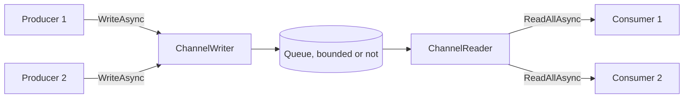

Part 2 of the course is about moving data between concurrent pieces of code. Lesson 3 showed what a single `await` does; now there are producers and consumers running at the same time, at different speeds, and the questions change. What happens when the producer is faster than the consumer? Who notices when one side fails? What stops the other side when one of them gives up?

.NET has four answers, and the next four lessons take them one at a time: channels here, TPL Dataflow in lesson 7, Rx.NET in lesson 8, and `IAsyncEnumerable` with a comparison of all four in lesson 9. A [channel](https://learn.microsoft.com/dotnet/core/extensions/channels) is the simplest: a thread-safe queue with an asynchronous writer at one end and an asynchronous reader at the other. If you know Java, it is a `BlockingQueue` whose `put` and `take` don't block a thread. If you know Reactor, the [Spring Boot, Spring Cloud and Reactor course](../../spring-cloud-reactor/03-reactor-under-the-hood/#backpressure) shows the same problem from the other side, with demand signals instead of a queue.

Guitar Alchemist uses channels in two places, and both are good case studies: they work when everything goes well, and they hang or keep working for nobody when something doesn't.

GA links point to commit [`a826864`](https://github.com/GuitarAlchemist/ga/tree/a826864f3a012cad88e415954bf57eca0ce12aa6); runtime links point to commit [`4271d88`](https://github.com/dotnet/runtime/tree/4271d88e0aebf3d04f188f1334c2220d80555ef6) of `dotnet/runtime`, tagged `v10.0.12`.

## Running the lesson's program

```bash
bash code/csharp-advanced/check.sh                                   # every lesson, compared with expected/
dotnet run --project code/csharp-advanced/Advanced -c Release -- l6  # this lesson only, after check.sh
```

The code is [`Advanced/Lesson6.cs`](https://github.com/spareilleux/learn/blob/b4d713f86711b770a75d7504f334c5871c95f820/code/csharp-advanced/Advanced/Lesson6.cs). Every output below comes from [`expected/l6.txt`](https://github.com/spareilleux/learn/blob/b4d713f86711b770a75d7504f334c5871c95f820/code/csharp-advanced/expected/l6.txt), compared on Linux, Windows and macOS. Concurrent programs are hard to make deterministic, so the program never relies on timing to decide what it prints: it holds a task with a `TaskCompletionSource`, waits for a state that can't change any more, or prints a comparison instead of a count. The few lines that depend on the machine start with `# ` and aren't compared.

## A queue with two ends

[`Channel<T>`](https://learn.microsoft.com/dotnet/api/system.threading.channels.channel-1) is only a pair: a [`ChannelWriter<T>`](https://learn.microsoft.com/dotnet/api/system.threading.channels.channelwriter-1) and a [`ChannelReader<T>`](https://learn.microsoft.com/dotnet/api/system.threading.channels.channelreader-1). You hand the writer to the code that produces and the reader to the code that consumes, so neither can do the other's job. The static factory methods of [`Channel`](https://learn.microsoft.com/dotnet/api/system.threading.channels.channel) choose the implementation from the options you pass:

```text
== Which channel you get
CreateUnbounded<int>()                       UnboundedChannel<T>                  CanCount True, CanPeek True
CreateUnbounded<int>(SingleReader = true)    SingleConsumerUnboundedChannel<T>    CanCount False, CanPeek True
CreateBounded<int>(10)                       BoundedChannel<T>                    CanCount True, CanPeek True
CreateBounded<int>(10, SingleReader = true)  BoundedChannel<T>                    CanCount True, CanPeek True
CreateUnboundedPrioritized<int>()            UnboundedPrioritizedChannel<T>       CanCount True, CanPeek True
```



- **Unbounded** channels accept every write immediately. The queue grows as long as the consumer is slower.
- **Bounded** channels have a capacity, and a policy for when it is reached.
- `SingleReader = true` promises that only one consumer reads at a time. An unbounded channel gets a lighter implementation in return, `SingleConsumerUnboundedChannel`, which can't count its items: `Reader.Count` throws `NotSupportedException`, which matters for the GA case study below. A bounded channel keeps the same implementation.
- [`CreateUnboundedPrioritized`](https://learn.microsoft.com/dotnet/api/system.threading.channels.channel.createunboundedprioritized), added in .NET 9, returns items in the order of a comparer instead of the order written.

The options are promises, not checks: a `SingleReader` channel read by two consumers at once isn't detected, it just misbehaves.

## Backpressure: a bounded channel makes the writer wait

A bounded channel of capacity 2, in the default mode, [`BoundedChannelFullMode.Wait`](https://learn.microsoft.com/dotnet/api/system.threading.channels.boundedchannelfullmode). The program writes four chords without reading, then reads one:

```csharp
static async Task Backpressure()
{
    Title("Backpressure: a bounded channel of capacity 2 makes the writer wait");
    var channel = Channel.CreateBounded<string>(new BoundedChannelOptions(2) { FullMode = BoundedChannelFullMode.Wait });
    var writes = new List<Task>();
    foreach (var chord in Progression)
    {
        var write = channel.Writer.WriteAsync(chord);
        Line($"WriteAsync({chord}): completed {write.IsCompleted}, Reader.Count {channel.Reader.Count}");
        writes.Add(write.AsTask());
    }

    Line($"TryWrite(Dm7): {channel.Writer.TryWrite("Dm7")}");
    var first = await channel.Reader.ReadAsync();
    Line($"ReadAsync: {first}; Reader.Count {channel.Reader.Count}, Cmaj7 moved in from the waiting writer");
    await writes[2];
    Line($"WriteAsync(Cmaj7) has completed; WriteAsync(A7) still waiting {!writes[3].IsCompleted}");

    var rest = new List<string> { first };
    for (var i = 1; i < Progression.Length; i++)
    {
        rest.Add(await channel.Reader.ReadAsync());
    }

    await Task.WhenAll(writes);
    Line($"the reader got {string.Join(" ", rest)}, in the order written");
}
```

```text
== Backpressure: a bounded channel of capacity 2 makes the writer wait
WriteAsync(Dm7): completed True, Reader.Count 1
WriteAsync(G7): completed True, Reader.Count 2
WriteAsync(Cmaj7): completed False, Reader.Count 2
WriteAsync(A7): completed False, Reader.Count 2
TryWrite(Dm7): False
ReadAsync: Dm7; Reader.Count 2, Cmaj7 moved in from the waiting writer
WriteAsync(Cmaj7) has completed; WriteAsync(A7) still waiting True
the reader got Dm7 G7 Cmaj7 A7, in the order written
```

- The first two writes completed synchronously. The next two returned a `ValueTask` that isn't completed: the writer awaits it, and no thread is blocked while it waits.
- `TryWrite` is the synchronous version, and returns `false` when the channel is full.
- Reading `Dm7` made room, and the channel immediately moved the first waiting writer's item in: the count went back to 2, and `WriteAsync(Cmaj7)` completed. `A7` still waits for the next read.
- The reader got the chords in the order written: the waiting writers form a queue too.

That is *backpressure*: a slow consumer slows the producer down, instead of letting items pile up in memory. With `IAsyncEnumerable`, which lesson 9 covers, it is automatic because the consumer pulls. With a channel, it is a choice you make when you create it.

## When the channel is full

`Wait` isn't the only policy. The three others never make the writer wait, and drop an item instead. The program writes 1 to 6 into a channel of capacity 3 with `TryWrite`, in each mode, and passes the `itemDropped` callback of [`Channel.CreateBounded`](https://learn.microsoft.com/dotnet/api/system.threading.channels.channel.createbounded#system-threading-channels-channel-createbounded-1(system-threading-channels-boundedchanneloptions-system-action((-0)))) to see what goes away:

```text
== A full channel: BoundedChannelFullMode, capacity 3, TryWrite 1 to 6
Wait         TryWrite true  true  true  false false false reader gets 1 2 3  dropped -
DropNewest   TryWrite true  true  true  true  true  true  reader gets 1 2 6  dropped 3 4 5
DropOldest   TryWrite true  true  true  true  true  true  reader gets 4 5 6  dropped 1 2 3
DropWrite    TryWrite true  true  true  true  true  true  reader gets 1 2 3  dropped 4 5 6
```

- **`Wait`** refuses the write: `TryWrite` returns `false`, and `WriteAsync` would wait.
- **`DropNewest`** removes the most recent item *already in the channel*, and accepts the new one: 3, 4 and 5 were each written, then dropped by the next write.
- **`DropOldest`** removes the item that has waited longest: the reader gets the three latest values. That's the mode for "latest readings only", like the position of a slider.
- **`DropWrite`** throws away the item being written, and the reader keeps the first three.

In all three dropping modes, `TryWrite` returns `true` for an item that was dropped. The [channel's source](https://github.com/dotnet/runtime/blob/4271d88e0aebf3d04f188f1334c2220d80555ef6/src/libraries/System.Threading.Channels/src/System/Threading/Channels/BoundedChannel.cs#L418-L442) says so in a comment: "Just ignore the item being added but say we added it". The Reactor course [ran into the same trap](../../spring-cloud-reactor/03-reactor-under-the-hood/#backpressure) with `DropWrite`. The `itemDropped` callback, available since .NET 6, is the only place where you learn about the loss; the channel calls it after releasing its lock, so the callback may take its time without blocking other writers.

## Completion and errors

A producer signals the end with [`Writer.Complete()`](https://learn.microsoft.com/dotnet/api/system.threading.channels.channelwriter-1.complete). Completing doesn't empty the channel: the reader drains what was written first.

```text
== Completion: the reader drains what was written, then sees the end
after Complete(): Reader.Count 2, Reader.Completion.IsCompleted False
ReadAllAsync: Dm7 G7; Reader.Completion RanToCompletion
WaitToReadAsync: False, TryRead: False
```

`Reader.Completion` is a task that completes once the channel is both completed and empty, and `WaitToReadAsync` then returns `false`, which is how `ReadAllAsync` knows when to stop ([`ChannelReader.cs#L103-L112`](https://github.com/dotnet/runtime/blob/4271d88e0aebf3d04f188f1334c2220d80555ef6/src/libraries/System.Threading.Channels/src/System/Threading/Channels/ChannelReader.cs#L103-L112)).

A producer that fails can pass its exception to `Complete`:

```text
== Completion with an error
ReadAllAsync: Dm7 G7, then InvalidOperationException: the chord source failed
ReadAsync: ChannelClosedException: The channel has been closed. (inner InvalidOperationException: the chord source failed)
Reader.Completion: Faulted, InvalidOperationException: the chord source failed
WriteAsync after Complete: ChannelClosedException: The channel has been closed. (inner InvalidOperationException: the chord source failed)
TryWrite after Complete: False, TryComplete: False, Complete: ChannelClosedException: The channel has been closed.
```

- The reader still gets the two chords written before the failure.
- `await foreach` over `ReadAllAsync` then throws the producer's own `InvalidOperationException`. A direct `ReadAsync` throws a `ChannelClosedException` that wraps it. The difference comes from the source: `WaitToReadAsync`, which `ReadAllAsync` uses, returns a task faulted with the stored exception ([`UnboundedChannel.cs#L159-L166`](https://github.com/dotnet/runtime/blob/4271d88e0aebf3d04f188f1334c2220d80555ef6/src/libraries/System.Threading.Channels/src/System/Threading/Channels/UnboundedChannel.cs#L159-L166)), while `ReadAsync` wraps it ([`ChannelUtilities.cs#L361-L364`](https://github.com/dotnet/runtime/blob/4271d88e0aebf3d04f188f1334c2220d80555ef6/src/libraries/System.Threading.Channels/src/System/Threading/Channels/ChannelUtilities.cs#L361-L364)). Catch both when you read both ways.
- Writing to a completed channel throws `ChannelClosedException`; `TryWrite` returns `false`.
- `Complete` a second time throws, and `TryComplete` returns `false`. When several pieces of code may complete the same channel, the producer and an error handler for instance, use `TryComplete`.

The rule to take away: **if nobody calls `Complete`, the reader waits forever.** A channel doesn't know that its producer has crashed. Both GA case studies below come down to this.

## Several producers, several consumers

Three producers write 100 items each into a bounded channel of capacity 2, and two consumers read it:

```csharp
static async Task ProducersAndConsumers()
{
    Title("Three producers, two consumers, one bounded channel");
    var channel = Channel.CreateBounded<(int Producer, int Index)>(new BoundedChannelOptions(2) { SingleReader = false, SingleWriter = false });
    var received = new List<(int Consumer, int Producer, int Index)>();

    var consumers = Enumerable.Range(1, 2).Select(consumer => Task.Run(async () =>
    {
        await foreach (var (producer, index) in channel.Reader.ReadAllAsync())
        {
            lock (received)
            {
                received.Add((consumer, producer, index));
            }
        }
    })).ToList();

    var producers = Enumerable.Range(1, 3).Select(producer => Task.Run(async () =>
    {
        for (var index = 0; index < 100; index++)
        {
            await channel.Writer.WriteAsync((producer, index));
        }
    })).ToList();

    try
    {
        await Task.WhenAll(producers);
        channel.Writer.Complete();
    }
    catch (Exception e)
    {
        channel.Writer.Complete(e);
    }

    await Task.WhenAll(consumers);

    var everyItemOnce = received.Select(r => (r.Producer, r.Index)).Distinct().Count() == 300 && received.Count == 300;
    var inOrderPerProducerAndConsumer = received.GroupBy(r => (r.Consumer, r.Producer)).All(g => g.Select(r => r.Index).SequenceEqual(g.Select(r => r.Index).Order()));
    Line($"300 items written, received {received.Count}, each exactly once: {everyItemOnce}");
    Line($"each consumer saw each producer's items in the order written: {inOrderPerProducerAndConsumer}");
    Machine($"consumer 1 read {received.Count(r => r.Consumer == 1)}, consumer 2 read {received.Count(r => r.Consumer == 2)}");
}
```

```text
== Three producers, two consumers, one bounded channel
300 items written, received 300, each exactly once: True
each consumer saw each producer's items in the order written: True
```

Every item arrived exactly once, and within each consumer, each producer's items kept their order. The split between the consumers depends on scheduling; on the author's machine:

```text
# consumer 1 read 91, consumer 2 read 209
```

Look at how the writer is completed: after *all* producers have finished, and with the exception if one of them failed. A `Task.WhenAll(producers)` without that `try`/`catch` would leave the consumers waiting whenever a producer throws.

## Cancellation

`WriteAsync`, `ReadAsync` and `WaitToReadAsync` accept a [`CancellationToken`](https://learn.microsoft.com/dotnet/api/system.threading.cancellationtoken), which cancels the *wait*, not the channel:

```text
== Cancellation: a write waiting for room, a read waiting for an item
WriteAsync(G7) cancelled: OperationCanceledException, e.CancellationToken == token True
Reader.Count 1: G7 was not written; the reader gets Dm7
ReadAsync on an empty channel, cancelled: OperationCanceledException: The operation was canceled.
the channel still works: TryWrite(Cmaj7) True, TryRead Cmaj7
```

The cancelled write didn't put `G7` in the channel, the exception carries the token that cancelled it (lesson 3 showed why that's useful), and the channel went on working. To stop a whole pipeline, you still need to cancel the producers and complete the writer yourself.

## Case study: GA's voicing generator

GA generates every guitar voicing of a fretboard by sliding a window of a few frets along the neck. [`VoicingGenerator.GenerateAllVoicingsAsync`](https://github.com/GuitarAlchemist/ga/blob/a826864f3a012cad88e415954bf57eca0ce12aa6/Common/GA.Domain.Services/Fretboard/Voicings/Generation/VoicingGenerator.cs#L180-L249) does it in parallel: `Parallel.ForEachAsync` computes the windows and writes each window's list of voicings to an unbounded channel, and the method, an async iterator, reads the channel and yields the voicings to its caller.

The project that contains it depends on ONNX Runtime, ILGPU and a dozen packages, too heavy to build in this course's CI. The program reproduces the method's *shape* line for line instead, with the voicings replaced by strings, and a `WindowProbe` that counts the windows generated and can make one fail ([`GaShapeVoicings`](https://github.com/spareilleux/learn/blob/b4d713f86711b770a75d7504f334c5871c95f820/code/csharp-advanced/Advanced/Lesson6.cs#L239-L273)):

```csharp
// The shape of GA's VoicingGenerator.GenerateAllVoicingsAsync, parallel branch (VoicingGenerator.cs L180-L249):
// parallel producers write whole windows to an unbounded channel from Task.Run, the writer is completed after the
// loop, and the producer task is awaited after the reader's loop. The windows' contents are replaced by strings.
public static async IAsyncEnumerable<string> GaShapeVoicings(int windows, WindowProbe probe,
    [EnumeratorCancellation] CancellationToken cancellationToken = default)
{
    var channel = Channel.CreateUnbounded<(int WindowIndex, List<string> Voicings)>(new()
    {
        SingleReader = true,
        SingleWriter = false
    });
    probe.Reader = channel.Reader;

    var producerTask = Task.Run(async () =>
    {
        await Parallel.ForEachAsync(
            Enumerable.Range(0, windows),
            new ParallelOptions { MaxDegreeOfParallelism = 4, CancellationToken = cancellationToken },
            async (window, ct) =>
            {
                var voicings = probe.Generate(window);
                await channel.Writer.WriteAsync((window, voicings), ct);
            });

        channel.Writer.Complete();
    }, cancellationToken);
    probe.Producer = producerTask;

    await foreach (var result in channel.Reader.ReadAllAsync(cancellationToken))
    {
        foreach (var voicing in result.Voicings)
        {
            yield return voicing;
        }
    }

    await producerTask;
}
```

The two `probe.` assignments only let the program look at the channel and the producer task from outside. The rest is GA's structure.

### The consumer stops early

GA's own callers stop early. The command-line tool breaks out of the loop once it has printed enough voicings ([`FretboardVoicingsCLI/Program.cs#L577-L580`](https://github.com/GuitarAlchemist/ga/blob/a826864f3a012cad88e415954bf57eca0ce12aa6/Demos/Music%20Theory/FretboardVoicingsCLI/Program.cs#L577-L580)), and the usage examples chain `.Take(100)` ([`USAGE_EXAMPLES.md#L31-L41`](https://github.com/GuitarAlchemist/ga/blob/a826864f3a012cad88e415954bf57eca0ce12aa6/Demos/Music%20Theory/FretboardVoicingsCLI/USAGE_EXAMPLES.md#L31-L41)). The program reads one voicing of 24 windows, then breaks:

```text
== GA's voicing generator shape: the consumer stops after one voicing
one voicing read, then break
producer completed within 10 s: True; windows generated 24 of 24, left unread in the channel 23
```

Leaving an `await foreach` disposes the iterator, which ends the method at its current `yield return`: the final `await producerTask` never runs. Nothing tells the producers. They generated all 24 windows and wrote them into an unbounded channel that nobody will read. The work is wasted, and every voicing stays in memory until the channel itself is collected. In GA, where a window holds thousands of voicings, that's the full CPU and memory cost of the generation for a caller that wanted a hundred.

### A window fails

Now window 5 throws:

```text
== GA's voicing generator shape: window 5 throws
producer: faulted with InvalidOperationException: window 5 failed
consumer finished within 1 s: False
```

`Parallel.ForEachAsync` stops starting windows and rethrows, the producer task faults, and `channel.Writer.Complete()`, on the next line, is never reached. The consumer has read the windows written before the failure, and then waits for a completion that will never come. It doesn't fail: it hangs, and the exception sits unobserved in a task that nobody awaits.

### Does the order survive?

The method's comment says "Use channels for parallel processing with ordering preserved" ([`VoicingGenerator.cs#L182`](https://github.com/GuitarAlchemist/ga/blob/a826864f3a012cad88e415954bf57eca0ce12aa6/Common/GA.Domain.Services/Fretboard/Voicings/Generation/VoicingGenerator.cs#L182)). Windows run in parallel and are written when they finish, so the channel holds them in completion order. The program holds window 0 until the reader has received something:

```text
== GA's voicing generator shape: does window order survive?
window 0 held until the reader got something: first voicing from window 0 False, 8 windows read True
```

The first voicing came from another window. On the author's machine, the order read was:

```text
# order read: w2-v0 w1-v0 w3-v0 w4-v0 w5-v0 w0-v0 w6-v0 w7-v0
```

The comments further down in the same method say as much ("We lose strict fret-order, but indexing doesn't care about order", [`#L219-L231`](https://github.com/GuitarAlchemist/ga/blob/a826864f3a012cad88e415954bf57eca0ce12aa6/Common/GA.Domain.Services/Fretboard/Voicings/Generation/VoicingGenerator.cs#L219-L231)): the code is right, the summary comment isn't. The window index is written to the channel with each list and never used; it would be the key to restore the order if a caller needed it.

### The fix

Three changes, all in the method ([`FixedVoicings`](https://github.com/spareilleux/learn/blob/b4d713f86711b770a75d7504f334c5871c95f820/code/csharp-advanced/Advanced/Lesson6.cs#L277-L324)):

```csharp
// The same generator with a bounded channel, the error passed to the reader, and the producers stopped
// and awaited whenever the reader stops: at the end, on an error, or when the consumer leaves early
public static async IAsyncEnumerable<string> FixedVoicings(int windows, WindowProbe probe, bool cancelInFinally = true,
    [EnumeratorCancellation] CancellationToken cancellationToken = default)
{
    using var cts = CancellationTokenSource.CreateLinkedTokenSource(cancellationToken);
    var channel = Channel.CreateBounded<(int WindowIndex, List<string> Voicings)>(new BoundedChannelOptions(4)
    {
        SingleReader = true,
        SingleWriter = false
    });
    probe.Reader = channel.Reader;

    var producerTask = Task.Run(async () =>
    {
        try
        {
            await Parallel.ForEachAsync(
                Enumerable.Range(0, windows),
                new ParallelOptions { MaxDegreeOfParallelism = 4, CancellationToken = cts.Token },
                async (window, ct) => await channel.Writer.WriteAsync((window, probe.Generate(window)), ct));
            channel.Writer.Complete();
        }
        catch (Exception e)
        {
            channel.Writer.Complete(e); // the reader throws it instead of waiting forever
        }
    });
    probe.Producer = producerTask;

    try
    {
        await foreach (var result in channel.Reader.ReadAllAsync(cts.Token))
        {
            foreach (var voicing in result.Voicings)
            {
                yield return voicing;
            }
        }
    }
    finally
    {
        if (cancelInFinally)
        {
            cts.Cancel(); // the reader stopped: stop the producers
        }

        await producerTask; // never throws: its errors went to the channel
    }
}
```

- **A bounded channel.** At most four windows wait for the reader; a slow consumer now slows the generation down.
- **The producer passes its exception to the channel**, so the reader throws it instead of waiting.
- **A `finally` around the reading loop** cancels the producers and waits for them, whether the reader finished, failed or was abandoned. A `finally` in an async iterator runs when the consumer disposes it, which `await foreach` does on `break`, on an exception, and at the end.

```text
== Fixed generator: the consumer stops after one voicing
one voicing read, then break
producer already completed when the loop exited: True, windows generated fewer than 24: True
```

```text
== Fixed generator: window 5 throws
consumer: faulted with InvalidOperationException: window 5 failed
```

The early exit now stops the producers before the loop returns, after 8 windows on the author's machine, and the failure reaches the consumer as the original exception.

## Case study: GA's index command

[`IndexVoicingsCommand`](https://github.com/GuitarAlchemist/ga/blob/a826864f3a012cad88e415954bf57eca0ce12aa6/GaCLI/Commands/IndexVoicingsCommand.cs#L158-L251) stores voicings in MongoDB and Qdrant. Parallel producers compute each voicing's entity and write it to a bounded channel in `Wait` mode; a single consumer reads it and upserts batches of 1,000. The channel is bounded and in `Wait` mode, which is right: the database sets the pace. Each side catches its own exceptions and logs them. The program keeps that structure with batches of 4 and a capacity of 8 ([`GaShapeIndex`](https://github.com/spareilleux/learn/blob/b4d713f86711b770a75d7504f334c5871c95f820/code/csharp-advanced/Advanced/Lesson6.cs#L427-L478)), and makes the first upsert fail, as a database that is down would:

```text
== GA's index command shape: the first batch upsert fails
command finished within 1 s: False
upserts tried 1, Reader.Count 8 (capacity 8), log: Error in DB Writer Consumer: database unavailable
```

The consumer logged the error and returned, as its `catch` says. The producers didn't learn about it: they filled the channel to its capacity of 8, and the next writers wait for room that no reader will ever make. `Parallel.ForEachAsync` never finishes, the command never reaches `Writer.Complete()`, and the progress bar stops moving forever. The per-item `catch` in the producers can't help, because nothing throws: a write that waits isn't an error.

The fix is to let the consumer's failure travel to the writers ([`FixedIndex`](https://github.com/spareilleux/learn/blob/b4d713f86711b770a75d7504f334c5871c95f820/code/csharp-advanced/Advanced/Lesson6.cs#L481-L525)):

```csharp
catch (Exception ex)
{
    channel.Writer.TryComplete(ex); // writers waiting for room get a ChannelClosedException
    throw;
}
```

Completing the channel from the consumer's side fails every waiting and future write with a `ChannelClosedException`. The producers stop, the command catches that exception, and awaiting the consumer rethrows the real cause:

```text
== Fixed index command: the first batch upsert fails
command: faulted with IOException: database unavailable, upserts tried 1
```

## If you know Spring and Reactor

Reactor doesn't need a queue between two stages: a subscriber tells the publisher how many items it wants, with `request(n)`. The [Reactor course's backpressure section](../../spring-cloud-reactor/03-reactor-under-the-hood/#backpressure) shows those signals. Channels get the same effect by making the writer wait. When a source can't slow down, both have strategies, and they map closely:

| Channels | Reactor | Java |
|---|---|---|
| `Channel.CreateBounded(n)`, `Wait` mode | demand with `request(n)`; `limitRate(n)` to batch it | `ArrayBlockingQueue.put`, which blocks a thread |
| `Channel.CreateUnbounded()` | `onBackpressureBuffer()` | `LinkedBlockingQueue` |
| `DropWrite` | `onBackpressureDrop()`, or `onBackpressureBuffer(n, onOverflow, BufferOverflowStrategy.DROP_LATEST)` | `offer` returning `false` |
| `DropOldest` | `onBackpressureBuffer(n, onOverflow, BufferOverflowStrategy.DROP_OLDEST)`; `onBackpressureLatest()` for a capacity of 1 | — |
| `DropNewest` | no direct equivalent | — |
| `itemDropped` callback | the `onOverflow` or `onBackpressureDrop(Consumer)` callback | — |
| no error mode: a full channel waits or drops | `BufferOverflowStrategy.ERROR` signals an overflow error | `add` throws `IllegalStateException` |
| `Writer.Complete(exception)` | `onError`, which ends the sequence | none: a poison-pill item by convention |
| `Reader.Completion` | the terminal signal, `doOnTerminate` | — |

The names come from the [`Flux`](https://projectreactor.io/docs/core/release/api/reactor/core/publisher/Flux.html) and [`BufferOverflowStrategy`](https://projectreactor.io/docs/core/release/api/reactor/core/publisher/BufferOverflowStrategy.html) Javadoc: `DROP_LATEST` drops the element that just arrived, like `DropWrite`, not the newest element already buffered. The GA bugs above don't happen in Reactor as such, because an error travels down the pipeline and a cancellation travels up it without any code of yours. They come back as soon as a Reactor pipeline hands its items to a hand-written queue.

## Exercises

1. A bounded channel of capacity 2 in `DropOldest` mode receives `Dm7`, `G7`, `Cmaj7` and `A7` with `TryWrite`, then is completed. What does the reader get, and what goes to the `itemDropped` callback?
2. GA's index command collects 1,000 items before each upsert, even when the producers are slow, so the first rows reach the database late. Write `ReadBatchesAsync(reader, max)`, an async iterator that waits for at least one item, then takes whatever is already in the channel, up to `max`, and yields that batch.
3. In `FixedVoicings`, remove the `cts.Cancel()` from the `finally` block, keep the `await producerTask`, and leave the loop after one voicing. What happens, and why?

<details>
<summary>Solutions</summary>

1. The reader gets `Cmaj7 A7`, and the callback receives `Dm7` then `G7`: each write beyond the capacity pushes out the item that has waited longest.

    ```text
    1. DropOldest, capacity 2: reader gets Cmaj7 A7, dropped Dm7 G7
    ```

2. `WaitToReadAsync` waits for the first item, and `TryRead` takes the others without waiting ([`ReadBatchesAsync`](https://github.com/spareilleux/learn/blob/b4d713f86711b770a75d7504f334c5871c95f820/code/csharp-advanced/Advanced/Lesson6.cs#L579-L592)):

    ```csharp
    // Exercise 2: waits for at least one item, then takes what is already there, up to max
    public static async IAsyncEnumerable<List<T>> ReadBatchesAsync<T>(ChannelReader<T> reader, int max,
        [EnumeratorCancellation] CancellationToken cancellationToken = default)
    {
        while (await reader.WaitToReadAsync(cancellationToken))
        {
            var batch = new List<T>(max);
            while (batch.Count < max && reader.TryRead(out var item))
            {
                batch.Add(item);
            }

            yield return batch;
        }
    }
    ```

    With ten items already in the channel and a maximum of 4:

    ```text
    2. ReadBatchesAsync(max 4) over 1 to 10: [1 2 3 4] [5 6 7 8] [9 10]
    ```

    When the producers are slow, the batches get smaller and leave sooner; when they are fast, the batches fill up. The consumer never waits for a full batch.

3. Leaving the loop disposes the iterator, and the `finally` block awaits a producer task that never completes. The producers keep writing into the bounded channel until it is full, then wait for room; nobody reads any more, so they wait forever, and so does `DisposeAsync`. The consumer's `break` hangs. The bounded channel fixed the memory problem, and without the cancellation it turned the leak into a deadlock.

    ```text
    3. without cts.Cancel() in finally, leaving after one voicing: DisposeAsync completed within 1 s False, Reader.Count 4 (capacity 4)
    ```

</details>

## Key takeaways

- A channel is a thread-safe queue with an asynchronous writer and reader. Choose unbounded or bounded, and for bounded channels, what a full channel does.
- A bounded channel in `Wait` mode gives you backpressure: the writer awaits, without blocking a thread, until the reader makes room.
- The dropping modes make `TryWrite` return `true` for dropped items; pass an `itemDropped` callback if losing data must be noticed.
- `Complete` doesn't discard items. `Complete(exception)` makes `ReadAllAsync` rethrow that exception after the remaining items, and `ReadAsync` throw a `ChannelClosedException` around it.
- If nobody completes the writer, the reader waits forever: complete it in every path, including failures, and with `TryComplete` when several paths might.
- A consumer that stops, by `break`, by an exception or by `Take`, doesn't stop the producers. Cancel them in a `finally`, and complete the channel from the consumer's side when it fails.
- `SingleReader` and `SingleWriter` are promises that buy a faster implementation; the unbounded single-reader channel can't count its items.

## Sources

- Microsoft Learn: [Channels](https://learn.microsoft.com/dotnet/core/extensions/channels), [`Channel.CreateBounded`](https://learn.microsoft.com/dotnet/api/system.threading.channels.channel.createbounded), [`BoundedChannelFullMode`](https://learn.microsoft.com/dotnet/api/system.threading.channels.boundedchannelfullmode), [`ChannelWriter<T>.TryComplete`](https://learn.microsoft.com/dotnet/api/system.threading.channels.channelwriter-1.trycomplete), [`Parallel.ForEachAsync`](https://learn.microsoft.com/dotnet/api/system.threading.tasks.parallel.foreachasync).
- Stephen Toub, [An Introduction to System.Threading.Channels](https://devblogs.microsoft.com/dotnet/an-introduction-to-system-threading-channels/), on the .NET blog.
- dotnet/runtime at `v10.0.12` (commit `4271d88`): [`BoundedChannel.cs`](https://github.com/dotnet/runtime/blob/4271d88e0aebf3d04f188f1334c2220d80555ef6/src/libraries/System.Threading.Channels/src/System/Threading/Channels/BoundedChannel.cs#L418-L442), [`UnboundedChannel.cs`](https://github.com/dotnet/runtime/blob/4271d88e0aebf3d04f188f1334c2220d80555ef6/src/libraries/System.Threading.Channels/src/System/Threading/Channels/UnboundedChannel.cs#L159-L166), [`ChannelUtilities.cs`](https://github.com/dotnet/runtime/blob/4271d88e0aebf3d04f188f1334c2220d80555ef6/src/libraries/System.Threading.Channels/src/System/Threading/Channels/ChannelUtilities.cs#L361-L364), [`ChannelReader.cs`](https://github.com/dotnet/runtime/blob/4271d88e0aebf3d04f188f1334c2220d80555ef6/src/libraries/System.Threading.Channels/src/System/Threading/Channels/ChannelReader.cs#L103-L112).
- Reactor: [`Flux`](https://projectreactor.io/docs/core/release/api/reactor/core/publisher/Flux.html) and [`BufferOverflowStrategy`](https://projectreactor.io/docs/core/release/api/reactor/core/publisher/BufferOverflowStrategy.html) Javadoc, [Reactor reference guide](https://projectreactor.io/docs/core/release/reference/).
- Guitar Alchemist at `a826864`: [`VoicingGenerator.cs`](https://github.com/GuitarAlchemist/ga/blob/a826864f3a012cad88e415954bf57eca0ce12aa6/Common/GA.Domain.Services/Fretboard/Voicings/Generation/VoicingGenerator.cs#L180-L249), [`IndexVoicingsCommand.cs`](https://github.com/GuitarAlchemist/ga/blob/a826864f3a012cad88e415954bf57eca0ce12aa6/GaCLI/Commands/IndexVoicingsCommand.cs#L158-L251), [`FretboardVoicingsCLI/Program.cs`](https://github.com/GuitarAlchemist/ga/blob/a826864f3a012cad88e415954bf57eca0ce12aa6/Demos/Music%20Theory/FretboardVoicingsCLI/Program.cs#L577-L580).
