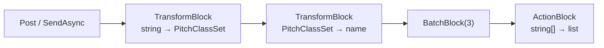

A channel is one queue. As soon as a pipeline has several stages, each with its own degree of parallelism, its own buffer and its own batching, you write the same plumbing again and again: a channel per stage, a loop per consumer, a `Complete` per writer, and an error path for each. [TPL Dataflow](https://learn.microsoft.com/dotnet/standard/parallel-programming/dataflow-task-parallel-library) packages that plumbing as *blocks* that you link together. It is older than channels, since it first shipped as a NuGet package for .NET Framework 4.5, and it is still the most complete pipeline library in .NET.

This lesson builds a small pipeline over Guitar Alchemist's [`PitchClassSet`](https://github.com/GuitarAlchemist/ga/blob/a826864f3a012cad88e415954bf57eca0ce12aa6/Common/GA.Domain.Core/Theory/Atonal/PitchClassSet.cs), checks what each option does, then looks at GA's own Dataflow demo and at the index command of lesson 6 rebuilt with blocks. The rules that matter most are about failure: where an exception goes, and where it doesn't.

GA links point to commit [`a826864`](https://github.com/GuitarAlchemist/ga/tree/a826864f3a012cad88e415954bf57eca0ce12aa6); runtime links point to commit [`4271d88`](https://github.com/dotnet/runtime/tree/4271d88e0aebf3d04f188f1334c2220d80555ef6) of `dotnet/runtime`, tagged `v10.0.12`.

## Running the lesson's program

```bash
bash code/csharp-advanced/check.sh                                   # every lesson, compared with expected/
dotnet run --project code/csharp-advanced/Advanced -c Release -- l7  # this lesson only, after check.sh
```

The code is [`Advanced/Lesson7.cs`](https://github.com/spareilleux/learn/blob/b4d713f86711b770a75d7504f334c5871c95f820/code/csharp-advanced/Advanced/Lesson7.cs), and its output is compared with [`expected/l7.txt`](https://github.com/spareilleux/learn/blob/b4d713f86711b770a75d7504f334c5871c95f820/code/csharp-advanced/expected/l7.txt) on three operating systems.

```text
== Where the types come from
TransformBlock<,>: System.Threading.Tasks.Dataflow, in the shared framework True
```

The `System.Threading.Tasks.Dataflow` assembly ships in the .NET shared framework, so a .NET 10 project needs no package for it. GA's two demo projects that use Dataflow still reference the [`System.Threading.Tasks.Dataflow`](https://www.nuget.org/packages/System.Threading.Tasks.Dataflow) package, version 9.0.10 ([`PerformanceOptimizationDemo.csproj#L18`](https://github.com/GuitarAlchemist/ga/blob/a826864f3a012cad88e415954bf57eca0ce12aa6/Demos/Performance/PerformanceOptimizationDemo/PerformanceOptimizationDemo.csproj#L18)), an older copy of what the framework already provides. In a new `net10.0` project on the author's machine, that reference restores with warning NU1510, "PackageReference System.Threading.Tasks.Dataflow will not be pruned. Consider removing this package from your dependencies, as it is likely unnecessary", and the program still loads the framework's `System.Threading.Tasks.Dataflow.dll` from `shared/Microsoft.NETCore.App/10.0.12`.

## Blocks and links

A block is a small actor with an input buffer, some processing, and an output buffer. The ones this lesson uses:

| Block | In | Out | Does |
|---|---|---|---|
| [`TransformBlock<TIn, TOut>`](https://learn.microsoft.com/dotnet/api/system.threading.tasks.dataflow.transformblock-2) | one item | one item | runs a function, synchronous or `async` |
| [`TransformManyBlock<TIn, TOut>`](https://learn.microsoft.com/dotnet/api/system.threading.tasks.dataflow.transformmanyblock-2) | one item | zero or more items | `SelectMany` as a block |
| [`BatchBlock<T>`](https://learn.microsoft.com/dotnet/api/system.threading.tasks.dataflow.batchblock-1) | items | arrays of `n` items | groups; the last batch may be shorter |
| [`BufferBlock<T>`](https://learn.microsoft.com/dotnet/api/system.threading.tasks.dataflow.bufferblock-1) | items | the same items | a queue you can link |
| [`ActionBlock<T>`](https://learn.microsoft.com/dotnet/api/system.threading.tasks.dataflow.actionblock-1) | items | nothing | the end of a pipeline |

`LinkTo` connects a source to a target, and [`DataflowLinkOptions.PropagateCompletion`](https://learn.microsoft.com/dotnet/api/system.threading.tasks.dataflow.dataflowlinkoptions.propagatecompletion) makes the target complete when the source does. The pipeline parses strings of pitch classes, names each set with its label in Allen Forte's catalog, groups the names by three and writes the groups:



```csharp
static async Task Pipeline()
{
    Title("A pipeline: parse, describe, batch by 3, write");
    var parse = new TransformBlock<string, PitchClassSet>(s => PitchClassSet.Parse(s));
    var describe = new TransformBlock<PitchClassSet, string>(Named);
    var batch = new BatchBlock<string>(3);
    var written = new List<string>();
    var write = new ActionBlock<string[]>(names => written.Add($"[{string.Join(", ", names)}]"));

    parse.LinkTo(describe, Propagate);
    describe.LinkTo(batch, Propagate);
    batch.LinkTo(write, Propagate);

    foreach (var chord in Progression.Concat(Progression.Take(3)))
    {
        parse.Post(chord);
    }

    parse.Complete();
    await write.Completion;
    foreach (var line in written)
    {
        Line(line);
    }

    Line($"Completion: parse {parse.Completion.Status}, describe {describe.Completion.Status}, batch {batch.Completion.Status}, write {write.Completion.Status}");
    var labels = Progression.Select(s => PitchClassSet.Parse(s)).Select(set => $"{set.Name}: {ProgrammaticForteCatalog.GetForteNumber(set)}");
    Line($"the same sets in GA's ProgrammaticForteCatalog: {string.Join(", ", labels)}");
}
```

```text
== A pipeline: parse, describe, batch by 3, write
[0 2 5 9 (4-26), 2 5 7 E (4-27), 0 4 7 E (4-20)]
[0 4 7 9 (4-26), 0 2 5 9 (4-26), 2 5 7 E (4-27)]
[0 4 7 E (4-20)]
Completion: parse RanToCompletion, describe RanToCompletion, batch RanToCompletion, write RanToCompletion
the same sets in GA's ProgrammaticForteCatalog: 0 2 5 9: 4-3, 2 5 7 E: 4-2, 0 4 7 E: 4-9, 0 4 7 9: 4-3
```

The progression is ii–V–I–vi in C, Dm7, G7, Cmaj7 and Am7, then its first three chords again: seven sets, so two full batches and a last one of a single set. Calling `Complete` on the first block was enough to finish the whole pipeline, one link after the other, and `await write.Completion` waited for all of it.

The labels come from GA's [`CanonicalForteCatalog`](https://github.com/GuitarAlchemist/ga/blob/a826864f3a012cad88e415954bf57eca0ce12aa6/Common/GA.Domain.Core/Theory/Atonal/CanonicalForteCatalog.cs#L3-L20): 4-26 for the minor seventh chords, 4-27 for the dominant seventh, 4-20 for the major seventh. The last line shows why the program doesn't use [`ProgrammaticForteCatalog`](https://github.com/GuitarAlchemist/ga/blob/a826864f3a012cad88e415954bf57eca0ce12aa6/Common/GA.Domain.Core/Theory/Atonal/ProgrammaticForteCatalog.cs#L5-L19), whose frozen dictionary lesson 4 measured: its `ForteNumber` values follow Rahn's ordering, and give 4-3 where Forte's table says 4-26. Its documentation calls the differences "minor"; for these chords, none of the numbers match.

## Parallelism and order

By default a block processes one item at a time. [`MaxDegreeOfParallelism`](https://learn.microsoft.com/dotnet/api/system.threading.tasks.dataflow.executiondataflowblockoptions.maxdegreeofparallelism) lets it run several, and [`EnsureOrdered`](https://learn.microsoft.com/dotnet/api/system.threading.tasks.dataflow.dataflowblockoptions.ensureordered), `true` by default, decides whether the outputs keep the order of the inputs. The program posts four items to a block with four degrees of parallelism, holds item 0 until the three others have finished, and tries to receive for half a second while item 0 still runs ([`HoldFirst`](https://github.com/spareilleux/learn/blob/b4d713f86711b770a75d7504f334c5871c95f820/code/csharp-advanced/Advanced/Lesson7.cs#L75-L133)):

```text
== MaxDegreeOfParallelism 4: items 1 to 3 have finished, item 0 is still running
EnsureOrdered = True   received while item 0 runs: nothing  then: 0 1 2 3
EnsureOrdered = False  received while item 0 runs: 1 2 3    then: 0
```

- **Ordered**, the finished items 1, 2 and 3 wait in a reordering buffer behind item 0 ([`TransformBlock.cs#L113-L118`](https://github.com/dotnet/runtime/blob/4271d88e0aebf3d04f188f1334c2220d80555ef6/src/libraries/System.Threading.Tasks.Dataflow/src/Blocks/TransformBlock.cs#L113-L118)). Nothing comes out until the slowest item is done: the parallelism speeds up the work, not the first result.
- **Unordered**, each item goes to the output as soon as its task's continuation runs ([`TransformBlock.cs#L256-L261`](https://github.com/dotnet/runtime/blob/4271d88e0aebf3d04f188f1334c2220d80555ef6/src/libraries/System.Threading.Tasks.Dataflow/src/Blocks/TransformBlock.cs#L256-L261)). Their order among themselves isn't guaranteed, which is why the program sorts them before printing.

An early version of this program tried to show that unordered outputs come out "in completion order", and failed in 8 runs of 20: two items that finish almost together can reach the output buffer in either order. Only "the finished ones don't wait for the slow one" is dependable.

## Bounded capacity

Every block buffers without limit by default, like an unbounded channel. [`BoundedCapacity`](https://learn.microsoft.com/dotnet/api/system.threading.tasks.dataflow.dataflowblockoptions.boundedcapacity) limits the number of items a block holds, *including the ones it is processing*:

```csharp
static async Task Capacity()
{
    Title("BoundedCapacity 2: Post refuses, SendAsync waits");
    var gate = new TaskCompletionSource(TaskCreationOptions.RunContinuationsAsynchronously);
    var slow = new ActionBlock<int>(async _ => await gate.Task, new ExecutionDataflowBlockOptions { BoundedCapacity = 2 });
    var posts = Enumerable.Range(1, 4).Select(i => slow.Post(i)).ToList();
    Line($"Post 1 to 4 while item 1 is running: {string.Join(" ", posts)}");
    var send = slow.SendAsync(5);
    Line($"SendAsync(5): completed {send.IsCompleted}");
    gate.SetResult();
    Line($"once item 1 finishes: SendAsync(5) returned {await send}");
    slow.Complete();
    await slow.Completion;
}
```

```text
== BoundedCapacity 2: Post refuses, SendAsync waits
Post 1 to 4 while item 1 is running: True True False False
SendAsync(5): completed False
once item 1 finishes: SendAsync(5) returned True
```

Item 1 is running and item 2 waits in the input buffer: the block holds two items, its capacity. [`Post`](https://learn.microsoft.com/dotnet/api/system.threading.tasks.dataflow.dataflowblock.post) is the synchronous way in, and returns `false` when the block is full. [`SendAsync`](https://learn.microsoft.com/dotnet/api/system.threading.tasks.dataflow.dataflowblock.sendasync) returns a task that completes when the block accepts the item, so a producer that awaits it slows down to the block's pace, like `WriteAsync` on a bounded channel.

The same mechanism works between blocks: a bounded target *postpones* the messages its source offers, and takes them later, so a slow stage fills the buffers upstream of it until the first block refuses `SendAsync`. A pipeline has backpressure only if every block in it is bounded, and if the producer at the start uses `SendAsync` rather than `Post`, or checks what `Post` returns.

## Errors: down the links, never up

A delegate that throws faults its block. The pipeline receives a string that doesn't parse:

```text
== Errors: '04X7' does not parse
SendAsync(0259) True, SendAsync(04X7) True
await parse.Completion: PitchClassSetParseException: Exception of type 'GA.Domain.Core.Theory.Atonal.PitchClassSetParseException' was thrown.
after the fault: SendAsync(047E) False, Post(0479) False
parse.Completion.Exception: AggregateException > PitchClassSetParseException
describe: Faulted, results: Faulted
results.Completion.Exception: AggregateException > AggregateException > AggregateException > PitchClassSetParseException
results.OutputAvailableAsync(): False, results.Count 0
```

- The bad input was *accepted*: `SendAsync` only says that the block took the item, not that processing it will succeed.
- The block's `Completion` faulted with GA's `PitchClassSetParseException`, and from then on the block declines everything, with `SendAsync` and `Post` both returning `false`.
- With `PropagateCompletion`, the fault travelled down: the next block faulted, and so did the buffer after it. Each link wraps the exception in one more `AggregateException`, three levels deep at the end of this short pipeline. Use `Flatten()` or look at the innermost exception.
- A faulted block drops the items it holds. The set `0259`, parsed successfully before the failure, never reaches the buffer at the end: `OutputAvailableAsync` returns `false` and the count is 0.

GA's exception carries no message at all: "Exception of type … was thrown." A log that says which input didn't parse would need the parser to put it in the message.

The other direction is the dangerous one. Lesson 6 found that GA's index command hangs when its consumer fails, because the producers keep waiting for room in a channel that nobody reads. The program rebuilds that command with blocks: a `BatchBlock` of 4 with a capacity of 8, feeding an `ActionBlock` that fails on its first batch, and a producer that stops when `SendAsync` returns `false` ([`IndexWithBlocks`](https://github.com/spareilleux/learn/blob/b4d713f86711b770a75d7504f334c5871c95f820/code/csharp-advanced/Advanced/Lesson7.cs#L215-L241)):

```text
== GA's index command with blocks: the writer fails on its first batch
producer finished within 1 s: False; batch block completed False, OutputCount 2
```

The writer faulted, and nothing else happened. A link carries completion from source to target, never from target to source: the batch block didn't learn about the fault, the source [unlinked the target that now declines permanently](https://learn.microsoft.com/dotnet/standard/parallel-programming/dataflow-task-parallel-library#predefined-dataflow-block-types), and its two batches of four filled its capacity of 8. The producer's `SendAsync` waits for room forever, exactly like lesson 6's channel. Dataflow doesn't fix this by itself; you pass the fault upstream by hand:

```csharp
_ = writer.Completion.ContinueWith(t => ((IDataflowBlock)batches).Fault(t.Exception!.InnerException!),
    TaskContinuationOptions.OnlyOnFaulted);
```

```text
== The same, with the writer's fault passed to the batch block
producer finished within 1 s: True, before sending all 100 items True; batch block: Faulted, IOException: database unavailable
```

[`IDataflowBlock.Fault`](https://learn.microsoft.com/dotnet/api/system.threading.tasks.dataflow.idataflowblock.fault) makes the batch block decline its postponed and future messages, so the waiting `SendAsync` returns `false` and the producer stops. The batch block's `Completion` becomes `Faulted` a moment after `Fault` returns, which is why the program awaits it before printing.

## Completion is not your consumer

When you read a block's output yourself, with `ReceiveAsync` or `TryReceive`, the block's `Completion` tells you that the block has nothing left, not that your code has finished with what it received. GA's demo awaits the last block's `Completion`, then reads the results list that another task is still filling. The program makes that consumer hold the last item on purpose:

```csharp
static async Task CompletionIsNotYourConsumer()
{
    Title("Completion says the block is empty, not that your consumer is done");
    var block = new TransformBlock<int, int>(i => i);
    var results = new List<int>();
    var mayAddLast = new TaskCompletionSource(TaskCreationOptions.RunContinuationsAsynchronously);
    var consumer = Task.Run(async () =>
    {
        while (await block.OutputAvailableAsync())
        {
            var item = await block.ReceiveAsync();
            if (item == 2)
            {
                await mayAddLast.Task; // still working on the last item
            }

            results.Add(item);
        }
    });

    block.Post(1);
    block.Post(2);
    block.Complete();
    await block.Completion;
    Line($"await block.Completion returned: results.Count {results.Count}");
    mayAddLast.SetResult();
    await consumer;
    Line($"await consumer returned: results.Count {results.Count}");
}
```

```text
== Completion says the block is empty, not that your consumer is done
await block.Completion returned: results.Count 1
await consumer returned: results.Count 2
```

`Completion` finished as soon as item 2 left the block, while the consumer was still working on it. Await the consumer's own task.

## Cancellation

A [`CancellationToken`](https://learn.microsoft.com/dotnet/api/system.threading.tasks.dataflow.dataflowblockoptions.cancellationtoken) in the block options cancels the block, and the token also reaches the delegate through its closure:

```text
== Cancellation: the token in the block options
Completion: TaskCanceledException: A task was canceled., status Canceled
Post after cancellation: False, InputCount 0
```

The running item stopped with the token, the queued item was dropped, and the block's `Completion` is `Canceled`, not `Faulted`: code that awaits it gets a `TaskCanceledException`, which lesson 3's rules about letting cancellation through apply to.

## Case study: GA's Dataflow demo

GA's [`PerformanceOptimizationDemo`](https://github.com/GuitarAlchemist/ga/blob/a826864f3a012cad88e415954bf57eca0ce12aa6/Demos/Performance/PerformanceOptimizationDemo/Program.cs#L110-L169) shows channels, Dataflow and Rx one after the other on generated musical data. Its Dataflow part builds three `TransformBlock`s, each bounded to 100 items with one degree of parallelism per core, links them with `PropagateCompletion`, sends 1,000 inputs with `SendAsync` from one task and receives the results in another:

```csharp
var inputTask = Task.Run(async () =>
{
    for (var i = 0; i < 1000; i++)
    {
        await parseBlock.SendAsync($"musical_input_{i}");
    }

    parseBlock.Complete();
});

var results = new List<RecommendationData>();
var outputTask = Task.Run(async () =>
{
    while (await recommendBlock.OutputAvailableAsync())
    {
        var result = await recommendBlock.ReceiveAsync();
        results.Add(result);
    }
});

await inputTask;
await recommendBlock.Completion;
stopwatch.Stop();

logger.LogInformation("Dataflow: Processed {Count} items through 3-stage pipeline in {ElapsedMs}ms",
    results.Count, stopwatch.ElapsedMilliseconds);
```

What's right: every block is bounded and the producer awaits `SendAsync`, so the pipeline has backpressure from end to end; `PropagateCompletion` completes it from a single `Complete`. What isn't, with the behaviours shown above:

- `outputTask` is never awaited. `results.Count` is read after `recommendBlock.Completion`, which can finish while the consumer still holds the last result, from another thread, in a `List<T>` that isn't thread-safe.
- The value returned by `SendAsync` is ignored. If a stage faults, every later `SendAsync` returns `false` at once, and the loop keeps "sending" to a pipeline that has stopped.
- If a stage throws, the fault surfaces from `await recommendBlock.Completion` as `AggregateException`s nested around the real exception, one per link, which the demo's `catch` logs as "Demo failed". GA's generated inputs never make a stage throw, so the demo doesn't show it.

Exercise 2 fixes these three points.

## If you know Spring and Reactor

A Reactor pipeline is a chain of operators on one `Flux`, where Dataflow is a graph of objects; most blocks still have a counterpart in the [`Flux` Javadoc](https://projectreactor.io/docs/core/release/api/reactor/core/publisher/Flux.html):

| TPL Dataflow | Reactor |
|---|---|
| `TransformBlock` with `MaxDegreeOfParallelism = n`, `EnsureOrdered = true` | `flatMapSequential(f, n)` |
| the same with `EnsureOrdered = false` | `flatMap(f, n)`, which emits in completion order |
| `TransformBlock` with the default parallelism of 1 | `concatMap(f)`, or `map(f)` for a synchronous function |
| `TransformManyBlock` | `flatMapIterable` |
| `BatchBlock(n)` | `buffer(n)`; `bufferTimeout(n, duration)` to flush partial batches |
| `BoundedCapacity` | the prefetch of `flatMap`, `concatMap` and `publishOn`, and `limitRate` |
| `SendAsync` waiting for room | a publisher waiting for `request(n)` |
| a faulted block and `PropagateCompletion` | `onError`, which always travels downstream and cancels the upstream subscription |
| `BroadcastBlock`, or linking one source to several targets | `publish()` with `connect()`, or `share()` |
| `LinkTo(target, predicate)` | `filter`, or `groupBy` to route |
| `ExecutionDataflowBlockOptions.TaskScheduler` | `publishOn(scheduler)` |

The difference that matters most is the one this lesson spent time on. In Reactor, an error travels down to the subscriber *and* cancels everything upstream, as part of the Reactive Streams contract. In Dataflow, a fault goes down the links only, and an upstream block that can't deliver just waits. The [Reactor course's lesson 2](../../spring-cloud-reactor/02-reactor-mono-and-flux/) shows `flatMap`'s ordering with real output.

## Exercises

1. Link a `TransformBlock<string, PitchClassSet>` to two targets with predicates, triads to one and tetrads to the other, and post `047`, `0259`, `02479`, `037` and `257E`. Does the pipeline complete? What do the targets receive? Then add a third link to [`DataflowBlock.NullTarget<T>()`](https://learn.microsoft.com/dotnet/api/system.threading.tasks.dataflow.dataflowblock.nulltarget) and run it again.
2. Fix GA's Dataflow demo: stop sending when the pipeline declines, await the consumer, and report the fault. Test it with 1,000 inputs where input 500 is `musical_input_x`.
3. A `TransformManyBlock<PitchClassSet, PitchClass>` receives the set `257E`. What comes out, and why can the block's function simply return the set?

<details>
<summary>Solutions</summary>

1. The pipeline never completes. `02479` has five pitch classes: no predicate accepts it, so it stays at the head of the source's output buffer, and every message behind it waits too. The triad `037` and the tetrad `257E` never arrive. A `NullTarget` linked last accepts whatever the other links refused and discards it:

    ```text
    1. without NullTarget: completed within 1 s False, triads [0 4 7], tetrads [0 2 5 9], parse.OutputCount 3
    1. with NullTarget:    completed within 1 s True, triads [0 4 7, 0 3 7], tetrads [0 2 5 9, 2 5 7 E], parse.OutputCount 0
    ```

    Every source with predicate links needs a last link that accepts everything, even if it only logs.

2. Check `SendAsync`'s result, await the consumer, and let the fault surface from `Completion` ([`FixedDemo`](https://github.com/spareilleux/learn/blob/b4d713f86711b770a75d7504f334c5871c95f820/code/csharp-advanced/Advanced/Lesson7.cs#L323-L357)):

    ```csharp
    // Exercise 2: the pipeline of GA's DemoDataflowAsync with its parse step, fixed
    static async Task<(int Sent, int Received, string Outcome)> FixedDemo(string[] inputs)
    {
        var options = new ExecutionDataflowBlockOptions { MaxDegreeOfParallelism = 4, BoundedCapacity = 100 };
        var parseBlock = new TransformBlock<string, int>(input => int.Parse(input.Split('_')[2]) % 12, options);
        var analyzeBlock = new TransformBlock<int, string>(pc => pc switch { 0 => "C Major", 4 => "E Major", 7 => "G Major", _ => "Unknown" }, options);
        parseBlock.LinkTo(analyzeBlock, Propagate);

        var results = new List<string>();
        var outputTask = Task.Run(async () =>
        {
            while (await analyzeBlock.OutputAvailableAsync())
            {
                while (analyzeBlock.TryReceive(out var result))
                {
                    results.Add(result);
                }
            }
        });

        var sent = 0;
        foreach (var input in inputs)
        {
            if (!await parseBlock.SendAsync(input))
            {
                break;
            }

            sent++;
        }

        parseBlock.Complete();
        var outcome = await Outcome(async () => { await analyzeBlock.Completion; return "completed"; });
        var consumerFinished = await Completes(outputTask, 10);
        return (sent, results.Count, $"{outcome}, consumer finished {consumerFinished}");
    }
    ```

    ```text
    2. fixed demo: sending stopped before the end True, pipeline AggregateException: One or more errors occurred. (The input string 'x' was not in a correct format.) (inner FormatException: The input string 'x' was not in a correct format.), consumer finished True
    ```

    In the author's runs the producer stopped after 544 to 600 accepted inputs: the bounded buffers let it run a few dozen items ahead of the failure before `SendAsync` saw the fault.

3. `2 5 7 E`, four `PitchClass` values. A `PitchClassSet` is an `IEnumerable<PitchClass>`, and `TransformManyBlock` accepts any function that returns an `IEnumerable<TOut>`, so the set is its own result.

    ```text
    3. TransformManyBlock over 257E: 2 5 7 E
    ```

</details>

## Key takeaways

- Dataflow blocks are buffers with processing, linked into a graph; `PropagateCompletion` lets one `Complete` finish the whole pipeline.
- `MaxDegreeOfParallelism` runs items concurrently; with `EnsureOrdered`, the default, finished items wait behind the slowest one.
- Blocks are unbounded by default. `BoundedCapacity` counts the items being processed, `Post` returns `false` when full, and `SendAsync` waits: bound every block and await `SendAsync` to get backpressure.
- A fault goes down the links, wrapped in one more `AggregateException` per block, and drops the items the faulted blocks held. It never goes up: fault upstream blocks yourself, or a producer can wait forever.
- A message that no link accepts blocks its source for good; link a `NullTarget` last.
- `Completion` of the last block doesn't mean your consumer is done: await the consumer.

## Sources

- Microsoft Learn: [Dataflow (Task Parallel Library)](https://learn.microsoft.com/dotnet/standard/parallel-programming/dataflow-task-parallel-library), [Walkthrough: Creating a Dataflow Pipeline](https://learn.microsoft.com/dotnet/standard/parallel-programming/walkthrough-creating-a-dataflow-pipeline), [`DataflowBlockOptions`](https://learn.microsoft.com/dotnet/api/system.threading.tasks.dataflow.dataflowblockoptions), [`ExecutionDataflowBlockOptions`](https://learn.microsoft.com/dotnet/api/system.threading.tasks.dataflow.executiondataflowblockoptions).
- dotnet/runtime at `v10.0.12` (commit `4271d88`): [`TransformBlock.cs`](https://github.com/dotnet/runtime/blob/4271d88e0aebf3d04f188f1334c2220d80555ef6/src/libraries/System.Threading.Tasks.Dataflow/src/Blocks/TransformBlock.cs#L113-L118).
- Reactor: [`Flux` Javadoc](https://projectreactor.io/docs/core/release/api/reactor/core/publisher/Flux.html), [Reactor reference guide](https://projectreactor.io/docs/core/release/reference/).
- Guitar Alchemist at `a826864`: [`PerformanceOptimizationDemo/Program.cs`](https://github.com/GuitarAlchemist/ga/blob/a826864f3a012cad88e415954bf57eca0ce12aa6/Demos/Performance/PerformanceOptimizationDemo/Program.cs#L110-L169), [`CanonicalForteCatalog.cs`](https://github.com/GuitarAlchemist/ga/blob/a826864f3a012cad88e415954bf57eca0ce12aa6/Common/GA.Domain.Core/Theory/Atonal/CanonicalForteCatalog.cs#L3-L20), [`ProgrammaticForteCatalog.cs`](https://github.com/GuitarAlchemist/ga/blob/a826864f3a012cad88e415954bf57eca0ce12aa6/Common/GA.Domain.Core/Theory/Atonal/ProgrammaticForteCatalog.cs#L5-L19).
