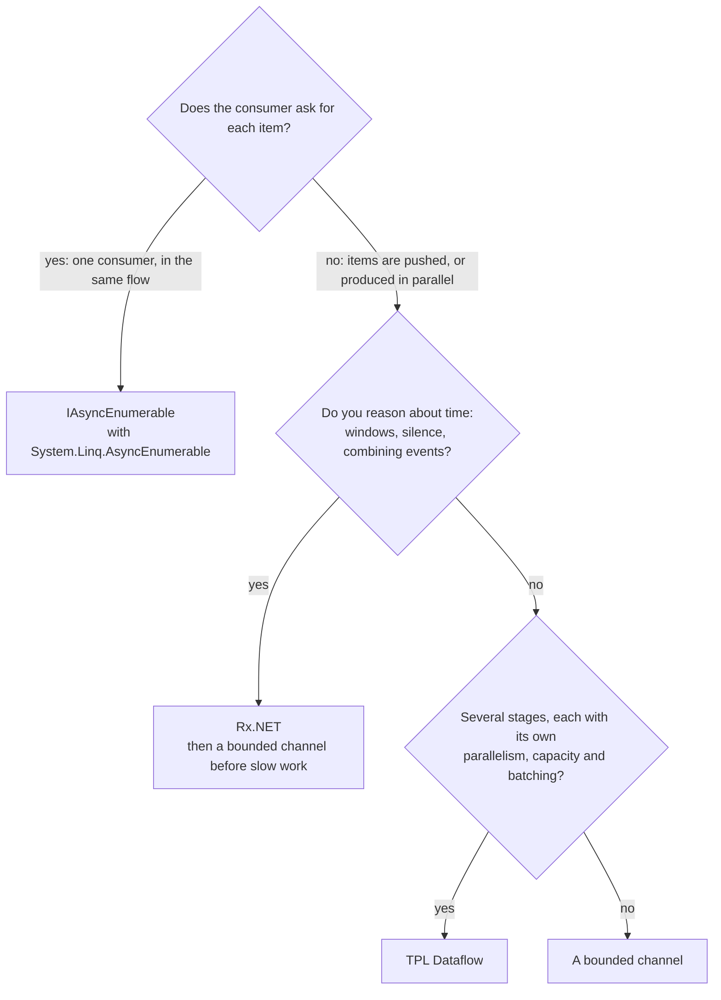

Lessons 6 to 8 took three ways of moving items from one piece of code to another. The fourth is the one C# builds into the language: [`IAsyncEnumerable<T>`](https://learn.microsoft.com/dotnet/api/system.collections.generic.iasyncenumerable-1), consumed with `await foreach`. This lesson starts with it, then runs the same four experiments on all four: a consumer that holds an item, a source that fails, a consumer that fails, and a throughput benchmark. The answers are the table and the decision chart near the end.

Reactor is the fifth column. The [Spring Boot, Spring Cloud and Reactor course](../../spring-cloud-reactor/02-reactor-mono-and-flux/) compares `Flux` with `IAsyncEnumerable` and `IObservable`; this lesson doesn't repeat that comparison, it measures the .NET side of it.

GA links point to commit [`a826864`](https://github.com/GuitarAlchemist/ga/tree/a826864f3a012cad88e415954bf57eca0ce12aa6), .NET links to tag [`v10.0.12`](https://github.com/dotnet/runtime/tree/4271d88e0aebf3d04f188f1334c2220d80555ef6) of `dotnet/runtime`.

## Running the lesson's program

```bash
bash code/csharp-advanced/check.sh                                   # every lesson, compared with expected/
dotnet run --project code/csharp-advanced/Advanced -c Release -- l9  # this lesson only, after check.sh
```

The code is [`Advanced/Lesson9.cs`](https://github.com/spareilleux/learn/blob/b4d713f86711b770a75d7504f334c5871c95f820/code/csharp-advanced/Advanced/Lesson9.cs), and its output is compared with [`expected/l9.txt`](https://github.com/spareilleux/learn/blob/b4d713f86711b770a75d7504f334c5871c95f820/code/csharp-advanced/expected/l9.txt). The benchmark is in [`Benchmarks/StreamBenchmarks.cs`](https://github.com/spareilleux/learn/blob/b4d713f86711b770a75d7504f334c5871c95f820/code/csharp-advanced/Benchmarks/StreamBenchmarks.cs).

## Async streams pull

An async iterator is a method that returns `IAsyncEnumerable<T>` and contains both `await` and `yield return`. The compiler turns it into a state machine, as lesson 3 showed for `async` methods, and the [tutorial on async streams](https://learn.microsoft.com/dotnet/csharp/asynchronous-programming/generate-consume-asynchronous-stream) covers the syntax. The lesson's source logs what it does:

```csharp
static async IAsyncEnumerable<string> Chords(List<string> log, [EnumeratorCancellation] CancellationToken token = default)
{
    try
    {
        foreach (var chord in Progression)
        {
            await Task.Yield();
            log.Add($"produce {chord}");
            yield return chord;
        }
    }
    finally
    {
        log.Add("source finally");
    }
}
```

```text
== An async iterator runs only when the consumer asks for the next item
produce Dm7, consume Dm7, produce G7, consume G7, produce Cmaj7, consume Cmaj7, produce A7, consume A7, source finally
```

Each item is produced only when `await foreach` asks for the next one, with `MoveNextAsync`, and the `finally` runs when the consumer disposes the iterator. There is no queue, no second task and no thread: the producer's code runs inside the consumer's calls. That is why the Reactor course says `IAsyncEnumerable` has backpressure for free, one element at a time ([Reactor course, backpressure](../../spring-cloud-reactor/03-reactor-under-the-hood/#backpressure)).

The [`[EnumeratorCancellation]`](https://learn.microsoft.com/dotnet/api/system.runtime.compilerservices.enumeratorcancellationattribute) attribute connects the parameter to the token a consumer passes with `WithCancellation(token)`, so that a caller who didn't create the stream can still cancel it.

Forgetting `await` is a compile error, not a silent bug. The course keeps the snippet in [`CompileFail/snippets/l9_foreach_async_stream.cs`](https://github.com/spareilleux/learn/blob/b4d713f86711b770a75d7504f334c5871c95f820/code/csharp-advanced/CompileFail/snippets/l9_foreach_async_stream.cs):

```csharp
public static void Print()
{
    foreach (var chord in ChordsAsync())
    {
        Console.WriteLine(chord);
    }
}
```

```text
l9_foreach_async_stream.cs(12,31): error CS8414: foreach statement cannot operate on variables of type 'IAsyncEnumerable<string>' because 'IAsyncEnumerable<string>' does not contain a public instance or extension definition for 'GetEnumerator'. Did you mean 'await foreach' rather than 'foreach'?
```

## LINQ for async streams, in .NET 10

Until .NET 9, LINQ over `IAsyncEnumerable` came from the community-maintained `System.Linq.Async` package. .NET 10 ships [`System.Linq.AsyncEnumerable`](https://learn.microsoft.com/dotnet/api/system.linq.asyncenumerable) in the shared framework, and the [breaking-change note](https://learn.microsoft.com/dotnet/core/compatibility/core-libraries/10.0/asyncenumerable) explains how to remove the old package or avoid ambiguities with it.

```csharp
static async Task AsyncLinq()
{
    Title("System.Linq.AsyncEnumerable, part of .NET 10");
    Line($"AsyncEnumerable: {typeof(AsyncEnumerable).Assembly.GetName().Name}, in the shared framework {typeof(AsyncEnumerable).Assembly.Location.Contains("Microsoft.NETCore.App")}");

    var log = new List<string>();
    var firstTwo = await Chords(log).Take(2).ToListAsync();
    Line($"Take(2): {string.Join(" ", firstTwo)}; log: {string.Join(", ", log)}");

    var sevenths = await Progression.ToAsyncEnumerable()
        .Where(async (chord, ct) =>
        {
            await Task.Yield();
            return !chord.Contains("maj");
        })
        .Select((chord, index) => $"{index}:{chord}")
        .ToArrayAsync();
    Line($"Where with an async predicate, then Select with an index: {string.Join(" ", sevenths)}");

    var chunks = await AsyncEnumerable.Range(1, 10).Chunk(4).Select(chunk => $"[{string.Join(" ", chunk)}]").ToListAsync();
    Line($"AsyncEnumerable.Range(1, 10).Chunk(4): {string.Join(" ", chunks)}");
}
```

```text
== System.Linq.AsyncEnumerable, part of .NET 10
AsyncEnumerable: System.Linq.AsyncEnumerable, in the shared framework True
Take(2): Dm7 G7; log: produce Dm7, produce G7, source finally
Where with an async predicate, then Select with an index: 0:Dm7 1:G7 2:A7
AsyncEnumerable.Range(1, 10).Chunk(4): [1 2 3 4] [5 6 7 8] [9 10]
```

- `Take(2)` stopped asking after two items and disposed the source: its `finally` ran, and `Cmaj7` was never produced.
- The asynchronous overloads take a `CancellationToken` and return a `ValueTask`: [`Where(Func<TSource, CancellationToken, ValueTask<bool>>)`](https://github.com/dotnet/runtime/blob/4271d88e0aebf3d04f188f1334c2220d80555ef6/src/libraries/System.Linq.AsyncEnumerable/src/System/Linq/Where.cs#L53-L55). The old package called them `WhereAwait` and `SelectAwait`; in .NET 10 they are overloads of `Where` and `Select`.
- `Chunk`, `CountAsync`, `ToListAsync`, `AsyncEnumerable.Range` and the rest of LINQ are there.

An async lambda with only the item as parameter matches none of the overloads. The compiler then tries the synchronous `Func<string, bool>` and gives up ([`l9_async_predicate.cs`](https://github.com/spareilleux/learn/blob/b4d713f86711b770a75d7504f334c5871c95f820/code/csharp-advanced/CompileFail/snippets/l9_async_predicate.cs)):

```csharp
public static IAsyncEnumerable<string> Sevenths(IAsyncEnumerable<string> chords) =>
    chords.Where(async chord => await IsSeventhAsync(chord));
```

```text
l9_async_predicate.cs(11,34): error CS4010: Cannot convert async lambda expression to delegate type 'Func<string, bool>'. An async lambda expression may return void, Task or Task<T>, none of which are convertible to 'Func<string, bool>'.
```

The fix is the two-parameter lambda of the program above: `async (chord, ct) => …`.

## Case study: `Take(100)` on GA's generator

Lesson 6 found that GA's [`VoicingGenerator.GenerateAllVoicingsAsync`](https://github.com/GuitarAlchemist/ga/blob/a826864f3a012cad88e415954bf57eca0ce12aa6/Common/GA.Domain.Services/Fretboard/Voicings/Generation/VoicingGenerator.cs#L180-L249) keeps generating after its consumer has left. GA's usage examples chain exactly that exit, `.Take(100)` ([`USAGE_EXAMPLES.md#L31-L41`](https://github.com/GuitarAlchemist/ga/blob/a826864f3a012cad88e415954bf57eca0ce12aa6/Demos/Music%20Theory/FretboardVoicingsCLI/USAGE_EXAMPLES.md#L31-L41)). The program runs `Take(100)` from `System.Linq.AsyncEnumerable` on lesson 6's copy of the method, then on its fix:

```text
== GA's usage example: GenerateAllVoicingsAsync(...).Take(100)
GA shape: took 100; producer completed within 10 s True, windows generated 24 of 24
fixed:    took 100; producer already completed True, windows generated fewer than 24 True
```

`Take` did its part: it disposed the iterator after 100 voicings. In GA's shape, disposing only ends the reading loop, so the producers went on to generate all 24 windows. The fixed version cancels them in its `finally`; it had generated 8 windows on the author's machine when the loop returned. A LINQ operator can't fix a source that ignores its own disposal.

## The same experiments on all four

### A consumer holds item 0

Each source tries to produce 1,000 items, counting each one just before it hands it over. The consumer receives item 0 and doesn't return. The program waits until the count stops moving, then prints it. The six sources are in [`Backpressure`](https://github.com/spareilleux/learn/blob/b4d713f86711b770a75d7504f334c5871c95f820/code/csharp-advanced/Advanced/Lesson9.cs#L97-L206); the helper that measures them is short:

```csharp
static async Task Measure(string name, Func<Counter, Task, Task> run)
{
    var produced = new Counter();
    var release = new TaskCompletionSource(TaskCreationOptions.RunContinuationsAsynchronously);
    var running = Task.Run(() => run(produced, release.Task));

    // Wait until the count stops moving for 200 ms
    var last = -1;
    while (produced.Value != last)
    {
        last = produced.Value;
        await Task.Delay(200);
    }

    Line($"{name,-34} {last,5}");
    release.SetResult();
    await running;
}
```

```text
== A consumer holds item 0: how many of 1,000 items has the source produced?
async iterator (IAsyncEnumerable)      1
Channel.CreateBounded(2)               4
Channel.CreateUnbounded()           1000
ActionBlock, BoundedCapacity 2         3
Rx Subject, no scheduler               1
Rx Subject, ObserveOn(TaskPool)     1000
```

- **Async iterator: 1.** The consumer never asked for item 1.
- **Bounded channel of 2: 4.** Item 0 is in the consumer's hands, items 1 and 2 fill the channel, and item 3 was counted before its `WriteAsync` started waiting.
- **Unbounded channel: 1,000.** Nothing slows the producer down.
- **`ActionBlock` with `BoundedCapacity` 2: 3.** Lesson 7 showed that the item being processed counts against the capacity, so there is room for one item in the queue, and the third `SendAsync` waits.
- **Rx without a scheduler: 1.** The producer is stuck inside `OnNext(0)`, which runs the observer on its thread.
- **Rx with `ObserveOn`: 1,000.** Lesson 8's unbounded queue.

The corresponding Reactor figure is a demand: the Reactor course's `publishOn` asked its source for 256 elements, its default prefetch, and a subscriber that requests 2 receives 2.

### The source fails after three items

```text
== The source fails after 3 items: what does the consumer see?
async iterator                         0, 1, 2, InvalidOperationException: source failed
channel, writer just throws            0, 1, 2, still waiting after 1 s
channel, writer calls Complete(e)      0, 1, 2, InvalidOperationException: source failed
Dataflow, PropagateCompletion          target.Completion Faulted: AggregateException: One or more errors occurred. (source failed) (inner InvalidOperationException: source failed)
Rx                                     0, 1, 2, OnError(InvalidOperationException: source failed)
```

The async iterator and Rx deliver the three items, then the original exception. A channel only does that if the writer passes the exception to `Complete(e)`: a writer that just throws leaves the reader waiting forever, which is lesson 6's GA bug. Dataflow faults the target through the link, wrapped in an `AggregateException` as lesson 7 showed.

### The consumer fails on item 1

```text
== The consumer fails on item 1: does the source stop?
async iterator                     consumer: InvalidOperationException: consumer failed; source produced 2, its finally ran True
Channel.CreateBounded(2)           consumer: InvalidOperationException: consumer failed; producer finished within 1 s False, Reader.Count 2
ActionBlock, BoundedCapacity 2     block Faulted; SendAsync returned false before the end True
Rx, synchronous source             Subscribe: InvalidOperationException: consumer failed; source produced 2
```

- The **async iterator** is the only one that cleans up by itself: the exception leaves `await foreach`, which disposes the iterator, and the source's `finally` runs. The source had produced two items.
- The **bounded channel**'s producer doesn't know. It fills the channel and waits forever, as in GA's index command. The consumer has to complete the channel with the exception, like lesson 6's fix.
- **`ActionBlock`** faults and declines further messages, so `SendAsync` returns `false`: a producer that checks the result stops, one that ignores it, like GA's Dataflow demo in lesson 7, doesn't.
- **Rx** with a synchronous source throws the observer's exception back through `OnNext` into the source's loop, and out of `Subscribe`. Nothing turned it into `OnError`: Rx operators such as `Select` catch the exceptions of the functions you give them and send `OnError`, so a step that can fail belongs in an operator, not in the observer.

## Bridges

The four types convert into each other, so a pipeline can use each where it's best. Three conversions are in the libraries: [`ChannelReader.ReadAllAsync`](https://learn.microsoft.com/dotnet/api/system.threading.channels.channelreader-1.readallasync), [`DataflowBlock.ReceiveAllAsync`](https://learn.microsoft.com/dotnet/api/system.threading.tasks.dataflow.dataflowblock.receiveallasync) and [`DataflowBlock.AsObservable`](https://learn.microsoft.com/dotnet/api/system.threading.tasks.dataflow.dataflowblock.asobservable). The `System.Reactive` 7.0 package has no conversion between `IObservable` and `IAsyncEnumerable`: the program's first attempt, `ToAsyncEnumerable()` on an observable, didn't compile. Both directions take a few lines:

```csharp
// IObservable<T> to IAsyncEnumerable<T>: the subscription writes into a channel, the consumer reads it
public static async IAsyncEnumerable<T> ReadThrough<T>(IObservable<T> source, Channel<T> channel,
    [EnumeratorCancellation] CancellationToken cancellationToken = default)
{
    using var subscription = source.Subscribe(
        item => channel.Writer.TryWrite(item),
        error => channel.Writer.TryComplete(error),
        () => channel.Writer.TryComplete());
    await foreach (var item in channel.Reader.ReadAllAsync(cancellationToken))
    {
        yield return item;
    }
}
```

```csharp
// IAsyncEnumerable<T> to IObservable<T>: each subscription enumerates the source; disposing it cancels the enumeration
public static IObservable<T> ToObservable<T>(IAsyncEnumerable<T> source) =>
    Observable.Create<T>(async (observer, cancellationToken) =>
    {
        await foreach (var item in source.WithCancellation(cancellationToken))
        {
            observer.OnNext(item);
        }

        observer.OnCompleted();
    });
```

```text
== Bridges
ChannelReader.ReadAllAsync(): Dm7 G7 Cmaj7 A7
ISourceBlock.ReceiveAllAsync(): Dm7 G7 Cmaj7 A7
IObservable through a channel: Dm7 G7 Cmaj7 A7
IAsyncEnumerable with Observable.Create: Dm7 G7 Cmaj7 A7
ISourceBlock.AsObservable(): dm7 g7 cmaj7 a7
```

`ReadThrough` is the useful one, because it is where a push source gets a backpressure policy. The observer can't wait, so the channel's options decide what happens to items the consumer isn't ready for. The program pushes 1,000 items while the consumer holds the first:

```text
== A Subject read through a channel: the channel's options decide what happens to a fast source
unbounded                1,000 OnNext while the consumer held item 0; it then read 1000 items, the last 999
bounded 10, DropOldest   1,000 OnNext while the consumer held item 0; it then read 11 items, the last 999: 0 990 991 992 993 994 995 996 997 998 999
```

The unbounded channel kept everything; the bounded one, in `DropOldest` mode, kept the 10 most recent items. That's the combination for a MIDI keyboard or a sensor feeding a slow analysis: Rx for the time operators, then a bounded channel before the slow part. `DropWrite` would keep the oldest items instead, and `Wait` mode would do nothing here, because `TryWrite` never waits.

## Throughput

[BenchmarkDotNet](https://benchmarkdotnet.org/) moves 100,000 integers from one producer to one consumer that sums them, through each kind of stream. Run it alone, with nothing else heavy running on the machine:

```bash
cd code/csharp-advanced
dotnet run -c Release --project Benchmarks -- --filter "*StreamBenchmarks*"
```

```text
BenchmarkDotNet v0.15.8, Windows 11 (10.0.26200.9445/25H2/2025Update/HudsonValley2)
Intel Core Ultra 9 285K 3.70GHz, 1 CPU, 24 logical and 24 physical cores
.NET 10.0.12, X64 RyuJIT x86-64-v3

| Method                 | Mean        | Ratio | Allocated   |
|----------------------- |------------:|------:|------------:|
| AsyncIterator          |  1,113.7 us |  1.00 |       168 B |
| UnboundedChannel       |  4,768.1 us |  4.28 |     26758 B |
| BoundedChannel1000     |  5,129.8 us |  4.61 |      9904 B |
| DataflowBufferToAction | 41,904.6 us | 37.64 |   6756271 B |
| RxSubject              |    131.7 us |  0.12 |       232 B |
| RxObserveOnTaskPool    | 10,638.8 us |  9.56 |    392857 B |
```

The table keeps four of BenchmarkDotNet's columns; the full output also reported a bimodal distribution for `RxObserveOnTaskPool`, whose mean is therefore less meaningful than the others.

- **`RxSubject` is the fastest because it isn't asynchronous at all**: each `OnNext` is a delegate call on the producer's thread, about 1.3 ns per item.
- **The async iterator** costs about 11 ns per item. Its source never really waits, so every `MoveNextAsync` completes synchronously, and the whole run allocates one enumerator.
- **Channels** cost about 50 ns per item, with the producer on another thread, and a few kilobytes of segments or buffer.
- **Rx with `ObserveOn`** moves each item to the thread pool's queue: about 100 ns per item.
- **Dataflow** is the slowest here, at about 420 ns per item and 6.7 MB for 100,000 integers. The benchmark doesn't show where that goes; the offer-and-postpone protocol between two bounded blocks is the likely cost (*to verify*).

Each item here costs nothing to process, so the benchmark measures only the stream. At 50 ns per item, a channel handles 20 million items a second on this machine: as soon as each item involves a database call or a few microseconds of computation, the choice depends on the behaviour measured above, not on this table.

## Which one?



| | `IAsyncEnumerable` | `Channel<T>` | TPL Dataflow | Rx.NET | Reactor `Flux` |
|---|---|---|---|---|---|
| Model | the consumer pulls | a queue between tasks | a graph of blocks, each with a queue | the source pushes | the source pushes what was requested |
| Where it comes from | language, and `System.Linq.AsyncEnumerable` in .NET 10 | shared framework | shared framework | `System.Reactive` package | `reactor-core` |
| Consumer holds item 0 | the source waits after 1 | waits after capacity + 2, or never if unbounded | waits after `BoundedCapacity` + 1 | no scheduler: the producer's thread waits; `ObserveOn`: never | the source stops at the demand, 256 behind `publishOn` |
| Source fails | the exception, at `await foreach` | the exception if the writer calls `Complete(e)`, a hang if not | the target faults, nested `AggregateException` | `OnError`, final | `onError`, final |
| Consumer fails | the source's `finally` runs | the producer waits forever unless the consumer completes the channel | the block faults, `SendAsync` returns `false` | the exception goes back into the source | the subscription is cancelled upstream |
| Parallelism | none: one item at a time | as many readers as you start | `MaxDegreeOfParallelism` per block | `SelectMany`, `Merge(n)` | `flatMap(f, n)`, `parallel()` |
| Order | kept | FIFO; lost across several readers | kept unless `EnsureOrdered = false` | `Concat` keeps it, `SelectMany` doesn't | `concatMap`, `flatMapSequential` keep it, `flatMap` doesn't |
| Time operators | none | none | `BatchBlock` counts; time needs `TriggerBatch` | `Throttle`, `Sample`, `Buffer(TimeSpan)`, `TestScheduler` | `sample`, `bufferTimeout`, `StepVerifier.withVirtualTime` |
| Cost per item, trivial work | ~11 ns | ~50 ns | ~420 ns | ~1.3 ns synchronous, ~100 ns with `ObserveOn` | not measured in either course |

The Reactor column's behaviours come from the [Reactor course](../../spring-cloud-reactor/03-reactor-under-the-hood/) and the [`Flux` Javadoc](https://projectreactor.io/docs/core/release/api/reactor/core/publisher/Flux.html); the "consumer fails" line is the Reactive Streams rule that an error cancels the upstream subscription, which this lesson doesn't run.

In practice:

- **Return `IAsyncEnumerable<T>` from an API** that produces a sequence: it's the most composable type, and a caller who wants a channel, a block or an observable is one bridge away.
- **Use a bounded channel inside a component** to decouple a producer from a consumer that run at different speeds, and make both sides pass their failures to the channel.
- **Reach for Dataflow** when the pipeline has several stages that need their own parallelism and capacity, and you want those settings in one place.
- **Reach for Rx** for events in time. Don't let a slow consumer sit behind `ObserveOn`; put a bounded channel there.

## If you know Spring and Reactor

| .NET | Reactor, or Java |
|---|---|
| `IAsyncEnumerable<T>`, `await foreach` | `Flux<T>` consumed with `request(1)`; `Stream<T>` or `Iterator<T>` when it's synchronous |
| `System.Linq.AsyncEnumerable` | `Flux` operators |
| `Take(n)` disposes the iterator | `take(n)` cancels the subscription |
| `[EnumeratorCancellation]`, `WithCancellation` | `dispose()` on the subscription |
| `Channel<T>` | `Sinks.many().unicast().onBackpressureBuffer(queue)`, or a `BlockingQueue` |
| `ReadThrough` into a bounded channel | `onBackpressureBuffer(n, BufferOverflowStrategy.DROP_OLDEST)` |
| `ChannelReader.ReadAllAsync` | `Flux.create` fed by a queue |
| `ToObservable(IAsyncEnumerable)`, `AsObservable()` | `Flux.fromIterable`, `Flux.fromStream`; `Flux.from` for another Reactive Streams publisher |

Lesson 6's and lesson 8's tables have the channel and Rx operators one by one. Java has no async iterator; since virtual threads, a blocking `Iterator` or `Stream` read on a virtual thread plays that part, which the [Reactor course's last section](../../spring-cloud-reactor/03-reactor-under-the-hood/#virtual-threads-or-reactive) compares with Reactor.

## Exercises

1. Write `Merge(first, second)`, which reads two `IAsyncEnumerable<T>` concurrently and yields their items as they arrive. If one source fails, the merge must end with that exception and stop the other source.
2. GA's index command upserts voicings in batches. With `System.Linq.AsyncEnumerable`, turn lesson 6's fixed generator into batches of 5 voicings. With 4 windows of 3 voicings, what sizes do the batches have?
3. Pick a stream for each: (a) chords detected from a MIDI keyboard, sent to a slow analysis service; (b) indexing a million voicings, with parallel computation and batched database writes; (c) an HTTP endpoint that streams search results to its client.

<details>
<summary>Solutions</summary>

1. Two pumps copy the sources into a bounded channel, the first error completes the channel, and a `finally` stops the pumps when the consumer leaves:

    ```csharp
    // Exercise 1: reads both sources concurrently into a bounded channel; the first error ends the merge
    public static async IAsyncEnumerable<T> Merge<T>(IAsyncEnumerable<T> first, IAsyncEnumerable<T> second,
        [EnumeratorCancellation] CancellationToken cancellationToken = default)
    {
        using var cts = CancellationTokenSource.CreateLinkedTokenSource(cancellationToken);
        var channel = Channel.CreateBounded<T>(1);

        async Task Pump(IAsyncEnumerable<T> source)
        {
            await foreach (var item in source.WithCancellation(cts.Token))
            {
                await channel.Writer.WriteAsync(item, cts.Token);
            }
        }

        var pumps = Task.WhenAll(Pump(first), Pump(second));
        _ = pumps.ContinueWith(t => channel.Writer.TryComplete(t.Exception?.InnerException), TaskScheduler.Default);
        try
        {
            await foreach (var item in channel.Reader.ReadAllAsync(cts.Token))
            {
                yield return item;
            }
        }
        finally
        {
            cts.Cancel();
            try
            {
                await pumps;
            }
            catch
            {
                // already reported through the channel, or cancelled by us
            }
        }
    }
    ```

    ```text
    1. Merge(a, b): 6 items, a in order True, b in order True
       Merge(a, failing): InvalidOperationException: b failed
    ```

    Each source keeps its own order; how the two interleave depends on timing, `a0 b0 a1 b1 a2 b2` on the author's machine.

2. `Chunk(5)` on the async stream; 12 voicings make batches of 5, 5 and 2. The last batch is yielded when the source completes, so a slow generator delays it: lesson 6's `ReadBatchesAsync` exercise is the version that doesn't wait for a full batch.

    ```csharp
    var sizes = await FixedVoicings(4, probe).Chunk(5).Select(chunk => chunk.Length).ToListAsync();
    ```

    ```text
    2. FixedVoicings(4 windows of 3).Chunk(5): 5 5 2
    ```

3. (a) Rx for the chord detection, as in lesson 8, then `ReadThrough` a bounded channel in `DropOldest` mode before the analysis service, so that it always analyzes the most recent chords. (b) Parallel producers and a batching consumer around a bounded channel, as in lesson 6's fixed index command, or a Dataflow pipeline of a `TransformBlock` with `MaxDegreeOfParallelism`, a `BatchBlock` and a bounded `ActionBlock`. (c) An `IAsyncEnumerable<T>` returned by the endpoint, which ASP.NET Core writes as it's enumerated; lesson 14 checks that (*to verify* until then).

</details>

## Key takeaways

- `IAsyncEnumerable` pulls: the source runs inside the consumer's calls, stops when the consumer stops, and runs its `finally` on disposal.
- .NET 10 ships LINQ for async streams; the asynchronous overloads take a `CancellationToken` and replace the old package's `…Await` methods.
- A LINQ `Take` disposes the source, but a source that started its own producers must stop them itself.
- Bounded channels and bounded Dataflow blocks make a producer wait; unbounded channels and Rx behind `ObserveOn` never do.
- A source's failure reaches the consumer by itself only with iterators, Rx and Dataflow links; a channel needs `Complete(e)`. A consumer's failure stops the source by itself only with iterators.
- Convert at the edges: an observable into a bounded channel, a channel or block into an `IAsyncEnumerable`.
- Without real work per item, the stream types differ by an order of magnitude or more; with real work, their behaviour decides, not their speed.

## Sources

- Microsoft Learn: [`IAsyncEnumerable<T>`](https://learn.microsoft.com/dotnet/api/system.collections.generic.iasyncenumerable-1), [generate and consume async streams](https://learn.microsoft.com/dotnet/csharp/asynchronous-programming/generate-consume-asynchronous-stream), [`System.Linq.AsyncEnumerable`](https://learn.microsoft.com/dotnet/api/system.linq.asyncenumerable) and [its breaking-change note](https://learn.microsoft.com/dotnet/core/compatibility/core-libraries/10.0/asyncenumerable), [`EnumeratorCancellationAttribute`](https://learn.microsoft.com/dotnet/api/system.runtime.compilerservices.enumeratorcancellationattribute), [`ChannelReader<T>.ReadAllAsync`](https://learn.microsoft.com/dotnet/api/system.threading.channels.channelreader-1.readallasync), [`DataflowBlock.ReceiveAllAsync`](https://learn.microsoft.com/dotnet/api/system.threading.tasks.dataflow.dataflowblock.receiveallasync), [`DataflowBlock.AsObservable`](https://learn.microsoft.com/dotnet/api/system.threading.tasks.dataflow.dataflowblock.asobservable).
- dotnet/runtime at `v10.0.12`: [`System.Linq.AsyncEnumerable/Where.cs`](https://github.com/dotnet/runtime/blob/4271d88e0aebf3d04f188f1334c2220d80555ef6/src/libraries/System.Linq.AsyncEnumerable/src/System/Linq/Where.cs).
- [BenchmarkDotNet](https://benchmarkdotnet.org/).
- Reactor: [`Flux` Javadoc](https://projectreactor.io/docs/core/release/api/reactor/core/publisher/Flux.html); the [Spring Boot, Spring Cloud and Reactor course](../../spring-cloud-reactor/), lessons 2 and 3.
- Guitar Alchemist at `a826864`: [`VoicingGenerator.cs`](https://github.com/GuitarAlchemist/ga/blob/a826864f3a012cad88e415954bf57eca0ce12aa6/Common/GA.Domain.Services/Fretboard/Voicings/Generation/VoicingGenerator.cs#L180-L249), [`USAGE_EXAMPLES.md`](https://github.com/GuitarAlchemist/ga/blob/a826864f3a012cad88e415954bf57eca0ce12aa6/Demos/Music%20Theory/FretboardVoicingsCLI/USAGE_EXAMPLES.md#L31-L41).
