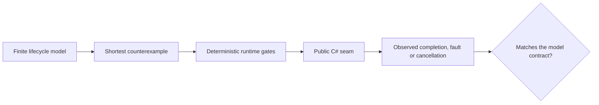

Lessons [6](../06-channels/), [7](../07-tpl-dataflow/), [8](../08-rx-net/) and [9](../09-choosing-streams/) execute C# pipelines. They show what one chosen schedule did. This lesson adds a complementary tool: a bounded [Petri-net specification oracle](../../petri-nets/14-on-our-systems/) that enumerates every marking of a deliberately small lifecycle.

The oracle does **not** run the production pipeline. It answers a narrower question before the runtime test is written: which success, fault and cancellation states must that test distinguish, and which interleaving would disprove the intended contract?

## Start with the contract, not the API

The executable model has one item, one producer, one consumer and one queue slot. Run it from the repository root:

```bash
dotnet test code/petri-nets/Tests -c Release --filter PipelineLifecycleTests
dotnet run --project code/petri-nets/Examples -c Release -- l14
```

Its complete reachability graph has eight markings and three terminal dead markings: `succeeded`, `failed` and `cancelled`. The tests also prove the Channel queue invariant `free + queued = 1`. Read the [Petri lesson](../../petri-nets/14-on-our-systems/) for the model, PNML file and measured transcript; this lesson concentrates on translating that oracle into better C# tests.



## The same words do not mean the same capacity

The first design improvement is to stop calling three different things “a bounded pipeline”.

| Mechanism | What is bounded | What the Petri place `free` can mean | What must remain explicit |
|---|---|---|---|
| [`Channel<T>`](https://learn.microsoft.com/dotnet/core/extensions/channels) | queued items | one available queue slot | writer completion, queue drain and reader settlement are separate observations |
| [TPL Dataflow](https://learn.microsoft.com/dotnet/standard/parallel-programming/dataflow-task-parallel-library) | queued **and executing** items in an execution block | not the current `free` place; the model must be refined | block completion, propagated faults and external collector tasks |
| [Rx.NET](https://github.com/dotnet/reactive) | nothing by default | no equivalent until a bounded bridge is introduced | `OnCompleted`, `OnError`, disposal and scheduled-work settlement |

So `free + queued = 1` is a useful Channel invariant, not a universal backpressure law. Copying it into a Dataflow or Rx test would produce a precise proof of the wrong system.

## Turn a counterexample into a deterministic test

Do not translate a Petri transition into `Task.Delay`. Translate it into a gate that the test owns: [`TaskCompletionSource`](https://learn.microsoft.com/dotnet/api/system.threading.tasks.taskcompletionsource), a barrier, a fake dependency or a controllable scheduler.

| Model path | Runtime schedule to force | Observation required at the public seam |
|---|---|---|
| `write → read → consume → settle_success` | release the consumer after one accepted write | writer closed, item observed, producer and consumer tasks completed |
| `producer_fail → settle_producer_failure` | fail the producer before its first accepted write | the error is observable and no reader waits forever |
| `write → read → consumer_fail` | let the consumer take the item, then fail it | the producer is unblocked or cancelled, and every owned task is joined |
| `cancel` | request cancellation before work starts | cancellation is observed and all participants settle |

The current one-item oracle cannot reproduce a producer already blocked by backpressure when the consumer fails. Its cancellation transition is also atomic and pre-start. Those are documented assumptions, not missing test results. To cover those schedules, first refine the model with at least two items and separate `cancel_requested`, `producer_settled` and `consumer_settled` places; then derive the runtime gates from the new shortest paths.

## Per-mechanism test design

### `Channel<T>`

Use a bounded channel with `capacity: 1`, and keep references to both participant tasks. A success assertion must await the writer, drain the reader and await the consumer. A failure assertion must prove the exception crosses the public seam **and** that neither participant remains incomplete. [`TryComplete(error)`](https://learn.microsoft.com/dotnet/api/system.threading.channels.channelwriter-1.trycomplete) is an event; it is not proof that the reader observed the error.

The oracle improves the test by making leftover tokens visible. If a terminal marking still contains `queued` or `producer`, the analogous runtime test must inspect the queued item or unfinished task instead of accepting an exception alone.

### TPL Dataflow

Do not reuse the Channel capacity invariant. An execution block's `BoundedCapacity` includes an item while its delegate is running. Model separate `queued` and `executing` places, then state the invariant for the block you actually configured.

Also distinguish `PropagateCompletion` from whole-pipeline settlement. Await every block's `Completion` and any collector task outside the graph. A linked target can complete while a side task still owns work; the oracle should give that participant its own place.

### Rx.NET

Rx has no built-in backpressure contract, so a bounded Petri place only maps to Rx after an explicit bridge or buffer policy exists. Without one, model notifications and subscription lifetime instead: `subscribed`, `next_in_flight`, `completed`, `errored`, `disposed`, and, where applicable, `scheduled_work_settled`.

A virtual-time scheduler controls time, not arbitrary asynchronous work. The runtime test must separately observe tasks created outside the scheduler. Disposal is not `OnCompleted`, and neither proves that external work has settled.

## Practical GA use

The GA examples in lessons 6 and 9 contain exactly the lifecycle seams where this method pays for itself: bounded voicing generation, a consumer that can stop early, and producer faults that must reach the caller. The course examples reproduce those mechanism shapes at pinned revisions; they are not tests of today's GA binaries.

For a GA change, use this sequence:

1. Pin the target GA revision and name the public seam under test.
2. Write the smallest bounded Petri model that contains the suspected schedule.
3. Require a complete reachability graph and classify every dead marking as success, failure or cancellation.
4. Extract the shortest counterexample and reproduce it with deterministic C# gates.
5. Fix GA only after the failing runtime test proves that the modeled path is real.
6. Keep the model as a design oracle and the runtime test as implementation evidence.

This is especially useful for concurrency bugs that pass thousands of stress iterations until one unlucky schedule occurs. The net enumerates a finite state space; the C# test proves that the real API follows the same lifecycle contract.

## Exercises

1. Extend the model to two writes and derive a Channel test where the second writer is blocked when the consumer fails.
2. Replace the Channel mapping with a Dataflow [`TransformBlock`](https://learn.microsoft.com/dotnet/api/system.threading.tasks.dataflow.transformblock-2). Define an invariant that counts both queued and executing items.
3. Model Rx disposal separately from completion, then write a virtual-time test that proves which notification is observed.
4. Pick one current GA pipeline. Record its exact revision, public seam, owned tasks and terminal observations before proposing a fix.

<details>
<summary>Solution directions</summary>

1. Add a second work token and retain one `free` token. The shortest failing path should fill the slot, start the second write, fail the consumer and leave the second writer unsettled until the failure policy fires.
2. Split `queued` from `executing`, and test an invariant such as `free + queued + executing = configured capacity` only for the execution block whose documented semantics match it.
3. Give `disposed` and `completed` different terminal places. Advance virtual time to the notification, then assert separately that externally created tasks settled.
4. A sufficient record names a commit SHA, the public method, every task or subscription it owns, the forced gates, the expected terminal result and the command that reproduces it.

</details>

## What to remember

- The Petri net is a specification oracle, not the runtime.
- Capacity means queued items for the modeled Channel, but queued plus executing items for a Dataflow execution block; Rx is unbounded unless the design adds a bound.
- Cancellation requested, completion signalled, queue drained and every participant settled are different facts.
- Derive deterministic gates from a shortest counterexample; do not rely on sleeps or stress-test luck.
- For GA, a model suggests the regression schedule, while a test against a pinned repository revision supplies the evidence.
