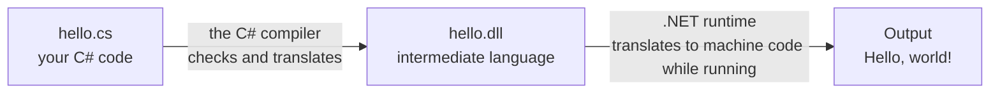

import { Tabs, TabItem } from '@astrojs/starlight/components';

Code: [`examples/l01_hello.cs`](https://github.com/spareilleux/learn/blob/b19a296d6edc70be634ba147e27fd2d0c66f395f/code/csharp-beginner/examples/l01_hello.cs), [`examples/l01_statements.cs`](https://github.com/spareilleux/learn/blob/b19a296d6edc70be634ba147e27fd2d0c66f395f/code/csharp-beginner/examples/l01_statements.cs), the rejected snippets in [`compile_fail/`](https://github.com/spareilleux/learn/tree/b19a296d6edc70be634ba147e27fd2d0c66f395f/code/csharp-beginner/compile_fail) and the project [`l01-project/Hello`](https://github.com/spareilleux/learn/tree/b19a296d6edc70be634ba147e27fd2d0c66f395f/code/csharp-beginner/l01-project/Hello).

## What a program is

A program is a list of instructions for the computer, written in a language that people can read. The computer can't run that text directly: a tool called a **compiler** first checks it and translates it.

With C#, the translation has two steps:



1. The **C# compiler** reads your `.cs` file. If something is wrong, it stops and prints an error. Otherwise it writes a `.dll` file in an *intermediate language* (IL), the same on every computer.
2. The **.NET runtime** loads the `.dll` and turns it into instructions for your processor as the program runs.

You install both at once with the **.NET SDK** (Software Development Kit). It also contains the `dotnet` command, which you'll use for everything: create, build, run and test programs. The [.NET overview](https://learn.microsoft.com/dotnet/core/introduction) describes the pieces in more detail.

This course uses [.NET 10](https://learn.microsoft.com/dotnet/core/whats-new/dotnet-10/overview), a long-term support version, and [C# 14](https://learn.microsoft.com/dotnet/csharp/whats-new/csharp-14), the version of the language that comes with it.

## Open a terminal

A terminal is a window where you type commands. Every command in this course is typed there, then run with <kbd>Enter</kbd>.

<Tabs syncKey="os">
<TabItem label="Windows">

Press <kbd>Win</kbd>, type `Terminal`, and open **Terminal**. It starts PowerShell. On Windows 10, if Terminal isn't installed, open **Windows PowerShell** instead.

</TabItem>
<TabItem label="Linux / WSL">

On Ubuntu, press <kbd>Ctrl</kbd>+<kbd>Alt</kbd>+<kbd>T</kbd>. On Windows with [WSL](https://learn.microsoft.com/windows/wsl/install), open **Ubuntu** from the Start menu: the commands then run inside Linux.

</TabItem>
<TabItem label="macOS">

Press <kbd>Cmd</kbd>+<kbd>Space</kbd>, type `Terminal`, and open **Terminal**.

</TabItem>
</Tabs>

## Install the .NET SDK

<Tabs syncKey="os">
<TabItem label="Windows">

Windows includes the package manager [WinGet](https://learn.microsoft.com/windows/package-manager/winget/). In the terminal:

```powershell
winget install Microsoft.DotNet.SDK.10
```

Close the terminal and open a new one, so that it finds the `dotnet` command. You can also download the installer from the [.NET download page](https://dotnet.microsoft.com/download/dotnet/10.0). The [Windows installation guide](https://learn.microsoft.com/dotnet/core/install/windows) lists the other ways.

</TabItem>
<TabItem label="Linux / WSL">

On Ubuntu 24.04 and later, .NET 10 is in Ubuntu's own packages:

```bash
sudo apt-get update && sudo apt-get install -y dotnet-sdk-10.0
```

`sudo` asks for your password. Other distributions have their own page in the [Linux installation guide](https://learn.microsoft.com/dotnet/core/install/linux) (*to verify*: I ran this course on Windows, and on Ubuntu only in CI).

**On WSL**, install the SDK inside the Linux distribution, even if it's already installed on Windows: Linux can't use the Windows version.

</TabItem>
<TabItem label="macOS">

Download the **Installer** for macOS from the [.NET 10 download page](https://dotnet.microsoft.com/download/dotnet/10.0): **Arm64** for an Apple processor (M1 and later), **x64** for an Intel processor. Open the `.pkg` file and follow the steps, then open a new terminal. The [macOS installation guide](https://learn.microsoft.com/dotnet/core/install/macos) has the details (*to verify*: I ran this course on macOS only in CI).

</TabItem>
</Tabs>

Then check that the SDK answers:

```text
> dotnet --version
10.0.112
```

Any version starting with `10.0` is fine. If the terminal says that `dotnet` isn't recognized, or `command not found`, open a new terminal; if it still fails, follow the installation guide of your OS again.

:::note[Several SDKs on one computer]
`dotnet --list-sdks` shows every installed SDK. My computer has two:

```text
> dotnet --list-sdks
10.0.112 [C:\Program Files\dotnet\sdk]
11.0.100-preview.3.26207.106 [C:\Program Files\dotnet\sdk]
```

By default, `dotnet` uses the newest one. The course folder contains a [`global.json`](https://learn.microsoft.com/dotnet/core/tools/global-json) file that asks for a version 10 SDK, so in that folder `dotnet --version` says `10.0.112`, and in my home folder it says `11.0.100-preview.3.26207.106`.
:::

## Your first program

Make a folder for the course, and create a file named `hello.cs` in it with any text editor (Notepad, TextEdit, `nano`, or the editors described [at the end of this lesson](#choose-an-editor)). Type this single line in it:

```csharp
Console.WriteLine("Hello, world!");
```

Save the file, go to its folder in the terminal with `cd`, and run it:

```text
> dotnet run hello.cs
Hello, world!
```

[`dotnet run`](https://learn.microsoft.com/dotnet/core/tools/dotnet-run) compiled the file, then ran it. Running the same file again is faster: the SDK keeps the compiled program and only compiles again when the file changes. A single `.cs` file run this way is a [**file-based app**](https://learn.microsoft.com/dotnet/core/sdk/file-based-apps), new in .NET 10. Most examples of this course are file-based apps.

Let's read the line piece by piece:

| Piece | Meaning |
|---|---|
| `Console` | the console: the text window your program writes to |
| `.` | "inside": `WriteLine` belongs to `Console` |
| `WriteLine` | a *method*, a named piece of work: write a line of text |
| `( … )` | what you give the method to work with, its *argument* |
| `"Hello, world!"` | a *string*: text, between double quotes |
| `;` | the end of the *statement*, like a full stop at the end of a sentence |

C# is **case-sensitive**: `Console` and `console` are two different names, and only the first exists. The quotes aren't printed: they only tell the compiler where the text starts and ends.

## Several statements

A program runs its statements one after the other, from top to bottom:

```csharp
// A comment starts with two slashes: the compiler ignores it
Console.WriteLine("Guitar Alchemist tunes a guitar like this:");
Console.Write("E2 A2 D3 ");   // Write doesn't go to the next line
Console.Write("G3 B3 E4");
Console.WriteLine();          // an empty WriteLine ends the line
Console.WriteLine("Six strings, from the lowest to the highest.");

/* A comment can also
   span several lines */
Console.WriteLine(6 * 12);    // the computer computes, then prints the result
```

```text
> dotnet run examples/l01_statements.cs
Guitar Alchemist tunes a guitar like this:
E2 A2 D3 G3 B3 E4
Six strings, from the lowest to the highest.
72
```

- [`Console.Write`](https://learn.microsoft.com/dotnet/api/system.console.write) writes text and stays on the same line; [`Console.WriteLine`](https://learn.microsoft.com/dotnet/api/system.console.writeline) writes text and moves to the next line.
- A **comment** is a note for people. `//` comments out the rest of the line; `/*` and `*/` surround a comment that can span several lines.
- `6 * 12` has no quotes: it's not text, it's a calculation. The program computes `72` and prints the number. With quotes, `"6 * 12"` would print the characters `6 * 12`.

The tuning comes from [Guitar Alchemist](https://github.com/GuitarAlchemist/ga), a C# application about music: its default tuning is written `E2 A2 D3 G3 B3 E4` in [`Tuning.cs`](https://github.com/GuitarAlchemist/ga/blob/a826864f3a012cad88e415954bf57eca0ce12aa6/Common/GA.Domain.Core/Instruments/Tuning.cs#L20-L23). A letter is a note, the number is its octave.

In a file-based app, the statements at the top of the file are the program's starting point. The C# documentation calls them [top-level statements](https://learn.microsoft.com/dotnet/csharp/fundamentals/program-structure/top-level-statements).

## Reading a compiler error

Everyone makes mistakes when typing code. The compiler finds them before the program runs. Here the semicolon at the end of the first line is missing:

```csharp
Console.WriteLine("Hello, world!")
Console.WriteLine("Goodbye!");
```

```text
> dotnet run l01_missing_semicolon.cs
C:\Users\spare\source\repos\learn\code\csharp-beginner\compile_fail\l01_missing_semicolon.cs(1,35): error CS1002: ; expected

The build failed. Fix the build errors and run again.
```

The error line has five parts:

| Part | Here | Meaning |
|---|---|---|
| file | `C:\…\l01_missing_semicolon.cs` | which file |
| position | `(1,35)` | line 1, column 35: the character where the compiler noticed the problem |
| kind | `error` | the program can't be built; a `warning` would let it run |
| code | `CS1002` | the number of the error: search for it in the [list of compiler messages](https://learn.microsoft.com/dotnet/csharp/language-reference/compiler-messages/) |
| message | `; expected` | what the compiler expected to find |

Column 35 is just after the closing parenthesis, where the `;` should be. Nothing ran: not even the second line. The full path of the file depends on your folder, so the rest of the course shows only the file name.

Two other mistakes that every beginner makes. A lower-case `console`:

```csharp
console.WriteLine("Hello, world!");
```

```text
l01_lowercase.cs(1,1): error CS0103: The name 'console' does not exist in the current context
```

A missing closing quote:

```csharp
Console.WriteLine("Hello, world!);
```

```text
l01_missing_quote.cs(1,19): error CS1010: Newline in constant
l01_missing_quote.cs(1,35): error CS1026: ) expected
l01_missing_quote.cs(1,35): error CS1002: ; expected
```

One mistake, three errors. Without the closing quote, the string runs to the end of the line (CS1010, "newline in constant"), and it swallows the `)` and the `;`, which are now missing too. **Fix the first error first**, then run again: the next ones often disappear with it.

## Run a file as a script

On Linux and macOS, a file-based app can run like any other command. Its first line, starting with a hash and an exclamation mark, `#!` (a *shebang*), tells the system to run it with `dotnet`:

```csharp
#!/usr/bin/env -S dotnet --
Console.WriteLine("Hello from a script!");
```

<Tabs syncKey="os">
<TabItem label="Windows">

Windows doesn't read shebang lines. `dotnet run l01_shebang.cs` still works: the compiler ignores the first line.

</TabItem>
<TabItem label="Linux / WSL">

```text
$ chmod +x l01_shebang.cs
$ ./l01_shebang.cs
Hello from a script!
```

`chmod +x` makes the file executable. The CI runs these two commands on Linux. The file must use Linux line endings (LF).

</TabItem>
<TabItem label="macOS">

```text
$ chmod +x l01_shebang.cs
$ ./l01_shebang.cs
Hello from a script!
```

`chmod +x` makes the file executable. The CI runs these two commands on macOS. The file must use Linux line endings (LF).

</TabItem>
</Tabs>

## A project

A single file is perfect to learn and for small tools. Larger programs have many files, and a **project** groups them. [`dotnet new console`](https://learn.microsoft.com/dotnet/core/tools/dotnet-new) creates one:

```text
> dotnet new console -o HelloApp
The template "Console App" was created successfully.

Processing post-creation actions...
Restoring C:\Users\spare\…\HelloApp\HelloApp.csproj:
  Determining projects to restore...
  Restored C:\Users\spare\…\HelloApp\HelloApp.csproj (in 66 ms).
Restore succeeded.
```

`-o HelloApp` names the output folder, and the project after it. The folder contains two files, and an `obj` folder used by the build:

```text
HelloApp/
├── HelloApp.csproj   ← the project file: how to build the program
├── Program.cs        ← the code
└── obj/
```

```xml
<Project Sdk="Microsoft.NET.Sdk">

  <PropertyGroup>
    <OutputType>Exe</OutputType>
    <TargetFramework>net10.0</TargetFramework>
    <ImplicitUsings>enable</ImplicitUsings>
    <Nullable>enable</Nullable>
  </PropertyGroup>

</Project>
```

- `OutputType` `Exe`: the project builds a program you can run, not a library for other programs.
- `TargetFramework` `net10.0`: the program runs on .NET 10.
- `ImplicitUsings` and `Nullable` turn on two conveniences that [lesson 4](../04-methods-arrays-lists/#null-no-value-at-all) comes back to. File-based apps turn them on too.

`Program.cs` holds the same kind of code as `hello.cs`:

```csharp
// See https://aka.ms/new-console-template for more information
Console.WriteLine("Hello, World!");
```

Inside the project folder, `dotnet run` needs no file name: it finds the `.csproj` file.

```text
> cd HelloApp
> dotnet run
Hello, World!
```

[`dotnet build`](https://learn.microsoft.com/dotnet/core/tools/dotnet-build) only compiles, and writes the program to `bin/Debug/net10.0/`: `HelloApp.dll`, and on Windows a `HelloApp.exe` that starts it.

When a file-based app grows, [`dotnet project convert hello.cs`](https://learn.microsoft.com/dotnet/core/sdk/file-based-apps#convert-to-project) turns it into a project: it creates a folder with a `.csproj` file and a copy of the code.

| You want to | File-based app | Project |
|---|---|---|
| Create | any editor: a `.cs` file | `dotnet new console -o Name` |
| Run | `dotnet run hello.cs` | `dotnet run`, in the folder |
| Compile only | `dotnet build hello.cs` | `dotnet build` |
| Several code files | one file; SDK 10.0.300 and later add [`#:include`](https://learn.microsoft.com/dotnet/core/sdk/file-based-apps#include) | yes |
| Good for | learning, scripts, small tools | applications, libraries, tests |

## Choose an editor

Any text editor works, but a code editor colors the code, completes names as you type, underlines errors before you run, and lets you run the program step by step with a *debugger* ([lesson 3](../03-conditions-and-loops/#finding-a-mistake-with-the-debugger)). Three editors are made for C#:

| Editor | Runs on | Price | Notes |
|---|---|---|---|
| [Visual Studio Code](https://code.visualstudio.com/docs/languages/csharp) with the [C# Dev Kit](https://learn.microsoft.com/visualstudio/subscriptions/vs-c-sharp-dev-kit) extension | Windows, Linux, macOS | free; the C# Dev Kit is free for individuals | light, the most common choice for learning |
| [Visual Studio](https://visualstudio.microsoft.com/vs/community/) Community | Windows | free for individuals and students | a large, complete environment |
| [JetBrains Rider](https://www.jetbrains.com/rider/) | Windows, Linux, macOS | free for non-commercial use | a complete environment from JetBrains |

Rider and VS Code are installed on the computer this course was written on. Licenses change over time: read each editor's terms when you install it (*to verify*).

## Key takeaways

- The .NET SDK contains the C# compiler, the .NET runtime and the `dotnet` command; `dotnet --version` checks that it's installed.
- `dotnet run hello.cs` compiles and runs one file; in a project folder, `dotnet run` builds and runs the project.
- A statement ends with `;`, strings go between double quotes, and C# is case-sensitive.
- A compiler error gives the file, the line and the column, a code such as `CS1002`, and a message: fix the first error first.
- `dotnet new console` creates a project: a `.csproj` file that says how to build, and `Program.cs`.

## Exercises

1. Write a file-based app `chord.cs` that prints the name of a chord, the six strings, and the frets to press for a C major chord (`x 3 2 0 1 0`: `x` means "don't play this string"). On a last line, print the sum of the three fretted numbers, computed by the program.

<details>
<summary>Solution</summary>

[`exercises/l01_ex_chord.cs`](https://github.com/spareilleux/learn/blob/b19a296d6edc70be634ba147e27fd2d0c66f395f/code/csharp-beginner/exercises/l01_ex_chord.cs):

```csharp
// A C major chord (x32010), drawn with one WriteLine per line
Console.WriteLine("C major");
Console.WriteLine("E A D G B E");
Console.WriteLine("x 3 2 0 1 0");
Console.WriteLine("Frets played: " + (3 + 2 + 1));
```

```text
C major
E A D G B E
x 3 2 0 1 0
Frets played: 6
```

`"Frets played: " + (3 + 2 + 1)` first computes the parentheses, `6`, then `+` glues the text and the number together. Without the parentheses, the result would be `Frets played: 321`: from left to right, text plus `3` is the text `Frets played: 3`, and so on. [Lesson 2](../02-variables-and-types/#from-number-to-text) explains why.

</details>

2. This program has three mistakes. Run it, fix what the compiler reports, and run it again until it works. How many times did you have to run it?

```csharp
Console.Writeline("Strings of a guitar:");
Console.WriteLine("E A D G B E")
Console.WriteLine("That makes " + 6 + " strings);
```

<details>
<summary>Solution</summary>

The first run reports the missing `;` on line 2 and the missing quote on line 3:

```text
l01_ex_broken.cs(2,33): error CS1002: ; expected
l01_ex_broken.cs(3,39): error CS1010: Newline in constant
l01_ex_broken.cs(3,50): error CS1026: ) expected
l01_ex_broken.cs(3,50): error CS1002: ; expected
```

It says nothing about `Writeline` on line 1. The compiler works in stages: first it checks that the text has the shape of C# (the *syntax*), and only if it does, whether the names exist. After fixing lines 2 and 3, the second run finds the third mistake:

```text
l01_ex_broken_step2.cs(1,9): error CS0117: 'Console' does not contain a definition for 'Writeline'
```

The method is `WriteLine`, with a capital L. The third run works ([`exercises/l01_ex_fixed.cs`](https://github.com/spareilleux/learn/blob/b19a296d6edc70be634ba147e27fd2d0c66f395f/code/csharp-beginner/exercises/l01_ex_fixed.cs)):

```text
Strings of a guitar:
E A D G B E
That makes 6 strings
```

</details>

3. Create a project with `dotnet new console -o Tuning`, replace the code of `Program.cs` with the program of [Several statements](#several-statements), and run it. Then, still in the folder, run `dotnet build` and find the `.dll` file. What is its name?

<details>
<summary>Solution</summary>

`dotnet run` prints the same four lines as `dotnet run l01_statements.cs`. `dotnet build` writes `bin/Debug/net10.0/Tuning.dll`: the program is named after the project, not after `Program.cs`. `dotnet bin/Debug/net10.0/Tuning.dll` runs it without compiling again.

</details>

## Sources

- [Install .NET on Windows](https://learn.microsoft.com/dotnet/core/install/windows), [on Linux](https://learn.microsoft.com/dotnet/core/install/linux-ubuntu-install), [on macOS](https://learn.microsoft.com/dotnet/core/install/macos)
- [File-based apps](https://learn.microsoft.com/dotnet/core/sdk/file-based-apps), [`dotnet run`](https://learn.microsoft.com/dotnet/core/tools/dotnet-run), [`dotnet new`](https://learn.microsoft.com/dotnet/core/tools/dotnet-new)
- [Top-level statements](https://learn.microsoft.com/dotnet/csharp/fundamentals/program-structure/top-level-statements), [General structure of a C# program](https://learn.microsoft.com/dotnet/csharp/fundamentals/program-structure/)
- [C# compiler messages](https://learn.microsoft.com/dotnet/csharp/language-reference/compiler-messages/)
- [What's new in C# 14](https://learn.microsoft.com/dotnet/csharp/whats-new/csharp-14)
