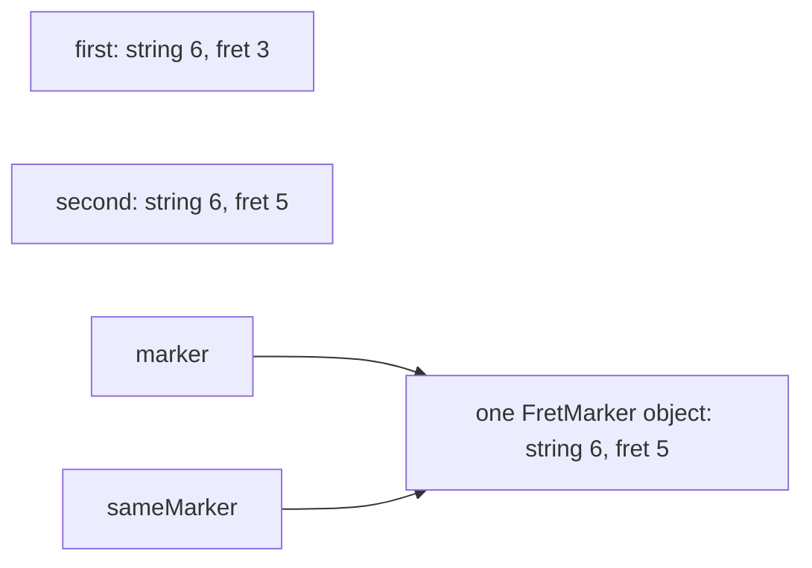

In lesson 5, two class variables could refer to the same object, and a change made through one was visible through the other. Many things a program handles are plain data instead: a position on the neck, a note, the quality of a chord. For them, sharing one object is rarely what you want. C# has three other kinds of types for this: the [**struct**](https://learn.microsoft.com/dotnet/csharp/language-reference/builtin-types/struct), copied whole each time it is assigned; the [**record**](https://learn.microsoft.com/dotnet/csharp/language-reference/builtin-types/record), compared by its data; and the [**enum**](https://learn.microsoft.com/dotnet/csharp/language-reference/builtin-types/enum), a fixed list of named choices.

Every program of this lesson is in [`code/csharp-beginner`](https://github.com/spareilleux/learn/tree/main/code/csharp-beginner); run one with [`dotnet run`](https://learn.microsoft.com/dotnet/core/tools/dotnet-run) followed by its path, such as `examples/l06_copies.cs`. `check.sh` compares their outputs, and the compiler errors of the rejected snippets, with the files in `expected/`.

## Value types and reference types

`FretPosition` below is a struct and `FretMarker` a class. They hold the same two numbers, and the program does the same things to both:

```csharp
// A struct is a value type: assigning it copies the data
FretPosition first = new FretPosition(6, 3);    // G on the low E string
FretPosition second = first;
second.Fret = 5;
Console.WriteLine($"first: string {first.StringNumber}, fret {first.Fret}");
Console.WriteLine($"second: string {second.StringNumber}, fret {second.Fret}");

// A class is a reference type: assigning it copies the reference (lesson 5)
FretMarker marker = new FretMarker(6, 3);
FretMarker sameMarker = marker;
sameMarker.Fret = 5;
Console.WriteLine($"marker: string {marker.StringNumber}, fret {marker.Fret}");

// A method receives a copy of a struct, and a copy of the reference to an object
MoveUpOctave(first);
MoveMarkerUpOctave(marker);
Console.WriteLine($"after the methods: first at fret {first.Fret}, marker at fret {marker.Fret}");

// Equals compares the fields of a struct, the references of a class
Console.WriteLine($"first.Equals(new FretPosition(6, 3)): {first.Equals(new FretPosition(6, 3))}");
Console.WriteLine($"marker.Equals(new FretMarker(6, 17)): {marker.Equals(new FretMarker(6, 17))}");

void MoveUpOctave(FretPosition position) => position.Fret += 12;
void MoveMarkerUpOctave(FretMarker target) => target.Fret += 12;

struct FretPosition
{
    public int StringNumber { get; set; }
    public int Fret { get; set; }

    public FretPosition(int stringNumber, int fret)
    {
        StringNumber = stringNumber;
        Fret = fret;
    }
}

sealed class FretMarker
{
    public int StringNumber { get; set; }
    public int Fret { get; set; }

    public FretMarker(int stringNumber, int fret)
    {
        StringNumber = stringNumber;
        Fret = fret;
    }
}
```

```text
first: string 6, fret 3
second: string 6, fret 5
marker: string 6, fret 5
after the methods: first at fret 3, marker at fret 17
first.Equals(new FretPosition(6, 3)): True
marker.Equals(new FretMarker(6, 17)): False
```

A struct is a [**value type**](https://learn.microsoft.com/dotnet/csharp/language-reference/builtin-types/value-types): the variable holds the data itself. `second = first` copies the two numbers into `second`, so changing `second` leaves `first` alone. A class is a [**reference type**](https://learn.microsoft.com/dotnet/csharp/language-reference/keywords/reference-types): the variable holds a reference to an object, and `sameMarker = marker` copies the reference. There is still one marker, and both variables see it move.



Methods follow the same rule. `MoveUpOctave` receives a copy of `first` and moves the copy, which disappears when the method returns: `first` is still at fret 3. `MoveMarkerUpOctave` receives a copy of the reference, so it moves the one marker, from fret 5 to 17. Lesson 4 showed the same thing with an `int` and an array: the numeric types of lesson 2, `bool` and `char` are structs; `string`, arrays and `List<T>` are classes.

Comparison follows it too. A struct's `Equals` compares the fields one by one ([`ValueType.Equals`](https://learn.microsoft.com/dotnet/api/system.valuetype.equals)), so two separate positions on string 6, fret 3 are equal. A class's `Equals` compares references: a new marker at the same place is another object, so it's not equal.

### Two mistakes with structs

A struct you declare has no `==` operator, unless you write one. The rejected snippet `compile_fail/l06_struct_equals.cs` tries it:

```csharp
FretPosition first = new FretPosition(6, 3);
Console.WriteLine(first == new FretPosition(6, 3));
```

```text
l06_struct_equals.cs(2,19): error CS0019: Operator '==' cannot be applied to operands of type 'FretPosition' and 'FretPosition'
```

The second mistake comes with lists. `shape[0]` asks the [`List<T>`](https://learn.microsoft.com/dotnet/api/system.collections.generic.list-1) for its first item, and for a struct the list returns a copy. Changing a copy that is thrown away at once would change nothing, so the compiler refuses it (`compile_fail/l06_list_struct_element.cs`):

```csharp
List<FretPosition> shape = [new FretPosition(6, 3), new FretPosition(5, 5)];
shape[0].Fret = 5;
```

```text
l06_list_struct_element.cs(2,1): error CS1612: Cannot modify the return value of 'List<FretPosition>.this[int]' because it is not a variable
```

Read the item into a variable, change the variable, and store it back with `shape[0] = position;`. Exercise 3 does the same in one step, with `with`.

The structs of this section are mutable only to show the copy. Microsoft's guidelines on [choosing between a class and a struct](https://learn.microsoft.com/dotnet/standard/design-guidelines/choosing-between-class-and-struct) advise a struct only for a small value that doesn't change once created, and a [`readonly struct`](https://learn.microsoft.com/dotnet/csharp/language-reference/builtin-types/struct#readonly-struct) makes the compiler enforce that. The next section shows the short way to write one.

## Records: compared by their data

A record declares, in one line, a type made of named values:

```csharp
// A record: the compiler writes the constructor, the properties, ToString and equality
Note c4 = new Note("C", 4);
Note middleC = new Note("C", 4);
Note c5 = c4 with { Octave = 5 };    // a copy with one property changed

Console.WriteLine(c4);
Console.WriteLine(c5);
Console.WriteLine($"c4 == middleC: {c4 == middleC}");
Console.WriteLine($"same object: {ReferenceEquals(c4, middleC)}");
Console.WriteLine($"c4 == c5: {c4 == c5}");

// A class with the same data compares references
NoteObject a = new NoteObject("C", 4);
NoteObject b = new NoteObject("C", 4);
Console.WriteLine($"two NoteObject: {a == b}");

// A record struct is a value type with the same conveniences
Position g = new Position(6, 3);
Position a2 = g with { Fret = 5 };
Console.WriteLine($"{g} -> {a2}");
Console.WriteLine($"g == new Position(6, 3): {g == new Position(6, 3)}");

record Note(string Name, int Octave);

readonly record struct Position(int StringNumber, int Fret);

sealed class NoteObject
{
    public string Name { get; }
    public int Octave { get; }

    public NoteObject(string name, int octave)
    {
        Name = name;
        Octave = octave;
    }
}
```

```text
Note { Name = C, Octave = 4 }
Note { Name = C, Octave = 5 }
c4 == middleC: True
same object: False
c4 == c5: False
two NoteObject: False
Position { StringNumber = 6, Fret = 3 } -> Position { StringNumber = 6, Fret = 5 }
g == new Position(6, 3): True
```

`record Note(string Name, int Octave);` gives `Note` a constructor with two parameters, a public property for each, a `ToString` that prints them, and an `Equals` and an `==` that compare them. Compare it with the eleven lines of `NoteObject`, which still has no `ToString` and compares references.

A `record` is a class: `c4` and `middleC` are two objects, as [`ReferenceEquals`](https://learn.microsoft.com/dotnet/api/system.object.referenceequals) confirms, and yet `c4 == middleC` is `True`, because their data is the same. The [`with` expression](https://learn.microsoft.com/dotnet/csharp/language-reference/operators/with-expression) makes a copy with some properties changed: `c5` is a new note, and `c4` is still in octave 4.

`readonly record struct Position(...)` is the same idea for a value type: copied on assignment like the structs of the previous section, with a `==` and a readable `ToString`, and properties that can't change once the value is built.

The properties of `Note` are **init-only**: they can be given a value while the record is created, never after. The rejected snippet `compile_fail/l06_record_init_only.cs` tries `c4.Octave = 5;`:

```text
l06_record_init_only.cs(2,1): error CS8852: Init-only property or indexer 'Note.Octave' can only be assigned in an object initializer, or on 'this' or 'base' in an instance constructor or an 'init' accessor.
```

To get a note in another octave, write `c4 with { Octave = 5 }`. In a plain `record struct`, without `readonly`, the properties declared between the parentheses can change after creation; the [records page](https://learn.microsoft.com/dotnet/csharp/language-reference/builtin-types/record) lists the differences.

[Guitar Alchemist](https://github.com/GuitarAlchemist/ga) declares its fretboard positions this way: [`public readonly record struct PositionLocation(Str Str, Fret Fret)`](https://github.com/GuitarAlchemist/ga/blob/5c3a52ab40d0d433f8f68dbbd0590f70c8d8cf26/Common/GA.Domain.Core/Instruments/Positions/PositionLocation.cs#L5), at commit `5c3a52a`. Its `Str` and [`Fret`](https://github.com/GuitarAlchemist/ga/blob/5c3a52ab40d0d433f8f68dbbd0590f70c8d8cf26/Common/GA.Domain.Core/Instruments/Primitives/Fret.cs#L16) are themselves `readonly record struct` types, rather than bare `int`s.

## Enums: a fixed set of names

A chord's quality is one of a few choices: major, minor, diminished… An `enum` gives each choice a name:

```csharp
// An enum names a fixed set of choices; each name stands for a number
ChordQuality quality = ChordQuality.Minor;
Console.WriteLine(quality);
Console.WriteLine((int)quality);
Console.WriteLine($"A{Suffix(quality)}");

foreach (ChordQuality q in Enum.GetValues<ChordQuality>())
{
    Console.WriteLine($"{(int)q} {q}: C{Suffix(q)}");
}

ChordQuality unset = default;               // the value 0
ChordQuality zero = 0;                      // the literal 0 converts without a cast
Console.WriteLine($"default: {unset}, 0: {zero}");

ChordQuality strange = (ChordQuality)7;     // a cast accepts any int
Console.WriteLine($"cast from 7: {strange}, defined: {Enum.IsDefined(strange)}");

ChordQuality parsed = Enum.Parse<ChordQuality>("Diminished");
Console.WriteLine($"parsed: {parsed} = {(int)parsed}");

string Suffix(ChordQuality q) => q switch
{
    ChordQuality.Major => "",
    ChordQuality.Minor => "m",
    ChordQuality.Diminished => "dim",
    ChordQuality.Augmented => "aug",
    _ => "?",
};

enum ChordQuality
{
    Other,
    Major,
    Minor,
    Diminished,
    Augmented,
}
```

```text
Minor
2
Am
0 Other: C?
1 Major: C
2 Minor: Cm
3 Diminished: Cdim
4 Augmented: Caug
default: Other, 0: Other
cast from 7: 7, defined: False
parsed: Diminished = 3
```

Each name stands for an `int`, numbered from 0 in the order of the declaration: `Minor` is 2. `Console.WriteLine` prints the name, and the cast `(int)` gives the number. [`Enum.GetValues<ChordQuality>()`](https://learn.microsoft.com/dotnet/api/system.enum.getvalues) lists the values, sorted by their number, and [`Enum.Parse`](https://learn.microsoft.com/dotnet/api/system.enum.parse) turns a name written as text back into a value. A `switch` expression, from lesson 3, is the usual way to give each choice its own result.

An enum is a value type, and its default value is 0, the first name. Microsoft's [enum design guidelines](https://learn.microsoft.com/dotnet/standard/design-guidelines/enum) therefore ask for a member worth zero that makes sense as a default. Guitar Alchemist's [`ChordQuality`](https://github.com/GuitarAlchemist/ga/blob/5c3a52ab40d0d433f8f68dbbd0590f70c8d8cf26/Common/GA.Domain.Core/Theory/Harmony/ChordQuality.cs#L10-L23) starts with `Other` for that reason; this lesson's smaller enum copies the idea.

Numbers and names don't mix freely. The literal `0` converts to any enum on its own, as `zero` shows, but any other number needs a cast. The rejected snippet `compile_fail/l06_int_to_enum.cs` writes `ChordQuality quality = 2;`:

```text
l06_int_to_enum.cs(1,24): error CS0266: Cannot implicitly convert type 'int' to 'ChordQuality'. An explicit conversion exists (are you missing a cast?)
```

The cast, in turn, checks nothing: `(ChordQuality)7` is accepted and prints `7`, a value with no name. [`Enum.IsDefined`](https://learn.microsoft.com/dotnet/api/system.enum.isdefined) says whether a value has a name. The [enum reference](https://learn.microsoft.com/dotnet/csharp/language-reference/builtin-types/enum#implicit-conversions-from-zero) warns about both conversions.

### A switch expression over an enum still needs `_`

Because an enum can hold numbers without a name, a `switch` expression with one arm per name is still not complete. `examples/l06_enum_switch_warning.cs`:

```csharp
ChordQuality quality = (ChordQuality)7;

// Every name has an arm, and still the compiler warns: an enum can hold other numbers
string suffix = quality switch
{
    ChordQuality.Other => "?",
    ChordQuality.Major => "",
    ChordQuality.Minor => "m",
    ChordQuality.Diminished => "dim",
    ChordQuality.Augmented => "aug",
};
Console.WriteLine(suffix);
```

```text
l06_enum_switch_warning.cs(4,25): warning CS8524: The switch expression does not handle some values of its input type (it is not exhaustive) involving an unnamed enum value. For example, the pattern '(ChordQuality)5' is not covered.
Unhandled exception. System.Runtime.CompilerServices.SwitchExpressionException: Non-exhaustive switch expression failed to match its input.
Unmatched value was 7.
```

The lines of the stack trace, which start with `at`, are left out. The warning is [CS8524](https://learn.microsoft.com/dotnet/csharp/language-reference/compiler-messages/pattern-matching-warnings), a cousin of lesson 3's CS8509. Its example, `(ChordQuality)5`, is the first number after the last name, not the 7 that the program fails on. The `_ => "?"` arm of `Suffix` above handles both.

## Exercises

### Exercise 1 — predict the copies

Without running it, predict what `exercises/l06_ex_predict.cs` prints. `Tempo` is a struct, `Metronome` a class.

```csharp
Tempo a = new Tempo(120);
Tempo b = a;
b.Bpm = 90;

Metronome m1 = new Metronome(120);
Metronome m2 = m1;
m2.Bpm = 90;

Console.WriteLine($"{a.Bpm} {b.Bpm} {m1.Bpm} {m2.Bpm}");

struct Tempo
{
    public int Bpm { get; set; }

    public Tempo(int bpm) => Bpm = bpm;
}

sealed class Metronome
{
    public int Bpm { get; set; }

    public Metronome(int bpm) => Bpm = bpm;
}
```

<details>
<summary>Solution</summary>

```text
120 90 90 90
```

`b = a` copies the tempo: `a` keeps 120. `m2 = m1` copies the reference: there is one metronome, and it's at 90 through both variables.

</details>

### Exercise 2 — the chords of C major

Declare an enum `ChordQuality` with `Other`, `Major`, `Minor` and `Diminished`, and a record `Chord(string Root, ChordQuality Quality)` with a `Symbol()` method that returns `C`, `Dm` or `Bdim`. Put the seven chords of C major in a `List<Chord>`, print their symbols on one line, then check with [`Contains`](https://learn.microsoft.com/dotnet/api/system.collections.generic.list-1.contains) whether the list holds a new `Chord("A", ChordQuality.Minor)`, and the same chord made major with `with`. The tested solution is `exercises/l06_ex_chords.cs`.

<details>
<summary>Solution</summary>

```csharp
List<Chord> cMajor =
[
    new Chord("C", ChordQuality.Major),
    new Chord("D", ChordQuality.Minor),
    new Chord("E", ChordQuality.Minor),
    new Chord("F", ChordQuality.Major),
    new Chord("G", ChordQuality.Major),
    new Chord("A", ChordQuality.Minor),
    new Chord("B", ChordQuality.Diminished),
];

List<string> symbols = [];
foreach (Chord chord in cMajor)
{
    symbols.Add(chord.Symbol());
}
Console.WriteLine(string.Join(" ", symbols));

Chord am = new Chord("A", ChordQuality.Minor);
Chord aMajor = am with { Quality = ChordQuality.Major };
Console.WriteLine($"Contains {am.Symbol()}: {cMajor.Contains(am)}");
Console.WriteLine($"Contains {aMajor.Symbol()}: {cMajor.Contains(aMajor)}");

record Chord(string Root, ChordQuality Quality)
{
    public string Symbol() => Quality switch
    {
        ChordQuality.Major => Root,
        ChordQuality.Minor => $"{Root}m",
        ChordQuality.Diminished => $"{Root}dim",
        _ => $"{Root}?",
    };
}

enum ChordQuality
{
    Other,
    Major,
    Minor,
    Diminished,
}
```

```text
C Dm Em F G Am Bdim
Contains Am: True
Contains A: False
```

`Contains` compares with `Equals`. The `am` object was never put in the list, but a record compares data, so it finds the list's own A minor. With a class that compares references, like `NoteObject`, the same search answers `False`. A record can have methods after its declaration line, between braces, like a class.

</details>

### Exercise 3 — move a chord shape

`List<Position> shape = [new Position(6, 3), new Position(5, 5), new Position(4, 5)];` is a G5 power chord, with `readonly record struct Position(int StringNumber, int Fret)`. Move the shape two frets up, to A5, and print it as `6:5 5:7 4:7`. `shape[i].Fret += 2` is rejected: `Position`'s properties are init-only, and the compiler answers with the CS8852 error of the records section (`compile_fail/l06_readonly_position.cs`). The tested solution is `exercises/l06_ex_move_shape.cs`.

<details>
<summary>Solution</summary>

```csharp
// G5, a power chord: string 6 fret 3, string 5 fret 5, string 4 fret 5
List<Position> shape = [new Position(6, 3), new Position(5, 5), new Position(4, 5)];

// shape[i].Fret += 2 is rejected: replace each element with a moved copy
for (int i = 0; i < shape.Count; i++)
{
    shape[i] = shape[i] with { Fret = shape[i].Fret + 2 };
}

List<string> cells = [];
foreach (Position p in shape)
{
    cells.Add($"{p.StringNumber}:{p.Fret}");
}
Console.WriteLine(string.Join(" ", cells));

readonly record struct Position(int StringNumber, int Fret);
```

```text
6:5 5:7 4:7
```

`with` builds a moved copy, and `shape[i] = …` stores it in place of the old item. With a `readonly` type, it's the only way: even a local `Position` variable can't have its `Fret` changed, and the compiler answers CS8852 again.

</details>

## Check your understanding

- A struct is a value type: assigning it, or passing it to a method, copies the data.
- A class is a reference type: assigning it copies the reference, and both variables reach the same object.
- A record compares its data with `==` and `Equals`, prints it with `ToString`, and makes modified copies with `with`.
- An enum names a fixed set of choices; each name stands for a number, and the default is 0.
- A cast to an enum accepts any number: check with `Enum.IsDefined`, and give a `switch` expression a `_` arm.

Next: [interfaces and inheritance](../07-interfaces-and-inheritance/), where classes start sharing behavior.

## Sources

- [Value types](https://learn.microsoft.com/dotnet/csharp/language-reference/builtin-types/value-types), [reference types](https://learn.microsoft.com/dotnet/csharp/language-reference/keywords/reference-types), [structure types](https://learn.microsoft.com/dotnet/csharp/language-reference/builtin-types/struct), [default values](https://learn.microsoft.com/dotnet/csharp/language-reference/builtin-types/default-values)
- [Records](https://learn.microsoft.com/dotnet/csharp/language-reference/builtin-types/record), [records in C# fundamentals](https://learn.microsoft.com/dotnet/csharp/fundamentals/types/records), [the `with` expression](https://learn.microsoft.com/dotnet/csharp/language-reference/operators/with-expression)
- [Equality comparisons](https://learn.microsoft.com/dotnet/csharp/programming-guide/statements-expressions-operators/equality-comparisons), [equality operators](https://learn.microsoft.com/dotnet/csharp/language-reference/operators/equality-operators), [`ValueType.Equals`](https://learn.microsoft.com/dotnet/api/system.valuetype.equals), [`Object.ReferenceEquals`](https://learn.microsoft.com/dotnet/api/system.object.referenceequals)
- [Enumeration types](https://learn.microsoft.com/dotnet/csharp/language-reference/builtin-types/enum), [`Enum.GetValues`](https://learn.microsoft.com/dotnet/api/system.enum.getvalues), [`Enum.IsDefined`](https://learn.microsoft.com/dotnet/api/system.enum.isdefined), [`Enum.Parse`](https://learn.microsoft.com/dotnet/api/system.enum.parse)
- Design guidelines: [choosing between class and struct](https://learn.microsoft.com/dotnet/standard/design-guidelines/choosing-between-class-and-struct), [enum design](https://learn.microsoft.com/dotnet/standard/design-guidelines/enum)
- [Compiler warning CS8524](https://learn.microsoft.com/dotnet/csharp/language-reference/compiler-messages/pattern-matching-warnings)
