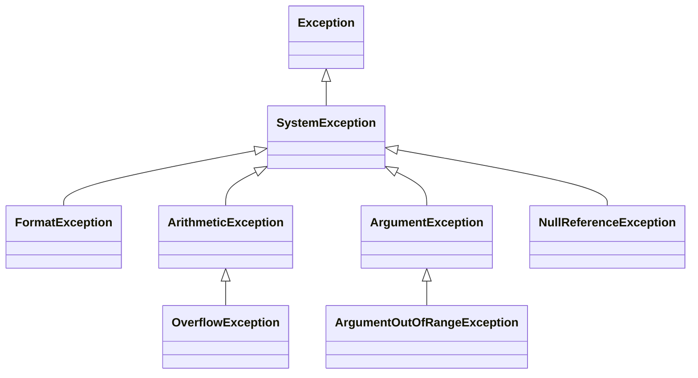

Several programs of the earlier lessons ended with `Unhandled exception`: a `switch` with no matching arm in lesson 3, an index past the end of an array and a `null` string in lesson 4. An [**exception**](https://learn.microsoft.com/dotnet/csharp/fundamentals/exceptions/) is how .NET reports an error that happens while a program runs. This lesson shows how to catch one and carry on, how to make sure some code always runs, and how to throw one yourself. Its second half returns to `null`: the compiler can find most of the `null` values that would crash a program, if you read its warnings.

All the programs of this lesson are in [`code/csharp-beginner`](https://github.com/spareilleux/learn/tree/main/code/csharp-beginner); run one with [`dotnet run`](https://learn.microsoft.com/dotnet/core/tools/dotnet-run) followed by its path, for example `examples/l08_try_catch.cs`. `check.sh` compares their output, and the compiler errors of the rejected snippets, with the files in `expected/`.

## Catching an exception: try and catch

[`int.Parse`](https://learn.microsoft.com/dotnet/api/system.int32.parse), seen in lesson 2, throws an exception when its text isn't a number. A [`try` statement](https://learn.microsoft.com/dotnet/csharp/language-reference/statements/exception-handling-statements) catches it:

```csharp
// int.Parse throws an exception when the text is not a number: catch handles it, and the loop goes on
string[] inputs = ["5", "twelve", "99999999999", ""];

foreach (string text in inputs)
{
    try
    {
        int fret = int.Parse(text);
        Console.WriteLine($"'{text}': fret {fret}");
    }
    catch (FormatException ex)
    {
        Console.WriteLine($"'{text}': not a number ({ex.Message})");
    }
    catch (OverflowException)
    {
        Console.WriteLine($"'{text}': too large for an int");
    }
}

Console.WriteLine("done");
```

```text
'5': fret 5
'twelve': not a number (The input string 'twelve' was not in a correct format.)
'99999999999': too large for an int
'': not a number (The input string '' was not in a correct format.)
done
```

The `try` block holds the code that may fail. When a statement in it throws, the rest of the block is skipped: for `twelve`, the line that prints the fret never runs. C# then looks at the `catch` clauses in order and runs the first one whose type matches the exception: a [`FormatException`](https://learn.microsoft.com/dotnet/api/system.formatexception) for a text that isn't a number, an [`OverflowException`](https://learn.microsoft.com/dotnet/api/system.overflowexception) for a number too large for an `int`. After the `catch` block, the program goes on after the whole `try` statement, here with the next text of the loop, and it reaches `done`.

`catch (FormatException ex)` names the exception object `ex`; its [`Message`](https://learn.microsoft.com/dotnet/api/system.exception.message) property describes the error. `catch (OverflowException)` gives no name, because that block doesn't need the object.

If no `catch` matches, the exception leaves the method and goes to the code that called it, then to that code's caller, and so on. If nothing catches it, the program stops with `Unhandled exception`, as in lessons 3 and 4.

### Exceptions are classes

An exception is an object, and its type is a class derived from [`Exception`](https://learn.microsoft.com/dotnet/api/system.exception), as in lesson 7. Here are the exceptions of this course and their base classes:



A `catch` clause also catches the classes derived from its type, so `catch (Exception)` catches them all. That is why the order of the clauses matters. In `compile_fail/l08_catch_order.cs`, `catch (Exception)` comes first, and the `FormatException` clause after it could never run:

```csharp
try
{
    Console.WriteLine(int.Parse("twelve"));
}
catch (Exception)
{
    Console.WriteLine("something went wrong");
}
catch (FormatException)
{
    Console.WriteLine("not a number");
}
```

```text
l08_catch_order.cs(9,8): error CS0160: A previous catch clause already catches all exceptions of this or of a super type ('Exception')
```

Put the most specific types first. A `catch (Exception)` that hides every error behind one vague message makes bugs hard to find: catch the exceptions you know how to handle.

A second mistake: a variable assigned inside a `try` block may still have no value after it. In `compile_fail/l08_unassigned_after_try.cs`, if `int.Parse` throws, `fret` never gets one:

```csharp
int fret;
try
{
    fret = int.Parse("twelve");
}
catch (FormatException)
{
    Console.WriteLine("not a number");
}
Console.WriteLine(fret);
```

```text
l08_unassigned_after_try.cs(10,19): error CS0165: Use of unassigned local variable 'fret'
```

Give the variable a value where you declare it, use it inside the `try` block, or use the `int.TryParse` of lesson 2, which doesn't throw at all.

## finally: code that always runs

A `finally` block runs when the `try` statement ends, whatever the way: normally, through a `return`, after a `catch`, or with an exception that leaves the method.

```csharp
// finally runs in every case: after a return, after a catch, and before an exception leaves the method
Console.WriteLine(Tune("440"));
Console.WriteLine(Tune("A4"));

try
{
    Console.WriteLine(Tune("99999999999"));
}
catch (OverflowException)
{
    Console.WriteLine("caught by the caller: too large");
}

string Tune(string frequency)
{
    Console.WriteLine("tuner on");
    try
    {
        int hertz = int.Parse(frequency);
        return $"tuned to {hertz} Hz";
    }
    catch (FormatException)
    {
        return $"'{frequency}' is not a frequency";
    }
    finally
    {
        Console.WriteLine("tuner off");
    }
}
```

```text
tuner on
tuner off
tuned to 440 Hz
tuner on
tuner off
'A4' is not a frequency
tuner on
tuner off
caught by the caller: too large
```

`tuner off` comes before `tuned to 440 Hz`: the method computes its return value, runs `finally`, and only then returns the value that the caller prints. For `A4`, the `catch` returns a message, and `finally` runs again. For `99999999999`, `Tune` has no `catch` for an `OverflowException`: `finally` still runs, then the exception leaves `Tune`, and the caller's `catch` handles it.

`finally` is for releasing what a method took, whatever happens: turning off the tuner here, closing a file in lesson 10.

## throw: when a method can't do its job

A method can throw an exception itself, with [`throw`](https://learn.microsoft.com/dotnet/csharp/language-reference/statements/exception-handling-statements#the-throw-statement). It does so when it can't do what it was asked, instead of returning a wrong answer:

```csharp
// A method that cannot do its job throws an exception instead of returning a wrong answer
string[] standard = ["E2", "A2", "D3", "G3", "B3", "E4"];

Console.WriteLine(NoteOfString(standard, 6));
Console.WriteLine(NoteOfString(standard, 1));

try
{
    Console.WriteLine(NoteOfString(standard, 7));
}
catch (ArgumentOutOfRangeException ex)
{
    Console.WriteLine(ex.Message);
}

// Strings are numbered from 1, the highest, to 6, the lowest
string NoteOfString(string[] tuning, int stringNumber)
{
    if (stringNumber < 1 || stringNumber > tuning.Length)
    {
        throw new ArgumentOutOfRangeException(nameof(stringNumber), stringNumber, $"This tuning has strings 1 to {tuning.Length}.");
    }
    return tuning[tuning.Length - stringNumber];
}
```

```text
E2
E4
This tuning has strings 1 to 6. (Parameter 'stringNumber')
Actual value was 7.
```

`throw` creates an exception object with `new` and sends it up, like the exceptions of .NET. [`ArgumentOutOfRangeException`](https://learn.microsoft.com/dotnet/api/system.argumentoutofrangeexception) is the usual type for an argument outside its valid range; it receives the name of the parameter, its value and a message, and its `Message` adds the first two to the text. [`nameof(stringNumber)`](https://learn.microsoft.com/dotnet/csharp/language-reference/operators/nameof) gives the text `"stringNumber"`, and stays right if you rename the parameter.

Without the check, `NoteOfString(standard, 7)` would compute index `-1` and fail with an `IndexOutOfRangeException` about an array the caller never saw. With it, the error names the argument that is wrong. For the most common checks, `ArgumentOutOfRangeException` has methods that do the `if` and the `throw` in one line, such as [`ThrowIfNegative`](https://learn.microsoft.com/dotnet/api/system.argumentoutofrangeexception.throwifnegative) and [`ThrowIfGreaterThan`](https://learn.microsoft.com/dotnet/api/system.argumentoutofrangeexception.throwifgreaterthan); exercises 1 and 2 use them.

Only an exception can be thrown. `compile_fail/l08_throw_string.cs` tries `throw "fret out of range";`:

```text
l08_throw_string.cs(1,7): error CS0029: Cannot implicitly convert type 'string' to 'System.Exception'
```

When should a method throw, and when should it return a value that says it failed? An exception is for a call that shouldn't have happened, like string 7 on a six-string guitar. When a failure is ordinary, like a user typing a wrong number, a method that reports it is better: lesson 2's `int.TryParse` returns `false` instead of throwing. The .NET guide to [best practices for exceptions](https://learn.microsoft.com/dotnet/standard/exceptions/best-practices-for-exceptions#call-try-methods-to-avoid-exceptions) recommends these *Try* methods. Guitar Alchemist offers both for its frets: at commit `5c3a52a`, the [`Fret` constructor](https://github.com/GuitarAlchemist/ga/blob/5c3a52ab40d0d433f8f68dbbd0590f70c8d8cf26/Common/GA.Domain.Core/Instruments/Primitives/Fret.cs#L35-L43) checks that the number is between -1 (muted) and 36 and documents an `ArgumentOutOfRangeException`, while [`Fret.TryCreate`](https://github.com/GuitarAlchemist/ga/blob/5c3a52ab40d0d433f8f68dbbd0590f70c8d8cf26/Common/GA.Domain.Core/Instruments/Primitives/Fret.cs#L92-L94) returns a result that holds either the fret or an error message. A probe at that commit confirmed both, and found the same check behind `Fret.FromValue(50)` and the implicit conversion `Fret f = 50;`: all three throw an `ArgumentOutOfRangeException`, while `Fret.TryCreate(50)` returns the error `Fret number must be between -1 (muted) and 36, got 50`.

## Null safety: let the compiler find the nulls

Lesson 4 introduced `string?`, the operators `?.` and `??`, and the warning CS8602. A [`NullReferenceException`](https://learn.microsoft.com/dotnet/api/system.nullreferenceexception) is the exception you get when a program reads a member of `null`. The compiler's [nullable analysis](https://learn.microsoft.com/dotnet/csharp/nullable-references) warns about it before the program runs, but not always on the line that crashes. `examples/l08_null_warnings.cs` runs with no input:

```csharp
string? answer = Console.ReadLine();     // no input: ReadLine returns null
string title = answer;                   // a string? goes into a string

Song song = new Song();
Console.WriteLine(song.Title.Length);    // no warning on this line, and yet Title is null

class Song
{
    public string Title { get; set; }    // no constructor sets it
}
```

```text
l08_null_warnings.cs(2,16): warning CS8600: Converting null literal or possible null value to non-nullable type.
l08_null_warnings.cs(9,19): warning CS8618: Non-nullable property 'Title' must contain a non-null value when exiting constructor. Consider adding the 'required' modifier or declaring the property as nullable.
Unhandled exception. System.NullReferenceException: Object reference not set to an instance of an object.
```

The compiler lists them in line order on Linux, but Windows and macOS print the CS8618 warning first: the order can change, the warnings do not. Two warnings, two different problems:

- **CS8600** on line 2: `answer` may be `null`, and `title` is a `string`, a type that promises not to hold `null`. The promise is broken where the value goes in.
- **CS8618** on line 9: `Title` is a `string`, but no constructor gives it a value, so a new `Song` has a `Title` that is `null`. The warning sits on the property's declaration. The line that reads `song.Title.Length` gets no warning, because the compiler trusts the type `string` there, and that is the line that crashes.

A nullable warning points at the place where `null` gets in, which can be far from the place where it does damage. Read every one. The [list of nullable warnings](https://learn.microsoft.com/dotnet/csharp/language-reference/compiler-messages/nullable-warnings) explains each, with its usual fixes. Here, `examples/l08_null_fixed.cs` fixes both:

```csharp
// The same program without warnings: ?? gives a value, required makes the caller set Title
string title = Console.ReadLine() ?? "untitled";

Song song = new Song { Title = title };
Console.WriteLine($"{song.Title}: {song.Title.Length} letters");

class Song
{
    public required string Title { get; init; }
}
```

```text
untitled: 8 letters
```

`??` replaces a `null` answer with `"untitled"`, so `title` is never `null`. The [`required`](https://learn.microsoft.com/dotnet/csharp/language-reference/keywords/required) modifier makes the compiler check that every `new Song` sets `Title`, in braces after the constructor call; that is why CS8618 suggests it. `compile_fail/l08_required_missing.cs` forgets it, with `new Song()` alone:

```text
l08_required_missing.cs(1,17): error CS9035: Required member 'Song.Title' must be set in the object initializer or attribute constructor.
```

A missing title is now an error at compile time instead of a crash at run time. Declaring the property `string?` would be the other fix, when a song without a title makes sense: then every use of `Title` has to handle `null`.

### `!` silences the warning, not the null

The [null-forgiving operator](https://learn.microsoft.com/dotnet/csharp/language-reference/operators/null-forgiving) `!`, after an expression, tells the compiler: "this isn't `null`, trust me". The warning disappears. The `null` doesn't:

```csharp
string? FindTuning(string name) => name == "standard" ? "E A D G B E" : null;

string tuning = FindTuning("drop D")!;   // ! silences the warning, not the null
Console.WriteLine(tuning.Length);
```

```text
Unhandled exception. System.NullReferenceException: Object reference not set to an instance of an object.
```

The program compiles without a warning and crashes, exactly like lesson 4's version that had a warning. Use `!` only when you know something the compiler can't see, and prefer `??`, an `if`, or a `string?` variable.

### Turning nullable warnings into errors

A warning doesn't stop the build, so it is easy to ignore. The `WarningsAsErrors` property turns warnings into errors, and its value `nullable` [selects all the nullable warnings](https://learn.microsoft.com/dotnet/csharp/language-reference/compiler-options/errors-warnings#warningsaserrors-and-warningsnotaserrors). A file-based app sets a property with a [`#:property`](https://learn.microsoft.com/dotnet/core/sdk/file-based-apps#property) line at the top; `compile_fail/l08_nullable_errors.cs` adds one to lesson 4's warning:

```csharp
#:property WarningsAsErrors=nullable
string? FindTuning(string name) => name == "standard" ? "E A D G B E" : null;

string? tuning = FindTuning("drop D");
Console.WriteLine(tuning.Length);
```

```text
l08_nullable_errors.cs(5,19): error CS8602: Dereference of a possibly null reference.
```

The same CS8602 is now an error, and the program doesn't run. In a project, the property goes in the `.csproj` file of lesson 1: `<WarningsAsErrors>nullable</WarningsAsErrors>`.

Guitar Alchemist made the opposite choice. At commit `5c3a52a`, its [`Directory.Build.props`](https://github.com/GuitarAlchemist/ga/blob/5c3a52ab40d0d433f8f68dbbd0590f70c8d8cf26/Directory.Build.props#L19-L21) puts fifteen nullable warnings in [`NoWarn`](https://learn.microsoft.com/dotnet/csharp/language-reference/compiler-options/errors-warnings#nowarn), the property that silences warnings, "to achieve a clean baseline", and its [`Directory.Build.targets`](https://github.com/GuitarAlchemist/ga/blob/5c3a52ab40d0d433f8f68dbbd0590f70c8d8cf26/Directory.Build.targets#L7) lists them a second time. The [journal](../journal/#2026-10-02--exceptions-and-null-safety) measured what they hide. With both lists removed, GA.Domain.Core and GA.Core compile without a single nullable warning: the lists hide nothing today. But a test file with seven nullable mistakes, added to GA.Domain.Core, compiled without a warning with the lists, and got its seven warnings without them. Silencing a warning also silences the mistakes still to come.

## Exercises

### Exercise 1 — where does the program go?

Without running it, predict the lines that `exercises/l08_ex_predict.cs` prints. `ThrowIfGreaterThan(fret, 24)` throws an `ArgumentOutOfRangeException` when `fret` is greater than 24.

```csharp
Console.WriteLine("start");
try
{
    Console.WriteLine(Check(3));
    Console.WriteLine(Check(30));
    Console.WriteLine("after 30");
}
catch (ArgumentOutOfRangeException)
{
    Console.WriteLine("out of range");
}
finally
{
    Console.WriteLine("finally");
}
Console.WriteLine("end");

string Check(int fret)
{
    ArgumentOutOfRangeException.ThrowIfGreaterThan(fret, 24);
    return $"fret {fret}";
}
```

<details>
<summary>Solution</summary>

```text
start
fret 3
out of range
finally
end
```

`Check(30)` throws inside the `try` block, so `after 30` is skipped. The `catch` matches, `finally` runs after it, and the program goes on with `end`: the exception was handled.

</details>

### Exercise 2 — a fret reader that doesn't stop

Read frets typed one per line until the end of the input. Write a method `ParseFret(string text)` that returns the fret, and throws when the text isn't a number or the fret is outside 0 to 24. The loop catches the exceptions, prints a line for each input, and at the end prints how many frets were valid and the highest one. With the lines `3`, `12`, `x`, `30`, `-1` and `7` as input (`input/l08_ex_frets.txt`), the program prints the output below. The tested solution is `exercises/l08_ex_frets.cs`.

<details>
<summary>Solution</summary>

```csharp
// Exercise 2: read frets, one per line, and report the bad ones without stopping
int valid = 0;
int highest = 0;
string? line;
while ((line = Console.ReadLine()) != null)
{
    try
    {
        int fret = ParseFret(line);
        valid++;
        highest = Math.Max(highest, fret);
        Console.WriteLine($"{line}: ok");
    }
    catch (FormatException)
    {
        Console.WriteLine($"{line}: not a number");
    }
    catch (ArgumentOutOfRangeException)
    {
        Console.WriteLine($"{line}: out of range (0 to 24)");
    }
}
Console.WriteLine($"{valid} valid frets, highest {highest}");

int ParseFret(string text)
{
    int fret = int.Parse(text);
    ArgumentOutOfRangeException.ThrowIfNegative(fret);
    ArgumentOutOfRangeException.ThrowIfGreaterThan(fret, 24);
    return fret;
}
```

```text
3: ok
12: ok
x: not a number
30: out of range (0 to 24)
-1: out of range (0 to 24)
7: ok
3 valid frets, highest 12
```

`ParseFret` doesn't catch anything: `int.Parse` throws the `FormatException` for `x`, and the two checks throw for `30` and `-1`. The loop decides what to do with each exception. `-1` is a valid `int`, so `int.Parse` accepts it, and `ThrowIfNegative` rejects it. When `valid++` runs, the fret has passed every check.

</details>

### Exercise 3 — remove the warnings

`exercises/l08_ex_null_start.cs` compiles with four warnings, then crashes:

```csharp
// Exercise 3, starting point: four warnings, then a crash
string? FindCapo(string song) => song == "Here Comes the Sun" ? "fret 7" : null;

Practice practice = new Practice();
practice.Song = "Blackbird";
string capo = FindCapo(practice.Song);
Console.WriteLine($"{practice.Song}: {capo.ToUpper()}");
Console.WriteLine($"notes: {practice.Notes.Length} letters");

class Practice
{
    public string Song { get; set; }
    public string Notes { get; set; }
}
```

```text
l08_ex_null_start.cs(6,15): warning CS8600: Converting null literal or possible null value to non-nullable type.
l08_ex_null_start.cs(7,39): warning CS8602: Dereference of a possibly null reference.
l08_ex_null_start.cs(12,19): warning CS8618: Non-nullable property 'Song' must contain a non-null value when exiting constructor. Consider adding the 'required' modifier or declaring the property as nullable.
l08_ex_null_start.cs(13,19): warning CS8618: Non-nullable property 'Notes' must contain a non-null value when exiting constructor. Consider adding the 'required' modifier or declaring the property as nullable.
Unhandled exception. System.NullReferenceException: Object reference not set to an instance of an object.
```

Fix it without using `!`: every practice has a song, but not always notes, and a song without a capo prints `NO CAPO`. Then try it on two practices, `Blackbird` without notes and `Here Comes the Sun` with the notes `strum lightly`. The tested solution is `exercises/l08_ex_null.cs`.

<details>
<summary>Solution</summary>

```csharp
// Exercise 3: the same program without a warning, and without !
string? FindCapo(string song) => song == "Here Comes the Sun" ? "fret 7" : null;

Practice[] week = [new Practice { Song = "Blackbird" }, new Practice { Song = "Here Comes the Sun", Notes = "strum lightly" }];

foreach (Practice practice in week)
{
    string capo = FindCapo(practice.Song) ?? "no capo";
    Console.WriteLine($"{practice.Song}: {capo.ToUpper()}");
    Console.WriteLine($"notes: {practice.Notes?.Length ?? 0} letters");
}

class Practice
{
    public required string Song { get; init; }
    public string? Notes { get; set; }
}
```

```text
Blackbird: NO CAPO
notes: 0 letters
Here Comes the Sun: FRET 7
notes: 13 letters
```

Each warning gets its own fix. `Song` is always there, so it becomes `required`. `Notes` may be missing, so it becomes `string?`, and the line that prints it handles `null` with `?.` and `??`. `FindCapo` may return `null`, so `??` gives `capo` a value. The crash of the starting program was on line 7, the line of the CS8602 warning: `capo` was `null` for `Blackbird`.

</details>

## Check your understanding

- `try` holds code that may fail; the first `catch` whose type matches handles the exception, and the program goes on after the `try` statement.
- A `catch` also catches the derived classes of its type: put the most specific types first (error CS0160).
- `finally` runs whatever happens: after a `return`, after a `catch`, or before an exception leaves the method.
- A method that can't do its job throws an exception, such as `ArgumentOutOfRangeException`; when failure is ordinary, a *Try* method that returns `false` is better.
- A nullable warning shows where `null` gets in, which isn't always where the program crashes. Fix it with `??`, `required`, `string?` or an `if`; `!` only hides it.
- `WarningsAsErrors` set to `nullable` turns the nullable warnings into errors.

Next: [collections and LINQ](../09-collections-and-linq/), to store and query many values at once.

## Sources

- [Exceptions and exception handling](https://learn.microsoft.com/dotnet/csharp/fundamentals/exceptions/), [exception-handling statements: `throw`, `try`, `catch`, `finally`](https://learn.microsoft.com/dotnet/csharp/language-reference/statements/exception-handling-statements), [best practices for exceptions](https://learn.microsoft.com/dotnet/standard/exceptions/best-practices-for-exceptions)
- Exception types: [`Exception`](https://learn.microsoft.com/dotnet/api/system.exception), [`Exception.Message`](https://learn.microsoft.com/dotnet/api/system.exception.message), [`FormatException`](https://learn.microsoft.com/dotnet/api/system.formatexception), [`OverflowException`](https://learn.microsoft.com/dotnet/api/system.overflowexception), [`ArgumentOutOfRangeException`](https://learn.microsoft.com/dotnet/api/system.argumentoutofrangeexception), [`NullReferenceException`](https://learn.microsoft.com/dotnet/api/system.nullreferenceexception)
- [`nameof`](https://learn.microsoft.com/dotnet/csharp/language-reference/operators/nameof), [`required`](https://learn.microsoft.com/dotnet/csharp/language-reference/keywords/required), [`init`](https://learn.microsoft.com/dotnet/csharp/language-reference/keywords/init), [the null-forgiving operator `!`](https://learn.microsoft.com/dotnet/csharp/language-reference/operators/null-forgiving), [`??`](https://learn.microsoft.com/dotnet/csharp/language-reference/operators/null-coalescing-operator)
- [Nullable reference types](https://learn.microsoft.com/dotnet/csharp/nullable-references), [nullable warnings](https://learn.microsoft.com/dotnet/csharp/language-reference/compiler-messages/nullable-warnings), [`WarningsAsErrors`](https://learn.microsoft.com/dotnet/csharp/language-reference/compiler-options/errors-warnings#warningsaserrors-and-warningsnotaserrors), [`#:property` in file-based apps](https://learn.microsoft.com/dotnet/core/sdk/file-based-apps#property)
- Compiler errors [CS0160](https://learn.microsoft.com/dotnet/csharp/misc/cs0160) and [CS0165](https://learn.microsoft.com/dotnet/csharp/language-reference/compiler-messages/cs0165)
