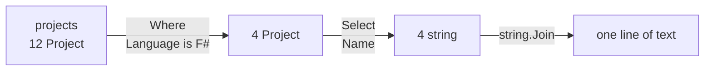

The `List<T>` of lesson 4 keeps its items in order and finds them by position. Two other collections answer other questions. A **dictionary** answers "what is the value for this name?", and a **set** answers "is this value in the group?". The second half of the lesson introduces **LINQ**, a set of methods that count, filter and sort a collection in one line each. With them, the loops that lesson 4 wrote by hand for Guitar Alchemist's projects become single lines.

All the programs of this lesson are in [`code/csharp-beginner`](https://github.com/spareilleux/learn/tree/main/code/csharp-beginner); run one with [`dotnet run`](https://learn.microsoft.com/dotnet/core/tools/dotnet-run) followed by its path, for example `examples/l09_dictionary.cs`. `check.sh` compares their output, and the compiler errors of the rejected snippets, with the files in `expected/`.

## Dictionary: a value for each key

A [`Dictionary<TKey, TValue>`](https://learn.microsoft.com/dotnet/api/system.collections.generic.dictionary-2) stores pairs: a **key**, and the **value** that goes with it. Each key appears only once. Its two types go between the angle brackets: `Dictionary<string, int>` has `string` keys and `int` values. Here the key is a note's name and the value is its number of semitones above C, the table that lesson 3 wrote as a `switch`:

```csharp
// A Dictionary<string, int>: each note's name (the key) gives its number of semitones above C (the value)
var semitones = new Dictionary<string, int>
{
    ["C"] = 0, ["D"] = 2, ["E"] = 4, ["F"] = 5, ["G"] = 7, ["A"] = 9, ["B"] = 11,
};
Console.WriteLine($"{semitones.Count} notes; G is {semitones["G"]} semitones above C");

semitones["F#"] = 6;            // a key that isn't there yet: added
semitones.Add("Bb", 10);        // Add also adds...
try
{
    semitones.Add("C", 0);      // ...but refuses a key that is already there
}
catch (ArgumentException ex)
{
    Console.WriteLine(ex.Message);
}
Console.WriteLine($"{semitones.Count} notes");

Console.WriteLine(semitones.ContainsKey("Bb"));
Console.WriteLine(semitones.ContainsKey("H"));   // H is B in German notation, not a key here

if (semitones.TryGetValue("H", out int h))
{
    Console.WriteLine($"H is {h} semitones above C");
}
else
{
    Console.WriteLine("no H in this dictionary");
}

Console.WriteLine(string.Join(" ", semitones));   // each item is a KeyValuePair<string, int>
```

```text
7 notes; G is 7 semitones above C
An item with the same key has already been added. Key: C
9 notes
True
False
no H in this dictionary
[C, 0] [D, 2] [E, 4] [F, 5] [G, 7] [A, 9] [B, 11] [F#, 6] [Bb, 10]
```

- `["C"] = 0` between the braces puts the value 0 under the key `"C"` when the dictionary is created.
- `semitones["G"]` reads the value of a key, with the same brackets as an array, but with a key instead of a position.
- `semitones["F#"] = 6` adds the key if it isn't there, and replaces its value if it is.
- [`Add`](https://learn.microsoft.com/dotnet/api/system.collections.generic.dictionary-2.add) adds a key too, but throws an [`ArgumentException`](https://learn.microsoft.com/dotnet/api/system.argumentexception) if the key is already there: the `catch` of lesson 8 prints its message.
- [`ContainsKey`](https://learn.microsoft.com/dotnet/api/system.collections.generic.dictionary-2.containskey) says whether a key is there.
- [`TryGetValue`](https://learn.microsoft.com/dotnet/api/system.collections.generic.dictionary-2.trygetvalue) is a *Try* method, like those of lesson 8: it returns `false` when the key is missing, and puts the value in its `out` variable when it is there.
- Each item of a dictionary is a [`KeyValuePair<string, int>`](https://learn.microsoft.com/dotnet/api/system.collections.generic.keyvaluepair-2), with a `Key` and a `Value`; `string.Join` prints it as `[key, value]`.

A dictionary holds the table as data, not as code: a program can fill it while it runs, and [lesson 10](../#outline) will fill one from a file.

A dictionary is read by key, not by position. Asking for item 0 of a dictionary whose keys are strings is a type error:

```csharp
var semitones = new Dictionary<string, int> { ["C"] = 0, ["D"] = 2, ["E"] = 4 };
Console.WriteLine(semitones[0]);
```

```text
l09_dictionary_by_position.cs(2,29): error CS1503: Argument 1: cannot convert from 'int' to 'string'
```

### A missing key throws an exception

Reading a key that isn't in the dictionary doesn't return 0 or `null`, it throws:

```csharp
// Reading a key that isn't in the dictionary throws an exception
var semitones = new Dictionary<string, int>
{
    ["C"] = 0, ["D"] = 2, ["E"] = 4, ["F"] = 5, ["G"] = 7, ["A"] = 9, ["B"] = 11,
};

string note = "H";
Console.WriteLine($"{note} is {semitones[note]} semitones above C");
```

```text
Unhandled exception. System.Collections.Generic.KeyNotFoundException: The given key 'H' was not present in the dictionary.
```

The rule of lesson 8 applies. When a missing key is a bug in the program, the indexer `semitones[note]` and its [`KeyNotFoundException`](https://learn.microsoft.com/dotnet/api/system.collections.generic.keynotfoundexception) are right: the program stops where the bug is. When a missing key is ordinary, like a note typed by a user, use `TryGetValue`.

### Counting with a dictionary

A dictionary can count: the key is what you count, the value is how many times you have seen it.

```csharp
// How many times each note appears in the first phrase of Beethoven's Ode to Joy
string[] melody = ["E", "E", "F", "G", "G", "F", "E", "D", "C", "C", "D", "E", "E", "D", "D"];

var counts = new Dictionary<string, int>();
foreach (string note in melody)
{
    counts[note] = counts.GetValueOrDefault(note) + 1;   // 0 + 1 the first time
}

foreach (var (note, count) in counts)
{
    Console.WriteLine($"{note}: {count}");
}
```

```text
E: 5
F: 2
G: 2
D: 4
C: 2
```

[`GetValueOrDefault`](https://learn.microsoft.com/dotnet/api/system.collections.generic.collectionextensions.getvalueordefault) returns the value of the key, or 0, the default value of an `int`, when the key isn't there yet. The first `E` therefore stores 0 + 1, and each later `E` replaces the count with one more. `foreach (var (note, count) in counts)` takes each `KeyValuePair` apart into two variables, its key and its value.

### Don't count on the order of a dictionary

The notes came out in the order of their first appearance: E, F, G, D, C. The documentation of `Dictionary` doesn't promise it: "The order in which the items are returned is undefined." Here is what .NET 10 does when a key is removed, then another added:

```csharp
// The order of a foreach over a dictionary: remove a key, add another
var semitones = new Dictionary<string, int> { ["C"] = 0, ["D"] = 2, ["E"] = 4, ["G"] = 7, ["A"] = 9 };
Console.WriteLine(string.Join(" ", semitones.Keys));

semitones.Remove("D");
semitones.Add("F#", 6);
Console.WriteLine(string.Join(" ", semitones.Keys));
```

```text
C D E G A
C F# E G A
```

`F#` was added last but comes second, in the place `D` left. As long as a program only adds keys, the order looks like the order of addition; one [`Remove`](https://learn.microsoft.com/dotnet/api/system.collections.generic.dictionary-2.remove) is enough to break that. When the order matters, sort: `OrderBy`, below, does it, and exercise 2 sorts the counts of the melody. The [journal](../journal/#2026-10-02--collections-and-linq) records this experiment, with the hypothesis written before running it.

## HashSet: each value once

A [`HashSet<T>`](https://learn.microsoft.com/dotnet/api/system.collections.generic.hashset-1) is a **set**: it holds each value at most once, and it answers "is this value in it?" quickly. The notes of a chord are a set: C major is C, E and G, whatever their order, and adding a second E doesn't change the chord.

```csharp
// A HashSet<string> holds each value once: the notes of a chord
HashSet<string> cMajor = ["C", "E", "G"];
HashSet<string> aMinor = ["A", "C", "E"];

Console.WriteLine(cMajor.Add("E"));     // False: E is already there
Console.WriteLine(cMajor.Add("B"));     // True: C E G B is Cmaj7
Console.WriteLine($"{cMajor.Count} notes, contains G: {cMajor.Contains("G")}");
cMajor.Remove("B");

// IntersectWith, UnionWith and ExceptWith change the set they are called on: work on a copy
var common = new HashSet<string>(cMajor);
common.IntersectWith(aMinor);
Console.WriteLine($"in both chords: {string.Join(" ", common)}");

var all = new HashSet<string>(cMajor);
all.UnionWith(aMinor);
Console.WriteLine($"in either chord: {string.Join(" ", all)}");

var onlyC = new HashSet<string>(cMajor);
onlyC.ExceptWith(aMinor);
Console.WriteLine($"only in C major: {string.Join(" ", onlyC)}");

HashSet<string> sameNotes = ["G", "C", "E"];
Console.WriteLine(cMajor.SetEquals(sameNotes));  // True: same notes, written in another order

HashSet<string> cSharp = ["C#", "F", "G#"];
HashSet<string> dFlat = ["Db", "F", "Ab"];
Console.WriteLine(cSharp.SetEquals(dFlat));      // False: the strings differ, the sounds don't
```

```text
False
True
4 notes, contains G: True
in both chords: C E
in either chord: C E G A
only in C major: G
True
False
```

- [`Add`](https://learn.microsoft.com/dotnet/api/system.collections.generic.hashset-1.add) returns `false` when the value is already in the set, and changes nothing.
- [`IntersectWith`](https://learn.microsoft.com/dotnet/api/system.collections.generic.hashset-1.intersectwith) keeps the values that are also in the other set: C and E, the two notes that C major and A minor share. [`UnionWith`](https://learn.microsoft.com/dotnet/api/system.collections.generic.hashset-1.unionwith) adds the values of the other set, and [`ExceptWith`](https://learn.microsoft.com/dotnet/api/system.collections.generic.hashset-1.exceptwith) removes them. These three change the set itself, so the program works on copies made with `new HashSet<string>(cMajor)`.
- [`SetEquals`](https://learn.microsoft.com/dotnet/api/system.collections.generic.hashset-1.setequals) compares the contents and ignores the order.

The last line is a limit of this program, not of `HashSet`. C♯ and D♭ are the same key of the piano, but `"C#"` and `"Db"` are different strings, so the two sets differ. A program that must treat them as the same note compares numbers, the semitones of the dictionary above, rather than names.

A set has no positions. Its documentation says it "is not sorted and cannot contain duplicate elements", and it has no indexer:

```csharp
HashSet<string> chord = ["C", "E", "G"];
Console.WriteLine(chord[0]);
```

```text
l09_hashset_index.cs(2,19): error CS0021: Cannot apply indexing with [] to an expression of type 'HashSet<string>'
```

| | `List<T>` | `Dictionary<TKey, TValue>` | `HashSet<T>` |
|---|---|---|---|
| Holds | items in order | one value per key | each value once |
| Find an item by | position, `list[2]` | key, `dict["G"]` | value, `set.Contains("G")` |
| A duplicate | is kept | key: `Add` throws, `[key] =` replaces | `Add` returns `false` |
| Use it when | the order matters | you look things up by name | you ask "is it in?" |

## LINQ: count, filter and sort in one line

Lesson 4 wrote a method with a loop for each question about GA's projects: how many start with `GA.Business.`, which are in F#, which name is the longest. [**LINQ**](https://learn.microsoft.com/dotnet/csharp/linq/) (*Language-Integrated Query*) is a set of methods that every collection has: arrays, lists, dictionaries and sets. Each method takes a small piece of code that says what to look for.

### Lambdas

That piece of code is a [**lambda expression**](https://learn.microsoft.com/dotnet/csharp/language-reference/operators/lambda-expressions), a method without a name, written where it is used. `Project` is a record of lesson 6, with a name and a language:

```csharp
// A lambda and a named method that do the same work
List<Project> projects =
[
    new Project("GA.Core", "C#"),
    new Project("GA.Business.Config", "F#"),
    new Project("GA.Business.DSL", "F#"),
];

Console.WriteLine(projects.Count(p => p.Language == "F#"));
Console.WriteLine(projects.Count(IsFSharp));

bool IsFSharp(Project p) => p.Language == "F#";

record Project(string Name, string Language);
```

```text
2
2
```

In `p => p.Language == "F#"`, left of `=>` is the lambda's parameter, `p`; right of it, the value it returns, here a `bool`. [`Count`](https://learn.microsoft.com/dotnet/api/system.linq.enumerable.count) calls it once for each project and counts the `true` answers. The method `IsFSharp`, written with `=>` as in lesson 8, does the same work, and `Count` accepts it too; the lambda saves giving a name to code used in one place. The compiler works out the type of `p` from the collection: in a `List<Project>`, `p` is a `Project`.

### Where, Select, OrderBy and the others

Lesson 4 kept the projects in two arrays that had to stay in step. With the records of lesson 6, each project is one object with a name and a language, and LINQ answers each question in one line:

```csharp
// Lesson 4's twelve projects of GuitarAlchemist/ga, as one list of records, queried with LINQ
List<Project> projects =
[
    new Project("GA.Core", "C#"),
    new Project("GA.Domain.Core", "C#"),
    new Project("GA.Business.Config", "F#"),
    new Project("GA.Business.Core", "C#"),
    new Project("GA.Business.DSL", "F#"),
    new Project("GA.Business.AI", "C#"),
    new Project("GA.Business.ML", "C#"),
    new Project("GA.Business.ProbabilisticGrammar", "F#"),
    new Project("GA.Business.Core.Generated", "F#"),
    new Project("GA.Infrastructure", "C#"),
    new Project("GA.Presentation", "C#"),
    new Project("GA.Testing.Semantic", "C#"),
];

int business = projects.Count(p => p.Name.StartsWith("GA.Business."));
Console.WriteLine($"{business} projects start with GA.Business.");

IEnumerable<string> fsharp = projects.Where(p => p.Language == "F#").Select(p => p.Name);
Console.WriteLine($"F#: {string.Join(", ", fsharp)}");

Project longest = projects.OrderByDescending(p => p.Name.Length).First();
Console.WriteLine($"Longest name: {longest.Name}");

Console.WriteLine("Sorted by language, then by name:");
foreach (Project project in projects.OrderBy(p => p.Language).ThenBy(p => p.Name).Take(4))
{
    Console.WriteLine($"  {project.Language} {project.Name}");
}

Console.WriteLine($"Any F#? {projects.Any(p => p.Language == "F#")}");
Console.WriteLine($"All start with GA.? {projects.All(p => p.Name.StartsWith("GA."))}");

Project? rust = projects.FirstOrDefault(p => p.Language == "Rust");
Console.WriteLine(rust?.Name ?? "no Rust project");

List<string> csharp = projects.Where(p => p.Language == "C#").Select(p => p.Name).ToList();
Console.WriteLine($"{csharp.Count} C# projects, the first is {csharp[0]}");

record Project(string Name, string Language);
```

```text
7 projects start with GA.Business.
F#: GA.Business.Config, GA.Business.DSL, GA.Business.ProbabilisticGrammar, GA.Business.Core.Generated
Longest name: GA.Business.ProbabilisticGrammar
Sorted by language, then by name:
  C# GA.Business.AI
  C# GA.Business.Core
  C# GA.Business.ML
  C# GA.Core
Any F#? True
All start with GA.? True
no Rust project
8 C# projects, the first is GA.Core
```

The answers are those of lesson 4, without its three methods and their loops. A chain reads from left to right, each method working on what the previous one returned:



| Method | Returns | Here |
|---|---|---|
| `Count` | how many items match | 7 projects start with `GA.Business.` |
| [`Where`](https://learn.microsoft.com/dotnet/api/system.linq.enumerable.where) | the items that match | the F# projects |
| [`Select`](https://learn.microsoft.com/dotnet/api/system.linq.enumerable.select) | one new value per item | the name of each project |
| [`OrderBy`](https://learn.microsoft.com/dotnet/api/system.linq.enumerable.orderby), [`OrderByDescending`](https://learn.microsoft.com/dotnet/api/system.linq.enumerable.orderbydescending), [`ThenBy`](https://learn.microsoft.com/dotnet/api/system.linq.enumerable.thenby) | the items, sorted by a key; `ThenBy` breaks ties | by language, then by name |
| [`First`](https://learn.microsoft.com/dotnet/api/system.linq.enumerable.first), [`FirstOrDefault`](https://learn.microsoft.com/dotnet/api/system.linq.enumerable.firstordefault) | the first item (that matches) | the longest name; no Rust project |
| [`Any`](https://learn.microsoft.com/dotnet/api/system.linq.enumerable.any), [`All`](https://learn.microsoft.com/dotnet/api/system.linq.enumerable.all) | whether one item, or every item, matches | `True`, `True` |
| [`Take`](https://learn.microsoft.com/dotnet/api/system.linq.enumerable.take) | the first *n* items | four lines only |
| [`ToList`](https://learn.microsoft.com/dotnet/api/system.linq.enumerable.tolist) | a new `List<T>` with the items | the C# projects |

`First` throws an [`InvalidOperationException`](https://learn.microsoft.com/dotnet/api/system.invalidoperationexception) when nothing matches; `FirstOrDefault` returns `null` instead, so its result is a `Project?`, and `?.` and `??`, from lesson 8, handle the missing project. `OrderBy` performs a *stable* sort, its documentation says: two projects with the same key keep their order, and `ThenBy` decides between them.

`Where` and `Select` return an [`IEnumerable<T>`](https://learn.microsoft.com/dotnet/api/system.collections.generic.ienumerable-1), a sequence that can be read with `foreach`, not a `List<T>`. Putting the result in a list variable is an error, and `ToList` is the fix:

```csharp
List<string> names = ["GA.Core", "GA.Business.DSL", "GA.Business.AI"];
List<string> business = names.Where(n => n.StartsWith("GA.Business."));
```

```text
l09_where_is_not_a_list.cs(2,25): error CS0266: Cannot implicitly convert type 'System.Collections.Generic.IEnumerable<string>' to 'System.Collections.Generic.List<string>'. An explicit conversion exists (are you missing a cast?)
```

The lambda given to `Where` must return a `bool`, "keep it or not". A lambda that returns a number gets two errors on the same spot:

```csharp
List<string> names = ["GA.Core", "GA.Business.DSL", "GA.Business.AI"];
var longNames = names.Where(n => n.Length);
```

```text
l09_lambda_not_bool.cs(2,34): error CS0029: Cannot implicitly convert type 'int' to 'bool'
l09_lambda_not_bool.cs(2,34): error CS1662: Cannot convert lambda expression to intended delegate type because some of the return types in the block are not implicitly convertible to the delegate return type
```

`n => n.Length > 20` returns a `bool` and compiles.

### A query runs when it is read

`Where` doesn't compute its result when the line runs. It returns a query that computes it each time something reads it, with a `foreach`, `string.Join` or `ToList`:

```csharp
// A query runs when it is read, not when it is written; ToList keeps the result of one run
List<int> frets = [0, 3, 5, 7];

IEnumerable<int> high = frets.Where(f => f >= 5);
List<int> highNow = frets.Where(f => f >= 5).ToList();

frets.Add(12);

Console.WriteLine($"query:  {string.Join(" ", high)}");
Console.WriteLine($"ToList: {string.Join(" ", highNow)}");
```

```text
query:  5 7 12
ToList: 5 7
```

The fret 12 was added after both lines, and the query still finds it, because `string.Join` ran it after the `Add`. `ToList` ran it once, before the `Add`, and kept that result. This is called [deferred execution](https://learn.microsoft.com/dotnet/standard/linq/deferred-execution-lazy-evaluation). Call `ToList` when you want the result as it is now, or when you will read it several times.

## Don't change a collection inside its own foreach

A `foreach` over a list stops with an exception if the list changes during the loop:

```csharp
// Removing items from a list inside a foreach over that same list
List<string> strings = ["E2", "A2", "D3", "G3", "B3", "E4"];

foreach (string s in strings)
{
    if (s.StartsWith("E"))
    {
        strings.Remove(s);
    }
}

Console.WriteLine(string.Join(" ", strings));
```

```text
Unhandled exception. System.InvalidOperationException: Collection was modified; enumeration operation may not execute.
```

The `foreach` can't know which item comes next once the list has moved its items, so it refuses to go on. Exercise 3 removes the E strings in two ways that work.

A dictionary is an exception to the rule. Since .NET Core 3.0, its documentation says that `Remove` "may be safely called without invalidating active enumerators". Adding a key still stops the loop:

```csharp
// A dictionary allows Remove inside its own foreach, but not adding a key
var semitones = new Dictionary<string, int> { ["C"] = 0, ["D"] = 2, ["E"] = 4 };

foreach (var (name, value) in semitones)
{
    if (name == "D")
    {
        semitones.Remove(name);
    }
}
Console.WriteLine($"after Remove: {string.Join(" ", semitones.Keys)}");

try
{
    foreach (var (name, value) in semitones)
    {
        if (name == "C")
        {
            semitones["B"] = 11;
        }
    }
}
catch (InvalidOperationException ex)
{
    Console.WriteLine($"adding a key: {ex.Message}");
}
```

```text
after Remove: C E
adding a key: Collection was modified; enumeration operation may not execute.
```

## In Guitar Alchemist

At commit `5c3a52a`, Guitar Alchemist uses the three collections of this lesson, and LINQ, in code a beginner can read.

**A dictionary that solves the C♯ and D♭ problem.** [`ChordVocabulary.PitchClasses`](https://github.com/GuitarAlchemist/ga/blob/5c3a52ab40d0d433f8f68dbbd0590f70c8d8cf26/Common/GA.Business.ML/Agents/ChordVocabulary.cs#L23) maps each spelling of a note to its *pitch class*, its number of semitones above C, from 0 to 11, like this lesson's first dictionary. `"C#"` and `"Db"` both give 1: a program that turns names into numbers before comparing them treats the two as the same note. The dictionary is created with [`StringComparer.OrdinalIgnoreCase`](https://learn.microsoft.com/dotnet/api/system.stringcomparer.ordinalignorecase), which makes `"c#"` find the key `"C#"`, and [`TryGetPitchClass`](https://github.com/GuitarAlchemist/ga/blob/5c3a52ab40d0d433f8f68dbbd0590f70c8d8cf26/Common/GA.Business.ML/Agents/ChordVocabulary.cs#L35) reads it with `TryGetValue`, because a user may type a note that doesn't exist. The class's remarks say why it exists: two copies of the table "had drifted in a load-bearing way". At that commit, 18 files of GA map `"Db"` to 1 in a table of their own, this one included.

**A set that keeps its notes in order.** [`PitchClassSet`](https://github.com/GuitarAlchemist/ga/blob/5c3a52ab40d0d433f8f68dbbd0590f70c8d8cf26/Common/GA.Domain.Core/Theory/Atonal/PitchClassSet.cs#L28), GA's set of notes, implements [`IReadOnlySet<PitchClass>`](https://learn.microsoft.com/dotnet/api/system.collections.generic.ireadonlyset-1), the interface of a set that can't be changed, and keeps its notes in an [`ImmutableSortedSet`](https://learn.microsoft.com/dotnet/api/system.collections.immutable.immutablesortedset-1) ([line 37](https://github.com/GuitarAlchemist/ga/blob/5c3a52ab40d0d433f8f68dbbd0590f70c8d8cf26/Common/GA.Domain.Core/Theory/Atonal/PitchClassSet.cs#L37)). Unlike a `HashSet`, it always lists its notes in ascending order, from 0 to 11, and two sets with the same notes are equal ([line 780](https://github.com/GuitarAlchemist/ga/blob/5c3a52ab40d0d433f8f68dbbd0590f70c8d8cf26/Common/GA.Domain.Core/Theory/Atonal/PitchClassSet.cs#L780)).

**A sort that a dictionary keeps by chance.** `MusicalKnowledgeService` counts the entries of each artist in GA's music data. [Line 226](https://github.com/GuitarAlchemist/ga/blob/5c3a52ab40d0d433f8f68dbbd0590f70c8d8cf26/Common/GA.Business.Config/Configuration/MusicalKnowledgeService.cs#L226) reads `foreach (var artist in GetAllArtists().Take(20)) // Top 20 artists`, and [line 235](https://github.com/GuitarAlchemist/ga/blob/5c3a52ab40d0d433f8f68dbbd0590f70c8d8cf26/Common/GA.Business.Config/Configuration/MusicalKnowledgeService.cs#L235) returns `breakdown.OrderByDescending(kvp => kvp.Value).ToDictionary(kvp => kvp.Key, kvp => kvp.Value)`. Two points of this lesson meet there:

- `GetAllArtists` ends with `OrderBy(a => a)` ([line 125](https://github.com/GuitarAlchemist/ga/blob/5c3a52ab40d0d433f8f68dbbd0590f70c8d8cf26/Common/GA.Business.Config/Configuration/MusicalKnowledgeService.cs#L125)): the artists come in alphabetical order, so `Take(20)` keeps the first 20 of the alphabet, not the 20 with the most entries. The sort by count comes after the cut.
- [`ToDictionary`](https://learn.microsoft.com/dotnet/api/system.linq.enumerable.todictionary) puts the sorted result in a dictionary, whose order isn't promised. It comes out sorted because nothing is removed from it, as this lesson's experiment shows; a list would keep the order for sure.

A [probe](https://github.com/spareilleux/learn/blob/main/code/csharp-beginner/ga-probes/artists.cs) ran this code at that commit and found something else: 16 artists only, so `Take(20)` leaves none out yet. Three of the four YAML files that the service reads don't load:

- in `ChordProgressions.yaml`, [`Function`](https://github.com/GuitarAlchemist/ga/blob/5c3a52ab40d0d433f8f68dbbd0590f70c8d8cf26/Common/GA.Business.Config/ChordProgressions.yaml#L93) is one string where the C# class expects a `List<string>` ([line 16](https://github.com/GuitarAlchemist/ga/blob/5c3a52ab40d0d433f8f68dbbd0590f70c8d8cf26/Common/GA.Business.Config/Configuration/ChordProgressionsConfigLoader.cs#L16));
- in `GuitarTechniques.yaml`, [`Applications`](https://github.com/GuitarAlchemist/ga/blob/5c3a52ab40d0d433f8f68dbbd0590f70c8d8cf26/Common/GA.Business.Config/GuitarTechniques.yaml#L23) holds strings where the class expects objects ([line 20](https://github.com/GuitarAlchemist/ga/blob/5c3a52ab40d0d433f8f68dbbd0590f70c8d8cf26/Common/GA.Business.Config/Configuration/GuitarTechniquesConfigLoader.cs#L20));
- [line 95](https://github.com/GuitarAlchemist/ga/blob/5c3a52ab40d0d433f8f68dbbd0590f70c8d8cf26/Common/GA.Business.Config/SpecializedTunings.yaml#L95) of `SpecializedTunings.yaml` isn't valid YAML.

Each loader [catches the exception](https://github.com/GuitarAlchemist/ga/blob/5c3a52ab40d0d433f8f68dbbd0590f70c8d8cf26/Common/GA.Business.Config/Configuration/ChordProgressionsConfigLoader.cs#L137), prints one line, and carries on with a single example item. That is the opposite of lesson 8's rule: this `catch` hides a bug instead of handling an ordinary failure. The [QA table of the journal](../journal/#qa) records the measurements; [lesson 10](../#outline) reads files.

## Exercises

### Exercise 1 — predict the output

Write down what each line prints, then run `exercises/l09_ex_predict.cs`:

```csharp
// Exercise 1: write down what each line prints, then run the program
HashSet<string> notes = ["C", "E", "G"];
Console.WriteLine(notes.Add("E"));
Console.WriteLine(notes.Count);

var capos = new Dictionary<string, int> { ["Here Comes the Sun"] = 7 };
capos["Blackbird"] = 0;
capos["Here Comes the Sun"] = 2;
Console.WriteLine(capos.Count);
Console.WriteLine(capos["Here Comes the Sun"]);

List<int> frets = [3, 0, 12, 5];
IEnumerable<int> sorted = frets.OrderBy(f => f);
frets.Add(1);
Console.WriteLine(string.Join(" ", sorted));
```

<details>
<summary>Solution</summary>

```text
False
3
2
2
0 1 3 5 12
```

- `Add("E")` returns `False`: E is already in the set, which keeps 3 notes.
- `capos["Here Comes the Sun"] = 2` replaces the value of a key that is there; it adds nothing, so the dictionary has 2 keys, and the value is now 2.
- `OrderBy` returns a query, which runs when `string.Join` reads it, after the `Add`: the 1 is in the result.

</details>

### Exercise 2 — the most frequent notes first

Start from `examples/l09_count_notes.cs` and print the counts from the most frequent note to the least frequent; notes with the same count go in alphabetical order. Use `OrderByDescending` and `ThenBy` on the dictionary: each item is a `KeyValuePair`, with `Key` and `Value`.

<details>
<summary>Solution</summary>

```csharp
// Exercise 2: the notes of the melody, the most frequent first; equal counts in alphabetical order
string[] melody = ["E", "E", "F", "G", "G", "F", "E", "D", "C", "C", "D", "E", "E", "D", "D"];

var counts = new Dictionary<string, int>();
foreach (string note in melody)
{
    counts[note] = counts.GetValueOrDefault(note) + 1;
}

foreach (var (note, count) in counts.OrderByDescending(pair => pair.Value).ThenBy(pair => pair.Key))
{
    Console.WriteLine($"{note}: {count}");
}
```

```text
E: 5
D: 4
C: 2
F: 2
G: 2
```

Without `ThenBy`, C, F and G would keep the dictionary's order, because the sort is stable, and that order isn't promised. `ThenBy(pair => pair.Key)` makes the output the same whatever the dictionary does.

</details>

### Exercise 3 — remove the E strings

Fix `examples/l09_modify_while_looping.cs` so that it prints `A2 D3 G3 B3` without changing the list inside its own `foreach`. Find two ways: one that changes the list, with [`List<T>.RemoveAll`](https://learn.microsoft.com/dotnet/api/system.collections.generic.list-1.removeall), and one that builds a new list with LINQ and keeps the original.

<details>
<summary>Solution</summary>

```csharp
// Exercise 3: remove the E strings without changing the list inside its own foreach
List<string> strings = ["E2", "A2", "D3", "G3", "B3", "E4"];

// RemoveAll takes a lambda and removes every item for which it returns true
List<string> first = new List<string>(strings);
first.RemoveAll(s => s.StartsWith("E"));
Console.WriteLine(string.Join(" ", first));

// Or build a new list with Where, and keep the original
List<string> second = strings.Where(s => !s.StartsWith("E")).ToList();
Console.WriteLine(string.Join(" ", second));
Console.WriteLine(string.Join(" ", strings));
```

```text
A2 D3 G3 B3
A2 D3 G3 B3
E2 A2 D3 G3 B3 E4
```

`RemoveAll` loops over the list itself and moves the items it keeps, so no `foreach` is running when the list changes. `Where` reads the list without changing it, and `ToList` copies what it keeps into a new list.

</details>

### Exercise 4 — the chords of C major

The six chords built on the notes of C major are in a dictionary whose values are sets:

```csharp
// Exercise 4: the six chords of C major, each a set of notes
var chords = new Dictionary<string, HashSet<string>>
{
    ["C"] = ["C", "E", "G"],
    ["Dm"] = ["D", "F", "A"],
    ["Em"] = ["E", "G", "B"],
    ["F"] = ["F", "A", "C"],
    ["G"] = ["G", "B", "D"],
    ["Am"] = ["A", "C", "E"],
};
```

1. Print the chords that contain both E and G.
2. Print the other chords, from the one that shares the most notes with C to the one that shares the fewest, then by name, with the number of notes they share.

<details>
<summary>Solution</summary>

```csharp
// 1. The chords that contain both E and G
IEnumerable<string> withEAndG = chords
    .Where(pair => pair.Value.Contains("E") && pair.Value.Contains("G"))
    .Select(pair => pair.Key);
Console.WriteLine($"E and G: {string.Join(" ", withEAndG)}");

// 2. The other chords, by the number of notes they share with C, then by name
var others = chords
    .Where(pair => pair.Key != "C")
    .OrderByDescending(pair => CommonWithC(pair.Value))
    .ThenBy(pair => pair.Key);
foreach (var (name, notes) in others)
{
    Console.WriteLine($"{name}: {CommonWithC(notes)} in common with C");
}

int CommonWithC(HashSet<string> notes) => notes.Count(note => chords["C"].Contains(note));
```

```text
E and G: C Em
Am: 2 in common with C
Em: 2 in common with C
F: 1 in common with C
G: 1 in common with C
Dm: 0 in common with C
```

A chain of LINQ methods can go on several lines, each starting with its `.`. `CommonWithC` is a method of lesson 4's kind, written with `=>` as in lesson 8; LINQ's `Count` works on a set like on a list. Am and Em share two notes with C, which is why a song can often use one in place of the other.

</details>

## Check your understanding

- A `Dictionary<TKey, TValue>` finds a value by its key. `dict[key]` throws `KeyNotFoundException` when the key is missing; `TryGetValue` returns `false`. `dict[key] = value` adds or replaces; `Add` throws on a key that is already there.
- The order of a `foreach` over a dictionary isn't promised: after a `Remove`, a new key can take the place of the removed one. Sort when the order matters.
- A `HashSet<T>` holds each value once, has no positions, and compares contents with `SetEquals`. `IntersectWith`, `UnionWith` and `ExceptWith` change the set itself.
- A lambda `x => ...` is a method without a name. LINQ's `Where`, `Select`, `OrderBy`, `Count`, `Any` and `First` take one and work on every collection.
- `Where` and `Select` return an `IEnumerable<T>` that runs when it is read; `ToList` makes a list of the result as it is now.
- Don't add or remove items of a list inside a `foreach` over it: use `RemoveAll`, or build a new list.

Next: [files and text](../#outline), to read Guitar Alchemist's projects from a CSV file instead of copying them by hand.

## Sources

- Collections: [`Dictionary<TKey, TValue>`](https://learn.microsoft.com/dotnet/api/system.collections.generic.dictionary-2), [`Add`](https://learn.microsoft.com/dotnet/api/system.collections.generic.dictionary-2.add), [`ContainsKey`](https://learn.microsoft.com/dotnet/api/system.collections.generic.dictionary-2.containskey), [`TryGetValue`](https://learn.microsoft.com/dotnet/api/system.collections.generic.dictionary-2.trygetvalue), [`Remove`](https://learn.microsoft.com/dotnet/api/system.collections.generic.dictionary-2.remove), [`KeyValuePair<TKey, TValue>`](https://learn.microsoft.com/dotnet/api/system.collections.generic.keyvaluepair-2), [`GetValueOrDefault`](https://learn.microsoft.com/dotnet/api/system.collections.generic.collectionextensions.getvalueordefault), [`HashSet<T>`](https://learn.microsoft.com/dotnet/api/system.collections.generic.hashset-1), [`List<T>.RemoveAll`](https://learn.microsoft.com/dotnet/api/system.collections.generic.list-1.removeall), [`IEnumerable<T>`](https://learn.microsoft.com/dotnet/api/system.collections.generic.ienumerable-1)
- Exceptions: [`ArgumentException`](https://learn.microsoft.com/dotnet/api/system.argumentexception), [`KeyNotFoundException`](https://learn.microsoft.com/dotnet/api/system.collections.generic.keynotfoundexception), [`InvalidOperationException`](https://learn.microsoft.com/dotnet/api/system.invalidoperationexception)
- LINQ: [overview](https://learn.microsoft.com/dotnet/csharp/linq/), [lambda expressions](https://learn.microsoft.com/dotnet/csharp/language-reference/operators/lambda-expressions), [deferred execution](https://learn.microsoft.com/dotnet/standard/linq/deferred-execution-lazy-evaluation), [`Enumerable`'s methods](https://learn.microsoft.com/dotnet/api/system.linq.enumerable)
- Compiler errors [CS1503](https://learn.microsoft.com/dotnet/csharp/misc/cs1503), [CS0021](https://learn.microsoft.com/dotnet/csharp/misc/cs0021), [CS0266](https://learn.microsoft.com/dotnet/csharp/language-reference/compiler-messages/cs0266), [CS0029](https://learn.microsoft.com/dotnet/csharp/language-reference/compiler-messages/cs0029), [CS1662](https://learn.microsoft.com/dotnet/csharp/language-reference/compiler-messages/lambda-expression-errors)
