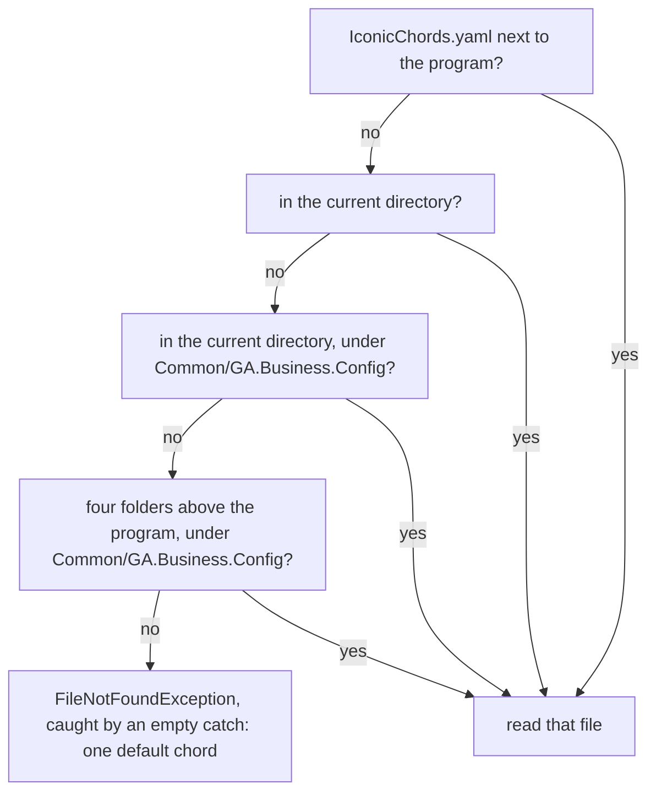

import { Tabs, TabItem } from '@astrojs/starlight/components';

Until now, everything a program knew disappeared when it stopped. A **file** keeps text on the disk: a program can write it, and the same program, another one or a person can read it later. This lesson writes and reads text files, builds their paths, and reads a CSV file, a table written as text, with the projects of [Guitar Alchemist](https://github.com/GuitarAlchemist/ga) that lessons 4 and 9 typed by hand.

All the programs of this lesson are in [`code/csharp-beginner`](https://github.com/spareilleux/learn/tree/main/code/csharp-beginner). Run them from that folder, for example with `dotnet run examples/l10_write_read.cs`: several of them create a file there and delete it before they end, and the CSV file is in its `data` folder. `check.sh` compares their output, and the compiler errors of the rejected snippets, with the files in `expected/`.

## Write a file, read it back

The static class [`File`](https://learn.microsoft.com/dotnet/api/system.io.file), in the `System.IO` namespace that every file-based app can use without a `using`, reads and writes a whole file in one call:

```csharp
// Write a text file, add to it, read it back, then delete it
string path = "practice.txt";

File.WriteAllText(path, "Monday: 30 minutes\n");       // creates the file, or replaces its content
File.AppendAllText(path, "Tuesday: 45 minutes\n");     // adds at the end
Console.WriteLine(File.Exists(path));

string text = File.ReadAllText(path);                   // the whole file in one string
Console.Write(text);

string[] lines = File.ReadAllLines(path);               // one string per line, without the line breaks
Console.WriteLine($"{lines.Length} lines, the last one: {lines[^1]}");

File.WriteAllLines(path, ["E2", "A2", "D3", "G3", "B3", "E4"]);   // replaces the content, one item per line
Console.WriteLine(string.Join(" ", File.ReadAllLines(path)));

File.Delete(path);
Console.WriteLine(File.Exists(path));
```

```text
True
Monday: 30 minutes
Tuesday: 45 minutes
2 lines, the last one: Tuesday: 45 minutes
E2 A2 D3 G3 B3 E4
False
```

| Method | What it does |
|---|---|
| [`File.WriteAllText(path, text)`](https://learn.microsoft.com/dotnet/api/system.io.file.writealltext) | creates the file, or replaces what it held, with `text` |
| [`File.AppendAllText(path, text)`](https://learn.microsoft.com/dotnet/api/system.io.file.appendalltext) | adds `text` at the end, and creates the file if needed |
| [`File.ReadAllText(path)`](https://learn.microsoft.com/dotnet/api/system.io.file.readalltext) | the whole file, as one `string` |
| [`File.ReadAllLines(path)`](https://learn.microsoft.com/dotnet/api/system.io.file.readalllines) | a `string[]`, one item per line, without the line breaks |
| [`File.WriteAllLines(path, lines)`](https://learn.microsoft.com/dotnet/api/system.io.file.writealllines) | writes each item of a collection on its own line |
| [`File.Exists(path)`](https://learn.microsoft.com/dotnet/api/system.io.file.exists) | `true` if the file is there |
| [`File.Delete(path)`](https://learn.microsoft.com/dotnet/api/system.io.file.delete) | deletes the file; does nothing if it isn't there |

`"\n"` is the line break inside a string. `Console.Write`, without `Line`, prints the text as it is: the file already ends with a line break.

`ReadAllText` returns one `string`, so it can't go into an array. The compiler says so before the program runs:

```csharp
// ReadAllText returns one string, not an array of lines
string[] lines = File.ReadAllText("practice.txt");
```

```text
l10_readalltext_array.cs(2,18): error CS0029: Cannot implicitly convert type 'string' to 'string[]'
```

### When the file isn't there

Reading a file that doesn't exist throws an exception, the kind of ordinary failure that lesson 8 catches. The exception says what is missing: the file, or a folder on the way to it.

```csharp
// Reading a file that isn't there throws an exception: which one depends on what is missing
try
{
    string text = File.ReadAllText("missing.txt");
}
catch (FileNotFoundException ex)
{
    Console.WriteLine($"{ex.GetType().Name}: {Path.GetFileName(ex.FileName)}");
}

try
{
    string text = File.ReadAllText(Path.Combine("nowhere", "missing.txt"));
}
catch (DirectoryNotFoundException ex)
{
    Console.WriteLine(ex.GetType().Name);
}

// Asking first avoids the exception, but the file can still disappear between the two lines
if (File.Exists("missing.txt"))
{
    Console.WriteLine(File.ReadAllText("missing.txt"));
}
else
{
    Console.WriteLine("No missing.txt here");
}
```

```text
FileNotFoundException: missing.txt
DirectoryNotFoundException
No missing.txt here
```

[`FileNotFoundException`](https://learn.microsoft.com/dotnet/api/system.io.filenotfoundexception) carries the path of the file in `FileName`; the program prints only the name, with `Path.GetFileName`, so that its output is the same on every computer. [`DirectoryNotFoundException`](https://learn.microsoft.com/dotnet/api/system.io.directorynotfoundexception) means that a folder of the path is missing. Catch them where the program can do something useful, such as ask for another file; a `catch` that only prints and carries on hides the problem, as Guitar Alchemist shows at the end of this lesson.

## Paths

A **path** says where a file is: a list of folder names, then the file's name. Windows separates them with a backslash, `\`, while Linux and macOS use a slash, `/`. The static class [`Path`](https://learn.microsoft.com/dotnet/api/system.io.path) builds and takes apart paths with the right separator, so the same program works everywhere:

```csharp
// Path builds and takes apart file paths without caring about the operating system
string path = Path.Combine("data", "ga-projects.csv");   // data\ga-projects.csv on Windows, data/ga-projects.csv elsewhere

Console.WriteLine(Path.GetFileName(path));
Console.WriteLine(Path.GetFileNameWithoutExtension(path));
Console.WriteLine(Path.GetExtension(path));
Console.WriteLine(Path.GetFileName(Path.ChangeExtension(path, ".json")));
Console.WriteLine(Path.GetFileName(Path.GetDirectoryName(path)));
Console.WriteLine(Path.IsPathRooted(path));               // False: a relative path

// The separator is the only difference between the systems
Console.WriteLine(path == "data" + Path.DirectorySeparatorChar + "ga-projects.csv");
```

```text
ga-projects.csv
ga-projects
.csv
ga-projects.json
data
False
True
```

<Tabs syncKey="os">
<TabItem label="Windows">

`Path.Combine("data", "ga-projects.csv")` gives `data\ga-projects.csv`. A full path starts with a drive letter, for example `C:\Users\you\learn\code\csharp-beginner\data\ga-projects.csv`.

</TabItem>
<TabItem label="Linux / WSL">

`Path.Combine("data", "ga-projects.csv")` gives `data/ga-projects.csv`. A full path starts at the root, `/`, for example `/home/you/learn/code/csharp-beginner/data/ga-projects.csv`.

</TabItem>
<TabItem label="macOS">

`Path.Combine("data", "ga-projects.csv")` gives `data/ga-projects.csv`. A full path starts at the root, `/`, for example `/Users/you/learn/code/csharp-beginner/data/ga-projects.csv`.

</TabItem>
</Tabs>

[`Path.Combine`](https://learn.microsoft.com/dotnet/api/system.io.path.combine) joins the pieces with [`Path.DirectorySeparatorChar`](https://learn.microsoft.com/dotnet/api/system.io.path.directoryseparatorchar); [`GetFileName`](https://learn.microsoft.com/dotnet/api/system.io.path.getfilename), [`GetFileNameWithoutExtension`](https://learn.microsoft.com/dotnet/api/system.io.path.getfilenamewithoutextension), [`GetExtension`](https://learn.microsoft.com/dotnet/api/system.io.path.getextension), [`ChangeExtension`](https://learn.microsoft.com/dotnet/api/system.io.path.changeextension) and [`GetDirectoryName`](https://learn.microsoft.com/dotnet/api/system.io.path.getdirectoryname) take a path apart. None of them looks at the disk: they work on the text of the path. A path that starts with a drive or with `/` is *rooted*, or absolute; [`IsPathRooted`](https://learn.microsoft.com/dotnet/api/system.io.path.ispathrooted) says `False` for `data/ga-projects.csv`, a *relative* path.

Typing a Windows path in a normal string goes wrong in another way: in a string, a backslash starts an [escape sequence](https://learn.microsoft.com/dotnet/csharp/programming-guide/strings/#string-escape-sequences), like `\n`.

```csharp
// In a normal string, a backslash starts an escape sequence, and \g is not one
string path = "data\ga-projects.csv";
```

```text
l10_backslash.cs(2,20): error CS1009: Unrecognized escape sequence
```

`\g` is not an escape sequence, so the compiler refuses it. `"data\new.csv"` would compile, with a line break in the middle of the name, because `\n` is one. A [verbatim string](https://learn.microsoft.com/dotnet/csharp/language-reference/tokens/verbatim), `@"data\ga-projects.csv"`, takes backslashes as they are, but the path then works on Windows only; `Path.Combine` works everywhere.

### A relative path starts from the current directory

A relative path is completed with the **current directory**: the folder the terminal was in when `dotnet run` started, not the folder of the `.cs` file. A file-based app can also ask for the folder of its own file, with [`AppContext.GetData`](https://learn.microsoft.com/dotnet/api/system.appcontext.getdata)`("EntryPointFileDirectoryPath")`, one of the [paths that `dotnet run` gives a file-based app since .NET 10](https://learn.microsoft.com/dotnet/core/whats-new/dotnet-10/sdk#file-based-apps-enhancements):

```csharp
// A relative path starts from the current directory: the folder dotnet run was started from
string relative = Path.Combine("data", "ga-projects.csv");
Console.WriteLine($"From the current directory: {File.Exists(relative)}");

// A file-based app can ask for the folder of its .cs file, whatever the current directory
string folder = (string)AppContext.GetData("EntryPointFileDirectoryPath")!;
string fromProgram = Path.Combine(folder, "..", "data", "ga-projects.csv");
Console.WriteLine($"From the program's folder: {File.Exists(fromProgram)}");
```

From `code/csharp-beginner`, with `dotnet run examples/l10_where.cs`:

```text
From the current directory: True
From the program's folder: True
```

From the root of the repository, two folders up, with `dotnet run code/csharp-beginner/examples/l10_where.cs`:

```text
From the current directory: False
From the program's folder: True
```

The same program, unchanged, finds the file or not depending on where it is started. `".."` is the parent folder, here `code/csharp-beginner` seen from `examples`. `GetData` returns an `object?`: the cast `(string)` and the `!` of lesson 8 say that it is a string and isn't `null` when the program runs with `dotnet run app.cs`. A project-based program has no such entry; [`AppContext.BaseDirectory`](https://learn.microsoft.com/dotnet/api/system.appcontext.basedirectory), the folder of the compiled program, is what it uses to find a file that the build copied next to it. For a file-based app, that folder is a temporary one, under `dotnet/runfile` in the system's temporary folder ([file-based apps](https://learn.microsoft.com/dotnet/core/sdk/file-based-apps#build-applications)). `check.sh` runs this program from both folders, on Linux, Windows and macOS.

## Lines and line breaks

A line ends with a line-break character, `\n`. Windows usually ends a line with two characters, `\r\n`. `ReadAllLines` understands both; splitting the whole text on `'\n'` doesn't:

```csharp
// The same three lines, ended by \n (Linux, macOS) or by \r\n (Windows)
string[] endings = ["\n", "\r\n"];
foreach (string ending in endings)
{
    string name = ending == "\n" ? "LF" : "CRLF";
    File.WriteAllText("tuning.txt", "E2" + ending + "A2" + ending + "D3" + ending);

    string[] split = File.ReadAllText("tuning.txt").Split('\n');
    string[] lines = File.ReadAllLines("tuning.txt");

    Console.WriteLine($"{name}, Split('\\n'): {split.Length} items, lengths {string.Join(" ", split.Select(s => s.Length))}");
    Console.WriteLine($"{name}, ReadAllLines: {lines.Length} lines, lengths {string.Join(" ", lines.Select(s => s.Length))}");
    Console.WriteLine($"{name}, first line is \"E2\": {split[0] == "E2"} with Split, {lines[0] == "E2"} with ReadAllLines");
}
File.Delete("tuning.txt");
```

```text
LF, Split('\n'): 4 items, lengths 2 2 2 0
LF, ReadAllLines: 3 lines, lengths 2 2 2
LF, first line is "E2": True with Split, True with ReadAllLines
CRLF, Split('\n'): 4 items, lengths 3 3 3 0
CRLF, ReadAllLines: 3 lines, lengths 2 2 2
CRLF, first line is "E2": False with Split, True with ReadAllLines
```

Two traps show up in `Split('\n')`:

- the last line break is followed by nothing, so `Split` returns one more item than there are lines, an empty one;
- with `\r\n`, each piece keeps its `\r`: `"E2\r"` is three characters long, and isn't equal to `"E2"`. A program that splits this way works on the Linux machine of its author and fails on a Windows one.

`ReadAllLines` drops the line breaks of both kinds and adds no empty line at the end. `\\n` in the program prints a backslash and an `n`, and `\"` prints a quote: both are escape sequences too.

For a big file, [`File.ReadLines`](https://learn.microsoft.com/dotnet/api/system.io.file.readlines) reads one line at a time, when a `foreach` or a LINQ method asks for it, like the queries of lesson 9 that run when they are read. It returns an `IEnumerable<string>`, which has no `Length`:

```csharp
// ReadLines gives an IEnumerable<string>, read on demand: it has no Length
int count = File.ReadLines("practice.txt").Length;
```

```text
l10_readlines_length.cs(2,44): error CS1061: 'IEnumerable<string>' does not contain a definition for 'Length' and no accessible extension method 'Length' accepting a first argument of type 'IEnumerable<string>' could be found (are you missing a using directive or an assembly reference?)
```

LINQ's `Count()` counts the lines by reading them all.

## Read a CSV file

A **CSV** file, for *comma-separated values*, is a table written as text: one line per row, the values separated by commas, and usually a first line, the *header*, with the names of the columns. `code/csharp-beginner/data/ga-projects.csv` holds lesson 4's twelve projects of Guitar Alchemist, with the number of `.cs` and `.fs` files of each one at commit `5c3a52a`:

```csv
Name,Language,CsFiles,FsFiles
GA.Core,C#,67,0
GA.Domain.Core,C#,209,0
GA.Business.Config,F#,8,11
```

The program reads every line, cuts each one at the commas with [`Split`](https://learn.microsoft.com/dotnet/api/system.string.split), and turns it into the `Project` record of lesson 9, with two more numbers:

```csharp
// Read Guitar Alchemist's projects from a CSV file: one line per project, values separated by commas
string[] lines = File.ReadAllLines(Path.Combine("data", "ga-projects.csv"));
Console.WriteLine($"Header: {lines[0]}");

List<Project> projects = [];
foreach (string line in lines.Skip(1))                   // every line but the header
{
    string[] fields = line.Split(',');
    projects.Add(new Project(fields[0], fields[1], int.Parse(fields[2]), int.Parse(fields[3])));
}
Console.WriteLine($"{projects.Count} projects");

foreach (Project p in projects.OrderByDescending(p => p.CsFiles + p.FsFiles).Take(3))
{
    Console.WriteLine($"{p.Name}: {p.CsFiles + p.FsFiles} files");
}

Console.WriteLine($"C# files in F# projects: {projects.Where(p => p.Language == "F#").Sum(p => p.CsFiles)}");
Console.WriteLine($"Projects without a source file: {string.Join(", ", projects.Where(p => p.CsFiles + p.FsFiles == 0).Select(p => p.Name))}");

record Project(string Name, string Language, int CsFiles, int FsFiles);
```

```text
Header: Name,Language,CsFiles,FsFiles
12 projects
GA.Business.ML: 226 files
GA.Domain.Core: 209 files
GA.Core: 67 files
C# files in F# projects: 8
Projects without a source file: GA.Presentation
```

[`Skip(1)`](https://learn.microsoft.com/dotnet/api/system.linq.enumerable.skip) leaves the header out, and [`Sum`](https://learn.microsoft.com/dotnet/api/system.linq.enumerable.sum) adds up a number per item, like `Count` counts them. The data itself has two surprises. The F# project `GA.Business.Config` holds eight C# files: lesson 9 met them, its music knowledge services, which another project compiles. `GA.Presentation` has no source file at all, only its project file.

### A comma inside a value

A value that contains the separator, such as a band's name, is put between double quotes. A plain `Split` doesn't know about quotes:

```csharp
using Microsoft.VisualBasic.FileIO;

// A value that contains a comma is put between quotes, and a plain Split cuts it anyway
string line = "\"Crosby, Stills & Nash\",Suite: Judy Blue Eyes,1969";
string[] split = line.Split(',');
Console.WriteLine($"Split: {split.Length} fields: {string.Join(" | ", split)}");

// TextFieldParser, which comes with .NET, knows about the quotes
using TextFieldParser parser = new TextFieldParser(new StringReader(line));
parser.SetDelimiters(",");
parser.HasFieldsEnclosedInQuotes = true;
string[] fields = parser.ReadFields()!;
Console.WriteLine($"TextFieldParser: {fields.Length} fields: {string.Join(" | ", fields)}");
```

```text
Split: 4 fields: "Crosby |  Stills & Nash" | Suite: Judy Blue Eyes | 1969
TextFieldParser: 3 fields: Crosby, Stills & Nash | Suite: Judy Blue Eyes | 1969
```

[`TextFieldParser`](https://learn.microsoft.com/dotnet/api/microsoft.visualbasic.fileio.textfieldparser) comes from Visual Basic's library, which is part of .NET, so C# can use it with a `using`. `Split` is fine for a file you write yourself and whose values never contain a comma, like `ga-projects.csv`; a file that comes from elsewhere needs a reader that handles quotes. Lesson 12 adds a NuGet package, a library made by others, and CSV readers are a common reason to add one. The `using` in front of `TextFieldParser parser` is the subject of the next section but one.

### Numbers in a CSV file

Lesson 2 showed that reading `"1.5"` depends on the culture of the machine. Writing does too: under the French culture, the decimal separator is a comma, the separator of the CSV columns. Guitar Alchemist builds the rows of its training data for a machine learning model with this line ([NaturalnessTrainingDataGenerator.cs:160](https://github.com/GuitarAlchemist/ga/blob/5c3a52ab40d0d433f8f68dbbd0590f70c8d8cf26/Common/GA.Business.ML/Naturalness/NaturalnessTrainingDataGenerator.cs#L160)), after a label `1,` or `0,` ([line 78](https://github.com/GuitarAlchemist/ga/blob/5c3a52ab40d0d433f8f68dbbd0590f70c8d8cf26/Common/GA.Business.ML/Naturalness/NaturalnessTrainingDataGenerator.cs#L78)). The program writes one such row on a Canadian machine, then on a French one:

```csharp
using System.Globalization;

// One row of Guitar Alchemist's naturalness CSV, written as its generator writes it:
// the label, then $"{deltaAvg:F2},{deltaAvg:F2},{changedStrings},{deltaStretch},{sharedStrings}"
double deltaAvg = 2.5;
int changedStrings = 2;
double deltaStretch = 1;
int sharedStrings = 4;

string[] cultures = ["en-CA", "fr-FR"];
foreach (string name in cultures)
{
    CultureInfo.CurrentCulture = new CultureInfo(name);   // as on a Canadian, then a French machine
    string row = $"1,{deltaAvg:F2},{deltaAvg:F2},{changedStrings},{deltaStretch},{sharedStrings}";
    Console.WriteLine($"{name}: {row} -> {row.Split(',').Length} fields");
}

// string.Create with the invariant culture writes a dot on every machine
string invariant = string.Create(CultureInfo.InvariantCulture,
    $"1,{deltaAvg:F2},{deltaAvg:F2},{changedStrings},{deltaStretch},{sharedStrings}");
Console.WriteLine($"Invariant: {invariant} -> {invariant.Split(',').Length} fields");

// Reading it back: parse with the same culture as the one that wrote it
double read = double.Parse(invariant.Split(',')[1], CultureInfo.InvariantCulture);
Console.WriteLine(read == deltaAvg);
```

```text
en-CA: 1,2.50,2.50,2,1,4 -> 6 fields
fr-FR: 1,2,50,2,50,2,1,4 -> 8 fields
Invariant: 1,2.50,2.50,2,1,4 -> 6 fields
True
```

On a French machine, each `2.50` becomes `2,50`, and the six columns of the header become eight values: a program that reads the file then puts each number in the wrong column. [`CultureInfo.CurrentCulture`](https://learn.microsoft.com/dotnet/api/system.globalization.cultureinfo.currentculture) is the culture that `$"..."` uses; the program changes it to imitate each machine. [`string.Create`](https://learn.microsoft.com/dotnet/api/system.string.create) with [`CultureInfo.InvariantCulture`](https://learn.microsoft.com/dotnet/api/system.globalization.cultureinfo.invariantculture) builds the same string on every machine, and `double.Parse` with the same culture reads it back. Whole numbers, such as `changedStrings` and `deltaStretch`, which is a `double` holding 1, are written without a separator in every culture. The rule for a file: write and read numbers with the invariant culture, and keep the machine's culture for what a person reads on the screen.

## Streams and `using`

`ReadAllText` and `WriteAllText` open the file, do their work and close it. To write a file bit by bit, a [`StreamWriter`](https://learn.microsoft.com/dotnet/api/system.io.streamwriter) keeps it open between calls, and the program must close it when it is done. The [`using`](https://learn.microsoft.com/dotnet/csharp/language-reference/statements/using) statement does that at the end of its block:

```csharp
// Write line by line with a StreamWriter, then read line by line with File.ReadLines
string path = "frets.txt";

using (StreamWriter writer = new StreamWriter(path))
{
    for (int fret = 0; fret <= 12; fret += 3)
    {
        writer.WriteLine($"Fret {fret}: {110 * Math.Pow(2, fret / 12.0):F1} Hz");
    }
}   // leaving the using block closes the file, even after an exception

// ReadLines reads one line at a time, when the foreach asks for it, like a LINQ query
foreach (string line in File.ReadLines(path))
{
    Console.WriteLine(line);
}
Console.WriteLine($"First line with 220: {File.ReadLines(path).First(l => l.Contains("220"))}");
File.Delete(path);
```

```text
Fret 0: 110.0 Hz
Fret 3: 130.8 Hz
Fret 6: 155.6 Hz
Fret 9: 185.0 Hz
Fret 12: 220.0 Hz
First line with 220: Fret 12: 220.0 Hz
```

The frequencies are those of lesson 2: each fret multiplies the frequency of the A string, 110 Hz, by the twelfth root of 2. They are written for a person to read, with the machine's culture: on a French machine, the file holds `110,0`. A `using` declaration, without braces, as in front of `TextFieldParser` above, closes the object at the end of the enclosing block, here the end of the program.

What `using` does is call [`Dispose`](https://learn.microsoft.com/dotnet/api/system.idisposable.dispose). Until then, a `StreamWriter` keeps what it is given in memory, and writes it to the disk in bigger pieces:

```csharp
// A StreamWriter keeps the text in memory and writes it to the disk later
StreamWriter writer = new StreamWriter("notes.txt");
writer.Write("E2 A2 D3");
Console.WriteLine($"Before Dispose: {new FileInfo("notes.txt").Length} bytes");

writer.Dispose();                                         // writes what is left, then closes the file
Console.WriteLine($"After Dispose: {new FileInfo("notes.txt").Length} bytes");
File.Delete("notes.txt");
```

```text
Before Dispose: 0 bytes
After Dispose: 8 bytes
```

[`FileInfo.Length`](https://learn.microsoft.com/dotnet/api/system.io.fileinfo.length) is the size of the file on the disk. A program that forgets to dispose its writer can end with a file that is empty or cut short, and keeps the file open until it ends: meanwhile, Windows doesn't let another program change or delete it. Put every `StreamWriter`, [`StreamReader`](https://learn.microsoft.com/dotnet/api/system.io.streamreader) or other [`IDisposable`](https://learn.microsoft.com/dotnet/api/system.idisposable) object in a `using`.

### Characters and bytes

A file holds bytes, and a text file is characters turned into bytes by an **encoding**. .NET writes [UTF-8](https://learn.microsoft.com/dotnet/standard/base-types/character-encoding-introduction) by default: one byte for an English letter, two for `é`. One option adds three bytes at the start of the file:

```csharp
using System.Text;

// "Ré" is two characters; how many bytes does the file get?
File.WriteAllText("note.txt", "Ré");
byte[] bytes = File.ReadAllBytes("note.txt");
Console.WriteLine($"Default:       {bytes.Length} bytes: {Convert.ToHexString(bytes)}");

// Encoding.UTF8 adds a byte order mark (BOM), EF BB BF, at the start of the file
File.WriteAllText("note.txt", "Ré", Encoding.UTF8);
bytes = File.ReadAllBytes("note.txt");
Console.WriteLine($"Encoding.UTF8: {bytes.Length} bytes: {Convert.ToHexString(bytes)}");

// ReadAllText recognizes the mark and removes it
string text = File.ReadAllText("note.txt");
Console.WriteLine($"Read back: {text}, {text.Length} characters");
File.Delete("note.txt");
```

```text
Default:       3 bytes: 52C3A9
Encoding.UTF8: 6 bytes: EFBBBF52C3A9
Read back: Ré, 2 characters
```

`52` is `R`, and `C3 A9` is `é`. [`File.ReadAllBytes`](https://learn.microsoft.com/dotnet/api/system.io.file.readallbytes) gives the raw bytes, and [`Convert.ToHexString`](https://learn.microsoft.com/dotnet/api/system.convert.tohexstring) prints them in hexadecimal. Without an encoding, `WriteAllText` writes UTF-8 without a mark; [`Encoding.UTF8`](https://learn.microsoft.com/dotnet/api/system.text.encoding.utf8) adds the *byte order mark*, `EF BB BF`. `ReadAllText` and `ReadAllLines` recognize it and remove it, but a program that reads the bytes another way can find three strange characters in front of the first column's name. Leave the encoding out unless the program that reads the file needs it.

## In Guitar Alchemist

At commit `5c3a52a`, Guitar Alchemist reads several data files, and its code shows each point of this lesson. A [probe](https://github.com/spareilleux/learn/blob/main/code/csharp-beginner/ga-probes/files.cs) ran part of it.

**Where GA looks for a file.** The music knowledge services of lesson 9 read YAML files. [`IconicChordsConfigLoader.FindYamlFile`](https://github.com/GuitarAlchemist/ga/blob/5c3a52ab40d0d433f8f68dbbd0590f70c8d8cf26/Common/GA.Business.Config/Configuration/IconicChordsConfigLoader.cs#L91-L105) tries four paths and takes the first that exists, with `possiblePaths.FirstOrDefault(File.Exists)`: a method given to LINQ in place of a lambda, as `Count(IsFSharp)` in lesson 9.



The build copies the YAML files next to the program, so the first path usually wins. When it doesn't, two paths depend on the current directory, and the last answer is an exception that an [empty `catch`](https://github.com/GuitarAlchemist/ga/blob/5c3a52ab40d0d433f8f68dbbd0590f70c8d8cf26/Common/GA.Business.Config/Configuration/IconicChordsConfigLoader.cs#L25-L28) swallows, before the loader returns one chord, "C Major Triad". The probe ran three times: as built, then after deleting the YAML files next to itself, from two folders:

| Started from | Path found | Iconic chords |
|---|---|---|
| `ga-probes`, with the files next to the program | the first | 17, the first one "Hendrix Chord" |
| `ga-probes`, without them | none | 1, "C Major Triad" |
| the root of GA's code, without them | the third | 17 |

Nothing is printed in the second case: the program goes on with one chord instead of seventeen. [GaCLI](https://github.com/GuitarAlchemist/ga/blob/5c3a52ab40d0d433f8f68dbbd0590f70c8d8cf26/GaCLI/Program.cs#L17-L19), GA's command-line tool, makes the mistake of `l10_where.cs` the other way round: its project [copies `appsettings.yaml` next to the program](https://github.com/GuitarAlchemist/ga/blob/5c3a52ab40d0d433f8f68dbbd0590f70c8d8cf26/GaCLI/GaCLI.csproj#L59-L61), but the program reads it from the current directory, as an optional file. Started from another folder, the root of the repository for example, it would run without its settings and say nothing: this comes from reading the code, which the probe didn't run, and is *to verify*.

**A file that is neither embedded nor copied.** [`ScaleVideoUrlById`](https://github.com/GuitarAlchemist/ga/blob/5c3a52ab40d0d433f8f68dbbd0590f70c8d8cf26/Common/GA.Domain.Core/Theory/Tonal/Scales/ScaleVideoUrlById.cs#L27-L52) gives the URL of a video for each scale. It looks for its data inside the compiled library, as a *resource* named `GA.Domain.Core.Scales.Data.scale_video_urls.json`, then in a file `Scales/Data/scale_video_urls.json` next to the library. The file, with 1,490 URLs, is in `Theory/Tonal/Scales/Data/`, and the project neither embeds it nor copies it: both lookups miss, and the code returns an empty dictionary. The probe found no resource in the library, no file next to it, and 0 scales with a video. `PitchClassSet.ScaleVideoUrl` and `ScaleMetadataRegistry.GetMetadata`, which call it, never get a URL from it.

**Numbers and lines.** The naturalness rows of the section on numbers come from GA's [training data generator](https://github.com/GuitarAlchemist/ga/blob/5c3a52ab40d0d433f8f68dbbd0590f70c8d8cf26/Common/GA.Business.ML/Naturalness/NaturalnessTrainingDataGenerator.cs#L160), which the probe didn't run: it needs a collection of tablatures. Its command then prints the number of rows as [`csvContent.Split('\n').Length - 1`](https://github.com/GuitarAlchemist/ga/blob/5c3a52ab40d0d433f8f68dbbd0590f70c8d8cf26/GaCLI/Commands/GenerateNaturalnessDataCommand.cs#L38): the `- 1` removes the empty item after the last line break, but the header still counts as a row, so the message gives one row more than the data holds.

The [QA table of the journal](../journal/#qa) records these measurements.

## Exercises

### Exercise 1 — predict the output

Write down what each line prints, then run `exercises/l10_ex_predict.cs`:

```csharp
// Exercise 1: predict each line before running the program
File.WriteAllText("chords.txt", "C\nG\nAm\nF\n");
Console.WriteLine(File.ReadAllLines("chords.txt").Length);
Console.WriteLine(File.ReadAllText("chords.txt").Split('\n').Length);

File.AppendAllText("chords.txt", "C");
Console.WriteLine(File.ReadAllLines("chords.txt").Length);
Console.WriteLine(File.ReadAllLines("chords.txt")[^1]);

File.WriteAllText("chords.txt", "");
Console.WriteLine(File.ReadAllLines("chords.txt").Length);

File.Delete("chords.txt");
Console.WriteLine(File.Exists("chords.txt"));
```

<details>
<summary>Solution</summary>

```text
4
5
5
C
0
False
```

- Four lines, each ended by `\n`: `ReadAllLines` gives 4, and `Split('\n')` gives 5, the last one empty.
- `AppendAllText` adds `C` after the last line break: a fifth line, without a line break of its own, which `ReadAllLines` reads too.
- `WriteAllText` with `""` empties the file without deleting it: 0 lines. After `Delete`, the file is gone.

</details>

### Exercise 2 — files per language

Read `data/ga-projects.csv` and print the number of source files, `.cs` and `.fs` together, of the C# projects and of the F# projects. Use a dictionary as in lesson 9, and `File.ReadLines`.

<details>
<summary>Solution</summary>

```csharp
// Exercise 2: the number of source files per language, from data/ga-projects.csv
var files = new Dictionary<string, int>();
foreach (string line in File.ReadLines(Path.Combine("data", "ga-projects.csv")).Skip(1))
{
    string[] fields = line.Split(',');
    string language = fields[1];
    files[language] = files.GetValueOrDefault(language) + int.Parse(fields[2]) + int.Parse(fields[3]);
}

foreach (var pair in files.OrderBy(pair => pair.Key))
{
    Console.WriteLine($"{pair.Key}: {pair.Value} files");
}
```

```text
C#: 557 files
F#: 75 files
```

`int.Parse` is safe here whatever the machine: a whole number has no decimal separator. `OrderBy` makes the order of the dictionary certain.

</details>

### Exercise 3 — a CSV file of the tuning

Write the six strings of the guitar to `tuning.csv`, with a header `String,Note,Frequency`, the frequencies with two decimals and a dot on every machine: 82.41, 110, 146.83, 196, 246.94 and 329.63 Hz, from string 6, E2, to string 1, E4. Print the file, then read it back and print the average frequency, also with a dot.

<details>
<summary>Solution</summary>

```csharp
using System.Globalization;

// Exercise 3: write the tuning to a CSV file that every machine reads the same way, then read it back
string[] notes = ["E2", "A2", "D3", "G3", "B3", "E4"];
double[] hertz = [82.41, 110, 146.83, 196, 246.94, 329.63];

List<string> rows = ["String,Note,Frequency"];
for (int i = 0; i < notes.Length; i++)
{
    rows.Add(string.Create(CultureInfo.InvariantCulture, $"{6 - i},{notes[i]},{hertz[i]:F2}"));
}
File.WriteAllLines("tuning.csv", rows);
Console.Write(File.ReadAllText("tuning.csv"));

double total = 0;
foreach (string line in File.ReadLines("tuning.csv").Skip(1))
{
    total += double.Parse(line.Split(',')[2], CultureInfo.InvariantCulture);
}
Console.WriteLine($"Average: {(total / notes.Length).ToString("F2", CultureInfo.InvariantCulture)} Hz");
File.Delete("tuning.csv");
```

```text
String,Note,Frequency
6,E2,82.41
5,A2,110.00
4,D3,146.83
3,G3,196.00
2,B3,246.94
1,E4,329.63
Average: 185.30 Hz
```

The invariant culture is used three times: to write each row, to read each frequency, and to print the average. [`ToString("F2", culture)`](https://learn.microsoft.com/dotnet/api/system.double.tostring) is the method form of `{value:F2}`.

</details>

### Exercise 4 — from any folder

Change `l10_csv.cs` so that it finds `data/ga-projects.csv` from its own folder, whatever the current directory, and prints a clear message, with the full path it tried, when the file isn't there. Print the number of projects and the number of F# projects. Return 1 when the file is missing, 0 otherwise: `return` at the top level ends the program with that exit code.

<details>
<summary>Solution</summary>

```csharp
// Exercise 4: find data/ga-projects.csv from the program's folder, and say so clearly when it isn't there
string folder = (string)AppContext.GetData("EntryPointFileDirectoryPath")!;
string path = Path.GetFullPath(Path.Combine(folder, "..", "data", "ga-projects.csv"));

if (!File.Exists(path))
{
    Console.WriteLine($"Can't find {path}");
    return 1;
}

string[] lines = File.ReadAllLines(path);
int fsharp = lines.Skip(1).Count(line => line.Split(',')[1] == "F#");
Console.WriteLine($"{lines.Length - 1} projects in {Path.GetFileName(path)}, {fsharp} in F#");
return 0;
```

```text
12 projects in ga-projects.csv, 4 in F#
```

[`Path.GetFullPath`](https://learn.microsoft.com/dotnet/api/system.io.path.getfullpath) removes the `..` and gives an absolute path, which tells the reader of the message exactly where the program looked. GA's loader, above, does the opposite: it tries four places and says nothing.

</details>

## Check your understanding

- `File.ReadAllText`, `ReadAllLines`, `WriteAllText`, `WriteAllLines` and `AppendAllText` read or write a whole file in one call. A missing file throws `FileNotFoundException`, a missing folder `DirectoryNotFoundException`.
- Build paths with `Path.Combine`, never by gluing `\` or `/`. In a normal string, a backslash starts an escape sequence.
- A relative path starts from the current directory, the folder `dotnet run` was started from. A file-based app finds its own folder with `AppContext.GetData("EntryPointFileDirectoryPath")`.
- `ReadAllLines` handles `\n` and `\r\n`; `Split('\n')` keeps the `\r` and adds an empty item after the last line break. `ReadLines` reads on demand and returns an `IEnumerable<string>`.
- A CSV line splits with `Split(',')` only if no value contains a comma. Write and read numbers in a file with `CultureInfo.InvariantCulture`.
- Put a `StreamWriter` or a `StreamReader` in a `using`: until `Dispose`, the text may still be in memory.
- `WriteAllText` writes UTF-8 without a byte order mark; `Encoding.UTF8` adds one.

Next: [unit tests](../11-unit-tests/), to check the methods of these lessons with xUnit and `dotnet test`.

## Sources

- Files: [common I/O tasks](https://learn.microsoft.com/dotnet/standard/io/common-i-o-tasks), [`File`](https://learn.microsoft.com/dotnet/api/system.io.file), [`File.ReadLines`](https://learn.microsoft.com/dotnet/api/system.io.file.readlines), [`FileInfo.Length`](https://learn.microsoft.com/dotnet/api/system.io.fileinfo.length), [`FileNotFoundException`](https://learn.microsoft.com/dotnet/api/system.io.filenotfoundexception), [`DirectoryNotFoundException`](https://learn.microsoft.com/dotnet/api/system.io.directorynotfoundexception)
- Paths: [file path formats on Windows](https://learn.microsoft.com/dotnet/standard/io/file-path-formats), [`Path`](https://learn.microsoft.com/dotnet/api/system.io.path), [`Path.Combine`](https://learn.microsoft.com/dotnet/api/system.io.path.combine), [`Path.GetFullPath`](https://learn.microsoft.com/dotnet/api/system.io.path.getfullpath), [`AppContext.GetData`](https://learn.microsoft.com/dotnet/api/system.appcontext.getdata), [`AppContext.BaseDirectory`](https://learn.microsoft.com/dotnet/api/system.appcontext.basedirectory), [file-based apps](https://learn.microsoft.com/dotnet/core/sdk/file-based-apps), [what's new in the .NET 10 SDK](https://learn.microsoft.com/dotnet/core/whats-new/dotnet-10/sdk#file-based-apps-enhancements)
- Text: [escape sequences](https://learn.microsoft.com/dotnet/csharp/programming-guide/strings/#string-escape-sequences), [verbatim strings](https://learn.microsoft.com/dotnet/csharp/language-reference/tokens/verbatim), [character encoding](https://learn.microsoft.com/dotnet/standard/base-types/character-encoding-introduction), [`Encoding.UTF8`](https://learn.microsoft.com/dotnet/api/system.text.encoding.utf8), [`TextFieldParser`](https://learn.microsoft.com/dotnet/api/microsoft.visualbasic.fileio.textfieldparser), [`CultureInfo.InvariantCulture`](https://learn.microsoft.com/dotnet/api/system.globalization.cultureinfo.invariantculture), [`string.Create`](https://learn.microsoft.com/dotnet/api/system.string.create)
- Streams: [`StreamWriter`](https://learn.microsoft.com/dotnet/api/system.io.streamwriter), [`StreamReader`](https://learn.microsoft.com/dotnet/api/system.io.streamreader), [the `using` statement](https://learn.microsoft.com/dotnet/csharp/language-reference/statements/using), [`IDisposable`](https://learn.microsoft.com/dotnet/api/system.idisposable)
- Compiler errors [CS0029](https://learn.microsoft.com/dotnet/csharp/language-reference/compiler-messages/cs0029), [CS1009](https://learn.microsoft.com/dotnet/csharp/language-reference/compiler-messages/string-literal), [CS1061](https://learn.microsoft.com/dotnet/csharp/language-reference/compiler-messages/cs1061)
