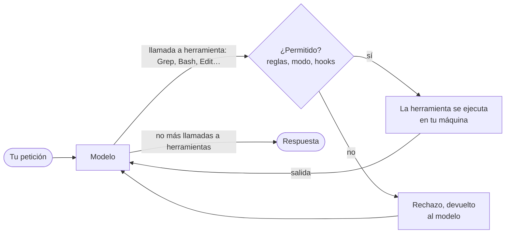

import { Tabs, TabItem } from '@astrojs/starlight/components';

Una refactorización del IDE es un programa fijo: *Rename symbol* siempre hace lo mismo, y puedes leer su código fuente. Un agente de programación es un programa que pregunta a un modelo de lenguaje **qué hacer a continuación**, lo hace, le muestra el resultado al modelo y vuelve a preguntar. Esta lección examina ese bucle, instala los dos agentes del curso y ejecuta una primera tarea que solo lee.

## El bucle

El modelo nunca toca tus archivos. Solo produce texto, y parte de ese texto puede ser una **llamada a herramienta** (tool call): «lee `AGENTS.md`», «ejecuta `git status`». El programa agente, que la documentación de Claude Code llama el [arnés agéntico](https://code.claude.com/docs/en/how-claude-code-works) (agentic harness), decide si la llamada puede ejecutarse, la ejecuta y devuelve la salida al modelo como mensaje siguiente:



La documentación describe tres fases que se mezclan: reunir contexto, actuar, verificar los resultados. Cada ida y vuelta es un **turno**, y todo lo que el modelo ha visto hasta ahora, tu petición, los archivos que leyó y las salidas de los comandos, está en su **ventana de contexto**, que examina la lección 2.

Dos consecuencias para un desarrollador C# o Java:

- **La comprobación de permisos es código, no una petición al modelo.** «Las reglas de permisos las aplica Claude Code, no el modelo» ([permisos](https://code.claude.com/docs/en/permissions)). Una regla que dice no es un `false` en el arnés; una instrucción en un archivo Markdown que dice «nunca hagas push» es una frase que el modelo puede seguir o no.
- **Las herramientas son programas corrientes.** `Bash` ejecuta un shell, `Edit` sustituye una cadena en un archivo, `Grep` es ripgrep. Lo que el agente puede romper es lo que esos programas pueden romper con tu cuenta de usuario.

Las herramientas integradas de Claude Code están listadas en la [referencia de herramientas](https://code.claude.com/docs/en/tools-reference): `Read`, `Glob` y `Grep` no necesitan permiso dentro del directorio de trabajo; `Edit`, `Write`, `Bash`, `PowerShell`, `WebFetch` y `Skill` sí. `Glob` y `Grep` no están disponibles por defecto en macOS, Linux y WSL, donde el modelo busca en su lugar con comandos de shell de solo lectura. Codex tiene herramientas equivalentes con otros nombres; sus hooks ven el shell como `Bash` y las ediciones de archivos como `apply_patch` ([hooks de Codex](https://learn.chatgpt.com/docs/hooks)).

## Instalación

Claude Code necesita una cuenta Pro, Max, Team, Enterprise o Console; «el plan gratuito de Claude.ai no incluye acceso a Claude Code» ([instalación](https://code.claude.com/docs/en/setup)). La CLI de Codex inicia sesión con una cuenta de ChatGPT o una clave de API ([autenticación de Codex](https://learn.chatgpt.com/docs/auth)).

<Tabs syncKey="os">
<TabItem label="Windows">

En PowerShell, los instaladores nativos de la [página de instalación de Claude Code](https://code.claude.com/docs/en/setup) y de la [página de la CLI de Codex](https://learn.chatgpt.com/docs/codex/cli):

```powershell
irm https://claude.ai/install.ps1 | iex
powershell -ExecutionPolicy ByPass -c "irm https://chatgpt.com/codex/install.ps1 | iex"
```

Claude Code también se instala con `winget install Anthropic.ClaudeCode`, que no se actualiza solo. En mi máquina, Claude Code vino del instalador nativo (`C:\Users\<you>\.local\bin\claude.exe`) y Codex de npm (`npm install -g @openai/codex`), que necesita Node.js. El instalador PowerShell de Codex está *por verificar*: no lo he ejecutado.

[Git for Windows](https://git-scm.com/downloads/win) se recomienda pero ya no es obligatorio: «Si Git for Windows no está instalado, Claude Code usa PowerShell como herramienta de shell» ([instalación](https://code.claude.com/docs/en/setup)). El sandbox de Claude Code no está disponible en Windows nativo; Codex tiene su propio sandbox de Windows ([sandbox de Windows](https://learn.chatgpt.com/docs/windows/windows-sandbox)).

</TabItem>
<TabItem label="Linux / WSL">

```bash
curl -fsSL https://claude.ai/install.sh | bash
curl -fsSL https://chatgpt.com/codex/install.sh | sh
```

Ambos comandos están *por verificar*: no he instalado ninguno de los dos agentes en Linux para este curso. Codex no es compatible con WSL 1 ([Codex en WSL](https://learn.chatgpt.com/docs/windows/wsl)).

</TabItem>
<TabItem label="macOS">

```bash
curl -fsSL https://claude.ai/install.sh | bash
curl -fsSL https://chatgpt.com/codex/install.sh | sh
```

O con Homebrew, `brew install --cask claude-code` y `brew install --cask codex`. Todo esto está *por verificar*: no he instalado ninguno de los dos agentes en macOS para este curso.

</TabItem>
</Tabs>

Después, en cualquier terminal:

```text
> claude --version
2.1.271 (Claude Code)
> codex --version
codex-cli 0.154.0
```

`claude doctor` muestra un diagnóstico sin iniciar una sesión. Capturado el 2026-09-14 hacia las 22:25 UTC, abreviado:

```text
Claude Code doctor
…

Running: native (2.1.271)
Platform: win32-x64
Config install method: native
Auto-updates: enabled
Auto-update channel: latest
Last update attempt: success → 2.1.271 (2026-09-14)

No installation issues found.
```

Empecé esta lección en 2.1.270; la instalación nativa se actualizó sola a 2.1.271 en segundo plano hacia las 22:14 UTC ([actualizaciones automáticas](https://code.claude.com/docs/en/setup)). Una instalación con npm o Homebrew no lo hace. Un comportamiento que observaste el lunes puede cambiar el martes sin que ejecutes nada; el [diario](../journal/) anota qué captura se ejecutó con qué versión.

:::caution[Una clave de API tiene prioridad sobre tu suscripción]
Si `ANTHROPIC_API_KEY` está definida en tu entorno, una sesión interactiva pregunta una vez si usarla en lugar de tu suscripción, y `claude -p` la usa sin preguntar ([autenticación](https://code.claude.com/docs/en/authentication)): un script puede facturar por token sin que te des cuenta. `/status` en una sesión muestra cuál se usa. Este curso nunca usa una clave de API.
:::

## Una primera tarea que solo lee

Sitúate en el repositorio y haz una pregunta cuya respuesta puedas comprobar. `claude -p` ejecuta una petición sin la interfaz interactiva ([modo headless](https://code.claude.com/docs/en/headless)); `--allowedTools` deja que las herramientas listadas se ejecuten sin confirmación (no elimina las demás: eso es `--tools`), y `--output-format json` añade los metadatos. Ejecutado desde la raíz de este repositorio el 2026-09-14 a las 22:10 UTC, Claude Code 2.1.270:

```bash
claude -p "Which course folders under src/content/docs have a journal.md with unchecked progress items (lines starting with '- [ ]')? For each, give the folder and the number of unchecked items, as a Markdown table. Don't modify any file." --allowedTools "Read,Grep,Glob" --output-format json
```

El campo `result`, tal como lo escribió el modelo:

```text
Seven of the 22 `journal.md` files under `src/content/docs` have lines starting with `- [ ]`, 100 in all. Nothing was modified.

| Folder | Unchecked items |
|---|---:|
| `streeling/` | 31 |
| `fr/streeling/` | 31 |
| `es/streeling/` | 31 |
| `java-for-csharp/` | 2 |
| `fr/java-for-csharp/` | 2 |
| `es/java-for-csharp/` | 2 |
| `v-for-csharp-java/` | 1 |

- **Streeling:** `journal.md` is the one file in that section written by hand; the sync script generates the rest.
- **V course:** it only has an English journal so far, with no `fr/` or `es/` copy.
- **Fully checked:** `rust-for-csharp-java`, `wsl-containers`, `github-actions`, `duckdb` and `ladybugdb` have no unchecked items in any language.
- **Indented items:** only lines that start with `- [ ]` were counted, so an unchecked item nested under another item wouldn't show up.
```

Y algunos otros campos: `"num_turns": 3`, `"duration_ms": 12087`, `"permission_denials": []`. Tres turnos: el modelo buscó con `Grep`, obtuvo los recuentos y respondió. **Comprueba la respuesta**: `grep -c '\- \[ \]' src/content/docs/*/journal.md` da los mismos recuentos. La observación sobre el diario de Streeling no está en ningún archivo de diario: viene del `AGENTS.md` de este repositorio, que el agente cargó antes de su primer turno. La lección 2 explica cómo.

La misma petición con Codex, `codex exec "…"`, esa misma noche, abreviada:

```text
OpenAI Codex v0.154.0
--------
workdir: C:\Users\spare\source\repos\learn
model: gpt-6-astra
provider: openai
approval: on-request
sandbox: read-only
…
--------
…
ERROR: You've hit your usage limit. Visit https://chatgpt.com/codex/settings/usage to purchase more credits or try again at Sep 19th, 2026 9:42 AM.
```

Una suscripción tiene límites, y un script que llama a un agente tiene que esperar este fallo como cualquier otro. Las sesiones de Codex de esta tanda están *por verificar* después de esa fecha; los comandos que no llaman al modelo (`codex mcp add`, `codex mcp list`) funcionan, y la lección 4 los usa.

## Modos de permisos

Claude Code pregunta antes de una acción según su **modo de permisos** ([modos de permisos](https://code.claude.com/docs/en/permission-modes)):

| Modo | Se ejecuta sin preguntar | Úsalo para |
|---|---|---|
| `default` (mostrado como *Manual*) | solo las lecturas | aprender la herramienta, repositorios sensibles |
| `acceptEdits` | lecturas, ediciones de archivos, y `mkdir`, `touch`, `mv`, `cp` en los directorios de trabajo | una tarea que revisarás como diff |
| `plan` | lecturas, más los comandos que aprueban las comprobaciones del modo auto cuando está disponible; ninguna edición hasta que apruebes un plan | explorar antes de cambiar |
| `auto` | todo, con comprobaciones de seguridad en segundo plano por un segundo modelo, el clasificador | tareas largas, con las comprobaciones como red de seguridad, no como garantía |
| `dontAsk` | solo lo que permiten las reglas; todo lo demás se rechaza | la CI |
| `bypassPermissions` | todo | «solo contenedores y máquinas virtuales aislados» |

`Shift+Tab` recorre los modos en una sesión, y `--permission-mode` fija uno para una ejecución. El modo inicial depende del plan y de tu configuración: las sesiones interactivas en los planes Pro, Max y Team empiezan en `auto`; los planes Enterprise y las claves de API empiezan en `default`; `claude -p` empieza en `default`, **salvo que un archivo de configuración diga lo contrario**: gana `--permission-mode`, después `permissions.defaultMode` en un archivo de configuración, y después el valor por defecto integrado.

Esa excepción me pilló. La configuración de usuario de esta máquina contiene `"defaultMode": "auto"`, y `claude -p "Create a file named hello.txt containing the word hi…"` creó el archivo sin preguntar. La misma petición con `--permission-mode default`, el 2026-09-14 a las 22:22 UTC, en un repositorio vacío:

```json
{
 "num_turns": 2,
 "is_error": false,
 "permission_denials": [
  {
   "tool_name": "Write",
   "tool_input": {
    "file_path": "C:\\Users\\spare\\…\\ctxA\\hello.txt",
    "content": "hi"
   }
  }
 ],
 "result": "It didn't work: the request for permission to write `hello.txt` wasn't approved, so no file was created. If you approve the write, I can try again."
}
```

En modo `-p` no hay nadie para responder a la confirmación, así que la llamada se rechaza, el rechazo vuelve al modelo y el modelo lo informa. `is_error` sigue en `false`: la ejecución tuvo éxito, la tarea no. Un script debe leer `permission_denials`, no solo el código de salida.

Las escrituras en algunas **rutas protegidas** nunca se aprueban automáticamente, salvo en `bypassPermissions`, y las reglas allow no cambian eso: `.git`, `.vscode`, `.idea`, `.claude`, `.mvn`, `.devcontainer`, `.mcp.json`, los perfiles de shell como `.bashrc`, y otras listadas en [rutas protegidas](https://code.claude.com/docs/en/permission-modes#protected-paths). `default` y `acceptEdits` piden confirmación, `auto` las envía al clasificador, `dontAsk` las rechaza.

## Reglas de permisos

Las reglas afinan el modo, en `.claude/settings.json` (versionado, compartido con el equipo), `.claude/settings.local.json` (solo tuyo) o `~/.claude/settings.json` (todos tus proyectos) ([configuración](https://code.claude.com/docs/en/settings)):

```json
{
  "permissions": {
    "allow": ["Bash(dotnet build *)", "Bash(dotnet test *)"],
    "ask": ["Bash(git push *)"],
    "deny": ["Read(./.env)", "Read(./**/appsettings.Development.json)"]
  }
}
```

«Las reglas se evalúan en orden: deny, después ask, después allow. La primera coincidencia en ese orden determina el resultado» ([permisos](https://code.claude.com/docs/en/permissions)). `Bash(dotnet test *)` coincide con `dotnet test` solo o seguido de cualquier cosa; el espacio importa, así que `Bash(ls *)` no coincide con `lsof`. Un comando compuesto como `dotnet build && git push` debe coincidir regla por regla, subcomando por subcomando.

La documentación es explícita sobre el límite: una regla Bash «no es una frontera de seguridad alrededor del programa». `Bash(curl *)` en `deny` detiene `curl https://example.com`, no `/usr/bin/curl https://example.com` ni `sh -c 'curl https://example.com'`; `Bash(git push *)` no detiene `git -C . push origin main`. Un conjunto integrado de comandos de solo lectura, `ls`, `cat`, `grep`, `find`, `git` en solo lectura y algunos otros, se ejecuta sin confirmación en todos los modos. Para una frontera real, usa un sandbox o un contenedor; para una comprobación que lea el comando como tú quieres, un hook (lección 3).

## Codex: un sandbox y una política de aprobación

Codex separa **lo que un comando puede tocar**, el sandbox, de **cuándo preguntarte**, la política de aprobación ([aprobaciones y seguridad](https://learn.chatgpt.com/docs/agent-approvals-security)):

| | Valores en 0.154.0 |
|---|---|
| `--sandbox` | `read-only`, `workspace-write`, `danger-full-access` |
| `--ask-for-approval` (`codex` interactivo) | `on-request`: el modelo pregunta cuando necesita ir más allá del sandbox; `never`: los fallos vuelven directamente al modelo |

En un repositorio Git el preajuste interactivo es *Auto*, `workspace-write` con `on-request`; «por defecto, `codex exec` se ejecuta en un sandbox de solo lectura» ([modo no interactivo](https://learn.chatgpt.com/docs/non-interactive-mode)), como muestra la cabecera de la captura anterior. El sandbox lo impone el sistema operativo (Seatbelt en macOS, bubblewrap y seccomp en Linux y WSL 2, un sandbox dedicado en Windows nativo), así que un comando en `read-only` no puede escribir, sea cual sea su línea de comandos. El acceso a la red está desactivado por defecto en `workspace-write`. Los tutoriales antiguos usan `--full-auto` y `--ask-for-approval untrusted`: `codex exec` 0.154.0 rechaza el primero (`unexpected argument '--full-auto'`), y la política `untrusted` está retirada. El nuevo `--approve-for-me` envía las solicitudes de aprobación a una revisión automática, en `workspace-write`.

El equivalente de Claude Code es su [sandbox](https://code.claude.com/docs/en/sandboxing), `/sandbox`, que aísla el sistema de archivos y la red de la herramienta Bash en macOS, Linux y WSL 2, no en Windows nativo.

## Puntos clave

- El modelo solo propone llamadas a herramientas; el arnés las comprueba, las ejecuta y devuelve su salida. Un turno es una ida y vuelta.
- Los modos y las reglas de permisos los aplica el programa agente. Las instrucciones de los archivos Markdown, no.
- `claude -p` y `codex exec` ejecutan una tarea desde un script. Comprueba `permission_denials` y la propia respuesta, no solo el código de salida.
- Tus archivos de configuración cambian los valores por defecto: `claude -p` siguió el `defaultMode: auto` de esta máquina.
- Las reglas de permisos Bash comparan texto. Los sandboxes restringen lo que el proceso puede hacer.
- Los agentes se actualizan solos, y las suscripciones se agotan: fecha cada captura.

## Ejercicios

1. La primera tarea permitía `Read,Grep,Glob`. En modo `-p` con `--permission-mode default`, ¿qué pasa si el modelo ejecuta `grep -c` a través de `Bash`? ¿Y si ejecuta `sed -i` para «arreglar» un diario?

<details>
<summary>Solución</summary>

`--allowedTools` no restringe la lista de herramientas, solo aprueba las herramientas listadas. `Bash` sigue disponible, y `grep` es uno de los comandos integrados de solo lectura que se ejecutan sin confirmación en todos los modos: el comando se ejecuta, y en macOS, Linux y WSL, donde la herramienta `Grep` no está disponible por defecto, es exactamente lo que hace el modelo. `sed -i` no es de solo lectura: en modo `-p` nadie puede aprobarlo, así que el arnés lo rechaza antes de ejecutar nada, envía el rechazo al modelo y lo lista en `permission_denials`, como el rechazo de `Write` de arriba. La ejecución sigue terminando con 0 e `is_error: false`. Para eliminar `Bash` por completo, pasa `--tools "Read,Grep,Glob"`. En esta máquina, donde la configuración de usuario dice `defaultMode: auto`, `sed -i` habría ido en cambio al clasificador: pasa `--permission-mode` explícitamente en los scripts.

</details>

2. Escribe el bloque `permissions` de un `.claude/settings.json` para una solución .NET: el agente puede compilar y probar sin preguntar, debe preguntar antes de cualquier `git push`, y nunca puede leer los archivos `appsettings.Development.json` ni nada bajo `secrets/`.

<details>
<summary>Solución</summary>

```json
{
  "permissions": {
    "allow": ["Bash(dotnet build *)", "Bash(dotnet test *)"],
    "ask": ["Bash(git push *)"],
    "deny": ["Read(./**/appsettings.Development.json)", "Read(./secrets/**)"]
  }
}
```

Las reglas `Read` y `Edit` usan patrones gitignore relativos al directorio actual cuando empiezan por `./` ([permisos](https://code.claude.com/docs/en/permissions)). `deny` gana sobre `allow`, así que una regla `allow` amplia añadida después no vuelve a abrir los secretos. `Bash(dotnet build *)` también coincide con un `dotnet build` sin argumentos. La regla `ask` es una comodidad, no una garantía: la propia documentación muestra que `Bash(git push *)` no detiene `git -C . push origin main`. La lección 3 escribe en cambio un hook que analiza el comando.

</details>

3. Un job nocturno de CI debe pedirle a Codex que resuma en un archivo los commits de la semana, y nada más. ¿Qué opciones pasas a `codex exec`, y qué puede seguir saliendo mal?

<details>
<summary>Solución</summary>

`codex exec --sandbox read-only -o summary.md "Summarize the commits of the last 7 days"`: read-only ya es el valor por defecto de `codex exec`, pero escribirlo hace visible la intención, y `-o` (`--output-last-message`) escribe el mensaje final en un archivo y lo sigue mostrando ([modo no interactivo](https://learn.chatgpt.com/docs/non-interactive-mode)); el archivo lo escribe la CLI de Codex, no un comando dentro del sandbox, así que el agente en sí no necesita acceso de escritura (*por verificar*: no pude ejecutarlo por el límite de uso). En la CI también necesitas credenciales (`CODEX_API_KEY` para `codex exec`), y un repositorio Git o `--skip-git-repo-check`. Lo que puede seguir saliendo mal: el límite de uso de la captura anterior, un resumen plausible pero erróneo, y un modelo que sigue instrucciones encontradas en los mensajes de commit. La salida es texto escrito por un modelo: revísala o trátala como no confiable.

</details>

## Fuentes

- Claude Code: [cómo funciona](https://code.claude.com/docs/en/how-claude-code-works), [instalación](https://code.claude.com/docs/en/setup), [autenticación](https://code.claude.com/docs/en/authentication), [referencia de herramientas](https://code.claude.com/docs/en/tools-reference), [modo headless](https://code.claude.com/docs/en/headless), [modos de permisos](https://code.claude.com/docs/en/permission-modes), [permisos](https://code.claude.com/docs/en/permissions), [configuración](https://code.claude.com/docs/en/settings), [sandboxing](https://code.claude.com/docs/en/sandboxing)
- Codex: [CLI](https://learn.chatgpt.com/docs/codex/cli), [autenticación](https://learn.chatgpt.com/docs/auth), [modo no interactivo](https://learn.chatgpt.com/docs/non-interactive-mode), [aprobaciones y seguridad](https://learn.chatgpt.com/docs/agent-approvals-security), [sandbox de Windows](https://learn.chatgpt.com/docs/windows/windows-sandbox)
