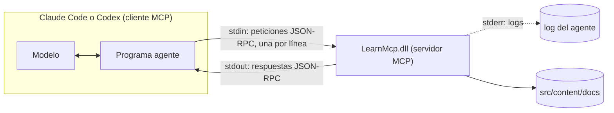

Los hooks y las skills cambian cómo un agente usa las herramientas que tiene. El [Model Context Protocol](https://modelcontextprotocol.io/) (MCP) le da herramientas nuevas: un servidor expone herramientas, el agente las lista, el modelo las llama. Si has escrito un servicio gRPC o un endpoint JSON-RPC, ya conoces la mayor parte. El servidor de esta lección son unas 120 líneas de C# con el [SDK oficial de C#](https://github.com/modelcontextprotocol/csharp-sdk), y la CI lo prueba en tres sistemas operativos sin ningún agente.

## La arquitectura



El agente inicia el servidor como proceso hijo y habla [JSON-RPC 2.0](https://www.jsonrpc.org/specification) por sus flujos estándar. El [transporte stdio](https://modelcontextprotocol.io/specification/2026-07-28/basic/transports/stdio) tiene una regla que los desarrolladores .NET rompen en su primer intento: «El servidor **NO DEBE** escribir en su `stdout` nada que no sea un mensaje MCP válido». Un `Console.WriteLine` para depurar, o un logger que escribe en la consola, corrompe el flujo. Los logs van a stderr. MCP también tiene un transporte HTTP, para servidores remotos; esta lección se queda en local.

## El servidor

[`mcp/LearnMcp/Program.cs`](https://github.com/spareilleux/learn/blob/13143d3a4d1d7d7b97fd087d4ad89c00e42fe788/code/agentic-coding/mcp/LearnMcp/Program.cs#L5-L15) es un [host genérico](https://learn.microsoft.com/dotnet/core/extensions/generic-host), como cualquier worker service de .NET:

```csharp
var builder = Host.CreateApplicationBuilder(args);

// stdout transporta el protocolo: cada línea de log va a stderr
builder.Logging.AddConsole(options => options.LogToStandardErrorThreshold = LogLevel.Trace);

builder.Services
    .AddMcpServer()
    .WithStdioServerTransport()
    .WithToolsFromAssembly();

await builder.Build().RunAsync();
```

`WithToolsFromAssembly` encuentra las clases estáticas marcadas con `[McpServerToolType]` y expone sus métodos `[McpServerTool]`. [`ScaleTools.cs`](https://github.com/spareilleux/learn/blob/13143d3a4d1d7d7b97fd087d4ad89c00e42fe788/code/agentic-coding/mcp/LearnMcp/ScaleTools.cs#L15-L19) declara la primera herramienta:

```csharp
[McpServerTool(Name = "scale_notes", ReadOnly = true, Idempotent = true)]
[Description("Spells the seven notes of a diatonic scale, one letter per degree: 'F major' gives Bb, not A#.")]
public static string[] ScaleNotes(
    [Description("Root note: a letter A to G, optionally followed by # or b, for example C, F# or Bb")] string root,
    [Description("major, minor, or a mode name: ionian, dorian, phrygian, lydian, mixolydian, aeolian, locrian")] string mode = "major")
```

El SDK convierte la firma en un JSON Schema y los atributos `[Description]` en el texto que lee el modelo; estas descripciones son toda la documentación de la herramienta, para un lector que no puede abrir tu código fuente. Una entrada no válida lanza [`McpException`](https://github.com/spareilleux/learn/blob/13143d3a4d1d7d7b97fd087d4ad89c00e42fe788/code/agentic-coding/mcp/LearnMcp/ScaleTools.cs#L54), que el SDK devuelve como error de herramienta.

La segunda herramienta, [`course_outline`](https://github.com/spareilleux/learn/blob/13143d3a4d1d7d7b97fd087d4ad89c00e42fe788/code/agentic-coding/mcp/LearnMcp/CourseTools.cs#L11-L37), muestra dos cosas más: un parámetro de tipo `IConfiguration` lo inyecta el host, no se expone al modelo, y lee el argumento de línea de comandos `--docs`; y el nombre del curso se valida contra `[a-z0-9-]` antes de convertirse en una ruta, porque el modelo pasará lo que se le dé, `../..` incluido.

## Hablar MCP a mano

Antes de fiarte de un SDK, mira lo que pasa por el cable. `LearnMcp.Check raw` inicia el servidor y envía las líneas de un archivo `.jsonl` una a una, mostrando cada respuesta. La CI lo ejecuta para las dos eras del protocolo.

### El handshake heredado, hasta 2025-11-25

Hasta la revisión [2025-11-25](https://modelcontextprotocol.io/specification/2025-11-25/basic/lifecycle), una sesión empieza con `initialize`. [`expected-legacy.txt`](https://github.com/spareilleux/learn/blob/13143d3a4d1d7d7b97fd087d4ad89c00e42fe788/code/agentic-coding/mcp/expected-legacy.txt), con las líneas abreviadas con `…`:

```text
--> {"jsonrpc":"2.0","id":1,"method":"initialize","params":{"protocolVersion":"2025-11-25","capabilities":{},"clientInfo":{"name":"by-hand","version":"1.0"}}}
<-- {"result":{"protocolVersion":"2025-11-25","capabilities":{"logging":{},"tools":{"listChanged":true}},"serverInfo":{"name":"LearnMcp","version":"1.0.0.0"}},"id":1,"jsonrpc":"2.0"}
--> {"jsonrpc":"2.0","method":"notifications/initialized"}
--> {"jsonrpc":"2.0","id":2,"method":"tools/list"}
<-- {"result":{"tools":[{"name":"course_outline",…,"annotations":{"readOnlyHint":true}},{"name":"scale_notes",…,"annotations":{"idempotentHint":true,"readOnlyHint":true}}]},"id":2,"jsonrpc":"2.0"}
--> {"jsonrpc":"2.0","id":3,"method":"tools/call","params":{"name":"scale_notes","arguments":{"root":"F","mode":"major"}}}
<-- {"result":{"content":[{"type":"text","text":"[\u0022F\u0022,\u0022G\u0022,\u0022A\u0022,\u0022Bb\u0022,\u0022C\u0022,\u0022D\u0022,\u0022E\u0022]"}]},"id":3,"jsonrpc":"2.0"}
--> {"jsonrpc":"2.0","id":4,"method":"tools/call","params":{"name":"scale_notes","arguments":{"root":"H"}}}
<-- {"result":{"content":[{"type":"text","text":"An error occurred invoking \u0027scale_notes\u0027: \u0027H\u0027 is not a note: use a letter A to G, optionally followed by # or b."}],"isError":true},"id":4,"jsonrpc":"2.0"}
exit code: 0
```

Tres detalles. El `string[]` volvió como JSON dentro de un bloque de texto, con `"` escapado como `\u0022` por el codificador por defecto de System.Text.Json. `ReadOnly = true` se convirtió en `readOnlyHint`, una indicación que, según la especificación, los clientes «**DEBEN** considerar … no confiable salvo que venga de servidores confiables». Y `H` produjo un **resultado** con `isError: true`, no un error JSON-RPC.

### La revisión sin estado, 2026-07-28

La [revisión actual](https://modelcontextprotocol.io/specification/2026-07-28/changelog) elimina el handshake: «Cada petición lleva ahora su versión de protocolo y las capacidades del cliente en `_meta`», y los servidores «DEBEN implementar» [`server/discover`](https://modelcontextprotocol.io/specification/2026-07-28/server/discover). [`expected-stateless.txt`](https://github.com/spareilleux/learn/blob/13143d3a4d1d7d7b97fd087d4ad89c00e42fe788/code/agentic-coding/mcp/expected-stateless.txt):

```text
--> {"jsonrpc":"2.0","id":1,"method":"server/discover","params":{"_meta":{"io.modelcontextprotocol/protocolVersion":"2026-07-28","io.modelcontextprotocol/clientCapabilities":{},"io.modelcontextprotocol/clientInfo":{"name":"by-hand","version":"1.0"}}}}
<-- {"result":{"supportedVersions":["2026-07-28"],"capabilities":{"logging":{},"tools":{"listChanged":true}},"ttlMs":0,"cacheScope":"private","resultType":"complete","_meta":{"io.modelcontextprotocol/serverInfo":{"name":"LearnMcp","version":"1.0.0.0"}}},"id":1,"jsonrpc":"2.0"}
--> {"jsonrpc":"2.0","id":2,"method":"tools/call","params":{"name":"scale_notes","arguments":{"root":"Bb","mode":"minor"},"_meta":{…}}}
<-- {"result":{"content":[{"type":"text","text":"[\u0022Bb\u0022,\u0022C\u0022,\u0022Db\u0022,\u0022Eb\u0022,\u0022F\u0022,\u0022Gb\u0022,\u0022Ab\u0022]"}],"resultType":"complete","_meta":{"io.modelcontextprotocol/serverInfo":{"name":"LearnMcp","version":"1.0.0.0"}}},"id":2,"jsonrpc":"2.0"}
exit code: 0
```

El mismo servidor, SDK 2.2.0, responde a las dos eras. Sin el bloque `_meta`, `server/discover` respondió con el error JSON-RPC `-32602`: la petición «requires per-request metadata declaring a supported protocol version». Dos trampas de una tubería en bruto, encontradas al escribir la herramienta: el servidor puede responder a las peticiones fuera de orden, así que el modo raw espera cada respuesta antes de enviar la línea siguiente; y no responde en absoluto a las notificaciones.

## Probar con el cliente del SDK

El modo por defecto de [`LearnMcp.Check`](https://github.com/spareilleux/learn/blob/13143d3a4d1d7d7b97fd087d4ad89c00e42fe788/code/agentic-coding/mcp/LearnMcp.Check/Program.cs#L19-L25) inicia el servidor como lo hace un agente:

```csharp
var transport = new StdioClientTransport(new StdioClientTransportOptions
{
    Name = "learn",
    Command = "dotnet",
    Arguments = [server, "--docs", docs],
});
await using var client = await McpClient.CreateAsync(transport);
```

y después lista las herramientas y las llama con argumentos buenos y malos. Parte de [`expected.txt`](https://github.com/spareilleux/learn/blob/13143d3a4d1d7d7b97fd087d4ad89c00e42fe788/code/agentic-coding/mcp/expected.txt):

```text
server: LearnMcp, protocol 2026-07-28
…
scale_notes {"root":"Eb","mode":"dorian"}
  isError: False
  ["Eb","F","Gb","Ab","Bb","C","Db"]
scale_notes {"root":"C","mode":"blues"}
  isError: True
  An error occurred invoking 'scale_notes': Unknown mode 'blues'. Use major, minor or one of: ionian, dorian, phrygian, lydian, mixolydian, aeolian, locrian.
course_outline {"course":"../.."}
  isError: True
  An error occurred invoking 'course_outline': '../..' is not a course folder name.
does_not_exist {}
  McpProtocolException: Request failed (remote): Unknown tool: 'does_not_exist'
```

El cliente negoció 2026-07-28. Los dos tipos de fallo siguen la [especificación de las herramientas](https://modelcontextprotocol.io/specification/2026-07-28/server/tools): una herramienta desconocida es un **error de protocolo**, que el cliente C# lanza como excepción; los argumentos incorrectos son un **error de ejecución de la herramienta**, `isError: true`, que «los clientes **DEBERÍAN** proporcionar … a los modelos de lenguaje para permitir la autocorrección». Escribe tus mensajes de error para el modelo: di qué estaba mal y qué es válido.

Esta es la parte de un servidor MCP que puedes probar como cualquier otro código, y es donde están la mayoría de los errores. Lo que el modelo hace con las herramientas es la parte que no puedes probar.

## Registrarlo en Claude Code

`claude mcp add` escribe la configuración; `--scope project` la pone en `.mcp.json`, versionado con el repositorio ([MCP en Claude Code](https://code.claude.com/docs/en/mcp)). El 2026-09-14 a las 22:56 UTC, en un repositorio Git vacío:

```text
> claude mcp add --scope project learn -- dotnet code/agentic-coding/mcp/LearnMcp/bin/Release/net10.0/LearnMcp.dll --docs src/content/docs
Added stdio MCP server learn with command: dotnet code/agentic-coding/mcp/LearnMcp/bin/Release/net10.0/LearnMcp.dll --docs src/content/docs to project config
File modified: C:\…\mcpadd\.mcp.json
> claude mcp get learn
learn:
  Scope: Project config (shared via .mcp.json)
  Status: ⏸ Pending approval (run `claude` to approve)
  Type: stdio
  Command: dotnet
  Args: code/agentic-coding/mcp/LearnMcp/bin/Release/net10.0/LearnMcp.dll --docs src/content/docs
  Environment:

To remove this server, run: claude mcp remove learn -s project
```

Todo lo que va después de `--` llega al servidor sin tocar. Un servidor de proyecto espera la aprobación de cada desarrollador en una sesión interactiva; `claude -p` no pregunta, y «conecta los servidores de su `.mcp.json`, incluso en una carpeta en la que nunca has confiado» ([modo headless](https://code.claude.com/docs/en/headless)), la misma precaución que con los hooks en la lección 3.

Las herramientas aparecen ante el modelo como `mcp__learn__scale_notes` y `mcp__learn__course_outline`, y las reglas de permisos usan esos nombres ([la configuración de ejemplo](https://github.com/spareilleux/learn/blob/13143d3a4d1d7d7b97fd087d4ad89c00e42fe788/code/agentic-coding/config/claude/settings.json) permite ambas). Una captura del 2026-09-14 a las 22:11 UTC, Claude Code 2.1.270, en un repositorio de pruebas con una copia del servidor y de la documentación:

```bash
claude -p "Spell the D dorian scale and the notes of Gb major with the scale_notes tool of the learn MCP server, then list the pages of the ladybugdb course with course_outline. Answer briefly." --allowedTools "mcp__learn__scale_notes,mcp__learn__course_outline" --output-format stream-json --verbose
```

La transcripción, abreviada:

```text
init          mcp_servers: … {"name": "learn", "status": "pending"} …
ToolSearch    {"query": "+learn scale_notes course_outline", "max_results": 5}
  result      tool_reference mcp__learn__course_outline, tool_reference mcp__learn__scale_notes, …
mcp__learn__scale_notes {"root": "D", "mode": "dorian"}    → ["D","E","F","G","A","B","C"]
mcp__learn__scale_notes {"root": "Gb", "mode": "major"}    → ["Gb","Ab","Bb","Cb","Db","Eb","F"]
mcp__learn__course_outline {"course": "ladybugdb"}         → index.md: LadybugDB — Mission …
```

Cinco turnos, y el modelo llamó a los dos `scale_notes` en paralelo. Separó «D dorian» en los dos parámetros por su cuenta, a partir del esquema. Fíjate en la primera llamada: las herramientas MCP no están en el contexto del modelo al arrancar. Con la [búsqueda de herramientas](https://code.claude.com/docs/en/mcp#scale-with-mcp-tool-search) (tool search), activada por defecto, el modelo solo conoce los nombres de las herramientas y busca el esquema de una herramienta cuando lo necesita, lo que evita que decenas de servidores llenen el contexto. `Gb major` volvió con `Cb`, la grafía correcta; una implementación basada en clases de altura (pitch classes) habría dicho `B`.

### Una ruta que no se expande

El [`.mcp.json`](https://github.com/spareilleux/learn/blob/13143d3a4d1d7d7b97fd087d4ad89c00e42fe788/code/agentic-coding/config/claude/.mcp.json) de ejemplo usa rutas relativas a la raíz del repositorio. La alternativa obvia, `${CLAUDE_PROJECT_DIR}` como en los hooks, falla. Tres variantes del mismo servidor, el 2026-09-14 a las 22:54 UTC:

```json
{
  "mcpServers": {
    "expanded":  { "command": "dotnet", "args": ["${CLAUDE_PROJECT_DIR}/server/LearnMcp.dll", "--docs", "${CLAUDE_PROJECT_DIR}/docs"] },
    "defaulted": { "command": "dotnet", "args": ["${CLAUDE_PROJECT_DIR:-.}/server/LearnMcp.dll", "--docs", "${CLAUDE_PROJECT_DIR:-.}/docs"] },
    "relative":  { "command": "dotnet", "args": ["server/LearnMcp.dll", "--docs", "docs"] }
  }
}
```

`claude mcp list` avisó: «[expanded] mcpServers.expanded: Missing environment variables: CLAUDE_PROJECT_DIR». En una sesión `claude -p`, `expanded` falló con `CONNECTION_CLOSED` y los otros dos se conectaron. La documentación lo explica: `CLAUDE_PROJECT_DIR` «se define en el entorno del servidor, no en el entorno propio de Claude Code, así que referenciarla mediante la expansión `${VAR}` en `command` o `args` … requiere un valor por defecto como `${CLAUDE_PROJECT_DIR:-.}`». Un servidor también puede leer la variable por sí mismo al arrancar. Los hooks y los servidores MCP se parecen en la configuración, y la misma variable sigue reglas distintas en cada uno.

## Registrarlo en Codex

Codex guarda los servidores MCP en `config.toml`, `~/.codex/config.toml` por defecto o `.codex/config.toml` en un proyecto confiable ([MCP en Codex](https://learn.chatgpt.com/docs/extend/mcp)). Con `CODEX_HOME` apuntando a una carpeta vacía, el 2026-09-14 a las 22:57 UTC, CLI de Codex 0.154.0, desde la raíz de este repositorio (se ha quitado un aviso sobre los alias de PATH en una carpeta temporal):

```text
> codex mcp add learn -- dotnet code/agentic-coding/mcp/LearnMcp/bin/Release/net10.0/LearnMcp.dll --docs src/content/docs
Added global MCP server 'learn'.
> codex mcp list
Name   Command  Args                                                                                       Env  Cwd  Status   Auth
learn  dotnet   code/agentic-coding/mcp/LearnMcp/bin/Release/net10.0/LearnMcp.dll --docs src/content/docs  -    -    enabled  Unsupported
```

y el archivo que escribió:

```toml
[mcp_servers.learn]
command = "dotnet"
args = ["code/agentic-coding/mcp/LearnMcp/bin/Release/net10.0/LearnMcp.dll", "--docs", "src/content/docs"]
```

`codex mcp list` no inicia el servidor: «enabled» significa configurado, no conectado. [El `config.toml` de ejemplo](https://github.com/spareilleux/learn/blob/13143d3a4d1d7d7b97fd087d4ad89c00e42fe788/code/agentic-coding/config/codex/config.toml) añade dos claves: `startup_timeout_sec = 30`, porque el valor por defecto es 10 segundos y un primer arranque de `dotnet` puede ser más lento; y `default_tools_approval_mode = "approve"`, uno de `auto`, `prompt`, `writes` y `approve`, donde «el modo `writes` pide confirmación para las herramientas que no están marcadas como de solo lectura». Codex también tiene `cwd`, `enabled_tools` y `disabled_tools` por servidor. Una sesión que llame realmente a las herramientas está *por verificar*, tras el límite de uso de la lección 1; también lo está el directorio de trabajo contra el que se resuelven las rutas relativas cuando `cwd` no está definido.

Algunos artículos antiguos muestran a Codex mismo como servidor MCP, `codex mcp-server`: «El comando `codex mcp-server` y el binario independiente `codex-mcp-server` se han eliminado» ([retirada del servidor MCP de Codex](https://learn.chatgpt.com/docs/mcp-server)).

## El caso GA: el diseño de las herramientas importa más que el protocolo

[GuitarAlchemist/ga](https://github.com/GuitarAlchemist/ga/tree/a826864f3a012cad88e415954bf57eca0ce12aa6/GaMcpServer) tiene un servidor MCP real, `GaMcpServer`, con la misma configuración de host que `LearnMcp`, logs a stderr incluidos, ModelContextProtocol 1.3.0 en lugar de 2.2.0, y un middleware de gobernanza de `Microsoft.AgentGovernance`. Expone decenas de herramientas de teoría musical. Una de ellas, [`GetScaleNotes`](https://github.com/GuitarAlchemist/ga/blob/a826864f3a012cad88e415954bf57eca0ce12aa6/GaMcpServer/Tools/ScaleTool.cs#L50-L80), hace el mismo trabajo que `scale_notes`:

```csharp
[McpServerTool]
[Description(
    "Get the 7 scale notes for a key string such as 'G major' or 'A minor'. " +
    "Returns a JSON array of {degree, note, pitchClass} objects suitable for fretboard overlays or theory analysis. " +
    "pitchClass is 0-11 (C=0, C#=1 … B=11). Supports major and natural minor only.")]
public static string GetScaleNotes(
    [Description("Key string in 'Root mode' format, e.g. 'G major', 'A minor', 'Bb major'")] string key)
{
    …
    string[] noteNames = ["C", "C#", "D", "D#", "E", "F", "F#", "G", "G#", "A", "A#", "B"];
    …
    var rootIndex = Array.IndexOf(noteNames, root);
    if (rootIndex < 0)
        return $"Unknown root note '{root}'. Use sharps (e.g. C#, F#) not flats for black keys.";

    var offsets = mode.StartsWith("minor") ? minor : major;
```

El mismo servidor, llamado desde la sesión que escribió esta lección el 2026-09-14 hacia las 22:57 UTC, desde una compilación local de ga cuyo `GetScaleNotes` tiene el mismo código:

| Llamada | Resultado |
|---|---|
| `get_scale_notes("F major")` | F G A **A#** C D E |
| `get_scale_notes("Bb major")` | «Unknown root note 'Bb'. Use sharps (e.g. C#, F#) not flats for black keys.» |
| `get_scale_notes("D dorian")` | D E **F#** G A B **C#**, las notas de D mayor |
| `get_key_notes("Key of F")` | F G A **Bb** C D E |

Cada fila es una lección de diseño de herramientas, y ninguna trata de MCP:

- **La descripción promete lo que el código rechaza.** El ejemplo del parámetro es `'Bb major'`, que la herramienta rechaza. El modelo lee la descripción, no el código.
- **Los errores se devuelven como resultados corrientes.** El rechazo es una cadena normal, sin `isError`, así que un cliente no puede distinguirlo de los datos. `LearnMcp` lanza en cambio `McpException`.
- **Los valores por defecto silenciosos producen respuestas erróneas plausibles.** Todo modo que no empiece por «minor» se trata como mayor. La descripción dice «major and natural minor only», pero un modelo al que se le pide D dórico recibe siete notas de aspecto válido, y no tiene motivo para dudar de ellas.
- **Dos herramientas de un mismo servidor no coinciden.** `get_key_notes` escribe F mayor con `Bb`, `get_scale_notes` con `A#`. El modelo puede llamar a cualquiera de las dos, según las palabras de la petición.
- **Las clases de altura no son nombres de notas.** `A#` y `Bb` son la misma tecla en un piano y notas distintas en F mayor: la grafía forma parte de la respuesta para un guitarrista que lee el resultado, y por eso `scale_notes` trabaja a partir de letras.

Son hallazgos sobre un repositorio público en un commit fijado; este curso no modifica ga, y están listados en el [diario](../journal/) para su autor.

## Puntos clave

- Un servidor MCP es un proceso que habla JSON-RPC por stdin y stdout; stdout está reservado para el protocolo, los logs van a stderr.
- Con el SDK de C#, un servidor es un host genérico, `AddMcpServer().WithStdioServerTransport().WithToolsFromAssembly()`, y las herramientas son métodos estáticos con atributos; las descripciones son la documentación que lee el modelo.
- La revisión 2026-07-28 es sin estado: sin `initialize`, `_meta` en cada petición, `server/discover`. El SDK 2.2.0 sirve las dos eras.
- Los argumentos incorrectos son un resultado de herramienta con `isError: true`, una herramienta desconocida es un error de protocolo; escribe mensajes de error que le digan al modelo qué es válido.
- Prueba el servidor con un cliente MCP en la CI; eso es determinista. Lo que un modelo hace con las herramientas no lo es.
- `.mcp.json` y `claude mcp add --scope project` para Claude Code, `[mcp_servers.x]` y `codex mcp add` para Codex. No uses `${CLAUDE_PROJECT_DIR}` en `.mcp.json` sin un valor por defecto.
- La mayoría de los errores de MCP son errores de diseño de herramientas: descripciones que mienten, errores que parecen datos, valores por defecto silenciosos.

## Ejercicios

1. Añade `Console.WriteLine($"Spelling {root} {mode}");` al principio de `ScaleNotes`, recompila y ejecuta los dos modos de `LearnMcp.Check`. Predice qué se rompe antes de ejecutarlo.

<details>
<summary>Solución</summary>

Lo probé el 2026-09-14 en una copia de `code/agentic-coding/mcp`. La sesión raw heredada muestra el flujo del protocolo corrompido:

```text
--> {"jsonrpc":"2.0","id":3,"method":"tools/call","params":{"name":"scale_notes","arguments":{"root":"F","mode":"major"}}}
<-- Spelling F major
--> {"jsonrpc":"2.0","id":4,"method":"tools/call","params":{"name":"scale_notes","arguments":{"root":"H"}}}
<-- Spelling H major
exit code: 0
```

La línea que el cliente lee como respuesta no es JSON, y `check.sh` fallaría en esta comparación. La sorpresa es el cliente del SDK: su salida fue **idéntica** a `expected.txt`, así que `check.sh` habría pasado. Se salta las líneas que no son mensajes JSON-RPC. Una prueba que solo pasa por un cliente tolerante no demuestra que el servidor siga la especificación, y por eso la CI también ejecuta las sesiones raw; si Claude Code y Codex son igual de tolerantes está *por verificar*. En un método de herramienta, registra los logs con un `ILogger` inyectado, que `Program.cs` envía a stderr, o con `Console.Error`.

</details>

2. Reescribe el contrato de `GetScaleNotes` de ga, sin cambiar su código, para que un modelo no pueda ser inducido a error: ¿qué cambiarías en las descripciones, y qué cambiarías en el tratamiento de errores?

<details>
<summary>Solución</summary>

Descripciones: quita `'Bb major'` de los ejemplos, y di en la descripción de la herramienta que las tónicas solo usan sostenidos y que los modos distintos de mayor y menor se **rechazan**, lo que implica cambiar el valor por defecto: `mode.StartsWith("minor") ? minor : major` acepta `dorian` como mayor. Tratamiento de errores: lanza `McpException` (o devuelve un resultado con `isError: true`) para una tónica desconocida y un modo desconocido, con la lista de valores válidos, para que el cliente y el modelo vean un fallo. Mejor aún, escribe las notas por letra como `scale_notes`, y acepta bemoles: la descripción pasa entonces a ser cierta. Y haz que `get_scale_notes` y `get_key_notes` compartan una sola implementación, con una prueba de que coinciden.

</details>

3. Tu equipo quiere el servidor `learn` en ambos agentes para todos los que clonen el repositorio, sin que nadie ejecute `claude mcp add` ni `codex mcp add`. ¿Qué archivos versionas, y qué le queda por hacer a cada desarrollador?

<details>
<summary>Solución</summary>

Versiona `.mcp.json` en la raíz para Claude Code y `.codex/config.toml` con `[mcp_servers.learn]` para Codex, con rutas relativas a la raíz del repositorio, y una línea en el README que diga que hay que compilar primero el servidor (`dotnet build code/agentic-coding/mcp/LearnMcp -c Release`), ya que ambos archivos apuntan a la salida de compilación. Cada desarrollador todavía tiene que aprobar el servidor de proyecto en una sesión interactiva de `claude`, y confiar en el proyecto en Codex, que es lo que activa la capa `.codex/` del proyecto. Ambas cosas son deliberadas: un repositorio clonado no debería iniciar procesos en tu máquina sin tu acuerdo, aunque `claude -p` lo haga. Si Codex resuelve los `args` relativos contra la raíz del repositorio cuando se inicia en un subdirectorio está *por verificar*. Un servidor que encuentra sus datos a partir de la ubicación de su propio ensamblado, o de `CLAUDE_PROJECT_DIR` en su entorno, evita la cuestión.

</details>

## Fuentes

- Especificación MCP 2026-07-28: [transporte stdio](https://modelcontextprotocol.io/specification/2026-07-28/basic/transports/stdio), [versionado](https://modelcontextprotocol.io/specification/2026-07-28/basic/versioning), [server/discover](https://modelcontextprotocol.io/specification/2026-07-28/server/discover), [herramientas](https://modelcontextprotocol.io/specification/2026-07-28/server/tools), [cambios desde 2025-11-25](https://modelcontextprotocol.io/specification/2026-07-28/changelog); [ciclo de vida 2025-11-25](https://modelcontextprotocol.io/specification/2025-11-25/basic/lifecycle)
- [SDK de C#](https://github.com/modelcontextprotocol/csharp-sdk), [ModelContextProtocol 2.2.0 en NuGet](https://www.nuget.org/packages/ModelContextProtocol/2.2.0)
- Claude Code: [MCP](https://code.claude.com/docs/en/mcp), [modo headless](https://code.claude.com/docs/en/headless)
- Codex: [MCP](https://learn.chatgpt.com/docs/extend/mcp), [retirada del servidor MCP de Codex](https://learn.chatgpt.com/docs/mcp-server)
