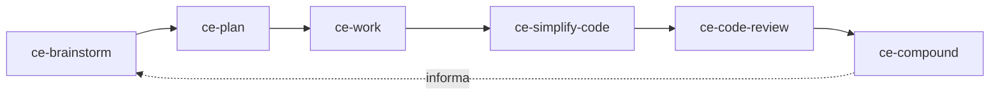

El [plugin Compound Engineering de Every](https://github.com/EveryInc/compound-engineering-plugin/tree/6be0932b91dc369508da19e6e2bc753b4c038830) empaqueta un ciclo completo de ingeniería. Esta lección está fijada en el commit `6be0932b` y la versión 3.27.0, comprobados el 20 de septiembre de 2026.

Su idea distintiva es el compounding: un problema no obvio y resuelto se convierte en un artefacto duradero en `docs/solutions/` que la planificación futura puede recuperar. El objetivo no es ejecutar más agentes; es hacer que el siguiente cambio similar sea más fácil y seguro.

## Instala y configura

Para Claude Code:

```text
/plugin marketplace add EveryInc/compound-engineering-plugin
/plugin install compound-engineering
```

Para Codex CLI:

```bash
codex plugin marketplace add EveryInc/compound-engineering-plugin
codex plugin add compound-engineering@compound-engineering-plugin
```

Reinicia el host si hace falta y luego invoca `ce-setup` con la sintaxis del host. Los hosts estilo Claude usan `/ce-setup`; Codex usa `$ce-setup`. Revisa el `.compound-engineering/config.yaml` propuesto antes de aceptarlo. La configuración de equipo se versiona; las preferencias locales del checkout pertenecen a `config.local.yaml`. Nunca pongas credenciales ni secretos de línea de comandos en esos archivos.

## El ciclo explícito



Lleva una pequeña función o bug por cada etapa:

```text
ce-brainstorm <problema y resultado para el usuario>
ce-plan
ce-work
ce-simplify-code
ce-code-review
ce-compound
```

En cada límite, inspecciona el artefacto:

| Etapa | Evidencia que conservar |
|---|---|
| Brainstorm / plan | requisitos, alternativas, alcance y comando de verificación |
| Work | commits y salida de pruebas controlada por el host |
| Simplify | diff que preserva el comportamiento |
| Review | hallazgos contra el fixed point nombrado |
| Compound | solución reutilizable con el fallo, causa y reparación verificada |

`lfg` automatiza gran parte del pipeline y puede hacer push o abrir una pull request cuando existe un remote. Aprende primero el ciclo explícito. El merge es una autoridad separada y nunca se infiere de un modo autónomo.

## Cómo encajan los tres sistemas

| Sistema | Papel principal | Mejor primer ejercicio |
|---|---|---|
| Skills de Matt Pocock | Pequeños procedimientos de ingeniería componibles | Un tracer bullet desde requisitos hasta revisión en dos ejes |
| Sandcastle | Ejecución aislada y gestión de ramas/commits | Una ejecución Docker, una rama nombrada, una iteración |
| Compound Engineering | Ciclo completo con aprendizaje duradero | Un cambio pequeño desde brainstorm hasta `ce-compound` |

No instales suites de workflow solapadas en el mismo primer fixture. Aprende el vocabulario y los artefactos nativos de cada una. Compónlas después solo cuando el límite diga quién puede modificar, commit, push, merge, usar credenciales, gastar dinero y declarar la finalización.

## Ejercicio

Elige un bug ya resuelto cuya causa no esté en la documentación del repositorio. Repite el ciclo explícito en una rama desechable e inspecciona la entrada `docs/solutions/`. Una segunda planificación debe encontrar ese aprendizaje y evitar redescubrir la misma causa. Si no puede, el ciclo no ha compuesto nada.

Los comandos anteriores se verificaron contra el código upstream, pero no se instaló ningún plugin ni se realizó una ejecución con modelo al escribir esta lección. Registra tal experimento en el [diario](../journal/) antes de afirmar que funciona en este repositorio.

