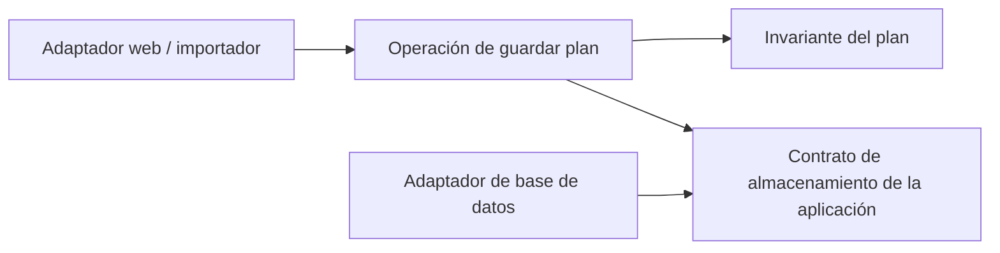

## Comparar decisiones, no formas

Los patrones se solapan. Un monolito modular puede contener módulos en capas; un módulo puede seguir reglas onion y usar adaptadores hexagonales. Un diagrama concéntrico no determina la topología de despliegue.

Las definiciones primarias proceden de la [guía de Microsoft](https://learn.microsoft.com/dotnet/architecture/modern-web-apps-azure/common-web-application-architectures), [Palermo sobre onion](https://jeffreypalermo.com/2008/07/the-onion-architecture-part-1/), [Martin sobre clean](https://blog.cleancoder.com/uncle-bob/2012/08/13/the-clean-architecture.html), [Cockburn sobre puertos y adaptadores](https://alistair.cockburn.us/hexagonal-architecture) y el modelo concreto de [Spring Modulith](https://docs.spring.io/spring-modulith/reference/fundamentals.html). Aplicamos esas ideas al plan de práctica inventado.

| Patrón | Pregunta principal | Organización del plan | Coste oculto / objeción más fuerte |
|---|---|---|---|
| Capas | ¿Qué responsabilidades llaman a cuáles? | Manejador → aplicación → acceso a datos; regla separada | El acoplamiento descendente puede propagar tipos de almacenamiento; un CRUD pequeño puede no necesitar más |
| Onion | ¿Qué dependencias pueden apuntar hacia el dominio? | Regla central; contrato de guardado interior, implementación exterior | Un dominio con poco comportamiento puede ganar anillos y conversiones sin beneficio |
| Clean | ¿Qué política posee el límite? | Invariante, caso de uso, modelos de entrada/salida, controlador y persistencia externos | Un presentador y varios modelos para una respuesta pequeña pueden ocultar el trabajo |
| Hexagonal | ¿Qué conversaciones útiles cruzan interior/exterior? | Web e importador conducen `SavePlan`; almacenamiento implementa la conversación de salida | Una interfaz por clase añade indirección; los puertos deben corresponder a conversaciones reales |
| Monolito modular | ¿Quién posee datos y comportamiento en un despliegue? | Practice posee planes; Catalog posiciones; Practice usa el contrato público de Catalog | Tablas compartidas e imports internos pueden borrar el límite; mantenerlo exige trabajo |

Las capas no prohíben invertir dependencias. Onion no exige cuatro anillos. La dirección de políticas de clean no exige cuatro proyectos. Hexagonal no exige seis puertos. Spring Modulith implementa unas reglas de módulos; no define todos los monolitos modulares.

## Separar dependencias del código y llamadas en ejecución

Con dependencias hacia dentro, la aplicación posee `PlanStore` y el adaptador de base de datos lo implementa. Durante la ejecución, la aplicación sigue llamando al adaptador. Dependencia del código y flujo de control apuntan, por tanto, en sentidos diferentes en ese límite.

Las flechas representan **dependencias del código**, no peticiones de red. El punto de composición elige el adaptador de almacenamiento. No hace falta un framework de inyección para demostrar la regla.

En la candidata modular, Catalog puede devolver un resumen inmutable de la posición y su revisión. Practice no puede acceder a las tablas internas de Catalog solo porque comparten proceso. Decidir explícitamente si una transacción abarca ambos módulos; compartir base de datos no crea propiedad independiente automáticamente.

## Elegir mediante un cambio de prueba

Añadir el importador y simular un cambio en la API de almacenamiento. La candidata en capas funciona si reutiliza la validación y contiene el cambio de almacenamiento. Añadir un puerto si una dependencia externa concreta impide ese resultado. Añadir un módulo si una responsabilidad distinta y un contrato público estable lo justifican.

Rechazar la abstracción adicional si no protege un invariante ni reduce responsabilidades afectadas. Mantenerla cuando una comprobación arquitectónica detecta una infracción que sería fácil introducir. Las [reglas de verificación de Spring Modulith](https://docs.spring.io/spring-modulith/reference/verification.html) ilustran detección de ciclos y acceso a elementos internos; las comprobaciones equivalentes deben corresponder al lenguaje y repositorio utilizados.

## Ejercicio — Dos diseños válidos

Dibujar la operación como (A) tres capas en un proyecto y (B) un módulo Practice con dependencias hacia dentro. Para cada uno, nombrar una dependencia legal y una prohibida. ¿Cuál debería elegir hoy un equipo de dos personas?

Solución razonada

A: el manejador puede llamar a la operación; una regla que importa un tipo de petición web viola el límite elegido. B: el adaptador de base puede implementar el contrato de Practice; Catalog no puede importar su modelo interno de persistencia. Ambos pueden pasar las mismas pruebas de comportamiento. Bajo nuestros supuestos, empezar con A salvo que el equipo demuestre una infracción de responsabilidad que B impide. El tamaño del equipo no decide por sí solo: dos personas en un dominio complejo y duradero podrían justificar B. Documentar esa evidencia en lugar de contar anillos.

