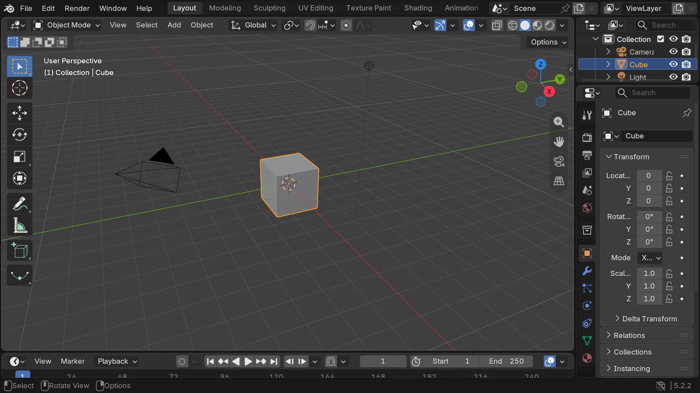
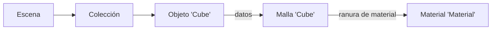

import { Tabs, TabItem } from '@astrojs/starlight/components';

Código: el script de la lección, [`scripts/l01_datablocks.py`](https://github.com/spareilleux/learn/blob/ced9808/code/blender/scripts/l01_datablocks.py), su informe [`expected/l01_datablocks.txt`](https://github.com/spareilleux/learn/blob/ced9808/code/blender/expected/l01_datablocks.txt), y el lanzador [`check.sh`](https://github.com/spareilleux/learn/blob/ced9808/code/blender/check.sh).

## La versión

[Blender](https://www.blender.org/) tiene dos tipos de versiones: una normal cada pocos meses, y una versión de **soporte a largo plazo (LTS)**, que sigue recibiendo actualizaciones con correcciones de errores mucho después de las siguientes versiones normales. El 16 de septiembre de 2026, la [página LTS](https://www.blender.org/download/lts/) enumera dos series LTS mantenidas, 5.2 y 4.5, ambas actualizadas por última vez el 15 de septiembre de 2026, a 5.2.2 y 4.5.14.

El curso fija **Blender 5.2.2 LTS**, commit [`d13f752e3b9c`](https://projects.blender.org/blender/blender/src/commit/d13f752e3b9c4f8c261cda552b1021f8bcc0382c) de la rama `blender-v5.2-release`. Blender es software libre bajo la [Licencia Pública General de GNU](https://www.blender.org/about/license/): la licencia cubre el programa, no lo que creas con él.

## Instalar Blender

Blender publica un archivo comprimido por plataforma en [download.blender.org](https://download.blender.org/release/Blender5.2/), con un archivo `blender-5.2.2.sha256` que enumera la suma de comprobación de cada uno. Un archivo comprimido no necesita instalador ni cambia nada en el sistema, así que puedes tener varias versiones una al lado de otra; así es como lo instala este curso.

<Tabs syncKey="os">
<TabItem label="Windows">

Descarga `blender-5.2.2-windows-x64.zip` (404.453.484 bytes), compruébalo y descomprímelo:

```powershell
Invoke-WebRequest https://download.blender.org/release/Blender5.2/blender-5.2.2-windows-x64.zip -OutFile blender-5.2.2-windows-x64.zip
(Get-FileHash blender-5.2.2-windows-x64.zip -Algorithm SHA256).Hash.ToLower()
# 3849d17a682cba006075aaa3f3597ecb5c9c30ec31035b2e092c53e40679b535
Expand-Archive blender-5.2.2-windows-x64.zip -DestinationPath G:\learn-lab\blender
G:\learn-lab\blender\blender-5.2.2-windows-x64\blender.exe --version
```

En la máquina del autor, `Get-FileHash` dio el hash de arriba; los comandos de descarga y extracción están *por verificar* tal como están escritos, ya que el archivo se descargó y se descomprimió de otra forma. El sitio también ofrece instaladores `.msi` y `.msix`, y una build para Windows on Arm. [winget](https://learn.microsoft.com/windows/package-manager/winget/) tiene el paquete `BlenderFoundation.Blender`, pero el 16 de septiembre de 2026 `winget show` seguía mostrando la 5.2.1, una versión por detrás: comprueba la versión antes de fiarte de él (*por verificar*: la instalación con winget).

</TabItem>
<TabItem label="Linux / WSL">

Descarga `blender-5.2.2-linux-x64.tar.xz` (383.295.504 bytes), compruébalo y descomprímelo:

```bash
curl -LO https://download.blender.org/release/Blender5.2/blender-5.2.2-linux-x64.tar.xz
curl -L https://download.blender.org/release/Blender5.2/blender-5.2.2.sha256 | grep linux-x64 | sha256sum -c
tar -xJf blender-5.2.2-linux-x64.tar.xz
./blender-5.2.2-linux-x64/blender --version
```

Son los comandos del job de CI del curso en Ubuntu. Blender también se publica como [Snap](https://snapcraft.io/blender) y en [Flathub](https://flathub.org/apps/org.blender.Blender) (*por verificar*: ambos, y qué versión ofrecen). En WSL, las ejecuciones con `--background` funcionan igual que en Linux; la interfaz necesita WSLg (*por verificar*).

</TabItem>
<TabItem label="macOS">

Blender 5.2.2 solo se publica para Apple Silicon: el archivo de sumas de comprobación enumera `blender-5.2.2-macos-arm64.dmg` (346.286.611 bytes) y ninguna build para Intel. Descárgalo, compruébalo y copia la aplicación fuera de la imagen de disco:

```bash
curl -LO https://download.blender.org/release/Blender5.2/blender-5.2.2-macos-arm64.dmg
curl -L https://download.blender.org/release/Blender5.2/blender-5.2.2.sha256 | grep macos-arm64 | shasum -a 256 -c
hdiutil attach -nobrowse -mountpoint /tmp/blender-dmg blender-5.2.2-macos-arm64.dmg
cp -R /tmp/blender-dmg/Blender.app ~/Applications/
hdiutil detach /tmp/blender-dmg
~/Applications/Blender.app/Contents/MacOS/Blender --version
```

Son los comandos del job de CI del curso en macOS. Abrir el `.dmg` en el Finder y arrastrar Blender a Aplicaciones hace lo mismo.

</TabItem>
</Tabs>

En la máquina del autor:

```text
$ blender --version
Blender 5.2.2 LTS
	build date: 2026-09-15
	build time: 01:37:04
	build commit date: 2026-09-14
	build commit time: 15:14
	build hash: d13f752e3b9c
	build branch: blender-v5.2-release
	build platform: Windows
	build type: Release
```

La salida completa continúa con las opciones del compilador y del enlazador.

## Blender sin ventana

Blender es una aplicación, pero su ejecutable también es una herramienta de línea de comandos. Los [argumentos de línea de comandos](https://docs.blender.org/manual/en/5.2/advanced/command_line/arguments.html) que importan en este curso son:

- `--background` (`-b`): sin ventana. Los scripts de Python se ejecutan, y después Blender se cierra.
- `--factory-startup`: ignora tus preferencias y tu archivo de inicio, y arranca desde la escena de fábrica. Así, dos máquinas parten del mismo estado.
- `--python <file>` y `--python-expr <code>`: ejecutan un script.
- `--python-exit-code 1`: sale con el código 1 si el script lanza una excepción. Sin esta opción, Blender imprime la traza y sale con 0, y la CI no se entera.
- `--`: todo lo que viene detrás se deja al script, en `sys.argv`.

```text
$ blender --background --factory-startup --python-expr "import bpy; print([o.name for o in bpy.data.objects])"
['Camera', 'Cube', 'Light']
Blender 5.2.2 LTS (hash d13f752e3b9c built 2026-09-15 01:37:04)

Blender quit
```

En esta ejecución, la salida del script apareció antes que el banner de Blender. Todos los scripts de este curso se ejecutan así, desde `check.sh`:

```bash
blender --background --factory-startup --python-exit-code 1 --python scripts/l01_datablocks.py -- out
```

## La interfaz

Arranca Blender sin `--background`. La primera vez, un diálogo Quick Setup pide el idioma, el tema y el mapa de teclas; deja los valores por defecto, que son los que usan el manual y este curso.



La ventana se divide en **áreas**, y cada área muestra un **editor**: el [3D Viewport](https://docs.blender.org/manual/en/5.2/editors/3dview/index.html) en el centro, el [Outliner](https://docs.blender.org/manual/en/5.2/editors/outliner/interface.html) arriba a la derecha (el árbol de la escena), el [Properties editor](https://docs.blender.org/manual/en/5.2/editors/properties_editor.html) debajo, y el Timeline abajo. El menú de la esquina superior izquierda de cada área cambia su tipo de editor. Las pestañas de la parte superior (Layout, Modeling, Sculpting, UV Editing, Shading…) son [workspaces](https://docs.blender.org/manual/en/5.2/interface/window_system/workspaces.html) (espacios de trabajo): disposiciones de áreas guardadas para una tarea, como las perspectivas de un IDE.

Unos pocos atajos del mapa de teclas por defecto ([`blender_default.py`](https://projects.blender.org/blender/blender/src/commit/d13f752e3b9c4f8c261cda552b1021f8bcc0382c/scripts/presets/keyconfig/keymap_data/blender_default.py)) cubren casi toda la navegación. Los atajos actúan sobre el área que está bajo el puntero del ratón, no sobre el área en la que hiciste clic por última vez:

| Acción | Atajo |
|---|---|
| Orbitar, desplazar, acercar la vista | arrastrar con el botón central, Shift + arrastrar con el botón central, rueda |
| Encuadrar la selección | `.` del teclado numérico |
| Vistas frontal, derecha, superior | `1`, `3`, `7` del teclado numérico (Ctrl para el lado opuesto) |
| Mover, rotar, escalar la selección | `G`, `R`, `S`, y opcionalmente `X`, `Y` o `Z` para fijar un eje |
| Cambiar entre Object Mode y Edit Mode | `Tab` |
| Buscar cualquier comando | `F3` |
| Maximizar el área bajo el puntero | `Ctrl` + `Space` |
| Duplicar, duplicado enlazado | `Shift` + `D`, `Alt` + `D` |

Object Mode (modo objeto) trabaja con objetos enteros; Edit Mode (modo edición) trabaja con los vértices, aristas y caras de una malla (lección 2). La [página de navegación](https://docs.blender.org/manual/en/5.2/editors/3dview/navigate/index.html) del manual cubre el resto, incluidos los portátiles sin teclado numérico ni botón central.

Dos cosas ayudan a un desarrollador. En **Edit › Preferences › Interface**, activa [**Python Tooltips**](https://docs.blender.org/manual/en/5.2/editors/preferences/interface.html): la información emergente de un campo muestra entonces su información de Python, como `bpy.data.objects["Cube"].location`. Y el workspace **Scripting** tiene una consola de Python, junto a un [Info editor](https://docs.blender.org/manual/en/5.2/editors/info_editor.html) que registra los operadores que ejecutas.

## El archivo .blend es una base de datos

Guarda la escena y obtienes un archivo `.blend`. No es un documento con una estructura fija: se parece más a una base de datos, con una tabla por tipo de **bloque de datos** (data-block). El [manual](https://docs.blender.org/manual/en/5.2/files/data_blocks.html) los llama data-blocks, la API de Python los llama [`ID`](https://docs.blender.org/api/5.2/bpy.types.ID.html), y `bpy.data` da acceso a todas las tablas. El script imprime las que no están vacías en la escena de fábrica:

```text
== What bpy.data holds (non-empty collections)
bpy.data.cameras: ['Camera']
bpy.data.scenes: ['Scene']
bpy.data.objects: ['Camera', 'Cube', 'Light']
bpy.data.materials: ['Dots Stroke', 'Material']
bpy.data.meshes: ['Cube']
bpy.data.lights: ['Light']
bpy.data.screens: ['Animation', 'Compositing', 'Geometry Nodes', 'Layout', 'Modeling', 'Rendering', 'Scripting', 'Sculpting', 'Shading', 'Texture Paint', 'UV Editing']
bpy.data.window_managers: ['WinMan']
bpy.data.images: ['Render Result', 'Viewer Node']
bpy.data.worlds: ['World']
bpy.data.collections: ['Collection']
bpy.data.palettes: ['Palette']
bpy.data.linestyles: ['LineStyle']
bpy.data.workspaces: ['Animation', 'Compositing', 'Geometry Nodes', 'Layout', 'Modeling', 'Rendering', 'Scripting', 'Sculpting', 'Shading', 'Texture Paint', 'UV Editing']
```

Los workspaces y las pantallas están en la lista: la disposición de la interfaz se guarda en el archivo, junto a la escena. `Dots Stroke` es el material por defecto de Grease Pencil, los objetos de dibujo 2D de Blender.

### Los objetos y sus datos

Un **objeto** guarda dónde está algo (posición, rotación, escala, padre) y apunta a sus **datos**, que guardan qué es: una malla, una cámara, una luz. El material es un tercer bloque de datos, al que apunta la malla:

```text
== The factory startup scene
scene 'Scene' engine BLENDER_EEVEE frames 1 - 250
collection 'Scene Collection' objects []
  collection 'Collection' objects ['Camera', 'Cube', 'Light']
object 'Camera' type CAMERA data Camera 'Camera' location (7.359, -6.926, 4.958)
object 'Cube' type MESH data Mesh 'Cube' location (0.000, 0.000, 0.000)
object 'Light' type LIGHT data PointLight 'Light' location (4.076, 1.005, 5.904)

== An object points to its data
cube.data is bpy.data.meshes['Cube']: True
mesh 'Cube' vertices 8 edges 12 faces 6 loops 24
material slots [('DATA', 'Material')]
users: object 1 mesh 1 material 1
```



En términos de C# o Java, un objeto y su malla son dos instancias, y el objeto guarda una referencia a la malla. La diferencia es que Blender cuenta las referencias: cada bloque de datos tiene un recuento `users` (usuarios), como el recuento de referencias de un objeto COM o el contador de uso de un `shared_ptr`.

### Duplicados enlazados y completos

**Shift + D** duplica un objeto y, por defecto, su malla. **Alt + D** crea un *duplicado enlazado*: un objeto nuevo que apunta a la misma malla. Qué datos copia Shift + D es una preferencia (Edit › Preferences › Editing › Duplicate Data): las mallas y las luces sí, los materiales no. El script hace ambas cosas a mano:

```python
linked = cube.copy()  # a new object, the same mesh
full = cube.copy()
full.data = mesh.copy()  # a new object and a new mesh
```

```text
== Linked duplicate (Alt+D) and full duplicate (Shift+D)
after the linked duplicate: objects 4 meshes 1 mesh users 2
after the full duplicate: meshes [('Cube', 2), ('Cube.001', 1)]
the material is shared by both meshes: material users 2
```

Editar en Edit Mode la malla de un duplicado enlazado cambia todos los objetos que la usan. El diapasón del curso (lección 2) lo aprovecha para sus 22 trastes: una malla, 22 objetos.

### Huérfanos, usuarios falsos, y lo que conserva el guardado

Eliminar un objeto no elimina su malla. La malla se queda en `bpy.data` con cero usuarios: es un **huérfano**. Blender no la libera mientras el archivo está abierto, pero **al guardar se omiten los bloques de datos que no tienen usuarios**. Para conservar un bloque de datos sin usuarios, dale un **usuario falso** (fake user, el icono del escudo junto a su nombre), que cuenta como un usuario:

```text
== Orphans and fake users
after removing the object 'Full': meshes [('Cube', 2), ('Cube.001', 0)]
a new mesh with a fake user: users 1 use_fake_user True
meshes written to the file: ['Cube', 'Kept']
objects written to the file: ['Camera', 'Cube', 'Light', 'Linked']
orphans_purge: {'FINISHED'} meshes left [('Cube', 2), ('Kept', 1)]
```

`bpy.data.libraries.load` abre un archivo `.blend` y enumera lo que contiene sin cargarlo: el huérfano `Cube.001` no se escribió. **File › Clean Up › Purge Unused Data** (`bpy.ops.outliner.orphans_purge`) elimina los huérfanos del archivo abierto.

Es un recolector de basura que se ejecuta al guardar, con recuentos de referencias en lugar de alcanzabilidad. Sorprende a quien espera que un archivo guardado contenga lo que ve en la vista *Blender File* del Outliner: un material que has creado y aún no has asignado desaparece tras guardar y volver a abrir.

### Los nombres

El nombre de un bloque de datos es su clave en su tabla, así que los nombres son únicos por tipo, no entre tipos. Blender añade `.001`, `.002` para resolver un conflicto. Los nombres están limitados a 255 bytes: [`DNA_ID.h`](https://projects.blender.org/blender/blender/src/commit/d13f752e3b9c4f8c261cda552b1021f8bcc0382c/source/blender/makesdna/DNA_ID.h#L366-L367) reserva 2 caracteres para el código de tipo y 256 para el nombre, con su cero final.

```text
== Names are unique per type
D.meshes.new('Cube').name: 'Cube.001'
a material may also be called 'Cube': 'Cube'
a 300-character name is cut to 255 characters
```

Los scripts deben quedarse con el objeto que devuelve `new`, no volver a buscarlo por el nombre que pidieron.

## RNA: propiedades que se describen a sí mismas

Cada campo que ves en la interfaz es una **propiedad RNA**, la capa de reflexión de Blender. La API de Python, la interfaz, la animación y los drivers pasan todos por ella. Cada propiedad lleva metadatos, como un `PropertyInfo` de C# con atributos, o un `PropertyDescriptor` de JavaBeans:

```text
== RNA: properties describe themselves
Object.location: type FLOAT subtype TRANSLATION unit LENGTH array_length 3
default [0.0, 0.0, 0.0]
repr(cube): bpy.data.objects['Cube']
repr(cube.location): Vector((0.0, 0.0, 0.0))
path_from_id('location'): location
path_resolve('location'): Vector((0.0, 0.0, 0.0))
Object has 141 RNA properties; Mesh has 71
an ID's own properties: ['rna_type', 'name', 'name_full', 'id_type', 'session_uid', 'is_evaluated', 'original', 'users']
```

El subtipo `TRANSLATION` y la unidad `LENGTH` son la razón por la que la interfaz muestra `location` como tres distancias en metros. El `repr` de un bloque de datos es la expresión de Python que lo vuelve a encontrar, y `path_from_id` da la *ruta de datos* de una propiedad a partir de su bloque de datos: la lección 7 anima propiedades a través de esas rutas. Merece la pena leer una vez la [visión general de la API](https://docs.blender.org/api/5.2/info_overview.html) y su [página de trampas habituales](https://docs.blender.org/api/5.2/info_gotcha.html).

| Blender | C# o Java |
|---|---|
| `bpy.data.meshes`, `bpy.data.objects`… | una tabla o un `DbSet` por tipo |
| bloque de datos (`ID`) con `users` | un objeto con recuento de referencias |
| objeto → datos → material | objetos que guardan referencias a instancias compartidas |
| huérfanos omitidos al guardar | recolección de basura en el momento de serializar |
| usuario falso | una raíz del GC |
| propiedad RNA con subtipo y unidad | `PropertyInfo` con atributos, `PropertyDescriptor` |

## Puntos clave

- Blender 5.2.2 LTS se instala desde un archivo comprimido comprobado con `blender-5.2.2.sha256`; `--background --factory-startup --python-exit-code 1` ejecuta un script de forma reproducible y falla cuando el script falla.
- La ventana está hecha de áreas que muestran editores; los workspaces son disposiciones guardadas, y también se almacenan en el archivo `.blend`.
- Un archivo `.blend` es una base de datos de bloques de datos, una tabla por tipo, con nombres únicos por tipo.
- Los objetos apuntan a datos, y los datos a materiales; cada bloque de datos cuenta sus usuarios.
- Al guardar se omiten los bloques de datos sin usuarios, salvo que tengan un usuario falso.
- RNA describe cada propiedad, y es lo que comparten la API de Python, la interfaz y la animación.

## Ejercicios

1. En la escena de fábrica, elimina el objeto `Cube`, guarda y vuelve a abrir el archivo. ¿Qué mallas y materiales contiene el archivo, y con cuántos usuarios?
2. Crea un duplicado enlazado del cubo. ¿Qué API enumera, para la malla y para el material, los bloques de datos que los usan?
3. Antes de ejecutarlo, predice qué imprime `blender --background --factory-startup --python-expr "import bpy; bpy.data.objects.remove(bpy.data.objects['Cube']); print(len(bpy.data.meshes))"`, y por qué.

<details>
<summary>Solución 1</summary>

```text
== Exercise 1: remove the Cube object, save, and reload
before saving: mesh 'Cube' users 0 | material 'Material' users 1
after reloading: meshes [] | materials [('Material', 0)]
```

La malla huérfana no se escribe. El material sí: al guardar, la malla huérfana todavía contaba como un usuario. Tras recargar, la malla ya no está, así que el material no tiene usuarios; se descartará en el siguiente guardado.

</details>

<details>
<summary>Solución 2</summary>

[`bpy.data.user_map`](https://docs.blender.org/api/5.2/bpy.types.BlendData.html#bpy.types.BlendData.user_map) devuelve, para cada bloque de datos, el conjunto de bloques de datos que lo usan:

```python
users = bpy.data.user_map(subset=[bpy.data.meshes["Cube"], bpy.data.materials["Material"]])
```

```text
== Exercise 2: who uses a data-block?
bpy.data.meshes['Cube'] is used by ["bpy.data.objects['Cube']", "bpy.data.objects['Twin']"]
bpy.data.materials['Material'] is used by ["bpy.data.meshes['Cube']"]
```

</details>

<details>
<summary>Solución 3</summary>

Imprime `1`. Eliminar el objeto deja la malla en `bpy.data.meshes`, con cero usuarios; solo guardar, o purgar, la descartaría.

</details>

## Fuentes

- Blender, [versiones LTS](https://www.blender.org/download/lts/), [licencia](https://www.blender.org/about/license/), y las [descargas de la 5.2.2](https://download.blender.org/release/Blender5.2/).
- Manual de Blender 5.2: [instalación](https://docs.blender.org/manual/en/5.2/getting_started/installing/index.html), [argumentos de línea de comandos](https://docs.blender.org/manual/en/5.2/advanced/command_line/arguments.html), [interfaz](https://docs.blender.org/manual/en/5.2/interface/index.html), [mapa de teclas](https://docs.blender.org/manual/en/5.2/interface/keymap/index.html), [bloques de datos](https://docs.blender.org/manual/en/5.2/files/data_blocks.html), [duplicados enlazados](https://docs.blender.org/manual/en/5.2/scene_layout/object/editing/duplicate_linked.html).
- API de Python de Blender 5.2: [`ID`](https://docs.blender.org/api/5.2/bpy.types.ID.html), [`BlendDataLibraries`](https://docs.blender.org/api/5.2/bpy.types.BlendDataLibraries.html), [visión general](https://docs.blender.org/api/5.2/info_overview.html), [trampas habituales](https://docs.blender.org/api/5.2/info_gotcha.html).
- Código fuente de Blender en la 5.2.2: [`DNA_ID.h`](https://projects.blender.org/blender/blender/src/commit/d13f752e3b9c4f8c261cda552b1021f8bcc0382c/source/blender/makesdna/DNA_ID.h), [`blender_default.py`](https://projects.blender.org/blender/blender/src/commit/d13f752e3b9c4f8c261cda552b1021f8bcc0382c/scripts/presets/keyconfig/keymap_data/blender_default.py).
