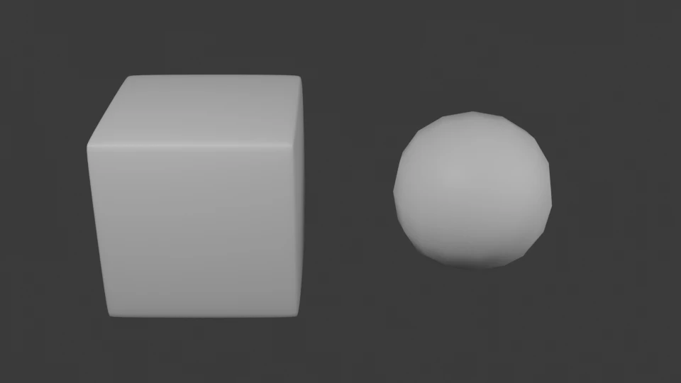

Código: el script de la lección, [`scripts/l02_modeling.py`](https://github.com/spareilleux/learn/blob/ced9808/code/blender/scripts/l02_modeling.py), el modelo del diapasón, [`scripts/fretboard.py`](https://github.com/spareilleux/learn/blob/ced9808/code/blender/scripts/fretboard.py), y el informe, [`expected/l02_modeling.txt`](https://github.com/spareilleux/learn/blob/ced9808/code/blender/expected/l02_modeling.txt).

## De qué está hecha una malla

Una [malla](https://docs.blender.org/manual/en/5.2/modeling/meshes/structure.html) es una lista de **vértices** (puntos), **aristas** (pares de vértices) y **caras** (polígonos cerrados de tres o más vértices). Blender añade un cuarto elemento que los tutoriales rara vez mencionan: el **loop**, o esquina de cara. Una cara de cuatro vértices tiene cuatro loops, y un vértice compartido por tres caras pertenece a tres loops. Todo lo que puede variar de una cara a otra en un mismo vértice se guarda por loop: las coordenadas UV (lección 3), las normales divididas, los colores de vértice.

El diapasón del curso empieza como una losa ahusada de ocho vértices y seis cuadriláteros, que se pasa a [`Mesh.from_pydata`](https://docs.blender.org/api/5.2/bpy.types.Mesh.html#bpy.types.Mesh.from_pydata) como listas de Python, igual que llenarías un búfer de vértices y un búfer de índices:

```python
verts = [
    (0, -w0, -THICKNESS), (length, -w1, -THICKNESS), (length, w1, -THICKNESS), (0, w0, -THICKNESS),
    (0, -w0, 0), (length, -w1, 0), (length, w1, 0), (0, w0, 0),
]
faces = [(0, 3, 2, 1), (4, 5, 6, 7), (0, 1, 5, 4), (1, 2, 6, 5), (2, 3, 7, 6), (3, 0, 4, 7)]
mesh = bpy.data.meshes.new(name)
mesh.from_pydata(verts, [], faces)
mesh.validate()
```

`from_pydata` deduce las aristas a partir de las caras, y `validate` busca datos no válidos en el resultado y corrige lo que encuentra. El informe:

```text
== A mesh from vertices and faces (from_pydata)
fretboard slab: V 8 E 12 F 6 loops 24
topology: {'quads': 6} boundary edges 0 non-manifold edges 0 V-E+F 2
face 0 (bottom) vertices [0, 3, 2, 1] normal (0.000, 0.000, -1.000)
face 1 (top) vertices [4, 5, 6, 7] normal (0.000, 0.000, 1.000)
the bottom face wound the other way: normal (0.000, 0.000, 1.000)
```

El orden de los vértices de una cara (su *winding*) fija su normal: vistos desde el lado hacia el que apunta la normal, los vértices giran en sentido antihorario. Recorre la cara inferior en el otro sentido y su normal apuntará hacia el interior de la losa. Los renderizadores y los exportadores usan las normales para el sombreado y para descartar las caras traseras, así que una cara del revés se ve negra o desaparece en three.js. En Edit Mode, [**Mesh › Normals › Recalculate Outside**](https://docs.blender.org/manual/en/5.2/modeling/meshes/editing/mesh/normals.html) (`Shift` + `N`) orienta hacia fuera las caras seleccionadas.

## La topología

Los modeladores hablan de **topología**: cómo se conectan los elementos, con independencia de dónde estén los vértices. El script cuenta algunas propiedades con [`bmesh`](https://docs.blender.org/api/5.2/bmesh.html), la estructura de malla editable de Blender:

```text
== Open and non-manifold meshes
one quad: V 4 E 4 F 1 {'quads': 1} boundary edges 4 non-manifold edges 4 V-E+F 1
three quads sharing one edge: V 8 E 10 F 3 {'quads': 3} boundary edges 9 non-manifold edges 10 V-E+F 1
the slab triangulated: V 8 E 18 F 12 {'tris': 12} boundary edges 0 non-manifold edges 0 V-E+F 2
```

- Una malla **manifold** (una variedad cerrada) es aquella en la que cada arista tiene exactamente dos caras: una superficie cerrada, como la losa. Una arista de **borde** tiene una sola cara, el borde de una lámina abierta. Una arista con tres caras, como el lomo de un libro de tres páginas, tampoco es manifold. La impresión 3D y las operaciones booleanas esperan mallas manifold.
- Para una superficie cerrada, **V − E + F** (vértices menos aristas más caras) es la característica de Euler: 2 para cualquier cosa con forma de esfera, se subdivida como se subdivida, y 0 para un toro (ejercicio 1). Es una comprobación barata de que una malla generada no tiene agujeros.
- Los **cuadriláteros** son la norma al modelar, porque los bucles de cuadriláteros se subdividen limpiamente y las herramientas de bucles de aristas los siguen. Los **triángulos** son lo que dibujan las GPU: el exportador glTF (lección 3) y la GPU lo triangulan todo de todos modos. Las caras de más de cuatro lados, los **n-gons**, van bien en superficies planas y dan problemas en las curvas.

Un `Mesh` guarda arrays planos, compactos y rápidos de leer. Un `BMesh` guarda la adyacencia: cada vértice conoce sus aristas, y cada arista sus caras. Es con lo que trabaja Edit Mode, y lo que usan los scripts para cambiar la topología. Se convierte de uno a otro con `bm.from_mesh(mesh)` y `bm.to_mesh(mesh)`, como cargarías un array inmutable en una estructura de grafo, lo editarías y lo volverías a escribir.

## Edit Mode

Selecciona el cubo, pulsa `Tab`, y estás en Edit Mode, donde trabajas con vértices (`1`), aristas (`2`) o caras (`3`). Las herramientas que más usa un principiante, con sus atajos por defecto:

| Herramienta | Atajo | Qué hace |
|---|---|---|
| [Extrude](https://docs.blender.org/manual/en/5.2/modeling/meshes/tools/extrude_region.html) | `E` | saca la selección hacia fuera, con caras nuevas a lo largo de sus lados |
| Inset | `I` | crea una cara más pequeña dentro de cada cara seleccionada |
| Loop cut | `Ctrl` + `R` | añade un bucle de aristas a través de una tira de cuadriláteros |
| [Bevel](https://docs.blender.org/manual/en/5.2/modeling/meshes/editing/edge/bevel.html) | `Ctrl` + `B` | sustituye las aristas vivas por una tira de caras |
| Knife | `K` | corta aristas nuevas a través de las caras |

Estas herramientas cambian la propia malla. Un modelo construido solo con ellas es una secuencia de ediciones cuyo historial se pierde al guardar: volver para cambiar el ancho del bisel obliga a deshacer todo lo que vino después.

## La pila de modificadores

Un [modificador](https://docs.blender.org/manual/en/5.2/modeling/modifiers/introduction.html) es una operación sobre la geometría de un objeto que no se aplica a la malla: la malla se queda como está, y Blender calcula el resultado cada vez que algo cambia. Los modificadores de un objeto forman una **pila**, que se ejecuta de arriba abajo, y cada uno toma la salida del anterior. Para un desarrollador C# o Java, es una cadena de decoradores alrededor de la malla, o un pipeline de LINQ o de Streams, evaluado por un grafo de dependencias cuando cambia una entrada.

El script añade un [Bevel](https://docs.blender.org/manual/en/5.2/modeling/modifiers/generate/bevel.html) y después un [Subdivision Surface](https://docs.blender.org/manual/en/5.2/modeling/modifiers/generate/subdivision_surface.html) a un cubo, y pide la malla evaluada al grafo de dependencias:

```python
def evaluated(obj):
    depsgraph = bpy.context.evaluated_depsgraph_get()
    eval_obj = obj.evaluated_get(depsgraph)
    text = counts(eval_obj.to_mesh())
    eval_obj.to_mesh_clear()
    return text
```

```text
== The modifier stack is evaluated; the mesh stays as it is
stack ['Bevel', 'Subdivision']
cube.data: V 8 E 12 F 6 | evaluated: V 866 E 1728 F 864
stack ['Subdivision', 'Bevel'] | evaluated: V 98 E 192 F 96
Subdivision hidden in the viewport | evaluated: V 56 E 108 F 54
Bevel applied: stack ['Subdivision'] | cube.data: V 56 E 108 F 54 | evaluated: V 866 E 1728 F 864
```

- `cube.data` conserva sus 8 vértices, haga lo que haga la pila. Lo que dibuja el viewport y lo que renderiza el renderizador es la malla **evaluada**, que calcula [`Depsgraph`](https://docs.blender.org/api/5.2/bpy.types.Depsgraph.html). `to_mesh` da una copia temporal, que `to_mesh_clear` libera. El exportador glTF es la excepción: escribe la malla sin sus modificadores salvo que actives **Apply Modifiers** ([`export_apply`](https://projects.blender.org/blender/blender/src/commit/d13f752e3b9c4f8c261cda552b1021f8bcc0382c/scripts/addons_core/io_scene_gltf2/__init__.py#L679-L684), desactivado por defecto).
- **El orden importa.** Con Bevel primero, se redondean las 12 aristas del cubo, y después la subdivisión suaviza una malla con biseles: un cubo redondeado. Con la subdivisión primero, el cubo se convierte en una casi esfera de 96 cuadriláteros, y después el bisel no hace nada: su método de límite por defecto solo bisela las aristas cuyas caras se encuentran con más de 30°, y ya no queda ninguna. La imagen muestra los dos casos.
- Cada modificador puede ocultarse en el viewport o en los renders sin eliminarlo.
- **Apply** escribe el resultado de un modificador en la malla y lo quita de la pila: los 56 vértices del bisel son ahora vértices reales de `cube.data`. Es el único paso que no es reversible.



La imagen la renderizó [`scripts/render_images.py`](https://github.com/spareilleux/learn/blob/ced9808/code/blender/scripts/render_images.py) con Cycles, con sombreado suave en los dos objetos. El sombreado suave solo cambia las normales usadas para la iluminación, no la geometría: la silueta de la esfera sigue mostrando sus facetas.

### Mirror y Array

Dos modificadores se encargan de copiar geometría. [Mirror](https://docs.blender.org/manual/en/5.2/modeling/modifiers/generate/mirror.html) refleja la malla respecto al origen del objeto, así que modelas la mitad de algo simétrico. [Array](https://docs.blender.org/manual/en/5.2/modeling/modifiers/generate/array.html) la repite con un desplazamiento, relativo al tamaño del objeto o constante:

```text
== Mirror and Array
a cube whose center is 1 m from the origin, mirrored in X, then 5 copies in Y: V 80 E 120 F 60
copies that touch, with Merge on: V 48 E 88 F 52
local bounds: evaluated (-1.50, -0.50, -0.50) (0.50, 4.50, 0.50) | cube.data (0.50, -0.50, -0.50) (1.50, 0.50, 0.50)
```

El espejo actúa respecto al origen del objeto, no respecto al centro de la malla: alejar la malla 1 m del origen es lo que separa las dos mitades. Con copias que se tocan y **Merge** activado, el modificador Array suelda los vértices donde se encuentran las copias: 8 contactos, de 4 vértices y 4 aristas cada uno, 32 menos de ambos, y las dos caras pegadas en cada contacto pasan a ser una, 8 caras menos. Esa cara se queda, dentro del sólido. Los límites evaluados van de −1,5 a 1,5 en X, mientras que la propia malla va de 0,5 a 1,5.

## El diapasón del curso

[`fretboard.py`](https://github.com/spareilleux/learn/blob/ced9808/code/blender/scripts/fretboard.py) construye el modelo que las lecciones siguientes iluminan, texturizan, renderizan y exportan:

- la tabla, la losa de arriba, de 476 mm de largo, 43 mm de ancho en la cejuela y 56 mm en el último traste;
- 22 alambres de traste: **una** malla de cubo, y 22 objetos, cada uno con su propia posición y escala, emparentados con la tabla;
- 10 marcadores de punto en los trastes 3, 5, 7, 9, 12 (dos), 15, 17, 19 y 21, que comparten una malla de cilindro.

El temperamento igual coloca el traste *n* a *escala* × (1 − 2<sup>−n/12</sup>) de la cejuela, así que cada intervalo es 2<sup>1/12</sup> veces más corto que el anterior. Un modificador Array solo puede repetir un desplazamiento constante o relativo, así que no puede colocar los trastes. Un bucle sí:

```python
for n in range(1, FRETS + 1):
    x = fret_x(n)
    obj = bpy.data.objects.new(f"Fret {n:02d}", wire)
    obj.location = (x, 0, FRET_WIRE_HEIGHT / 2)
    obj.scale = (FRET_WIRE_WIDTH, width_at(x), FRET_WIRE_HEIGHT)
    obj.parent = board
    coll.objects.link(obj)
```

```text
== The course's fretboard
mesh 'Fret wire': V 8 E 12 F 6, 22 objects: Fret 01 to Fret 22
mesh 'Fretboard': V 8 E 12 F 6, 1 objects: Fretboard to Fretboard
mesh 'Inlay dot': V 48 E 72 F 26, 10 objects: Inlay 03 to Inlay 21
Fret 01: x 36.37 mm, length 44.01 mm
Fret 12: x 324.00 mm, length 52.04 mm
Fret 22: x 466.16 mm, length 56.00 mm
objects 33 | vertices stored 64 | vertices drawn 664
world bounds in mm (0.0, -28.1, -6.0) (476.2, 28.1, 1.2)
```

El traste 12 está a 324 mm, la mitad de la escala: la octava. Los duplicados enlazados de la lección 1 dan aquí su fruto: se guardan 64 vértices para 664 dibujados, y cambiar el perfil del alambre supone cambiar una sola malla. Antes de leer los límites en el mundo, el script llama a `bpy.context.view_layer.update()`: los objetos creados desde Python solo reciben su matriz de mundo, que incluye la transformación del padre, la próxima vez que se evalúa la view layer.

## Puntos clave

- Una malla son vértices, aristas, caras y loops; los datos que pueden variar por cara en un vértice, como las UV, viven en los loops.
- El orden de los vértices de una cara fija su normal; en una malla cerrada cada arista está en dos caras, y V − E + F = 2 cuando tiene forma de esfera.
- `Mesh` guarda arrays planos; `bmesh` guarda la adyacencia y es con lo que se edita la topología.
- Los modificadores forman una pila evaluada por el grafo de dependencias; la malla no cambia hasta que aplicas uno, y el orden de la pila cambia el resultado.
- Lee la malla evaluada con `evaluated_get(depsgraph).to_mesh()`, y libérala con `to_mesh_clear()`.
- Algunas formas siguen una regla que ningún modificador conoce, como los trastes; un script las coloca en un bucle.

## Ejercicios

1. Añade un toro con `bpy.ops.mesh.primitive_torus_add(major_segments=48, minor_segments=12)`. Predice su número de vértices, aristas y caras y su V − E + F, y después compruébalo.
2. Pon Subdivision antes que Bevel, como en la lección, y encuentra el ajuste de Bevel que hace que bisele el cubo subdividido. ¿Cuántos vértices tiene el resultado?
3. Comprueba con `fretboard.fret_x` que la razón entre dos intervalos consecutivos entre trastes es la misma a lo largo de todo el mástil, y compárala con 2<sup>1/12</sup>.

<details>
<summary>Solución 1</summary>

```text
== Exercise 1: the Euler characteristic of a torus
torus: V 576 E 1152 F 576 {'quads': 576} boundary edges 0 non-manifold edges 0 V-E+F 0
```

48 × 12 = 576 cuadriláteros y otros tantos vértices, ya que cada vértice inicia un cuadrilátero. Cada cuadrilátero tiene 4 aristas compartidas por 2 caras: 576 × 4 / 2 = 1.152 aristas. La superficie es cerrada y manifold, y V − E + F = 0, el valor de un toro.

</details>

<details>
<summary>Solución 2</summary>

El **Limit Method** (`limit_method`) del bisel vale por defecto `ANGLE`, con 30°. Ponlo a `NONE` y se biselan todas las aristas:

```text
== Exercise 2: Subdivision then Bevel, without the angle limit
limit_method ANGLE angle 30.0 | evaluated: V 98 E 192 F 96
limit_method NONE | evaluated: V 866 E 1728 F 864
```

Los números coinciden por casualidad con los del otro orden, pero las formas difieren: una malla casi esférica con un bisel estrecho en cada una de sus aristas, no un cubo redondeado.

</details>

<details>
<summary>Solución 3</summary>

```python
gaps = [fretboard.fret_x(n + 1) - fretboard.fret_x(n) for n in range(fretboard.FRETS)]
```

```text
== Exercise 3: the spacing of frets
gap nut-1 36.369 mm | gap 21-22 10.813 mm | gap n / gap n+1 ['1.059463'] | 2 ** (1/12) 1.059463
```

Las 21 razones redondean a los mismos seis decimales, 1,059463, que es 2<sup>1/12</sup>. El intervalo se reduce en ese factor en cada traste, y por eso el desplazamiento constante de un modificador Array no puede hacerlo.

</details>

## Fuentes

- Manual de Blender 5.2: [estructura de las mallas](https://docs.blender.org/manual/en/5.2/modeling/meshes/structure.html), [modificadores](https://docs.blender.org/manual/en/5.2/modeling/modifiers/introduction.html), [Bevel](https://docs.blender.org/manual/en/5.2/modeling/modifiers/generate/bevel.html), [Subdivision Surface](https://docs.blender.org/manual/en/5.2/modeling/modifiers/generate/subdivision_surface.html), [Mirror](https://docs.blender.org/manual/en/5.2/modeling/modifiers/generate/mirror.html), [Array](https://docs.blender.org/manual/en/5.2/modeling/modifiers/generate/array.html), [Extrude Region](https://docs.blender.org/manual/en/5.2/modeling/meshes/tools/extrude_region.html), [herramienta Bevel](https://docs.blender.org/manual/en/5.2/modeling/meshes/editing/edge/bevel.html).
- API de Python de Blender 5.2: [`Mesh`](https://docs.blender.org/api/5.2/bpy.types.Mesh.html), [`bmesh`](https://docs.blender.org/api/5.2/bmesh.html), [`Depsgraph`](https://docs.blender.org/api/5.2/bpy.types.Depsgraph.html), [`BevelModifier`](https://docs.blender.org/api/5.2/bpy.types.BevelModifier.html).
- Código fuente de Blender en la 5.2.2: [`blender_default.py`](https://projects.blender.org/blender/blender/src/commit/d13f752e3b9c4f8c261cda552b1021f8bcc0382c/scripts/presets/keyconfig/keymap_data/blender_default.py), el mapa de teclas por defecto.
