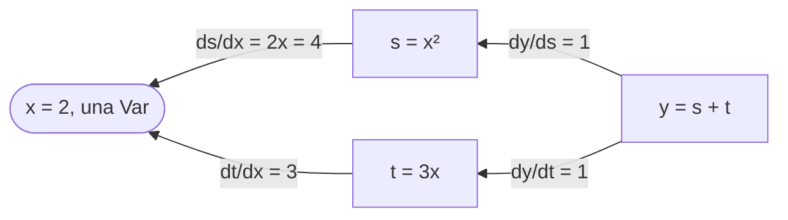

Entrenar un modelo significa seguir cuesta abajo el gradiente de una pérdida, y el [curso de IX, lección 2](../../machine-learning-ix/02-linear-regression/) calculó ese gradiente a mano para una recta. Los frameworks lo calculan para cualquier expresión construida con sus operaciones: eso es la diferenciación automática, en su modo inverso, la *retropropagación* de las redes neuronales. Esta lección usa la de Candle, la comprueba de tres maneras, luego entrena con ella la recta del curso de IX y pasa el mismo gradiente por la implementación propia de IX.

El código está en [`examples/l04_autodiff.rs`](https://github.com/spareilleux/learn/blob/c45b150/code/candle/course/examples/l04_autodiff.rs), [`examples/l04_linear_regression.rs`](https://github.com/spareilleux/learn/blob/c45b150/code/candle/course/examples/l04_linear_regression.rs) y [`examples/l04_exercises.rs`](https://github.com/spareilleux/learn/blob/c45b150/code/candle/course/examples/l04_exercises.rs).

## Tres nombres

| Candle | Qué es | PyTorch |
|---|---|---|
| [`Var`](https://docs.rs/candle-core/0.11.0/candle_core/struct.Var.html) | un tensor marcado como variable: se registran las operaciones que lo usan | un tensor con `requires_grad=True` |
| [`Tensor::backward`](https://docs.rs/candle-core/0.11.0/candle_core/struct.Tensor.html#method.backward) | recorre el grafo registrado desde un resultado hasta sus variables | `loss.backward()` |
| [`GradStore`](https://docs.rs/candle-core/0.11.0/candle_core/backprop/struct.GradStore.html) | los gradientes, consultados por tensor | el campo `.grad` de cada tensor |

La diferencia de la última fila determina todo lo demás. PyTorch escribe cada gradiente dentro del tensor, y le suma el siguiente en el próximo `backward` hasta que llamas a `zero_grad`. Candle devuelve un mapa nuevo en cada llamada a `backward` y no cambia ningún tensor.

## Una primera derivada

`y = x² + 3x` en `x = 2`, cuya derivada `2x + 3` vale 7 ([líneas 10-18](https://github.com/spareilleux/learn/blob/c45b150/code/candle/course/examples/l04_autodiff.rs#L10-L18)):

```rust
let x = Var::new(2f64, &dev)?;
let y = (x.sqr()? + x.affine(3., 0.)?)?;
let grads = y.backward()?;
println!("y {}", y.to_scalar::<f64>()?);
println!(
    "dy/dx {}",
    grads.get(&x).expect("x is a Var").to_scalar::<f64>()?
);
```

```text
== y = x^2 + 3x at x = 2, so dy/dx = 2x + 3 = 7
y 10
dy/dx 7
```

Una `Var` se desreferencia a un `Tensor`, así que `x.sqr()` funciona como con cualquier tensor. `affine(3., 0.)` calcula `3x + 0`; `x * 3.0` haría lo mismo. `grads.get(&x)` devuelve un `Option`: `None` cuando el resultado no depende de `x`.

[`backward`](https://github.com/huggingface/candle/blob/31f35b147389700ed2a178ee66a91c3cc25cc80d/candle-core/src/backprop.rs#L165-L200) ordena los nodos detrás de `y` para que cada uno venga antes que sus entradas, inicializa con unos el gradiente del propio `y`, y luego, para cada nodo, aplica la regla de la cadena y suma el resultado al gradiente de cada entrada:

```rust
pub fn backward(&self) -> Result<GradStore> {
    let sorted_nodes = self.sorted_nodes();
    let mut grads = GradStore::new();
    grads.insert(self, self.ones_like()?.contiguous()?);
    for node in sorted_nodes.iter() {
        if node.is_variable() {
            continue;
        }
        let grad = grads
            .remove(node)
            .expect("candle internal error - grad not populated");
```



`x` recibe 4 a través de `s` y 3 a través de `t`, y los dos suman 7.

## Qué tensores reciben un gradiente

[Las líneas 20-39](https://github.com/spareilleux/learn/blob/c45b150/code/candle/course/examples/l04_autodiff.rs#L20-L39) mezclan una `Var` con tensores simples:

```rust
let w = Var::new(&[1f32, -2., 3.], &dev)?;
let c = Tensor::new(&[4f32, 5., 6.], &dev)?;
let loss = w.mul(&c)?.sqr()?.sum_all()?; // sum((w * c)^2), d/dw = 2 * w * c^2
let grads = loss.backward()?;
```

```text
== which tensors get a gradient
d loss / dw: shape [3], F32, [32, -100, 216]
2 * w * c^2 by hand: shape [3], F32, [32, -100, 216]
d loss / dc, c a plain tensor: shape [3], F32, [8, 40, 108]
tensors in the GradStore: 2
loss = sum(w * exp(c)): gradient for e true, for c false
```

El gradiente de `w` coincide con la derivada a mano. La sorpresa es `c`: un tensor simple, nunca marcado, y también tiene un gradiente, `2 · w² · c`. Leer [`backprop.rs`](https://github.com/huggingface/candle/blob/31f35b147389700ed2a178ee66a91c3cc25cc80d/candle-core/src/backprop.rs#L165-L200) lo explica. El recorrido solo visita los nodos que conducen a una `Var`, pero cada nodo visitado entrega un gradiente a **todas** sus entradas, y nada elimina los gradientes de las entradas que no son nodos. Así que un tensor simple que es entrada directa de una operación registrada recibe uno; un tensor simple un paso más allá, como `c` detrás de `e = c.exp()`, no, porque el `exp` de un tensor simple nunca se registró.

No afecta al resultado y cuesta trabajo: en la regresión lineal de abajo, Candle calcula también un gradiente para los 52 números de páginas y los 52 tiempos de build. El `GradStore` de ese ejemplo contiene 4 tensores, `w`, `b`, `x` e `y`, como confirmó un programa de prueba que imprimía el id de cada tensor.

## Sumar, inicializar y no acumular

[Las líneas 41-63](https://github.com/spareilleux/learn/blob/c45b150/code/candle/course/examples/l04_autodiff.rs#L41-L63) comprueban tres reglas:

```rust
let h = w.affine(1., 1.)?; // h = w + 1
let twice = h.mul(&h)?.sum_all()?; // sum(h * h), d/dw = 2h
let v = w.sqr()?; // [w0^2, w1^2, w2^2]
let first = loss.backward()?;
let second = loss.backward()?;
```

```text
== a tensor used twice adds up its gradients
d sum(h*h) / dw: shape [3], F32, [4, -2, 8]

== backward on a tensor that isn't a scalar starts from ones
d v / dw, seeded with ones: shape [3], F32, [2, -4, 6]
d sum(v) / dw: shape [3], F32, [2, -4, 6]

== each backward returns a new GradStore: nothing accumulates between calls
first: shape [3], F32, [32, -100, 216]
second: shape [3], F32, [32, -100, 216]
```

- **Un tensor usado dos veces** recibe las dos contribuciones: `h · h` da a `h` un gradiente de `h` por cada lado, `2h = [4, -2, 8]` para `w = [1, -2, 3]`.
- **Un resultado que no es un escalar** se inicializa con unos, que es el gradiente de su suma. PyTorch rechaza `backward()` sobre un no escalar sin un argumento `gradient` explícito; Candle lo acepta en silencio, así que una pérdida que olvidaste reducir sigue "funcionando".
- **Dos llamadas dan los mismos gradientes.** No hay ningún `zero_grad` que olvidar. La otra cara: para sumar gradientes de varios lotes, sumas tú mismo los `GradStore`.

## Qué detiene un gradiente

[Líneas 65-81](https://github.com/spareilleux/learn/blob/c45b150/code/candle/course/examples/l04_autodiff.rs#L65-L81):

```rust
let stopped = w.detach().mul(&c)?.sum_all()?;
let rounded = w.affine(0.5, 0.)?.round()?.sum_all()?;
let through_max = w.max_keepdim(D::Minus1)?.sum_all()?;
```

```text
== detach and operations without a gradient
through detach: gradient for w None
through round: gradient for w None
through max: d max(w) / dw: shape [3], F32, [0, 0, 1]
```

- `detach` corta el grafo, como en la lección 3.
- `round`, `floor`, `ceil` y `sign` tienen una derivada nula casi en todas partes, y el recorrido se las salta ([`backprop.rs`, líneas 114-117](https://github.com/huggingface/candle/blob/31f35b147389700ed2a178ee66a91c3cc25cc80d/candle-core/src/backprop.rs#L114-L117)). El resultado es `None`, no un tensor de ceros, así que el código que hace `unwrap` del gradiente provoca un panic. Los tensores enteros tampoco tienen gradiente: una `Var` de `u32` recibe `None` (abajo).
- `max` envía todo el gradiente al elemento más grande, `3` en el índice 2.

Los propios gradientes se desacoplan del grafo ([líneas 176-182](https://github.com/huggingface/candle/blob/31f35b147389700ed2a178ee66a91c3cc25cc80d/candle-core/src/backprop.rs#L176-L182)), así que no está disponible el gradiente de un gradiente, una segunda derivada: el comentario de ese lugar deja las derivadas de segundo orden fuera del alcance. Una variable de entorno leída en la línea siguiente, `CANDLE_GRAD_DO_NOT_DETACH`, los mantiene acoplados (*por verificar*, el curso no lo ha probado).

## Comprobar contra diferencias finitas

Una derivada a mano sirve para expresiones pequeñas. Para cualquier función, la **diferencia central** `(f(a + ε) − f(a − ε)) / 2ε` aproxima cada derivada parcial, un elemento cada vez. [Las líneas 83-106](https://github.com/spareilleux/learn/blob/c45b150/code/candle/course/examples/l04_autodiff.rs#L83-L106) la comparan con `backward` para `sum(tanh(a · b))`, un producto de matrices seguido de una no linealidad, en `f64`:

```rust
let f = |a: &Tensor| -> candle_core::Result<Tensor> { a.matmul(&b)?.tanh()?.sum_all() };
let analytic = f(a.as_tensor())?.backward()?.get(&a).unwrap().clone();
let eps = 1e-6;
```

```text
== matmul against finite differences, f64
backward: shape [2, 3], F64, [0.007283, 0.001819, -0.007278, 0.420743, -0.419782, 1.259154]
finite differences: shape [2, 3], F64, [0.007283, 0.001819, -0.007278, 0.420743, -0.419782, 1.259154]
largest gap below 1e-8: true
```

Usa `f64` para esta comprobación: con `f32`, `ε = 1e-6` se pierde en el redondeo, y un `ε` mayor empeora la propia aproximación. Es la comprobación que hay que ejecutar cuando escribes una operación propia con su propio backward pass.

## `Var::set`

Para actualizar un parámetro, [`Var::set`](https://github.com/huggingface/candle/blob/31f35b147389700ed2a178ee66a91c3cc25cc80d/candle-core/src/variable.rs#L130-L151) copia valores nuevos en el buffer de la variable ([líneas 108-125](https://github.com/spareilleux/learn/blob/c45b150/code/candle/course/examples/l04_autodiff.rs#L108-L125)):

```text
== Var::set changes the value in place
p after set: shape [2], F32, [10, 20]
a clone taken before set sees it: shape [2], F32, [10, 20]
p.set(&p.detach()): error: cannot set variable cannot set a variable to a tensor that is derived from its value
p.set(3 values): error: shape mismatch in set, lhs: [2], rhs: [3]
p.set(f64 values): error: dtype mismatch in copy_strided, lhs: F64, rhs: F32
gradient for a u32 Var: None
```

- **La actualización es en el sitio**, la única mutación de un tensor que ha visto este curso: un clon tomado antes de `set` comparte el buffer (lección 3) y ve los valores nuevos.
- **Se rechaza un valor que comparte el buffer de la variable**, y `detach` lo comparte. `w - lr · grad` es un tensor nuevo, así que un paso de descenso pasa.
- **La forma y el tipo de elemento deben coincidir**; el error de dtype nombra `copy_strided`, la operación interna, con `lhs` y `rhs` en el orden inverso al de `set`.

[Los optimizadores de `candle-nn`](https://docs.rs/candle-nn/0.11.0/candle_nn/optim/index.html) hacen ese mismo `set` por ti (lección 5). Esta lección escribe el paso a mano, para compararlo con el curso de IX.

## La regresión lineal del curso de IX

El curso de IX ajusta `seconds = w · pages + b` a los tiempos de build de este sitio, sobre los 52 primeros de 65 builds en orden de commit, con el error cuadrático medio como pérdida. [`data/builds.csv`](https://github.com/spareilleux/learn/blob/c45b150/code/candle/data/builds.csv) es una copia de sus datos, y [las líneas 25-32](https://github.com/spareilleux/learn/blob/c45b150/code/candle/course/examples/l04_linear_regression.rs#L25-L32) escriben la pérdida con operaciones sobre tensores:

```rust
fn mse(x: &Tensor, y: &Tensor, w: &Tensor, b: &Tensor) -> candle_core::Result<Tensor> {
    x.broadcast_mul(w)?
        .broadcast_add(b)?
        .sub(y)?
        .sqr()?
        .mean_all()
}
```

`w` y `b` son tensores escalares, de forma `[]`, y las páginas un vector de 52, de ahí las operaciones `broadcast_` (lección 2).

### El gradiente, de tres maneras

En `w = 0, b = 0`, por Candle, por las fórmulas del curso de IX y por [`ix-autograd`](https://github.com/GuitarAlchemist/ix/tree/490c39533627d296bf9f8f050e6fafc14d7a20c2/crates/ix-autograd), la diferenciación automática propia de IX, fijada en el commit `490c395` en [`Cargo.toml`](https://github.com/spareilleux/learn/blob/c45b150/code/candle/Cargo.toml) ([líneas 52-115](https://github.com/spareilleux/learn/blob/c45b150/code/candle/course/examples/l04_linear_regression.rs#L52-L115)):

```rust
let w = Var::new(0f64, &dev)?;
let b = Var::new(0f64, &dev)?;
let loss = mse(&x, &y, &w, &b)?;
let grads = loss.backward()?;
// ix-autograd: el mismo grafo en su cinta, con x como matriz (n, 1) y w, b como (1, 1)
let mut ctx = DiffContext::new(ExecutionMode::Train);
let state = LinearRegressionTool::build_graph(
    &mut ctx,
    IxTensor::from_array(column(&pages)),
    IxTensor::from_array_with_grad(scalar(0.0)),
    IxTensor::from_array_with_grad(scalar(0.0)),
    IxTensor::from_array(column(&seconds)),
)?;
let ix_grads = ctx.backward(state.loss, ArrayD::from_elem(IxDyn(&[]), 1.0))?;
```

```text
== closed form in plain Rust, f64, 52 builds
seconds = 0.041707 * pages + 9.708880

== gradient of the loss at w = 0, b = 0, raw pages
candle:  loss 314.923077, dw -6724.461538, db -34.769231
by hand:              dw -6724.461538, db -34.769231
ix:      loss 314.923077, dw -6724.461538, db -34.769231
candle and ix agree to 1e-9: true
tape nodes in ix: 10, nodes behind candle's loss: 11
gradients ix computed: 10, gradients candle kept: 4
```

La forma cerrada es la recta del curso de IX, con seis decimales. Los tres gradientes coinciden. Las dos implementaciones están construidas de forma distinta:

| | Candle | ix-autograd en `490c395` |
|---|---|---|
| Dónde vive el grafo | en los tensores: cada uno guarda la operación que lo creó | en una cinta, una lista dentro de un `DiffContext` a la que las operaciones se añaden |
| Qué se registra | solo las operaciones que conducen a una `Var` | toda operación sobre el contexto, entradas incluidas |
| El recorrido | un orden topológico desde el resultado | la cinta en orden inverso de índices, ya que una entrada siempre tiene un índice menor ([`ops.rs`, líneas 382-440](https://github.com/GuitarAlchemist/ix/blob/490c39533627d296bf9f8f050e6fafc14d7a20c2/crates/ix-autograd/src/ops.rs#L382-L440)) |
| Gradientes devueltos | las variables y las entradas simples junto al grafo (4 aquí) | cada nodo del camino (10) |
| Tipos de elemento, dispositivos | de `f16` a `f64`, enteros, CPU, CUDA, Metal | `f64` en la CPU, sobre `ndarray` |
| Operaciones con backward pass | la mayoría de sus operaciones, de `matmul` a las convoluciones | `add`, `sub`, `mul`, `sum`, `matmul`, `div_scalar`, y una magnitud de FFT detrás de una feature |

Las dos suman las contribuciones de un nodo usado dos veces (IX con `+=` sobre su mapa), y las dos devuelven un mapa nuevo en cada llamada. La cinta de IX es la [lista de Wengert](https://en.wikipedia.org/wiki/Automatic_differentiation) de libro de texto, lo bastante pequeña para leerla de una sentada; la lección 1 citó su nota de que un backend de Candle podría llegar más adelante.

### Descenso con `Var::set`

[Las líneas 117-139](https://github.com/spareilleux/learn/blob/c45b150/code/candle/course/examples/l04_linear_regression.rs#L117-L139) repiten el descenso del curso de IX sobre los números de páginas sin escalar, con sus dos tasas de aprendizaje, imprimiendo la pérdida después del paso como hace el curso de IX:

```rust
for step in 1..=1000 {
    let grads = mse(&x, &y, &w, &b)?.backward()?;
    w.set(&(w.as_tensor() - (grads.get(&w).unwrap() * lr)?)?)?;
    b.set(&(b.as_tensor() - (grads.get(&b).unwrap() * lr)?)?)?;
```

```text
== gradient descent with Var::set, raw pages
learning rate 3e-5: step 1 loss 4.957e2 step 10 loss 3.373e4 step 1000 loss 4.538e207 -> w -3.4661e101, b -1.6887e99
learning rate 1e-5: step 1 loss 3.354e1 step 10 loss 1.565e1 step 1000 loss 1.561e1 -> w 8.8911e-2, b 2.0477e-2
```

Las pérdidas en los pasos 1, 10 y 1000 son las del curso de IX, dígito a dígito: `3e-5` diverge, `1e-5` avanza a paso de tortuga, y la explicación del curso (la curvatura de la pérdida es unas 360 000 veces mayor en su dirección más empinada que en la más plana) vale para cualquier framework. `w - lr · grad` necesita sus paréntesis y `?`: `Tensor - Tensor` da un `Result`, y `Result<Tensor> - f64` no compila (lección 2).

### Estandarizado, en `f64` y `f32`

Sobre las páginas estandarizadas `z = (pages − mean) / sd`, una tasa de aprendizaje de 0.1 converge en 100 pasos. [Las líneas 141-162](https://github.com/spareilleux/learn/blob/c45b150/code/candle/course/examples/l04_linear_regression.rs#L141-L162) lo ejecutan en los dos tipos flotantes y convierten el resultado de vuelta a páginas sin escalar:

```rust
for dtype in [DType::F64, DType::F32] {
    let z = x.affine(1.0 / sd_x, -mean_x / sd_x)?.to_dtype(dtype)?;
    let yt = y.to_dtype(dtype)?;
    let ws = Var::zeros((), dtype, &dev)?;
    let bs = Var::zeros((), dtype, &dev)?;
```

```text
== gradient descent with Var::set, standardized pages, learning rate 0.1, 100 steps
F64: ws 2.605694, bs 17.384615 -> w 0.041707, b 9.708880, gap to the closed form 2.0e-9
F32: ws 2.605694, bs 17.384611 -> w 0.041707, b 9.708877, gap to the closed form 2.8e-6
```

`f64` cae en los `ws 2.605694, bs 17.384615` del curso de IX. `f32` falla `b` en el sexto decimal: sus unos siete dígitos significativos no alcanzan para `17.384615` más el redondeo de 52 errores al cuadrado. Para un modelo de tiempos de build, no importa; para comparar dos implementaciones hasta `1e-9`, como arriba, usa `f64`. La suma `f32` de los mismos números también puede redondearse de otra forma en otro procesador (*por verificar* en macOS ARM, donde el CI del curso aún no se ha ejecutado).

## Puntos clave

- Una `Var` se registra, `backward` devuelve un `GradStore`, y `grads.get(&tensor)` da un `Option`. No se escribe nada en los tensores y nada se acumula entre llamadas.
- Los gradientes también llegan a los tensores simples que son entradas directas de operaciones registradas: correcto, pero trabajo de más.
- `backward` sobre un no escalar se inicializa con unos, en silencio. `round`, `floor`, `ceil`, `sign` y los tensores enteros dan `None`, no ceros. Las segundas derivadas no están soportadas por defecto.
- Comprueba un gradiente contra diferencias finitas centrales, en `f64`.
- `Var::set` actualiza en el sitio, rechaza un valor que comparte su buffer y necesita la misma forma y el mismo tipo.
- Candle e ix-autograd dan el gradiente y el descenso del curso de IX dígito a dígito; difieren en dónde vive el grafo y en lo que devuelven.

## Ejercicios

1. Para la regresión logística, `p = sigmoid(x · w + b)` y la pérdida es la media de `−(y log p + (1 − y) log(1 − p))`. Calcula el gradiente con Candle para `x = [[1, 2], [2, −1], [−1, −3], [0.5, 0.5]]`, `y = [1, 0, 0, 1]`, `w = [0.3, −0.2]`, `b = 0.1`, sin una función sigmoid, y compruébalo con la fórmula `x^T (p − y) / n`.

<details>
<summary>Solución</summary>

[Líneas 9-32](https://github.com/spareilleux/learn/blob/c45b150/code/candle/course/examples/l04_exercises.rs#L9-L32):

```rust
let z = x.matmul(&w.unsqueeze(1)?)?.squeeze(1)?.broadcast_add(&b)?;
let p = z.neg()?.exp()?.affine(1., 1.)?.recip()?;
let one_minus_y = y.affine(-1., 1.)?;
let loss = (y.mul(&p.log()?)? + one_minus_y.mul(&p.affine(-1., 1.)?.log()?)?)?
    .mean_all()?
    .neg()?;
let grads = loss.backward()?;
// A mano: dL/dw = x^T (p - y) / n, dL/db = mean(p - y)
let err = p.detach().sub(&y)?;
```

```text
== exercise 1: gradient of the logistic loss
loss 0.867068
candle dw: shape [2], F64, [0.022982, -0.934574]
candle db: shape [], F64, [0.086767]
by hand dw: shape [2], F64, [0.022982, -0.934574]
by hand db: shape [], F64, [0.086767]
```

`sigmoid(z) = 1 / (1 + exp(−z))` se escribe con `neg`, `exp`, `affine` y `recip`, y `backward` pasa por cada una. La fórmula a mano es corta porque la derivada de la pérdida logarítmica a través de una sigmoide se simplifica a `p − y`; la versión automática no lo sabe y multiplica cada derivada local, con el mismo resultado. `p.detach()` deja la comprobación fuera del grafo. Candle también tiene [`candle_nn::ops::sigmoid`](https://docs.rs/candle-nn/0.11.0/candle_nn/ops/fn.sigmoid.html) y [`candle_nn::loss::binary_cross_entropy_with_logit`](https://docs.rs/candle-nn/0.11.0/candle_nn/loss/fn.binary_cross_entropy_with_logit.html), para la lección 5.

</details>

2. Ajusta `seconds = a · z² + b · z + c` sobre los mismos 52 builds, con `z` las páginas estandarizadas, por descenso de gradiente desde ceros con una tasa de aprendizaje de 0.05. Imprime la pérdida en los pasos 1, 100 y 2000. ¿Lo hace mejor la curva que la recta, cuya pérdida es 5.908583 en el curso de IX?

<details>
<summary>Solución</summary>

[Líneas 34-81](https://github.com/spareilleux/learn/blob/c45b150/code/candle/course/examples/l04_exercises.rs#L34-L81):

```rust
let loss_of = |a: &Tensor, b: &Tensor, c: &Tensor| -> candle_core::Result<Tensor> {
    zz.broadcast_mul(a)?
        .add(&z.broadcast_mul(b)?)?
        .broadcast_add(c)?
        .sub(&y)?
        .sqr()?
        .mean_all()
};
for step in 1..=2000 {
    let grads = loss_of(&qa, &qb, &qc)?.backward()?;
    for v in [&qa, &qb, &qc] {
        v.set(&(v.as_tensor() - (grads.get(v).unwrap() * 0.05)?)?)?;
    }
```

```text
== exercise 2: seconds = a z^2 + b z + c on the standardized pages
step 1: loss 208.415392
step 100: loss 5.952060
step 2000: loss 5.899971
a -0.096816, b 2.603830, c 17.481431
```

La curva llega a 5.899971 frente a 5.908583 de la recta: un 0,15 % mejor sobre los datos con los que se entrenó, lo que todavía no dice nada de los builds que no ha visto, y un tercer parámetro siempre puede ajustar el conjunto de entrenamiento al menos igual de bien. `a` es pequeño y negativo, un ligero aplanamiento para muchas páginas. `z²` se calcula una vez, fuera del bucle, como tensor simple, y `loss_of` recibe las tres `Var` como `&Tensor` a través de `Deref`. `z²` abarca un rango mayor que `z`, así que la tasa de aprendizaje es 0.05 en lugar de 0.1: una primera suposición razonable (*por verificar* cuánto le falta a 0.1 para diverger). Para juzgar bien la curva, divide los builds como hace la lección 1 del curso de IX.

</details>

## Fuentes

- Candle en `31f35b1`: [`backprop.rs`](https://github.com/huggingface/candle/blob/31f35b147389700ed2a178ee66a91c3cc25cc80d/candle-core/src/backprop.rs), [`variable.rs`](https://github.com/huggingface/candle/blob/31f35b147389700ed2a178ee66a91c3cc25cc80d/candle-core/src/variable.rs); [`Var`](https://docs.rs/candle-core/0.11.0/candle_core/struct.Var.html) y [`GradStore`](https://docs.rs/candle-core/0.11.0/candle_core/backprop/struct.GradStore.html) en docs.rs
- IX en `490c395`: [`ix-autograd`](https://github.com/GuitarAlchemist/ix/tree/490c39533627d296bf9f8f050e6fafc14d7a20c2/crates/ix-autograd), su [`ops.rs`](https://github.com/GuitarAlchemist/ix/blob/490c39533627d296bf9f8f050e6fafc14d7a20c2/crates/ix-autograd/src/ops.rs) y [`tools/linear_regression.rs`](https://github.com/GuitarAlchemist/ix/blob/490c39533627d296bf9f8f050e6fafc14d7a20c2/crates/ix-autograd/src/tools/linear_regression.rs)
- [PyTorch: autograd mechanics](https://docs.pytorch.org/docs/stable/notes/autograd.html)
- Baydin, Pearlmutter, Radul y Siskind, [Automatic differentiation in machine learning: a survey](https://jmlr.org/papers/v18/17-468.html), JMLR 18, 2018
