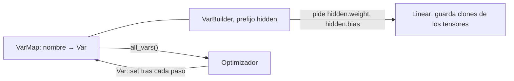

La lección 4 escribía cada paso de gradiente a mano con `Var::set`. [`candle-nn`](https://docs.rs/candle-nn/0.11.0/candle_nn/) agrupa las piezas que repite un bucle de entrenamiento: capas, un almacén para sus variables, pérdidas y optimizadores. Esta lección las toma una a una y contrasta cada una con lo que debe calcular, y luego entrena un clasificador con un conjunto de datos público, [Iris](https://archive.ics.uci.edu/dataset/53/iris). Las nueve predicciones sobre los resultados se escribieron en el [diario](../journal/#2026-09-30--lección-5-predicciones-antes-de-la-primera-ejecución) antes de que existiera este código; el diario las compara con lo que imprimen los programas.

El código está en [`examples/l05_modules.rs`](https://github.com/spareilleux/learn/blob/40470dc/code/candle/course/examples/l05_modules.rs), [`l05_losses.rs`](https://github.com/spareilleux/learn/blob/40470dc/code/candle/course/examples/l05_losses.rs), [`l05_optimizers.rs`](https://github.com/spareilleux/learn/blob/40470dc/code/candle/course/examples/l05_optimizers.rs), [`l05_iris.rs`](https://github.com/spareilleux/learn/blob/40470dc/code/candle/course/examples/l05_iris.rs) y [`l05_exercises.rs`](https://github.com/spareilleux/learn/blob/40470dc/code/candle/course/examples/l05_exercises.rs), con funciones auxiliares en [`src/lib.rs`](https://github.com/spareilleux/learn/blob/40470dc/code/candle/course/src/lib.rs).

## Seis nombres

| Candle | Qué es | PyTorch |
|---|---|---|
| [`Module`](https://docs.rs/candle-core/0.11.0/candle_core/trait.Module.html) | un trait con un solo método, `forward(&self, &Tensor) -> Result<Tensor>` | `nn.Module` |
| [`Linear`](https://docs.rs/candle-nn/0.11.0/candle_nn/linear/struct.Linear.html), [`linear`](https://docs.rs/candle-nn/0.11.0/candle_nn/linear/fn.linear.html) | un peso y un sesgo opcional; la función los crea en un `VarMap` | `nn.Linear` |
| [`seq`](https://docs.rs/candle-nn/0.11.0/candle_nn/sequential/fn.seq.html), [`Sequential`](https://docs.rs/candle-nn/0.11.0/candle_nn/sequential/struct.Sequential.html) | módulos aplicados uno tras otro | `nn.Sequential` |
| [`VarMap`](https://docs.rs/candle-nn/0.11.0/candle_nn/var_map/struct.VarMap.html), [`VarBuilder`](https://docs.rs/candle-nn/0.11.0/candle_nn/var_builder/type.VarBuilder.html) | las variables por nombre, y el manejador que usan las capas para crearlas o recuperarlas | los parámetros que registra un módulo, su `state_dict` |
| [`loss`](https://docs.rs/candle-nn/0.11.0/candle_nn/loss/index.html) | `cross_entropy`, `nll`, `mse`, `binary_cross_entropy_with_logit`, `huber` | `torch.nn.functional` |
| [`Optimizer`](https://docs.rs/candle-nn/0.11.0/candle_nn/optim/trait.Optimizer.html), [`SGD`](https://docs.rs/candle-nn/0.11.0/candle_nn/optim/struct.SGD.html), [`AdamW`](https://docs.rs/candle-nn/0.11.0/candle_nn/optim/struct.AdamW.html) | un trait y sus dos implementaciones | `torch.optim` |

## Una capa es un struct con `forward`

[`Linear`](https://github.com/huggingface/candle/blob/31f35b147389700ed2a178ee66a91c3cc25cc80d/candle-nn/src/linear.rs#L42-L79) calcula `x · wᵀ + b`, con `w` de forma `(out, in)` como en PyTorch. Se puede construir a partir de dos tensores cualesquiera ([líneas 31-43](https://github.com/spareilleux/learn/blob/40470dc/code/candle/course/examples/l05_modules.rs#L31-L43)):

```rust
let w = Tensor::new(&[[1f64, 2.], [3., 4.], [5., 6.]], &dev)?;
let b = Tensor::new(&[0.5f64, -0.5, 0.], &dev)?;
let layer = Linear::new(w, Some(b));
let x = Tensor::new(&[[10f64, 100.], [1., 1.]], &dev)?;
show("layer.forward(&x)", &layer.forward(&x)?, 1)?;
```

```text
== a Linear layer from given tensors: y = x · wᵀ + b
x: shape [2, 2], F64, [10.0, 100.0, 1.0, 1.0]
layer.forward(&x): shape [2, 3], F64, [210.5, 429.5, 650.0, 3.5, 6.5, 11.0]
x.matmul(&w.t()) + b: shape [2, 3], F64, [210.5, 429.5, 650.0, 3.5, 6.5, 11.0]
```

`forward` es un método del trait `Module`, definido en `candle-core` y reexportado por `candle-nn`. Sin el trait en el ámbito, la llamada no compila ([`lib.rs`, líneas 303-313](https://github.com/spareilleux/learn/blob/40470dc/code/candle/course/src/lib.rs#L303-L313)), y rustc dice qué import falta:

```text
error[E0599]: no method named `forward` found for struct `candle_nn::Linear` in the current scope
help: trait `Module` which provides `forward` is implemented but not in scope; perhaps you want to import it
    |
  1 + use candle_core::Module;
```

`use candle_nn::Module` también sirve: es el mismo trait.

`seq()` encadena módulos, y [`Activation::Relu`](https://docs.rs/candle-nn/0.11.0/candle_nn/activation/enum.Activation.html) también es uno ([líneas 45-56](https://github.com/spareilleux/learn/blob/40470dc/code/candle/course/examples/l05_modules.rs#L45-L56)). `forward_all` devuelve la salida de cada capa, lo que ayuda cuando una red da un resultado sorprendente:

```rust
let model = seq()
    .add(Linear::new(Tensor::new(&[[1f64, -1.], [-1., 1.]], &dev)?, None))
    .add(Activation::Relu)
    .add(Linear::new(Tensor::new(&[[1f64, 1.]], &dev)?, None));
for (i, t) in model.forward_all(&x)?.iter().enumerate() {
    show(&format!("after layer {i}"), t, 1)?;
}
```

```text
== a Sequential: Linear, ReLU, Linear
model.len(): 3
after layer 0: shape [2, 2], F64, [-90.0, 90.0, 0.0, 0.0]
after layer 1: shape [2, 2], F64, [0.0, 90.0, 0.0, 0.0]
after layer 2: shape [2, 1], F64, [90.0, 0.0]
```

La ReLU pone a cero el `-90`. Una pequeña rareza: [`Sequential::len`](https://github.com/huggingface/candle/blob/31f35b147389700ed2a178ee66a91c3cc25cc80d/candle-nn/src/sequential.rs#L16-L26) devuelve un `i64`, no un `usize`.

## Dónde viven los pesos: `VarMap` y `VarBuilder`

Una capa construida con `linear(in, out, vb)` no es dueña de sus pesos. Pide al `VarBuilder` un tensor llamado `weight` de forma `(out, in)`, y el builder se lo pide al `VarMap` que tiene detrás, que crea la variable la primera vez y devuelve la misma después ([líneas 58-92](https://github.com/spareilleux/learn/blob/40470dc/code/candle/course/examples/l05_modules.rs#L58-L92)):

```rust
let varmap = VarMap::new();
let vb = VarBuilder::from_varmap(&varmap, DType::F64, &dev);
let hidden = linear(4, 16, vb.pp("hidden"))?;
let _out = linear(16, 3, vb.pp("out"))?;
```

```text
== a VarMap behind a VarBuilder: linear(4, 16) and linear(16, 3)
hidden.bias: [16]
hidden.weight: [16, 4]
out.bias: [3]
out.weight: [3, 16]
parameters: 131, all_vars(): 4 variables
hidden.weight asked again with Init::Const(0.): same tensor true, values still nonzero true
hidden.weight asked with the shape (4, 16): error: shape mismatch on hidden.weight: [4, 16] <> [16, 4]
```



- **`pp` añade un prefijo**, y los nombres son rutas: `hidden.weight`, `out.bias`. Son los nombres que usan los archivos `safetensors`, y así cargará la lección 6 pesos publicados en las mismas capas.
- **La capa y el map comparten el almacenamiento.** `Linear` guarda un clon del tensor de la variable, y un clon comparte el búfer (lección 3): cuando el optimizador llama a `Var::set` sobre las variables del map, la capa ve los valores nuevos.
- **Volver a pedir devuelve lo que contiene el map**, sea cual sea la inicialización que pases ([`var_map.rs`, líneas 94-116](https://github.com/huggingface/candle/blob/31f35b147389700ed2a178ee66a91c3cc25cc80d/candle-nn/src/var_map.rs#L94-L116)); solo se comprueba la forma.
- **Un `VarMap` es un `HashMap` detrás de un mutex**: `all_vars()` devuelve las variables en un orden cualquiera. A los optimizadores les da igual, pero todo lo que las imprime o las compara debe ordenar los nombres, como hacen las funciones auxiliares de esta lección.

## Cómo inicializa `linear`

[`linear`](https://github.com/huggingface/candle/blob/31f35b147389700ed2a178ee66a91c3cc25cc80d/candle-nn/src/linear.rs#L84-L94) toma los pesos de `DEFAULT_KAIMING_NORMAL` ([`init.rs`, líneas 105-109](https://github.com/huggingface/candle/blob/31f35b147389700ed2a178ee66a91c3cc25cc80d/candle-nn/src/init.rs#L105-L109)): una normal de desviación típica `gain / √in`, con la ganancia de ReLU `√2` ([He et al., 2015](https://arxiv.org/abs/1502.01852)). Los sesgos son uniformes en `±1/√in`. El [`nn.Linear` de PyTorch](https://docs.pytorch.org/docs/2.14/generated/torch.nn.Linear.html) toma ambos uniformemente en `±1/√in`, así que sus pesos tienen una desviación típica de `1/√(3 · in)`. Las [líneas 94-125](https://github.com/spareilleux/learn/blob/40470dc/code/candle/course/examples/l05_modules.rs#L94-L125) miden un `linear(512, 512)`; los valores son aleatorios, así que el programa imprime comprobaciones en lugar de cifras:

```text
== the initialization of linear(512, 512), f64
weights: 262144 values, |mean| < 0.001 true, sd within 1% of √(2 / 512) = 0.0625 true
share beyond 2 sd within half a point of 4.55%, as a normal distribution: true
PyTorch's nn.Linear: sd 1/√(3 · 512) = 0.0255; candle's is 2.449 times larger
biases: 512 values, all within ±1/√512 = ±0.0442 true, sd within 10% of 0.0255 true
```

Los umbrales son lo bastante amplios para cumplirse en cada ejecución: con 262.144 pesos, la desviación típica medida varía en torno a un 0,14 %, y el 1 % es siete veces eso. La proporción más allá de dos desviaciones típicas distingue la normal de una uniforme, que no tiene ninguna.

La razón es `√6 ≈ 2.449`. No importa cuando cargas pesos entrenados, que sustituyen a los iniciales. Importa cuando portas un modelo de PyTorch y lo entrenas desde cero: la misma arquitectura parte de pesos unas 2,45 veces mayores, lo que puede cambiar la tasa de aprendizaje que funciona. La elección de Candle sigue el consejo del artículo para redes ReLU, e `init.rs` cita el `init.py` de PyTorch como fuente; el propio `nn.Linear` de PyTorch simplemente usa otro valor por defecto.

## Pesos con semilla

La lección 2 encontró que el generador de la CPU no admite semilla: `Device::Cpu.set_seed(42)` devuelve un error. Así que dos `VarMap` llenados por las mismas llamadas difieren, y lo mismo pasaría con cada salida de esta lección que depende del entrenamiento. [`reseed`](https://github.com/spareilleux/learn/blob/40470dc/code/candle/course/src/lib.rs#L78-L104) sobrescribe cada variable con valores de [SplitMix64](https://prng.di.unimi.it/splitmix64.c), un generador de 64 bits de diez líneas ([`lib.rs`, líneas 53-76](https://github.com/spareilleux/learn/blob/40470dc/code/candle/course/src/lib.rs#L53-L76)), recorriendo los nombres en orden:

```rust
let bound = if name.ends_with(".weight") {
    (6.0 / var.dims()[1] as f64).sqrt()
} else if let Some(layer) = name.strip_suffix(".bias") {
    match data.get(&format!("{layer}.weight")) {
        Some(weight) => 1.0 / (weight.dims()[1] as f64).sqrt(),
        None => candle_core::bail!("{name} has no matching weight"),
    }
}
```

Los pesos son uniformes en `±√(6 / in)`, cuya desviación típica es `√(2 / in)`, la misma que el sorteo normal de `linear`; los sesgos conservan el intervalo de `linear`. Un sorteo uniforme necesita una multiplicación y una suma por valor, que IEEE 754 redondea igual en todos los procesadores, mientras que un sorteo normal necesita `ln` y `cos`, que vienen de la biblioteca matemática de cada sistema y pueden diferir en el último bit. [Líneas 127-152](https://github.com/spareilleux/learn/blob/40470dc/code/candle/course/examples/l05_modules.rs#L127-L152):

```text
== two VarMaps filled by the same calls
same values: false
after reseed(&varmap, 5) on both: same values true
hidden.weight, first row: shape [4], F64, [0.811031, -0.095405, -0.839404, -0.109659]
all 64 weights within ±√(6 / 4) = ±1.2247: true
```

## Las pérdidas

### `cross_entropy`

[`cross_entropy`](https://github.com/huggingface/candle/blob/31f35b147389700ed2a178ee66a91c3cc25cc80d/candle-nn/src/loss.rs#L41-L47) toma puntuaciones brutas (logits) de forma `(n, clases)` y las clases como enteros, calcula [`log_softmax`](https://github.com/huggingface/candle/blob/31f35b147389700ed2a178ee66a91c3cc25cc80d/candle-nn/src/ops.rs#L31-L38), y luego [`nll`](https://github.com/huggingface/candle/blob/31f35b147389700ed2a178ee66a91c3cc25cc80d/candle-nn/src/loss.rs#L14-L30), que toma el valor de cada fila en su objetivo con `gather` y promedia los opuestos. Las [líneas 32-68](https://github.com/spareilleux/learn/blob/40470dc/code/candle/course/examples/l05_losses.rs#L32-L68) la comparan con la fórmula escrita en Rust simple, y luego le dan logits de 1000:

```rust
// −log softmax en el objetivo, es decir log Σ exp(z − max) − (z_objetivo − max), promediado sobre las filas
let by_hand = logits
    .iter()
    .zip(targets)
    .map(|(row, t)| {
        let max = row.iter().copied().fold(f64::MIN, f64::max);
        row.iter().map(|v| (v - max).exp()).sum::<f64>().ln() - (row[t as usize] - max)
    })
    .sum::<f64>()
    / 3.0;
```

```text
== cross_entropy against the formula, f64
candle 0.2458859914, by hand 0.2458859914, agree to 1e-12: true

== logits of 1000, 0 and -1000, f64
target 0: cross_entropy 0.0
target 1: cross_entropy 1000.0
target 2: cross_entropy 2000.0
ops::log_softmax: shape [1, 3], F64, [0.0, -1000.0, -2000.0]
log(exp(z) / sum(exp(z))), written naively: shape [1, 3], F64, [NaN, -inf, -inf]
```

`log_softmax` resta el máximo de cada fila antes de `exp`, así que el mayor exponente es `exp(0) = 1` y nada desborda. Escrito de forma ingenua, `exp(1000)` es infinito en `f64` (el límite está en torno a `exp(709.8)`), y `∞ / ∞` es NaN. Prefiere `cross_entropy` sobre logits a una softmax seguida de un logaritmo.

### Los objetivos que acepta `nll`

[Líneas 70-91](https://github.com/spareilleux/learn/blob/40470dc/code/candle/course/examples/l05_losses.rs#L70-L91):

```text
== the targets nll accepts
i64 targets: ok
f32 targets: error: unsupported dtype F64 for op gather
a target out of range, 4 of 4 classes: error: gather invalid index 4 with dim size 4
target u32::MAX in the second row: loss 0.1725049744, (row 1 + row 3) / 3 = 0.1725049744, / 2 = 0.2587574616
```

- **Los objetivos deben ser enteros** (`u8`, `u32` o `i64`). El error para objetivos `f32` nombra el tipo equivocado: `F64` es el tipo de los logits. [`gather` en la CPU](https://github.com/huggingface/candle/blob/31f35b147389700ed2a178ee66a91c3cc25cc80d/candle-core/src/cpu_backend/mod.rs#L2883-L2890) informa de `self.dtype()`, el tipo de la fuente, cuando el tipo no admitido es el de los índices; `index_select`, `scatter`, `scatter_add` e `index_add` hacen lo mismo (leído en las fuentes, líneas 2879 a 2973, no ejecutado), y `main` en [`5ba5d5b`](https://github.com/huggingface/candle/tree/5ba5d5b468b5b1df40e82dd3d556987bedeea041) sigue igual.
- **Un índice fuera de rango es un error**, no una lectura silenciosa.
- **`u32::MAX` se salta**: `gather` escribe 0 para un índice igual al máximo de su tipo ([líneas 623-626](https://github.com/huggingface/candle/blob/31f35b147389700ed2a178ee66a91c3cc25cc80d/candle-core/src/cpu_backend/mod.rs#L623-L626)), una regla intencionada desde el [pull request #2940](https://github.com/huggingface/candle/pull/2940). En una pérdida, esa fila no aporta nada, pero `nll` sigue dividiendo por el tamaño del lote: el resultado es la suma de las otras dos filas dividida por **3**. El [`CrossEntropyLoss`](https://docs.pytorch.org/docs/2.14/generated/torch.nn.CrossEntropyLoss.html) de PyTorch tiene un `ignore_index` que promedia «over non-ignored targets», lo que dividiría por 2. Ni la documentación de `nll` ni la de `gather` mencionan la regla.

### Entropía cruzada binaria con logits: NaN para una respuesta correcta

Para una salida de sí o no, la pérdida es `−(y · log p + (1 − y) · log(1 − p))` con `p = sigmoid(x)`. [`binary_cross_entropy_with_logit`](https://github.com/huggingface/candle/blob/31f35b147389700ed2a178ee66a91c3cc25cc80d/candle-nn/src/loss.rs#L64-L74) calcula exactamente eso: primero la sigmoide, luego los dos logaritmos. Las [líneas 93-137](https://github.com/spareilleux/learn/blob/40470dc/code/candle/course/examples/l05_losses.rs#L93-L137) la comparan, un logit cada vez, con la forma estable `max(x, 0) − x · y + log(1 + exp(−|x|))` ([líneas 23-27](https://github.com/spareilleux/learn/blob/40470dc/code/candle/course/examples/l05_losses.rs#L23-L27)):

```rust
fn stable_bce(x: &Tensor, y: &Tensor) -> candle_core::Result<Tensor> {
    let log_term = (x.abs()?.neg()?.exp()? + 1.0)?.log()?;
    (x.relu()? - (x * y)?)?.add(&log_term)?.mean_all()
}
```

```text
== binary_cross_entropy_with_logit, one logit at a time
type, logit, target: candle's loss and gradient | the stable form's loss and gradient
F32, 16, 1: 1.192e-7 -1.192e-7 | 1.192e-7 -1.192e-7
F32, 17, 1: NaN NaN | 0.000e0 0.000e0
F32, -100, 0: NaN NaN | 0.000e0 4e-44
F32, 17, 0: inf NaN | 1.700e1 1.000e0
F32, -100, 1: inf NaN | 1.000e2 -1.000e0
F64, 36, 1: 2.220e-16 -2.220e-16 | 2.220e-16 -2.220e-16
F64, 37, 1: NaN NaN | 0.000e0 0.000e0
F64, -800, 0: NaN NaN | 0.000e0 0.000e0
a batch of the logits 16 and 17, targets 1, F32: mean loss NaN
binary_cross_entropy_with_logit with U32 targets: error: dtype mismatch in mul, lhs: U32, rhs: F32
```

- **Una predicción segura y correcta da NaN.** En `f32`, `exp(−17) ≈ 4.1e−8` es menor que la mitad de la distancia entre 1 y el siguiente `f32` (`2⁻²⁴ ≈ 6.0e−8`), así que `1 + exp(−17)` se redondea a 1 y la sigmoide devuelve exactamente 1. Entonces `1 − p = 0`, `log 0 = −∞`, y el término `(1 − y) · log(1 − p)` vale `0 · (−∞)`, que es NaN. `exp(−16) ≈ 1.1e−7` sobrevive al redondeo. En `f64`, el mismo límite cae entre 36 y 37 (`2⁻⁵³ ≈ 1.1e−16`). Para el objetivo 0, ocurre cuando `exp(−x)` desborda: por debajo de `x ≈ −88.7` en `f32` y de `−709.8` en `f64`.
- **Una predicción segura y errónea da infinito** en lugar del valor correcto, 17 o 100: `log 0` del otro lado.
- **El gradiente es NaN en los seis casos que fallan**, así que una sola fila así en un lote hace NaN la media, y el optimizador escribiría NaN en cada peso.
- **La forma estable se mantiene finita** y su gradiente es `sigmoid(x) − y`; el `4e-44` es ese gradiente en `−100`, `exp(−100)`, un `f32` subnormal impreso con una cifra. Es la fórmula en la que se apoya el [`BCEWithLogitsLoss`](https://docs.pytorch.org/docs/2.14/generated/torch.nn.BCEWithLogitsLoss.html) de PyTorch, «the log-sum-exp trick». Sin un `log1p` en Candle 0.11.0, `log(1 + exp(−16))` sigue redondeándose: las dos formas imprimen `1.192e-7` donde la pérdida exacta es `1.125e-7`. Finita, no exacta.
- **La documentación dice que el objetivo es «a tensor of u32»**; tiene que ser un tensor flotante del tipo de los logits.

El [issue #2561](https://github.com/huggingface/candle/issues/2561) informa de esta inestabilidad desde octubre de 2024 y sigue abierto; `main` en `5ba5d5b` calcula la pérdida de la misma forma. Para entrenar un clasificador binario con Candle 0.11.0, escribe la forma estable, cinco líneas más arriba.

## Los optimizadores

`Optimizer` es un trait, y `new` es una de sus funciones: `SGD::new` no compila sin `use candle_nn::Optimizer` (`E0599`, «no function or associated item named `new` found for struct `SGD`», [`lib.rs`, líneas 315-325](https://github.com/spareilleux/learn/blob/40470dc/code/candle/course/src/lib.rs#L315-L325)); aquí también rustc sugiere el import. Su `backward_step(&loss)` llama a `backward` y luego a `step`, que actualiza con `Var::set` cada variable que tiene gradiente.

### SGD y AdamW, frente a los algoritmos

[`SGD`](https://github.com/huggingface/candle/blob/31f35b147389700ed2a178ee66a91c3cc25cc80d/candle-nn/src/optim.rs#L31-L70) no tiene momentum, como dice su comentario: un paso es `θ − lr · g`. [`AdamW`](https://github.com/huggingface/candle/blob/31f35b147389700ed2a178ee66a91c3cc25cc80d/candle-nn/src/optim.rs#L117-L183) es Adam con decaimiento de pesos desacoplado ([Loshchilov y Hutter, 2019](https://arxiv.org/abs/1711.05101)), con los valores por defecto de PyTorch: tasa de aprendizaje 0,001, betas 0,9 y 0,999, ε `1e-8`, decaimiento 0,01. Las [líneas 34-72](https://github.com/spareilleux/learn/blob/40470dc/code/candle/course/examples/l05_optimizers.rs#L34-L72) dan tres pasos sobre `Σ (θ − 1)²` junto al [algoritmo de PyTorch](https://docs.pytorch.org/docs/2.14/generated/torch.optim.AdamW.html), escrito a mano:

```rust
for i in 0..3 {
    let g = 2.0 * (p[i] - target[i]);
    m[i] = m[i] * beta1 + g * (1.0 - beta1);
    v[i] = v[i] * beta2 + g * g * (1.0 - beta2);
    let m_hat = m[i] * (1.0 / (1.0 - beta1.powi(step)));
    let v_hat = v[i] * (1.0 / (1.0 - beta2.powi(step)));
    p[i] = p[i] * (1.0 - lr * weight_decay) - m_hat / (v_hat.sqrt() + eps) * lr;
}
```

```text
== one SGD step, learning rate 0.1, f64
candle  [0.6, -0.8, 1.8]
by hand [0.6, -0.8, 1.8]
bit for bit: true

== three AdamW steps, learning rate 0.1, the other parameters at their defaults
ParamsAdamW { lr: 0.1, beta1: 0.9, beta2: 0.999, eps: 1e-8, weight_decay: 0.01 }
step 1: candle [0.599499999000, -1.148750000222, 1.898000000500], by hand [0.599499999000, -1.148750000222, 1.898000000500], within 1e-12 true, bit for bit true
step 2: candle [0.697722949537, -1.047747696713, 1.796525861893], by hand [0.697722949537, -1.047747696713, 1.796525861893], within 1e-12 true, bit for bit true
step 3: candle [0.793378661636, -0.947100267638, 1.695937627111], by hand [0.793378661636, -0.947100267638, 1.695937627111], within 1e-12 true, bit for bit true
```

Bit a bit, porque la transcripción hace las mismas operaciones en el mismo orden que `optim.rs`, e IEEE 754 redondea cada suma, multiplicación, división y raíz cuadrada igual en todas partes. El primer paso de AdamW mueve cada parámetro la tasa de aprendizaje, más el pequeño decaimiento, sea cual sea el tamaño de su gradiente: en el paso 1, `m̂ / √v̂` vale `g / |g|`. La implementación de PyTorch 2.14 ordena las operaciones de otra forma: divide `√v` por `√(1 − β₂ᵗ)` e incorpora `1 / (1 − β₁ᵗ)` al tamaño del paso ([`adam.py`, líneas 533-546](https://github.com/pytorch/pytorch/blob/v2.14.0/torch/optim/adam.py#L533-L546)). Debería coincidir con estos números salvo redondeo, no bit a bit (*por verificar*, el curso no ejecuta PyTorch).

### Qué conserva un optimizador

[Líneas 74-95](https://github.com/spareilleux/learn/blob/40470dc/code/candle/course/examples/l05_optimizers.rs#L74-L95):

```text
== the variables an optimizer keeps
SGD::new with a U32 and an F32 variable: ok, it keeps 1
AdamW::new with the same two variables: ok
a step on a loss of `used` only: used changed true, unused changed false
```

Los dos constructores descartan las variables cuyo tipo no es flotante ([`optim.rs`, líneas 44-47](https://github.com/huggingface/candle/blob/31f35b147389700ed2a178ee66a91c3cc25cc80d/candle-nn/src/optim.rs#L44-L47) y [línea 123](https://github.com/huggingface/candle/blob/31f35b147389700ed2a178ee66a91c3cc25cc80d/candle-nn/src/optim.rs#L123)), sin error. Y `step` se salta una variable que no tiene gradiente, tampoco sin decir nada. Las dos cosas son razonables, y las dos esconden el mismo error: una capa cuyas variables nunca llegan al optimizador, o no participan en la pérdida, simplemente no aprende. Pasar `varmap.all_vars()` evita el primer caso.

## Iris

El conjunto de datos Iris de Fisher (1936) mide 150 flores, 50 de cada una de tres especies, con cuatro números: el largo y el ancho del sépalo y del pétalo, en centímetros. Setosa se separa fácilmente de las otras dos; versicolor y virginica se solapan. El curso incluye en el commit los dos archivos del UCI Machine Learning Repository, sin cambios, bajo CC BY 4.0: [`data/README.md`](https://github.com/spareilleux/learn/blob/40470dc/code/candle/data/README.md) da su origen y su SHA-256. Entrena con `bezdekIris.data`, el corregido (ejercicio 1).

### División, modelo y entrenamiento

[`iris::split`](https://github.com/spareilleux/learn/blob/40470dc/code/candle/course/src/lib.rs#L139-L179) aparta una de cada cinco flores de cada especie, 10 por especie, y estandariza las cuatro medidas con las medias y desviaciones típicas de las 120 flores de entrenamiento solamente, para que nada del conjunto de prueba se filtre al entrenamiento. [`iris::model`](https://github.com/spareilleux/learn/blob/40470dc/code/candle/course/src/lib.rs#L187-L193) es un 4 → 16 → 3 con una ReLU, 131 parámetros, e [`iris::train`](https://github.com/spareilleux/learn/blob/40470dc/code/candle/course/src/lib.rs#L195-L211) es todo el bucle:

```rust
pub fn train<O: Optimizer>(
    model: &Sequential,
    opt: &mut O,
    x: &Tensor,
    y: &Tensor,
    epochs: usize,
) -> Result<Vec<f64>> {
    let mut losses = Vec::with_capacity(epochs);
    for _ in 0..epochs {
        let loss = loss::cross_entropy(&model.forward(x)?, y)?;
        losses.push(loss.to_dtype(DType::F64)?.to_scalar::<f64>()?);
        opt.backward_step(&loss)?;
    }
    Ok(losses)
}
```

Con 120 filas, cada época es un paso sobre todo el conjunto de entrenamiento: sin lotes, sin barajar, nada aleatorio una vez fijados los pesos con la semilla. [`l05_iris.rs`, líneas 52-98](https://github.com/spareilleux/learn/blob/40470dc/code/candle/course/examples/l05_iris.rs#L52-L98) entrenan con `AdamW` a una tasa de 0,01 durante 300 épocas:

```text
== data: bezdekIris.data
150 rows; training 120, test 30; per species in the test set: [10, 10, 10]
training means (cm): [5.8658, 3.0550, 3.7700, 1.2050]
training sds (cm):   [0.8484, 0.4378, 1.7796, 0.7555]

== AdamW, learning rate 0.01, 300 full-batch epochs, F64
F64, loss at epoch 1: 2.1380, 10: 0.9078, 50: 0.2556, 100: 0.1139, 200: 0.0484, 300: 0.0356
after training: loss 0.0355, training 118/120, test 29/30
test confusion matrix (rows: species, columns: prediction)
  setosa     [10, 0, 0]
  versicolor [0, 10, 0]
  virginica  [0, 1, 9]
  test row 23: ["6.0", "2.2", "5.0", "1.5"] cm, a virginica taken for a versicolor
```

La pérdida de los pesos iniciales, 2,138, supera `ln 3 ≈ 1.099`, la pérdida de un modelo que responde un tercio para cada especie: en promedio, la red inicial da a la especie correcta una probabilidad de `exp(−2.138) ≈ 0.12` (una media geométrica), menos de un tercio. La red acierta 29 de las 30 flores de prueba. El único error es la fila 120 del archivo, una virginica de pétalos cortos (5,0 cm) y de 1,5 cm de ancho, medidas en el rango de versicolor; ninguna setosa se clasifica mal. Con treinta flores de prueba, cada error vale 3,3 puntos de exactitud, y es una sola división con una sola semilla: la ejecución muestra que las piezas funcionan juntas, no lo bien que esta red clasifica iris en general.

### `f32`, y el SGD simple

Las [líneas 100-126](https://github.com/spareilleux/learn/blob/40470dc/code/candle/course/examples/l05_iris.rs#L100-L126) repiten el entrenamiento desde los mismos pesos, en `f32`, y luego con `SGD` a una tasa de 0,1:

```text
== the same training in F32, from the same weights
F32, loss at epoch 1: 2.1380, 10: 0.9078, 50: 0.2556, 100: 0.1139, 200: 0.0484, 300: 0.0356
final loss within 1e-4 of F64 true, same 30 test predictions true

== plain SGD, learning rate 0.1, from the same weights, F64
SGD, loss at epoch 1: 2.1380, 10: 0.6089, 50: 0.2990, 100: 0.2027, 200: 0.1189, 300: 0.0848
after training: loss 0.0846, test 29/30, higher than AdamW's: true
```

`f32` sigue a `f64` con cuatro decimales en cada época mostrada y hace las mismas 30 predicciones: para una red tan pequeña, la mitad de memoria no cuesta nada visible. `SGD` va por delante en la época 10 y por detrás desde la época 50, y termina con una pérdida de entrenamiento más del doble que la de AdamW, con la misma puntuación de prueba. La explicación habitual, no medida aquí: una sola tasa de aprendizaje para todas las direcciones es demasiado pequeña donde la pérdida es plana, lo que la lección 4 vio en el extremo, y la división de AdamW por `√v̂` da a cada parámetro su propio tamaño de paso.

## Para recordar

- Una capa es un struct que implementa `Module`; `linear` crea sus variables en un `VarMap` a través de un `VarBuilder`, con nombres de ruta (`hidden.weight`), y la capa comparte su almacenamiento con el map, así que los pasos del optimizador le llegan.
- `linear` inicializa los pesos con una normal de Kaiming, `√6 ≈ 2.45` veces el `nn.Linear` de PyTorch en desviación típica. El generador de la CPU de Candle no admite semilla: para un entrenamiento reproducible, sobrescribe tú mismo las variables.
- `cross_entropy` es estable con logits grandes. Sus objetivos son enteros; `u32::MAX` se salta una fila en silencio pero la cuenta en la media.
- `binary_cross_entropy_with_logit` devuelve NaN para predicciones seguras y correctas e infinito para las seguras y erróneas, desde `|x| ≈ 17` en `f32`. Escribe la forma estable.
- `SGD` (sin momentum) y `AdamW` coinciden bit a bit con sus algoritmos. Los dos descartan las variables no flotantes y se saltan las variables sin gradiente, en silencio.
- En Iris, 131 parámetros y 300 pasos de AdamW sobre el lote completo clasifican 29 de las 30 flores apartadas; `f32` da las mismas predicciones.

## Ejercicios

1. El archivo de la UCI contiene dos versiones de Iris, `iris.data` y `bezdekIris.data`. Encuentra las filas en las que difieren, y di qué versión coincide con el artículo de Fisher.

<details>
<summary>Solución</summary>

[Líneas 23-35](https://github.com/spareilleux/learn/blob/40470dc/code/candle/course/examples/l05_exercises.rs#L23-L35):

```rust
let old = include_str!("../../data/iris.data");
let new = include_str!("../../data/bezdekIris.data");
for (i, (a, b)) in old.lines().zip(new.lines()).enumerate() {
    if a != b {
        println!("row {}: iris.data {a}, bezdekIris.data {b}", i + 1);
    }
}
```

```text
== exercise 1: iris.data against bezdekIris.data
row 35: iris.data 4.9,3.1,1.5,0.1,Iris-setosa, bezdekIris.data 4.9,3.1,1.5,0.2,Iris-setosa
row 38: iris.data 4.9,3.1,1.5,0.1,Iris-setosa, bezdekIris.data 4.9,3.6,1.4,0.1,Iris-setosa
rows 35 and 38 of iris.data are identical: true
```

En `iris.data`, las filas 35 y 38 tienen las mismas cuatro medidas, y ambas difieren del artículo; el propio `iris.names` del archivo enumera las correcciones, que lleva `bezdekIris.data`. El archivo corregido lleva el nombre de James Bezdek, primero de los cinco autores de una nota de 1999 sobre las discrepancias, [*Will the real iris data please stand up?*](https://doi.org/10.1109/91.771092). En la división de esta lección, la fila 35 es una flor de prueba (posición 34 entre las setosas) y la 38 una de entrenamiento; las dos son setosas, la especie fácil, así que los resultados probablemente no cambiarían con `iris.data` (*por verificar*). Fija el archivo y su hash, como hace `data/README.md`: un conjunto de datos famoso no es un conjunto de datos fijo.

</details>

2. Escribe tú mismo SGD con momentum, con la regla de PyTorch tomada de su [documentación de SGD](https://docs.pytorch.org/docs/2.14/generated/torch.optim.SGD.html): el búfer `b` empieza como el primer gradiente, luego `b = μ · b + g`, y el paso es `θ − lr · b`. Entrena la red de Iris durante 300 épocas a una tasa de 0,01, con `μ = 0` y `μ = 0.9`, desde los pesos con semilla. Comprueba que `μ = 0` coincide con el `SGD` de Candle.

<details>
<summary>Solución</summary>

[Líneas 41-75](https://github.com/spareilleux/learn/blob/40470dc/code/candle/course/examples/l05_exercises.rs#L41-L75):

```rust
for _ in 0..300 {
    let grads = loss::cross_entropy(&model.forward(&x)?, &y)?.backward()?;
    for (var, buffer) in vars.iter().zip(buffers.iter_mut()) {
        let g = grads.get(var).unwrap();
        // La regla de PyTorch: el búfer empieza como el primer gradiente, luego b = μ b + g; θ = θ − lr b
        let b = match buffer.take() {
            None => g.clone(),
            Some(b) => ((b * momentum)? + g)?,
        };
        var.set(&var.sub(&(&b * 0.01)?)?)?;
        *buffer = Some(b);
    }
}
```

```text
== exercise 2: SGD with momentum 0.9, written with Var::set, learning rate 0.01
momentum 0: loss after 300 epochs 0.3730
momentum 0.9: loss after 300 epochs 0.0843
candle's SGD, same learning rate: 0.3730
```

Con `μ = 0.9`, un gradiente que mantiene la misma dirección se acumula hasta `1 / (1 − μ) = 10` veces su tamaño, así que la ejecución se comporta más o menos como el SGD simple a una tasa de 0,1: 0,0843 aquí frente a 0,0846 en la lección. Los búferes viven fuera de las variables, uno por variable, en un `Vec<Option<Tensor>>`; eso es todo el estado de un optimizador, y por eso el `AdamW` de Candle guarda dos `Var` por parámetro. `μ = 0` da el `SGD` de Candle con los cuatro decimales impresos, y debería coincidir bit a bit, ya que `0 · b + g` es exactamente `g`.

</details>

3. Guarda un `VarMap` entrenado con `save`, y luego cárgalo en un `VarMap` nuevo en dos órdenes: después de construir las capas del modelo, y antes. ¿Terminan las capas con los pesos entrenados las dos veces?

<details>
<summary>Solución</summary>

[Líneas 77-105](https://github.com/spareilleux/learn/blob/40470dc/code/candle/course/examples/l05_exercises.rs#L77-L105):

```rust
let mut first = VarMap::new();
let _model = iris::model(VarBuilder::from_varmap(&first, DType::F64, &dev))?;
first.load(&path)?;
let mut second = VarMap::new();
second.load(&path)?;
let _model = iris::model(VarBuilder::from_varmap(&second, DType::F64, &dev))?;
```

```text
== exercise 3: save, then load in the two possible orders
layers built, then load: same values true
load into an empty VarMap: ok, 0 variables
then the layers: same values false
```

[`VarMap::load`](https://github.com/huggingface/candle/blob/31f35b147389700ed2a178ee66a91c3cc25cc80d/candle-nn/src/var_map.rs#L39-L54) solo sobrescribe las variables que el map ya contiene; su documentación dice que los valores de las demás variables «are not kept». Cargar en un map vacío funciona y no conserva nada, y las capas construidas después reciben pesos aleatorios nuevos, sin ningún error. Construye primero el modelo, y luego carga. Para pesos publicados, la lección 6 usará un `VarBuilder` que lee el archivo por sí mismo, [`from_mmaped_safetensors`](https://github.com/huggingface/candle/blob/31f35b147389700ed2a178ee66a91c3cc25cc80d/candle-nn/src/var_builder.rs#L642), sin `VarMap`.

</details>

## Fuentes

- Candle en `31f35b1`: [`linear.rs`](https://github.com/huggingface/candle/blob/31f35b147389700ed2a178ee66a91c3cc25cc80d/candle-nn/src/linear.rs), [`init.rs`](https://github.com/huggingface/candle/blob/31f35b147389700ed2a178ee66a91c3cc25cc80d/candle-nn/src/init.rs), [`var_map.rs`](https://github.com/huggingface/candle/blob/31f35b147389700ed2a178ee66a91c3cc25cc80d/candle-nn/src/var_map.rs), [`loss.rs`](https://github.com/huggingface/candle/blob/31f35b147389700ed2a178ee66a91c3cc25cc80d/candle-nn/src/loss.rs), [`optim.rs`](https://github.com/huggingface/candle/blob/31f35b147389700ed2a178ee66a91c3cc25cc80d/candle-nn/src/optim.rs), [`ops.rs`](https://github.com/huggingface/candle/blob/31f35b147389700ed2a178ee66a91c3cc25cc80d/candle-nn/src/ops.rs), [`cpu_backend/mod.rs`](https://github.com/huggingface/candle/blob/31f35b147389700ed2a178ee66a91c3cc25cc80d/candle-core/src/cpu_backend/mod.rs); [`candle-nn` en docs.rs](https://docs.rs/candle-nn/0.11.0/candle_nn/)
- Documentación de PyTorch 2.14: [`nn.Linear`](https://docs.pytorch.org/docs/2.14/generated/torch.nn.Linear.html), [`CrossEntropyLoss`](https://docs.pytorch.org/docs/2.14/generated/torch.nn.CrossEntropyLoss.html), [`BCEWithLogitsLoss`](https://docs.pytorch.org/docs/2.14/generated/torch.nn.BCEWithLogitsLoss.html), [`SGD`](https://docs.pytorch.org/docs/2.14/generated/torch.optim.SGD.html), [`AdamW`](https://docs.pytorch.org/docs/2.14/generated/torch.optim.AdamW.html)
- Fisher, [The use of multiple measurements in taxonomic problems](https://doi.org/10.1111/j.1469-1809.1936.tb02137.x), Annals of Eugenics 7(2), 1936; el conjunto de datos: Fisher, R. (1936). Iris [Dataset]. UCI Machine Learning Repository, [doi:10.24432/C56C76](https://doi.org/10.24432/C56C76), CC BY 4.0
- Bezdek, Keller, Krishnapuram, Kuncheva y Pal, [Will the real iris data please stand up?](https://doi.org/10.1109/91.771092), IEEE Transactions on Fuzzy Systems 7(3), 1999
- He, Zhang, Ren y Sun, [Delving deep into rectifiers](https://arxiv.org/abs/1502.01852), 2015; Kingma y Ba, [Adam](https://arxiv.org/abs/1412.6980), 2014; Loshchilov y Hutter, [Decoupled weight decay regularization](https://arxiv.org/abs/1711.05101), 2019
- Steele, Lea y Flood, [Fast splittable pseudorandom number generators](https://doi.org/10.1145/2660193.2660195), OOPSLA 2014; el [`splitmix64.c`](https://prng.di.unimi.it/splitmix64.c) de Vigna
