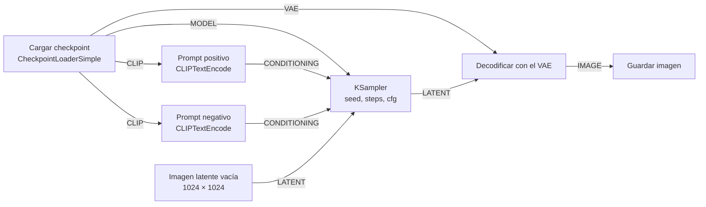

import { Tabs, TabItem } from '@astrojs/starlight/components';

Código: el workflow de esta lección, [`workflows/01-txt2img.api.json`](https://github.com/spareilleux/learn/blob/a1a9bffadaa7156b91ca9c2c2b8885e9e9862dd5/code/comfyui/workflows/01-txt2img.api.json), y la herramienta en C# del curso, cuyo comando `png-info` está en [`csharp/Png.cs`](https://github.com/spareilleux/learn/blob/a1a9bffadaa7156b91ca9c2c2b8885e9e9862dd5/code/comfyui/csharp/Png.cs).

## Qué es ComfyUI, para un desarrollador C# o Java

[ComfyUI](https://github.com/Comfy-Org/ComfyUI) genera imágenes, y más recientemente vídeo, audio y modelos 3D, con modelos de difusión. No escribes un script: construyes un grafo de nodos en el navegador, y un servidor Python lo ejecuta. Cada nodo hace una sola cosa, como cargar un archivo de modelo, codificar un prompt o muestrear, y pasa sus resultados a los nodos siguientes a través de conexiones tipadas.

Dos piezas trabajan juntas:

- **El servidor** es un programa Python, `main.py`, construido sobre [PyTorch](https://pytorch.org/) y [aiohttp](https://docs.aiohttp.org/). Contiene las definiciones de los nodos, una cola de prompts y una caché de resultados de nodos, y sirve una API HTTP y WebSocket en el puerto 8188.
- **El frontend** es una aplicación web, publicada como el paquete Python `comfyui-frontend-package` y servida por el mismo servidor. Dibuja el grafo y, cuando pulsas Run, convierte el grafo en un *prompt* y lo envía a la API. La lección 3 examina los dos formatos JSON, y la lección 4 llama a la API desde C# y Java.

Si has usado [TPL Dataflow](https://learn.microsoft.com/dotnet/standard/parallel-programming/dataflow-task-parallel-library) o un sistema de compilación, el modelo te resultará familiar. Los nodos son bloques con entradas y salidas tipadas. El servidor solo ejecuta los nodos que necesita un nodo de salida, en orden de dependencias. Y, como una compilación incremental, se salta un nodo cuyas entradas no han cambiado desde la última ejecución y reutiliza su resultado en caché.

Un nodo es una clase Python. Aquí está `EmptyImage`, uno de los más sencillos, en [`nodes.py`](https://github.com/Comfy-Org/ComfyUI/blob/ee71d5c4993f29086b27fde1629a945ae48425bf/nodes.py#L1979-L2001) en la v0.36.0:

```python
class EmptyImage:
    @classmethod
    def INPUT_TYPES(s):
        return {"required": { "width": ("INT", {"default": 512, "min": 1, "max": MAX_RESOLUTION, "step": 1}),
                              "height": ("INT", {"default": 512, "min": 1, "max": MAX_RESOLUTION, "step": 1}),
                              "batch_size": ("INT", {"default": 1, "min": 1, "max": 4096}),
                              "color": ("INT", {"default": 0, "min": 0, "max": 0xFFFFFF, "step": 1, "display": "color"}),
                              }}
    RETURN_TYPES = ("IMAGE",)
    FUNCTION = "generate"
```

`INPUT_TYPES` declara las entradas y sus restricciones, `RETURN_TYPES` las salidas, y `FUNCTION` nombra el método al que llama el servidor. En términos de C#, es una clase cuyos atributos describen sus parámetros, descubierta por reflexión. El servidor publica estas declaraciones en JSON en `/object_info`, y el frontend construye sus widgets a partir de ellas. No necesitas escribir Python en este curso hasta la lección 11, que trata de los nodos personalizados.

## Las versiones

| Pieza | Versión |
|---|---|
| ComfyUI | [**v0.36.0**](https://github.com/Comfy-Org/ComfyUI/releases/tag/v0.36.0), commit [`ee71d5c`](https://github.com/Comfy-Org/ComfyUI/commit/ee71d5c4993f29086b27fde1629a945ae48425bf), publicada el 15 de septiembre de 2026 |
| Frontend | `comfyui-frontend-package` 1.52.7, la versión que fija `requirements.txt` |
| Python y PyTorch | Python 3.13.14 y PyTorch 2.13.0 para CUDA 13.0, tal como vienen en la versión portable para Windows |
| Modelo | [Stable Diffusion XL base 1.0](https://huggingface.co/stabilityai/stable-diffusion-xl-base-1.0), revisión `4621659` |
| Máquina | Windows 11, una NVIDIA GeForce RTX 5080 con 16 GB, driver 610.88, 64 GB de RAM |

ComfyUI publica una versión aproximadamente cada semana, y su [README](https://github.com/Comfy-Org/ComfyUI/blob/ee71d5c4993f29086b27fde1629a945ae48425bf/README.md) advierte que los commits entre etiquetas de versión "may be very unstable and break many custom nodes". Cada enlace al código de ComfyUI en este curso apunta al commit de la v0.36.0, para que los números de línea sigan siendo correctos.

## Instalar ComfyUI

<Tabs syncKey="os">
<TabItem label="Windows">

La [versión portable](https://docs.comfy.org/installation/comfyui_portable_windows) incluye su propio Python, PyTorch y ComfyUI en un solo archivo comprimido. Para una tarjeta NVIDIA reciente, descarga `ComfyUI_windows_portable_nvidia.7z` de la [versión v0.36.0](https://github.com/Comfy-Org/ComfyUI/releases/tag/v0.36.0): 1.917.442.353 bytes, unos 1,8 GB. Descomprímelo con 7-Zip o con el Explorador y, después, arráncalo:

```powershell
cd ComfyUI_windows_portable
.\run_nvidia_gpu.bat
```

El archivo por lotes ejecuta `.\python_embeded\python.exe -s ComfyUI\main.py --windows-standalone-build`. La versión también incluye builds para tarjetas NVIDIA más antiguas (CUDA 12.6), para AMD y para GPU Intel; este curso solo ha ejecutado la de NVIDIA.

</TabItem>
<TabItem label="Linux / WSL">

No hay instalador oficial ni imagen de contenedor, así que instalas ComfyUI como una aplicación Python, en un entorno virtual. La [página de instalación manual](https://docs.comfy.org/installation/manual_install) usa conda; un `venv` funciona igual:

```bash
git clone --depth 1 --branch v0.36.0 https://github.com/Comfy-Org/ComfyUI.git
cd ComfyUI
python3.13 -m venv .venv
source .venv/bin/activate
# NVIDIA GPU (CUDA 13.0)
pip install torch torchvision torchaudio --extra-index-url https://download.pytorch.org/whl/cu130
# or, without a GPU:
# pip install torch==2.13.0 torchvision==0.28.0 torchaudio --index-url https://download.pytorch.org/whl/cpu
pip install -r requirements.txt
python main.py
```

La variante para CPU es la que ejecuta la CI del curso en Ubuntu. La variante CUDA está *por verificar*: la máquina con GPU del curso usa Windows.

</TabItem>
<TabItem label="macOS">

En Apple Silicon, PyTorch se ejecuta en la GPU a través de [MPS](https://docs.pytorch.org/docs/stable/notes/mps.html), el backend Metal de Apple. La instalación es la misma que en Linux, con PyTorch desde PyPI:

```bash
git clone --depth 1 --branch v0.36.0 https://github.com/Comfy-Org/ComfyUI.git
cd ComfyUI
python3.13 -m venv .venv
source .venv/bin/activate
pip install torch==2.13.0 torchvision==0.28.0 torchaudio
pip install -r requirements.txt
python main.py
```

La CI del curso ejecuta estos comandos en un runner macOS y solo usa la CPU. Renderizar SDXL en una GPU de la serie M está *por verificar*: el [README](https://github.com/Comfy-Org/ComfyUI/blob/ee71d5c4993f29086b27fde1629a945ae48425bf/README.md) recomienda un PyTorch nightly para Apple Silicon.

</TabItem>
</Tabs>

Cuando el servidor está listo, su log termina con `To see the GUI go to: http://127.0.0.1:8188`. Solo escucha en 127.0.0.1. La opción `--listen` lo abre a la red, pero el servidor no tiene inicio de sesión entre sus [opciones de arranque](https://docs.comfy.org/development/comfyui-server/startup-flags): cualquiera que llegue al puerto puede encolar trabajo, subir archivos y leer tus salidas.

El curso reutiliza una versión portable que ya estaba en la máquina, sin modificarla. Por eso arranca el servidor con su propio directorio base, que contiene las carpetas de entrada, salida, temporales, de usuario y de nodos personalizados, y conserva la carpeta de modelos de la instalación:

```powershell
.\python_embeded\python.exe -s ComfyUI\main.py --base-directory D:\comfy-course `
  --models-directory .\ComfyUI\models --database-url sqlite:///:memory: --disable-auto-launch
```

`--database-url sqlite:///:memory:` mantiene en memoria la pequeña base de datos de recursos del servidor, en lugar de en la carpeta de usuario. Surgieron dos sorpresas con `--base-directory` en la v0.36.0:

- El servidor se detuvo al arrancar con `FileNotFoundError` cuando el directorio base no tenía carpeta `custom_nodes`, porque lista esa carpeta antes de cargar nada ([`main.py`, líneas 198 a 201](https://github.com/Comfy-Org/ComfyUI/blob/ee71d5c4993f29086b27fde1629a945ae48425bf/main.py#L198-L201)). Basta con crear la carpeta vacía.
- La opción también mueve la carpeta de modelos, salvo que `--models-directory` apunte a otro sitio.

En esta máquina el servidor respondió en unos 10 segundos. El principio de su log dice lo que encontró:

```text
Total VRAM 16303 MB, total RAM 65235 MB
pytorch version: 2.13.0+cu130
Set vram state to: NORMAL_VRAM
Device: cuda:0 NVIDIA GeForce RTX 5080 : cudaMallocAsync
DynamicVRAM support detected and enabled
Python version: 3.13.14 (tags/v3.13.14:fd17997, Jun 10 2026, 13:03:48) [MSC v.1944 64 bit (AMD64)]
ComfyUI version: 0.36.0
comfyui-frontend-package version: 1.52.7
Starting server

To see the GUI go to: http://127.0.0.1:8188
```

## Un modelo, y su licencia

ComfyUI no incluye ningún modelo. Un *checkpoint* de difusión es un archivo que contiene tres redes, que explica la lección 2: una red de eliminación de ruido, uno o varios codificadores de texto y un VAE. Este curso empieza con [Stable Diffusion XL base 1.0](https://huggingface.co/stabilityai/stable-diffusion-xl-base-1.0), publicado por Stability AI en julio de 2023. Es antiguo para los estándares de 2026, pero funciona en 16 GB, no requiere cuenta para descargarlo, y es el modelo para el que se escribieron primero la mayoría de los tutoriales y de los nodos personalizados. La lección 8 lo compara con modelos recientes.

| Archivo | Tamaño | SHA-256 |
|---|---|---|
| [`sd_xl_base_1.0.safetensors`](https://huggingface.co/stabilityai/stable-diffusion-xl-base-1.0/blob/main/sd_xl_base_1.0.safetensors) | 6.938.078.334 bytes | `31e35c80fc4829d14f90153f4c74cd59c90b779f6afe05a74cd6120b893f7e5b` |

Colócalo en `models/checkpoints/` y comprueba su hash con `certutil -hashfile <file> SHA256` en Windows, `sha256sum` en Linux o `shasum -a 256` en macOS; el archivo de la máquina del curso coincidía. El formato [`safetensors`](https://huggingface.co/docs/safetensors/index) contiene tensores y una cabecera JSON, y nada de código, a diferencia de los antiguos archivos `.ckpt`, que son pickles de Python capaces de ejecutar código al cargarse. El log del servidor dice `Checkpoint files will always be loaded safely.`

El modelo está bajo la [licencia CreativeML Open RAIL++-M](https://huggingface.co/stabilityai/stable-diffusion-xl-base-1.0/blob/main/LICENSE.md). Una licencia RAIL concede amplios derechos para usar y compartir el modelo y sus resultados, y añade restricciones de uso enumeradas en un anexo. Léela antes de usar el modelo en un producto: este curso no la interpreta. La ficha del modelo añade sus propios límites: "The model does not achieve perfect photorealism", "The model cannot render legible text" y "Faces and people in general may not be generated properly." Las imágenes del curso no contienen personas reales ni marcas.

No hay ningún archivo de modelo en el repositorio: la CI del curso usa workflows que no lo necesitan.

## El grafo de texto a imagen

El grafo más sencillo que produce una imagen tiene siete nodos:



| Nodo | Qué hace | Salidas |
|---|---|---|
| `CheckpointLoaderSimple` | lee el archivo del checkpoint y lo separa en sus tres redes | `MODEL`, `CLIP`, `VAE` |
| `CLIPTextEncode`, dos veces | convierte un prompt en vectores con los que se condiciona el modelo: lo que quieres y lo que no | `CONDITIONING` |
| `EmptyLatentImage` | crea una imagen latente vacía, un tensor de ceros de un octavo del tamaño de la imagen | `LATENT` |
| `KSampler` | añade ruido a partir de la semilla y luego lo elimina paso a paso, guiado por los prompts | `LATENT` |
| `VAEDecode` | decodifica el latente en píxeles | `IMAGE` |
| `SaveImage` | escribe un PNG en la carpeta de salida | ninguna: es un *nodo de salida* |

Los tipos en mayúsculas son la forma en que el frontend sabe qué puede conectarse con qué. Una salida `LATENT` solo se enchufa en una entrada `LATENT`, igual que un compilador comprueba los tipos de los argumentos. `SaveImage` es un nodo de salida: cuando encolas el grafo, el servidor parte de los nodos de salida y retrocede por sus entradas. Un nodo que ninguna salida necesita no se ejecuta.

## Una primera imagen, con curl

En el navegador, cargarías este grafo desde las plantillas, escribirías un prompt y pulsarías Run. La API hace lo mismo sin el navegador. El archivo del curso [`workflows/01-txt2img.api.json`](https://github.com/spareilleux/learn/blob/a1a9bffadaa7156b91ca9c2c2b8885e9e9862dd5/code/comfyui/workflows/01-txt2img.api.json) describe los siete nodos en el *formato de la API*: una entrada por nodo, con un id como clave, con su tipo y sus entradas. Una entrada es o bien un valor, o bien un enlace escrito `["4", 1]`, que significa la salida 1 del nodo 4:

```json
  "3": {
    "class_type": "KSampler",
    "inputs": {
      "seed": 42,
      "steps": 25,
      "cfg": 7.0,
      "sampler_name": "euler",
      "scheduler": "normal",
      "denoise": 1.0,
      "model": ["4", 0],
      "positive": ["6", 0],
      "negative": ["7", 0],
      "latent_image": ["5", 0]
    }
  },
```

Para encolarlo, envíalo bajo una clave `prompt`:

<Tabs syncKey="os">
<TabItem label="Windows">

```powershell
$workflow = Get-Content code\comfyui\workflows\01-txt2img.api.json -Raw
$body = '{"prompt": ' + $workflow + '}'
Invoke-RestMethod -Method Post -Uri http://127.0.0.1:8188/prompt -ContentType application/json -Body $body
```

</TabItem>
<TabItem label="Linux / WSL">

```bash
curl -s -X POST http://127.0.0.1:8188/prompt -H 'Content-Type: application/json' \
  -d "{\"prompt\": $(cat code/comfyui/workflows/01-txt2img.api.json)}"
```

</TabItem>
<TabItem label="macOS">

```bash
curl -s -X POST http://127.0.0.1:8188/prompt -H 'Content-Type: application/json' \
  -d "{\"prompt\": $(cat code/comfyui/workflows/01-txt2img.api.json)}"
```

</TabItem>
</Tabs>

El servidor comprueba el grafo, lo pone en su cola y responde enseguida, antes de que se ejecute nada:

```json
{"prompt_id": "fbbda761-f93f-4d80-9403-0a5d47fc3306", "number": 0, "node_errors": {}}
```

`number` es la posición en la cola. Cuando el prompt se ha ejecutado, `GET /history/<prompt_id>` devuelve lo que produjo; aquí, recortado:

```json
"outputs": {"9": {"images": [{"filename": "metronome_00001_.png", "subfolder": "l01", "type": "output"}]}},
"status": {"status_str": "success", "completed": true, "messages": [
  ["execution_start", {"prompt_id": "fbbda761-…", "timestamp": 1789575897123}],
  ["execution_cached", {"nodes": [], "prompt_id": "fbbda761-…", "timestamp": 1789575897124}],
  ["execution_success", {"prompt_id": "fbbda761-…", "timestamp": 1789575911832}]]}
```


*Renderizado por ComfyUI v0.36.0: Stable Diffusion XL base 1.0, semilla 42, 25 pasos, sampler `euler`, scheduler `normal`, CFG 7, 1024 × 1024, workflow [`01-txt2img.api.json`](https://github.com/spareilleux/learn/blob/a1a9bffadaa7156b91ca9c2c2b8885e9e9862dd5/code/comfyui/workflows/01-txt2img.api.json), reducido a 768 × 768 para esta página.*

El prompt pedía "a brass metronome on an old wooden workbench", un metrónomo de latón sobre un viejo banco de trabajo de madera. SDXL dibujó algo más parecido a un reloj de arena. La imagen sigue siendo un resultado correcto: el modelo produce lo que sus datos de entrenamiento asocian con las palabras, y un metrónomo es un objeto poco común. La lección 2 cambia la semilla y los ajustes: con la semilla 43, el objeto se parece más a un metrónomo.

## En qué se va el tiempo

El log muestra cómo empleó el servidor los 14,71 segundos de esta primera ejecución:

```text
Requested to load SDXLClipModel
Model SDXLClipModel prepared for dynamic VRAM loading. 1560MB Staged. 0 patches attached. Force pre-loaded 180 weights: 400 KB.
Requested to load SDXL
Model SDXL prepared for dynamic VRAM loading. 4896MB Staged. 0 patches attached. Force pre-loaded 512 weights: 1197 KB.
100%|##########| 25/25 [00:03<00:00,  6.39it/s]
Requested to load AutoencoderKL
Model AutoencoderKL prepared for dynamic VRAM loading. 159MB Staged. 0 patches attached. Force pre-loaded 112 weights: 91 KB.
Prompt executed in 14.71 seconds
```

Los dos codificadores de texto ocupan 1,5 GB, la red de eliminación de ruido 4,9 GB y el VAE 159 MB. Los 25 pasos en sí tardaron unos 4 segundos, a 6,4 pasos por segundo, tras un primer paso de 6,5 segundos en el que se inicializó el modelo. El resto se fue en leer el archivo de 6,9 GB y en mover los pesos a la GPU.

| Ejecución | Tiempo |
|---|---|
| Primera ejecución tras arrancar el servidor | 14,71 s, y luego 12,99 s y 13,30 s tras dos reinicios |
| Mismo grafo, nueva semilla: solo se vuelven a ejecutar el sampler, el decodificador y el guardado | de 4,53 a 4,89 s |
| Mismo grafo, solo cambia el prefijo del nombre de archivo: solo se ejecuta `SaveImage` | de 0,07 a 0,09 s |

La última fila es la caché en acción: el historial dice `"execution_cached": {"nodes": ["4", "5", "6", "7", "3", "8"]}`, y `SaveImage` escribe la imagen en caché con su nuevo nombre. Cuando no ha cambiado absolutamente nada, incluso `SaveImage` está en la lista, y no se escribe ningún archivo nuevo.

## Adónde fue la imagen

`SaveImage` escribió `output/l01/metronome_00001_.png`: el prefijo `l01/metronome` da una subcarpeta y un nombre, y el servidor añade un contador de cinco dígitos. El PNG también contiene el prompt que lo generó. La herramienta en C# del curso lista los chunks del archivo:

```text
> dotnet out/csharp/comfy.dll png-info output/l01/metronome_00001_.png
chunk IHDR: 1 x, 13 bytes
chunk tEXt: 1 x, 921 bytes
chunk IDAT: 23 x, 3146752 bytes once inflated
chunk IEND: 1 x, 0 bytes
text prompt: 914 characters: {"4": {"class_type": "CheckpointLoaderSimple", "inputs": {"c...
image: 1024 x 1024, 3 channels, pixel SHA-256 698e7867e7fc04fb
```

El chunk `tEXt` llamado `prompt` contiene el grafo en formato de la API, en JSON: abre el PNG en el frontend de ComfyUI y reconstruye el grafo. La lección 3 lee los dos chunks y explica por qué un PNG guardado desde el navegador tiene un segundo chunk.

## Puntos clave

- ComfyUI es un servidor Python que ejecuta grafos de nodos tipados, y un frontend en el navegador que los edita. La API acepta los mismos grafos que el navegador.
- El servidor solo ejecuta lo que necesita un nodo de salida, y guarda en caché los resultados de los nodos: un grafo sin cambios se ejecuta en una décima de segundo.
- La versión portable para Windows es un solo archivo comprimido. En Linux y macOS, ComfyUI es una aplicación Python en un entorno virtual.
- Un checkpoint contiene una red de eliminación de ruido, codificadores de texto y un VAE. SDXL base 1.0 ocupa 6,9 GB, está bajo la licencia CreativeML Open RAIL++-M, y dibuja lo que sugieren sus datos de entrenamiento, no siempre lo que pediste.
- El servidor no tiene autenticación: mantenlo en 127.0.0.1.

## Ejercicios

1. Encola dos veces el workflow de la lección con las mismas entradas, y luego una vez con `"seed": 43`. Compara las tres entradas de `/history`: ¿qué nodos se ejecutaron cada vez?
2. `GET /object_info/EmptyLatentImage` devuelve la declaración de un nodo. ¿Cuáles son el tamaño mínimo y el paso de `width`, y por qué necesitaría un paso una imagen latente?
3. Cambia el prompt negativo por una cadena vacía y encola el workflow. ¿Qué nodos se vuelven a ejecutar, y por qué no lo hace el nodo 6, `CLIPTextEncode`?

<details>
<summary>Solución 1</summary>

La primera ejecución tiene `"execution_cached": {"nodes": []}`: se ejecutaron todos los nodos. La segunda lista los siete nodos, `SaveImage` incluido, y no escribe ningún archivo nuevo: sus `outputs` nombran el mismo `metronome_00001_.png` que la primera ejecución. La tercera lista los nodos 4, 5, 6 y 7: se reutilizan el checkpoint, el latente vacío y los dos prompts, y se ejecutan `KSampler`, `VAEDecode` y `SaveImage`, porque la semilla es una entrada de `KSampler` y los otros dos vienen después en el grafo.

</details>

<details>
<summary>Solución 2</summary>

```json
"width": ["INT", {"default": 512, "min": 16, "max": 16384, "step": 8, "tooltip": "The width of the latent images in pixels."}]
```

El mínimo es 16 y el paso 8. El nodo crea un tensor de `width // 8` por `height // 8` ([`nodes.py`, línea 1265](https://github.com/Comfy-Org/ComfyUI/blob/ee71d5c4993f29086b27fde1629a945ae48425bf/nodes.py#L1265)): el VAE codifica 8 píxeles en una posición del latente, así que una anchura que no sea múltiplo de 8 quedaría recortada. El `max` del propio servidor, 16384, es `MAX_RESOLUTION`; la respuesta de `/object_info` da el número, no el nombre.

</details>

<details>
<summary>Solución 3</summary>

El nodo 7, el prompt negativo, se vuelve a ejecutar porque su entrada `text` ha cambiado, y también `KSampler`, `VAEDecode` y `SaveImage`, que dependen de él. El nodo 6 tiene las mismas entradas que antes, el mismo `text` y el mismo enlace al `CLIP` del nodo 4, así que el servidor reutiliza su salida en caché. El resultado en caché de un nodo se reutiliza cuando sus propias entradas, y las de los nodos de los que depende, no han cambiado.

</details>

## Fuentes

- ComfyUI en la v0.36.0: [`nodes.py`](https://github.com/Comfy-Org/ComfyUI/blob/ee71d5c4993f29086b27fde1629a945ae48425bf/nodes.py), [`main.py`](https://github.com/Comfy-Org/ComfyUI/blob/ee71d5c4993f29086b27fde1629a945ae48425bf/main.py), [`comfy/cli_args.py`](https://github.com/Comfy-Org/ComfyUI/blob/ee71d5c4993f29086b27fde1629a945ae48425bf/comfy/cli_args.py), [README](https://github.com/Comfy-Org/ComfyUI/blob/ee71d5c4993f29086b27fde1629a945ae48425bf/README.md), [versión v0.36.0](https://github.com/Comfy-Org/ComfyUI/releases/tag/v0.36.0).
- Documentación de ComfyUI: [versión portable para Windows](https://docs.comfy.org/installation/comfyui_portable_windows), [instalación manual](https://docs.comfy.org/installation/manual_install), [requisitos del sistema](https://docs.comfy.org/installation/system_requirements), [texto a imagen](https://docs.comfy.org/tutorials/basic/text-to-image), [rutas del servidor](https://docs.comfy.org/development/comfyui-server/comms_routes).
- [Ficha del modelo Stable Diffusion XL base 1.0](https://huggingface.co/stabilityai/stable-diffusion-xl-base-1.0) y su [licencia](https://huggingface.co/stabilityai/stable-diffusion-xl-base-1.0/blob/main/LICENSE.md); D. Podell et al., [SDXL: Improving Latent Diffusion Models for High-Resolution Image Synthesis](https://arxiv.org/abs/2307.01952), 2023.
