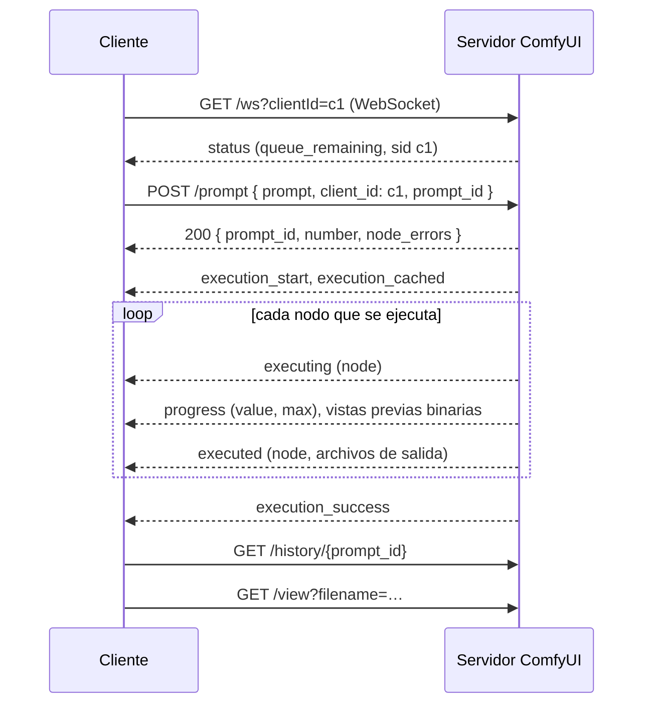

Código: el cliente C# en [`csharp/ComfyClient.cs`](https://github.com/spareilleux/learn/blob/a1a9bffadaa7156b91ca9c2c2b8885e9e9862dd5/code/comfyui/csharp/ComfyClient.cs), el cliente Java en [`java/src/main/java/dev/learn/comfy/Main.java`](https://github.com/spareilleux/learn/blob/a1a9bffadaa7156b91ca9c2c2b8885e9e9862dd5/code/comfyui/java/src/main/java/dev/learn/comfy/Main.java), el workflow que la CI ejecuta sin modelo en [`workflows/solid-color.api.json`](https://github.com/spareilleux/learn/blob/a1a9bffadaa7156b91ca9c2c2b8885e9e9862dd5/code/comfyui/workflows/solid-color.api.json), y el script del servidor para la CI en [`server.sh`](https://github.com/spareilleux/learn/blob/a1a9bffadaa7156b91ca9c2c2b8885e9e9862dd5/code/comfyui/server.sh).

## Las rutas que necesita un cliente

La API del servidor es la que usa el navegador; no hay una API pública aparte. La [página de rutas](https://docs.comfy.org/development/comfyui-server/comms_routes) las enumera, y [`server.py`](https://github.com/Comfy-Org/ComfyUI/blob/ee71d5c4993f29086b27fde1629a945ae48425bf/server.py) en la v0.36.0 tiene algunas más. Cada ruta se sirve también bajo un prefijo `/api`, que es el que llama el frontend.

| Ruta | Qué hace un cliente con ella |
|---|---|
| `GET /ws?clientId=…` | abre el WebSocket que transporta el progreso de los prompts del cliente |
| `POST /prompt` | valida un prompt y lo encola; responde con su id, o con `error` y `node_errors` |
| `GET /history/{prompt_id}` | las salidas y el estado de un prompt terminado |
| `GET /view?filename=…&subfolder=…&type=output` | los bytes de un archivo de salida |
| `GET /object_info`, `/object_info/{class}` | las definiciones de los nodos, como en la lección 3 |
| `GET /queue`, `POST /queue` | los prompts en ejecución y pendientes; borra los pendientes |
| `POST /interrupt` | detiene el prompt que se está ejecutando |
| `POST /free` | descarga los modelos y libera memoria |
| `GET /system_stats` | versiones, RAM y VRAM |
| `POST /upload/image` | envía una imagen de entrada, para la lección 5 |

El código de la v0.36.0 también tiene rutas `/api/jobs`, para listar, leer y cancelar trabajos, que la documentación aún no menciona. Este curso no las usa.

## Un prompt, paso a paso



Tres detalles deciden si un cliente funciona:

- **Conéctate primero, y pasa el mismo id de cliente.** El servidor envía el progreso de un prompt solo al WebSocket cuyo `clientId` coincide con el `client_id` del prompt. No reenvía los eventos pasados: cuando un cliente se reconecta con el mismo id, el manejador solo envía el nodo que se está ejecutando en ese momento, si lo hay ([`server.py`, líneas 269 a 290](https://github.com/Comfy-Org/ComfyUI/blob/ee71d5c4993f29086b27fde1629a945ae48425bf/server.py#L269-L290)). Un cliente que se conecta después de enviar el prompt puede perdérselo todo; `/history` es la alternativa.
- **El cliente puede elegir el id del prompt.** `POST /prompt` acepta un `prompt_id`, que debe ser un UUID "in the canonical lowercase hyphenated form" ([`comfy_execution/jobs.py`](https://github.com/Comfy-Org/ComfyUI/blob/ee71d5c4993f29086b27fde1629a945ae48425bf/comfy_execution/jobs.py#L34-L44)). Elegirlo antes de enviar evita una condición de carrera: el cliente sabe qué eventos son suyos antes de que llegue la respuesta al POST. `Guid.NewGuid().ToString()` en C# y `UUID.randomUUID().toString()` en Java dan ambos esa forma.
- **Detente con `execution_success`, `execution_error` o `execution_interrupted`.** El ejemplo en Python del repositorio de ComfyUI espera un mensaje `executing` con `node` a `null` ([`script_examples/websockets_api_example.py`, líneas 37 a 39](https://github.com/Comfy-Org/ComfyUI/blob/ee71d5c4993f29086b27fde1629a945ae48425bf/script_examples/websockets_api_example.py#L37-L39)). El servidor sigue enviando uno, después de escribir el historial ([`main.py`, línea 374](https://github.com/Comfy-Org/ComfyUI/blob/ee71d5c4993f29086b27fde1629a945ae48425bf/main.py#L373-L374)), pero los tres mensajes explícitos dicen cómo terminó el prompt.

## El cliente C#

El cliente es un comando de la herramienta del curso: `comfy run <server> <workflow> [--set node.input=value]... [--out dir]`. Usa [`HttpClient`](https://learn.microsoft.com/dotnet/api/system.net.http.httpclient) y [`ClientWebSocket`](https://learn.microsoft.com/dotnet/api/system.net.websockets.clientwebsocket), sin ningún paquete. Conectarse y enviar el prompt:

```csharp
string clientId = Guid.NewGuid().ToString("N");
using var socket = new ClientWebSocket();
var wsUri = new UriBuilder(server) { Scheme = server.Scheme == "https" ? "wss" : "ws", Path = "/ws", Query = $"clientId={clientId}" }.Uri;
await socket.ConnectAsync(wsUri, cancel.Token);

// The client can choose the prompt id: a lowercase UUID.
string promptId = Guid.NewGuid().ToString();
var request = new JsonObject { ["prompt"] = workflow, ["client_id"] = clientId, ["prompt_id"] = promptId };
using var response = await http.PostAsJsonAsync("prompt", request, cancel.Token);
```

Un mensaje WebSocket puede llegar en varias tramas, así que el bucle de recepción lee hasta `EndOfMessage` antes de analizarlo. Los mensajes de texto son JSON con un `type` y un objeto `data`; los mensajes binarios son vistas previas:

```csharp
using var message = new MemoryStream();
WebSocketReceiveResult result;
do
{
    result = await socket.ReceiveAsync(buffer, cancel);
    if (result.MessageType == WebSocketMessageType.Close) throw new IOException("the server closed the WebSocket");
    message.Write(buffer, 0, result.Count);
} while (!result.EndOfMessage);
```

Cuando el prompt ha terminado con éxito, el cliente lee `/history/{prompt_id}`, descarga cada imagen con `/view` y la decodifica con el lector de PNG de la lección 3 para imprimir el hash de sus píxeles.

Contra el servidor con GPU de las lecciones 1 y 2, arrancado con `--preview-method taesd`, sobre el workflow de la lección 1:

```text
> dotnet out/csharp/comfy.dll run http://127.0.0.1:8188 workflows/01-txt2img.api.json
POST /prompt: 200
status: connected, queue_remaining 0
execution_start
execution_cached: []
executing: node 4
executing: node 5
executing: node 7
executing: node 6
executing: node 3
progress: node 3, 1/25
binary message: type 1, 29080 bytes
progress: node 3, 2/25
binary message: type 1, 42113 bytes
…
progress: node 3, 25/25
binary message: type 1, 73406 bytes
executing: node 8
executing: node 9
executed: node 9, l01/metronome_00002_.png
execution_success
GET /view node 9: l01/metronome_00002_.png, 1024 x 1024, pixel SHA-256 698e7867e7fc04fb
```

El hash de los píxeles es el de la lección 1, en un servidor recién arrancado. Los mensajes binarios son las vistas previas que muestra el navegador durante el muestreo: un tipo de evento de 4 bytes en big-endian, 1 para una imagen de vista previa, luego un formato de imagen de 4 bytes, 1 para JPEG, y después la imagen, tal como los escribe [`server.py`](https://github.com/Comfy-Org/ComfyUI/blob/ee71d5c4993f29086b27fde1629a945ae48425bf/server.py#L1305-L1336). Con el valor por defecto, `--preview-method none`, no hay ninguno. `taesd` decodifica el latente de cada paso con un VAE aproximado y pequeño, así que las vistas previas cuestan tiempo: el muestreo fue a 4,9 pasos por segundo en lugar de 6,4.

## El cliente Java

El cliente Java hace lo mismo con [`java.net.http.HttpClient`](https://docs.oracle.com/en/java/javase/25/docs/api/java.net.http/java/net/http/HttpClient.html), su [`WebSocket`](https://docs.oracle.com/en/java/javase/25/docs/api/java.net.http/java/net/http/WebSocket.html) y [Jackson](https://github.com/FasterXML/jackson) 3.2.2 para el JSON. El WebSocket de Java se basa en callbacks: un [`WebSocket.Listener`](https://docs.oracle.com/en/java/javase/25/docs/api/java.net.http/java/net/http/WebSocket.Listener.html) recibe fragmentos de mensajes y pide el siguiente con `request(1)`. El cliente reúne cada mensaje completo y lo pone en una `BlockingQueue`, para que el hilo principal pueda leer los eventos en orden, como el bucle de C#:

```java
@Override
public CompletionStage<?> onText(WebSocket socket, CharSequence data, boolean last) {
    text.append(data);
    if (last) {
        messages.add(new Message(text.toString(), null));
        text.setLength(0);
    }
    socket.request(1);
    return null;
}
```

El cliente Java calcula el mismo hash de píxeles con [`ImageIO`](https://docs.oracle.com/en/java/javase/25/docs/api/java.desktop/javax/imageio/ImageIO.html), a partir de los bytes rojo, verde y azul de cada píxel. En el mismo servidor con GPU, con la semilla 43:

```text
> java -jar java/target/comfy.jar run http://127.0.0.1:8188 workflows/01-txt2img.api.json --set 3.seed=43
POST /prompt: 200
status: connected, queue_remaining 0
execution_start
execution_cached: [4, 5, 6, 7]
executing: node 3
progress: node 3, 1/25
binary message: type 1, 36289 bytes
…
executing: node 8
executing: node 9
executed: node 9, l01/metronome_00003_.png
execution_success
GET /view node 9: l01/metronome_00003_.png, 1024 x 1024, pixel SHA-256 3dd47bf04931ccaa
```

`3dd47bf04931ccaa` es el hash del render con la semilla 43 de la lección 2, hecho veinte minutos antes en otro arranque del servidor: los mismos píxeles. El checkpoint y los dos prompts salieron de la caché de la ejecución del cliente C#, ya que la caché pertenece al servidor, no a un cliente.

## Qué comprueba la CI

Los runners de GitHub no tienen GPU, y el curso no incluye ningún modelo en el repositorio. [`solid-color.api.json`](https://github.com/spareilleux/learn/blob/a1a9bffadaa7156b91ca9c2c2b8885e9e9862dd5/code/comfyui/workflows/solid-color.api.json) no necesita ni lo uno ni lo otro: un nodo `EmptyImage` crea una imagen de 64 × 48 de un solo color, `ImageInvert` la invierte, y dos nodos `SaveImage` guardan ambas. [`comfyui-examples.yml`](https://github.com/spareilleux/learn/blob/a1a9bffadaa7156b91ca9c2c2b8885e9e9862dd5/.github/workflows/comfyui-examples.yml) clona ComfyUI en la v0.36.0, instala PyTorch para CPU en Ubuntu, Windows y macOS, y ejecuta `check.sh`, que arranca el servidor con `--cpu` y ejecuta los dos clientes. El cliente C#, dos veces, y luego sobre el workflow roto de la lección 3:

```text
--- C#, first run
POST /prompt: 200
status: connected, queue_remaining 0
execution_start
execution_cached: []
executing: node 1
executing: node 3
executed: node 3, ci/solid_00001_.png
executing: node 2
executing: node 4
executed: node 4, ci/inverted_00001_.png
execution_success
GET /view node 3: ci/solid_00001_.png, 64 x 48, pixel SHA-256 da28b3b4fc5883a2
GET /view node 4: ci/inverted_00001_.png, 64 x 48, pixel SHA-256 252fab8d4cbe179f
--- C#, same workflow again
POST /prompt: 200
status: connected, queue_remaining 0
execution_start
execution_cached: [1, 2, 3, 4]
executed: node 4, ci/inverted_00001_.png
executed: node 3, ci/solid_00001_.png
execution_success
GET /view node 4: ci/inverted_00001_.png, 64 x 48, pixel SHA-256 252fab8d4cbe179f
GET /view node 3: ci/solid_00001_.png, 64 x 48, pixel SHA-256 da28b3b4fc5883a2
--- C#, a broken workflow
POST /prompt: 400
error prompt_outputs_failed_validation: Prompt outputs failed validation
  node 4 (CheckpointLoaderSimple): value_not_in_list: ckpt_name: 'sd_xl_base_1.0.safetensors' not in []
  node 3 (KSampler): exception_during_inner_validation: '12'
exit code 1
```

Tres cosas de esta salida se aprendieron a base de errores:

- **Una ejecución en caché sigue enviando `executed`.** La segunda ejecución no ejecuta nada, pero el servidor vuelve a enviar el resultado de cada nodo de salida, con los nombres de archivo de la primera ejecución, y no escribe ningún archivo nuevo.
- **El orden de los nodos de salida cambia de un arranque del servidor a otro.** La primera versión de `check.sh` falló en su segundo intento: `executed: node 3` y `executed: node 4` se habían intercambiado. El servidor guarda los nodos de salida que ha validado en un conjunto de Python ([`execution.py`, líneas 1186 a 1282](https://github.com/Comfy-Org/ComfyUI/blob/ee71d5c4993f29086b27fde1629a945ae48425bf/execution.py#L1186-L1282)), y Python aleatoriza el hash de las cadenas en cada arranque, así que el orden de iteración de un conjunto de ids de nodo cambia. [`server.sh`](https://github.com/spareilleux/learn/blob/a1a9bffadaa7156b91ca9c2c2b8885e9e9862dd5/code/comfyui/server.sh) fija `PYTHONHASHSEED=0` para que la salida de la CI se pueda comparar. Un cliente real no debe depender de ese orden.
- **Solo se imprime el primer mensaje `status`.** Responde a la conexión y lleva el id de sesión. El servidor envía más a medida que cambia su cola, dos por prompt en todas las ejecuciones de este curso, pero nada documenta cuántos, así que los clientes no los imprimen.

El cliente Java ejecuta el mismo workflow con `--set 1.color=65280`, verde puro, para que el servidor no responda desde su caché, y también el workflow roto; su salida está en [`expected/04-run-java.txt`](https://github.com/spareilleux/learn/blob/a1a9bffadaa7156b91ca9c2c2b8885e9e9862dd5/code/comfyui/expected/04-run-java.txt). Los dos clientes imprimen los mismos hashes de píxeles para las mismas imágenes, y los dos hashes son iguales en los tres sistemas operativos.

Lo que la CI no comprueba: las vistas previas, los mensajes `progress`, que los nodos de color sólido no envían, y `execution_error`. Los clientes imprimen el nodo, el tipo y el mensaje de un error de ejecución a partir de los campos del código del servidor, pero ninguna ejecución de este curso ha producido uno todavía, así que esa ruta está *por verificar*.

## Más allá del caso ideal

- **Tiempos de espera.** Una primera ejecución de SDXL tardó aquí 15 segundos, y un workflow de vídeo grande puede tardar muchos minutos. Los clientes abandonan tras 20 minutos sin mensajes. Un servicio de larga duración debería más bien mantener abierto el WebSocket, reconectarse con el mismo id de cliente cuando se corte, y leer `/history/{prompt_id}` para ponerse al día.
- **Interrumpir.** `POST /interrupt` sin cuerpo detiene lo que se está ejecutando, lo haya encolado quien lo haya encolado; con `{"prompt_id": …}`, el código de la v0.36.0 solo lo detiene si ese prompt es el que se está ejecutando ([`server.py`, líneas 1163 a 1193](https://github.com/Comfy-Org/ComfyUI/blob/ee71d5c4993f29086b27fde1629a945ae48425bf/server.py#L1163-L1193)). Un prompt que no ha empezado se quita de la cola con `POST /queue` y `{"delete": [prompt_id]}`. Ninguna de las dos cosas se ejecutó para esta lección: *por verificar*.
- **Un servidor, una cola.** Los prompts se ejecutan de uno en uno, en el orden de la cola, sea cual sea el cliente que los envió. Dos clientes comparten la caché del servidor, y por eso la ejecución Java de arriba reutilizó las codificaciones de texto de la ejecución C#.
- **Sin autenticación.** Todo lo anterior funciona para cualquiera que pueda llegar al puerto. La lección 12, sobre producción, pone el servidor detrás de algo que compruebe quién llama.

## Puntos clave

- Un cliente abre el WebSocket con su id de cliente, envía el prompt con el mismo id de cliente e, idealmente, con un id de prompt que ha elegido, sigue los mensajes hasta `execution_success`, `execution_error` o `execution_interrupted`, y después lee `/history` y descarga los archivos con `/view`.
- En C#, bastan `HttpClient` y `ClientWebSocket`; en Java, `java.net.http` y una biblioteca JSON. Los dos deben reensamblar los mensajes que llegan en varias tramas.
- Los mensajes WebSocket binarios son vistas previas: un tipo de evento, un formato de imagen y un JPEG o un PNG.
- No confíes en el orden de los nodos de salida, en el número de mensajes `status`, ni en obtener archivos nuevos de una ejecución en caché.

## Ejercicios

1. Ejecuta dos veces el cliente C# sobre el workflow de la lección 1, con `--set 9.filename_prefix="l04/again"` la segunda vez. ¿Qué mensajes imprime la segunda ejecución, y escribe algún archivo?
2. Añade una opción `--timeout` al cliente C#, y haz que llame a `POST /interrupt` cuando se agote el tiempo. ¿Qué dice después el WebSocket?
3. El `onBinary` del cliente Java copia el buffer que recibe en uno nuevo. ¿Por qué no conservar el `ByteBuffer` que recibe el listener?

<details>
<summary>Solución 1</summary>

La segunda ejecución imprime `execution_cached: [4, 5, 6, 7, 3, 8]`, luego `executing: node 9`, `executed: node 9, l04/again_00001_.png` y `execution_success`. Solo se ejecuta `SaveImage`, porque su entrada `filename_prefix` ha cambiado, y escribe un archivo nuevo a partir de la imagen en caché. La lección 1 midió este caso en 0,07 a 0,09 segundos.

</details>

<details>
<summary>Solución 2</summary>

```csharp
using var cancel = new CancellationTokenSource(timeout);
try
{
    string outcome = await FollowEvents(socket, promptId, cancel.Token);
}
catch (OperationCanceledException)
{
    await http.PostAsJsonAsync("interrupt", new JsonObject { ["prompt_id"] = promptId });
    // ...then keep reading, with a new token, until execution_interrupted
}
```

Se espera que cancelar un `ReceiveAsync` pendiente deje el `ClientWebSocket` abortado, así que el cliente tendría que reconectarse con el mismo id de cliente para leer lo que sigue; el servidor debería entonces enviar `execution_interrupted`, con el nodo que se estaba ejecutando. Nada de esta solución se ha ejecutado: *por verificar*, incluido el estado del socket tras la cancelación, y si la reconexión llega a tiempo de ver el mensaje o si `/history` es el único sitio que queda para leer el resultado.

</details>

<details>
<summary>Solución 3</summary>

La documentación de [`WebSocket.Listener`](https://docs.oracle.com/en/java/javase/25/docs/api/java.net.http/java/net/http/WebSocket.Listener.html) dice, sobre `onBinary`: "Do not access the ByteBuffer after this CompletionStage has completed." El cliente devuelve `null`, lo que cuenta como una etapa ya completada. Conservar el buffer y leerlo más tarde en el hilo principal incumpliría esa regla, y podría leer bytes que la implementación ha reutilizado. Copiarlo, como hace el cliente, lo evita; y también convertir los fragmentos de texto en un `String` antes de volver de `onText`.

</details>

## Fuentes

- Documentación de ComfyUI: [rutas del servidor](https://docs.comfy.org/development/comfyui-server/comms_routes), [mensajes](https://docs.comfy.org/development/comfyui-server/comms_messages), [ejemplos de la API](https://docs.comfy.org/development/comfyui-server/api-examples).
- ComfyUI en la v0.36.0: [`server.py`](https://github.com/Comfy-Org/ComfyUI/blob/ee71d5c4993f29086b27fde1629a945ae48425bf/server.py), [`protocol.py`](https://github.com/Comfy-Org/ComfyUI/blob/ee71d5c4993f29086b27fde1629a945ae48425bf/protocol.py), [`main.py`](https://github.com/Comfy-Org/ComfyUI/blob/ee71d5c4993f29086b27fde1629a945ae48425bf/main.py), [`execution.py`](https://github.com/Comfy-Org/ComfyUI/blob/ee71d5c4993f29086b27fde1629a945ae48425bf/execution.py), [`comfy_execution/jobs.py`](https://github.com/Comfy-Org/ComfyUI/blob/ee71d5c4993f29086b27fde1629a945ae48425bf/comfy_execution/jobs.py).
- .NET: [`ClientWebSocket`](https://learn.microsoft.com/dotnet/api/system.net.websockets.clientwebsocket), [`HttpClient`](https://learn.microsoft.com/dotnet/api/system.net.http.httpclient), [WebSockets en .NET](https://learn.microsoft.com/dotnet/fundamentals/networking/websockets).
- Java 25: [`HttpClient`](https://docs.oracle.com/en/java/javase/25/docs/api/java.net.http/java/net/http/HttpClient.html), [`WebSocket`](https://docs.oracle.com/en/java/javase/25/docs/api/java.net.http/java/net/http/WebSocket.html), [`WebSocket.Listener`](https://docs.oracle.com/en/java/javase/25/docs/api/java.net.http/java/net/http/WebSocket.Listener.html).
