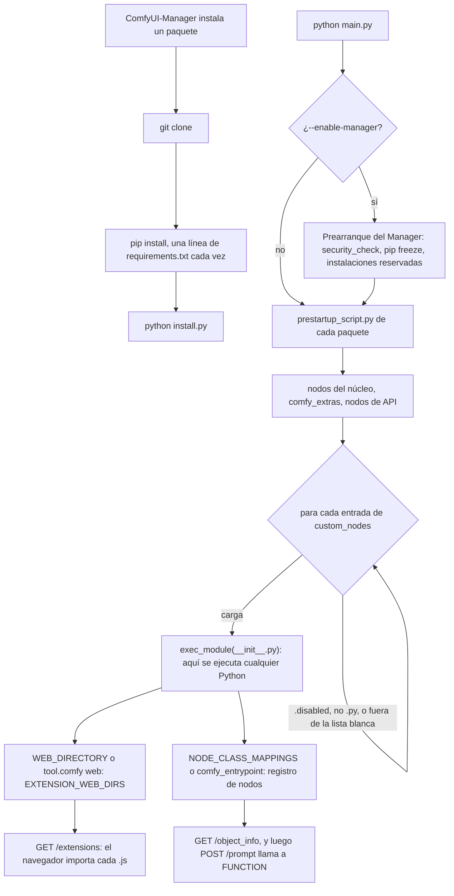

Código: el paquete de nodos de Guitar Alchemist en [`custom-nodes/ga/`](https://github.com/spareilleux/learn/tree/22f2bf71c21d2cc4f426c0e917e7e19dbfca5bc3/code/comfyui/custom-nodes/ga), con sus pruebas y sus workflows, y el script de auditoría, su fixture y la demo de pickle en [`custom-nodes/audit/`](https://github.com/spareilleux/learn/tree/22f2bf71c21d2cc4f426c0e917e7e19dbfca5bc3/code/comfyui/custom-nodes/audit).

Todos los nodos de las diez primeras lecciones venían con ComfyUI. La lección 6 necesitaba un preprocesador de poses que el núcleo no tiene, y la lección 8 se topó con archivos GGUF que solo carga un nodo personalizado. Un nodo personalizado es una carpeta de código Python que ComfyUI importa en su propio proceso al arrancar, con los derechos del usuario que lo arrancó. No hay sandbox, ni permisos, ni firma. Esta lección lee cómo funciona la carga, escribe un paquete pequeño y luego examina los riesgos: qué comprueba el instalador, qué ha salido ya mal, cómo leer un paquete antes de instalarlo, y cómo limitar los daños si instalas uno malo.

## Cómo carga ComfyUI un paquete

### La carpeta y la importación

Al arrancar, [`init_external_custom_nodes`](https://github.com/Comfy-Org/ComfyUI/blob/ee71d5c4993f29086b27fde1629a945ae48425bf/nodes.py#L2344-L2389) recorre cada carpeta registrada como `custom_nodes`. Por defecto es `ComfyUI/custom_nodes/`, o `custom_nodes/` bajo `--base-directory`. Prueba cada entrada:

- se omite un archivo que no termina en `.py`, y también un nombre que termina en `.disabled`;
- con `--disable-all-custom-nodes`, solo cargan los nombres pasados a `--whitelist-custom-nodes`;
- con `--enable-manager`, ComfyUI-Manager puede bloquear una entrada ("Blocked by policy", bloqueada por la política); en la 4.2.2, su [`should_be_disabled`](https://github.com/Comfy-Org/ComfyUI-Manager/blob/bd4ede2237c97b3a71569a0301a0be9db226c7e9/comfyui_manager/__init__.py#L68-L80) solo bloquea una copia antigua del propio Manager instalada como nodo personalizado.

Después, [`load_custom_node`](https://github.com/Comfy-Org/ComfyUI/blob/ee71d5c4993f29086b27fde1629a945ae48425bf/nodes.py#L2246-L2342) importa el paquete con [`importlib`](https://docs.python.org/3/library/importlib.html): un único archivo `.py`, o el `__init__.py` de la carpeta. La línea que importa es `module_spec.loader.exec_module(module)`, la línea 2266. Ejecuta el módulo entero, de arriba abajo, antes de que ComfyUI haya mirado nada de lo que contiene. Todo lo que `__init__.py` importa, arranca o descarga ocurre aquí, aunque luego el paquete no defina ningún nodo.

Tras la importación, ComfyUI lee tres nombres del módulo:

- `NODE_CLASS_MAPPINGS`, un diccionario que asocia el nombre único de un nodo con su clase. Sin él, un paquete V3 exporta en su lugar `comfy_entrypoint`. Sin ninguno de los dos, el registro dice "Skip … due to the lack of NODE_CLASS_MAPPINGS or comfy_entrypoint (need one)", es decir, que omite el paquete porque le falta uno de los dos;
- `NODE_DISPLAY_NAME_MAPPINGS`, los nombres que muestra la interfaz;
- `WEB_DIRECTORY`, una carpeta de JavaScript, o la clave `web` bajo `[tool.comfy]` en el `pyproject.toml` del paquete.

Un nombre de nodo que ya existe en el núcleo de ComfyUI se ignora (el conjunto `ignore` de nombres integrados), así que un paquete no puede sustituir `KSampler` mediante el diccionario. Aun así, puede sustituir cualquier cosa por otros medios: el paquete es Python corriente en el mismo proceso. ComfyUI lo sabe, y [`hook_breaker_ac10a0.py`](https://github.com/Comfy-Org/ComfyUI/blob/ee71d5c4993f29086b27fde1629a945ae48425bf/hook_breaker_ac10a0.py#L1-L17) empieza con "Prevent custom nodes from hooking anything important", impedir que los nodos personalizados intercepten nada importante. Guarda `comfy.model_management.cast_to` antes de cargar los paquetes y lo restaura después. Protege una función, por estabilidad. No es una frontera de seguridad, ni pretende serlo.

Si la importación lanza una excepción, ComfyUI registra la traza, "Cannot import … module for custom nodes", y sigue adelante. La [página del ciclo de vida](https://docs.comfy.org/custom-nodes/backend/lifecycle) lo dice: "If there is an error in your code, Comfy will continue, but will report the module as having failed to load. So check the Python console!" Es decir: si hay un error, Comfy continúa, marca el módulo como no cargado, y conviene mirar la consola de Python.

### Antes de la importación: `prestartup_script.py`

Todavía antes, [`execute_prestartup_script`](https://github.com/Comfy-Org/ComfyUI/blob/ee71d5c4993f29086b27fde1629a945ae48425bf/main.py#L183-L237) ejecuta el `prestartup_script.py` de cada carpeta de paquete que tenga uno, mucho antes de cargar los nodos. Los paquetes lo usan para ajustar rutas o parámetros pronto. rgthree-comfy tiene uno; también ComfyUI-Manager, que lo usa para ejecutar su propio `security_check()`.

### El lado del navegador: `WEB_DIRECTORY`

Cada carpeta registrada en `EXTENSION_WEB_DIRS` se sirve bajo `/extensions/<pack>/` ([server.py, línea 1246](https://github.com/Comfy-Org/ComfyUI/blob/ee71d5c4993f29086b27fde1629a945ae48425bf/server.py#L1246-L1247)), y [`GET /extensions`](https://github.com/Comfy-Org/ComfyUI/blob/ee71d5c4993f29086b27fde1629a945ae48425bf/server.py#L356-L370) devuelve la lista de todos sus archivos `.js`. El frontend importa cada uno en la página. Por tanto, el JavaScript de un paquete se ejecuta en la pestaña del navegador de cualquiera que abra la interfaz. Tiene acceso a la página, a la API de la cola y a todo lo que la página pueda alcanzar. La [introducción a JavaScript de ComfyUI](https://docs.comfy.org/custom-nodes/js/javascript_overview) describe los ganchos de las extensiones.

`WEB_DIRECTORY` es una convención, no una barrera. [El `__init__.py` de ComfyUI-Impact-Pack](https://github.com/ltdrdata/ComfyUI-Impact-Pack/blob/429d0159ad429e64d2b3916e6e7be9c22d025c3c/__init__.py#L449-L453) escribe directamente en el diccionario de ComfyUI: `nodes.EXTENSION_WEB_DIRS["ComfyUI-Impact-Pack"] = os.path.join(...)`, con el comentario "Inject directly into EXTENSION_WEB_DIRS instead of WEB_DIRECTORY", inyectar directamente en ese diccionario en lugar de usar `WEB_DIRECTORY`. Funciona, porque el Python del paquete puede modificar cualquier objeto del servidor.

### Al instalar: `requirements.txt` e `install.py`

ComfyUI nunca instala nada por sí mismo. Lo hace ComfyUI-Manager, en [`execute_install_script`](https://github.com/Comfy-Org/ComfyUI-Manager/blob/bd4ede2237c97b3a71569a0301a0be9db226c7e9/comfyui_manager/glob/manager_core.py#L1997-L2039). Tras clonar un paquete, ejecuta `pip install` para cada línea de su `requirements.txt`, y luego `python install.py` si el archivo existe. En Windows, [`try_install_script`](https://github.com/Comfy-Org/ComfyUI-Manager/blob/bd4ede2237c97b3a71569a0301a0be9db226c7e9/comfyui_manager/glob/manager_core.py#L1903-L1925) no los ejecuta enseguida: los reserva, y el prearranque del Manager los ejecuta en el siguiente arranque. En ambos casos, el código del paquete y el de sus dependencias se ejecutan antes de que añadas uno de sus nodos a un grafo.



## Un paquete de nodos de Guitar Alchemist

El paquete del curso dibuja lo que [Guitar Alchemist](https://github.com/GuitarAlchemist/ga) (GA) sabe del mástil, como imágenes que un grafo de ComfyUI puede usar. Tiene tres nodos:

| Nodo | Entradas | Salidas |
|---|---|---|
| `GAChordDiagram` (GA Chord Diagram) | `chord`: una digitación desde el Mi grave, como `x32010` o `x-10-12-12-12-10`, o un símbolo como `C`, `Am`, `G7`, `Bm7b5`; `size`: de 128 a 2048 píxeles | `image`: un diagrama de acorde en negro sobre blanco, de size × size; `ga_diagram`: la misma digitación en el orden de GA |
| `GAFretboardControlMap` (GA Fretboard Control Map) | `source`: `chord` o `scale`; `chord`; `key` y `mode`; `fret_start` de 0 a 23 y `fret_end` de 1 a 24; `width` y `height`, de 256 a 2048 en pasos de 8, 1024 por defecto; `line_width` | `lines`: bordes blancos sobre negro, como un mapa Canny; `depth`: un mapa de tipo profundidad, donde lo más cercano es más claro |
| `GAScalePrompt` (GA Scale Prompt) | `key`, `mode`, `subject` | `prompt`: un fragmento de texto, siempre el mismo |

### La teoría, calculada en local

Los nodos no llaman a ningún servidor de GA. Calculan a partir de tablas copiadas del código de GA, fijado en un commit, y [`theory.py`](https://github.com/spareilleux/learn/blob/22f2bf71c21d2cc4f426c0e917e7e19dbfca5bc3/code/comfyui/custom-nodes/ga/theory.py#L1-L18) cita cada una:

- la afinación es el `Tuning.Default` de GA, ["E2 A2 D3 G3 B3 E4"](https://github.com/GuitarAlchemist/ga/blob/a826864f3a012cad88e415954bf57eca0ce12aa6/Common/GA.Domain.Core/Instruments/Tuning.cs#L23), que GA [guarda empezando por la cuerda más aguda](https://github.com/GuitarAlchemist/ga/blob/a826864f3a012cad88e415954bf57eca0ce12aa6/Common/GA.Domain.Core/Instruments/Tuning.cs#L86-L109);
- los modos son las rotaciones de la [`Scale.Major`](https://github.com/GuitarAlchemist/ga/blob/a826864f3a012cad88e415954bf57eca0ce12aa6/Common/GA.Domain.Core/Theory/Tonal/Scales/Scale.cs#L53) de GA, con los nombres de [`MajorScaleDegree.ToName`](https://github.com/GuitarAlchemist/ga/blob/a826864f3a012cad88e415954bf57eca0ce12aa6/Common/GA.Domain.Core/Theory/Tonal/Primitives/Diatonic/MajorScaleDegree.cs#L52-L62).

El orden de las cuerdas requiere cuidado. Los diagramas de acordes escriben una digitación desde la cuerda 6, el Mi grave: el Do mayor abierto es `x32010`. GA numera las cuerdas desde la [cuerda 1, "the first string (Highest pitch)"](https://github.com/GuitarAlchemist/ga/blob/a826864f3a012cad88e415954bf57eca0ce12aa6/Common/GA.Domain.Core/Instruments/Primitives/Str.cs#L35-L43), la primera cuerda, la más aguda. Sus diagramas se leen `0-1-0-2-3-x`, como encontró la [lección 3 del curso de teoría musical](../../music-theory-ga/03-chords-and-voicings/). Los nodos aceptan el orden de los diagramas, que es lo que teclea un guitarrista, y devuelven el orden de GA en `ga_diagram`, para que un workflow pueda pasárselo a GA.

Los modos se escriben con una letra por grado, seguida de una alteración: Do dórico es `C D Eb F G A Bb`. El `Note.Chromatic.ToAccidented` de GA da a cada tecla negra un nombre con sostenido, así que la misma escala saldría con `D#` y `A#`. El [curso de teoría musical](../../music-theory-ga/03-chords-and-voicings/) describe ese problema de escritura.

### Una clase de nodo

Un nodo V1 es una clase sencilla. Este es el diagrama de acorde, de [`nodes.py`](https://github.com/spareilleux/learn/blob/22f2bf71c21d2cc4f426c0e917e7e19dbfca5bc3/code/comfyui/custom-nodes/ga/nodes.py#L25-L45):

```python
class GAChordDiagram:
    """A chord chart for a voicing (x32010, low E first) or a known symbol (C, Am, G7, Bm7b5...)."""

    @classmethod
    def INPUT_TYPES(cls):
        return {
            "required": {
                "chord": ("STRING", {"default": "x32010", "multiline": False}),
                "size": ("INT", {"default": 512, "min": 128, "max": 2048, "step": 8}),
            }
        }

    RETURN_TYPES = ("IMAGE", "STRING")
    RETURN_NAMES = ("image", "ga_diagram")
    FUNCTION = "draw"
    CATEGORY = CATEGORY
    DESCRIPTION = "Draws a chord diagram. ga_diagram is the same voicing in GA's order, high E first."

    def draw(self, chord, size):
        _, frets = theory.resolve_chord(chord)
        return (to_image(drawing.chord_diagram(frets, size)), theory.ga_diagram(frets))
```

`INPUT_TYPES` es lo que publica `/object_info`, y aquello contra lo que la lección 3 validaba los workflows. `FUNCTION` nombra el método que llama el ejecutor, con un argumento con nombre por entrada. El método devuelve una tupla con un valor por cada elemento de `RETURN_TYPES`. Un `IMAGE` es un tensor float32 de forma `[batch, height, width, channels]`, con valores de 0 a 1, tal como [lo construye `LoadImage`](https://github.com/Comfy-Org/ComfyUI/blob/ee71d5c4993f29086b27fde1629a945ae48425bf/nodes.py#L1784-L1785). El `to_image` del paquete apila imágenes de [Pillow](https://pillow.readthedocs.io/en/stable/) con esa forma. Cuando falta PyTorch, devuelve un array de [NumPy](https://numpy.org/doc/stable/), que es lo que usan las pruebas.

El `__init__.py` del paquete tiene una sola línea de código, `from .nodes import NODE_CLASS_MAPPINGS, NODE_DISPLAY_NAME_MAPPINGS`. No hay `WEB_DIRECTORY`, ni `requirements.txt`, ni `install.py`, ni `prestartup_script.py`: NumPy y Pillow ya están en los requisitos de ComfyUI.

Los dibujos no usan ninguna fuente. Los únicos dígitos son el número de traste junto a un diagrama que empieza por encima del traste 5. Salen de una cuadrícula de 3 × 5 en [`drawing.py`](https://github.com/spareilleux/learn/blob/22f2bf71c21d2cc4f426c0e917e7e19dbfca5bc3/code/comfyui/custom-nodes/ga/drawing.py#L11-L36), y el [`ImageDraw`](https://pillow.readthedocs.io/en/stable/reference/ImageDraw.html) de Pillow dibuja líneas y elipses sin antialiasing. Así, los píxeles dependen de las entradas y de la versión de Pillow, no de las fuentes de una máquina. Los trastes del mapa de control están espaciados como en un mástil real, donde el traste *n* está a 1 − 2<sup>−n/12</sup> de la longitud de escala.

![Seis diagramas de acordes en fila, en negro sobre blanco, con la cuerda de Mi grave a la izquierda y la cejuela arriba. C: una cruz sobre la cuerda 6, puntos en el traste 3 de la cuerda 5, el traste 2 de la cuerda 4 y el traste 1 de la cuerda 2, círculos sobre las cuerdas 3 y 1. G: puntos en el traste 3 de las cuerdas 6 y 1 y en el traste 2 de la cuerda 5, tres cuerdas al aire. La menor: una cruz, luego puntos en el traste 2 de las cuerdas 4 y 3 y en el traste 1 de la cuerda 2. F: puntos en el traste 1 de las cuerdas 6, 2 y 1, en el traste 3 de las cuerdas 5 y 4, y en el traste 2 de la cuerda 3. E7: puntos en el traste 2 de la cuerda 5 y en el traste 1 de la cuerda 3, cuatro cuerdas al aire. Si semidisminuido: cruces sobre las cuerdas 6 y 1, puntos en los trastes 2, 3, 2 y 3 de las cuerdas 5 a 2.](../../../../assets/comfyui/l11-chord-diagrams.webp)

*Dibujados por el nodo GA Chord Diagram con Pillow, no por un modelo de difusión: `C`, `G`, `Am`, `F`, `E7` y `Bm7b5`, de 256 píxeles cada uno, las imágenes de [`expected/`](https://github.com/spareilleux/learn/tree/22f2bf71c21d2cc4f426c0e917e7e19dbfca5bc3/code/comfyui/custom-nodes/ga/expected).*

![Dos mapas del mástil, uno encima del otro. Arriba, líneas blancas sobre negro: el mástil desde la cejuela hasta el traste 5, seis cuerdas, una cejuela gruesa a la izquierda, dos pequeños círculos de marcas, y el acorde de Do mayor como anillos blancos: traste 3 en la cuerda de La, traste 2 en la cuerda de Re, traste 1 en la cuerda de Si, y dos anillos a la izquierda de la cejuela para las cuerdas al aire de Sol y de Mi agudo. Abajo, la versión de profundidad de La eólico del traste 5 al traste 12: un diapasón gris, cuerdas y trastes más claros, y puntos blancos en cada nota de la escala de La menor.](../../../../assets/comfyui/l11-control-maps.webp)

*Dibujados por el nodo GA Fretboard Control Map con Pillow: la salida `lines` para el acorde `C`, trastes 0 a 5, y la salida `depth` para La eólico, trastes 5 a 12; ambas de 1024 × 1024, recortadas alrededor del mástil y reducidas.*

### Probar un nodo sin ComfyUI

Como un nodo es una clase, las pruebas importan el paquete como lo hace ComfyUI, como un paquete que lleva el nombre de su carpeta, y llaman a los métodos. Necesitan NumPy y Pillow, no ComfyUI, ni PyTorch, ni una GPU. [`test_ga.py`](https://github.com/spareilleux/learn/blob/22f2bf71c21d2cc4f426c0e917e7e19dbfca5bc3/code/comfyui/custom-nodes/ga/tests/test_ga.py) comprueba varias cosas. Que cada forma de acorde suena exactamente con las clases de altura de su símbolo. Que `x32010` se convierte en `0-1-0-2-3-x`. Cómo se escriben seis modos. Y compara cada imagen, píxel a píxel, con un PNG de `expected/`:

```text
$ python -m unittest discover -s code/comfyui/custom-nodes/ga/tests -v
test_bad_fret_range (test_ga.NodesTest.test_bad_fret_range) ... ok
test_chord_diagrams (test_ga.NodesTest.test_chord_diagrams) ... ok
test_control_maps (test_ga.NodesTest.test_control_maps) ... ok
test_mappings (test_ga.NodesTest.test_mappings) ... ok
test_scale_prompt (test_ga.NodesTest.test_scale_prompt) ... ok
test_unknown_chord (test_ga.NodesTest.test_unknown_chord) ... ok
test_every_shape_plays_its_symbol (test_ga.TheoryTest.test_every_shape_plays_its_symbol) ... ok
test_ga_order_is_high_e_first (test_ga.TheoryTest.test_ga_order_is_high_e_first) ... ok
test_modes_are_spelled_with_one_letter_per_degree (test_ga.TheoryTest.test_modes_are_spelled_with_one_letter_per_degree) ... ok
test_scale_positions (test_ga.TheoryTest.test_scale_positions) ... ok
test_voicing_formats (test_ga.TheoryTest.test_voicing_formats) ... ok

----------------------------------------------------------------------
Ran 11 tests in 1.366s

OK
```

Eso se ejecutó en Windows 11 con Python 3.14.2, NumPy 2.4.2 y Pillow 12.1.1. Si otras versiones de Pillow dibujan los mismos píxeles está *por verificar*; `UPDATE=1` vuelve a escribir los PNG.

### Cargarlo en un ComfyUI real

Para ver todo el camino de carga, el curso copió el paquete en un directorio base desechable, en otra unidad. Luego arrancó ComfyUI v0.36.0 en la CPU, con el Python de la versión portable y las opciones del `server.sh` de la lección 4:

```bash
mkdir -p "$BASE/custom_nodes"
cp -r code/comfyui/custom-nodes/ga "$BASE/custom_nodes/ga"
PYTHONHASHSEED=0 "$COMFYUI_PYTHON" -s "$COMFYUI_DIR/main.py" --cpu --port 8199 \
  --base-directory "$BASE" --database-url sqlite:///:memory: --disable-auto-launch
```

El registro muestra el paquete con su tiempo de importación:

```text
[INFO] Import times for custom nodes:
[INFO]    0.0 seconds: G:\learn-33\comfyui-base\custom_nodes\ga
```

Después, `GET /object_info/GAChordDiagram` devolvió la clase tal como la ve la interfaz, incluidos `"display_name": "GA Chord Diagram"`, `"category": "Guitar Alchemist"` y `"python_module": "custom_nodes.ga"`. Enviar [`ga-nodes-cpu.api.json`](https://github.com/spareilleux/learn/blob/22f2bf71c21d2cc4f426c0e917e7e19dbfca5bc3/code/comfyui/custom-nodes/ga/workflows/ga-nodes-cpu.api.json), que conecta los tres nodos a `SaveImage` y `PreviewAny`, dio `"node_errors": {}`, "Prompt executed in 0.06 seconds", y estas salidas en el historial:

```json
{"5": {"images": [{"filename": "map-E-Phrygian_00001_.png", "subfolder": "ga", "type": "output"}]},
 "7": {"text": ["flamenco poster, inspired by the E Phrygian mode (E F G A B C D), minor with a lowered second, dark and tense mood"]},
 "2": {"images": [{"filename": "chord-Cmaj7_00001_.png", "subfolder": "ga", "type": "output"}]},
 "3": {"text": ["0-0-0-2-3-x"]}}
```

El PNG `chord-Cmaj7` que escribió `SaveImage` tiene los mismos píxeles que `expected/chord-Cmaj7.png`. Tres arranques más mostraron los interruptores del cargador. Con `--disable-all-custom-nodes`, el registro dice "Skipping loading of custom nodes" y `/object_info/GAChordDiagram` devuelve `{}`. Con `--disable-all-custom-nodes --whitelist-custom-nodes ga`, el paquete vuelve a cargar. Con la carpeta renombrada a `ga.disabled`, no carga.

Para el ControlNet de la lección 6, [`ga-chord-controlnet.api.json`](https://github.com/spareilleux/learn/blob/22f2bf71c21d2cc4f426c0e917e7e19dbfca5bc3/code/comfyui/custom-nodes/ga/workflows/ga-chord-controlnet.api.json) es `06-canny.api.json` con `LoadImage` y `Canny` sustituidos por el mapa del mástil. Aún no se ha renderizado: *por verificar*.

## Lo que comprueba ComfyUI-Manager, y lo que no

En la v0.36.0, el Manager ya no es un nodo personalizado que se clona: es un paquete pip, fijado en el [`manager_requirements.txt`](https://github.com/Comfy-Org/ComfyUI/blob/ee71d5c4993f29086b27fde1629a945ae48425bf/manager_requirements.txt) de ComfyUI como `comfyui_manager==4.2.2`, y se activa con [`--enable-manager`](https://github.com/Comfy-Org/ComfyUI/blob/ee71d5c4993f29086b27fde1629a945ae48425bf/comfy/cli_args.py#L161-L164). El curso comparó los 42 archivos `.py`, `.json` y `.md` del wheel 4.2.2 de [PyPI](https://pypi.org/project/comfyui-manager/4.2.2/) con la etiqueta `4.2.2` del repositorio, commit `bd4ede22`: todos idénticos.

Instala desde dos fuentes. Una es el [Comfy Registry](https://registry.comfy.org/), donde los editores suben paquetes versionados. La otra es una lista curada de repositorios git, el "default channel", el canal por defecto. Sus salvaguardas son de tres tipos.

**De dónde viene la petición.** La [política de seguridad](https://github.com/Comfy-Org/ComfyUI-Manager/blob/bd4ede2237c97b3a71569a0301a0be9db226c7e9/README.md#L317-L359) clasifica las funciones por riesgo y las permite según el `security_level` (`strong`, `normal`, `normal-`, `weak`) y según dónde escucha el servidor. El código es corto, [`is_allowed_security_level`](https://github.com/Comfy-Org/ComfyUI-Manager/blob/bd4ede2237c97b3a71569a0301a0be9db226c7e9/comfyui_manager/glob/utils/security_utils.py#L22-L48):

- instalar un paquete del canal por defecto, actualizar, desinstalar e instalar un modelo son `middle+`: se permiten en `normal` cuando el servidor escucha en una dirección de bucle local (loopback) o cuando `network_mode` es `personal_cloud`, y se rechazan en los demás casos;
- cambiar la versión de ComfyUI y "Fix nodepack" son `high+`: necesitan `weak` o `normal-` en bucle local;
- instalar desde una URL git arbitraria, y el `pip install` de paquetes arbitrarios, ya no dependen de `security_level`. Necesitan `allow_git_url_install` o `allow_pip_install` a `true` en `config.ini`, ambos `False` por defecto, y un servidor que escuche en bucle local ([`is_dedicated_install_allowed`](https://github.com/Comfy-Org/ComfyUI-Manager/blob/bd4ede2237c97b3a71569a0301a0be9db226c7e9/comfyui_manager/common/manager_security.py#L86-L102)).

Lo de "bucle local" lo decide `ipaddress.ip_address(args.listen).is_loopback`. Un valor que no es una sola dirección, como el `0.0.0.0,::` que da un `--listen` sin argumento, lanza `ValueError` y cuenta como no local. Es decir, en caso de duda, rechaza.

**De qué depende el paquete.** Para una instalación por lotes, [`get_risky_level`](https://github.com/Comfy-Org/ComfyUI-Manager/blob/bd4ede2237c97b3a71569a0301a0be9db226c7e9/comfyui_manager/glob/utils/security_utils.py#L51-L75) compara los archivos y paquetes pip pedidos con los que declaran las listas del Manager. Una URL que no conoce es `high+`; un paquete pip que no conoce se bloquea.

**Nombres malos conocidos.** En cada arranque, el prearranque del Manager ejecuta [`security_check()`](https://github.com/Comfy-Org/ComfyUI-Manager/blob/bd4ede2237c97b3a71569a0301a0be9db226c7e9/comfyui_manager/common/security_check.py#L93-L106). Ejecuta `pip freeze` y busca una carpeta `ComfyUI_LLMVISION`, las versiones pip `ultralytics==8.3.41`, `ultralytics==8.3.42`, `litellm==1.82.7` y `litellm==1.82.8`, un paquete llamado `AppleBotzz`, y unos pocos archivos como `%LocalAppData%\rundll64.exe`. Si encuentra uno, imprime los pasos para eliminarlo.

Lo que no comprueba importa igual:

- **el código.** Nada en el proceso de instalación lee el Python o el JavaScript de un paquete. [`execute_install_script`](https://github.com/Comfy-Org/ComfyUI-Manager/blob/bd4ede2237c97b3a71569a0301a0be9db226c7e9/comfyui_manager/glob/manager_core.py#L1997-L2039) ejecuta pip e `install.py` tal cual. Las [normas](https://docs.comfy.org/registry/standards) del Comfy Registry prohíben `eval` y `exec`, el `pip install` en tiempo de ejecución mediante `subprocess`, y la ofuscación. La [actualización de seguridad de enero de 2025](https://blog.comfy.org/p/comfyui-2025-jan-security-update) de Comfy dice: "We use AI and static analysis tools to scan potential mechanisms that custom nodes might be a security threat and alert a private channel." Es decir, usan IA y análisis estático para detectar nodos que podrían ser una amenaza, y avisan en un canal privado. Cómo funciona ese análisis y qué detecta no se ha publicado: *por verificar*;
- **el código de las dependencias.** Un paquete pip que declaran las listas se considera fiable por su nombre. Nadie revisa una nueva versión de ese nombre, que es exactamente como llegó el minero de ultralytics;
- **las actualizaciones.** Una actualización trae lo que contenga en ese momento el repositorio del paquete o su entrada en el registro;
- **las propias líneas de requisitos.** El Manager pasa cada línea a `pip install`, así que un `git+https://…` o una URL de wheel en `requirements.txt` se instala igual que un nombre.

## El mismo problema en C# y Java

Un desarrollador .NET conoce la forma de este riesgo. Un paquete NuGet puede incluir archivos `build/<package_id>.props` y `.targets`. Con `PackageReference`, la restauración los escribe en `{projectName}.nuget.g.props` y `.targets`, que MSBuild importa ([props y targets de MSBuild en un paquete](https://learn.microsoft.com/nuget/concepts/msbuild-props-and-targets)). Un target puede ejecutar una tarea `Exec`, así que añadir un paquete puede ejecutar código en la siguiente compilación, en una máquina de desarrollo o en un agente de CI. Java tiene lo mismo con los [plugins de Maven](https://maven.apache.org/guides/introduction/introduction-to-plugins.html): "Maven consists of a core engine which provides basic project-processing capabilities and build-process management, and a host of plugins which are used to execute the actual build tasks." Es decir, un motor central y muchos plugins que hacen el trabajo real de compilación. Un plugin es código Java, y añadir uno al POM lo ejecuta al compilar.

Python tiene tres momentos en los que un paquete ejecuta código:

| Momento | Python | .NET | Java |
|---|---|---|---|
| Instalación | compilar una distribución de código fuente ejecuta su backend de compilación, por ejemplo `setup.py` ([PEP 517](https://peps.python.org/pep-0517/)); un wheel no ejecuta nada al instalarse | nada: "With PackageReference, install.ps1 and uninstall.ps1 PowerShell scripts are not executed", con PackageReference esos scripts no se ejecutan ([migrar a PackageReference](https://learn.microsoft.com/nuget/consume-packages/migrate-packages-config-to-package-reference)) | nada al descargar |
| Compilación | — | `.props` y `.targets` del paquete | plugins del POM |
| Arranque | un archivo `.pth` en `site-packages`: "Lines starting with `import` (followed by space or tab) are executed", las líneas que empiezan por `import` se ejecutan ([site](https://docs.python.org/3/library/site.html)) | [inicializadores de módulo](https://learn.microsoft.com/dotnet/api/system.runtime.compilerservices.moduleinitializerattribute) cuando se carga el ensamblado | inicializadores estáticos cuando se inicializa una clase |
| Importación | el código de nivel superior del módulo | — | — |

ComfyUI añade sus propios momentos: `install.py` tras una instalación, `prestartup_script.py` y `__init__.py` en cada arranque, y JavaScript en el navegador. `pip install --only-binary :all:` ([pip install](https://pip.pypa.io/en/stable/cli/pip_install/)) rechaza las distribuciones de código fuente y elimina así el momento de la instalación, pero no los demás. La fila del `.pth` no es teórica, como muestra la sección siguiente.

## Incidentes

**ComfyUI_LLMVISION, junio de 2024.** Un paquete que prometía traer GPT-4 y Claude 3 a ComfyUI robaba contraseñas del navegador, datos de tarjetas de crédito e historial de navegación, y los enviaba a un servidor de Discord. Así lo cuenta el [informe de vpnMentor del 9 de junio de 2024](https://www.vpnmentor.com/news/comfyui-malicious-custom-node/), que da crédito al usuario de Reddit que lo descubrió tras intentos de inicio de sesión en sus cuentas. El código malicioso no estaba en el nodo, sino en lo que instalaba: versiones modificadas de las bibliotecas `openai` y `anthropic`. La [guía de eliminación](https://github.com/Comfy-Org/ComfyUI-Manager/blob/bd4ede2237c97b3a71569a0301a0be9db226c7e9/comfyui_manager/common/security_check.py#L14-L28) de ComfyUI-Manager, que sigue en la 4.2.2, enumera las versiones de paquetes que hay que borrar (`openai-1.16.3.dist-info`, `anthropic-0.21.4.dist-info` y otras) y un `%LocalAppData%\rundll64.exe`. Termina con "Change all of your passwords, everywhere.", cambia todas tus contraseñas, en todas partes. Su detección señala un `anthropic` instalado cuyos metadatos requieren `pycrypto`, una dependencia que la biblioteca real no declara.

**ultralytics, diciembre de 2024.** Varias versiones de la biblioteca YOLO de [Ultralytics](https://github.com/ultralytics/ultralytics) en PyPI ejecutaban el minero XMRig. [El PYSEC-2024-154 de OSV](https://osv.dev/vulnerability/PYSEC-2024-154) enumera de la 8.3.41 a la 8.3.46 y dice: "This code was injected into the PyPI release artifacts and was not present in the public GitHub repository." Es decir, el código se inyectó en los artefactos publicados en PyPI y no estaba en el repositorio público. El punto de entrada fue una inyección de script en GitHub Actions a través de un nombre de rama, descrita por [William Woodruff](https://blog.yossarian.net/2024/12/06/zizmor-ultralytics-injection). La incidencia que dio la alarma, [ultralytics#18027](https://github.com/ultralytics/ultralytics/issues/18027), se titula "Discrepancy between what's in GitHub and what's been published to PyPI for v8.3.41", una discrepancia entre GitHub y lo publicado en PyPI. [El comunicado de ComfyUI del 5 de diciembre de 2024](https://blog.comfy.org/p/comfyui-statement-on-the-ultralytics-crypto-miner-situation) explica la relación con ComfyUI: "Ultralytics is not a core ComfyUI dependency but it is a dependency of some very popular custom nodes like the ComfyUI-Impact-Pack." No es una dependencia del núcleo, pero sí de nodos muy populares. Nombra la 8.3.41 y la 8.3.42, en Mac y Linux, y dice que el Manager "will also automatically pin the ultralytics version to 8.3.40", fijará automáticamente la versión 8.3.40. El código del propio paquete estaba limpio, y eso es justo lo que una lectura del paquete no puede detectar.

**Nodos vulnerables, diciembre de 2024.** [Snyk Labs](https://labs.snyk.io/resources/hacking-comfyui-through-custom-nodes/) publicó cuatro CVE. La primera, [CVE-2024-21574](https://nvd.nist.gov/vuln/detail/CVE-2024-21574), en ComfyUI-Manager: su endpoint `/customnode/install` no validaba el campo `pip`, así que una petición podía "trigger a pip install on a user controlled package or URL, resulting in remote code execution (RCE) on the server", es decir, lanzar la instalación de un paquete elegido por el atacante y ejecutar código en el servidor ([GHSA-7p9r-9x76-5h9r](https://github.com/advisories/GHSA-7p9r-9x76-5h9r)). CVE-2024-21575 es un recorrido de rutas en el `/upload/temp` de ComfyUI-Impact-Pack ([GHSA-6mx8-m8xp-f2vc](https://github.com/advisories/GHSA-6mx8-m8xp-f2vc)). CVE-2024-21576 y CVE-2024-21577 son `eval` sobre entradas en ComfyUI-Bmad-Nodes y ComfyUI_AceNodes. Son errores, no malware, pero con ComfyUI accesible desde una red dan el mismo resultado. El artículo señala que basta con poder escribir un archivo: "attackers to drop malicious .py files into the ./custom_nodes directory. These files are automatically loaded when the server restarts". Un atacante deja archivos `.py` en `custom_nodes`, y se cargan en el siguiente reinicio.

**La configuración de ComfyUI-Manager, CVE-2025-67303.** Antes de la versión 3.38, el Manager guardaba `config.ini` en `user/default/ComfyUI-Manager/`, que la API `/userdata` de ComfyUI lee y escribe. El aviso, [GHSA-95pq-hr8p-f5g7](https://github.com/advisories/GHSA-95pq-hr8p-f5g7), enumera lo que un atacante podía hacer así, empezando por "Lower the security level from "strong" to "weak"", bajar el nivel de seguridad de strong a weak. En la v0.36.0, los directorios que empiezan por `__` son "System Users", usuarios del sistema, que [`get_public_user_directory`](https://github.com/Comfy-Org/ComfyUI/blob/ee71d5c4993f29086b27fde1629a945ae48425bf/folder_paths.py#L154-L215) se niega a servir por HTTP, y el Manager guarda sus archivos en `user/__manager/`.

**litellm, marzo de 2026.** [El PYSEC-2026-2 de OSV](https://osv.dev/vulnerability/PYSEC-2026-2) describe dos versiones de la biblioteca [litellm](https://docs.litellm.ai/), la 1.82.7 y la 1.82.8. Se subieron a PyPI "After an API Token exposure from an exploited Trivy dependency", tras la filtración de un token por una dependencia de Trivy comprometida, y recolectaban claves SSH, credenciales de la nube y tokens. La versión 1.82.8 incluía un `litellm_init.pth`, y la comprobación del Manager explica la consecuencia: "executes malware on ANY Python startup, even without importing litellm", ejecuta el malware en cualquier arranque de Python, incluso sin importar litellm. El Manager añadió las dos versiones a su comprobación el 26 de marzo de 2026, dos días después del aviso. litellm no es una dependencia de ComfyUI; la comprobación existe porque cualquier paquete puede traerla.

## Auditar un paquete antes de instalarlo

Leer un paquete es la única comprobación que mira su código, y un script puede decir por dónde empezar. [`audit.py`](https://github.com/spareilleux/learn/blob/22f2bf71c21d2cc4f426c0e917e7e19dbfca5bc3/code/comfyui/custom-nodes/audit/audit.py) usa solo la biblioteca estándar y nunca importa el paquete. Analiza cada archivo Python con [`ast`](https://docs.python.org/3/library/ast.html), resuelve los alias de importación (`import subprocess as sp`, `from urllib.request import urlopen`), e informa de:

- los archivos que se ejecutan solos: `__init__.py`, `prestartup_script.py`, `install.py`, `requirements.txt`;
- procesos, `pip install` desde el código, `eval`, `exec` y `compile`, decodificación base64 o zlib, pickle, `torch.load`, llamadas de red y descargas;
- cuáles de esas llamadas están fuera de toda función, y por tanto se ejecutan en cuanto se importa el archivo (una llamada bajo `if __name__ == "__main__":` no cuenta);
- las líneas de requisitos que instalan desde una URL, un repositorio git, un wheel u otro índice;
- en JavaScript, `fetch`, `WebSocket` o `EventSource` sobre una URL absoluta, `XMLHttpRequest`, `eval` y `new Function`.

Sus pruebas lo ejecutan sobre una [fixture](https://github.com/spareilleux/learn/tree/22f2bf71c21d2cc4f426c0e917e7e19dbfca5bc3/code/comfyui/custom-nodes/audit/fixtures/suspicious_pack) que reúne esos patrones de forma inofensiva, con URLs `.invalid` y comandos que solo hacen eco, y sobre el paquete de GA:

```text
$ python code/comfyui/custom-nodes/audit/audit.py code/comfyui/custom-nodes/ga
== ga: 24 files, 5 Python, 0 JavaScript, web folder: no
   autorun            1  file that runs without being asked
```

Después, el curso clonó seis paquetes populares en una carpeta fuera del repositorio y los fijó en los commits del 16 de septiembre de 2026. [ComfyUI-GGUF](https://github.com/city96/ComfyUI-GGUF/tree/6ea2651e7df66d7585f6ffee804b20e92fb38b8a) es el cargador que menciona la lección 8. [comfyui_controlnet_aux](https://github.com/Fannovel16/comfyui_controlnet_aux/tree/59b1fc411ede8623b2997855b8018f0b3b6cf49f) tiene los preprocesadores de poses que le faltaban a la lección 6. Los demás son [ComfyUI-Impact-Pack](https://github.com/ltdrdata/ComfyUI-Impact-Pack/tree/429d0159ad429e64d2b3916e6e7be9c22d025c3c), [ComfyUI-VideoHelperSuite](https://github.com/Kosinkadink/ComfyUI-VideoHelperSuite/tree/4d907bee61e92c2e65af3bd6383a4e4d356126d1), [rgthree-comfy](https://github.com/rgthree/rgthree-comfy/tree/2c5342a8cb0eaecaabf61435a5f37dd594c510ba) y [ComfyUI_essentials](https://github.com/cubiq/ComfyUI_essentials/tree/9d9f4bedfc9f0321c19faf71855e228c93bd0dc9). Ese día, cada uno tenía entre 1.187 y 4.185 estrellas en GitHub.

```text
$ python audit.py ComfyUI-GGUF comfyui_controlnet_aux ComfyUI-Impact-Pack ComfyUI-VideoHelperSuite rgthree-comfy ComfyUI_essentials
== ComfyUI-GGUF: 16 files, 9 Python, 0 JavaScript, web folder: no
   autorun            2  file that runs without being asked
== comfyui_controlnet_aux: 746 files, 667 Python, 0 JavaScript, web folder: no
   autorun            2  file that runs without being asked
   subprocess        19  starts a process (subprocess, os.system, os.popen, os.exec*)
   eval-exec          3  evaluates code from a string (eval, exec, compile)
   obfuscation        3  decodes data that may be code (base64, zlib, marshal)
   pickle            12  unpickles data (pickle, dill, joblib, torch.load with weights_only=False, numpy allow_pickle=True)
   torch-load        72  torch.load without weights_only: restricted by default since PyTorch 2.6, full pickle before
   network            8  network call (urllib, requests, httpx, aiohttp client, socket)
   download           2  downloads files or models (hf_hub_download, snapshot_download, torch.hub, wget)
== ComfyUI-Impact-Pack: 105 files, 31 Python, 7 JavaScript, web folder: yes
   autorun            3  file that runs without being asked
   subprocess         4  starts a process (subprocess, os.system, os.popen, os.exec*)
   pip-runtime        2  installs packages at run time (pip install from code)
   obfuscation        1  decodes data that may be code (base64, zlib, marshal)
   network            2  network call (urllib, requests, httpx, aiohttp client, socket)
   download           1  downloads files or models (hf_hub_download, snapshot_download, torch.hub, wget)
   requirement-url    1  requirement installed from a URL, a git repository, a local wheel or another index
== ComfyUI-VideoHelperSuite: 45 files, 13 Python, 3 JavaScript, web folder: yes
   autorun            2  file that runs without being asked
   subprocess        20  starts a process (subprocess, os.system, os.popen, os.exec*)
   js-network         1  browser code calling fetch, WebSocket or EventSource on an absolute URL, or XMLHttpRequest
== rgthree-comfy: 259 files, 45 Python, 160 JavaScript, web folder: yes
   autorun            3  file that runs without being asked
   subprocess         8  starts a process (subprocess, os.system, os.popen, os.exec*)
   network            2  network call (urllib, requests, httpx, aiohttp client, socket)
   import-time        2  one of the calls above sits outside any function: it runs as soon as the file is imported or run
   js-network         4  browser code calling fetch, WebSocket or EventSource on an absolute URL, or XMLHttpRequest
   js-eval            4  browser code evaluating a string as code (eval, new Function)
== ComfyUI_essentials: 23 files, 11 Python, 2 JavaScript, web folder: yes
   autorun            2  file that runs without being asked
```

Un recuento es donde empieza la lectura. Con `--details 40`, el script imprime cada ubicación, y leerlas da una imagen que ningún recuento da. Nada de lo que sigue sugiere mala intención. Son formas corrientes de construir un paquete, y cada una es una razón para saber lo que instalas.

- **ComfyUI-GGUF y ComfyUI_essentials** no tienen nada más que su `__init__.py` y un `requirements.txt` con nombres de paquetes.
- **comfyui_controlnet_aux** incluye grandes bases de código de investigación (mmcv, mmseg, MeshGraphormer), y ahí están la mayoría de sus hallazgos: `eval(nms_type)` en la copia de mmcv, `os.system` en herramientas de entrenamiento de mallas de manos, y 72 llamadas a `torch.load` sin `weights_only`. Sus preprocesadores descargan sus pesos de Hugging Face la primera vez que se usan, mediante [`hf_hub_download`](https://huggingface.co/docs/huggingface_hub/guides/download) en `src/custom_controlnet_aux/util.py`, línea 331. La única llamada a nivel de módulo, un `torch.load` en `pidi/model.py`, está bajo `if __name__ == '__main__':` y no cuenta.
- **ComfyUI-Impact-Pack** tiene un [`install.py`](https://github.com/ltdrdata/ComfyUI-Impact-Pack/blob/429d0159ad429e64d2b3916e6e7be9c22d025c3c/install.py#L85-L90) que descarga el modelo SAM `sam_vit_b_01ec64.pth` desde `dl.fbaipublicfiles.com`, un `requirements.txt` con `git+https://github.com/facebookresearch/sam2`, y [`additional_dependencies.py`](https://github.com/ltdrdata/ComfyUI-Impact-Pack/blob/429d0159ad429e64d2b3916e6e7be9c22d025c3c/modules/impact/additional_dependencies.py#L5-L12), que ejecuta `pip install onnxruntime` cuando falla la importación. El script no puede seguir llamadas entre archivos. La lectura muestra que `impact_onnx.py` lo llama al importarse, y que `ONNXDetector.detect` importa `impact_onnx` dentro del método. Así, el pip install ocurre la primera vez que se ejecuta un detector ONNX.
- **ComfyUI-VideoHelperSuite** arranca `ffmpeg`, `gifski` y `yt-dlp` con `subprocess`, que es su función. Su único `XMLHttpRequest` envía al propio `/upload/image` de ComfyUI, construido con `api.apiURL`.
- **rgthree-comfy** tiene un `prestartup_script.py`, y un `requests.get` en `py/server/utils_info.py`. Ese `requests.get` pide a `https://civitai.com/api/v1/model-versions/by-hash/<sha256>` la información de un modelo cuando la interfaz la solicita, y así envía a Civitai el hash de un archivo de modelo local. Sus dos hallazgos de tiempo de importación están en `__commit__.py`, un script de mantenimiento que el `__init__.py` del paquete no importa. Sus hallazgos `js-eval` están en una copia de `tree-sitter.js`.

Los límites son claros. Un script que busca nombres no ve una URL construida a partir de una variable, ni código descargado en tiempo de ejecución, ni una llamada a través de `getattr`, ni nada dentro de una dependencia. No encontró nada en los paquetes que usan ultralytics, porque el problema no estaba en ellos. Úsalo para elegir qué leer, nunca como veredicto.

## Pickle, `safetensors` y `weights_only`

Un archivo `.ckpt`, `.pt` o `.pth` guardado por PyTorch es un zip con un [pickle](https://docs.python.org/3/library/pickle.html) dentro, y la documentación de pickle empieza con un aviso: "The pickle module is not secure. Only unpickle data you trust." El módulo no es seguro; solo hay que deserializar datos de confianza. Un pickle no guarda solo datos: guarda cómo reconstruir objetos, y eso puede ser cualquier invocable. [`pickle_demo.py`](https://github.com/spareilleux/learn/blob/22f2bf71c21d2cc4f426c0e917e7e19dbfca5bc3/code/comfyui/custom-nodes/audit/pickle_demo.py) crea uno cuya «carga útil» solo llama a `print`, y luego lo carga de tres maneras. Con el Python y el PyTorch de la versión portable:

```text
pickle: 151 bytes; the opcodes name a callable to run:
  contains builtins and print
pickle.loads:
  -> this line was printed by the unpickler, while loading the data
  result: {'weights': [0.1, 0.2], 'extra': None}
torch 2.13.0+cu130, torch.save: 1705 bytes
torch.load(weights_only=True):
  UnpicklingError: Weights only load failed. This file can still be loaded, to do so you have two options, do those steps only if you trust the source of the checkpoint.
  WeightsUnpickler error: Unsupported global: GLOBAL print was not an allowed global by default. Please use `torch.serialization.add_safe_globals([print])` or the `torch.serialization.safe_globals([print])` context manager to allowlist this global if you trust this class/function.
torch.load(weights_only=False):
  -> this line was printed by the unpickler, while loading the data
  result keys: ['extra', 'weights']
```

`weights_only=True` solo deja pasar tensores, contenedores y tipos de una lista permitida. Pasó a ser el valor por defecto en [PyTorch 2.6](https://github.com/pytorch/pytorch/releases/tag/v2.6.0), publicado en enero de 2025: "we have changed the default value for `weights_only` parameter of `torch.load`." Es decir, cambiaron el valor por defecto de ese parámetro. Por eso la auditoría informa aparte de un `torch.load` sin el argumento: con PyTorch 2.6 o posterior está restringido; con un PyTorch más antiguo ejecuta cualquier cosa. ComfyUI pasa el argumento de forma explícita. [`load_torch_file`](https://github.com/Comfy-Org/ComfyUI/blob/ee71d5c4993f29086b27fde1629a945ae48425bf/comfy/utils.py#L158-L191) lee los `.safetensors` con la biblioteca `safetensors`, y todo lo demás con `torch.load(ckpt, map_location=device, weights_only=True, **torch_args)`. El registro de arranque dice "Checkpoint files will always be loaded safely.", los checkpoints siempre se cargarán de forma segura. Un nodo personalizado que llama a `torch.load(..., weights_only=False)`, o directamente a `pickle.load`, se salta esa protección.

[safetensors](https://huggingface.co/docs/safetensors/index) evita la cuestión: una cabecera JSON seguida de los bytes brutos de los tensores, sin nada que ejecutar. La [lección 7](../07-lora/#leer-la-cabecera-de-un-lora) lee una de esas cabeceras sin cargar los pesos. Prefiere los archivos `.safetensors`, y trata cualquier otro formato como código. La interfaz heredada del Manager aplica la misma regla a los modelos. En [`legacy/manager_server.py`](https://github.com/Comfy-Org/ComfyUI-Manager/blob/bd4ede2237c97b3a71569a0301a0be9db226c7e9/comfyui_manager/legacy/manager_server.py#L1713-L1724), un archivo de modelo que no es `.safetensors` y no está en su lista por defecto necesita un nivel `high+`.

## Aislar ComfyUI

Ninguna comprobación hace seguro un paquete, así que limita lo que puede alcanzar uno malo. De lo más barato a lo más fuerte:

- **Mantén el servidor en bucle local.** ComfyUI no tiene autenticación. `--listen` vale `127.0.0.1` por defecto ([cli_args.py](https://github.com/Comfy-Org/ComfyUI/blob/ee71d5c4993f29086b27fde1629a945ae48425bf/comfy/cli_args.py#L63)). Cualquiera que llegue al puerto puede encolar un workflow, y con un nodo que llama a `eval` sobre una entrada, eso significa ejecutar código. Las propias reglas del Manager se endurecen cuando el servidor no escucha en local.
- **Un entorno por instalación.** La versión portable tiene su propio `python_embeded`, y una instalación manual debería tener su propio venv. Así, los paquetes que instala un paquete de nodos no llegan a tus otros proyectos Python, y borrar la carpeta los borra. Protege tus otros entornos, no tus archivos.
- **Un usuario sin derechos.** Ejecuta ComfyUI como un usuario estándar que no pueda escribir fuera de sus carpetas, nunca como administrador. Un robo de credenciales como el de ComfyUI_LLMVISION sigue leyendo lo que ese usuario puede leer, así que no uses tu cuenta de todos los días.
- **Un contenedor.** Un contenedor solo ve lo que montas en él. El [curso de contenedores WSL](../../wsl-containers/) cubre las piezas: [límites](../../wsl-containers/06-resources-and-limits/) de memoria y CPU, [volúmenes](../../wsl-containers/07-volumes-and-a-real-service/) que montan solo una carpeta de modelos y una carpeta de salida, y la [red](../../wsl-containers/10-networking-kubernetes-gui/#los-contenedores-de-la-api-arrancan-sin-red), incluidos los contenedores arrancados sin red. El acceso a la GPU desde un contenedor es el tema de la lección 12.
- **Bloquea el tráfico saliente.** Una vez instalados los modelos y los paquetes, un ComfyUI en marcha no necesita acceso a internet para usar modelos locales. Una regla de cortafuegos que bloquee su tráfico saliente detiene una exfiltración como la subida a Discord de LLMVISION. También rompe los preprocesadores que descargan al primer uso: descárgalos antes. `--disable-api-nodes` "Also prevents the frontend from communicating with the internet", también impide que el frontend se comunique con internet ([cli_args.py](https://github.com/Comfy-Org/ComfyUI/blob/ee71d5c4993f29086b27fde1629a945ae48425bf/comfy/cli_args.py#L216)).
- **Desactiva paquetes.** `--disable-all-custom-nodes` con `--whitelist-custom-nodes` solo deja pasar los paquetes que nombras, y renombrar una carpeta a `*.disabled` quita uno. Las dos cosas se comprobaron más arriba.
- **Lee el diff antes de actualizar.** Fija cada paquete en un commit. Antes de `git pull`, lee `git log -p <old>..<new>`, sobre todo `__init__.py`, `install.py`, `prestartup_script.py`, `requirements.txt` y el JavaScript. Ejecuta la auditoría en los dos commits y compara. Las [instantáneas](https://github.com/Comfy-Org/ComfyUI-Manager/blob/bd4ede2237c97b3a71569a0301a0be9db226c7e9/README.md#L116-L125) del Manager guardan el estado de una instalación antes de un "Update All", para que puedas volver a él.

## Experimento con GA

El paquete de GA es el ejemplo propio del curso de todo lo anterior. Su `__init__.py` importa dos diccionarios. Al importarlo no se ejecuta nada más que definiciones. No declara ninguna dependencia, ni JavaScript, ni script de instalación. La auditoría solo señala el `__init__.py` que tiene todo paquete. Y se ha ejecutado en un directorio base desechable en la CPU, cargado y descartado con los tres interruptores. Sus pruebas se ejecutan sin ComfyUI, y sus imágenes se comparan píxel a píxel.

Su siguiente paso es un render real. El mapa del mástil entra en el ControlNet de la lección 6 en `ga-chord-controlnet.api.json`. Una serie de acordes de C a Bm7b5 da mástiles con las digitaciones correctas, y `GAScalePrompt` da una portada por modo. La lección 14, el laboratorio Guitar Alchemist (próximamente), ejecutará esas series y medirá si el ControlNet mantiene los puntos donde GA los puso.

## Puntos clave

- Un paquete de nodos personalizados es Python que ComfyUI importa en su propio proceso: `exec_module` ejecuta `__init__.py` antes de que ComfyUI lea `NODE_CLASS_MAPPINGS`, `prestartup_script.py` se ejecuta aún antes, y el código de `WEB_DIRECTORY` se ejecuta en cada navegador que abre la interfaz.
- ComfyUI-Manager añade, al instalar, un `pip install` del `requirements.txt` y un `python install.py`. Sus comprobaciones deciden quién puede instalar qué y desde dónde, y señalan una lista de nombres malos conocidos; nada lee el código.
- Un nodo es una clase sencilla: pruébalo importándolo y llamando a su `FUNCTION`, sin ComfyUI ni GPU.
- Los incidentes llegaron más por las dependencias y las versiones publicadas que por el código de los nodos: versiones modificadas de `openai` y `anthropic`, una versión de ultralytics que no estaba en su repositorio, un archivo `.pth` en litellm.
- Un script de auditoría te dice dónde leer; no puede decirte que un paquete es seguro.
- Prefiere `.safetensors`; cualquier `torch.load` sin `weights_only=True`, o con PyTorch anterior a la 2.6, puede ejecutar código.
- Limita los daños: solo bucle local, un entorno propio, un usuario sin derechos, un contenedor, sin tráfico saliente, una lista blanca de paquetes, y un diff leído antes de cada actualización.

## Ejercicios

1. Escribe un cuarto nodo de GA, `GAVoicingNotes`, que reciba una digitación y devuelva un `STRING` con los nombres de las notas desde el Mi grave, como `C3 E3 G3 C4 E4` para `x32010`. Escribe primero su prueba.
2. Añade una línea `import subprocess; subprocess.run(["echo", "hello"])` al principio de una copia del `__init__.py` del paquete de GA, y ejecuta `audit.py` sobre la copia. ¿Qué reglas saltan? Luego mueve la llamada dentro de una función y vuelve a ejecutarlo.
3. El `requirements.txt` de un paquete contiene `torch==2.1.0` y `numpy<2`. La auditoría no señala nada en este archivo salvo `autorun`. ¿Qué hace ComfyUI-Manager 4.2.2 con cada línea en una versión portable que tiene PyTorch 2.13 y NumPy 2? Lee `is_blacklisted` en `manager_core.py` y `pip_downgrade_blacklist` en `prestartup_script.py`.
4. Con ComfyUI arrancado con `--listen 0.0.0.0` y `security_level = normal` en el `config.ini` del Manager, ¿puede un cliente de la red local instalar un paquete del canal por defecto? ¿Y desde una URL git con `allow_git_url_install = true`? Responde a partir de `is_allowed_security_level` y de `is_dedicated_install_allowed`.
5. Ejecuta `pickle_demo.py --torch` con un Python que tenga un PyTorch anterior a la 2.6, o lee las notas de versión: ¿qué hace ahí `torch.load(buffer)` sin `weights_only`, y qué hace en la 2.13?
6. Elige un paquete que uses, fíjalo en su commit actual, y compara `audit.py --details 20` en ese commit y en el commit de un año antes. ¿Qué ha aparecido?

<details>
<summary>Solución 1</summary>

```python
NOTE_NAMES = ("C", "C#", "D", "D#", "E", "F", "F#", "G", "G#", "A", "A#", "B")


def voicing_notes(frets, tuning=STANDARD_TUNING):
    """x32010 -> 'C3 E3 G3 C4 E4': MIDI 60 is C4."""
    names = []
    for open_note, fret in zip(tuning, frets):
        if fret is not None:
            midi = open_note + fret
            names.append(f"{NOTE_NAMES[midi % 12]}{midi // 12 - 1}")
    return " ".join(names)
```

La prueba: `self.assertEqual(theory.voicing_notes(theory.parse_voicing("x32010")), "C3 E3 G3 C4 E4")`, y `"E2 C3 E3 G3 C4 E4"` para `032010`, los valores de la lección 3 del curso de teoría musical. La clase del nodo tiene `RETURN_TYPES = ("STRING",)`, `FUNCTION = "notes"`, y una entrada nueva en los dos diccionarios. Los nombres usan sostenidos, como GA; escribirlos según una tonalidad requiere la tonalidad como entrada.

</details>

<details>
<summary>Solución 2</summary>

Al principio del archivo, `subprocess` salta una vez, e `import-time` salta una vez para la misma línea, porque la llamada está fuera de toda función. Dentro de una función, solo queda `subprocess`. La llamada ya no se ejecuta cuando ComfyUI importa el paquete, sino cuando algo llama a la función. Las dos merecen una lectura; la primera se ejecuta en cada arranque, uses o no los nodos del paquete.

</details>

<details>
<summary>Solución 3</summary>

Cuando el Manager ejecuta él mismo una línea de `pip install`, [`try_install_script`](https://github.com/Comfy-Org/ComfyUI-Manager/blob/bd4ede2237c97b3a71569a0301a0be9db226c7e9/comfyui_manager/glob/manager_core.py#L1903-L1925) consulta primero [`is_blacklisted`](https://github.com/Comfy-Org/ComfyUI-Manager/blob/bd4ede2237c97b3a71569a0301a0be9db226c7e9/comfyui_manager/glob/manager_core.py#L184-L207). `torch` está en [`pip_downgrade_blacklist`](https://github.com/Comfy-Org/ComfyUI-Manager/blob/bd4ede2237c97b3a71569a0301a0be9db226c7e9/comfyui_manager/prestartup_script.py#L26), con `torchaudio`, `torchsde`, `torchvision`, `transformers`, `safetensors` y `kornia`. Para `torch==2.1.0`, el operador es `==` y la 2.13 instalada es más reciente, así que se omite la línea y la versión CUDA se queda. `numpy` no está en esa lista, así que `pip install "numpy<2"` se ejecuta y degrada NumPy para toda la instalación. Eso puede romper ComfyUI u otros paquetes que necesitan NumPy 2. Después, el Manager llama a `pip_fixer.fix_broken()`; qué paquetes restaura está *por verificar*. Y la versión 1.x de NumPy que elige pip es una que nadie ha revisado para esta instalación. Con el resolvedor unificado activado, la instalación por paquete se aplaza a un lote en el arranque, que tiene su propia copia de la regla contra las degradaciones.

</details>

<details>
<summary>Solución 4</summary>

`0.0.0.0` no es una dirección de bucle local, y el `network_mode` por defecto no es `personal_cloud`. Un paquete del canal por defecto es `middle+`: `is_allowed_security_level('middle+')` devuelve `False` cuando el servidor no escucha en local ni es `personal_cloud`, sea cual sea el nivel. La instalación desde una URL git pasa por `is_dedicated_install_allowed(True, "0.0.0.0", "public")`, que es `True and (False or False)`: también se rechaza. La opción por sí sola no la abre con un servidor que escucha en la red. Las salvaguardas del Manager dependen de la posición en la red; el propio `/prompt` de ComfyUI no tiene esa comprobación.

</details>

<details>
<summary>Solución 5</summary>

Antes de PyTorch 2.6, el valor por defecto era `weights_only=False`: `torch.load(buffer)` imprime la línea de la carga útil y devuelve las dos claves, como el último caso de la demo. Desde PyTorch 2.4, un aviso dice que no se especificó el argumento ([notas de la versión 2.4](https://github.com/pytorch/pytorch/releases/tag/v2.4.0)). A partir de la 2.6, el valor por defecto es `True`, y en la 2.13 la llamada lanza el mismo `UnpicklingError` que con `weights_only=True` explícito. Que el texto del aviso coincida exactamente está *por verificar*: el curso solo ejecutó la demo con la 2.13.

</details>

<details>
<summary>Solución 6</summary>

La respuesta depende del paquete. Mira primero los archivos `autorun` nuevos (un `install.py` o un `prestartup_script.py` que no existía), las líneas `requirement-url` nuevas, los hallazgos `import-time` nuevos, y el JavaScript que ha ganado llamadas a `fetch`. Luego lee `git log -p` justo para esos archivos. Un recuento que sube no es una mala noticia por sí mismo: un paquete que añade exportación de vídeo añade llamadas `subprocess` a `ffmpeg`.

</details>

## Fuentes

- ComfyUI en la v0.36.0: [`nodes.py`](https://github.com/Comfy-Org/ComfyUI/blob/ee71d5c4993f29086b27fde1629a945ae48425bf/nodes.py#L2220-L2389), [`main.py`](https://github.com/Comfy-Org/ComfyUI/blob/ee71d5c4993f29086b27fde1629a945ae48425bf/main.py#L183-L237), [`server.py`](https://github.com/Comfy-Org/ComfyUI/blob/ee71d5c4993f29086b27fde1629a945ae48425bf/server.py#L356-L370), [`comfy/cli_args.py`](https://github.com/Comfy-Org/ComfyUI/blob/ee71d5c4993f29086b27fde1629a945ae48425bf/comfy/cli_args.py), [`comfy/utils.py`](https://github.com/Comfy-Org/ComfyUI/blob/ee71d5c4993f29086b27fde1629a945ae48425bf/comfy/utils.py#L158-L191), [`folder_paths.py`](https://github.com/Comfy-Org/ComfyUI/blob/ee71d5c4993f29086b27fde1629a945ae48425bf/folder_paths.py#L154-L215), [`hook_breaker_ac10a0.py`](https://github.com/Comfy-Org/ComfyUI/blob/ee71d5c4993f29086b27fde1629a945ae48425bf/hook_breaker_ac10a0.py).
- Documentación de ComfyUI: [introducción a los nodos personalizados](https://docs.comfy.org/custom-nodes/overview), [recorrido guiado](https://docs.comfy.org/custom-nodes/walkthrough), [ciclo de vida](https://docs.comfy.org/custom-nodes/backend/lifecycle), [extensiones JavaScript](https://docs.comfy.org/custom-nodes/js/javascript_overview), [introducción al Registry](https://docs.comfy.org/registry/overview), [normas](https://docs.comfy.org/registry/standards), [especificación de pyproject](https://docs.comfy.org/registry/specifications).
- ComfyUI-Manager 4.2.2, commit `bd4ede22`: [política de seguridad](https://github.com/Comfy-Org/ComfyUI-Manager/blob/bd4ede2237c97b3a71569a0301a0be9db226c7e9/README.md#L317-L359), [`security_utils.py`](https://github.com/Comfy-Org/ComfyUI-Manager/blob/bd4ede2237c97b3a71569a0301a0be9db226c7e9/comfyui_manager/glob/utils/security_utils.py), [`manager_security.py`](https://github.com/Comfy-Org/ComfyUI-Manager/blob/bd4ede2237c97b3a71569a0301a0be9db226c7e9/comfyui_manager/common/manager_security.py), [`security_check.py`](https://github.com/Comfy-Org/ComfyUI-Manager/blob/bd4ede2237c97b3a71569a0301a0be9db226c7e9/comfyui_manager/common/security_check.py), [`manager_core.py`](https://github.com/Comfy-Org/ComfyUI-Manager/blob/bd4ede2237c97b3a71569a0301a0be9db226c7e9/comfyui_manager/glob/manager_core.py#L1903-L2039).
- Blog de Comfy: [comunicado sobre el minero de criptomonedas de Ultralytics](https://blog.comfy.org/p/comfyui-statement-on-the-ultralytics-crypto-miner-situation), 5 de diciembre de 2024; [actualización de seguridad de ComfyUI de enero de 2025](https://blog.comfy.org/p/comfyui-2025-jan-security-update).
- Incidentes y avisos: [vpnMentor sobre ComfyUI_LLMVISION](https://www.vpnmentor.com/news/comfyui-malicious-custom-node/); [PYSEC-2024-154](https://osv.dev/vulnerability/PYSEC-2024-154) y [ultralytics#18027](https://github.com/ultralytics/ultralytics/issues/18027); W. Woodruff, [la inyección en Ultralytics](https://blog.yossarian.net/2024/12/06/zizmor-ultralytics-injection); [Snyk Labs, Hacking ComfyUI through custom nodes](https://labs.snyk.io/resources/hacking-comfyui-through-custom-nodes/); [CVE-2024-21574](https://nvd.nist.gov/vuln/detail/CVE-2024-21574); [GHSA-6mx8-m8xp-f2vc](https://github.com/advisories/GHSA-6mx8-m8xp-f2vc); [CVE-2025-67303](https://nvd.nist.gov/vuln/detail/CVE-2025-67303) y [GHSA-95pq-hr8p-f5g7](https://github.com/advisories/GHSA-95pq-hr8p-f5g7); [PYSEC-2026-2](https://osv.dev/vulnerability/PYSEC-2026-2) y [la actualización de seguridad de litellm](https://docs.litellm.ai/blog/security-update-march-2026).
- Python y PyTorch: [`pickle`](https://docs.python.org/3/library/pickle.html), [`site` y los archivos `.pth`](https://docs.python.org/3/library/site.html), [`ast`](https://docs.python.org/3/library/ast.html), [PEP 517](https://peps.python.org/pep-0517/), [pip install](https://pip.pypa.io/en/stable/cli/pip_install/), [`torch.load`](https://docs.pytorch.org/docs/stable/generated/torch.load.html), [notas de la versión PyTorch 2.6](https://github.com/pytorch/pytorch/releases/tag/v2.6.0), [safetensors](https://huggingface.co/docs/safetensors/index).
- .NET y Java: [props y targets de MSBuild en un paquete](https://learn.microsoft.com/nuget/concepts/msbuild-props-and-targets), [plugins de Maven](https://maven.apache.org/guides/introduction/introduction-to-plugins.html).
- Guitar Alchemist en `a826864f`: [`Tuning.cs`](https://github.com/GuitarAlchemist/ga/blob/a826864f3a012cad88e415954bf57eca0ce12aa6/Common/GA.Domain.Core/Instruments/Tuning.cs), [`Str.cs`](https://github.com/GuitarAlchemist/ga/blob/a826864f3a012cad88e415954bf57eca0ce12aa6/Common/GA.Domain.Core/Instruments/Primitives/Str.cs), [`Scale.cs`](https://github.com/GuitarAlchemist/ga/blob/a826864f3a012cad88e415954bf57eca0ce12aa6/Common/GA.Domain.Core/Theory/Tonal/Scales/Scale.cs), [`MajorScaleDegree.cs`](https://github.com/GuitarAlchemist/ga/blob/a826864f3a012cad88e415954bf57eca0ce12aa6/Common/GA.Domain.Core/Theory/Tonal/Primitives/Diatonic/MajorScaleDegree.cs).
