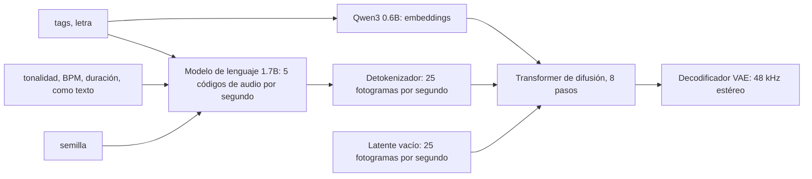

import { Tabs, TabItem } from '@astrojs/starlight/components';

Código: los workflows en formato API en [`audio/workflows/`](https://github.com/spareilleux/learn/tree/a5c8533c8411a80a382e94cadbd1d9bfe4d01777/code/comfyui/audio/workflows), las ejecuciones de esta lección en [`audio/runs/`](https://github.com/spareilleux/learn/tree/a5c8533c8411a80a382e94cadbd1d9bfe4d01777/code/comfyui/audio/runs), el pipeline [`pipeline.py`](https://github.com/spareilleux/learn/blob/a5c8533c8411a80a382e94cadbd1d9bfe4d01777/code/comfyui/audio/pipeline.py), los scripts de medición [`analyze.py`](https://github.com/spareilleux/learn/blob/a5c8533c8411a80a382e94cadbd1d9bfe4d01777/code/comfyui/audio/analyze.py), [`measure.py`](https://github.com/spareilleux/learn/blob/a5c8533c8411a80a382e94cadbd1d9bfe4d01777/code/comfyui/audio/measure.py) y [`wer.py`](https://github.com/spareilleux/learn/blob/a5c8533c8411a80a382e94cadbd1d9bfe4d01777/code/comfyui/audio/wer.py), el validador de workflows [`validate.py`](https://github.com/spareilleux/learn/blob/a5c8533c8411a80a382e94cadbd1d9bfe4d01777/code/comfyui/audio/validate.py), y las pruebas, todo ejecutado por [`audio/check.sh`](https://github.com/spareilleux/learn/blob/a5c8533c8411a80a382e94cadbd1d9bfe4d01777/code/comfyui/audio/check.sh) y el workflow [`comfyui-audio.yml`](https://github.com/spareilleux/learn/blob/a5c8533c8411a80a382e94cadbd1d9bfe4d01777/.github/workflows/comfyui-audio.yml).

Las primeras lecciones generaban imágenes. El núcleo de ComfyUI también genera sonido: música con letra, efectos de sonido y la pista de audio de un vídeo. El grafo es el mismo tipo de grafo, con un cargador, un codificador de texto, un latente vacío, un sampler y un decodificador VAE; lo que cambia es lo que representa un latente y lo que hace el codificador de texto con un prompt. Esta lección lee eso en el código de la v0.36.0, ejecuta dos familias de modelos en una RTX 5080, mide lo que salió frente a lo que se pidió, y después mira lo que el núcleo no hace, la voz, y lo que hace falta para añadirla.

Cada clip de esta página se generó para esta lección y el pipeline de la lección lo normalizó a −16 LUFS. Su pie indica el modelo, la semilla, el workflow y la licencia. El curso midió los clips con scripts; no los juzgó de oído, y ni las mediciones ni este texto afirman que suenen bien.

## El tipo `AUDIO`

Las imágenes viajan entre nodos como tensores; el sonido también. Un valor `AUDIO` es un diccionario de Python con dos claves: `waveform`, un tensor de floats con forma `[batch, channels, samples]`, y `sample_rate`, un entero. En términos de C#, es el `WaveFormat` de NAudio más un `float[]` por canal; en Java, un `AudioFormat` más las muestras de un `AudioInputStream`, ya decodificadas a floats.

`LoadAudio` decodifica un archivo con [PyAV](https://pyav.basswood-io.com/), los bindings de FFmpeg que ComfyUI requiere, así que lee todo lo que lee FFmpeg, incluida la pista de audio de un vídeo. Las muestras enteras se convierten en floats entre −1 y 1, y el nodo añade la dimensión de batch ([`nodes_audio.py`, líneas 333 a 400](https://github.com/Comfy-Org/ComfyUI/blob/ee71d5c4993f29086b27fde1629a945ae48425bf/comfy_extras/nodes_audio.py#L333-L400)):

```python
waveform, sample_rate = load(audio_path)
audio = {"waveform": waveform.unsqueeze(0), "sample_rate": sample_rate}
```

Su lista de archivos es la carpeta de entrada filtrada por tipo de contenido, audio y vídeo ([línea 364](https://github.com/Comfy-Org/ComfyUI/blob/ee71d5c4993f29086b27fde1629a945ae48425bf/comfy_extras/nodes_audio.py#L364)), y como en `LoadImage` su clave de caché es el SHA-256 del archivo ([líneas 384 a 390](https://github.com/Comfy-Org/ComfyUI/blob/ee71d5c4993f29086b27fde1629a945ae48425bf/comfy_extras/nodes_audio.py#L384-L390)): reemplaza el archivo y la siguiente ejecución lo vuelve a cargar.

Dos nodos terminan un grafo:

- **`PreviewAudio`** escribe un archivo FLAC en la carpeta temporal, con un nombre aleatorio `ComfyUI_temp_`, para que el navegador pueda reproducirlo ([`_ui.py`, líneas 417 a 430](https://github.com/Comfy-Org/ComfyUI/blob/ee71d5c4993f29086b27fde1629a945ae48425bf/comfy_api/latest/_ui.py#L417-L430)).
- **`SaveAudioAdvanced`** escribe en la carpeta de salida, en FLAC, MP3 u Opus ([`nodes_audio.py`, líneas 251 a 296](https://github.com/Comfy-Org/ComfyUI/blob/ee71d5c4993f29086b27fde1629a945ae48425bf/comfy_extras/nodes_audio.py#L251-L296)). `SaveAudio`, `SaveAudioMP3` y `SaveAudioOpus` siguen existiendo, marcados como obsoletos.

`SaveAudioAdvanced` tiene un *combo dinámico*: la entrada `quality` solo existe cuando `format` es `mp3` u `opus`. En formato API, esa subentrada se escribe con un punto, `"format.quality"`. Sin ella, un workflow con `"format": "mp3"` vuelve del servidor CPU de la CI con `Required input is missing: quality`, y con `"format.quality": "nope"`, con `Value not in list: format.quality: 'nope' not in ['V0', '128k', '320k']`. Los archivos guardados también llevan el workflow: `ffprobe` muestra una etiqueta `prompt` en los archivos FLAC y Opus, el mismo JSON que la lección 3 encontró en los archivos PNG.

La categoría `audio` del núcleo tiene 15 nodos, y son fontanería: `LoadAudio`, `RecordAudio`, `PreviewAudio`, los cuatro nodos de guardado, `EmptyAudio`, `TrimAudioDuration`, `SplitAudioChannels`, `JoinAudioChannels`, `AudioConcat`, `AudioMerge`, `AudioAdjustVolume` y `AudioEqualizer3Band`. El workflow de la CI, [`15-cpu-empty-audio.api.json`](https://github.com/spareilleux/learn/blob/a5c8533c8411a80a382e94cadbd1d9bfe4d01777/code/comfyui/audio/workflows/15-cpu-empty-audio.api.json), usa tres de ellos para guardar dos segundos de silencio sin modelo.

## Latentes: un VAE de audio comprime el tiempo

El VAE de la lección 2 convierte una imagen de 1024 × 1024 en un latente de 128 × 128 con 4 o 16 canales. Un VAE de audio hace lo mismo a lo largo del tiempo: un fotograma latente representa un número fijo de muestras, y el modelo de difusión trabaja sobre la secuencia corta de fotogramas, nunca sobre las 48 000 muestras de cada segundo. El núcleo detecta qué VAE contiene un archivo por los nombres de sus tensores, en [`sd.py`](https://github.com/Comfy-Org/ComfyUI/blob/ee71d5c4993f29086b27fde1629a945ae48425bf/comfy/sd.py#L697-L731), y los números cambian según el modelo:

| VAE | Frecuencia de muestreo | Muestras por fotograma latente | Fotogramas latentes por segundo | Canales |
|---|---|---|---|---|
| Stable Audio Open 1.0 | 44.1 kHz | 2 048 | 21.5 | 64 |
| ACE-Step 1.5 | 48 kHz | 1 920 | 25 | 64 |
| Stable Audio 3 | 44.1 kHz | 4 096 | 10.8 | 256 |

Los nodos de latente vacío convierten segundos en fotogramas. `EmptyLatentAudio`, escrito para Stable Audio Open 1.0, calcula `round((seconds * 44100 / 2048) / 2) * 2` fotogramas de 64 canales ([`nodes_audio.py`, líneas 31 a 34](https://github.com/Comfy-Org/ComfyUI/blob/ee71d5c4993f29086b27fde1629a945ae48425bf/comfy_extras/nodes_audio.py#L31-L34)); `EmptyAceStep1.5LatentAudio` calcula `round(seconds * 48000 / 1920)` ([`nodes_ace.py`, líneas 103 a 107](https://github.com/Comfy-Org/ComfyUI/blob/ee71d5c4993f29086b27fde1629a945ae48425bf/comfy_extras/nodes_ace.py#L103-L107)). Stable Audio 3 no tiene nodo propio: su plantilla usa `EmptyLatentAudio`, y el sampler corrige la forma. Cuando el latente es todo ceros, `fix_empty_latent_channels` lo repite hasta el número de canales del modelo y reescala su longitud por la razón entre los dos tamaños de fotograma, aquí 2 048 / 4 096 ([`sample.py`, líneas 45 a 69](https://github.com/Comfy-Org/ComfyUI/blob/ee71d5c4993f29086b27fde1629a945ae48425bf/comfy/sample.py#L45-L69), llamado por `KSampler` en [`nodes.py`, línea 1574](https://github.com/Comfy-Org/ComfyUI/blob/ee71d5c4993f29086b27fde1629a945ae48425bf/nodes.py#L1574)). Un latente que no está vacío, de `VAEEncodeAudio`, no se toca.

Los archivos de esta lección cuadran con esa aritmética, con una excepción. Las ejecuciones de ACE-Step de 6, 10, 20, 30 y 40 segundos dieron exactamente 288 000, 480 000, 960 000, 1 440 000 y 1 920 000 muestras. Las de Stable Audio 3 de 3 y 10 segundos dieron 131 072 y 442 368 muestras, 32 y 108 fotogramas de 4 096; una ejecución de 4 segundos dio 180 224 muestras, 44 fotogramas, donde la fórmula da 43. El decodificador de Stable Audio 3 rellena su entrada hasta un múltiplo de un tamaño de bloque ([`vae_sa3.py`, líneas 300 a 304](https://github.com/Comfy-Org/ComfyUI/blob/ee71d5c4993f29086b27fde1629a945ae48425bf/comfy/ldm/audio/vae_sa3.py#L300-L304)), lo que explicaría el fotograma de más: *por verificar*.

`VAEDecodeAudio` tiene un paso más que importa cuando mides la sonoridad: divide la forma de onda por cinco veces su desviación típica siempre que ese producto supera 1 ([`nodes_audio.py`, líneas 108 a 110](https://github.com/Comfy-Org/ComfyUI/blob/ee71d5c4993f29086b27fde1629a945ae48425bf/comfy_extras/nodes_audio.py#L108-L110)). Las salidas fuertes se atenúan; las suaves se quedan como están. Es una protección contra el clipping, no un estándar de sonoridad: los clips de música en bruto de esta página midieron entre −11.4 y −21.2 LUFS, y un tono de sala −39.9 LUFS, y por eso el pipeline del final de esta lección normaliza con FFmpeg.

## Música con ACE-Step 1.5

### Qué ACE-Step

El núcleo v0.36.0 admite dos generaciones de [ACE-Step](https://github.com/ace-step/ACE-Step-1.5), un modelo de música de ACE Studio y StepFun. La versión 1.0 tiene `TextEncodeAceStepAudio` y `EmptyAceStepLatentAudio`; la versión 1.5 tiene `TextEncodeAceStepAudio1.5`, `EmptyAceStep1.5LatentAudio` y un `ReferenceTimbreAudio` experimental para versiones ([`nodes_ace.py`](https://github.com/Comfy-Org/ComfyUI/blob/ee71d5c4993f29086b27fde1629a945ae48425bf/comfy_extras/nodes_ace.py)). La plantilla que trae el núcleo, `Text to Audio (ACE-Step 1.5)`, carga cuatro archivos de [Comfy-Org/ace_step_1.5_ComfyUI_files](https://huggingface.co/Comfy-Org/ace_step_1.5_ComfyUI_files/tree/694a9723ff772285c73f0700caacf944d3f02f8d): el modelo de difusión turbo, dos codificadores de texto y el VAE. El curso usa los mismos archivos, salvo el segundo codificador de texto: el modelo de lenguaje de 1.7B en lugar del de 4B, lo que ahorra 4.7 GB de descarga y de memoria.

| Archivo | Papel | Tamaño | SHA-256 |
|---|---|---|---|
| `acestep_v1.5_turbo.safetensors` | transformer de difusión, 8 pasos | 4.79 GB | `3f6e0797…e422d7` |
| `qwen_0.6b_ace15.safetensors` | embeddings de texto y de letra | 1.19 GB | `fd4590c8…aa7a7` |
| `qwen_1.7b_ace15.safetensors` | modelo de lenguaje que planifica el audio | 3.71 GB | `ed63e924…ebd710` |
| `ace_1.5_vae.safetensors` | VAE de audio, 48 kHz estéreo | 0.34 GB | `6de92e3a…cb2bb` |

El repositorio de origen, [ACE-Step/Ace-Step1.5](https://huggingface.co/ACE-Step/Ace-Step1.5/tree/19671f406d603126926c1b7e2adc169acbcade22), está bajo la licencia MIT, y su ficha dice "You can strictly use the generated music for commercial purposes"; los archivos reempaquetados llevan Apache 2.0 en Hugging Face. Ninguna de las dos licencias restringe la publicación de las salidas ni dónde se usan, y la ficha dice que los datos de entrenamiento son licenciados, libres de regalías y sintéticos.

### Tags, letra y metadatos pasan por un modelo de lenguaje

`TextEncodeAceStepAudio1.5` tiene las entradas que esperas de un prompt musical, `tags`, `lyrics`, `bpm`, `duration`, `timesignature`, `language` y `keyscale`, y algunas que quizá no: `seed`, `generate_audio_codes`, `cfg_scale`, `temperature`, `top_p`, `top_k` y `min_p` ([`nodes_ace.py`, líneas 31 a 61](https://github.com/Comfy-Org/ComfyUI/blob/ee71d5c4993f29086b27fde1629a945ae48425bf/comfy_extras/nodes_ace.py#L31-L61)). Son los ajustes de un modelo de lenguaje, y el tokenizador muestra lo que pasa ([`ace15.py`, líneas 208 a 274](https://github.com/Comfy-Org/ComfyUI/blob/ee71d5c4993f29086b27fde1629a945ae48425bf/comfy/text_encoders/ace15.py#L208-L274)):

- La tonalidad, el tempo, el compás y la duración se convierten en texto. Se escriben como YAML dentro de un bloque `<think>` de un prompt de chat para el modelo de lenguaje, y como una lista `# Metas` para el modelo de embeddings:

  ```python
  lm_template = "<|im_start|>system\n# Instruction\nGenerate audio semantic tokens based on the given conditions:\n\n<|im_end|>\n<|im_start|>user\n# Caption\n{}\n\n# Lyric\n{}\n<|im_end|>\n<|im_start|>assistant\n{}\n\n<|im_end|>\n"
  ```

- Después, el modelo de lenguaje genera *códigos de audio*, cinco por segundo de música: `tokens_duration = duration * 5`, usado a la vez como número mínimo y máximo de tokens ([líneas 226 a 230](https://github.com/Comfy-Org/ComfyUI/blob/ee71d5c4993f29086b27fde1629a945ae48425bf/comfy/text_encoders/ace15.py#L226-L230)). El bucle de muestreo es el de cualquier modelo de chat: logits restringidos al rango de tokens de audio, classifier-free guidance entre el prompt y un prompt negativo con un bloque `<think>` vacío, temperatura, top-k, top-p, y un `torch.Generator` inicializado con la `seed` del nodo ([líneas 30 a 140](https://github.com/Comfy-Org/ComfyUI/blob/ee71d5c4993f29086b27fde1629a945ae48425bf/comfy/text_encoders/ace15.py#L30-L140)).
- El modelo de 0.6B genera los embeddings de la descripción y, por separado, de la letra ([líneas 323 a 339](https://github.com/Comfy-Org/ComfyUI/blob/ee71d5c4993f29086b27fde1629a945ae48425bf/comfy/text_encoders/ace15.py#L323-L339)).

En el modelo de difusión, un detokenizador expande cada código de audio en cinco fotogramas, de 5 a 25 fotogramas por segundo, la frecuencia del latente del VAE, y esos fotogramas son las "pistas" en torno a las que el transformer elimina el ruido ([`ace_step15.py`, líneas 1077 a 1112](https://github.com/Comfy-Org/ComfyUI/blob/ee71d5c4993f29086b27fde1629a945ae48425bf/comfy/ldm/ace/ace_step15.py#L1077-L1112)). Con `generate_audio_codes` desactivado, no se genera ningún plan, y el modelo parte en su lugar de un latente de silencio incorporado ([`model_base.py`, líneas 2516 a 2553](https://github.com/Comfy-Org/ComfyUI/blob/ee71d5c4993f29086b27fde1629a945ae48425bf/comfy/model_base.py#L2516-L2553)).



Esto importa para lo que puedes esperar. Nada en el grafo impone una tonalidad o un tempo: `C major` y `90` son palabras de un prompt, que el modelo de lenguaje se entrenó para seguir. Las mediciones de abajo comprueban hasta qué punto lo hace.

El grafo es el de la plantilla, en formato API: [`15-ace-step.api.json`](https://github.com/spareilleux/learn/blob/a5c8533c8411a80a382e94cadbd1d9bfe4d01777/code/comfyui/audio/workflows/15-ace-step.api.json). `ModelSamplingAuraFlow` fija el shift de flow matching en 3, y `KSampler` ejecuta 8 pasos de `euler` con CFG 1, porque el modelo turbo se destiló para no necesitar guidance. El condicionamiento negativo es el positivo puesto a cero por `ConditioningZeroOut`. La semilla se fija dos veces, en el codificador de texto para los códigos de audio y en `KSampler` para el ruido; las ejecuciones de esta lección siempre ponen las dos al mismo valor.

### Ejecutarlo, y cuánto tarda

Las 21 ejecuciones están en [`runs/ace-step.json`](https://github.com/spareilleux/learn/blob/a5c8533c8411a80a382e94cadbd1d9bfe4d01777/code/comfyui/audio/runs/ace-step.json), cada una como una lista de cambios `--set node.input=value` al workflow, y `pipeline.py batch` las encoló una tras otra en un ComfyUI arrancado con su propio directorio base. En la RTX 5080, con 12.3 GB de VRAM libres al empezar el lote, el log del servidor dice:

- La primera ejecución tardó 38.8 s, casi todo de carga: los dos codificadores de texto se prepararon como 4 672 MB, el modelo de difusión como 4 564 MB, y el VAE se cargó como 321.7 MB, con la carga dinámica de VRAM de ComfyUI.
- Después, un clip de 20 segundos tardó de 4.3 a 4.5 s, uno de 10 segundos 3.2 s, y uno de 40 segundos 8.5 s.
- El mismo clip de 20 segundos sin códigos de audio tardó 1.9 s: la planificación del modelo de lenguaje es más de la mitad del tiempo.

### Semilla, duración, tags, letra

El loop del que parten las mediciones siguientes pide `solo acoustic guitar loop, fingerpicked, warm, dry studio recording, instrumental`, letra `[Instrumental]`, `C major`, 90 BPM, 4/4, 20 segundos, semilla 1.

<audio controls preload="none" src="../../../comfyui/audio/15-loop-c-seed1.mp3"></audio>

*Generado por ComfyUI v0.36.0: ACE-Step 1.5 turbo con Qwen3 0.6B y 1.7B, semilla 1, 8 pasos, `euler`, `simple`, CFG 1, shift 3, ejecución `loop-c-seed1` de `runs/ace-step.json`, workflow [`15-ace-step.api.json`](https://github.com/spareilleux/learn/blob/a5c8533c8411a80a382e94cadbd1d9bfe4d01777/code/comfyui/audio/workflows/15-ace-step.api.json). Licencia MIT. Normalizado a −16 LUFS, MP3 a 96 kb/s.*

[`measure.py`](https://github.com/spareilleux/learn/blob/a5c8533c8411a80a382e94cadbd1d9bfe4d01777/code/comfyui/audio/measure.py) lee cada archivo FLAC guardado e imprime su formato, un hash de sus muestras y su pico. Para las ejecuciones de ACE-Step, además compara la tonalidad y el tempo pedidos con lo que oye [`analyze.py`](https://github.com/spareilleux/learn/blob/a5c8533c8411a80a382e94cadbd1d9bfe4d01777/code/comfyui/audio/analyze.py). La tonalidad es la estimación de Krumhansl-Kessler: el croma medio del clip, calculado con `chroma_cqt` de [librosa](https://librosa.org/doc/latest/index.html), correlacionado con los 24 perfiles de tonalidad mayor y menor; `r` es la mejor correlación. El tempo es el `beat_track` de librosa. Un clip sintético C-F-G-C a 120 BPM, que construyen las pruebas, sale como C major con r = 0.97 y 117.5 BPM.

```text
$ python measure.py runs/ace-step.json G:/learn-lab/comfyui/audio/runs/ace
loop-c-seed1: 48000 Hz, 2 ch, 20.00 s, samples 3a0f4dc422dd21cc, peak 1.00 | asked C major, 90 BPM; heard C major (r=0.66), 92.3 BPM | key yes, tempo ratio 1.03
loop-c-seed1-again: 48000 Hz, 2 ch, 20.00 s, samples 3a0f4dc422dd21cc, peak 1.00 | asked C major, 90 BPM; heard C major (r=0.66), 92.3 BPM | key yes, tempo ratio 1.03
loop-c-seed2: 48000 Hz, 2 ch, 20.00 s, samples 06a7e133106ce1ce, peak 0.90 | asked C major, 90 BPM; heard G major (r=0.49), 161.5 BPM | key no, tempo ratio 1.79
loop-c-seed3: 48000 Hz, 2 ch, 20.00 s, samples b13fe842c3eef028, peak 1.00 | asked C major, 90 BPM; heard C major (r=0.42), 60.1 BPM | key yes, tempo ratio 0.67
loop-c-10s: 48000 Hz, 2 ch, 10.00 s, samples 388373d59bbef315, peak 0.77 | asked C major, 90 BPM; heard G major (r=0.67), 95.7 BPM | key no, tempo ratio 1.06
loop-c-40s: 48000 Hz, 2 ch, 40.00 s, samples 1ab6165dd90985c5, peak 1.00 | asked C major, 90 BPM; heard A minor (r=0.41), 89.1 BPM | key relative, tempo ratio 0.99
loop-c-no-codes: 48000 Hz, 2 ch, 20.00 s, samples ef78ea83a483aef3, peak 1.00 | asked C major, 90 BPM; heard C major (r=0.69), 89.1 BPM | key yes, tempo ratio 0.99
loop-tags-rock: 48000 Hz, 2 ch, 20.00 s, samples bc707dd2c2b04877, peak 1.00 | asked C major, 90 BPM; heard C major (r=0.66), 89.1 BPM | key yes, tempo ratio 0.99
```

Lo que muestran esas líneas:

- **Misma semilla, mismas muestras, pero no por la razón que podrías pensar.** `loop-c-seed1-again` tiene el mismo hash, pero el log del servidor dice que se ejecutó en 0.06 s: las entradas de todos los nodos eran idénticas salvo el prefijo del nombre de archivo, así que ComfyUI reutilizó su caché y solo se ejecutó el nodo de guardado. La prueba real es un servidor recién arrancado. Detenido, reiniciado y con las mismas dos ejecuciones, produjo los mismos hashes de muestras, `3a0f4dc422dd21cc` para el loop y `f892c13bf2b0f920` para el jingle de más abajo. Fue en una GPU con un driver; entre GPU distintas se aplican las salvedades de la lección 2: *por verificar*.
- **Otra semilla, otra pieza.** La semilla 2 se oyó en G major, la dominante de C, y la semilla 3 en C major con una correlación más débil. La semilla gobierna el muestreo de los códigos de audio del modelo de lenguaje y el ruido de la difusión, así que cambia más que la textura.
- **La duración también cambia la pieza.** 10 segundos de la semilla 1 no son la primera mitad de 20 segundos de la semilla 1: el modelo de lenguaje escribe 50 códigos en lugar de 100, y la tonalidad salió G major. A 40 segundos, la estimación fue A minor, la relativa menor de C, con una r baja.
- **Sin códigos de audio**, el resultado siguió siendo C major a 89 BPM, el más cercano a lo pedido de los tres loops, en menos de la mitad del tiempo. Con un solo clip, eso no dice nada general.
- **Otros tags, misma tonalidad y mismo tempo.** `loop-tags-rock` mantuvo la tonalidad, el tempo y la semilla y cambió los tags a `distorted electric guitar riff, heavy rock, drums, instrumental`. La tonalidad y el tempo se mantuvieron; si el clip suena a rock, los scripts no lo pueden decir.

<audio controls preload="none" src="../../../comfyui/audio/15-loop-c-seed2.mp3"></audio>

*Generado por ComfyUI v0.36.0: el mismo workflow y el mismo prompt, semilla 2, ejecución `loop-c-seed2`. Oído como G major a 161.5 BPM. Licencia MIT. Normalizado a −16 LUFS, MP3 a 96 kb/s.*

<audio controls preload="none" src="../../../comfyui/audio/15-loop-c-no-codes.mp3"></audio>

*Generado por ComfyUI v0.36.0: el mismo workflow y el mismo prompt, semilla 1, `generate_audio_codes` en false, ejecución `loop-c-no-codes`. Licencia MIT. Normalizado a −16 LUFS, MP3 a 96 kb/s.*

<audio controls preload="none" src="../../../comfyui/audio/15-loop-tags-rock.mp3"></audio>

*Generado por ComfyUI v0.36.0: el mismo workflow, semilla 1, C major, 90 BPM, tags `distorted electric guitar riff, heavy rock, drums, instrumental`, ejecución `loop-tags-rock`. Licencia MIT. Normalizado a −16 LUFS, MP3 a 96 kb/s.*

### Tonalidad y tempo, ocho peticiones

El barrido conserva los tags del loop y la semilla 1, y cambia la tonalidad y el tempo:

| Pedido | Tonalidad oída | r | Tempo oído | Tonalidad | Razón de tempo |
|---|---|---|---|---|---|
| C major, 90 BPM | C major | 0.66 | 92.3 | sí | 1.03 |
| C major, 70 BPM | G major | 0.72 | 143.6 | no | 2.05 |
| E minor, 100 BPM | E minor | 0.65 | 66.3 | sí | 0.66 |
| A major, 140 BPM | A major | 0.86 | 143.6 | sí | 1.03 |
| F# minor, 80 BPM | F# minor | 0.49 | 80.7 | sí | 1.01 |
| Bb major, 120 BPM | F# major | 0.43 | 117.5 | no | 0.98 |
| D minor, 60 BPM | D minor | 0.74 | 117.5 | sí | 1.96 |
| G major, 160 BPM | G major | 0.59 | 83.4 | sí | 0.52 |
| Eb major, 95 BPM | F# major | 0.50 | 95.7 | no | 1.01 |

En las 20 ejecuciones de música distintas de la lección (sin la repetición que salió de la caché), la estimación de tonalidad coincidió con lo pedido 12 veces, encontró la relativa menor una vez y falló 7 veces. La estimación de tempo quedó a menos del 7 % de lo pedido 12 veces; 7 veces quedó cerca del doble, la mitad o dos tercios, incluida la canción de más abajo, y una vez no tuvo relación, 1.79 veces lo pedido para la semilla 2. Un seguidor de pulsos a menudo se engancha a la mitad o al doble del tempo que contaría un músico, así que una razón de 2 o de 0.5 puede ser tanto un error del estimador como del modelo; el curso no contó los pulsos de oído, y las razones cercanas a 2 quedan *por verificar*. Los dos fallos en tonalidades con bemoles, Bb y Eb major, ambos oídos como F# major, son el patrón que destaca, con una semilla cada uno.

### Los ejemplos de Guitar Alchemist, y un fallo

Un **jingle** para la introducción de una lección: `short cheerful intro jingle for an online guitar lesson, bright acoustic guitar strum, glockenspiel, handclaps, ends on a clear final chord, instrumental`, G major, 110 BPM, 6 segundos. Las semillas 1 y 2 se oyeron ambas en G major a 112.3 BPM, con r = 0.87 y 0.51.

<audio controls preload="none" src="../../../comfyui/audio/15-jingle-seed1.mp3"></audio>

*Generado por ComfyUI v0.36.0: ACE-Step 1.5 turbo, semilla 1, G major, 110 BPM, 6 s, ejecución `jingle-seed1`, workflow [`15-ace-step.api.json`](https://github.com/spareilleux/learn/blob/a5c8533c8411a80a382e94cadbd1d9bfe4d01777/code/comfyui/audio/workflows/15-ace-step.api.json). Licencia MIT. Normalizado a −16 LUFS, MP3 a 96 kb/s.*

Una **canción** con letra original sobre cómo se construye un acorde, `gentle folk song, acoustic guitar, soft female vocals, intimate`, D major, 80 BPM, 30 segundos:

```text
[verse]
Find the root and then the third
Stack a fifth and hear the chord
[chorus]
One, four, five, and home again
```

Se oyó en D major con r = 0.87, y a 152 BPM, cerca del doble de lo pedido. [Whisper](https://github.com/SYSTRAN/faster-whisper) large-v3, el transcriptor de la sección de voz de más abajo, oyó "Find the root and then the third Stack a fifth and hear the chord Four and five and home": la estrofa está intacta, y el estribillo perdió "One" y "again", una tasa de error de palabras de 3 sobre 20.

<audio controls preload="none" src="../../../comfyui/audio/15-song-lyrics.mp3"></audio>

*Generado por ComfyUI v0.36.0: ACE-Step 1.5 turbo, semilla 1, D major, 80 BPM, 30 s, la letra de arriba, ejecución `song-lyrics`. La voz es la del modelo; no se pidió la voz de ningún cantante real. Licencia MIT. Normalizado a −16 LUFS, MP3 a 96 kb/s.*

Un **ii-V-I de jazz** es donde falló. Los tags eran `jazz guitar trio playing a ii-V-I progression, Dm7 G7 Cmaj7, medium swing, clean archtop guitar, upright bass, brushes on snare, instrumental`, C major, 120 BPM, 20 segundos. `measure.py --chords` etiqueta cada compás con la más cercana de 60 plantillas de acorde (mayor, menor, 7, maj7 y m7 sobre 12 fundamentales), con los compases contados a partir del seguidor de pulsos:

```text
jazz-251-seed1: 48000 Hz, 2 ch, 20.00 s, samples c3e2218b5183858c, peak 1.00 | asked C major, 120 BPM; heard D major (r=0.36), 123.0 BPM | key no, tempo ratio 1.03
      1.04 s  G      r=0.38
      3.04 s  C#maj7 r=0.57
      5.04 s  C#maj7 r=0.50
      7.04 s  Dm     r=0.66
      9.03 s  Bbmaj7 r=0.40
     11.05 s  Ab     r=0.59
     13.05 s  C#maj7 r=0.64
     15.05 s  Bm     r=0.57
jazz-251-seed2: 48000 Hz, 2 ch, 20.00 s, samples 3b84301e70e82c49, peak 1.00 | asked C major, 120 BPM; heard F minor (r=0.34), 60.1 BPM | key no, tempo ratio 0.50
      0.98 s  C      r=0.37
      4.97 s  Dm7    r=0.29
      8.99 s  Fm7    r=0.60
```

Ninguna semilla muestra un ciclo Dm7, G7, Cmaj7, y las dos correlaciones de tonalidad son las más bajas de la lección, que es lo que da una armonía que no se asienta en una tonalidad. Las etiquetas de acorde son en sí una prueba débil: en el clip sintético C-F-G-C, cuyos acordes conocen las pruebas, los compases salieron desplazados y etiquetados `Cmaj7`, `C`, `Fmaj7`, `G7`, así que tómalas como un indicio. Lo que sí se puede decir es que una progresión de acordes escrita en los tags no se siguió como progresión, en dos intentos de dos. Los tags son una descripción para un modelo de lenguaje, no una partitura: ACE-Step 1.5 recibe una tonalidad, un tempo y un compás, y nada en sus entradas es un acorde.

<audio controls preload="none" src="../../../comfyui/audio/15-jazz-251-seed1.mp3"></audio>

*Generado por ComfyUI v0.36.0: ACE-Step 1.5 turbo, semilla 1, C major, 120 BPM, 20 s, ejecución `jazz-251-seed1`. La progresión pedida no es la que encontró el análisis. Licencia MIT. Normalizado a −16 LUFS, MP3 a 96 kb/s.*

## Efectos de sonido con Stable Audio 3

El núcleo tiene dos familias de Stable Audio. [Stable Audio Open 1.0](https://huggingface.co/stabilityai/stable-audio-open-1.0) se condiciona con un codificador de texto T5 y con dos números, `seconds_start` y `seconds_total`, que fija `ConditioningStableAudio`. Stable Audio 3, cuyos archivos reempaquetó Comfy-Org en [Comfy-Org/stable-audio-3](https://huggingface.co/Comfy-Org/stable-audio-3/tree/96fc663283cde94cb631bc84f6c9ece7bbe2bf25), usa un codificador de texto [T5Gemma](https://huggingface.co/google/t5gemma-b-b-ul2) y solo `seconds_total`, que el modelo calcula a partir de la longitud del latente cuando ningún nodo lo fija: `int(noise.shape[-1] / 10.7666)`, el número de fotogramas dividido por los fotogramas por segundo ([`model_base.py`, líneas 877 a 906](https://github.com/Comfy-Org/ComfyUI/blob/ee71d5c4993f29086b27fde1629a945ae48425bf/comfy/model_base.py#L877-L906)). El núcleo trae dos plantillas para el modelo medium de 9.2 GB. El curso usa los dos modelos small, [uno entrenado para efectos de sonido](https://huggingface.co/stabilityai/stable-audio-3-small-sfx/tree/ae12755283df9d62ca39a9b050a39a0b607b8c20) y [otro para música](https://huggingface.co/stabilityai/stable-audio-3-small-music/tree/0fef1392cd842149a2b6d445e181c97608faac06), de 2.27 GB cada uno, con el mismo codificador de texto:

| Archivo | Tamaño | SHA-256 |
|---|---|---|
| `stable_audio_3_small_sfx.safetensors` | 2.27 GB | `ed9cf1b6…2e515` |
| `stable_audio_3_small_music.safetensors` | 2.27 GB | `da85866b…4b64` |
| `t5gemma_b_b_ul2.safetensors` | 1.19 GB | `1e1eba25…150e` |

El archivo del codificador de texto no es el de Google: `google/t5gemma-b-b-ul2` publica un archivo con otro hash, y el de Comfy-Org es una conversión de él.

El grafo, [`15-stable-audio-sfx.api.json`](https://github.com/spareilleux/learn/blob/a5c8533c8411a80a382e94cadbd1d9bfe4d01777/code/comfyui/audio/workflows/15-stable-audio-sfx.api.json), es el de la plantilla sin su rama de redacción de prompts: `CheckpointLoaderSimple` para el modelo y su VAE, `CLIPLoader` con el tipo `stable_audio` para T5Gemma, dos `CLIPTextEncode`, `EmptyLatentAudio`, y `KSampler` con 8 pasos de `lcm` con CFG 1, como fija la plantilla para estos modelos con post-entrenamiento adversarial.

### Dos licencias

Los pesos están bajo la [Stability AI Community License](https://huggingface.co/stabilityai/stable-audio-3-small-sfx/blob/ae12755283df9d62ca39a9b050a39a0b607b8c20/LICENSE.md), fechada el 5 de julio de 2024, el mismo archivo en los tres repositorios de Stable Audio 3, y el codificador de texto bajo los [Gemma Terms of Use](https://ai.google.dev/gemma/terms), modificados por última vez el 1 de abril de 2026. Lo que dicen de las salidas, palabra por palabra:

- Stability, sección IV.c.(iii): "As between You and Stability AI, You own any outputs generated from the Models or Derivative Works to the extent permitted by applicable law." Su definición de Derivative Works termina con "but do not include the output of any Model."
- Stability, sección III, para el uso comercial: "If at any time You or Your Affiliate(s), either individually or in aggregate, generate more than USD $1,000,000 in annual revenue (…), any licenses granted to You under this Agreement shall terminate as of such date." El uso comercial también exige registrarse con Stability AI.
- Stability, sección IV.a, solo cuando distribuyes los modelos o un producto que los usa: una copia del acuerdo, un archivo "Notice" y "Powered by Stability AI" visible. Las dos licencias se conceden "worldwide" (Stability, secciones II y III); los términos de Gemma no tienen cláusula territorial.
- Stability, sección IV.b: las salidas no pueden usarse "to create or improve any foundational generative AI model".
- Gemma, sección 3.3: "Google claims no rights in Outputs you generate using Gemma. You and your users are solely responsible for Outputs and their subsequent uses."

Las dos permiten publicar los clips de esta lección en un sitio público. El sitio no distribuye pesos, así que las obligaciones del aviso y de "Powered by Stability AI" no se aplican; aun así, cada clip dice qué modelo lo generó.

### Una púa, un chirrido de trastes, una sala

[`runs/stable-audio.json`](https://github.com/spareilleux/learn/blob/a5c8533c8411a80a382e94cadbd1d9bfe4d01777/code/comfyui/audio/runs/stable-audio.json) tiene siete ejecuciones. La primera tardó 11.8 s con la carga, con el codificador de texto preparado como 537 MB, el modelo como 875 MB y el VAE como 406 MB; las siguientes tardaron de 0.5 a 0.9 s cada una. La sonoridad en bruto, de la primera pasada de `loudnorm` de FFmpeg:

| Ejecución | Prompt | Duración | Pico | Sonoridad |
|---|---|---|---|---|
| `pick-seed1` | a single guitar pick plucking one steel acoustic guitar string, close microphone, dry | 4.09 s | 0.41 | −29.2 LUFS |
| `pick-seed2` | el mismo, semilla 2 | 4.09 s | 0.32 | −30.1 LUFS |
| `fret-squeak` | fingers sliding along wound acoustic guitar strings, fret squeak, close microphone | 2.97 s | 0.17 | −27.2 LUFS |
| `studio-room` | quiet recording studio room tone, soft air conditioning hum, distant muffled footsteps | 10.03 s | 0.14 | −39.9 LUFS |

<audio controls preload="none" src="../../../comfyui/audio/15-pick-seed1.mp3"></audio>

*Generado por ComfyUI v0.36.0: Stable Audio 3 small SFX con T5Gemma, semilla 1, 8 pasos, `lcm`, `simple`, CFG 1, 4 s, ejecución `pick-seed1` de `runs/stable-audio.json`, workflow [`15-stable-audio-sfx.api.json`](https://github.com/spareilleux/learn/blob/a5c8533c8411a80a382e94cadbd1d9bfe4d01777/code/comfyui/audio/workflows/15-stable-audio-sfx.api.json). Stability AI Community License y Gemma Terms of Use. Normalizado por el pipeline, a −17.7 LUFS (ver el ejercicio 3), MP3 a 96 kb/s.*

<audio controls preload="none" src="../../../comfyui/audio/15-fret-squeak.mp3"></audio>

*Generado por ComfyUI v0.36.0: Stable Audio 3 small SFX, semilla 1, 3 s, ejecución `fret-squeak`. Stability AI Community License y Gemma Terms of Use. Normalizado a −16.9 LUFS, MP3 a 96 kb/s.*

<audio controls preload="none" src="../../../comfyui/audio/15-studio-room.mp3"></audio>

*Generado por ComfyUI v0.36.0: Stable Audio 3 small SFX, semilla 1, 10 s, ejecución `studio-room`. Stability AI Community License y Gemma Terms of Use. Subido de −39.9 a −16.7 LUFS por el pipeline, así que su soplido suena 23 dB más fuerte que al generarse; un tono de sala debe quedar muy por debajo de la música. MP3 a 96 kb/s.*

El modelo de música recibe su tempo y su tonalidad en el prompt, como texto. `acoustic guitar loop, 100 BPM, C major, fingerpicked`, 10 segundos, dio C major (r = 0.90) a 99.4 BPM con la semilla 1, y C major (r = 0.93) a 136.0 BPM con la semilla 2. El mismo prompt en el modelo de efectos de sonido dio G major (r = 0.80) a 99.4 BPM.

<audio controls preload="none" src="../../../comfyui/audio/15-music-loop-100.mp3"></audio>

*Generado por ComfyUI v0.36.0: Stable Audio 3 small music con T5Gemma, semilla 1, 10 s, ejecución `music-loop-100`, workflow [`15-stable-audio-sfx.api.json`](https://github.com/spareilleux/learn/blob/a5c8533c8411a80a382e94cadbd1d9bfe4d01777/code/comfyui/audio/workflows/15-stable-audio-sfx.api.json) con `ckpt_name` cambiado. Stability AI Community License y Gemma Terms of Use. Normalizado a −16.4 LUFS, MP3 a 96 kb/s.*

## Sonido para un vídeo

Dos cosas del núcleo v0.36.0 tocan el sonido de vídeo, y ninguna se ejecutó para esta lección.

- **LTX-2.x genera vídeo y audio a la vez.** `LTXVEmptyLatentAudio` dimensiona un latente de audio a partir de un número de fotogramas de vídeo y una frecuencia de fotogramas, `LTXVAudioVAEDecode` lo convierte en `AUDIO`, y la clase de modelo `LTXAV` elimina el ruido de ambos ([`nodes_lt_audio.py`](https://github.com/Comfy-Org/ComfyUI/blob/ee71d5c4993f29086b27fde1629a945ae48425bf/comfy_extras/nodes_lt_audio.py#L93-L166)). Su VAE de audio trabaja sobre un espectrograma mel y termina con un vocoder ([`audio_vae.py`](https://github.com/Comfy-Org/ComfyUI/blob/ee71d5c4993f29086b27fde1629a945ae48425bf/comfy/ldm/lightricks/vae/audio_vae.py)). La plantilla `Text to Video (LTX-2.5)` del núcleo necesita un transformer de 21.5 GB y un codificador de texto de 15.4 GB, ambos cuantizados a int8, más de lo que caben a la vez en los 16 GB de VRAM de esta máquina y más de lo que el curso descarga sin preguntar. La [LTX-2.x Community License](https://github.com/Lightricks/LTX-2/blob/a95ab856bf29407b6b066ede0abe1846050db56c/LICENSE-2_x), fechada el 11 de agosto de 2026, permite publicar las salidas ("Licensor claims no rights in the Output you generate using LTX-2.x", sección 5), y exige una licencia de pago a las entidades con ingresos anuales de al menos 10 000 000 USD. Si LTX-2.5 cabe en 16 GB con descarga a memoria del sistema, y qué tal suena: *por verificar*.
- **El VAE de MMAudio está, MMAudio no.** [`comfy/ldm/mmaudio`](https://github.com/Comfy-Org/ComfyUI/tree/ee71d5c4993f29086b27fde1629a945ae48425bf/comfy/ldm/mmaudio) contiene solo un VAE y un vocoder BigVGAN, que `sd.py` carga para un modelo de 16 kHz ([líneas 905 a 921](https://github.com/Comfy-Org/ComfyUI/blob/ee71d5c4993f29086b27fde1629a945ae48425bf/comfy/sd.py#L905-L921)), y el VAE de audio de LTX toma prestada su clase de distribución gaussiana. Ningún nodo muestrea con él un modelo de vídeo a audio. Qué modelo usa este VAE en el núcleo, si alguno lo usa: *por verificar*.

Sin ninguno de los dos, el sonido de un vídeo en el núcleo son los fotogramas de la lección de vídeo más un grafo de audio aparte: genera un clip de la duración del vídeo con ACE-Step o Stable Audio, y combina los dos con FFmpeg.

## Voz: no está en el núcleo

No hay ningún modelo local de síntesis de voz en ComfyUI v0.36.0. Arrancado con `--disable-api-nodes`, el servidor lista 666 tipos de nodo en `/object_info`, y ninguno de sus nombres ni de sus nombres visibles contiene "speech", "TTS" o "voice"; los 15 nodos de la categoría `audio` son la fontanería listada al principio de esta lección. Los modelos de música del núcleo pueden cantar letras, que no es lo mismo.

Los nodos de voz que sí existen son *nodos de API*, que envían tu texto a un servicio de pago y descargan el resultado: `ElevenLabsTextToSpeech` ([`nodes_elevenlabs.py`, línea 240](https://github.com/Comfy-Org/ComfyUI/blob/ee71d5c4993f29086b27fde1629a945ae48425bf/comfy_api_nodes/nodes_elevenlabs.py#L240)), `FishAudioTextToSpeech` ([`nodes_fishaudio.py`, línea 185](https://github.com/Comfy-Org/ComfyUI/blob/ee71d5c4993f29086b27fde1629a945ae48425bf/comfy_api_nodes/nodes_fishaudio.py#L185)) y `HeyGenTextToSpeechNode` ([`nodes_heygen.py`, línea 696](https://github.com/Comfy-Org/ComfyUI/blob/ee71d5c4993f29086b27fde1629a945ae48425bf/comfy_api_nodes/nodes_heygen.py#L696)), con nodos de clonación de voz a su lado. Necesitan una cuenta de Comfy con créditos, y son la razón de que exista [`--disable-api-nodes`](https://github.com/Comfy-Org/ComfyUI/blob/ee71d5c4993f29086b27fde1629a945ae48425bf/comfy/cli_args.py#L216). Para voz local, necesitas un paquete de nodos personalizados, y se aplican las reglas de la lección 11.

### Elegir y leer un paquete

El curso eligió [comfyui-kokoro](https://github.com/stavsap/comfyui-kokoro/tree/cfb59b5605b351e196182c836f0b48c1a784e52f), 66 estrellas en GitHub, Apache 2.0, fijado en su último commit, del 23 de febrero de 2026. Envuelve [Kokoro-82M](https://huggingface.co/hexgrad/Kokoro-82M), un modelo de 82 millones de parámetros bajo Apache 2.0, a través de [kokoro-onnx](https://github.com/thewh1teagle/kokoro-onnx), que lo ejecuta con [ONNX Runtime](https://onnxruntime.ai/). Es lo bastante pequeño para leerlo entero: un `__init__.py` de dos líneas y un archivo Python de 291 líneas.

La auditoría de la lección 11, antes de instalar:

```text
$ python code/comfyui/custom-nodes/audit/audit.py comfyui-kokoro --details 40
== comfyui-kokoro: 16 files, 2 Python, 0 JavaScript, web folder: no
   autorun            2  file that runs without being asked
                        __init__.py  imported by ComfyUI at every start
                        requirements.txt  installed with pip by ComfyUI-Manager
   network            2  network call (urllib, requests, httpx, aiohttp client, socket)
                        ComfyUIKokoro.py:97  with requests.get(url, stream=True, allow_redirects=True) as response:
                        ComfyUIKokoro.py:122  r = requests.get(url)
```

Leer el código y las dependencias añade lo que los recuentos no pueden decir:

- **Al importarlo**, el archivo importa NumPy, PyTorch, `kokoro_onnx`, `requests` y `tqdm`, y define tres clases. No se ejecuta nada.
- **En la primera ejecución**, cada nodo llama a `download_model` y `download_voices` ([`ComfyUIKokoro.py`, líneas 96 a 137](https://github.com/stavsap/comfyui-kokoro/blob/cfb59b5605b351e196182c836f0b48c1a784e52f/ComfyUIKokoro.py#L96-L137)). El modelo viene de una release de un fork, `github.com/taylorchu/kokoro-onnx/releases/download/v0.2.0/kokoro.onnx`, no de las releases del propio kokoro-onnx; las 54 voces vienen de `hexgrad/Kokoro-82M` en la rama `main`, no de un commit fijado. Ninguna descarga se comprueba contra un hash, y las dos se escriben en la propia carpeta del paquete. Las voces se leen con `torch.load(content, weights_only=True)`, el modo seguro de la lección 11.
- **El archivo del fork es el oficial.** Descargados por las dos vías, `kokoro.onnx` del fork y `kokoro-v1.0.onnx` de la release `model-files-v1.0` de kokoro-onnx tienen los mismos 325 532 387 bytes y el mismo SHA-256, `7d5df8ec…36a6c5`. Era así el 17 de septiembre de 2026; nada impide que un archivo de una release cambie.
- **Las dependencias no están fijadas**: `kokoro-onnx`, `onnxruntime`, `numpy`, `requests`, `tqdm`. El 17 de septiembre de 2026 se resolvieron a kokoro-onnx 0.6.1 (MIT), onnxruntime 1.30.0, phonemizer 3.4.0 y espeakng-loader 0.2.4. Esta última incluye una biblioteca precompilada de [eSpeak NG](https://github.com/espeak-ng/espeak-ng) y sus datos, que phonemizer carga para convertir el texto en fonemas. eSpeak NG está bajo la GPL 3.0, lo que importa si redistribuyes una instalación, no para el audio que produce.
- **kokoro-onnx** lee las voces con `np.load(voices_path)`, que por defecto rechaza los pickles, y no hace ninguna llamada de red; sus únicas URL están en mensajes de error.
- **Las voces son grabaciones de personas.** El [`VOICES.md`](https://huggingface.co/hexgrad/Kokoro-82M/blob/f3ff3571791e39611d31c381e3a41a3af07b4987/VOICES.md) de Kokoro dice "Support for non-English languages may be absent or thin due to weak G2P and/or lack of training data", indica menos de 11 horas de datos de entrenamiento en francés, y atribuye la voz francesa `ff_siwis` al conjunto de datos [SIWIS](https://datashare.ed.ac.uk/handle/10283/2353), las grabaciones de una hablante real. La licencia del modelo permite publicar su salida; aun así, este curso no publica voz sintética con una voz hecha a partir de grabaciones de una persona real, así que esta sección da transcripciones y mediciones, no clips.

La instalación, solo en la instancia aislada, con las dependencias fijadas a lo que se revisó, y los dos archivos del modelo colocados a mano para que el paquete nunca descargue nada. El curso ejecutó los comandos de Windows, con [uv](https://docs.astral.sh/uv/) en el entorno virtual propio de la instancia:

<Tabs syncKey="os">
<TabItem label="Windows">

```powershell
git clone https://github.com/stavsap/comfyui-kokoro "$env:COMFY_BASE\custom_nodes\comfyui-kokoro"
git -C "$env:COMFY_BASE\custom_nodes\comfyui-kokoro" checkout cfb59b5605b351e196182c836f0b48c1a784e52f
uv pip install --python .\venv\Scripts\python.exe kokoro-onnx==0.6.1 onnxruntime==1.30.0 phonemizer==3.4.0 espeakng-loader==0.2.4 dlinfo==2.0.0 joblib==1.6.0 cloudpickle==3.1.2 flatbuffers==25.12.19 protobuf==7.36.1
Copy-Item kokoro-v1.0.onnx "$env:COMFY_BASE\custom_nodes\comfyui-kokoro\kokoro_v1.onnx"
Copy-Item voices-v1.0.bin "$env:COMFY_BASE\custom_nodes\comfyui-kokoro\voices_v1.bin"
```

</TabItem>
<TabItem label="Linux / WSL">

```bash
git clone https://github.com/stavsap/comfyui-kokoro "$COMFY_BASE/custom_nodes/comfyui-kokoro"
git -C "$COMFY_BASE/custom_nodes/comfyui-kokoro" checkout cfb59b5605b351e196182c836f0b48c1a784e52f
uv pip install --python ./venv/bin/python kokoro-onnx==0.6.1 onnxruntime==1.30.0 phonemizer==3.4.0 espeakng-loader==0.2.4 dlinfo==2.0.0 joblib==1.6.0 cloudpickle==3.1.2 flatbuffers==25.12.19 protobuf==7.36.1
cp kokoro-v1.0.onnx "$COMFY_BASE/custom_nodes/comfyui-kokoro/kokoro_v1.onnx"
cp voices-v1.0.bin "$COMFY_BASE/custom_nodes/comfyui-kokoro/voices_v1.bin"
```

</TabItem>
<TabItem label="macOS">

```bash
git clone https://github.com/stavsap/comfyui-kokoro "$COMFY_BASE/custom_nodes/comfyui-kokoro"
git -C "$COMFY_BASE/custom_nodes/comfyui-kokoro" checkout cfb59b5605b351e196182c836f0b48c1a784e52f
uv pip install --python ./venv/bin/python kokoro-onnx==0.6.1 onnxruntime==1.30.0 phonemizer==3.4.0 espeakng-loader==0.2.4 dlinfo==2.0.0 joblib==1.6.0 cloudpickle==3.1.2 flatbuffers==25.12.19 protobuf==7.36.1
cp kokoro-v1.0.onnx "$COMFY_BASE/custom_nodes/comfyui-kokoro/kokoro_v1.onnx"
cp voices-v1.0.bin "$COMFY_BASE/custom_nodes/comfyui-kokoro/voices_v1.bin"
```

</TabItem>
</Tabs>

Los comandos de Linux y macOS están *por verificar*, y también estos wheels exactos en esos sistemas. En Windows, uv instaló 9 paquetes, y ONNX Runtime informó de `AzureExecutionProvider` y `CPUExecutionProvider`: aquí Kokoro se ejecuta en la CPU. El paquete se importó en 0.0 s al arrancar el servidor.

### Tres idiomas, medidos

El grafo son tres nodos, [`15-kokoro-tts.api.json`](https://github.com/spareilleux/learn/blob/a5c8533c8411a80a382e94cadbd1d9bfe4d01777/code/comfyui/audio/workflows/15-kokoro-tts.api.json): `KokoroSpeaker` elige una voz, `KokoroGenerator` recibe el texto, la velocidad y un idioma, y `SaveAudioAdvanced` guarda el `AUDIO` que devuelve. [`runs/kokoro.json`](https://github.com/spareilleux/learn/blob/a5c8533c8411a80a382e94cadbd1d9bfe4d01777/code/comfyui/audio/runs/kokoro.json) dice tres frases de este curso en inglés con `af_heart`, en francés con `ff_siwis` y en español con `ef_dora`. Cada una tardó de 2.6 a 4.7 s en la CPU, 6.9 s la primera.

Para medir la inteligibilidad sin juzgar de oído, [`wer.py`](https://github.com/spareilleux/learn/blob/a5c8533c8411a80a382e94cadbd1d9bfe4d01777/code/comfyui/audio/wer.py) transcribe cada clip con Whisper large-v3 mediante faster-whisper, en int8 en la CPU, beam 5, temperatura 0, y calcula la tasa de error de palabras (WER): la distancia de edición entre la frase y la transcripción, en palabras, dividida por el número de palabras de la frase, tras pasar a minúsculas y quitar la puntuación. Los errores del propio Whisper también cuentan, así que una WER es una cota superior de los del modelo de voz.

| Clip | WER | Errores / palabras | Lo que oyó Whisper |
|---|---|---|---|
| en 1 | 0.217 | 5 / 23 | Welcome to Lesson 15. A C major 7 chord stacks a major 3rd, a perfect 5th, and a major 7th on the root. |
| en 2 | 0.0 | 0 / 18 | The sampler removes noise from the latent in eight steps, then the VAE decodes it into a waveform. |
| en 3 | 0.0 | 0 / 21 | Save the workflow as JSON, queue it through the API, and download the file when the history says it is done. |
| fr 1 | 0.28 | 7 / 25 | Bienvenue dans la leçon 15. Un accord de N doufles majeure 7 en pile une tierce majeure, une quinte juste et une septième majeure sur la fondamentale. |
| fr 2 | 0.053 | 1 / 19 | L'échantillonneur retire le bruit du latent en huit étapes, puis le verre le décode en forme d'onde. |
| fr 3 | 0.167 | 4 / 24 | Enregistrez le nWorkflow frange son, mettez-le en fil par l'API et téléchargez le fichier quand l'historique indique qu'il est terminé. |
| es 1 | 0.08 | 2 / 25 | Bienvenidos a la lección 15. Un acorde de do mayor 7 apila una tercera mayor, una quinta justa y una séptima mayor sobre la fundamental. |
| es 2 | 0.0 | 0 / 21 | El muestreador quita el ruido del latente en ocho pasos y luego el VAE lo decodifica en una forma de onda. |
| es 3 | 0.0 | 0 / 25 | Guarda el flujo de trabajo en JSON, ponlo en la cola con la API y descarga el archivo cuando el historial diga que ha terminado. |

Las frases eran:

- en: "Welcome to lesson fifteen. A C major seven chord stacks a major third, a perfect fifth and a major seventh on the root." / "The sampler removes noise from the latent in eight steps, then the VAE decodes it into a waveform." / "Save the workflow as JSON, queue it through the API, and download the file when the history says it is done."
- fr: "Bienvenue dans la leçon quinze. Un accord de do majeur sept empile une tierce majeure, une quinte juste et une septième majeure sur la fondamentale." / "L'échantillonneur retire le bruit du latent en huit étapes, puis le VAE le décode en forme d'onde." / "Enregistrez le workflow en JSON, mettez-le en file par l'API, et téléchargez le fichier quand l'historique indique qu'il est terminé."
- es: "Bienvenidos a la lección quince. Un acorde de do mayor siete apila una tercera mayor, una quinta justa y una séptima mayor sobre la fundamental." / "El muestreador quita el ruido del latente en ocho pasos, y luego el VAE lo decodifica en una forma de onda." / "Guarda el flujo de trabajo en JSON, ponlo en la cola con la API y descarga el archivo cuando el historial diga que ha terminado."

Lee los errores, no solo las tasas. Los 5 errores de la frase 1 en inglés y los dos de la frase 1 en español son Whisper escribiendo los números con cifras, "15" por "fifteen" y "3rd" por "third": la voz era correcta. El francés es donde Kokoro falló. "do majeur" se convirtió en "N doufles majeure", "le VAE" en "le verre", porque los fonemas franceses leen la sigla como una palabra, y "le workflow en JSON" en "le nWorkflow frange son". El log del servidor muestra el porqué del último: phonemizer avisó `1 utterances containing language switches` y `extra phones may appear in the "fr-fr" phoneset` para las dos frases francesas con palabras inglesas, que eSpeak NG pronunció con fonemas ingleses dentro del habla francesa. "en file" oído como "en fil" es un homófono, elección de Whisper. Contando solo los errores de la voz, el francés queda en 5 de 25, 1 de 19 y 3 de 24 palabras; el inglés y el español, en 0.

## Automatizarlo: un pipeline a través de la API

Los clientes de la lección 4 seguían un prompt por el WebSocket. Para trabajos de audio que duran segundos, [`pipeline.py`](https://github.com/spareilleux/learn/blob/a5c8533c8411a80a382e94cadbd1d9bfe4d01777/code/comfyui/audio/pipeline.py) consulta `/history` una vez por segundo en su lugar, solo con la biblioteca estándar de Python, y añade el paso que un sitio o un juego necesita después de la generación: una sonoridad coherente y un archivo pequeño.

1. `POST /prompt` con un workflow, tras los cambios `--set node.input=value`. Un workflow rechazado imprime los `node_errors` del servidor.
2. `GET /history/{prompt_id}` hasta que el estado sea `success` o `error`.
3. `GET /view` para cada archivo que un nodo de guardado declara en `audio`.
4. [FFmpeg](https://ffmpeg.org/) con su filtro [`loudnorm`](https://ffmpeg.org/ffmpeg-filters.html#loudnorm), en dos pasadas: la primera mide la sonoridad integrada, el pico real y el rango de sonoridad; la segunda aplica una ganancia lineal calculada a partir de la medición, hacia −16 LUFS con un techo de −1.5 dBTP, y codifica [Opus](https://opus-codec.org/) a 48 kHz.

−16 LUFS es el nivel que [Apple pide a los podcasts](https://podcasters.apple.com/support/893-audio-requirements), "around -16 dB LKFS, with a +/- 1 dB tolerance"; [Spotify normaliza la música](https://support.spotify.com/artists/article/loudness-normalization/) a −14 dB LUFS. El objetivo es una opción de la línea de comandos.

Una ejecución real, 8 segundos del loop con la semilla 7, contra el servidor de la lección:

```text
$ python pipeline.py run http://127.0.0.1:8196 workflows/15-ace-step.api.json --set 5.seed=7 --set 8.seed=7 --set 5.duration=8.0 --set 7.seconds=8.0 --set 10.filename_prefix=l15/demo --out out
queued
success after 24.2 s
node 10: l15/demo_00001.flac -> out\demo_00001.flac
  -13.9 LUFS -> demo_00001.opus, -16.0 LUFS, 96455 bytes
```

Los 24.2 s incluyen la carga de los modelos en un servidor que acababa de arrancar. El archivo FLAC ocupa 400 921 bytes; el Opus, 96 455. Los clips de esta página pasaron por la misma función `encode` hacia MP3, que reproducen más navegadores:

```text
$ python pipeline.py encode loop-c-seed1_00001.flac 15-loop-c-seed1.mp3
-18.5 LUFS -> -16.4 LUFS
$ python pipeline.py encode pick-seed1_00001.flac 15-pick-seed1.mp3
-29.2 LUFS -> -17.7 LUFS
$ python pipeline.py encode studio-room_00001.flac 15-studio-room.mp3
-39.9 LUFS -> -16.7 LUFS
```

Los once clips de esta página pesan 1.9 MB en total.

El código se comprueba sin GPU. `check.sh unit` valida cada workflow y cada ejecución contra las definiciones de nodos guardadas del servidor de la lección, [`object_info.audio.json`](https://github.com/spareilleux/learn/blob/a5c8533c8411a80a382e94cadbd1d9bfe4d01777/code/comfyui/audio/data/object_info.audio.json), con las mismas reglas que el servidor (tipos, enlaces, límites, listas, combos dinámicos), y ejecuta las pruebas: el pipeline contra un ComfyUI falso, el objetivo de sonoridad con FFmpeg, las estimaciones de tonalidad y tempo sobre clips sintéticos, y la WER. `check.sh server` arranca ComfyUI v0.36.0 en la CPU, pasa el workflow silencioso por `pipeline.py` y compara la transcripción. La CI ejecuta el primero en Ubuntu, Windows y macOS, y el segundo en Ubuntu.

## Puntos clave

- `AUDIO` es `waveform` `[batch, channels, samples]` más `sample_rate`; la carga pasa por PyAV, el guardado por `SaveAudioAdvanced`, cuya `quality` se escribe `format.quality` en formato API.
- Un latente de audio es una secuencia de fotogramas: 25 por segundo en ACE-Step 1.5, 10.8 en Stable Audio 3. Los nodos de latente vacío convierten segundos en fotogramas, y `KSampler` adapta un latente vacío al modelo.
- ACE-Step 1.5 convierte tags, letra, tonalidad, tempo y duración en texto para un modelo de lenguaje, que escribe cinco códigos de audio por segundo; la semilla y la duración cambian ese plan, y nada impone la tonalidad ni el tempo.
- Medido sobre 20 ejecuciones, la tonalidad coincidió 12 veces; una progresión de acordes escrita en los tags no se siguió, dos veces. Mide antes de fiarte de un prompt, y lee los errores del propio estimador, como un tempo al doble.
- La misma semilla en la misma máquina dio las mismas muestras tras un reinicio; un prompt repetido en un servidor en marcha solo acierta en la caché.
- Los modelos small de Stable Audio 3 generan efectos de sonido y música corta en menos de un segundo cada uno en una GPU de 16 GB; sus salidas son tuyas bajo la Stability AI Community License, que termina para las empresas de más de 1 000 000 USD de ingresos.
- El núcleo no tiene ningún modelo de voz local, solo nodos de API de pago. Un paquete de voz es un paquete de nodos personalizados: audítalo, fija sus dependencias, coloca sus archivos a mano y mídelo; Kokoro fue inteligible en inglés y en español y cometió errores reales en francés.
- Normaliza la sonoridad después de generar: el decodificador solo evita el clipping. `loudnorm` en dos pasadas llega a −16 LUFS salvo que el techo de pico real impida la ganancia.

## Ejercicios

1. Un grafo pide a `EmptyAceStep1.5LatentAudio` 10 segundos y a `TextEncodeAceStepAudio1.5` una `duration` de 20. ¿Cuántos fotogramas latentes y cuántos códigos de audio hay, y qué hace el modelo de difusión con la diferencia? ¿Y con 20 segundos de latente y una `duration` de 10?
2. Mide cinco semillas más del loop en C major, de la 4 a la 8, y cuenta cuántas se oyen en C major. Escribe el archivo de ejecuciones, encólalo con `pipeline.py batch` y lee la salida de `measure.py`.
3. El clip de la púa llegó a −17.7 LUFS, no a −16. ¿Por qué, a partir de los números del clip en bruto y de la documentación de `loudnorm` de FFmpeg? ¿Qué cambiarías para llegar a −16, y qué costaría?
4. Kokoro leyó "le VAE" como "le verre". Reescribe la frase francesa para que la sigla se deletree, ejecútala y mídela con `wer.py`.
5. Un workflow pone `"bpm": 400` y `"keyscale": "H major"` en `TextEncodeAceStepAudio1.5`. ¿Qué informa `validate.py`, y qué diría el servidor?
6. Cambia el workflow de ACE-Step para guardar un MP3 a 320 kb/s a través de la API. ¿Qué entradas del nodo 10 cambian?

<details>
<summary>Solución 1</summary>

Latente: `round(10 * 48000 / 1920)` = 250 fotogramas. Códigos: el tokenizador redondea la duración hacia arriba y pide al modelo de lenguaje exactamente `20 * 5` = 100 códigos, que el detokenizador convierte en 500 fotogramas de pistas. Después, `prepare_condition` conserva los primeros 250 fotogramas de pistas, `lm_hints[:, :src_latents.shape[1], :]` ([`ace_step15.py`, línea 1104](https://github.com/Comfy-Org/ComfyUI/blob/ee71d5c4993f29086b27fde1629a945ae48425bf/comfy/ldm/ace/ace_step15.py#L1104)): obtienes la primera mitad de un plan de 20 segundos, y el modelo de lenguaje gastó tiempo en la segunda mitad para nada.

En el otro sentido, 500 fotogramas latentes y 50 códigos: como `50 * 5` es menor que 500, los códigos se rellenan hasta `ceil(500 / 5)` = 100 con el token constante `35847` antes de expandirse ([líneas 1096 a 1097](https://github.com/Comfy-Org/ComfyUI/blob/ee71d5c4993f29086b27fde1629a945ae48425bf/comfy/ldm/ace/ace_step15.py#L1096-L1097)), así que la segunda mitad del latente queda guiada por un código de relleno repetido en lugar de por un plan. Cómo suena eso no se midió: *por verificar*. Mantén iguales los dos números, como hacen las ejecuciones de la lección.

</details>

<details>
<summary>Solución 2</summary>

```json
[
  {"name": "loop-c-seed4", "workflow": "../workflows/15-ace-step.api.json",
   "set": ["5.seed=4", "8.seed=4", "10.filename_prefix=l15/loop-c-seed4"]}
]
```

Repite la entrada para las semillas 5 a 8. Los valores por defecto del workflow ya son los tags del loop, C major, 90 BPM y 20 segundos, así que las semillas y el prefijo son los únicos cambios. Después:

```bash
python pipeline.py batch http://127.0.0.1:8188 runs/seeds.json --out out/seeds
python measure.py runs/seeds.json out/seeds
```

El curso solo ejecutó las semillas 1 a 3: 2 de 3 se oyeron en C major. Con 8 semillas, un recuento sigue siendo una muestra pequeña; da el resultado con los valores de r, y escucha las que queden por debajo de 0.5.

</details>

<details>
<summary>Solución 3</summary>

La púa en bruto está a −29.2 LUFS con un pico de muestra de 0.41, unos −7.7 dBFS. Llegar a −16 LUFS requiere +13.2 dB, lo que pondría el pico cerca de +5.5 dBFS, por encima del techo de −1.5 dBTP. La documentación de `loudnorm` de FFmpeg dice que en modo lineal "the change in integrated loudness shouldn't result in a true peak which exceeds the target TP", y que si no "normalization mode will revert to dynamic"; el modo dinámico limita entonces los picos y se queda por debajo del objetivo en un clip de 4 segundos dominado por un solo transitorio. Para llegar a −16, sube el techo (`TP=0`, y acepta un ataque más fuerte), o comprime el ataque antes de normalizar, lo que cambia el sonido de la púa. Para efectos cortos, un objetivo de pico en lugar de uno de sonoridad suele ser la mejor regla.

</details>

<details>
<summary>Solución 4</summary>

Escribe las letras como las lee el francés, por ejemplo "puis le vé-a-eu le décode en forme d'onde", o evita la sigla, "puis le décodeur le transforme en forme d'onde", y ponla en el nodo 2:

```bash
python pipeline.py run http://127.0.0.1:8188 workflows/15-kokoro-tts.api.json --set "2.text=puis le vé-a-eu le décode en forme d'onde." --set 2.lang=\"French\" --out out/fr --bitrate ""
python wer.py --model faster-whisper-large-v3 --lang fr --text "puis le VAE le décode en forme d'onde." out/fr/kokoro_00001.flac
```

Compara la WER con la frase de referencia, no con el texto reescrito. El curso no ejecutó esta variante: *por verificar*.

</details>

<details>
<summary>Solución 5</summary>

`validate.py` comprueba las entradas contra las definiciones guardadas, como hacen las pruebas:

```text
node 5 (TextEncodeAceStepAudio1.5) bpm: 400 is outside [10, 300]
node 5 (TextEncodeAceStepAudio1.5) keyscale: 'H major' is not one of 34 options
```

El servidor rechaza el prompt con un 400 y una entrada `node_errors` para el nodo 5, que `pipeline.py` imprime antes de salir con el código 2. "H" es el nombre alemán de B (si), y la lista solo tiene nombres de notas en inglés.

</details>

<details>
<summary>Solución 6</summary>

`format` pasa a ser `mp3`, y aparece la subentrada dinámica `format.quality`, con `V0`, `128k` o `320k`:

```bash
python pipeline.py run http://127.0.0.1:8188 workflows/15-ace-step.api.json --set 10.format=\"mp3\" --set 10.format.quality=\"320k\" --bitrate ""
```

`--set` separa solo por el primer punto, así que el nombre de la entrada es `format.quality`. Sin ella, el servidor responde `Required input is missing: quality`. `--bitrate ""` omite FFmpeg, ya que el archivo ya está comprimido.

</details>

## Fuentes

- ComfyUI en la v0.36.0, commit `ee71d5c`: [`comfy_extras/nodes_audio.py`](https://github.com/Comfy-Org/ComfyUI/blob/ee71d5c4993f29086b27fde1629a945ae48425bf/comfy_extras/nodes_audio.py), [`comfy_extras/nodes_ace.py`](https://github.com/Comfy-Org/ComfyUI/blob/ee71d5c4993f29086b27fde1629a945ae48425bf/comfy_extras/nodes_ace.py), [`comfy/text_encoders/ace15.py`](https://github.com/Comfy-Org/ComfyUI/blob/ee71d5c4993f29086b27fde1629a945ae48425bf/comfy/text_encoders/ace15.py), [`comfy/ldm/ace/ace_step15.py`](https://github.com/Comfy-Org/ComfyUI/blob/ee71d5c4993f29086b27fde1629a945ae48425bf/comfy/ldm/ace/ace_step15.py), [`comfy/model_base.py`](https://github.com/Comfy-Org/ComfyUI/blob/ee71d5c4993f29086b27fde1629a945ae48425bf/comfy/model_base.py), [`comfy/sample.py`](https://github.com/Comfy-Org/ComfyUI/blob/ee71d5c4993f29086b27fde1629a945ae48425bf/comfy/sample.py), [`comfy/sd.py`](https://github.com/Comfy-Org/ComfyUI/blob/ee71d5c4993f29086b27fde1629a945ae48425bf/comfy/sd.py), [`comfy/ldm/audio/vae_sa3.py`](https://github.com/Comfy-Org/ComfyUI/blob/ee71d5c4993f29086b27fde1629a945ae48425bf/comfy/ldm/audio/vae_sa3.py), [`comfy_extras/nodes_lt_audio.py`](https://github.com/Comfy-Org/ComfyUI/blob/ee71d5c4993f29086b27fde1629a945ae48425bf/comfy_extras/nodes_lt_audio.py), [`comfy_api/latest/_ui.py`](https://github.com/Comfy-Org/ComfyUI/blob/ee71d5c4993f29086b27fde1629a945ae48425bf/comfy_api/latest/_ui.py).
- ACE-Step: [repositorio de ACE-Step 1.5](https://github.com/ace-step/ACE-Step-1.5), [ficha del modelo](https://huggingface.co/ACE-Step/Ace-Step1.5/tree/19671f406d603126926c1b7e2adc169acbcade22), [archivos para ComfyUI](https://huggingface.co/Comfy-Org/ace_step_1.5_ComfyUI_files/tree/694a9723ff772285c73f0700caacf944d3f02f8d); J. Gong et al., [ACE-Step 1.5: Pushing the Boundaries of Open-Source Music Generation](https://arxiv.org/abs/2602.00744), 2026.
- Stability AI: [Stable Audio 3 small SFX](https://huggingface.co/stabilityai/stable-audio-3-small-sfx/tree/ae12755283df9d62ca39a9b050a39a0b607b8c20), [Stable Audio 3 small music](https://huggingface.co/stabilityai/stable-audio-3-small-music/tree/0fef1392cd842149a2b6d445e181c97608faac06), [Community License](https://huggingface.co/stabilityai/stable-audio-3-small-sfx/blob/ae12755283df9d62ca39a9b050a39a0b607b8c20/LICENSE.md), [archivos para ComfyUI](https://huggingface.co/Comfy-Org/stable-audio-3/tree/96fc663283cde94cb631bc84f6c9ece7bbe2bf25); Z. Evans et al., [Stable Audio 3](https://arxiv.org/abs/2605.17991), 2026. Google: [T5Gemma](https://huggingface.co/google/t5gemma-b-b-ul2), [Gemma Terms of Use](https://ai.google.dev/gemma/terms).
- Lightricks: [LTX-2.x Community License](https://github.com/Lightricks/LTX-2/blob/a95ab856bf29407b6b066ede0abe1846050db56c/LICENSE-2_x).
- Voz: [comfyui-kokoro](https://github.com/stavsap/comfyui-kokoro/tree/cfb59b5605b351e196182c836f0b48c1a784e52f), [Kokoro-82M](https://huggingface.co/hexgrad/Kokoro-82M), [kokoro-onnx](https://github.com/thewh1teagle/kokoro-onnx), [ONNX Runtime](https://onnxruntime.ai/), [eSpeak NG](https://github.com/espeak-ng/espeak-ng), [base de datos de síntesis de voz francesa SIWIS](https://datashare.ed.ac.uk/handle/10283/2353), [faster-whisper](https://github.com/SYSTRAN/faster-whisper).
- Medición: [librosa](https://librosa.org/doc/latest/index.html); D. Temperley, "What's Key for Key? The Krumhansl-Schmuckler Key-Finding Algorithm Reconsidered", *Music Perception* 17(1), 1999, DOI 10.2307/40285812, que describe los perfiles de Krumhansl-Kessler.
- Sonoridad y formatos: FFmpeg [`loudnorm`](https://ffmpeg.org/ffmpeg-filters.html#loudnorm), [PyAV](https://pyav.basswood-io.com/), [Opus](https://opus-codec.org/), ITU-R [BS.1770](https://www.itu.int/rec/R-REC-BS.1770), [requisitos de audio de Apple Podcasts](https://podcasters.apple.com/support/893-audio-requirements), [normalización de sonoridad de Spotify](https://support.spotify.com/artists/article/loudness-normalization/).
