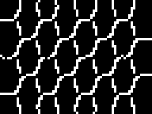

## Progreso

- [x] ComfyUI v0.36.0 (commit `ee71d5c`), frontend 1.52.7, SDXL base 1.0 fijado por el hash del archivo
- [x] `check.sh`: comprobaciones de workflows sin conexión, conversión del formato de la interfaz al de la API comparada con la exportación del frontend, los clientes C# y Java contra ComfyUI en la CPU
- [x] CI en Ubuntu, Windows y macOS, sin GPU ni modelo
- [x] Lección 1: el grafo de nodos, la instalación y una primera imagen
- [x] Lección 2: la difusión, y qué hace reproducible una imagen
- [x] Lección 3: los workflows en JSON
- [x] Lección 4: la API HTTP y WebSocket desde C# y Java
- [x] Traducciones al francés y al español de las lecciones 1 a 4
- [x] Lección 5: img2img, inpainting y outpainting
- [x] Lección 6: ControlNet, bordes y profundidad
- [x] Lección 7: LoRA
- [x] Lección 8: modelos recientes, licencias, cuantización y VRAM
- [x] Traducciones al francés y al español de las lecciones 5 a 8
- [x] Lección 9: escalado, texturas sin costuras y HDR
- [ ] Lección 10: vídeo
- [x] Lección 11: los nodos personalizados y su seguridad
- [x] Lección 12: ComfyUI en producción

## 2026-09-16 — Versiones y configuración

- ComfyUI v0.36.0 se publicó la víspera, el 15 de septiembre de 2026, y es la última versión; su etiqueta apunta al commit [`ee71d5c`](https://github.com/Comfy-Org/ComfyUI/commit/ee71d5c4993f29086b27fde1629a945ae48425bf). La versión portable para Windows y NVIDIA ocupa 1.917.442.353 bytes e incluye Python 3.13.14 y PyTorch 2.13.0 para CUDA 13.0.
- El curso reutiliza una versión portable ya instalada en la máquina, y nunca escribe en ella: el servidor arranca con `--base-directory` apuntando a otro sitio, `--models-directory` apuntando a los modelos de la instalación, y `--database-url sqlite:///:memory:`.
- Un directorio base nuevo hizo que el servidor se detuviera al arrancar con `FileNotFoundError`, porque lista `custom_nodes` antes de crear nada. `server.sh` crea la carpeta vacía.
- `sd_xl_base_1.0.safetensors` tiene en la máquina el SHA-256 que indica Hugging Face, `31e35c80…7e5b`.
- Las páginas de primeros pasos y los ejemplos de la API de la documentación usan Stable Diffusion 1.5 a 512 × 512, no SDXL. La página de instalación manual usa conda; `venv` solo aparece en la página de comfy-cli. El tutorial de texto a imagen dice que `EmptyLatentImage` crea un latente de ruido; crea ceros, y es `KSampler` quien crea el ruido.

## 2026-09-16 — Primeros renders

- El primer render de SDXL tardó 14,71 segundos, de los que unos 4 fueron los 25 pasos de muestreo a 6,4 pasos por segundo. Con los modelos cargados, una nueva semilla tardó 4,6 segundos.
- El prompt pedía un metrónomo de latón; la semilla 42 dibujó algo parecido a un reloj de arena. La semilla 43 se acercó más.
- `nvidia-smi` mostró unos 7 GB más en uso durante el render. El log preparó 1.560 MB para los codificadores de texto, 4.896 MB para la UNet y 159 MB para el VAE.
- Las vistas previas del latente de `--preview-method taesd` ralentizaron el muestreo de 6,4 a 4,9 pasos por segundo.

*El primer render. ComfyUI v0.36.0: Stable Diffusion XL base 1.0, semilla 42, 25 pasos, `euler`, `normal`, CFG 7, 1024 × 1024, workflow [`01-txt2img.api.json`](https://github.com/spareilleux/learn/blob/a1a9bffadaa7156b91ca9c2c2b8885e9e9862dd5/code/comfyui/workflows/01-txt2img.api.json).*

## 2026-09-16 — Una semilla, dos imágenes

- El mismo workflow y la misma semilla dieron `698e7867…` en un servidor recién arrancado, y otra vez tras los reinicios, y `5374ac40…` cada vez que el prompt negativo se volvía a codificar con la UNet ya cargada. Las dos imágenes difieren en una media de 0,92 niveles, y un 2,63 % de los píxeles difieren en más de 8.
- `--disable-dynamic-vram` dio `5374ac40…` también en la primera ejecución. `--deterministic` no cambió ninguno de los dos resultados. No he encontrado qué operación difiere.
- La primera imagen de un lote de dos difería de la imagen única con la misma semilla (media de 0,74), y la segunda imagen del lote no es la de la semilla 43.
- Un render con la semilla 43 hecho por el cliente Java, en otro arranque del servidor 20 minutos después, tenía los mismos píxeles que el primer render con la semilla 43.

*Las dos imágenes con la semilla 42. ComfyUI v0.36.0: Stable Diffusion XL base 1.0, semilla 42, 25 pasos, `euler`, `normal`, CFG 7, workflow [`01-txt2img.api.json`](https://github.com/spareilleux/learn/blob/a1a9bffadaa7156b91ca9c2c2b8885e9e9862dd5/code/comfyui/workflows/01-txt2img.api.json). Izquierda: primera ejecución tras arrancar el servidor. Centro: el mismo grafo después de volver a codificar el prompt negativo. Derecha: dónde difieren, amplificado ocho veces.*

## 2026-09-16 — Los formatos JSON y la API

- Cargar el archivo de la API en el frontend y llamar a `app.graphToPrompt()` dio un archivo de la interfaz y una exportación de la API. El conversor en C#, que lee los nombres de los widgets del `input_order` de `/object_info` y se salta el widget de control de la semilla, produce la exportación byte a byte.
- Un PNG encolado desde el navegador registró la semilla 42 en su chunk `workflow`, y el frontend cambió la semilla a 140956311522585 justo después de encolar, porque su widget `control_after_generate` estaba en `randomize`.
- El servidor escribió `"cfg": 7.0` en el prompt del PNG para un frontend que envió `7`: la validación convierte las entradas `FLOAT` con `float()` y las reescribe.
- Un enlace a un nodo inexistente hizo que la validación del servidor lanzara un `KeyError` fuera de su bloque `try`. El servidor informó de dos errores donde la comprobación sin conexión encontró cinco; uno estaba archivado bajo el nodo 3 con el nombre de entrada del nodo 8, `samples`, y una traza que incluye la ruta de instalación del servidor.
- `check.sh` falló en su segunda ejecución: los dos nodos `SaveImage` se ejecutaron en el orden inverso. El servidor guarda las salidas validadas en un conjunto de Python, y los hashes de las cadenas se aleatorizan en cada arranque. `server.sh` fija ahora `PYTHONHASHSEED=0`.
- Una ejecución totalmente en caché sigue enviando `executed` por cada nodo de salida, con los nombres de archivo de la primera ejecución, y no escribe nada.
- La primera ejecución de la CI falló solo en Ubuntu: el mismo PNG de 64 × 48 se comprimió en 84 bytes allí y en 88 en Windows y macOS. `png-info` imprime ahora el tamaño descomprimido.
- El ejemplo de la API en Python del repositorio de ComfyUI espera `executing` con un nodo `null`. El servidor lo envía después de escribir el historial; los clientes se detienen en cambio con `execution_success`, `execution_error` o `execution_interrupted`.
- La documentación no enumera las rutas `/api/jobs`, el prefijo `/api` de todas las rutas ni los mensajes binarios de vista previa.

## 2026-09-16 — Modelos para las lecciones 5 a 8

- El disco de la máquina del curso estaba casi lleno, así que los nuevos archivos de modelos fueron a otra unidad, declarada a ComfyUI con `--extra-model-paths-config`. Cada archivo se descargó de una revisión fijada de Hugging Face y se comprobó con el SHA-256 que indica Hugging Face, y su licencia se leyó en la ficha del modelo en ese momento.
- Pixel Art XL está bajo CreativeML Open RAIL-M, no bajo la RAIL++-M de SDXL. Su ficha dice que no hace falta ninguna palabra de activación, y sus metadatos fijan `instance_prompt: pixel art`.
- Los metadatos del LCM-LoRA dicen rango 1 y alfa 1, y su título `sdxl_LCM_lora_rank1`; sus tensores tienen rango 64 y alfa 8.
- El codificador de texto Qwen3 4B tiene el mismo SHA-256 en los repositorios de Z-Image-Turbo y de FLUX.2 klein de Comfy-Org.

## 2026-09-16 — Img2img, inpainting, ControlNet y LoRA

- `denoise` no cambió el número de pasos: se ejecutaron 25 pasos para cada valor de 0,3 a 0,9, en 4,6 a 5,1 segundos.
- Subir bytes idénticos con un nombre ya usado devolvió el nombre existente; unos bytes distintos recibieron `name (1).png`. Ninguno de los dos comportamientos está documentado.
- `VAEEncodeForInpaint` pone en gris los píxeles enmascarados, cosa que el tutorial no dice. Con `denoise` a 0,5, el resultado fue una elipse gris plana.

*Dos fallos de inpainting y la solución, antes de volver a pegar el resultado. ComfyUI v0.36.0: Stable Diffusion XL base 1.0, semilla 42, 25 pasos, CFG 7, `euler`, `normal`. De izquierda a derecha: [`05-inpaint-vaeencode.api.json`](https://github.com/spareilleux/learn/blob/40880d5819d3d72102c008a617b4c83b519600cc/code/comfyui/workflows/05-inpaint-vaeencode.api.json) con `denoise` 0,5; el mismo workflow con `denoise` 1 y una máscara con un borde suavizado de 24 píxeles; [`05-inpaint-model.api.json`](https://github.com/spareilleux/learn/blob/40880d5819d3d72102c008a617b4c83b519600cc/code/comfyui/workflows/05-inpaint-model.api.json), la UNet SD-XL inpainting 0.1 con `denoise` 0,99, sobre la misma máscara suavizada.*

- La ficha de SD-XL inpainting dice que se mantenga `strength` por debajo de 1,0; 1,0 y 0,99 dieron aquí casi la misma imagen (un 0,01 % de los píxeles difieren en más de 8).
- El resultado de inpainting decodificado cambió en más de 8 niveles un 6,2 % de los píxeles fuera de la máscara; volver a pegarlo con `ImageCompositeMasked` los dejó idénticos.
- La página de documentación de `SetUnionControlNetType` enumera 13 tipos; el nodo tiene 8.
- La primera ejecución en la CI del nodo `Canny` falló en los tres sistemas operativos: cuatro máquinas dieron cuatro hashes de píxeles. Los tres runners encontraron 467 píxeles de borde, y la máquina del autor 464. La CI ahora los imprime a título informativo.

*La salida del nodo `Canny` en la máquina del autor, hash de píxeles `77af5cb1b7e93a5c`, 464 píxeles de borde, ampliada cuatro veces sin suavizado. ComfyUI v0.36.0 en la CPU, sin modelo, umbrales 0,05 y 0,15, workflow [`05-masks.api.json`](https://github.com/spareilleux/learn/blob/40880d5819d3d72102c008a617b4c83b519600cc/code/comfyui/workflows/05-masks.api.json). Los tres runners de la CI dibujaron cada uno 467 píxeles de borde, con otros tres hashes.*

- Con `end_percent` a 0,3, el ControlNet guió 8 de los 25 pasos, y la imagen fue casi la misma que con él activo en todos los pasos.
- Un LoRA cuesta tiempo antes del primer paso, no durante el muestreo: cambiar de LoRA tardó de 4 a 5 segundos más, y una imagen de 4 pasos con el LCM-LoRA tardó después 1,16 segundos.

## 2026-09-16 — Modelos recientes y cuantización

- Z-Image-Turbo en bf16 con su codificador de texto bf16, 19,4 GB de pesos, se ejecutó en la GPU de 16 GB con la VRAM dinámica: 63,93 segundos el primer render, y luego 5,93 segundos a 1,5 pasos por segundo. int8 con el codificador de texto fp8 fue a 3,1 pasos por segundo, y nvfp4 a entre 3,7 y 4,1.
- `nvidia-smi` mostró de 12,5 a 15,3 GB en uso en todas las configuraciones: la VRAM dinámica usa lo que está libre. Los tamaños preparados en el log son las cifras útiles.
- Las imágenes int8 se mantuvieron cerca de las de bf16 (entre un 9 y un 15 % de los píxeles difieren en más de 8); las imágenes nvfp4 mostraron la misma escena dispuesta de otra forma (entre un 62 y un 74 %).

*ComfyUI v0.36.0: Z-Image-Turbo, semilla 42, 8 pasos, CFG 1, `res_multistep`, `simple`, workflow [`08-z-image-turbo.api.json`](https://github.com/spareilleux/learn/blob/40880d5819d3d72102c008a617b4c83b519600cc/code/comfyui/workflows/08-z-image-turbo.api.json). De izquierda a derecha: bf16 con el codificador de texto bf16, int8 con fp8, nvfp4 con fp4, nvfp4 con bf16.*

- `qwen_3_4b_fp8_mixed` tiene 12 capas nvfp4, y `qwen_3_4b_fp4_mixed` tiene 58 capas fp8. El archivo nvfp4 de Z-Image mantiene sus cuatro bloques de refinado en bf16.
- Con `--disable-dynamic-vram`, el primer render en bf16 tardó 78,87 segundos y dio los mismos píxeles que con la VRAM dinámica. El segundo render se detuvo cuando la máquina, compartida con otros trabajos, se quedó sin RAM. Un lote bf16 anterior se había detenido del mismo modo: el servidor ocupaba 14,5 GB de RAM. Ahora cada servidor solo arranca cuando los pesos de la configuración, más un margen, caben en la RAM libre.
- FLUX.2 klein 4B dibujó un soporte de latón, no un metrónomo, con las semillas 42, 43 y 44; Z-Image-Turbo dibujó un metrónomo cada vez.

*ComfyUI v0.36.0. Primero: Z-Image-Turbo bf16, semilla 43, workflow [`08-z-image-turbo.api.json`](https://github.com/spareilleux/learn/blob/40880d5819d3d72102c008a617b4c83b519600cc/code/comfyui/workflows/08-z-image-turbo.api.json). Después: FLUX.2 klein 4B, semillas 42, 43 y 44, 4 pasos, CFG 1, `euler`, workflow [`08-flux2-klein.api.json`](https://github.com/spareilleux/learn/blob/40880d5819d3d72102c008a617b4c83b519600cc/code/comfyui/workflows/08-flux2-klein.api.json).*

## 2026-09-16 — Los nodos personalizados y su seguridad

- ComfyUI v0.36.0 importa cada paquete con `exec_module` antes de leer `NODE_CLASS_MAPPINGS`; `prestartup_script.py` se ejecuta antes, y el JavaScript de `WEB_DIRECTORY` se ejecuta en el navegador. `hook_breaker_ac10a0.py` restaura una función después de cargar los paquetes; nada más separa un paquete del proceso.
- ComfyUI-Manager es ahora el paquete pip `comfyui_manager==4.2.2`, fijado en `manager_requirements.txt`. Los 42 archivos `.py`, `.json` y `.md` de su wheel en PyPI son idénticos a la etiqueta `4.2.2`, commit `bd4ede22`. Filtra las instalaciones según el nivel de seguridad, la dirección de escucha y dos nuevas opciones, y busca al arrancar nombres de paquetes maliciosos conocidos; nada lee el código de un paquete.
- El paquete de Guitar Alchemist (GA Chord Diagram, GA Fretboard Control Map, GA Scale Prompt) calcula a partir de las tablas de afinación y de escalas de GA en el commit `a826864f`, dibuja con Pillow sin fuentes, y pasa 14 pruebas unitarias solo con NumPy y Pillow. Cargado en un directorio base desechable, con el Python de la versión portable, en la CPU, se importó en 0,0 s, se ejecutó en 0,06 s, y `SaveImage` escribió los mismos píxeles que el PNG esperado de la prueba. `--disable-all-custom-nodes`, `--whitelist-custom-nodes ga` y una carpeta `.disabled` se comportaron como dice el código fuente.
- El script de auditoría se ejecutó sobre seis paquetes fijados el 16 de septiembre de 2026: ComfyUI-GGUF, comfyui_controlnet_aux, ComfyUI-Impact-Pack, ComfyUI-VideoHelperSuite, rgthree-comfy y ComfyUI_essentials. Ningún hallazgo sugiere mala intención. Impact-Pack instala `onnxruntime` con pip la primera vez que se ejecuta un detector ONNX, y su `install.py` descarga un `.pth` de SAM. rgthree-comfy envía el SHA-256 de un archivo de modelo a Civitai cuando la interfaz pide su información. comfyui_controlnet_aux tiene 72 llamadas a `torch.load` sin `weights_only`, seguras por defecto solo con PyTorch 2.6 o posterior.
- Un pickle cuya carga llama a `print` se ejecutó con `pickle.loads` y con `torch.load(weights_only=False)`; `torch.load(weights_only=True)` lo rechazó con PyTorch 2.13.

## 2026-09-16 — ComfyUI en producción

- Leído en ComfyUI v0.36.0: un único hilo `prompt_worker` ejecuta un prompt a la vez; un cliente puede elegir un `prompt_id`, que debe ser un UUID en minúsculas; el mismo identificador enviado dos veces se ejecuta dos veces y sobrescribe su entrada de historial; `execution_success` se envía antes de escribir el historial; `execution_interrupted` se difunde a todos; una reconexión no reproduce nada. Un script de grabación provocó estos casos en un servidor CPU y guardó las respuestas.
- Un worker en C# y en Java con las mismas líneas de log: una cola en memoria (un `Channel` en C#, una `LinkedBlockingQueue` e hilos virtuales en Java) o RabbitMQ, el identificador del job como `prompt_id`, un archivo de reserva y `done.json` para la idempotencia, backoff exponencial con full jitter, los 400 y los errores de ejecución normales a las cartas muertas, las faltas de memoria y los 5xx reintentados, una interrupción al vencer el plazo, un pool de GPU que elige el servidor con menos prompts delante, y la gestión de SIGTERM con un periodo de gracia.
- Un ComfyUI falso en ASP.NET Core reproduce las respuestas grabadas según un guion de fallos. Pasan 11 pruebas de xUnit y 9 de JUnit, y los dos workers imprimen las mismas transcripciones en Windows, Linux y macOS en la CI. Contra un ComfyUI real en CPU, el worker de C# ejecutó cuatro jobs (un duplicado, una carta muerta), y el de Java, en el mismo servidor, encontró los prompts terminados en el historial sin volver a ejecutarlos.
- La primera ejecución de la CI se bloqueó en Linux y macOS: los servidores falsos sobrevivían a `kill`. Ahora esperan SIGTERM con `PosixSignalRegistration`.
- El experimento «del acorde al mástil» del laboratorio GA se ejecuta como veinte jobs con un CSV de resultados contra el servidor falso. Los adaptadores de RabbitMQ, las notas de despliegue y una ejecución en GPU siguen por verificar.

## 2026-09-16 — Modelos para las lecciones 9 y 10

- Descargados en el disco de modelos y comprobados con el SHA-256 de la API de árbol de Hugging Face: `RealESRGAN_x4plus.safetensors` (66.857.836 bytes, BSD-3-Clause), `film_net_fp16.safetensors` (68.882.302 bytes), y para Wan 2.2 TI2V 5B, bajo Apache 2.0, `wan2.2_ti2v_5B_fp16.safetensors` (9.999.658.848 bytes), `umt5_xxl_fp8_e4m3fn_scaled.safetensors` (6.735.906.897 bytes) y `wan2.2_vae.safetensors` (1.409.400.960 bytes). Los 18,1 GB de Wan tardaron 10 minutos.
- El reempaquetado de Comfy-Org no tiene ningún archivo fp8 de TI2V 5B, solo fp16.

## 2026-09-16 — Escalado, texturas sin costuras y HDR

- La regla de la RAM eligió el modelo en cada arranque del servidor: Z-Image-Turbo nvfp4 con 22 GB de RAM libre, int8 con 24 GB. La RAM libre bajó a 9 GB durante los renders int8.
- Un paso de muestreo tardó unos 0,3 segundos a 1024 × 1024 y de 2,2 a 2,8 segundos a 2048 × 2048.
- Un `VAEDecode` normal del latente de 2048 × 2048 cupo en la GPU; su imagen difiere de la de `VAEDecodeTiled` en 0,93 niveles de media.
- El escalado en el espacio latente dejó un grano ruidoso y cuerdas duplicadas con un denoise de 0,3.
- El PNG de 16 bits de `SaveImageAdvanced` hecho a partir de un render de 8 bits tiene 256 niveles por canal, y su EXR no tiene ningún valor por encima de 1,0. El cliente de C# se detenía en el primer PNG de 16 bits: ahora los decodifica, y lista los archivos EXR y AVIF por tamaño.
- El primer intento de textura sin costuras, con una cruz de 160 píxeles, 64 píxeles de difuminado y un denoise de 0,7, redujo las costuras a la mitad (de 13,4 a 5,2 niveles en la fila central) pero dejó una línea moteada y un escalón de tono. Un denoise de 0,9 no ayudó; una cruz de 384 píxeles con 128 píxeles de difuminado, sí.
- "Pale maple" (arce claro) dibujó hojas de arce talladas en la madera. "Pale maple wood, a planed board" (madera de arce clara, una tabla cepillada) dibujó una tabla.

*Los fallos, antes de la corrección. ComfyUI v0.36.0: Z-Image-Turbo nvfp4 con Qwen3 4B fp4 mixed, semilla 42, 8 pasos, CFG 1, `res_multistep`, `simple`, workflow [`09-seamless.api.json`](https://github.com/spareilleux/learn/blob/d16b4d70b565257067309b7b8d7f51408cb81741/code/comfyui/workflows/09-seamless.api.json) con su cruz ajustada a 160 píxeles, 64 de difuminado y un denoise de 0,7. De izquierda a derecha: el palisandro repetido 2 × 2; los 512 × 512 píxeles centrales del palisandro; el prompt "flat top-down photograph of pale maple, subtle straight grain, even soft lighting, no shadows, wood texture" (foto cenital de arce claro, con veta fina y recta, luz suave y uniforme, sin sombras, textura de madera), repetido 2 × 2.*

## 2026-09-17 — Un modelo 3D publicado antes de leer su licencia

- El 16 de septiembre, la sesión Atlas generó un metrónomo y un gramófono como mallas 3D, a partir de imágenes de SDXL, con Hunyuan3D 2.0 y los nodos del núcleo de ComfyUI. El diario del curso de Blender publicó sus renders a las 00:23 del 17 de septiembre, en el commit `a165915`.
- Al leer la licencia para el experimento de imagen a 3D del laboratorio GA, la sesión learn-33 encontró la cláusula 5.c de la [Tencent Hunyuan 3D 2.0 Community License](https://huggingface.co/tencent/Hunyuan3D-2/blob/9cd649ba6913f7a852e3286bad86bfa9a2d83dcf/LICENSE): «You must not use, reproduce, modify, distribute, or display the Tencent Hunyuan 3D 2.0 Works, Output or results of the Tencent Hunyuan 3D 2.0 Works outside the Territory. Any such use outside the Territory is unlicensed and unauthorized under this Agreement.» El Territorio excluye la Unión Europea, el Reino Unido y Corea del Sur, y este sitio es público. Nuestro error: los renders se publicaron antes de que nadie leyera la cláusula 5.c.
- A las 00:44, el usuario decidió: Hunyuan3D se queda en la máquina local, y todo lo que se publique usa TRELLIS.2 (MIT, con DINOv3 bajo su propia licencia) o modelos construidos con código. El curso de Blender retiró los dos renders en el commit `c8a5a33` y describe con palabras lo que mostraban.
- TRELLIS.2 pide aquí unos 23 GB de RAM libre, y el proyecto original pide 24 GB de VRAM; no se ha ejecutado. Los dos objetos se están remodelando con `bpy` en su lugar: el diario de Blender cuenta ese lado de la historia, [antes](../../blender/journal/#2026-09-17--modelos-generados-en-comfyui-limpiados-en-blender) y [después](../../blender/journal/#2026-09-22--modelar-en-bpy-frente-a-imagen3d).
- La lección 8 tiene ahora una sección sobre [leer la licencia antes de publicar una salida](../08-recent-models-quantization/#leer-la-licencia-antes-de-publicar-una-salida), con las cláusulas y la comparación de las tres rutas. Ninguna imagen de Hunyuan3D aparece en este curso.

## 2026-09-19 — Verificación de ComfyUI para la escena orbital

Un servidor CPU separado (0.36.0, localhost:8193) confirmó las clases de nodos del workflow Canny del curso, el checkpoint SDXL y el ControlNet union instalados. No se envió ningún prompt; inferencia GPU: 0 s. Después se detuvo el servidor. Efecto inesperado: `--base-directory` por sí solo movió el antiguo `user/comfyui.db` de la instalación a un `.bak` y lo copió al directorio de prueba. Se restauró el archivo original desde esa copia sin sobrescribir otro archivo; ambos SHA-256 coinciden. Se conservó la copia. Las próximas pruebas aisladas deben indicar `--database-url sqlite:///:memory:` o una URL de base exclusiva de la prueba. La inferencia y la calidad de imagen siguen por verificar.

## 2026-09-19 — Preprocesamiento real de Blender a ComfyUI

El render Blender v2 se copió al directorio de entrada ComfyUI aislado. `LoadImage → Canny → SaveImage` terminó correctamente en CPU en **3.731 s** (marcas del historial); se inspeccionó la imagen. Se conservan los bordes de anillos, pilares y pasillo. Es una imagen de control, no una escena generada por SDXL ni geometría 3D nueva. ID: `7f26de5e-5d83-455c-97be-1e3401e9ba5f`. Salida: `C:/tmp/blender-comfy-scenes-20260919/comfy-base/output/orbital-study/canny-edges_00001_.png`. La base explícita en memoria evitó la migración anterior; el hash de la base de la instalación no cambió. Tiempo GPU y llamadas API de pago: **0**. Se aplazó la inferencia SDXL para no cargar ambos modelos con solo unos 10 GiB de RAM disponibles.

## Por verificar

- SDXL en Linux con CUDA, y en Apple Silicon con MPS: la máquina con GPU del curso usa Windows; la CI solo instala las builds para CPU.
- Qué operación hace que los codificadores de texto den resultados distintos según la UNet esté cargada o no, y si ocurre con otras GPU u otros drivers.
- Si un sampler ancestral da la misma imagen en la CPU y en la GPU para una semilla: el ruido de sus pasos se genera en el dispositivo.
- Si un hash perceptual sería estable en los casos de la lección 2.
- Las cadenas de ControlNet, `start_percent`, y el paso exacto en que cae el nivel de ruido de un porcentaje, que la lección calculó pero no renderizó.
- El `canny` de Kornia: qué paso hace que los bordes difieran entre máquinas.
- Entrenar un LoRA con los nodos experimentales de ComfyUI, y cuánto de los 16 GB necesita para SDXL.
- Varios LoRA apilados en el otro orden: la misma imagen, y el mismo hash de píxeles o no.
- La ruta emulada de nvfp4 y fp8 en una GPU sin sus kernels; la máquina del curso solo tiene una GPU de la serie RTX 50.
- Por qué la red nvfp4 de Z-Image muestreaba más rápido con el codificador de texto bf16 que con el fp4.
- Muestrear los mosaicos de `SplitImageToTileList` y unirlas con `ImageMergeTileList`: si se ven costuras con un denoise bajo.
- Si `LoadImage` lista los archivos `.exr` en Linux y macOS, y si el `EXRLoader` de three.js lee en un navegador el EXR sin comprimir de ComfyUI.
- Cómo muestran los navegadores el AVIF HLG de `SaveImageAdvanced`.
- Qué hace la opción `convrot` de int8 en los kernels de comfy-kitchen.
- Los tiempos de render en caliente con `--disable-dynamic-vram`, en una máquina con suficiente RAM libre.
- `execution_error` y `execution_interrupted` tal como los imprimen los clientes, `POST /interrupt` con un id de prompt, y borrar un prompt encolado: ninguna ejecución los ha producido todavía.
