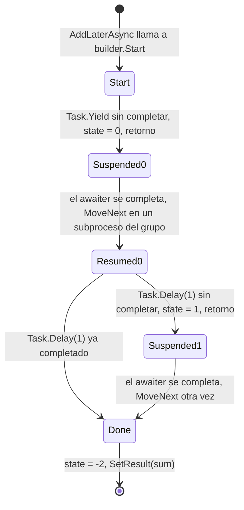
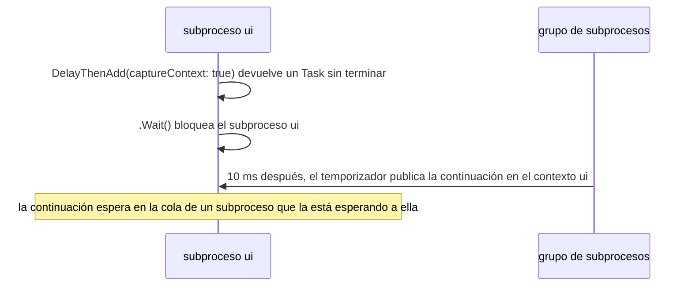

Llevas años escribiendo `async` y `await`, y conoces las reglas prácticas: no bloquear esperando código asíncrono, devolver `ValueTask` en las rutas críticas, añadir `ConfigureAwait(false)` en las bibliotecas. Esta lección abre el método que el compilador genera realmente para `await` y luego comprueba cada regla con un programa: qué asigna una llamada, en qué subproceso se ejecuta el código después de `await`, qué excepción capturas y adónde va una cancelación. Dos piezas de código de Guitar Alchemist sirven de casos de estudio: un helper `Try` que provoca un interbloqueo bajo un contexto de sincronización y se traga la cancelación, y una caché que mantiene dormido un subproceso del grupo de subprocesos por cada valor.

Los enlaces a GA apuntan al commit [`a826864`](https://github.com/GuitarAlchemist/ga/tree/a826864f3a012cad88e415954bf57eca0ce12aa6); los enlaces al runtime apuntan al commit [`4271d88`](https://github.com/dotnet/runtime/tree/4271d88e0aebf3d04f188f1334c2220d80555ef6) de `dotnet/runtime`, etiquetado `v10.0.12`.

## Ejecutar el programa de la lección

```bash
bash code/csharp-advanced/check.sh                                   # todas las lecciones, comparadas con expected/
dotnet run --project code/csharp-advanced/Advanced -c Release -- l3  # solo esta lección, después de check.sh
```

El código está en [`Advanced/Lesson3.cs`](https://github.com/spareilleux/learn/blob/8ba378e7ea22a64a57b3e45b45afa4c85afa85a3/code/csharp-advanced/Advanced/Lesson3.cs), y el método descompilado más abajo está en [`Snippets/Async.cs`](https://github.com/spareilleux/learn/blob/8ba378e7ea22a64a57b3e45b45afa4c85afa85a3/code/csharp-advanced/Snippets/Async.cs). La única línea que empieza por `# ` depende del número de procesadores; la lección la cita tal como salió en la máquina del autor, un Intel Core Ultra 9 285K con 24 núcleos, y en los runners de la CI.

## Qué hace el compilador con `await`

Aquí tienes un pequeño método asíncrono con dos `await` y una variable local que vive entre ambos:

```csharp
public static async Task<int> AddLaterAsync(int left, int right)
{
    await Task.Yield();
    var sum = left + right;
    await Task.Delay(1);
    return sum;
}
```

No hay ningún `async` en el IL. El compilador convierte el cuerpo del método en una *máquina de estados*: un tipo que implementa [`IAsyncStateMachine`](https://learn.microsoft.com/dotnet/api/system.runtime.compilerservices.iasyncstatemachine), cuyo método `MoveNext` ejecuta el cuerpo hasta el siguiente `await` que aún no ha terminado, anota dónde se detuvo y retorna. `check.sh` descompila la compilación Release con [`ilspycmd`](https://github.com/icsharpcode/ILSpy/tree/master/ICSharpCode.ILSpyCmd) en el nivel de lenguaje C# 4, anterior a la existencia de `async`, para que ILSpy no pueda reconstruir los `await` ([`expected/l3-state-machine.txt`](https://github.com/spareilleux/learn/blob/8ba378e7ea22a64a57b3e45b45afa4c85afa85a3/code/csharp-advanced/expected/l3-state-machine.txt)). El propio método se ha convertido en un stub que crea la máquina de estados y la inicia:

```csharp
[AsyncStateMachine(typeof(<AddLaterAsync>d__0))]
public static Task<int> AddLaterAsync(int left, int right)
{
	<AddLaterAsync>d__0 stateMachine = default(<AddLaterAsync>d__0);
	stateMachine.<>t__builder = AsyncTaskMethodBuilder<int>.Create();
	stateMachine.left = left;
	stateMachine.right = right;
	stateMachine.<>1__state = -1;
	stateMachine.<>t__builder.Start(ref stateMachine);
	return stateMachine.<>t__builder.Task;
}
```

Los parámetros y la variable local `sum` se han convertido en campos, porque deben sobrevivir entre dos llamadas a `MoveNext`. El campo de estado, `<>1__state`, indica dónde reanudar: -1 al principio, 0 después del primer `await`, 1 después del segundo, -2 al terminar. [`AsyncTaskMethodBuilder<int>`](https://learn.microsoft.com/dotnet/api/system.runtime.compilerservices.asynctaskmethodbuilder-1) crea y completa el `Task<int>` que recibe el llamador. Y `MoveNext` contiene el cuerpo, cortado en cada `await`:

```csharp
private void MoveNext()
{
	int num = <>1__state;
	int result;
	try
	{
		TaskAwaiter awaiter;
		YieldAwaitable.YieldAwaiter awaiter2;
		if (num != 0)
		{
			if (num == 1)
			{
				awaiter = <>u__2;
				<>u__2 = default(TaskAwaiter);
				num = (<>1__state = -1);
				goto IL_00d5;
			}
			awaiter2 = Task.Yield().GetAwaiter();
			if (!awaiter2.IsCompleted)
			{
				num = (<>1__state = 0);
				<>u__1 = awaiter2;
				<>t__builder.AwaitUnsafeOnCompleted(ref awaiter2, ref this);
				return;
			}
		}
		else
		{
			awaiter2 = <>u__1;
			<>u__1 = default(YieldAwaitable.YieldAwaiter);
			num = (<>1__state = -1);
		}
		awaiter2.GetResult();
		<sum>5__2 = left + right;
		awaiter = Task.Delay(1).GetAwaiter();
		if (!awaiter.IsCompleted)
		{
			num = (<>1__state = 1);
			<>u__2 = awaiter;
			<>t__builder.AwaitUnsafeOnCompleted(ref awaiter, ref this);
			return;
		}
		goto IL_00d5;
		IL_00d5:
		awaiter.GetResult();
		result = <sum>5__2;
	}
	catch (Exception exception)
	{
		<>1__state = -2;
		<>t__builder.SetException(exception);
		return;
	}
	<>1__state = -2;
	<>t__builder.SetResult(result);
}
```

Cada `await x` sigue el mismo patrón: obtiene un *awaiter* con `x.GetAwaiter()` y comprueba `IsCompleted`. Si la operación ya ha terminado, el código continúa sin salir de `MoveNext`: es la ruta rápida, y no cuesta más que una llamada a un método. Si no, guarda el estado y el awaiter en campos, pide al builder que vuelva a llamar a `MoveNext` cuando el awaiter se complete, y retorna a su llamador, que recibe un `Task` aún sin terminar. `GetResult()` devuelve el valor o vuelve a lanzar la excepción de la operación esperada. Una excepción en cualquier punto del cuerpo va a `SetException`, que pone la tarea en estado de error en lugar de propagarse por la pila.



El programa lee el mismo tipo mediante reflexión ([`Lesson3.cs#L68-L79`](https://github.com/spareilleux/learn/blob/8ba378e7ea22a64a57b3e45b45afa4c85afa85a3/code/csharp-advanced/Advanced/Lesson3.cs#L68-L79)):

```text
== The state machine behind AsyncMachine.AddLaterAsync (reflection)
[AsyncStateMachine(typeof(<AddLaterAsync>d__0))], a struct implementing IAsyncStateMachine
  public  Int32                          <>1__state
  public  AsyncTaskMethodBuilder<Int32>  <>t__builder
  public  Int32                          left
  public  Int32                          right
  private Int32                          <sum>5__2
  private YieldAwaitable.YieldAwaiter    <>u__1
  private TaskAwaiter                    <>u__2
AddLaterAsync(2, 3).Result = 5
```

En Release, la máquina de estados es un struct: vive en la pila del llamador mientras el método se ejecuta de forma síncrona, y no cuesta nada si ningún `await` tiene que esperar. La primera vez que uno espera, el builder la copia en un objeto del montón, un `AsyncStateMachineBox<TStateMachine>` que es también el `Task` devuelto al llamador ([`AsyncTaskMethodBuilderT.cs#L215-L228`](https://github.com/dotnet/runtime/blob/4271d88e0aebf3d04f188f1334c2220d80555ef6/src/libraries/System.Private.CoreLib/src/System/Runtime/CompilerServices/AsyncTaskMethodBuilderT.cs#L215-L228)). En Debug, el compilador genera en cambio una clase, para que el depurador y Editar y continuar puedan trabajar con ella; `check.sh` descompila también la compilación Debug del mismo método:

```text
		private sealed class <AddLaterAsync>d__0 : IAsyncStateMachine
```

La mecánica se describe en la [especificación del lenguaje C# sobre las funciones asíncronas](https://learn.microsoft.com/dotnet/csharp/language-reference/language-specification/classes#1514-async-functions) y, con mucha más profundidad, en el artículo de Stephen Toub [How async/await really works in C#](https://devblogs.microsoft.com/dotnet/how-async-await-really-works/).

### Lo que la máquina de estados impide

Como las variables locales se convierten en campos de un tipo que puede acabar en el montón, algunas cosas que puedes escribir en un método síncrono no compilan en uno asíncrono. Cada fragmento de abajo lo compila [`CompileFail/Program.cs`](https://github.com/spareilleux/learn/blob/8ba378e7ea22a64a57b3e45b45afa4c85afa85a3/code/csharp-advanced/CompileFail/Program.cs), como en la lección 1. Un parámetro `ref`, `in` u `out` se convertiría en un campo que guarda una referencia a la pila del llamador:

```csharp
public static async Task NextAsync(ref int fret)
{
    await Task.Yield();
    fret++;
}
```

```text
l3_ref_parameter.cs(4,48): error CS1988: Async methods cannot have ref, in or out parameters
```

Un `Span<T>` no puede ser un campo de un tipo ordinario (lección 1). Desde C# 13, un método asíncrono puede declarar una variable local de tipo span, siempre que no la use después de un `await`. Este la usa, tres veces:

```csharp
public static async Task<int> SumAsync(int[] frets)
{
    Span<int> window = frets.AsSpan(0, 3);
    await Task.Yield();
    return window[0] + window[1] + window[2]; // el span sobreviviría al marco de pila
}
```

```text
l3_span_across_await.cs(8,16): error CS4007: Instance of type 'System.Span<int>' cannot be preserved across 'await' or 'yield' boundary.
l3_span_across_await.cs(8,28): error CS4007: Instance of type 'System.Span<int>' cannot be preserved across 'await' or 'yield' boundary.
l3_span_across_await.cs(8,40): error CS4007: Instance of type 'System.Span<int>' cannot be preserved across 'await' or 'yield' boundary.
```

Este error se notifica tarde, cuando el compilador reescribe el método como máquina de estados: un comprobador que se detiene en `GetDiagnostics()` no lo ve, y por eso `CompileFail` emite cada fragmento. Por último, un `lock` pertenece a un subproceso, y el código posterior a un `await` puede ejecutarse en otro:

```csharp
public async Task TuneAsync()
{
    lock (_gate)
    {
        await Task.Delay(10); // la continuación puede ejecutarse en otro subproceso
    }
}
```

```text
l3_await_in_lock.cs(10,13): error CS1996: Cannot await in the body of a lock statement
```

Para mantener un bloqueo a través de un `await`, usa [`SemaphoreSlim.WaitAsync`](https://learn.microsoft.com/dotnet/api/system.threading.semaphoreslim.waitasync), que no está ligado a ningún subproceso.

## `Task` o `ValueTask`: lo que cuesta completarse de forma síncrona

Cuando un método asíncrono termina sin esperar, el builder aún tiene que devolver un `Task<int>` terminado. [`SetResult`](https://github.com/dotnet/runtime/blob/4271d88e0aebf3d04f188f1334c2220d80555ef6/src/libraries/System.Private.CoreLib/src/System/Runtime/CompilerServices/AsyncTaskMethodBuilderT.cs#L467-L480) llama a `Task.FromResult`, que devuelve una tarea en caché para `null`, `true`, `false` y los enteros de -1 a 8 ([`Task.cs#L5386-L5416`](https://github.com/dotnet/runtime/blob/4271d88e0aebf3d04f188f1334c2220d80555ef6/src/libraries/System.Private.CoreLib/src/System/Threading/Tasks/Task.cs#L5386-L5416), [`TaskCache.cs#L18-L21`](https://github.com/dotnet/runtime/blob/4271d88e0aebf3d04f188f1334c2220d80555ef6/src/libraries/System.Private.CoreLib/src/System/Threading/Tasks/TaskCache.cs#L18-L21)), y asigna una nueva para cualquier otro valor. Un [`ValueTask<int>`](https://learn.microsoft.com/dotnet/api/system.threading.tasks.valuetask-1) es un struct que contiene o bien el resultado o bien un `Task`, así que un resultado síncrono no necesita ninguna asignación. El programa mide una llamada de cada tipo, con `await Task.CompletedTask` como único `await` ([`Lesson3.cs#L85-L104`](https://github.com/spareilleux/learn/blob/8ba378e7ea22a64a57b3e45b45afa4c85afa85a3/code/csharp-advanced/Advanced/Lesson3.cs#L85-L104)):

```text
== Completing synchronously: bytes allocated by one call
TaskOf(5)                   0  (Task<int> results from -1 to 8 are cached)
TaskOf(500)                72
ValueTaskOf(500)            0
Task.FromResult(true)       0
```

72 bytes es un objeto `Task<int>`. Es poco, pero un método llamado millones de veces, como una búsqueda en caché o una lectura con búfer que suele ser síncrona, lo paga en cada llamada. Cuando el método sí espera, ambos tipos asignan la caja de la máquina de estados, y `ValueTask` no ahorra nada. [`Benchmarks/AsyncBenchmarks.cs`](https://github.com/spareilleux/learn/blob/8ba378e7ea22a64a57b3e45b45afa4c85afa85a3/code/csharp-advanced/Benchmarks/AsyncBenchmarks.cs), con BenchmarkDotNet, mide los cuatro casos:

```bash
cd code/csharp-advanced
dotnet run -c Release --project Benchmarks -- --filter "*AsyncBenchmarks*"
```

En la máquina del autor (BenchmarkDotNet 0.15.8, .NET 10.0.12, Intel Core Ultra 9 285K, Windows 11):

| Method                          | Mean       | Error      | StdDev     | Ratio | RatioSD | Gen0   | Allocated | Alloc Ratio |
|-------------------------------- |-----------:|-----------:|-----------:|------:|--------:|-------:|----------:|------------:|
| TaskCompletedSynchronously      |   8.417 ns |  0.1833 ns |  0.5317 ns |  1.00 |    0.09 | 0.0038 |      72 B |        1.00 |
| ValueTaskCompletedSynchronously |   2.264 ns |  0.0717 ns |  0.1662 ns |  0.27 |    0.03 |      - |         - |        0.00 |
| TaskAfterYield                  | 784.608 ns |  9.1445 ns |  8.5537 ns | 93.60 |    6.27 | 0.0048 |      96 B |        1.33 |
| ValueTaskAfterYield             | 829.301 ns | 12.2729 ns | 11.4801 ns | 98.94 |    6.67 | 0.0048 |     104 B |        1.44 |

- Al completarse de forma síncrona, `ValueTask<int>` no asigna nada y tarda más o menos una cuarta parte del tiempo: el `Task<int>` de 72 bytes y su inicialización desaparecen.
- Después de un `await Task.Yield()` real, ambos asignan la caja, 96 bytes en la versión `Task` y 104 en la versión `ValueTask`, cuya caja es de otro tipo, que implementa `IValueTaskSource` en lugar de derivar de `Task`. Marcar el método con el atributo `[AsyncMethodBuilder(typeof(PoolingAsyncValueTaskMethodBuilder<>))]` hace que reutilice esas cajas desde un pool ([`PoolingAsyncValueTaskMethodBuilder<TResult>`](https://learn.microsoft.com/dotnet/api/system.runtime.compilerservices.poolingasyncvaluetaskmethodbuilder-1)); el curso no lo ha medido, *por verificar*. Ambos tardan unos 800 ns, la mayor parte en encolar la continuación en el grupo de subprocesos y en cambiar de subproceso. `ValueTask` no es más rápido en ese caso, e incluso fue algo más lento en esta ejecución.

Así que `ValueTask` solo compensa donde la ruta síncrona es la habitual.

`ValueTask` tiene un precio en el uso, no en bytes. Un `ValueTask` puede estar respaldado por un [`IValueTaskSource`](https://learn.microsoft.com/dotnet/api/system.threading.tasks.sources.ivaluetasksource-1) de un pool, que se reutiliza en cuanto se ha leído su resultado, así que su [referencia de la API](https://learn.microsoft.com/dotnet/api/system.threading.tasks.valuetask-1#remarks) enumera lo que nunca debes hacer con uno: esperarlo dos veces, llamar dos veces a `AsTask()`, o leer `.Result` o `.GetAwaiter().GetResult()` antes de que la operación haya terminado. Las mismas reglas están en los comentarios del código fuente del tipo ([`ValueTask.cs#L30-L53`](https://github.com/dotnet/runtime/blob/4271d88e0aebf3d04f188f1334c2220d80555ef6/src/libraries/System.Private.CoreLib/src/System/Threading/Tasks/ValueTask.cs#L30-L53)). Devuelve `ValueTask` desde métodos que suelen completarse de forma síncrona y que se esperan directamente; mantén `Task` como opción predeterminada en todos los demás casos ([Understanding the whys, whats, and whens of ValueTask](https://devblogs.microsoft.com/dotnet/understanding-the-whys-whats-and-whens-of-valuetask/)).

## `SynchronizationContext`: dónde se ejecuta el código después de `await`

Cuando un `await` tiene que esperar, el awaiter captura [`SynchronizationContext.Current`](https://learn.microsoft.com/dotnet/api/system.threading.synchronizationcontext.current) y, cuando la operación termina, publica el resto del método en ese contexto. En una aplicación de consola o en ASP.NET Core no hay ninguno, y la continuación se ejecuta en un subproceso del grupo de subprocesos. En WPF, Windows Forms, .NET MAUI o un componente Blazor, el contexto es el del subproceso de la interfaz de usuario: el código posterior a `await` puede volver a tocar la interfaz. [`ConfigureAwait(false)`](https://learn.microsoft.com/dotnet/api/system.threading.tasks.task.configureawait) dice «no lo captures».

El programa del curso no tiene interfaz de usuario, así que construye su propio contexto: [`SingleThreadContext`](https://github.com/spareilleux/learn/blob/8ba378e7ea22a64a57b3e45b45afa4c85afa85a3/code/csharp-advanced/Advanced/Lesson3.cs#L310-L355), un subproceso dedicado llamado `ui` que ejecuta una tras otra las devoluciones de llamada que se le publican, como un bucle de mensajes de una interfaz. `ui.Run` publica una función asíncrona en ese subproceso y espera, desde el subproceso principal, hasta que termina ([`Lesson3.cs#L106-L136`](https://github.com/spareilleux/learn/blob/8ba378e7ea22a64a57b3e45b45afa4c85afa85a3/code/csharp-advanced/Advanced/Lesson3.cs#L106-L136)):

```text
== SynchronizationContext: where the code after await runs
before await:                     on ui True
after await Task.Delay:           on ui True
after ConfigureAwait(false):      on ui False, pool thread True
```

El temporizador que completa `Task.Delay` se dispara en un subproceso del grupo, y aun así la primera continuación volvió al subproceso `ui` a través del contexto capturado. Después de `ConfigureAwait(false)`, se quedó en el subproceso del grupo.

### El interbloqueo clásico

Ahora la función que se ejecuta en el subproceso `ui` *se bloquea* esperando código asíncrono, con `.Wait()` o `.Result`, como hace a veces un controlador de eventos que no puede ser `async`:

```csharp
ui.Run(() =>
{
    var captured = DelayThenAdd(captureContext: true);
    Line($"awaits with the context, .Wait(1 s):         completed {captured.Wait(TimeSpan.FromSeconds(1))}");
    var free = DelayThenAdd(captureContext: false);
    Line($"awaits with ConfigureAwait(false), .Wait(10 s): completed {free.Wait(TimeSpan.FromSeconds(10))}");
    var gaTry = Try.OfAsync(() => DelayThenAdd(captureContext: false));
    Line($"GA Try.OfAsync(...), .Wait(1 s):             completed {gaTry.Wait(TimeSpan.FromSeconds(1))}");
    return Task.CompletedTask;
});

static async Task<int> DelayThenAdd(bool captureContext)
{
    await Task.Delay(10).ConfigureAwait(captureContext);
    return 2 + 3;
}
```

```text
== Blocking on async code from the ui thread
awaits with the context, .Wait(1 s):         completed False
awaits with ConfigureAwait(false), .Wait(10 s): completed True
GA Try.OfAsync(...), .Wait(1 s):             completed False
```



La primera tarea nunca se completa: su continuación está en la cola del subproceso `ui`, que está bloqueado esperando precisamente esa tarea. Sin un tiempo de espera, la aplicación se congelaría. Con `ConfigureAwait(false)`, la continuación se ejecuta en el grupo y la tarea se completa.

La tercera línea es [`Try.OfAsync`](https://github.com/GuitarAlchemist/ga/blob/a826864f3a012cad88e415954bf57eca0ce12aa6/Common/GA.Core/Functional/Try.cs#L62-L73) de GA, que envuelve el resultado o la excepción de una operación en un `Try<T>`:

```csharp
public static async Task<Try<T>> OfAsync<T>(Func<Task<T>> operation)
{
    try
    {
        var result = await operation();
        return Try<T>.Success(result);
    }
    catch (Exception ex)
    {
        return Try<T>.Failure(ex);
    }
}
```

La operación que se le pasa es cuidadosa, y usa `ConfigureAwait(false)`. No sirve de nada: el propio `await` de `OfAsync` captura el contexto, y se interbloquea de la misma manera. `ConfigureAwait(false)` solo protege el `await` en el que está escrito, así que una biblioteca debe ponerlo en *cada* `await`, en todos los niveles. Esa es la regla real que hay detrás del folclore, explicada en la [ConfigureAwait FAQ](https://devblogs.microsoft.com/dotnet/configureawait-faq/): el código de aplicación que necesita su contexto no lo usa; el código de biblioteca de uso general, que no puede saber quién lo llama, sí. Mejor aún, no bloquees nunca esperando código asíncrono.

## Excepciones: `await` vuelve a lanzar una, la tarea las conserva todas

Una tarea puede fallar con varias excepciones cuando combina varias operaciones. [`Task.WhenAll`](https://learn.microsoft.com/dotnet/api/system.threading.tasks.task.whenall) espera a todas y falla con todas sus excepciones; `await` lanza entonces solo la primera, y no una `AggregateException` como hace `.Wait()` ([`Lesson3.cs#L138-L164`](https://github.com/spareilleux/learn/blob/8ba378e7ea22a64a57b3e45b45afa4c85afa85a3/code/csharp-advanced/Advanced/Lesson3.cs#L138-L164)):

```text
== Exceptions: await rethrows the first one, the Task keeps them all
Task.Exception holds 2: first, second; await threw InnerExceptions[0]: True
ConfigureAwaitOptions.SuppressThrowing: no exception
```

El programa ordena los mensajes antes de imprimirlos: el orden de `InnerExceptions` es el orden en que fallaron las tareas, y varía de una ejecución a otra. Cuando necesites todos los fallos, captura la excepción y lee `task.Exception.InnerExceptions`. La segunda línea muestra [`ConfigureAwaitOptions.SuppressThrowing`](https://learn.microsoft.com/dotnet/api/system.threading.tasks.configureawaitoptions), añadido en .NET 8: el `await` espera a que la tarea termine e ignora su resultado, algo útil para esperar a una tarea en segundo plano que estás deteniendo. Solo existe para `Task`, no para `Task<T>`, que no tendría ningún resultado que devolver.

## Cancelación

La cancelación en .NET es cooperativa: un [`CancellationTokenSource`](https://learn.microsoft.com/dotnet/standard/threading/cancellation-in-managed-threads) activa un indicador, y cada operación que recibió su token comprueba el indicador o registra una devolución de llamada. Una operación cancelada lanza [`OperationCanceledException`](https://learn.microsoft.com/dotnet/api/system.operationcanceledexception), o su subclase `TaskCanceledException`, que lleva el token ([`Lesson3.cs#L166-L196`](https://github.com/spareilleux/learn/blob/8ba378e7ea22a64a57b3e45b45afa4c85afa85a3/code/csharp-advanced/Advanced/Lesson3.cs#L166-L196)):

```text
== Cancellation
Task.Delay(10 s, token cancelled after 50 ms): TaskCanceledException, e.CancellationToken == token True
linked token after parent.Cancel(): IsCancellationRequested True
Task.Delay(10 s).WaitAsync(50 ms): TimeoutException
GA Try.OfAsync(cancelled task): IsFailure True, TaskCanceledException, no exception thrown
```

- Comparar `e.CancellationToken` con tu propio token distingue una cancelación que pediste tú de una que vino de otra parte, como el tiempo de espera de un cliente HTTP.
- [`CancellationTokenSource.CreateLinkedTokenSource`](https://learn.microsoft.com/dotnet/api/system.threading.cancellationtokensource.createlinkedtokensource) crea un token que se cancela en cuanto se cancela cualquiera de sus padres: el token de la petición combinado con un tiempo de espera por operación.
- [`WaitAsync`](https://learn.microsoft.com/dotnet/api/system.threading.tasks.task.waitasync) deja de *esperar* cuando vence un tiempo de espera, y lanza `TimeoutException`. No detiene la operación, que sigue ejecutándose sin que nadie la observe: pasa un token a la propia operación cuando acepte uno.

La última línea es de nuevo `Try.OfAsync` de GA. Su `catch (Exception ex)` también captura `OperationCanceledException`, y convierte la cancelación en un fallo ordinario. El llamador que canceló recibe un `Try` en estado de fallo en lugar de una excepción, el código que sigue a la llamada continúa ejecutándose como si hubiera ocurrido un error normal, y un framework como ASP.NET Core, que reconoce una petición cancelada por su `OperationCanceledException`, nunca la ve. El código que captura todas las excepciones debería dejar pasar la cancelación, con `catch (Exception ex) when (ex is not OperationCanceledException)`.

## `IAsyncEnumerable<T>` y `[EnumeratorCancellation]`

Un método `async` que devuelve [`IAsyncEnumerable<T>`](https://learn.microsoft.com/dotnet/csharp/asynchronous-programming/generate-consume-asynchronous-stream) puede usar a la vez `await` y `yield return`, y se consume con `await foreach`. El compilador genera una sola máquina de estados para ambos. El consumidor pasa su token con `WithCancellation(token)`; ese token solo llega al parámetro del iterador si el parámetro está marcado con [`[EnumeratorCancellation]`](https://learn.microsoft.com/dotnet/api/system.runtime.compilerservices.enumeratorcancellationattribute) ([`Lesson3.cs#L198-L231`](https://github.com/spareilleux/learn/blob/8ba378e7ea22a64a57b3e45b45afa4c85afa85a3/code/csharp-advanced/Advanced/Lesson3.cs#L198-L231)):

```csharp
static async IAsyncEnumerable<int> Frets([EnumeratorCancellation] CancellationToken token = default)
{
    for (var fret = 0; fret < 12; fret++)
    {
        await Task.Delay(1, token);
        yield return fret;
    }
}
```

El consumidor cancela después del tercer traste:

```text
== IAsyncEnumerable: the token reaches the iterator through [EnumeratorCancellation]
frets 0 1 2, then TaskCanceledException
```

Sin el atributo, el compilador solo emite una advertencia. El ejercicio 3 muestra lo que significa esa advertencia en tiempo de ejecución.

```text
l3_missing_enumerator_cancellation.cs(4,47): warning CS8425: Async-iterator 'Frets.AllAsync(CancellationToken)' has one or more parameters of type 'CancellationToken' but none of them is decorated with the 'EnumeratorCancellation' attribute, so the cancellation token parameter from the generated 'IAsyncEnumerable<>.GetAsyncEnumerator' will be unconsumed
```

## Tiempo sin subprocesos dormidos: `LazyWithExpiration` de GA

[`LazyWithExpiration<T>`](https://github.com/GuitarAlchemist/ga/blob/a826864f3a012cad88e415954bf57eca0ce12aa6/Common/GA.Core/Utilities/LazyWithExpiration.cs#L20-L40) de GA calcula un valor la primera vez que se usa y lo vuelve a calcular cuando ha caducado. Mide la caducidad iniciando una tarea que duerme:

```csharp
if (!_lazyObject.IsValueCreated)
{
    Task.Factory.StartNew(() =>
    {
        Thread.Sleep(_expirationTime);
        _expired = true;
    });
}
```

[`Task.Factory.StartNew`](https://learn.microsoft.com/dotnet/api/system.threading.tasks.taskfactory.startnew) ejecuta el delegado en el grupo de subprocesos, y `Thread.Sleep` retiene ese subproceso durante todo el tiempo de caducidad, sin hacer nada. El grupo crea subprocesos bajo demanda hasta su mínimo, que por defecto es el número de procesadores, y a partir de ahí solo los añade poco a poco ([El grupo de subprocesos administrado](https://learn.microsoft.com/dotnet/standard/threading/the-managed-thread-pool)). El programa crea 64 valores que caducan al cabo de un segundo, los lee y luego mide cuánto espera un trivial `Task.Run(() => 0)` a que haya un subproceso libre ([`Lesson3.cs#L233-L255`](https://github.com/spareilleux/learn/blob/8ba378e7ea22a64a57b3e45b45afa4c85afa85a3/code/csharp-advanced/Advanced/Lesson3.cs#L233-L255)):

```text
== GA LazyWithExpiration: one sleeping thread-pool thread per expiring value
sum of the 64 values: 2016
# thread pool threads: 3 before, 25 after; a Task.Run(() => 0) took 2016 ms
```

Los dos 2016 son una coincidencia: 0 + 1 + … + 63 = 2016, y la espera duró, por casualidad, 2016 ms. Con 24 núcleos, los subprocesos dormidos acapararon los subprocesos del grupo durante unos dos segundos antes de que el elemento de trabajo, que no tenía nada que ver, consiguiera uno. En los runners de la CI, con 3 o 4 núcleos, el mismo `Task.Run` esperó 11 001 ms en Linux, 9878 ms en Windows y 11 722 ms en macOS. En un servidor web, eso significa todas las peticiones paralizadas: *inanición del grupo de subprocesos* (thread-pool starvation), causada aquí por una caché.

Esperar a que pase el tiempo requiere un temporizador, no un subproceso; y una caché que solo necesita saber si un valor es antiguo ni siquiera necesita un temporizador. Puede comparar marcas de tiempo cuando se lee el valor. [`TimeProvider`](https://learn.microsoft.com/dotnet/standard/datetime/timeprovider-overview), añadido en .NET 8, hace que el reloj sea inyectable, de modo que una prueba puede avanzar el tiempo en lugar de dormir. [`ExpiringLazy<T>`](https://github.com/spareilleux/learn/blob/8ba378e7ea22a64a57b3e45b45afa4c85afa85a3/code/csharp-advanced/Advanced/Lesson3.cs#L277-L308), del curso, hace eso, con un `ManualClock` para la prueba (el paquete [`Microsoft.Extensions.TimeProvider.Testing`](https://www.nuget.org/packages/Microsoft.Extensions.TimeProvider.Testing) proporciona un `FakeTimeProvider` completo):

```csharp
public sealed class ExpiringLazy<T>(Func<T> create, TimeSpan expiration, TimeProvider clock)
{
    private readonly Lock _lock = new();
    private (T Value, DateTimeOffset CreatedAt)? _entry;

    public T Value
    {
        get
        {
            lock (_lock)
            {
                var now = clock.GetUtcNow();
                if (_entry is not { } entry || now - entry.CreatedAt >= expiration)
                {
                    entry = (create(), now);
                    _entry = entry;
                }
                return entry.Value;
            }
        }
    }
}
```

```text
== An expiring cache without a sleeping thread: TimeProvider
t=0:     Value 1
t=4 min: Value 1
t=6 min: Value 2
```

El valor se calcula una vez, se conserva a los 4 minutos y se vuelve a calcular a los 6 minutos, en una prueba que no tarda nada. El bloqueo es un [`System.Threading.Lock`](https://learn.microsoft.com/dotnet/api/system.threading.lock), que `lock` usa directamente desde C# 13; la lección 6 vuelve sobre ello.

## Ejercicios

1. `ThreeDelaysAsync` espera `Task.Delay(1)` tres veces seguidas. ¿Cuántos campos de awaiter tiene su máquina de estados? Haz tu predicción y luego compruébala con reflexión o con `ilspycmd`.
2. Corrige `Try.OfAsync` de GA para que no provoque un interbloqueo cuando se llama y se bloquea esperándolo desde el subproceso `ui`, y para que deje propagarse la cancelación. Comprueba ambas cosas con el `SingleThreadContext` del programa y una tarea cancelada.
3. Quita `[EnumeratorCancellation]` de `Frets`, mantén `WithCancellation(cts.Token)` y la cancelación después del tercer traste, y vuelve a ejecutar el bucle. ¿Qué ocurre y por qué?

<details>
<summary>Soluciones</summary>

1. Uno. El compilador necesita un campo por cada *tipo* de awaiter cuyo valor deba sobrevivir a una suspensión, no uno por cada `await`: los tres `await` guardan el mismo tipo de `TaskAwaiter` en el mismo campo, y cada uno lo vacía después de usarlo para que la tarea pueda recolectarse ([`Lesson3.cs#L25-L30`](https://github.com/spareilleux/learn/blob/8ba378e7ea22a64a57b3e45b45afa4c85afa85a3/code/csharp-advanced/Advanced/Lesson3.cs#L25-L30)). `AddLaterAsync` tenía dos campos porque esperaba dos tipos de awaiter distintos.

    ```text
    1. ThreeDelaysAsync: 1 awaiter field (TaskAwaiter <>u__1), result 3
    ```

2. Añade `ConfigureAwait(false)` al `await`, y excluye `OperationCanceledException` del `catch` con un filtro de excepciones ([`Lesson3.cs#L260-L275`](https://github.com/spareilleux/learn/blob/8ba378e7ea22a64a57b3e45b45afa4c85afa85a3/code/csharp-advanced/Advanced/Lesson3.cs#L260-L275)):

    ```csharp
    public static async Task<Try<T>> OfAsync<T>(Func<Task<T>> operation)
    {
        try
        {
            var result = await operation().ConfigureAwait(false);
            return Try<T>.Success(result);
        }
        catch (Exception ex) when (ex is not OperationCanceledException)
        {
            return Try<T>.Failure(ex);
        }
    }
    ```

    ```text
    2. TryFixed.OfAsync(...) on the ui thread, .Wait(10 s): completed True
       TryFixed.OfAsync(cancelled task): TaskCanceledException, e.CancellationToken == token True
    ```

    La versión corregida se completa en el subproceso `ui`, y la cancelación llega al llamador con su propio token.

3. El bucle llega hasta el final, trastes 0 a 11, y termina normalmente. `WithCancellation` pasa el token a `GetAsyncEnumerator`; sin el atributo, el enumerador generado no tiene dónde ponerlo, y el parámetro `token` del iterador conserva su valor predeterminado, `CancellationToken.None`. Cancelar no hace nada, que es exactamente lo que dice la advertencia CS8425. Como el programa desactiva esa advertencia a propósito ([`Lesson3.cs#L56-L66`](https://github.com/spareilleux/learn/blob/8ba378e7ea22a64a57b3e45b45afa4c85afa85a3/code/csharp-advanced/Advanced/Lesson3.cs#L56-L66)), nada más te avisa.

    ```text
    3. without [EnumeratorCancellation]: frets 0 1 2 3 4 5 6 7 8 9 10 11, then completed
    ```

</details>

## Puntos clave

- Un método `async` se compila en un stub y una máquina de estados: las variables locales se convierten en campos, cada `await` comprueba `IsCompleted`, y una suspensión guarda el estado, registra `MoveNext` como continuación y retorna.
- En Release la máquina de estados es un struct, que se copia al montón solo en la primera suspensión real. Un método asíncrono que se completa de forma síncrona solo asigna su `Task<T>`, y nada en absoluto para los resultados en caché o con `ValueTask<T>`.
- `ValueTask` ahorra una asignación en las rutas síncronas, y debe esperarse exactamente una vez.
- `await` se reanuda en el `SynchronizationContext` capturado. Bloquear esperando código asíncrono desde un contexto de un solo subproceso provoca un interbloqueo, a menos que *cada* `await` que haya por debajo use `ConfigureAwait(false)`; por eso las bibliotecas lo escriben en todas partes, y las aplicaciones no deberían bloquear nunca.
- `await` vuelve a lanzar la primera excepción; la tarea las conserva todas.
- La cancelación es cooperativa. No captures `OperationCanceledException` junto con las demás excepciones, pasa el token a la operación y no solo a `WaitAsync`, y marca el token de un iterador asíncrono con `[EnumeratorCancellation]`.
- No esperes nunca a que pase el tiempo con `Thread.Sleep` en el grupo de subprocesos: compara marcas de tiempo de un `TimeProvider`, o usa `Task.Delay` o un temporizador.

## Fuentes

- Microsoft Learn: [Programación asíncrona con async y await](https://learn.microsoft.com/dotnet/csharp/asynchronous-programming/), [Funciones asíncronas en la especificación de C#](https://learn.microsoft.com/dotnet/csharp/language-reference/language-specification/classes#1514-async-functions), [Cancelación en subprocesos administrados](https://learn.microsoft.com/dotnet/standard/threading/cancellation-in-managed-threads), [Generar y consumir secuencias asíncronas](https://learn.microsoft.com/dotnet/csharp/asynchronous-programming/generate-consume-asynchronous-stream), [El grupo de subprocesos administrado](https://learn.microsoft.com/dotnet/standard/threading/the-managed-thread-pool), [¿Qué es TimeProvider?](https://learn.microsoft.com/dotnet/standard/datetime/timeprovider-overview).
- El blog de .NET, de Stephen Toub: [How async/await really works in C#](https://devblogs.microsoft.com/dotnet/how-async-await-really-works/), [ConfigureAwait FAQ](https://devblogs.microsoft.com/dotnet/configureawait-faq/), [Understanding the whys, whats, and whens of ValueTask](https://devblogs.microsoft.com/dotnet/understanding-the-whys-whats-and-whens-of-valuetask/).
- dotnet/runtime en `v10.0.12` (commit `4271d88`): [`AsyncTaskMethodBuilderT.cs`](https://github.com/dotnet/runtime/blob/4271d88e0aebf3d04f188f1334c2220d80555ef6/src/libraries/System.Private.CoreLib/src/System/Runtime/CompilerServices/AsyncTaskMethodBuilderT.cs#L215-L228), [`Task.cs`](https://github.com/dotnet/runtime/blob/4271d88e0aebf3d04f188f1334c2220d80555ef6/src/libraries/System.Private.CoreLib/src/System/Threading/Tasks/Task.cs#L5386-L5416), [`TaskCache.cs`](https://github.com/dotnet/runtime/blob/4271d88e0aebf3d04f188f1334c2220d80555ef6/src/libraries/System.Private.CoreLib/src/System/Threading/Tasks/TaskCache.cs#L18-L21), [`ValueTask.cs`](https://github.com/dotnet/runtime/blob/4271d88e0aebf3d04f188f1334c2220d80555ef6/src/libraries/System.Private.CoreLib/src/System/Threading/Tasks/ValueTask.cs#L30-L53).
- Guitar Alchemist en `a826864`: [`Try.cs`](https://github.com/GuitarAlchemist/ga/blob/a826864f3a012cad88e415954bf57eca0ce12aa6/Common/GA.Core/Functional/Try.cs#L62-L73), [`LazyWithExpiration.cs`](https://github.com/GuitarAlchemist/ga/blob/a826864f3a012cad88e415954bf57eca0ce12aa6/Common/GA.Core/Utilities/LazyWithExpiration.cs#L20-L40).
