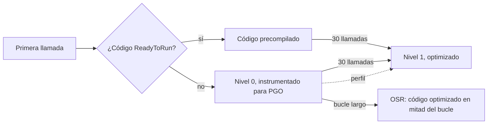

Las tres primeras lecciones medían bytes, que son exactos. Esta lección mide tiempo, que no lo es. Una medición de tiempo depende del procesador, de lo que la máquina esté haciendo además, del nivel del JIT y de detalles del benchmark en los que es fácil equivocarse. La lección empieza por cómo [BenchmarkDotNet](https://benchmarkdotnet.org/) se ocupa de todo eso, y luego pone a prueba cuatro ideas del folclore del rendimiento con código de Guitar Alchemist: «el JIT necesita calentarse», «`SearchValues` gana a un bucle», «`FrozenDictionary` gana a `Dictionary`» y «SIMD gana a un bucle escalar».

Los enlaces a GA apuntan al commit [`a826864`](https://github.com/GuitarAlchemist/ga/tree/a826864f3a012cad88e415954bf57eca0ce12aa6); los enlaces al runtime apuntan al commit [`4271d88`](https://github.com/dotnet/runtime/tree/4271d88e0aebf3d04f188f1334c2220d80555ef6) de `dotnet/runtime`, etiquetado `v10.0.12`.

## Ejecutar el programa de la lección y sus benchmarks

```bash
bash code/csharp-advanced/check.sh                                   # todas las lecciones, comparadas con expected/
dotnet run --project code/csharp-advanced/Advanced -c Release -- l4  # solo esta lección, después de check.sh
cd code/csharp-advanced
dotnet run -c Release --project Benchmarks -- --filter "*SearchBenchmarks*"   # una clase de benchmarks
```

[`Advanced/Lesson4.cs`](https://github.com/spareilleux/learn/blob/8ba378e7ea22a64a57b3e45b45afa4c85afa85a3/code/csharp-advanced/Advanced/Lesson4.cs) comprueba que el código que se compara calcula los mismos resultados; la CI compara su salida en tres sistemas operativos. Los tiempos provienen de [`Benchmarks/`](https://github.com/spareilleux/learn/tree/8ba378e7ea22a64a57b3e45b45afa4c85afa85a3/code/csharp-advanced/Benchmarks), ejecutados una clase cada vez en la máquina del autor:

```text
BenchmarkDotNet v0.15.8, Windows 11 (10.0.26200.9445/25H2/2025Update/HudsonValley2)
Intel Core Ultra 9 285K 3.70GHz, 1 CPU, 24 logical and 24 physical cores
.NET SDK 10.0.112
  [Host]     : .NET 10.0.12 (10.0.12, 10.0.1226.42308), X64 RyuJIT x86-64-v3
  DefaultJob : .NET 10.0.12 (10.0.12, 10.0.1226.42308), X64 RyuJIT x86-64-v3
```

La CI ejecuta cada benchmark una vez con `--job Dry`, que comprueba que se ejecutan y no mide nada. Los tiempos nunca se comparan en la CI: los tiempos de un runner compartido varían de una ejecución a otra más que la mayoría de las diferencias de abajo.

## Cómo mide BenchmarkDotNet

Un benchmark es un método público marcado con `[Benchmark]` en una clase pública. `BenchmarkSwitcher` genera un proyecto aparte para cada clase, lo compila en Release y ejecuta cada benchmark en su propio proceso, para que el estado del JIT, el estado del GC y los campos estáticos de un benchmark no se filtren al siguiente ([How it works](https://benchmarkdotnet.org/articles/guides/how-it-works.html)). En ese proceso pasa por varias etapas, que muestra el log. Aquí tienes `VoicingWithSpans` de la lección 2, recortado:

```text
OverheadJitting  1: 1 op, 297100.00 ns, 297.1000 us/op
WorkloadJitting  1: 1 op, 1748700.00 ns, 1.7487 ms/op
WorkloadPilot    1: 16 op, 5800.00 ns, 362.5000 ns/op
WorkloadPilot    2: 32 op, 6600.00 ns, 206.2500 ns/op
...
WorkloadPilot   15: 262144 op, 39632100.00 ns, 151.1845 ns/op
WorkloadPilot   16: 524288 op, 66413500.00 ns, 126.6737 ns/op
WorkloadPilot   17: 1048576 op, 32909200.00 ns, 31.3847 ns/op
WorkloadPilot   18: 2097152 op, 66566700.00 ns, 31.7415 ns/op
...
OverheadActual   1: 16777216 op, 22217200.00 ns, 1.3242 ns/op
...
WorkloadWarmup   1: 16777216 op, 529044400.00 ns, 31.5335 ns/op
...
// BeforeActualRun
WorkloadActual   1: 16777216 op, 745563700.00 ns, 44.4391 ns/op
WorkloadActual   2: 16777216 op, 787768100.00 ns, 46.9546 ns/op
```

- **Jitting** llama al método una vez, para que el tiempo de la compilación JIT no cuente como medición.
- **Pilot** duplica el número de llamadas por iteración hasta que una iteración dura lo suficiente para cronometrarse con precisión: aquí 16 777 216 llamadas, aproximadamente medio segundo.
- **Overhead** ejecuta el mismo bucle alrededor de un método vacío; su tiempo se resta del de la carga de trabajo.
- **Warmup** repite iteraciones hasta que el tiempo por llamada deja de cambiar, y después **Actual** ejecuta las iteraciones que usan las estadísticas: al menos 15, más si varían.

La fase pilot también muestra el JIT en acción. Durante unas 500 000 llamadas, el método tardó unos 150 ns; después, de repente, 31 ns. Nada cambió en el benchmark: el runtime sustituyó el primer código del método, sin optimizar, por código optimizado, como explica la sección siguiente. Un cronómetro alrededor de un bucle de 100 000 llamadas habría medido el código sin optimizar y habría concluido que el método era cinco veces más lento de lo que es.

El final del log muestra otra sorpresa: el calentamiento llegó a 31 ns, y las iteraciones reales midieron entre 41 y 52 ns, para el mismo código. La tabla de la lección 2 da 46 ns. Volver a ejecutar el benchmark con la opción `--affinity` de BenchmarkDotNet, que fija el proceso a un núcleo, dio 32.4 ns con una desviación estándar inferior a 0.5 ns, tanto fijado al primer núcleo (`--affinity 1`) como al último (`--affinity 8388608`). El procesador del autor mezcla núcleos de rendimiento y de eficiencia, y el planificador mueve los subprocesos de unos a otros; no se ha investigado si eso explica las iteraciones más lentas, *por verificar*. La lección práctica se mantiene: cuando el calentamiento y las iteraciones reales no coinciden, o cuando BenchmarkDotNet advierte de una distribución multimodal, vuelve a ejecutarlo antes de creerte la tabla.

Las reglas que se derivan de todo esto ([Good practices](https://benchmarkdotnet.org/articles/guides/good-practices.html)):

- Compila en Release, sin depurador. BenchmarkDotNet rechaza una compilación Debug.
- Devuelve el resultado del trabajo, como hacen todos los benchmarks del curso, para que el JIT no pueda eliminar un cálculo que nadie usa.
- Deja la preparación fuera del método medido: `[GlobalSetup]` se ejecuta una vez antes de las iteraciones, y `[Params]` ejecuta el benchmark para cada valor.
- Ejecuta en una máquina tranquila, una clase de benchmarks cada vez, y lee `Error` y `StdDev` antes de comparar dos medias.

## Compilación por niveles, OSR y PGO dinámica

Cuando se llama a un método por primera vez, el runtime no lo compila con todas las optimizaciones: eso ralentizaría el arranque. Con la [compilación por niveles](https://learn.microsoft.com/dotnet/core/runtime-config/compilation#tiered-compilation), activada por defecto desde .NET Core 3.0:

1. **Nivel 0**: el método se compila rápidamente con pocas optimizaciones, o se usa su código precompilado [ReadyToRun](https://learn.microsoft.com/dotnet/core/deploying/ready-to-run); la mayoría de las bibliotecas de .NET se distribuyen con código ReadyToRun.
2. Después de 30 llamadas, contadas una vez transcurrido un intervalo de 100 ms sin nuevas compilaciones de nivel 0, el método se pone en cola para el **nivel 1**, que lo compila con optimización completa en segundo plano ([`clrconfigvalues.h#L474-L480`](https://github.com/dotnet/runtime/blob/4271d88e0aebf3d04f188f1334c2220d80555ef6/src/coreclr/inc/clrconfigvalues.h#L474-L480)). Las llamadas posteriores usan el código nuevo.
3. Un método al que se llama una sola vez pero que ejecuta un bucle durante mucho tiempo, como `Main`, se quedaría atascado en el nivel 0. El **reemplazo en pila** (OSR, on-stack replacement) lo cambia a código optimizado en mitad del bucle.
4. Con la **PGO dinámica** (optimización guiada por perfiles), activada por defecto desde .NET 8 ([`clrconfigvalues.h#L520`](https://github.com/dotnet/runtime/blob/4271d88e0aebf3d04f188f1334c2220d80555ef6/src/coreclr/inc/clrconfigvalues.h#L520)), el código de nivel 0 también cuenta qué ramas se toman y qué tipos recibe realmente una llamada a una interfaz. El nivel 1 usa ese perfil: por ejemplo, cuando una llamada sobre `IEnumerable<int>` recibe siempre un `List<int>`, comprueba si se trata de un `List<int>` y llama directamente a sus métodos, que así pueden insertarse en línea (*desvirtualización protegida*).



Cada paso puede desactivarse con una variable de entorno ([opciones de compilación](https://learn.microsoft.com/dotnet/core/runtime-config/compilation)). [`Benchmarks/JitBenchmarks.cs`](https://github.com/spareilleux/learn/blob/8ba378e7ea22a64a57b3e45b45afa4c85afa85a3/code/csharp-advanced/Benchmarks/JitBenchmarks.cs) ejecuta los mismos dos métodos con cuatro jobs: los valores predeterminados, `DOTNET_TieredPGO=0`, `DOTNET_TieredCompilation=0` (todo se compila con optimización completa en la primera llamada, sin perfil) y `DOTNET_ReadyToRun=0` (se ignora el código precompilado de las bibliotecas, que también pasan por los niveles):

```csharp
private static readonly IEnumerable<int> Values = PitchClassSetId.Items.Select(id => id.Value).ToList();

// Un bucle sobre una interfaz: con PGO, el JIT ve que Values es siempre un List<int> y desvirtualiza las llamadas
[Benchmark]
public long SumThroughInterface()
{
    long sum = 0;
    foreach (var value in Values) sum += value;
    return sum;
}

// La colección de GA con los 4096 conjuntos, recorrida a través de IReadOnlyCollection<PitchClassSetId>
[Benchmark]
public int CardinalityOfEverySet()
{
    var notes = 0;
    foreach (var id in PitchClassSetId.Items) notes += id.Cardinality;
    return notes;
}
```

| Method                | Job          | EnvironmentVariables       | Mean      | Error     | StdDev    | Ratio | RatioSD | Allocated | Alloc Ratio |
|---------------------- |------------- |--------------------------- |----------:|----------:|----------:|------:|--------:|----------:|------------:|
| SumThroughInterface   | Default      | Empty                      |  1.219 μs | 0.0100 μs | 0.0094 μs |  1.00 |    0.01 |         - |          NA |
| SumThroughInterface   | NoPGO        | DOTNET_TieredPGO=0         | 11.341 μs | 0.0594 μs | 0.0556 μs |  9.30 |    0.08 |      40 B |          NA |
| SumThroughInterface   | NoReadyToRun | DOTNET_ReadyToRun=0        |  1.212 μs | 0.0064 μs | 0.0059 μs |  0.99 |    0.01 |         - |          NA |
| SumThroughInterface   | NoTiering    | DOTNET_TieredCompilation=0 | 11.305 μs | 0.0890 μs | 0.0833 μs |  9.27 |    0.10 |      40 B |          NA |
|                       |              |                            |           |           |           |       |         |           |             |
| CardinalityOfEverySet | Default      | Empty                      |  2.656 μs | 0.0306 μs | 0.0286 μs |  1.00 |    0.01 |      40 B |        1.00 |
| CardinalityOfEverySet | NoPGO        | DOTNET_TieredPGO=0         | 11.353 μs | 0.0778 μs | 0.0728 μs |  4.28 |    0.05 |      40 B |        1.00 |
| CardinalityOfEverySet | NoReadyToRun | DOTNET_ReadyToRun=0        |  2.672 μs | 0.0418 μs | 0.0391 μs |  1.01 |    0.02 |      40 B |        1.00 |
| CardinalityOfEverySet | NoTiering    | DOTNET_TieredCompilation=0 | 11.303 μs | 0.0717 μs | 0.0636 μs |  4.26 |    0.05 |      40 B |        1.00 |

Los dos métodos se comportan de forma distinta, y ambos resultados merecen una lectura atenta.

- `SumThroughInterface` es **9 veces más rápido con PGO**, y no asigna nada. Sin el perfil (`NoPGO`), o sin niveles en absoluto (`NoTiering`, donde nunca se instrumenta nada), cada `MoveNext()` y cada `Current` es una llamada a una interfaz, y `GetEnumerator()` encapsula (boxing) el struct `List<int>.Enumerator`: 40 bytes. Con el perfil, el JIT sabe que `Values` es siempre un `List<int>`: añade una comprobación de tipo, llama directamente a los métodos del enumerador struct y los inserta en línea, y como el enumerador ya no escapa, no lo encapsula. Esa combinación de desvirtualización protegida y análisis de escape es una de las mejoras de .NET 10 descritas en [Performance Improvements in .NET 10](https://devblogs.microsoft.com/dotnet/performance-improvements-in-net-10/).
- `CardinalityOfEverySet`, sobre `PitchClassSetId.Items` de GA, es 4 veces más rápido con PGO pero **sigue asignando 40 bytes**. Su colección es el `<>z__ReadOnlyList<PitchClassSetId>` generado por el compilador que vimos en la lección 1, y PGO no elimina la asignación de su enumerador; por qué exactamente, no lo he investigado, *por verificar*.
- `DOTNET_TieredCompilation=0` no es más rápido que los valores predeterminados, y aquí es mucho más lento: el código compilado una sola vez, con optimización completa pero sin perfil, pierde lo que aporta PGO. Desactivar los niveles para «saltarse el calentamiento» sacrifica el arranque y la PGO a cambio de nada en régimen estable.
- `DOTNET_ReadyToRun=0` no cambia nada medible una vez que el código ha llegado al nivel 1; ReadyToRun importa para el arranque, que este benchmark no mide.

## `SearchValues<T>`: buscar cualquiera de varios valores

Encontrar la primera alteración en un símbolo de acorde es un bucle sobre caracteres. [`SearchValues<T>`](https://learn.microsoft.com/dotnet/api/system.buffers.searchvalues-1), añadido en .NET 8, precalcula una vez un conjunto de valores, y `IndexOfAny` usa después la búsqueda más rápida para ese conjunto en el procesador actual ([`Lesson4.cs#L53-L83`](https://github.com/spareilleux/learn/blob/8ba378e7ea22a64a57b3e45b45afa4c85afa85a3/code/csharp-advanced/Advanced/Lesson4.cs#L53-L83)):

```csharp
static readonly SearchValues<char> Accidentals = SearchValues.Create("#b");
static readonly SearchValues<string> Qualities = SearchValues.Create(["maj7", "m7b5", "dim7", "sus4"], StringComparison.Ordinal);

public static int IndexOfAccidental(string symbol)
{
    var i = symbol.AsSpan(1).IndexOfAny(Accidentals);
    return i < 0 ? -1 : i + 1;
}
```

```text
== SearchValues: the same answers as a loop
first accidental: -1 -1 -1 -1 -1 3 -1 1 1 1 1 1 -1 2; same as the loop: True
quality found: -1 -1 -1 1 -1 1 1 -1 2 -1 -1 -1 1 -1
```

`SearchValues<T>` es abstracto, y `Create` devuelve una subclase especializada. Cuál depende del procesador, y por eso el programa imprime su nombre en una línea que depende de la máquina:

```text
# SearchValues.Create("#b") is Any2CharPackedSearchValues
# SearchValues.Create(["maj7", ...]) is AsciiStringSearchValuesTeddyNonBucketizedN3`2
```

En x64, dos caracteres ASCII obtienen una implementación *empaquetada* (packed), que reduce los caracteres UTF-16 a bytes para comparar más en cada instrucción; en el runner Arm64 de macOS, la misma llamada devolvió ``Any2SearchValues`2``. Las cuatro cadenas usan *Teddy*, un algoritmo vectorizado de búsqueda de varias subcadenas, en ambos. [`SearchBenchmarks`](https://github.com/spareilleux/learn/blob/8ba378e7ea22a64a57b3e45b45afa4c85afa85a3/code/csharp-advanced/Benchmarks/LookupBenchmarks.cs) busca en los 14 símbolos de acorde, y en una hoja de acordes de 400 compases, 9606 caracteres, cuya única alteración está cerca del final:

| Method                  | Mean        | Error     | StdDev     | Ratio  | RatioSD | Allocated | Alloc Ratio |
|------------------------ |------------:|----------:|-----------:|-------:|--------:|----------:|------------:|
| SymbolsLoop             |    16.51 ns |  0.352 ns |   0.711 ns |   1.00 |    0.06 |         - |          NA |
| SymbolsSearchValues     |    28.53 ns |  0.587 ns |   1.576 ns |   1.73 |    0.12 |         - |          NA |
| ChartLoop               | 2,298.83 ns | 45.726 ns | 115.556 ns | 139.53 |    9.25 |         - |          NA |
| ChartSearchValues       |   162.38 ns |  7.412 ns |  21.853 ns |   9.86 |    1.39 |         - |          NA |
| ChartIndexOfAnyTwoChars |   166.70 ns |  4.382 ns |  12.853 ns |  10.12 |    0.89 |         - |          NA |

En los símbolos de acorde, de 1 a 6 caracteres, gana el bucle: `SearchValues` es **1.7 veces más lento**. Cada llamada a `IndexOfAny` tiene que comprobar la longitud y elegir una ruta antes de mirar un solo carácter, y eso cuesta más que mirar tres o cuatro caracteres. En la hoja de acordes, el bucle es 14 veces más lento que `SearchValues`, 2.3 µs frente a 162 ns, porque la búsqueda vectorizada compara muchos caracteres en cada instrucción. Y `IndexOfAny('#', 'b')` lo hace igual de bien que `SearchValues` en ese caso (ejercicio 3). `SearchValues` es para entradas largas, o para conjuntos de valores que las sobrecargas simples no cubren.

## `FrozenDictionary`: qué implementación obtienes

[`FrozenDictionary<TKey, TValue>`](https://learn.microsoft.com/dotnet/api/system.collections.frozen.frozendictionary-2), añadido en .NET 8, es un diccionario de solo lectura que dedica más tiempo a su creación para ser más rápido en la lectura. `ToFrozenDictionary()` examina las claves y elige una implementación ([`FrozenDictionary.cs#L157-L280`](https://github.com/dotnet/runtime/blob/4271d88e0aebf3d04f188f1334c2220d80555ef6/src/libraries/System.Collections.Immutable/src/System/Collections/Frozen/FrozenDictionary.cs#L157-L280)). El programa imprime el tipo que obtiene para varios conjuntos de claves, dos de ellos de GA ([`Lesson4.cs#L85-L111`](https://github.com/spareilleux/learn/blob/8ba378e7ea22a64a57b3e45b45afa4c85afa85a3/code/csharp-advanced/Advanced/Lesson4.cs#L85-L111)):

```text
== FrozenDictionary: which implementation ToFrozenDictionary() picks
10 chord suffixes (string keys)              LengthBucketsFrozenDictionary`1
same, StringComparer.OrdinalIgnoreCase       LengthBucketsFrozenDictionary`1
12 pitch classes (int keys)                  WithFullValues`3
12 PitchClass keys (record struct)           ValueTypeDefaultComparerFrozenDictionary`2
GA: 144 (int, int) keys, PitchClass -        ValueTypeDefaultComparerFrozenDictionary`2
GA: ProgrammaticForteCatalog.ForteByPrimeFormId ValueTypeDefaultComparerFrozenDictionary`2 (224 keys)
lookups agree with the Dictionary: True
```

- Las **claves de cadena** con pocas longitudes distintas van a *cubos por longitud* (length buckets): una búsqueda comprueba primero la longitud de la clave y luego la compara con, como mucho, cinco claves de esa longitud ([`LengthBuckets.cs#L13`](https://github.com/dotnet/runtime/blob/4271d88e0aebf3d04f188f1334c2220d80555ef6/src/libraries/System.Collections.Immutable/src/System/Collections/Frozen/String/LengthBuckets.cs#L13)). Las demás claves de cadena se analizan para encontrar la subcadena más corta que las distingue, y solo se calcula el hash de esa subcadena.
- Las **claves enteras** de un rango denso, aquí de 0 a 11, no necesitan ningún hash: `DenseIntegralFrozenDictionary`, de .NET 10, guarda los valores en un array indexado por la clave, siempre que el rango no supere diez veces el número de claves ([`DenseIntegralFrozenDictionary.cs#L27`](https://github.com/dotnet/runtime/blob/4271d88e0aebf3d04f188f1334c2220d80555ef6/src/libraries/System.Collections.Immutable/src/System/Collections/Frozen/Integer/DenseIntegralFrozenDictionary.cs#L27)). `WithFullValues` es su clase anidada para un rango sin huecos.
- Los **demás tipos de valor**, como el record struct `PitchClass` de GA o una tupla, obtienen una tabla hash general que llama directamente a `EqualityComparer<TKey>.Default`, sin llamada virtual. Hasta 10 claves, se usa en su lugar una búsqueda lineal ([`Constants.cs#L32`](https://github.com/dotnet/runtime/blob/4271d88e0aebf3d04f188f1334c2220d80555ef6/src/libraries/System.Collections.Immutable/src/System/Collections/Frozen/Constants.cs#L32)); 12 clases de altura quedan justo por encima.

[`Benchmarks/LookupBenchmarks.cs`](https://github.com/spareilleux/learn/blob/8ba378e7ea22a64a57b3e45b45afa4c85afa85a3/code/csharp-advanced/Benchmarks/LookupBenchmarks.cs) busca doce sufijos de acorde, dos de ellos ausentes, en un `Dictionary` y en su copia congelada:

| Method                      | Mean     | Error    | StdDev   | Median   | Ratio | RatioSD | Allocated | Alloc Ratio |
|---------------------------- |---------:|---------:|---------:|---------:|------:|--------:|----------:|------------:|
| DictionaryTryGetValue       | 45.45 ns | 0.928 ns | 2.310 ns | 45.94 ns |  1.00 |    0.07 |         - |          NA |
| FrozenDictionaryTryGetValue | 48.86 ns | 1.920 ns | 5.660 ns | 50.79 ns |  1.08 |    0.14 |         - |          NA |

Para estas doce búsquedas, `FrozenDictionary` **no es más rápido**: 48.9 ns frente a 45.5 ns, una diferencia dentro de su propio margen de error. Las claves son cortas, y calcular su hash ya es barato. Las ventajas del diccionario congelado, con claves en las que su análisis evita calcular el hash de cadenas largas o con una tabla grande de solo lectura, no aparecen en una tabla de sufijos de acorde. Mide tus propias claves antes de cambiar.

## La resta de clases de altura de GA: un diccionario para hacer aritmética

[`PitchClass`](https://github.com/GuitarAlchemist/ga/blob/a826864f3a012cad88e415954bf57eca0ce12aa6/Common/GA.Domain.Core/Theory/Atonal/PitchClass.cs#L80-L81) de GA es un número de 0 a 11. Su operador `-` busca la diferencia en un `FrozenDictionary` de los 144 pares posibles, construido una sola vez detrás de un `Lazy` ([`PitchClass.cs#L110-L137`](https://github.com/GuitarAlchemist/ga/blob/a826864f3a012cad88e415954bf57eca0ce12aa6/Common/GA.Domain.Core/Theory/Atonal/PitchClass.cs#L110-L137)):

```csharp
private static readonly Lazy<FrozenDictionary<(int, int), PitchClass>> _lazySubtractionDictionary =
    new(GetSubtractionDictionary);

public static PitchClass NormalizedSubtraction(PitchClass pitchClass1, PitchClass pitchClass2) =>
    _lazySubtractionDictionary.Value[(pitchClass1.Value, pitchClass2.Value)];
```

Cada valor de esa tabla se calcula con `FromValue((pcValue1 - pcValue2 + 12) % 12)`: el diccionario guarda en caché una resta, una suma y un resto. El programa comprueba que la aritmética da los mismos 144 resultados, y que la búsqueda no asigna nada ([`Lesson4.cs#L113-L131`](https://github.com/spareilleux/learn/blob/8ba378e7ea22a64a57b3e45b45afa4c85afa85a3/code/csharp-advanced/Advanced/Lesson4.cs#L113-L131)):

```text
== GA PitchClass subtraction: FrozenDictionary lookup versus arithmetic
144 of 144 pairs agree; E - 1 = T, 1 - E = 2
bytes allocated by one GA subtraction: 0
```

`PitchClassBenchmarks` resta todos los pares de clases de altura, 144 restas por llamada, con el operador de GA, con la aritmética y con el array plano del ejercicio 2:

| Method          | Mean      | Error     | StdDev    | Ratio | RatioSD | Allocated | Alloc Ratio |
|---------------- |----------:|----------:|----------:|------:|--------:|----------:|------------:|
| GaOperatorMinus | 582.72 ns | 12.656 ns | 37.318 ns |  1.00 |    0.09 |         - |          NA |
| Arithmetic      | 134.46 ns |  2.281 ns |  2.134 ns |  0.23 |    0.02 |         - |          NA |
| LookupTable     |  41.51 ns |  0.417 ns |  0.390 ns |  0.07 |    0.00 |         - |          NA |

La búsqueda en el diccionario cuesta unos 4 ns por resta, 583 ns para las 144: lee `Lazy<T>.Value`, construye una clave de tupla, calcula su hash, encuentra el cubo y compara. La aritmética tarda 0.9 ns: una división para el `%` y la comprobación de rango del descriptor de acceso `init` de `PitchClass`. El array plano tarda 0.3 ns: una multiplicación, una suma y una lectura. La caché de GA es 14 veces más lenta que la tabla, y 4 veces más lenta que el cálculo que guarda en caché. No asigna nada, así que un perfilador de memoria nunca la señalaría.

## SIMD: `Vector<T>` y `TensorPrimitives`

GA compara voicings mediante el producto escalar de sus embeddings, vectores de `double`. Su [`SimdOps.Dot`](https://github.com/GuitarAlchemist/ga/blob/a826864f3a012cad88e415954bf57eca0ce12aa6/Common/GA.Core/Numerics/SimdOps.cs#L13-L40) usa [`Vector<T>`](https://learn.microsoft.com/dotnet/standard/simd), cuyas operaciones compila el JIT en instrucciones SIMD (single instruction, multiple data: una sola instrucción, varios datos), que procesan varios elementos a la vez:

```csharp
public static double Dot(ReadOnlySpan<double> a, ReadOnlySpan<double> b)
{
    var len = a.Length;
    var vsz = Vector<double>.Count;
    var i = 0;
    var acc = 0.0;

    if (Vector.IsHardwareAccelerated && len >= vsz)
    {
        var vacc = Vector<double>.Zero;
        var last = len - len % vsz;
        for (; i < last; i += vsz)
        {
            var va = new Vector<double>(a.Slice(i, vsz));
            var vb = new Vector<double>(b.Slice(i, vsz));
            vacc += va * vb;
        }

        acc += Vector.Dot(vacc, Vector<double>.One);
    }

    for (; i < len; i++)
    {
        acc += a[i] * b[i];
    }

    return acc;
}
```

`Vector<double>.Count` es el número de `double` que el procesador maneja a la vez: 4 con AVX2 en x64, 2 en Arm64. El bucle multiplica los elementos carril a carril, acumula cada carril por separado y suma los carriles al final; una cola escalar se ocupa de los elementos restantes. [`TensorPrimitives.Dot`](https://learn.microsoft.com/dotnet/api/system.numerics.tensors.tensorprimitives.dot), del paquete [`System.Numerics.Tensors`](https://www.nuget.org/packages/System.Numerics.Tensors), hace el mismo trabajo dentro de la biblioteca. El programa compara los tres sobre 1027 elementos, una longitud que deja una cola ([`Lesson4.cs#L133-L169`](https://github.com/spareilleux/learn/blob/8ba378e7ea22a64a57b3e45b45afa4c85afa85a3/code/csharp-advanced/Advanced/Lesson4.cs#L133-L169)):

```text
== Vectorized dot products: GA SimdOps.Dot, TensorPrimitives.Dot and a scalar loop
small integers: scalar 157.000000, SimdOps 157.000000, TensorPrimitives 157.000000; equal to 1e-9: True
small integers: bit-identical to the scalar loop: True
random doubles: scalar 3.010745, SimdOps 3.010745, TensorPrimitives 3.010745; equal to 1e-9: True
random doubles: bit-identical to the scalar loop: (depends on the vector width)
SimdOps.Dot allocates nothing itself: 0 bytes
```

Los resultados coinciden hasta 1e-9, pero no siempre son idénticos bit a bit. La suma en coma flotante no es asociativa: sumar los elementos en cuatro carriles y luego sumar los carriles redondea de forma distinta que sumarlos uno a uno. Con enteros pequeños, que un `double` representa exactamente, no hay redondeo. El tamaño de la diferencia depende del procesador:

```text
# Vector.IsHardwareAccelerated True, Vector<double>.Count 4, Vector256 True, Vector512 False
# random doubles: SimdOps - scalar = 1.15E-014, TensorPrimitives - scalar = 1.02E-014
```

Esa es la máquina del autor. El runner de Linux informó de `Vector512 True` y de una diferencia de `TensorPrimitives` de 4.88E-015: `TensorPrimitives` usa vectores de 512 bits cuando el procesador los tiene, mientras que `Vector<double>` se quedó en 256 bits. El runner de macOS, en Arm64, informó de `Vector<double>.Count 2` y de 1.29E-014. Una prueba que compara un resultado en coma flotante con un valor almacenado debe usar una tolerancia.

[`DotBenchmarks`](https://github.com/spareilleux/learn/blob/8ba378e7ea22a64a57b3e45b45afa4c85afa85a3/code/csharp-advanced/Benchmarks/VectorBenchmarks.cs) ejecuta los tres sobre 16 y 1024 elementos:

| Method              | Length | Mean       | Error     | StdDev    | Ratio | RatioSD |
|-------------------- |------- |-----------:|----------:|----------:|------:|--------:|
| **Scalar**              | **16**     |   **4.688 ns** | **0.0540 ns** | **0.0479 ns** |  **1.00** |    **0.01** |
| GaSimdOps           | 16     |   2.768 ns | 0.1335 ns | 0.3936 ns |  0.59 |    0.08 |
| TensorPrimitivesDot | 16     |   2.906 ns | 0.0970 ns | 0.2859 ns |  0.62 |    0.06 |
|                     |        |            |           |           |       |         |
| **Scalar**              | **1024**   | **431.979 ns** | **8.5494 ns** | **9.1478 ns** |  **1.00** |    **0.03** |
| GaSimdOps           | 1024   | 132.389 ns | 3.2484 ns | 9.5780 ns |  0.31 |    0.02 |
| TensorPrimitivesDot | 1024   |  96.334 ns | 2.4099 ns | 7.1056 ns |  0.22 |    0.02 |

Sobre 1024 elementos, `SimdOps.Dot` de GA es 3.3 veces más rápido que el bucle escalar, y `TensorPrimitives.Dot`, 4.5 veces. El JIT no vectoriza el bucle escalar por su cuenta: con `double`, reordenar las sumas cambiaría el resultado, así que cada suma espera a la anterior. Sobre 16 elementos, las dos versiones vectorizadas son unas 1.7 veces más rápidas. Para GA, sustituir el cuerpo de `SimdOps.Dot` por una llamada a `TensorPrimitives.Dot` sería más sencillo y más rápido en esta máquina; los tiempos en Arm64 no se han medido, *por verificar*.

## Si conoces Spring y Reactor

Todas las dificultades de esta lección existen en la JVM, y [JMH](https://github.com/openjdk/jmh) responde a ellas con los mismos medios. Su README hace la misma promesa que BenchmarkDotNet: «Do not assume that a nice harness will magically free you from considering benchmarking pitfalls. We only promise to make avoiding them easier, not avoiding them completely.»

| BenchmarkDotNet | JMH |
|---|---|
| un proceso por benchmark | [`@Fork`](https://github.com/openjdk/jmh/blob/master/jmh-samples/src/main/java/org/openjdk/jmh/samples/JMHSample_12_Forking.java), cinco forks de medición por defecto, porque «JVMs are notoriously good at profile-guided optimizations» y dos pruebas en una misma JVM mezclan sus perfiles |
| varias ejecuciones para ver la varianza entre ejecuciones | de nuevo los forks: «JVMs are complex systems, and the non-determinism is inherent for them» |
| iteraciones de calentamiento y luego de medición | `@Warmup` y `@Measurement`: cinco iteraciones de diez segundos cada una, por defecto |
| `[MemoryDiagnoser]`, bytes asignados por operación | `-prof gc`, cuyo `gc.alloc.rate.norm` son los bytes por operación |
| el nivel 0 y luego el nivel 1, con OSR para un bucle ya en marcha | el intérprete, C1 y C2, con el [reemplazo en la pila](https://openjdk.org/groups/hotspot/docs/HotSpotGlossary.html), «converting an interpreted stack frame into a compiled stack frame» |
| el PGO dinámico desvirtualiza una llamada de interfaz | C2, el «highly optimizing bytecode compiler», compila a partir del perfil que recogieron los niveles inferiores |
| `DOTNET_TieredCompilation=0` para ver qué aportaban los niveles | [`-XX:-TieredCompilation`](https://docs.oracle.com/en/java/javase/25/docs/specs/man/java.html), documentado como «By default, this option is enabled», o `-Xint` para el intérprete solo |
| el análisis de escape coloca una caja en la pila | `-XX:+DoEscapeAnalysis`, también activado por defecto, con el reemplazo escalar |
| `SearchValues<T>`, `FrozenDictionary` | ninguna API equivalente: `Map.of` es inmutable pero no se reoptimiza para la búsqueda, y `String.indexOf` es una intrínseca |
| `Vector<T>`, y `TensorPrimitives` por encima | la API Vector, en su duodécima incubación ([JEP 537](https://openjdk.org/jeps/537)), que declara que «will incubate until necessary features of Project Valhalla become available as preview features» |

El lado de la JVM añade dos cosas. El recolector de basura es una fuente más de varianza: `gc.alloc.rate.norm` es casi determinista, mientras que un tiempo medido sobre un montón que se va llenando no lo es — es el argumento de la lección 2, trasladado a un arnés de benchmarks. Y medir un pipeline de Reactor mide tanto sus saltos de planificador como su trabajo: un benchmark que ensambla una cadena y se suscribe una sola vez mide sobre todo el ensamblado, y `StepVerifier.withVirtualTime` quita la espera, no los saltos de hilo.

La última regla de esta lección vale en ambos lados. Un tiempo pertenece a la máquina que lo produjo: JMH y BenchmarkDotNet imprimen el entorno encima de la tabla por esa razón, y ninguno de esos números significa nada en un runner de CI.

## Ejercicios

1. Construye un `FrozenDictionary` a partir de las siete notas naturales, de `"C"` a `"B"`, asociadas a su índice. ¿Qué implementación obtienes, y por qué no cubos por longitud?
2. Sustituye el diccionario de restas de GA por un array plano de 144 valores `PitchClass` indexado por `left * 12 + right`. Compáralo con el operador de GA para cada par, mide sus asignaciones y añádelo a `PitchClassBenchmarks`.
3. En una hoja de acordes de 100 compases seguida de `"F#m7b5"`, compara `IndexOfAny('#', 'b')` con `IndexOfAny(SearchValues)`. ¿Devuelven el mismo índice? Mídelos con un benchmark sobre la hoja de acordes de `SearchBenchmarks`.

<details>
<summary>Soluciones</summary>

1. `OrdinalStringFrozenDictionary_LeftJustifiedSingleChar`. Las siete claves tienen la misma longitud, así que los cubos por longitud pondrían siete claves en un solo cubo, más que el límite de cinco. El análisis de claves descubre entonces que el primer carácter basta para distinguirlas, y el diccionario calcula el hash de ese único carácter en lugar de la cadena entera ([`Lesson4.cs#L27-L31`](https://github.com/spareilleux/learn/blob/8ba378e7ea22a64a57b3e45b45afa4c85afa85a3/code/csharp-advanced/Advanced/Lesson4.cs#L27-L31)).

    ```text
    1. the 7 natural notes: OrdinalStringFrozenDictionary_LeftJustifiedSingleChar`1
    ```

2. La tabla se calcula una vez; una resta es un cálculo de índice y una lectura de array ([`Lesson4.cs#L38-L43`](https://github.com/spareilleux/learn/blob/8ba378e7ea22a64a57b3e45b45afa4c85afa85a3/code/csharp-advanced/Advanced/Lesson4.cs#L38-L43)):

    ```csharp
    static readonly PitchClass[] DifferenceTable =
        [.. Enumerable.Range(0, 144).Select(i => PitchClass.FromValue((i / 12 - i % 12 + 12) % 12))];

    public static PitchClass SubtractWithTable(PitchClass left, PitchClass right) =>
        DifferenceTable[left.Value * 12 + right.Value];
    ```

    ```text
    2. table of 144 PitchClass: agrees with GA True, 0 bytes
    ```

    En `PitchClassBenchmarks`, más arriba, la tabla es la fila `LookupTable`: 41.5 ns para las 144 restas, 14 veces más rápido que el operador de GA.

3. Ambos devuelven 1101, la posición del `#`. Para dos o tres `char`, `IndexOfAny(char, char)` ya tiene rutas vectorizadas; `SearchValues` añade un análisis único del conjunto, y compensa con conjuntos más grandes, o con conjuntos que no encajan en esos casos especiales.

    ```text
    3. IndexOfAny('#', 'b') 1101, IndexOfAny(SearchValues) 1101
    ```

    En `SearchBenchmarks`, más arriba, `ChartIndexOfAnyTwoChars` y `ChartSearchValues` tardan 167 ns y 162 ns sobre la hoja de acordes larga, dentro del margen de error el uno del otro.

</details>

## Puntos clave

- BenchmarkDotNet ejecuta cada benchmark en su propio proceso, encuentra una duración de iteración, resta la sobrecarga, calienta y después mide. Un cronómetro alrededor de un bucle mide el primer nivel del JIT.
- La compilación por niveles y la PGO dinámica explican que el código se acelere a medida que se ejecuta. PGO hizo 9 veces más rápido un bucle sobre una interfaz y eliminó su asignación; desactivar los niveles lo hizo más lento.
- `SearchValues` gana con entradas largas y pierde con las muy cortas; para dos o tres caracteres, `IndexOfAny(char, char)` es igual de rápido.
- `ToFrozenDictionary()` elige una implementación a partir de las claves, y con claves de cadena cortas no fue más rápido que `Dictionary`. Comprueba lo que obtienes, y mide.
- Un diccionario que guarda en caché una aritmética barata es más lento que la propia aritmética: la resta de clases de altura de GA es 4 veces más lenta que calcularla, y 14 veces más lenta que un array plano.
- SIMD aceleró un producto escalar entre 3 y 4.5 veces sobre 1024 elementos, y cambia los últimos bits de los resultados en coma flotante según el ancho del vector. Prefiere `TensorPrimitives` a un bucle `Vector<T>` escrito a mano.
- Asocia cada medición de tiempo a una máquina, lee los márgenes de error y las advertencias, y no compares nunca tiempos en la CI.

## Fuentes

- Microsoft Learn: [Opciones de configuración del runtime para la compilación](https://learn.microsoft.com/dotnet/core/runtime-config/compilation), [Compilación ReadyToRun](https://learn.microsoft.com/dotnet/core/deploying/ready-to-run), [`SearchValues<T>`](https://learn.microsoft.com/dotnet/api/system.buffers.searchvalues-1), [`FrozenDictionary<TKey, TValue>`](https://learn.microsoft.com/dotnet/api/system.collections.frozen.frozendictionary-2), [Uso de tipos numéricos acelerados por SIMD](https://learn.microsoft.com/dotnet/standard/simd), [`TensorPrimitives`](https://learn.microsoft.com/dotnet/api/system.numerics.tensors.tensorprimitives).
- BenchmarkDotNet: [How it works](https://benchmarkdotnet.org/articles/guides/how-it-works.html), [Good practices](https://benchmarkdotnet.org/articles/guides/good-practices.html), [Jobs](https://benchmarkdotnet.org/articles/configs/jobs.html).
- El blog de .NET: Stephen Toub, [Performance Improvements in .NET 10](https://devblogs.microsoft.com/dotnet/performance-improvements-in-net-10/).
- dotnet/runtime en `v10.0.12` (commit `4271d88`): [`clrconfigvalues.h`](https://github.com/dotnet/runtime/blob/4271d88e0aebf3d04f188f1334c2220d80555ef6/src/coreclr/inc/clrconfigvalues.h#L474-L480), [`FrozenDictionary.cs`](https://github.com/dotnet/runtime/blob/4271d88e0aebf3d04f188f1334c2220d80555ef6/src/libraries/System.Collections.Immutable/src/System/Collections/Frozen/FrozenDictionary.cs#L157-L280), [`DenseIntegralFrozenDictionary.cs`](https://github.com/dotnet/runtime/blob/4271d88e0aebf3d04f188f1334c2220d80555ef6/src/libraries/System.Collections.Immutable/src/System/Collections/Frozen/Integer/DenseIntegralFrozenDictionary.cs#L27), [`LengthBuckets.cs`](https://github.com/dotnet/runtime/blob/4271d88e0aebf3d04f188f1334c2220d80555ef6/src/libraries/System.Collections.Immutable/src/System/Collections/Frozen/String/LengthBuckets.cs#L13).
- Guitar Alchemist en `a826864`: [`PitchClass.cs`](https://github.com/GuitarAlchemist/ga/blob/a826864f3a012cad88e415954bf57eca0ce12aa6/Common/GA.Domain.Core/Theory/Atonal/PitchClass.cs#L110-L137), [`SimdOps.cs`](https://github.com/GuitarAlchemist/ga/blob/a826864f3a012cad88e415954bf57eca0ce12aa6/Common/GA.Core/Numerics/SimdOps.cs#L13-L40).
