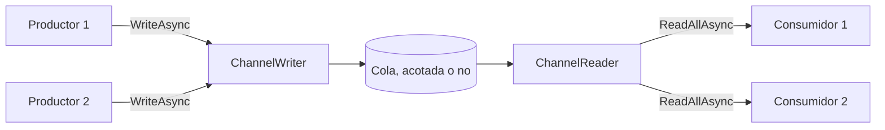

La parte 2 del curso trata de mover datos entre fragmentos de código concurrentes. La lección 3 mostró lo que hace un solo `await`; ahora hay productores y consumidores que se ejecutan al mismo tiempo, a velocidades distintas, y las preguntas cambian. ¿Qué ocurre cuando el productor es más rápido que el consumidor? ¿Quién se entera cuando un lado falla? ¿Qué detiene al otro lado cuando uno de los dos se rinde?

.NET tiene cuatro respuestas, y las cuatro lecciones siguientes las toman de una en una: los canales aquí, TPL Dataflow en la lección 7, Rx.NET en la lección 8, e `IAsyncEnumerable` con una comparación de las cuatro en la lección 9. Un [canal](https://learn.microsoft.com/dotnet/core/extensions/channels) es la más sencilla: una cola segura para subprocesos, con un escritor asíncrono en un extremo y un lector asíncrono en el otro. Si conoces Java, es una `BlockingQueue` cuyos `put` y `take` no bloquean un subproceso. Si conoces Reactor, el [curso de Spring Boot, Spring Cloud y Reactor](../../spring-cloud-reactor/03-reactor-under-the-hood/#backpressure) muestra el mismo problema desde el otro lado, con señales de demanda en lugar de una cola.

Guitar Alchemist usa canales en dos lugares, y ambos son buenos casos de estudio: funcionan cuando todo va bien, y se bloquean o siguen trabajando para nadie cuando algo falla.

Los enlaces a GA apuntan al commit [`a826864`](https://github.com/GuitarAlchemist/ga/tree/a826864f3a012cad88e415954bf57eca0ce12aa6); los enlaces al runtime apuntan al commit [`4271d88`](https://github.com/dotnet/runtime/tree/4271d88e0aebf3d04f188f1334c2220d80555ef6) de `dotnet/runtime`, etiquetado `v10.0.12`.

## Ejecutar el programa de la lección

```bash
bash code/csharp-advanced/check.sh                                   # todas las lecciones, comparadas con expected/
dotnet run --project code/csharp-advanced/Advanced -c Release -- l6  # solo esta lección, después de check.sh
```

El código está en [`Advanced/Lesson6.cs`](https://github.com/spareilleux/learn/blob/b4d713f86711b770a75d7504f334c5871c95f820/code/csharp-advanced/Advanced/Lesson6.cs). Todas las salidas de abajo proceden de [`expected/l6.txt`](https://github.com/spareilleux/learn/blob/b4d713f86711b770a75d7504f334c5871c95f820/code/csharp-advanced/expected/l6.txt), comparado en Linux, Windows y macOS. Los programas concurrentes son difíciles de volver deterministas, así que el programa nunca se apoya en tiempos para decidir lo que imprime: retiene una tarea con un `TaskCompletionSource`, espera un estado que ya no puede cambiar, o imprime una comparación en lugar de un recuento. Las pocas líneas que dependen de la máquina empiezan por `# ` y no se comparan.

## Una cola con dos extremos

[`Channel<T>`](https://learn.microsoft.com/dotnet/api/system.threading.channels.channel-1) no es más que un par: un [`ChannelWriter<T>`](https://learn.microsoft.com/dotnet/api/system.threading.channels.channelwriter-1) y un [`ChannelReader<T>`](https://learn.microsoft.com/dotnet/api/system.threading.channels.channelreader-1). Das el escritor al código que produce y el lector al código que consume, así ninguno puede hacer el trabajo del otro. Los métodos de fábrica estáticos de [`Channel`](https://learn.microsoft.com/dotnet/api/system.threading.channels.channel) eligen la implementación según las opciones que pasas:

```text
== Which channel you get
CreateUnbounded<int>()                       UnboundedChannel<T>                  CanCount True, CanPeek True
CreateUnbounded<int>(SingleReader = true)    SingleConsumerUnboundedChannel<T>    CanCount False, CanPeek True
CreateBounded<int>(10)                       BoundedChannel<T>                    CanCount True, CanPeek True
CreateBounded<int>(10, SingleReader = true)  BoundedChannel<T>                    CanCount True, CanPeek True
CreateUnboundedPrioritized<int>()            UnboundedPrioritizedChannel<T>       CanCount True, CanPeek True
```



- Los canales **no acotados** aceptan cada escritura de inmediato. La cola crece mientras el consumidor sea más lento.
- Los canales **acotados** tienen una capacidad, y una política para cuando se alcanza.
- `SingleReader = true` promete que solo un consumidor lee a la vez. A cambio, un canal no acotado recibe una implementación más ligera, `SingleConsumerUnboundedChannel`, que no puede contar sus elementos: `Reader.Count` lanza `NotSupportedException`, lo que importa en el caso de estudio de GA más abajo. Un canal acotado conserva la misma implementación.
- [`CreateUnboundedPrioritized`](https://learn.microsoft.com/dotnet/api/system.threading.channels.channel.createunboundedprioritized), añadido en .NET 9, devuelve los elementos en el orden de un comparador en lugar del orden de escritura.

Las opciones son promesas, no comprobaciones: un canal `SingleReader` leído por dos consumidores a la vez no se detecta, simplemente se comporta mal.

## Backpressure: un canal acotado hace esperar al escritor

Un canal acotado de capacidad 2, en el modo predeterminado, [`BoundedChannelFullMode.Wait`](https://learn.microsoft.com/dotnet/api/system.threading.channels.boundedchannelfullmode). El programa escribe cuatro acordes sin leer y luego lee uno:

```csharp
static async Task Backpressure()
{
    Title("Backpressure: a bounded channel of capacity 2 makes the writer wait");
    var channel = Channel.CreateBounded<string>(new BoundedChannelOptions(2) { FullMode = BoundedChannelFullMode.Wait });
    var writes = new List<Task>();
    foreach (var chord in Progression)
    {
        var write = channel.Writer.WriteAsync(chord);
        Line($"WriteAsync({chord}): completed {write.IsCompleted}, Reader.Count {channel.Reader.Count}");
        writes.Add(write.AsTask());
    }

    Line($"TryWrite(Dm7): {channel.Writer.TryWrite("Dm7")}");
    var first = await channel.Reader.ReadAsync();
    Line($"ReadAsync: {first}; Reader.Count {channel.Reader.Count}, Cmaj7 moved in from the waiting writer");
    await writes[2];
    Line($"WriteAsync(Cmaj7) has completed; WriteAsync(A7) still waiting {!writes[3].IsCompleted}");

    var rest = new List<string> { first };
    for (var i = 1; i < Progression.Length; i++)
    {
        rest.Add(await channel.Reader.ReadAsync());
    }

    await Task.WhenAll(writes);
    Line($"the reader got {string.Join(" ", rest)}, in the order written");
}
```

```text
== Backpressure: a bounded channel of capacity 2 makes the writer wait
WriteAsync(Dm7): completed True, Reader.Count 1
WriteAsync(G7): completed True, Reader.Count 2
WriteAsync(Cmaj7): completed False, Reader.Count 2
WriteAsync(A7): completed False, Reader.Count 2
TryWrite(Dm7): False
ReadAsync: Dm7; Reader.Count 2, Cmaj7 moved in from the waiting writer
WriteAsync(Cmaj7) has completed; WriteAsync(A7) still waiting True
the reader got Dm7 G7 Cmaj7 A7, in the order written
```

- Las dos primeras escrituras terminaron de forma síncrona. Las dos siguientes devolvieron un `ValueTask` no completado: el escritor lo espera, y ningún subproceso queda bloqueado mientras tanto.
- `TryWrite` es la versión síncrona, y devuelve `false` cuando el canal está lleno.
- Leer `Dm7` hizo sitio, y el canal metió en seguida el elemento del primer escritor en espera: el recuento volvió a 2, y `WriteAsync(Cmaj7)` terminó. `A7` sigue esperando la próxima lectura.
- El lector recibió los acordes en el orden de escritura: los escritores en espera también forman una cola.

Eso es *backpressure*: un consumidor lento frena al productor, en lugar de dejar que los elementos se acumulen en memoria. Con `IAsyncEnumerable`, que trata la lección 9, es automático porque el consumidor tira de los datos. Con un canal, es una elección que haces al crearlo.

## Cuando el canal está lleno

`Wait` no es la única política. Las otras tres nunca hacen esperar al escritor, y descartan un elemento en su lugar. El programa escribe del 1 al 6 en un canal de capacidad 3 con `TryWrite`, en cada modo, y pasa el callback `itemDropped` de [`Channel.CreateBounded`](https://learn.microsoft.com/dotnet/api/system.threading.channels.channel.createbounded#system-threading-channels-channel-createbounded-1(system-threading-channels-boundedchanneloptions-system-action((-0)))) para ver qué se pierde:

```text
== A full channel: BoundedChannelFullMode, capacity 3, TryWrite 1 to 6
Wait         TryWrite true  true  true  false false false reader gets 1 2 3  dropped -
DropNewest   TryWrite true  true  true  true  true  true  reader gets 1 2 6  dropped 3 4 5
DropOldest   TryWrite true  true  true  true  true  true  reader gets 4 5 6  dropped 1 2 3
DropWrite    TryWrite true  true  true  true  true  true  reader gets 1 2 3  dropped 4 5 6
```

- **`Wait`** rechaza la escritura: `TryWrite` devuelve `false`, y `WriteAsync` esperaría.
- **`DropNewest`** elimina el elemento más reciente *que ya está en el canal*, y acepta el nuevo: 3, 4 y 5 se escribieron cada uno, y luego la escritura siguiente los descartó.
- **`DropOldest`** elimina el elemento que lleva más tiempo esperando: el lector recibe los tres valores más recientes. Es el modo para «solo las últimas lecturas», como la posición de un deslizador.
- **`DropWrite`** tira el elemento que se está escribiendo, y el lector conserva los tres primeros.

En los tres modos que descartan, `TryWrite` devuelve `true` para un elemento descartado. El [código fuente del canal](https://github.com/dotnet/runtime/blob/4271d88e0aebf3d04f188f1334c2220d80555ef6/src/libraries/System.Threading.Channels/src/System/Threading/Channels/BoundedChannel.cs#L418-L442) lo dice en un comentario: «Just ignore the item being added but say we added it». El curso de Reactor [cayó en la misma trampa](../../spring-cloud-reactor/03-reactor-under-the-hood/#backpressure) con `DropWrite`. El callback `itemDropped`, disponible desde .NET 6, es el único sitio donde te enteras de la pérdida; el canal lo llama después de soltar su bloqueo, así que el callback puede tomarse su tiempo sin bloquear a los demás escritores.

## Finalización y errores

Un productor señala el final con [`Writer.Complete()`](https://learn.microsoft.com/dotnet/api/system.threading.channels.channelwriter-1.complete). Finalizar no vacía el canal: el lector consume primero lo que se escribió.

```text
== Completion: the reader drains what was written, then sees the end
after Complete(): Reader.Count 2, Reader.Completion.IsCompleted False
ReadAllAsync: Dm7 G7; Reader.Completion RanToCompletion
WaitToReadAsync: False, TryRead: False
```

`Reader.Completion` es una tarea que termina cuando el canal está a la vez finalizado y vacío, y `WaitToReadAsync` devuelve entonces `false`, que es como `ReadAllAsync` sabe cuándo parar ([`ChannelReader.cs#L103-L112`](https://github.com/dotnet/runtime/blob/4271d88e0aebf3d04f188f1334c2220d80555ef6/src/libraries/System.Threading.Channels/src/System/Threading/Channels/ChannelReader.cs#L103-L112)).

Un productor que falla puede pasar su excepción a `Complete`:

```text
== Completion with an error
ReadAllAsync: Dm7 G7, then InvalidOperationException: the chord source failed
ReadAsync: ChannelClosedException: The channel has been closed. (inner InvalidOperationException: the chord source failed)
Reader.Completion: Faulted, InvalidOperationException: the chord source failed
WriteAsync after Complete: ChannelClosedException: The channel has been closed. (inner InvalidOperationException: the chord source failed)
TryWrite after Complete: False, TryComplete: False, Complete: ChannelClosedException: The channel has been closed.
```

- El lector sigue recibiendo los dos acordes escritos antes del fallo.
- `await foreach` sobre `ReadAllAsync` lanza después la propia `InvalidOperationException` del productor. Un `ReadAsync` directo lanza una `ChannelClosedException` que la envuelve. La diferencia viene del código fuente: `WaitToReadAsync`, que usa `ReadAllAsync`, devuelve una tarea en error con la excepción almacenada ([`UnboundedChannel.cs#L159-L166`](https://github.com/dotnet/runtime/blob/4271d88e0aebf3d04f188f1334c2220d80555ef6/src/libraries/System.Threading.Channels/src/System/Threading/Channels/UnboundedChannel.cs#L159-L166)), mientras que `ReadAsync` la envuelve ([`ChannelUtilities.cs#L361-L364`](https://github.com/dotnet/runtime/blob/4271d88e0aebf3d04f188f1334c2220d80555ef6/src/libraries/System.Threading.Channels/src/System/Threading/Channels/ChannelUtilities.cs#L361-L364)). Captura las dos cuando lees de las dos formas.
- Escribir en un canal finalizado lanza `ChannelClosedException`; `TryWrite` devuelve `false`.
- Llamar a `Complete` una segunda vez lanza una excepción, y `TryComplete` devuelve `false`. Cuando varios fragmentos de código pueden finalizar el mismo canal, el productor y un manejador de errores por ejemplo, usa `TryComplete`.

La regla que hay que retener: **si nadie llama a `Complete`, el lector espera para siempre.** Un canal no sabe que su productor se ha caído. Los dos casos de estudio de GA de abajo se reducen a esto.

## Varios productores, varios consumidores

Tres productores escriben 100 elementos cada uno en un canal acotado de capacidad 2, y dos consumidores lo leen:

```csharp
static async Task ProducersAndConsumers()
{
    Title("Three producers, two consumers, one bounded channel");
    var channel = Channel.CreateBounded<(int Producer, int Index)>(new BoundedChannelOptions(2) { SingleReader = false, SingleWriter = false });
    var received = new List<(int Consumer, int Producer, int Index)>();

    var consumers = Enumerable.Range(1, 2).Select(consumer => Task.Run(async () =>
    {
        await foreach (var (producer, index) in channel.Reader.ReadAllAsync())
        {
            lock (received)
            {
                received.Add((consumer, producer, index));
            }
        }
    })).ToList();

    var producers = Enumerable.Range(1, 3).Select(producer => Task.Run(async () =>
    {
        for (var index = 0; index < 100; index++)
        {
            await channel.Writer.WriteAsync((producer, index));
        }
    })).ToList();

    try
    {
        await Task.WhenAll(producers);
        channel.Writer.Complete();
    }
    catch (Exception e)
    {
        channel.Writer.Complete(e);
    }

    await Task.WhenAll(consumers);

    var everyItemOnce = received.Select(r => (r.Producer, r.Index)).Distinct().Count() == 300 && received.Count == 300;
    var inOrderPerProducerAndConsumer = received.GroupBy(r => (r.Consumer, r.Producer)).All(g => g.Select(r => r.Index).SequenceEqual(g.Select(r => r.Index).Order()));
    Line($"300 items written, received {received.Count}, each exactly once: {everyItemOnce}");
    Line($"each consumer saw each producer's items in the order written: {inOrderPerProducerAndConsumer}");
    Machine($"consumer 1 read {received.Count(r => r.Consumer == 1)}, consumer 2 read {received.Count(r => r.Consumer == 2)}");
}
```

```text
== Three producers, two consumers, one bounded channel
300 items written, received 300, each exactly once: True
each consumer saw each producer's items in the order written: True
```

Cada elemento llegó exactamente una vez, y dentro de cada consumidor, los elementos de cada productor conservaron su orden. El reparto entre los consumidores depende de la planificación; en la máquina del autor:

```text
# consumer 1 read 91, consumer 2 read 209
```

Fíjate en cómo se finaliza el escritor: después de que hayan terminado *todos* los productores, y con la excepción si uno de ellos falló. Un `Task.WhenAll(producers)` sin ese `try`/`catch` dejaría a los consumidores esperando cada vez que un productor lance una excepción.

## Cancelación

`WriteAsync`, `ReadAsync` y `WaitToReadAsync` aceptan un [`CancellationToken`](https://learn.microsoft.com/dotnet/api/system.threading.cancellationtoken), que cancela la *espera*, no el canal:

```text
== Cancellation: a write waiting for room, a read waiting for an item
WriteAsync(G7) cancelled: OperationCanceledException, e.CancellationToken == token True
Reader.Count 1: G7 was not written; the reader gets Dm7
ReadAsync on an empty channel, cancelled: OperationCanceledException: The operation was canceled.
the channel still works: TryWrite(Cmaj7) True, TryRead Cmaj7
```

La escritura cancelada no puso `G7` en el canal, la excepción lleva el token que la canceló (la lección 3 mostró por qué es útil), y el canal siguió funcionando. Para detener un pipeline entero, sigues teniendo que cancelar los productores y finalizar el escritor tú mismo.

## Caso de estudio: el generador de voicings de GA

GA genera todos los voicings de guitarra de un diapasón deslizando una ventana de unos pocos trastes a lo largo del mástil. [`VoicingGenerator.GenerateAllVoicingsAsync`](https://github.com/GuitarAlchemist/ga/blob/a826864f3a012cad88e415954bf57eca0ce12aa6/Common/GA.Domain.Services/Fretboard/Voicings/Generation/VoicingGenerator.cs#L180-L249) lo hace en paralelo: `Parallel.ForEachAsync` calcula las ventanas y escribe la lista de voicings de cada ventana en un canal no acotado, y el método, un iterador asíncrono, lee el canal y entrega los voicings a quien lo llama.

El proyecto que lo contiene depende de ONNX Runtime, ILGPU y una docena de paquetes, demasiado pesado para compilarlo en la CI de este curso. En su lugar, el programa reproduce la *forma* del método línea por línea, con los voicings sustituidos por cadenas, y un `WindowProbe` que cuenta las ventanas generadas y puede hacer fallar una ([`GaShapeVoicings`](https://github.com/spareilleux/learn/blob/b4d713f86711b770a75d7504f334c5871c95f820/code/csharp-advanced/Advanced/Lesson6.cs#L239-L273)):

```csharp
// La forma de VoicingGenerator.GenerateAllVoicingsAsync de GA, rama paralela (VoicingGenerator.cs L180-L249):
// productores en paralelo escriben ventanas enteras en un canal no acotado desde Task.Run, el escritor se finaliza tras el
// bucle, y la tarea productora se espera tras el bucle del lector. El contenido de las ventanas se sustituye por cadenas.
public static async IAsyncEnumerable<string> GaShapeVoicings(int windows, WindowProbe probe,
    [EnumeratorCancellation] CancellationToken cancellationToken = default)
{
    var channel = Channel.CreateUnbounded<(int WindowIndex, List<string> Voicings)>(new()
    {
        SingleReader = true,
        SingleWriter = false
    });
    probe.Reader = channel.Reader;

    var producerTask = Task.Run(async () =>
    {
        await Parallel.ForEachAsync(
            Enumerable.Range(0, windows),
            new ParallelOptions { MaxDegreeOfParallelism = 4, CancellationToken = cancellationToken },
            async (window, ct) =>
            {
                var voicings = probe.Generate(window);
                await channel.Writer.WriteAsync((window, voicings), ct);
            });

        channel.Writer.Complete();
    }, cancellationToken);
    probe.Producer = producerTask;

    await foreach (var result in channel.Reader.ReadAllAsync(cancellationToken))
    {
        foreach (var voicing in result.Voicings)
        {
            yield return voicing;
        }
    }

    await producerTask;
}
```

Las dos asignaciones `probe.` solo permiten al programa observar el canal y la tarea productora desde fuera. El resto es la estructura de GA.

### El consumidor se detiene antes de tiempo

Los propios llamadores de GA se detienen antes de tiempo. La herramienta de línea de comandos sale del bucle en cuanto ha impreso suficientes voicings ([`FretboardVoicingsCLI/Program.cs#L577-L580`](https://github.com/GuitarAlchemist/ga/blob/a826864f3a012cad88e415954bf57eca0ce12aa6/Demos/Music%20Theory/FretboardVoicingsCLI/Program.cs#L577-L580)), y los ejemplos de uso encadenan `.Take(100)` ([`USAGE_EXAMPLES.md#L31-L41`](https://github.com/GuitarAlchemist/ga/blob/a826864f3a012cad88e415954bf57eca0ce12aa6/Demos/Music%20Theory/FretboardVoicingsCLI/USAGE_EXAMPLES.md#L31-L41)). El programa lee un voicing de 24 ventanas y luego sale con `break`:

```text
== GA's voicing generator shape: the consumer stops after one voicing
one voicing read, then break
producer completed within 10 s: True; windows generated 24 of 24, left unread in the channel 23
```

Salir de un `await foreach` libera el iterador, lo que termina el método en su `yield return` actual: el `await producerTask` final nunca se ejecuta. Nada avisa a los productores. Generaron las 24 ventanas y las escribieron en un canal no acotado que nadie leerá. El trabajo se desperdicia, y cada voicing se queda en memoria hasta que se recolecta el propio canal. En GA, donde una ventana contiene miles de voicings, es todo el coste de CPU y de memoria de la generación para un llamador que quería cien.

### Una ventana falla

Ahora la ventana 5 lanza una excepción:

```text
== GA's voicing generator shape: window 5 throws
producer: faulted with InvalidOperationException: window 5 failed
consumer finished within 1 s: False
```

`Parallel.ForEachAsync` deja de iniciar ventanas y vuelve a lanzar la excepción, la tarea productora falla, y `channel.Writer.Complete()`, en la línea siguiente, nunca se alcanza. El consumidor ha leído las ventanas escritas antes del fallo, y después espera una finalización que nunca llegará. No falla: se bloquea, y la excepción queda sin observar en una tarea que nadie espera.

### ¿Sobrevive el orden?

El comentario del método dice «Use channels for parallel processing with ordering preserved» ([`VoicingGenerator.cs#L182`](https://github.com/GuitarAlchemist/ga/blob/a826864f3a012cad88e415954bf57eca0ce12aa6/Common/GA.Domain.Services/Fretboard/Voicings/Generation/VoicingGenerator.cs#L182)). Las ventanas se ejecutan en paralelo y se escriben cuando terminan, así que el canal las contiene en orden de finalización. El programa retiene la ventana 0 hasta que el lector ha recibido algo:

```text
== GA's voicing generator shape: does window order survive?
window 0 held until the reader got something: first voicing from window 0 False, 8 windows read True
```

El primer voicing vino de otra ventana. En la máquina del autor, el orden leído fue:

```text
# order read: w2-v0 w1-v0 w3-v0 w4-v0 w5-v0 w0-v0 w6-v0 w7-v0
```

Los comentarios más abajo en el mismo método lo reconocen («We lose strict fret-order, but indexing doesn't care about order», [`#L219-L231`](https://github.com/GuitarAlchemist/ga/blob/a826864f3a012cad88e415954bf57eca0ce12aa6/Common/GA.Domain.Services/Fretboard/Voicings/Generation/VoicingGenerator.cs#L219-L231)): el código es correcto, el comentario de resumen no. El índice de la ventana se escribe en el canal con cada lista y nunca se usa; sería la clave para restaurar el orden si un llamador lo necesitara.

### La corrección

Tres cambios, todos en el método ([`FixedVoicings`](https://github.com/spareilleux/learn/blob/b4d713f86711b770a75d7504f334c5871c95f820/code/csharp-advanced/Advanced/Lesson6.cs#L277-L324)):

```csharp
// El mismo generador con un canal acotado, el error pasado al lector, y los productores detenidos
// y esperados siempre que el lector se detiene: al final, ante un error, o cuando el consumidor se va antes
public static async IAsyncEnumerable<string> FixedVoicings(int windows, WindowProbe probe, bool cancelInFinally = true,
    [EnumeratorCancellation] CancellationToken cancellationToken = default)
{
    using var cts = CancellationTokenSource.CreateLinkedTokenSource(cancellationToken);
    var channel = Channel.CreateBounded<(int WindowIndex, List<string> Voicings)>(new BoundedChannelOptions(4)
    {
        SingleReader = true,
        SingleWriter = false
    });
    probe.Reader = channel.Reader;

    var producerTask = Task.Run(async () =>
    {
        try
        {
            await Parallel.ForEachAsync(
                Enumerable.Range(0, windows),
                new ParallelOptions { MaxDegreeOfParallelism = 4, CancellationToken = cts.Token },
                async (window, ct) => await channel.Writer.WriteAsync((window, probe.Generate(window)), ct));
            channel.Writer.Complete();
        }
        catch (Exception e)
        {
            channel.Writer.Complete(e); // el lector la lanza en lugar de esperar para siempre
        }
    });
    probe.Producer = producerTask;

    try
    {
        await foreach (var result in channel.Reader.ReadAllAsync(cts.Token))
        {
            foreach (var voicing in result.Voicings)
            {
                yield return voicing;
            }
        }
    }
    finally
    {
        if (cancelInFinally)
        {
            cts.Cancel(); // el lector se detuvo: detener a los productores
        }

        await producerTask; // nunca lanza: sus errores fueron al canal
    }
}
```

- **Un canal acotado.** Como mucho cuatro ventanas esperan al lector; un consumidor lento ahora frena la generación.
- **El productor pasa su excepción al canal**, así el lector la lanza en lugar de esperar.
- **Un `finally` alrededor del bucle de lectura** cancela a los productores y los espera, tanto si el lector terminó, como si falló o fue abandonado. Un `finally` en un iterador asíncrono se ejecuta cuando el consumidor lo libera, lo que `await foreach` hace con `break`, con una excepción y al final.

```text
== Fixed generator: the consumer stops after one voicing
one voicing read, then break
producer already completed when the loop exited: True, windows generated fewer than 24: True
```

```text
== Fixed generator: window 5 throws
consumer: faulted with InvalidOperationException: window 5 failed
```

La salida anticipada ahora detiene a los productores antes de que el bucle retorne, tras 8 ventanas en la máquina del autor, y el fallo llega al consumidor como la excepción original.

## Caso de estudio: el comando de indexación de GA

[`IndexVoicingsCommand`](https://github.com/GuitarAlchemist/ga/blob/a826864f3a012cad88e415954bf57eca0ce12aa6/GaCLI/Commands/IndexVoicingsCommand.cs#L158-L251) almacena voicings en MongoDB y Qdrant. Productores en paralelo calculan la entidad de cada voicing y la escriben en un canal acotado en modo `Wait`; un único consumidor lo lee y hace upsert por lotes de 1.000. El canal es acotado y está en modo `Wait`, lo cual es correcto: la base de datos marca el ritmo. Cada lado captura sus propias excepciones y las registra. El programa conserva esa estructura con lotes de 4 y una capacidad de 8 ([`GaShapeIndex`](https://github.com/spareilleux/learn/blob/b4d713f86711b770a75d7504f334c5871c95f820/code/csharp-advanced/Advanced/Lesson6.cs#L427-L478)), y hace fallar el primer upsert, como lo haría una base de datos caída:

```text
== GA's index command shape: the first batch upsert fails
command finished within 1 s: False
upserts tried 1, Reader.Count 8 (capacity 8), log: Error in DB Writer Consumer: database unavailable
```

El consumidor registró el error y retornó, como dice su `catch`. Los productores no se enteraron: llenaron el canal hasta su capacidad de 8, y los escritores siguientes esperan un sitio que ningún lector hará nunca. `Parallel.ForEachAsync` nunca termina, el comando nunca llega a `Writer.Complete()`, y la barra de progreso se queda quieta para siempre. El `catch` por elemento de los productores no puede ayudar, porque nada lanza una excepción: una escritura que espera no es un error.

La corrección consiste en dejar que el fallo del consumidor llegue a los escritores ([`FixedIndex`](https://github.com/spareilleux/learn/blob/b4d713f86711b770a75d7504f334c5871c95f820/code/csharp-advanced/Advanced/Lesson6.cs#L481-L525)):

```csharp
catch (Exception ex)
{
    channel.Writer.TryComplete(ex); // los escritores que esperan sitio reciben una ChannelClosedException
    throw;
}
```

Finalizar el canal desde el lado del consumidor hace fallar cada escritura en espera y futura con una `ChannelClosedException`. Los productores se detienen, el comando captura esa excepción, y esperar al consumidor vuelve a lanzar la causa real:

```text
== Fixed index command: the first batch upsert fails
command: faulted with IOException: database unavailable, upserts tried 1
```

## Si conoces Spring y Reactor

Reactor no necesita una cola entre dos etapas: un suscriptor le dice al publicador cuántos elementos quiere, con `request(n)`. La [sección sobre backpressure del curso de Reactor](../../spring-cloud-reactor/03-reactor-under-the-hood/#backpressure) muestra esas señales. Los canales consiguen el mismo efecto haciendo esperar al escritor. Cuando una fuente no puede frenar, ambos tienen estrategias, y se corresponden de cerca:

| Canales | Reactor | Java |
|---|---|---|
| `Channel.CreateBounded(n)`, modo `Wait` | demanda con `request(n)`; `limitRate(n)` para agruparla | `ArrayBlockingQueue.put`, que bloquea un subproceso |
| `Channel.CreateUnbounded()` | `onBackpressureBuffer()` | `LinkedBlockingQueue` |
| `DropWrite` | `onBackpressureDrop()`, o `onBackpressureBuffer(n, onOverflow, BufferOverflowStrategy.DROP_LATEST)` | `offer` que devuelve `false` |
| `DropOldest` | `onBackpressureBuffer(n, onOverflow, BufferOverflowStrategy.DROP_OLDEST)`; `onBackpressureLatest()` para una capacidad de 1 | — |
| `DropNewest` | sin equivalente directo | — |
| callback `itemDropped` | el callback `onOverflow` o `onBackpressureDrop(Consumer)` | — |
| sin modo de error: un canal lleno espera o descarta | `BufferOverflowStrategy.ERROR` señala un error de desbordamiento | `add` lanza `IllegalStateException` |
| `Writer.Complete(exception)` | `onError`, que termina la secuencia | ninguno: un elemento «píldora venenosa» por convención |
| `Reader.Completion` | la señal terminal, `doOnTerminate` | — |

Los nombres vienen de la Javadoc de [`Flux`](https://projectreactor.io/docs/core/release/api/reactor/core/publisher/Flux.html) y de [`BufferOverflowStrategy`](https://projectreactor.io/docs/core/release/api/reactor/core/publisher/BufferOverflowStrategy.html): `DROP_LATEST` descarta el elemento que acaba de llegar, como `DropWrite`, no el más reciente de los que ya están en el búfer. Los errores de GA de arriba no ocurren como tales en Reactor, porque un error baja por el pipeline y una cancelación sube por él sin ningún código tuyo. Vuelven en cuanto un pipeline de Reactor entrega sus elementos a una cola escrita a mano.

## Ejercicios

1. Un canal acotado de capacidad 2 en modo `DropOldest` recibe `Dm7`, `G7`, `Cmaj7` y `A7` con `TryWrite`, y después se finaliza. ¿Qué recibe el lector, y qué va al callback `itemDropped`?
2. El comando de indexación de GA junta 1.000 elementos antes de cada upsert, incluso cuando los productores son lentos, así que las primeras filas llegan tarde a la base de datos. Escribe `ReadBatchesAsync(reader, max)`, un iterador asíncrono que espera al menos un elemento, toma después lo que ya esté en el canal, hasta `max`, y entrega ese lote.
3. En `FixedVoicings`, quita el `cts.Cancel()` del bloque `finally`, conserva el `await producerTask`, y sal del bucle tras un voicing. ¿Qué ocurre, y por qué?

<details>
<summary>Soluciones</summary>

1. El lector recibe `Cmaj7 A7`, y el callback recibe `Dm7` y después `G7`: cada escritura por encima de la capacidad expulsa el elemento que lleva más tiempo esperando.

    ```text
    1. DropOldest, capacity 2: reader gets Cmaj7 A7, dropped Dm7 G7
    ```

2. `WaitToReadAsync` espera el primer elemento, y `TryRead` toma los demás sin esperar ([`ReadBatchesAsync`](https://github.com/spareilleux/learn/blob/b4d713f86711b770a75d7504f334c5871c95f820/code/csharp-advanced/Advanced/Lesson6.cs#L579-L592)):

    ```csharp
    // Ejercicio 2: espera al menos un elemento, y luego toma lo que ya está ahí, hasta max
    public static async IAsyncEnumerable<List<T>> ReadBatchesAsync<T>(ChannelReader<T> reader, int max,
        [EnumeratorCancellation] CancellationToken cancellationToken = default)
    {
        while (await reader.WaitToReadAsync(cancellationToken))
        {
            var batch = new List<T>(max);
            while (batch.Count < max && reader.TryRead(out var item))
            {
                batch.Add(item);
            }

            yield return batch;
        }
    }
    ```

    Con diez elementos ya en el canal y un máximo de 4:

    ```text
    2. ReadBatchesAsync(max 4) over 1 to 10: [1 2 3 4] [5 6 7 8] [9 10]
    ```

    Cuando los productores son lentos, los lotes son más pequeños y salen antes; cuando son rápidos, los lotes se llenan. El consumidor nunca espera un lote completo.

3. Salir del bucle libera el iterador, y el bloque `finally` espera una tarea productora que nunca termina. Los productores siguen escribiendo en el canal acotado hasta llenarlo, y luego esperan sitio; ya nadie lee, así que esperan para siempre, y `DisposeAsync` también. El `break` del consumidor se bloquea. El canal acotado resolvió el problema de memoria, y sin la cancelación convirtió la fuga en un interbloqueo.

    ```text
    3. without cts.Cancel() in finally, leaving after one voicing: DisposeAsync completed within 1 s False, Reader.Count 4 (capacity 4)
    ```

</details>

## Puntos clave

- Un canal es una cola segura para subprocesos con un escritor y un lector asíncronos. Elige entre no acotado y acotado, y para los canales acotados, qué hace un canal lleno.
- Un canal acotado en modo `Wait` te da backpressure: el escritor espera, sin bloquear un subproceso, hasta que el lector hace sitio.
- Los modos que descartan hacen que `TryWrite` devuelva `true` para los elementos descartados; pasa un callback `itemDropped` si hay que advertir la pérdida de datos.
- `Complete` no descarta elementos. `Complete(exception)` hace que `ReadAllAsync` vuelva a lanzar esa excepción tras los elementos restantes, y que `ReadAsync` lance una `ChannelClosedException` que la envuelve.
- Si nadie finaliza el escritor, el lector espera para siempre: finalízalo en todas las rutas, fallos incluidos, y con `TryComplete` cuando varias rutas puedan hacerlo.
- Un consumidor que se detiene, por `break`, por una excepción o por `Take`, no detiene a los productores. Cancélalos en un `finally`, y finaliza el canal desde el lado del consumidor cuando este falla.
- `SingleReader` y `SingleWriter` son promesas que compran una implementación más rápida; el canal no acotado de un solo lector no puede contar sus elementos.

## Fuentes

- Microsoft Learn: [Channels](https://learn.microsoft.com/dotnet/core/extensions/channels), [`Channel.CreateBounded`](https://learn.microsoft.com/dotnet/api/system.threading.channels.channel.createbounded), [`BoundedChannelFullMode`](https://learn.microsoft.com/dotnet/api/system.threading.channels.boundedchannelfullmode), [`ChannelWriter<T>.TryComplete`](https://learn.microsoft.com/dotnet/api/system.threading.channels.channelwriter-1.trycomplete), [`Parallel.ForEachAsync`](https://learn.microsoft.com/dotnet/api/system.threading.tasks.parallel.foreachasync).
- Stephen Toub, [An Introduction to System.Threading.Channels](https://devblogs.microsoft.com/dotnet/an-introduction-to-system-threading-channels/), en el blog de .NET.
- dotnet/runtime en `v10.0.12` (commit `4271d88`): [`BoundedChannel.cs`](https://github.com/dotnet/runtime/blob/4271d88e0aebf3d04f188f1334c2220d80555ef6/src/libraries/System.Threading.Channels/src/System/Threading/Channels/BoundedChannel.cs#L418-L442), [`UnboundedChannel.cs`](https://github.com/dotnet/runtime/blob/4271d88e0aebf3d04f188f1334c2220d80555ef6/src/libraries/System.Threading.Channels/src/System/Threading/Channels/UnboundedChannel.cs#L159-L166), [`ChannelUtilities.cs`](https://github.com/dotnet/runtime/blob/4271d88e0aebf3d04f188f1334c2220d80555ef6/src/libraries/System.Threading.Channels/src/System/Threading/Channels/ChannelUtilities.cs#L361-L364), [`ChannelReader.cs`](https://github.com/dotnet/runtime/blob/4271d88e0aebf3d04f188f1334c2220d80555ef6/src/libraries/System.Threading.Channels/src/System/Threading/Channels/ChannelReader.cs#L103-L112).
- Reactor: Javadoc de [`Flux`](https://projectreactor.io/docs/core/release/api/reactor/core/publisher/Flux.html) y de [`BufferOverflowStrategy`](https://projectreactor.io/docs/core/release/api/reactor/core/publisher/BufferOverflowStrategy.html), [guía de referencia de Reactor](https://projectreactor.io/docs/core/release/reference/).
- Guitar Alchemist en `a826864`: [`VoicingGenerator.cs`](https://github.com/GuitarAlchemist/ga/blob/a826864f3a012cad88e415954bf57eca0ce12aa6/Common/GA.Domain.Services/Fretboard/Voicings/Generation/VoicingGenerator.cs#L180-L249), [`IndexVoicingsCommand.cs`](https://github.com/GuitarAlchemist/ga/blob/a826864f3a012cad88e415954bf57eca0ce12aa6/GaCLI/Commands/IndexVoicingsCommand.cs#L158-L251), [`FretboardVoicingsCLI/Program.cs`](https://github.com/GuitarAlchemist/ga/blob/a826864f3a012cad88e415954bf57eca0ce12aa6/Demos/Music%20Theory/FretboardVoicingsCLI/Program.cs#L577-L580).
