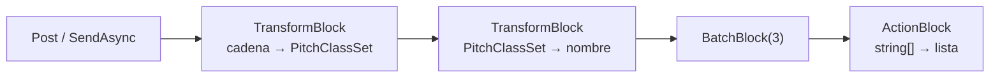

Un canal es una sola cola. En cuanto un pipeline tiene varias etapas, cada una con su propio grado de paralelismo, su propio búfer y su propia agrupación en lotes, escribes la misma fontanería una y otra vez: un canal por etapa, un bucle por consumidor, un `Complete` por escritor, y una ruta de error para cada uno. [TPL Dataflow](https://learn.microsoft.com/dotnet/standard/parallel-programming/dataflow-task-parallel-library) empaqueta esa fontanería en *bloques* que enlazas entre sí. Es más antiguo que los canales, pues se publicó por primera vez como paquete NuGet para .NET Framework 4.5, y sigue siendo la biblioteca de pipelines más completa de .NET.

Esta lección construye un pequeño pipeline sobre [`PitchClassSet`](https://github.com/GuitarAlchemist/ga/blob/a826864f3a012cad88e415954bf57eca0ce12aa6/Common/GA.Domain.Core/Theory/Atonal/PitchClassSet.cs) de Guitar Alchemist, comprueba qué hace cada opción, y luego examina la propia demo de Dataflow de GA y el comando de indexación de la lección 6 reconstruido con bloques. Las reglas que más importan tienen que ver con los fallos: adónde va una excepción, y adónde no va.

Los enlaces a GA apuntan al commit [`a826864`](https://github.com/GuitarAlchemist/ga/tree/a826864f3a012cad88e415954bf57eca0ce12aa6); los enlaces al runtime apuntan al commit [`4271d88`](https://github.com/dotnet/runtime/tree/4271d88e0aebf3d04f188f1334c2220d80555ef6) de `dotnet/runtime`, etiquetado `v10.0.12`.

## Ejecutar el programa de la lección

```bash
bash code/csharp-advanced/check.sh                                   # todas las lecciones, comparadas con expected/
dotnet run --project code/csharp-advanced/Advanced -c Release -- l7  # solo esta lección, después de check.sh
```

El código está en [`Advanced/Lesson7.cs`](https://github.com/spareilleux/learn/blob/b4d713f86711b770a75d7504f334c5871c95f820/code/csharp-advanced/Advanced/Lesson7.cs), y su salida se compara con [`expected/l7.txt`](https://github.com/spareilleux/learn/blob/b4d713f86711b770a75d7504f334c5871c95f820/code/csharp-advanced/expected/l7.txt) en tres sistemas operativos.

```text
== Where the types come from
TransformBlock<,>: System.Threading.Tasks.Dataflow, in the shared framework True
```

El ensamblado `System.Threading.Tasks.Dataflow` viene en el framework compartido de .NET, así que un proyecto .NET 10 no necesita ningún paquete para usarlo. Los dos proyectos de demostración de GA que usan Dataflow siguen haciendo referencia al paquete [`System.Threading.Tasks.Dataflow`](https://www.nuget.org/packages/System.Threading.Tasks.Dataflow), versión 9.0.10 ([`PerformanceOptimizationDemo.csproj#L18`](https://github.com/GuitarAlchemist/ga/blob/a826864f3a012cad88e415954bf57eca0ce12aa6/Demos/Performance/PerformanceOptimizationDemo/PerformanceOptimizationDemo.csproj#L18)), una copia más antigua de lo que el framework ya proporciona. En un proyecto `net10.0` nuevo en la máquina del autor, esa referencia se restaura con la advertencia NU1510, «PackageReference System.Threading.Tasks.Dataflow will not be pruned. Consider removing this package from your dependencies, as it is likely unnecessary», y el programa sigue cargando el `System.Threading.Tasks.Dataflow.dll` del framework desde `shared/Microsoft.NETCore.App/10.0.12`.

## Bloques y enlaces

Un bloque es un pequeño actor con un búfer de entrada, algo de procesamiento y un búfer de salida. Los que usa esta lección:

| Bloque | Entrada | Salida | Hace |
|---|---|---|---|
| [`TransformBlock<TIn, TOut>`](https://learn.microsoft.com/dotnet/api/system.threading.tasks.dataflow.transformblock-2) | un elemento | un elemento | ejecuta una función, síncrona o `async` |
| [`TransformManyBlock<TIn, TOut>`](https://learn.microsoft.com/dotnet/api/system.threading.tasks.dataflow.transformmanyblock-2) | un elemento | cero o más elementos | `SelectMany` en forma de bloque |
| [`BatchBlock<T>`](https://learn.microsoft.com/dotnet/api/system.threading.tasks.dataflow.batchblock-1) | elementos | arrays de `n` elementos | agrupa; el último lote puede ser más corto |
| [`BufferBlock<T>`](https://learn.microsoft.com/dotnet/api/system.threading.tasks.dataflow.bufferblock-1) | elementos | los mismos elementos | una cola que se puede enlazar |
| [`ActionBlock<T>`](https://learn.microsoft.com/dotnet/api/system.threading.tasks.dataflow.actionblock-1) | elementos | nada | el final de un pipeline |

`LinkTo` conecta un origen con un destino, y [`DataflowLinkOptions.PropagateCompletion`](https://learn.microsoft.com/dotnet/api/system.threading.tasks.dataflow.dataflowlinkoptions.propagatecompletion) hace que el destino finalice cuando lo hace el origen. El pipeline analiza cadenas de clases de alturas, nombra cada conjunto con su etiqueta en el catálogo de Allen Forte, agrupa los nombres de tres en tres y escribe los grupos:



```csharp
static async Task Pipeline()
{
    Title("A pipeline: parse, describe, batch by 3, write");
    var parse = new TransformBlock<string, PitchClassSet>(s => PitchClassSet.Parse(s));
    var describe = new TransformBlock<PitchClassSet, string>(Named);
    var batch = new BatchBlock<string>(3);
    var written = new List<string>();
    var write = new ActionBlock<string[]>(names => written.Add($"[{string.Join(", ", names)}]"));

    parse.LinkTo(describe, Propagate);
    describe.LinkTo(batch, Propagate);
    batch.LinkTo(write, Propagate);

    foreach (var chord in Progression.Concat(Progression.Take(3)))
    {
        parse.Post(chord);
    }

    parse.Complete();
    await write.Completion;
    foreach (var line in written)
    {
        Line(line);
    }

    Line($"Completion: parse {parse.Completion.Status}, describe {describe.Completion.Status}, batch {batch.Completion.Status}, write {write.Completion.Status}");
    var labels = Progression.Select(s => PitchClassSet.Parse(s)).Select(set => $"{set.Name}: {ProgrammaticForteCatalog.GetForteNumber(set)}");
    Line($"the same sets in GA's ProgrammaticForteCatalog: {string.Join(", ", labels)}");
}
```

```text
== A pipeline: parse, describe, batch by 3, write
[0 2 5 9 (4-26), 2 5 7 E (4-27), 0 4 7 E (4-20)]
[0 4 7 9 (4-26), 0 2 5 9 (4-26), 2 5 7 E (4-27)]
[0 4 7 E (4-20)]
Completion: parse RanToCompletion, describe RanToCompletion, batch RanToCompletion, write RanToCompletion
the same sets in GA's ProgrammaticForteCatalog: 0 2 5 9: 4-3, 2 5 7 E: 4-2, 0 4 7 E: 4-9, 0 4 7 9: 4-3
```

La progresión es ii–V–I–vi en do, Dm7, G7, Cmaj7 y Am7, y luego otra vez sus tres primeros acordes: siete conjuntos, así que dos lotes completos y un último de un solo conjunto. Llamar a `Complete` en el primer bloque bastó para terminar todo el pipeline, un enlace tras otro, y `await write.Completion` lo esperó por completo.

Las etiquetas vienen de [`CanonicalForteCatalog`](https://github.com/GuitarAlchemist/ga/blob/a826864f3a012cad88e415954bf57eca0ce12aa6/Common/GA.Domain.Core/Theory/Atonal/CanonicalForteCatalog.cs#L3-L20) de GA: 4-26 para los acordes de séptima menor, 4-27 para la séptima dominante, 4-20 para la séptima mayor. La última línea muestra por qué el programa no usa [`ProgrammaticForteCatalog`](https://github.com/GuitarAlchemist/ga/blob/a826864f3a012cad88e415954bf57eca0ce12aa6/Common/GA.Domain.Core/Theory/Atonal/ProgrammaticForteCatalog.cs#L5-L19), cuyo diccionario congelado midió la lección 4: sus valores `ForteNumber` siguen el orden de Rahn, y dan 4-3 donde la tabla de Forte dice 4-26. Su documentación dice que las diferencias son «menores»; para estos acordes, no coincide ninguno de los números.

## Paralelismo y orden

De forma predeterminada, un bloque procesa un elemento cada vez. [`MaxDegreeOfParallelism`](https://learn.microsoft.com/dotnet/api/system.threading.tasks.dataflow.executiondataflowblockoptions.maxdegreeofparallelism) le permite ejecutar varios, y [`EnsureOrdered`](https://learn.microsoft.com/dotnet/api/system.threading.tasks.dataflow.dataflowblockoptions.ensureordered), `true` de forma predeterminada, decide si las salidas conservan el orden de las entradas. El programa envía cuatro elementos a un bloque con cuatro grados de paralelismo, retiene el elemento 0 hasta que los otros tres han terminado, e intenta recibir durante medio segundo mientras el elemento 0 sigue ejecutándose ([`HoldFirst`](https://github.com/spareilleux/learn/blob/b4d713f86711b770a75d7504f334c5871c95f820/code/csharp-advanced/Advanced/Lesson7.cs#L75-L133)):

```text
== MaxDegreeOfParallelism 4: items 1 to 3 have finished, item 0 is still running
EnsureOrdered = True   received while item 0 runs: nothing  then: 0 1 2 3
EnsureOrdered = False  received while item 0 runs: 1 2 3    then: 0
```

- **Con orden**, los elementos terminados 1, 2 y 3 esperan en un búfer de reordenación detrás del elemento 0 ([`TransformBlock.cs#L113-L118`](https://github.com/dotnet/runtime/blob/4271d88e0aebf3d04f188f1334c2220d80555ef6/src/libraries/System.Threading.Tasks.Dataflow/src/Blocks/TransformBlock.cs#L113-L118)). No sale nada hasta que termina el elemento más lento: el paralelismo acelera el trabajo, no el primer resultado.
- **Sin orden**, cada elemento pasa a la salida en cuanto se ejecuta la continuación de su tarea ([`TransformBlock.cs#L256-L261`](https://github.com/dotnet/runtime/blob/4271d88e0aebf3d04f188f1334c2220d80555ef6/src/libraries/System.Threading.Tasks.Dataflow/src/Blocks/TransformBlock.cs#L256-L261)). Su orden entre ellos no está garantizado, por eso el programa los ordena antes de imprimirlos.

Una primera versión de este programa intentaba mostrar que las salidas sin orden salen «en orden de finalización», y falló en 8 ejecuciones de 20: dos elementos que terminan casi a la vez pueden llegar al búfer de salida en cualquier orden. Solo «los terminados no esperan al lento» es fiable.

## Capacidad acotada

Todos los bloques almacenan sin límite de forma predeterminada, como un canal no acotado. [`BoundedCapacity`](https://learn.microsoft.com/dotnet/api/system.threading.tasks.dataflow.dataflowblockoptions.boundedcapacity) limita el número de elementos que contiene un bloque, *incluidos los que está procesando*:

```csharp
static async Task Capacity()
{
    Title("BoundedCapacity 2: Post refuses, SendAsync waits");
    var gate = new TaskCompletionSource(TaskCreationOptions.RunContinuationsAsynchronously);
    var slow = new ActionBlock<int>(async _ => await gate.Task, new ExecutionDataflowBlockOptions { BoundedCapacity = 2 });
    var posts = Enumerable.Range(1, 4).Select(i => slow.Post(i)).ToList();
    Line($"Post 1 to 4 while item 1 is running: {string.Join(" ", posts)}");
    var send = slow.SendAsync(5);
    Line($"SendAsync(5): completed {send.IsCompleted}");
    gate.SetResult();
    Line($"once item 1 finishes: SendAsync(5) returned {await send}");
    slow.Complete();
    await slow.Completion;
}
```

```text
== BoundedCapacity 2: Post refuses, SendAsync waits
Post 1 to 4 while item 1 is running: True True False False
SendAsync(5): completed False
once item 1 finishes: SendAsync(5) returned True
```

El elemento 1 se está ejecutando y el elemento 2 espera en el búfer de entrada: el bloque contiene dos elementos, su capacidad. [`Post`](https://learn.microsoft.com/dotnet/api/system.threading.tasks.dataflow.dataflowblock.post) es la forma síncrona de entrar, y devuelve `false` cuando el bloque está lleno. [`SendAsync`](https://learn.microsoft.com/dotnet/api/system.threading.tasks.dataflow.dataflowblock.sendasync) devuelve una tarea que termina cuando el bloque acepta el elemento, así que un productor que la espera se ajusta al ritmo del bloque, como `WriteAsync` en un canal acotado.

El mismo mecanismo funciona entre bloques: un destino acotado *aplaza* los mensajes que le ofrece su origen, y los toma más tarde, así que una etapa lenta llena los búferes que tiene aguas arriba hasta que el primer bloque rechaza `SendAsync`. Un pipeline solo tiene backpressure si todos sus bloques están acotados, y si el productor del principio usa `SendAsync` en lugar de `Post`, o comprueba lo que devuelve `Post`.

## Errores: bajan por los enlaces, nunca suben

Un delegado que lanza una excepción pone su bloque en error. El pipeline recibe una cadena que no se puede analizar:

```text
== Errors: '04X7' does not parse
SendAsync(0259) True, SendAsync(04X7) True
await parse.Completion: PitchClassSetParseException: Exception of type 'GA.Domain.Core.Theory.Atonal.PitchClassSetParseException' was thrown.
after the fault: SendAsync(047E) False, Post(0479) False
parse.Completion.Exception: AggregateException > PitchClassSetParseException
describe: Faulted, results: Faulted
results.Completion.Exception: AggregateException > AggregateException > AggregateException > PitchClassSetParseException
results.OutputAvailableAsync(): False, results.Count 0
```

- La entrada incorrecta fue *aceptada*: `SendAsync` solo dice que el bloque tomó el elemento, no que procesarlo vaya a salir bien.
- El `Completion` del bloque terminó en error con la `PitchClassSetParseException` de GA, y a partir de ahí el bloque lo rechaza todo, con `SendAsync` y `Post` devolviendo ambos `false`.
- Con `PropagateCompletion`, el error bajó: el bloque siguiente entró en error, y también el búfer que venía después. Cada enlace envuelve la excepción en una `AggregateException` más, tres niveles de profundidad al final de este pipeline corto. Usa `Flatten()` o mira la excepción más interna.
- Un bloque en error descarta los elementos que contiene. El conjunto `0259`, analizado con éxito antes del fallo, nunca llega al búfer del final: `OutputAvailableAsync` devuelve `false` y el recuento es 0.

La excepción de GA no lleva ningún mensaje: «Exception of type … was thrown.» Un registro que dijera qué entrada no se pudo analizar necesitaría que el analizador la pusiera en el mensaje.

La otra dirección es la peligrosa. La lección 6 encontró que el comando de indexación de GA se bloquea cuando falla su consumidor, porque los productores siguen esperando sitio en un canal que nadie lee. El programa reconstruye ese comando con bloques: un `BatchBlock` de 4 con una capacidad de 8, que alimenta un `ActionBlock` que falla en su primer lote, y un productor que se detiene cuando `SendAsync` devuelve `false` ([`IndexWithBlocks`](https://github.com/spareilleux/learn/blob/b4d713f86711b770a75d7504f334c5871c95f820/code/csharp-advanced/Advanced/Lesson7.cs#L215-L241)):

```text
== GA's index command with blocks: the writer fails on its first batch
producer finished within 1 s: False; batch block completed False, OutputCount 2
```

El escritor entró en error, y no pasó nada más. Un enlace lleva la finalización del origen al destino, nunca del destino al origen: el bloque de lotes no se enteró del error, el origen [desenlazó el destino que ahora rechaza de forma permanente](https://learn.microsoft.com/dotnet/standard/parallel-programming/dataflow-task-parallel-library#predefined-dataflow-block-types), y sus dos lotes de cuatro llenaron su capacidad de 8. El `SendAsync` del productor espera sitio para siempre, exactamente como el canal de la lección 6. Dataflow no lo arregla por sí solo; el error se pasa aguas arriba a mano:

```csharp
_ = writer.Completion.ContinueWith(t => ((IDataflowBlock)batches).Fault(t.Exception!.InnerException!),
    TaskContinuationOptions.OnlyOnFaulted);
```

```text
== The same, with the writer's fault passed to the batch block
producer finished within 1 s: True, before sending all 100 items True; batch block: Faulted, IOException: database unavailable
```

[`IDataflowBlock.Fault`](https://learn.microsoft.com/dotnet/api/system.threading.tasks.dataflow.idataflowblock.fault) hace que el bloque de lotes rechace sus mensajes aplazados y futuros, así que el `SendAsync` en espera devuelve `false` y el productor se detiene. El `Completion` del bloque de lotes pasa a `Faulted` un instante después de que `Fault` retorne, por eso el programa lo espera antes de imprimir.

## Completion no es tu consumidor

Cuando lees tú mismo la salida de un bloque, con `ReceiveAsync` o `TryReceive`, el `Completion` del bloque te dice que al bloque no le queda nada, no que tu código haya terminado con lo que recibió. La demo de GA espera el `Completion` del último bloque, y luego lee la lista de resultados que otra tarea sigue llenando. El programa hace que ese consumidor retenga a propósito el último elemento:

```csharp
static async Task CompletionIsNotYourConsumer()
{
    Title("Completion says the block is empty, not that your consumer is done");
    var block = new TransformBlock<int, int>(i => i);
    var results = new List<int>();
    var mayAddLast = new TaskCompletionSource(TaskCreationOptions.RunContinuationsAsynchronously);
    var consumer = Task.Run(async () =>
    {
        while (await block.OutputAvailableAsync())
        {
            var item = await block.ReceiveAsync();
            if (item == 2)
            {
                await mayAddLast.Task; // todavía trabajando en el último elemento
            }

            results.Add(item);
        }
    });

    block.Post(1);
    block.Post(2);
    block.Complete();
    await block.Completion;
    Line($"await block.Completion returned: results.Count {results.Count}");
    mayAddLast.SetResult();
    await consumer;
    Line($"await consumer returned: results.Count {results.Count}");
}
```

```text
== Completion says the block is empty, not that your consumer is done
await block.Completion returned: results.Count 1
await consumer returned: results.Count 2
```

`Completion` terminó en cuanto el elemento 2 salió del bloque, mientras el consumidor todavía trabajaba en él. Espera la propia tarea del consumidor.

## Cancelación

Un [`CancellationToken`](https://learn.microsoft.com/dotnet/api/system.threading.tasks.dataflow.dataflowblockoptions.cancellationtoken) en las opciones del bloque cancela el bloque, y el token llega también al delegado a través de su clausura:

```text
== Cancellation: the token in the block options
Completion: TaskCanceledException: A task was canceled., status Canceled
Post after cancellation: False, InputCount 0
```

El elemento en curso se detuvo con el token, el elemento en cola se descartó, y el `Completion` del bloque es `Canceled`, no `Faulted`: el código que lo espera recibe una `TaskCanceledException`, a la que se aplican las reglas de la lección 3 sobre dejar pasar la cancelación.

## Caso de estudio: la demo de Dataflow de GA

[`PerformanceOptimizationDemo`](https://github.com/GuitarAlchemist/ga/blob/a826864f3a012cad88e415954bf57eca0ce12aa6/Demos/Performance/PerformanceOptimizationDemo/Program.cs#L110-L169) de GA muestra canales, Dataflow y Rx uno tras otro sobre datos musicales generados. Su parte de Dataflow construye tres `TransformBlock`, cada uno acotado a 100 elementos con un grado de paralelismo por núcleo, los enlaza con `PropagateCompletion`, envía 1.000 entradas con `SendAsync` desde una tarea y recibe los resultados en otra:

```csharp
var inputTask = Task.Run(async () =>
{
    for (var i = 0; i < 1000; i++)
    {
        await parseBlock.SendAsync($"musical_input_{i}");
    }

    parseBlock.Complete();
});

var results = new List<RecommendationData>();
var outputTask = Task.Run(async () =>
{
    while (await recommendBlock.OutputAvailableAsync())
    {
        var result = await recommendBlock.ReceiveAsync();
        results.Add(result);
    }
});

await inputTask;
await recommendBlock.Completion;
stopwatch.Stop();

logger.LogInformation("Dataflow: Processed {Count} items through 3-stage pipeline in {ElapsedMs}ms",
    results.Count, stopwatch.ElapsedMilliseconds);
```

Lo que está bien: todos los bloques están acotados y el productor espera `SendAsync`, así que el pipeline tiene backpressure de principio a fin; `PropagateCompletion` lo finaliza con un solo `Complete`. Lo que no, con los comportamientos mostrados arriba:

- `outputTask` nunca se espera. `results.Count` se lee después de `recommendBlock.Completion`, que puede terminar mientras el consumidor aún retiene el último resultado, desde otro subproceso, en una `List<T>` que no es segura para subprocesos.
- Se ignora el valor que devuelve `SendAsync`. Si una etapa entra en error, cada `SendAsync` posterior devuelve `false` de inmediato, y el bucle sigue «enviando» a un pipeline que se ha detenido.
- Si una etapa lanza una excepción, el error sale de `await recommendBlock.Completion` como `AggregateException` anidadas alrededor de la excepción real, una por enlace, que el `catch` de la demo registra como «Demo failed». Las entradas generadas de GA nunca hacen fallar una etapa, así que la demo no lo muestra.

El ejercicio 2 corrige estos tres puntos.

## Si conoces Spring y Reactor

Un pipeline de Reactor es una cadena de operadores sobre un único `Flux`, mientras que Dataflow es un grafo de objetos; aun así, la mayoría de los bloques tiene un equivalente en la [Javadoc de `Flux`](https://projectreactor.io/docs/core/release/api/reactor/core/publisher/Flux.html):

| TPL Dataflow | Reactor |
|---|---|
| `TransformBlock` con `MaxDegreeOfParallelism = n`, `EnsureOrdered = true` | `flatMapSequential(f, n)` |
| lo mismo con `EnsureOrdered = false` | `flatMap(f, n)`, que emite en orden de finalización |
| `TransformBlock` con el paralelismo predeterminado de 1 | `concatMap(f)`, o `map(f)` para una función síncrona |
| `TransformManyBlock` | `flatMapIterable` |
| `BatchBlock(n)` | `buffer(n)`; `bufferTimeout(n, duration)` para vaciar lotes parciales |
| `BoundedCapacity` | el prefetch de `flatMap`, `concatMap` y `publishOn`, y `limitRate` |
| `SendAsync` esperando sitio | un publicador esperando `request(n)` |
| un bloque en error y `PropagateCompletion` | `onError`, que siempre baja y cancela la suscripción aguas arriba |
| `BroadcastBlock`, o enlazar un origen con varios destinos | `publish()` con `connect()`, o `share()` |
| `LinkTo(target, predicate)` | `filter`, o `groupBy` para enrutar |
| `ExecutionDataflowBlockOptions.TaskScheduler` | `publishOn(scheduler)` |

La diferencia que más importa es aquella en la que esta lección se ha detenido. En Reactor, un error baja hasta el suscriptor *y* cancela todo lo que hay aguas arriba, como parte del contrato de Reactive Streams. En Dataflow, un error solo baja por los enlaces, y un bloque aguas arriba que no puede entregar simplemente espera. La [lección 2 del curso de Reactor](../../spring-cloud-reactor/02-reactor-mono-and-flux/) muestra el orden de `flatMap` con salida real.

## Ejercicios

1. Enlaza un `TransformBlock<string, PitchClassSet>` con dos destinos mediante predicados, las tríadas a uno y las tétradas al otro, y envía `047`, `0259`, `02479`, `037` y `257E`. ¿Termina el pipeline? ¿Qué reciben los destinos? Después añade un tercer enlace a [`DataflowBlock.NullTarget<T>()`](https://learn.microsoft.com/dotnet/api/system.threading.tasks.dataflow.dataflowblock.nulltarget) y ejecútalo de nuevo.
2. Corrige la demo de Dataflow de GA: deja de enviar cuando el pipeline rechaza, espera al consumidor, e informa del error. Pruébala con 1.000 entradas donde la entrada 500 es `musical_input_x`.
3. Un `TransformManyBlock<PitchClassSet, PitchClass>` recibe el conjunto `257E`. ¿Qué sale, y por qué la función del bloque puede devolver simplemente el conjunto?

<details>
<summary>Soluciones</summary>

1. El pipeline nunca termina. `02479` tiene cinco clases de alturas: ningún predicado lo acepta, así que se queda a la cabeza del búfer de salida del origen, y todos los mensajes detrás de él esperan también. La tríada `037` y la tétrada `257E` nunca llegan. Un `NullTarget` enlazado en último lugar acepta lo que los otros enlaces rechazaron y lo descarta:

    ```text
    1. without NullTarget: completed within 1 s False, triads [0 4 7], tetrads [0 2 5 9], parse.OutputCount 3
    1. with NullTarget:    completed within 1 s True, triads [0 4 7, 0 3 7], tetrads [0 2 5 9, 2 5 7 E], parse.OutputCount 0
    ```

    Todo origen con enlaces con predicado necesita un último enlace que lo acepte todo, aunque solo registre.

2. Comprueba el resultado de `SendAsync`, espera al consumidor, y deja que el error salga de `Completion` ([`FixedDemo`](https://github.com/spareilleux/learn/blob/b4d713f86711b770a75d7504f334c5871c95f820/code/csharp-advanced/Advanced/Lesson7.cs#L323-L357)):

    ```csharp
    // Ejercicio 2: el pipeline de DemoDataflowAsync de GA con su paso de análisis, corregido
    static async Task<(int Sent, int Received, string Outcome)> FixedDemo(string[] inputs)
    {
        var options = new ExecutionDataflowBlockOptions { MaxDegreeOfParallelism = 4, BoundedCapacity = 100 };
        var parseBlock = new TransformBlock<string, int>(input => int.Parse(input.Split('_')[2]) % 12, options);
        var analyzeBlock = new TransformBlock<int, string>(pc => pc switch { 0 => "C Major", 4 => "E Major", 7 => "G Major", _ => "Unknown" }, options);
        parseBlock.LinkTo(analyzeBlock, Propagate);

        var results = new List<string>();
        var outputTask = Task.Run(async () =>
        {
            while (await analyzeBlock.OutputAvailableAsync())
            {
                while (analyzeBlock.TryReceive(out var result))
                {
                    results.Add(result);
                }
            }
        });

        var sent = 0;
        foreach (var input in inputs)
        {
            if (!await parseBlock.SendAsync(input))
            {
                break;
            }

            sent++;
        }

        parseBlock.Complete();
        var outcome = await Outcome(async () => { await analyzeBlock.Completion; return "completed"; });
        var consumerFinished = await Completes(outputTask, 10);
        return (sent, results.Count, $"{outcome}, consumer finished {consumerFinished}");
    }
    ```

    ```text
    2. fixed demo: sending stopped before the end True, pipeline AggregateException: One or more errors occurred. (The input string 'x' was not in a correct format.) (inner FormatException: The input string 'x' was not in a correct format.), consumer finished True
    ```

    En las ejecuciones del autor, el productor se detuvo tras 544 a 600 entradas aceptadas: los búferes acotados le dejaron adelantarse unas decenas de elementos al fallo antes de que `SendAsync` viera el error.

3. `2 5 7 E`, cuatro valores `PitchClass`. Un `PitchClassSet` es un `IEnumerable<PitchClass>`, y `TransformManyBlock` acepta cualquier función que devuelva un `IEnumerable<TOut>`, así que el conjunto es su propio resultado.

    ```text
    3. TransformManyBlock over 257E: 2 5 7 E
    ```

</details>

## Puntos clave

- Los bloques de Dataflow son búferes con procesamiento, enlazados en un grafo; `PropagateCompletion` permite que un solo `Complete` termine todo el pipeline.
- `MaxDegreeOfParallelism` ejecuta elementos de forma concurrente; con `EnsureOrdered`, el valor predeterminado, los elementos terminados esperan detrás del más lento.
- Los bloques no están acotados de forma predeterminada. `BoundedCapacity` cuenta los elementos en proceso, `Post` devuelve `false` cuando está lleno, y `SendAsync` espera: acota todos los bloques y espera `SendAsync` para tener backpressure.
- Un error baja por los enlaces, envuelto en una `AggregateException` más por bloque, y descarta los elementos que tenían los bloques en error. Nunca sube: pon tú mismo en error los bloques de aguas arriba, o un productor puede esperar para siempre.
- Un mensaje que ningún enlace acepta bloquea su origen para siempre; enlaza un `NullTarget` en último lugar.
- El `Completion` del último bloque no significa que tu consumidor haya terminado: espera al consumidor.

## Fuentes

- Microsoft Learn: [Flujo de datos (Task Parallel Library)](https://learn.microsoft.com/dotnet/standard/parallel-programming/dataflow-task-parallel-library), [Tutorial: Crear una canalización de flujo de datos](https://learn.microsoft.com/dotnet/standard/parallel-programming/walkthrough-creating-a-dataflow-pipeline), [`DataflowBlockOptions`](https://learn.microsoft.com/dotnet/api/system.threading.tasks.dataflow.dataflowblockoptions), [`ExecutionDataflowBlockOptions`](https://learn.microsoft.com/dotnet/api/system.threading.tasks.dataflow.executiondataflowblockoptions).
- dotnet/runtime en `v10.0.12` (commit `4271d88`): [`TransformBlock.cs`](https://github.com/dotnet/runtime/blob/4271d88e0aebf3d04f188f1334c2220d80555ef6/src/libraries/System.Threading.Tasks.Dataflow/src/Blocks/TransformBlock.cs#L113-L118).
- Reactor: [Javadoc de `Flux`](https://projectreactor.io/docs/core/release/api/reactor/core/publisher/Flux.html), [guía de referencia de Reactor](https://projectreactor.io/docs/core/release/reference/).
- Guitar Alchemist en `a826864`: [`PerformanceOptimizationDemo/Program.cs`](https://github.com/GuitarAlchemist/ga/blob/a826864f3a012cad88e415954bf57eca0ce12aa6/Demos/Performance/PerformanceOptimizationDemo/Program.cs#L110-L169), [`CanonicalForteCatalog.cs`](https://github.com/GuitarAlchemist/ga/blob/a826864f3a012cad88e415954bf57eca0ce12aa6/Common/GA.Domain.Core/Theory/Atonal/CanonicalForteCatalog.cs#L3-L20), [`ProgrammaticForteCatalog.cs`](https://github.com/GuitarAlchemist/ga/blob/a826864f3a012cad88e415954bf57eca0ce12aa6/Common/GA.Domain.Core/Theory/Atonal/ProgrammaticForteCatalog.cs#L5-L19).
