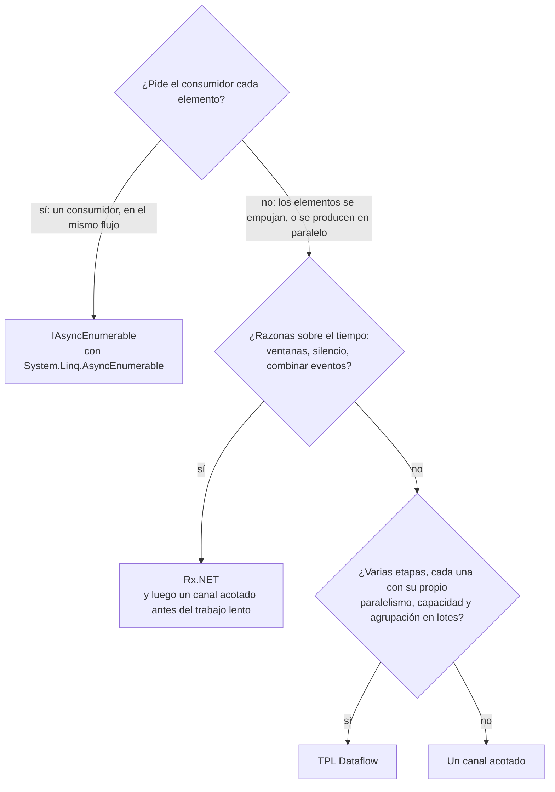

Las lecciones 6 a 8 recorrieron tres formas de mover elementos de un fragmento de código a otro. La cuarta es la que C# integra en el lenguaje: [`IAsyncEnumerable<T>`](https://learn.microsoft.com/dotnet/api/system.collections.generic.iasyncenumerable-1), consumido con `await foreach`. Esta lección empieza por ella, y luego ejecuta los mismos cuatro experimentos sobre las cuatro: un consumidor que retiene un elemento, una fuente que falla, un consumidor que falla, y un benchmark de rendimiento. Las respuestas son la tabla y el diagrama de decisión del final.

Reactor es la quinta columna. El [curso de Spring Boot, Spring Cloud y Reactor](../../spring-cloud-reactor/02-reactor-mono-and-flux/) compara `Flux` con `IAsyncEnumerable` e `IObservable`; esta lección no repite esa comparación, mide su lado .NET.

Los enlaces a GA apuntan al commit [`a826864`](https://github.com/GuitarAlchemist/ga/tree/a826864f3a012cad88e415954bf57eca0ce12aa6), los enlaces a .NET a la etiqueta [`v10.0.12`](https://github.com/dotnet/runtime/tree/4271d88e0aebf3d04f188f1334c2220d80555ef6) de `dotnet/runtime`.

## Ejecutar el programa de la lección

```bash
bash code/csharp-advanced/check.sh                                   # todas las lecciones, comparadas con expected/
dotnet run --project code/csharp-advanced/Advanced -c Release -- l9  # solo esta lección, después de check.sh
```

El código está en [`Advanced/Lesson9.cs`](https://github.com/spareilleux/learn/blob/b4d713f86711b770a75d7504f334c5871c95f820/code/csharp-advanced/Advanced/Lesson9.cs), y su salida se compara con [`expected/l9.txt`](https://github.com/spareilleux/learn/blob/b4d713f86711b770a75d7504f334c5871c95f820/code/csharp-advanced/expected/l9.txt). El benchmark está en [`Benchmarks/StreamBenchmarks.cs`](https://github.com/spareilleux/learn/blob/b4d713f86711b770a75d7504f334c5871c95f820/code/csharp-advanced/Benchmarks/StreamBenchmarks.cs).

## Los flujos asíncronos tiran de los datos

Un iterador asíncrono es un método que devuelve `IAsyncEnumerable<T>` y contiene a la vez `await` y `yield return`. El compilador lo convierte en una máquina de estados, como mostró la lección 3 para los métodos `async`, y el [tutorial sobre flujos asíncronos](https://learn.microsoft.com/dotnet/csharp/asynchronous-programming/generate-consume-asynchronous-stream) cubre la sintaxis. La fuente de la lección registra lo que hace:

```csharp
static async IAsyncEnumerable<string> Chords(List<string> log, [EnumeratorCancellation] CancellationToken token = default)
{
    try
    {
        foreach (var chord in Progression)
        {
            await Task.Yield();
            log.Add($"produce {chord}");
            yield return chord;
        }
    }
    finally
    {
        log.Add("source finally");
    }
}
```

```text
== An async iterator runs only when the consumer asks for the next item
produce Dm7, consume Dm7, produce G7, consume G7, produce Cmaj7, consume Cmaj7, produce A7, consume A7, source finally
```

Cada elemento se produce solo cuando `await foreach` pide el siguiente, con `MoveNextAsync`, y el `finally` se ejecuta cuando el consumidor libera el iterador. No hay cola, ni segunda tarea, ni subproceso: el código del productor se ejecuta dentro de las llamadas del consumidor. Por eso el curso de Reactor dice que `IAsyncEnumerable` tiene backpressure gratis, de un elemento en un elemento ([curso de Reactor, backpressure](../../spring-cloud-reactor/03-reactor-under-the-hood/#backpressure)).

El atributo [`[EnumeratorCancellation]`](https://learn.microsoft.com/dotnet/api/system.runtime.compilerservices.enumeratorcancellationattribute) conecta el parámetro con el token que un consumidor pasa con `WithCancellation(token)`, para que un llamador que no creó el flujo pueda aun así cancelarlo.

Olvidar `await` es un error de compilación, no un error silencioso. El curso guarda el fragmento en [`CompileFail/snippets/l9_foreach_async_stream.cs`](https://github.com/spareilleux/learn/blob/b4d713f86711b770a75d7504f334c5871c95f820/code/csharp-advanced/CompileFail/snippets/l9_foreach_async_stream.cs):

```csharp
public static void Print()
{
    foreach (var chord in ChordsAsync())
    {
        Console.WriteLine(chord);
    }
}
```

```text
l9_foreach_async_stream.cs(12,31): error CS8414: foreach statement cannot operate on variables of type 'IAsyncEnumerable<string>' because 'IAsyncEnumerable<string>' does not contain a public instance or extension definition for 'GetEnumerator'. Did you mean 'await foreach' rather than 'foreach'?
```

## LINQ para flujos asíncronos, en .NET 10

Hasta .NET 9, LINQ sobre `IAsyncEnumerable` venía del paquete `System.Linq.Async`, mantenido por la comunidad. .NET 10 incluye [`System.Linq.AsyncEnumerable`](https://learn.microsoft.com/dotnet/api/system.linq.asyncenumerable) en el framework compartido, y la [nota sobre el cambio incompatible](https://learn.microsoft.com/dotnet/core/compatibility/core-libraries/10.0/asyncenumerable) explica cómo quitar el paquete antiguo o evitar ambigüedades con él.

```csharp
static async Task AsyncLinq()
{
    Title("System.Linq.AsyncEnumerable, part of .NET 10");
    Line($"AsyncEnumerable: {typeof(AsyncEnumerable).Assembly.GetName().Name}, in the shared framework {typeof(AsyncEnumerable).Assembly.Location.Contains("Microsoft.NETCore.App")}");

    var log = new List<string>();
    var firstTwo = await Chords(log).Take(2).ToListAsync();
    Line($"Take(2): {string.Join(" ", firstTwo)}; log: {string.Join(", ", log)}");

    var sevenths = await Progression.ToAsyncEnumerable()
        .Where(async (chord, ct) =>
        {
            await Task.Yield();
            return !chord.Contains("maj");
        })
        .Select((chord, index) => $"{index}:{chord}")
        .ToArrayAsync();
    Line($"Where with an async predicate, then Select with an index: {string.Join(" ", sevenths)}");

    var chunks = await AsyncEnumerable.Range(1, 10).Chunk(4).Select(chunk => $"[{string.Join(" ", chunk)}]").ToListAsync();
    Line($"AsyncEnumerable.Range(1, 10).Chunk(4): {string.Join(" ", chunks)}");
}
```

```text
== System.Linq.AsyncEnumerable, part of .NET 10
AsyncEnumerable: System.Linq.AsyncEnumerable, in the shared framework True
Take(2): Dm7 G7; log: produce Dm7, produce G7, source finally
Where with an async predicate, then Select with an index: 0:Dm7 1:G7 2:A7
AsyncEnumerable.Range(1, 10).Chunk(4): [1 2 3 4] [5 6 7 8] [9 10]
```

- `Take(2)` dejó de pedir tras dos elementos y liberó la fuente: su `finally` se ejecutó, y `Cmaj7` nunca se produjo.
- Las sobrecargas asíncronas reciben un `CancellationToken` y devuelven un `ValueTask`: [`Where(Func<TSource, CancellationToken, ValueTask<bool>>)`](https://github.com/dotnet/runtime/blob/4271d88e0aebf3d04f188f1334c2220d80555ef6/src/libraries/System.Linq.AsyncEnumerable/src/System/Linq/Where.cs#L53-L55). El paquete antiguo las llamaba `WhereAwait` y `SelectAwait`; en .NET 10 son sobrecargas de `Where` y `Select`.
- `Chunk`, `CountAsync`, `ToListAsync`, `AsyncEnumerable.Range` y el resto de LINQ están ahí.

Una lambda asíncrona con el elemento como único parámetro no coincide con ninguna de las sobrecargas. El compilador prueba entonces la síncrona `Func<string, bool>` y se rinde ([`l9_async_predicate.cs`](https://github.com/spareilleux/learn/blob/b4d713f86711b770a75d7504f334c5871c95f820/code/csharp-advanced/CompileFail/snippets/l9_async_predicate.cs)):

```csharp
public static IAsyncEnumerable<string> Sevenths(IAsyncEnumerable<string> chords) =>
    chords.Where(async chord => await IsSeventhAsync(chord));
```

```text
l9_async_predicate.cs(11,34): error CS4010: Cannot convert async lambda expression to delegate type 'Func<string, bool>'. An async lambda expression may return void, Task or Task<T>, none of which are convertible to 'Func<string, bool>'.
```

La corrección es la lambda de dos parámetros del programa de arriba: `async (chord, ct) => …`.

## Caso de estudio: `Take(100)` sobre el generador de GA

La lección 6 encontró que [`VoicingGenerator.GenerateAllVoicingsAsync`](https://github.com/GuitarAlchemist/ga/blob/a826864f3a012cad88e415954bf57eca0ce12aa6/Common/GA.Domain.Services/Fretboard/Voicings/Generation/VoicingGenerator.cs#L180-L249) de GA sigue generando después de que su consumidor se haya ido. Los ejemplos de uso de GA encadenan justo esa salida, `.Take(100)` ([`USAGE_EXAMPLES.md#L31-L41`](https://github.com/GuitarAlchemist/ga/blob/a826864f3a012cad88e415954bf57eca0ce12aa6/Demos/Music%20Theory/FretboardVoicingsCLI/USAGE_EXAMPLES.md#L31-L41)). El programa ejecuta `Take(100)` de `System.Linq.AsyncEnumerable` sobre la copia del método de la lección 6, y luego sobre su corrección:

```text
== GA's usage example: GenerateAllVoicingsAsync(...).Take(100)
GA shape: took 100; producer completed within 10 s True, windows generated 24 of 24
fixed:    took 100; producer already completed True, windows generated fewer than 24 True
```

`Take` hizo su parte: liberó el iterador tras 100 voicings. En la forma de GA, liberarlo solo termina el bucle de lectura, así que los productores siguieron hasta generar las 24 ventanas. La versión corregida los cancela en su `finally`; había generado 8 ventanas en la máquina del autor cuando el bucle retornó. Un operador LINQ no puede arreglar una fuente que ignora su propia liberación.

## Los mismos experimentos sobre las cuatro

### Un consumidor retiene el elemento 0

Cada fuente intenta producir 1.000 elementos, contando cada uno justo antes de entregarlo. El consumidor recibe el elemento 0 y no retorna. El programa espera a que el recuento deje de moverse, y luego lo imprime. Las seis fuentes están en [`Backpressure`](https://github.com/spareilleux/learn/blob/b4d713f86711b770a75d7504f334c5871c95f820/code/csharp-advanced/Advanced/Lesson9.cs#L97-L206); el helper que las mide es corto:

```csharp
static async Task Measure(string name, Func<Counter, Task, Task> run)
{
    var produced = new Counter();
    var release = new TaskCompletionSource(TaskCreationOptions.RunContinuationsAsynchronously);
    var running = Task.Run(() => run(produced, release.Task));

    // Esperar hasta que el recuento no se mueva durante 200 ms
    var last = -1;
    while (produced.Value != last)
    {
        last = produced.Value;
        await Task.Delay(200);
    }

    Line($"{name,-34} {last,5}");
    release.SetResult();
    await running;
}
```

```text
== A consumer holds item 0: how many of 1,000 items has the source produced?
async iterator (IAsyncEnumerable)      1
Channel.CreateBounded(2)               4
Channel.CreateUnbounded()           1000
ActionBlock, BoundedCapacity 2         3
Rx Subject, no scheduler               1
Rx Subject, ObserveOn(TaskPool)     1000
```

- **Iterador asíncrono: 1.** El consumidor nunca pidió el elemento 1.
- **Canal acotado de 2: 4.** El elemento 0 está en manos del consumidor, los elementos 1 y 2 llenan el canal, y el elemento 3 se contó antes de que su `WriteAsync` empezara a esperar.
- **Canal no acotado: 1.000.** Nada frena al productor.
- **`ActionBlock` con `BoundedCapacity` 2: 3.** La lección 7 mostró que el elemento en proceso cuenta para la capacidad, así que hay sitio para un elemento en la cola, y el tercer `SendAsync` espera.
- **Rx sin scheduler: 1.** El productor está atascado dentro de `OnNext(0)`, que ejecuta el observador en su subproceso.
- **Rx con `ObserveOn`: 1.000.** La cola no acotada de la lección 8.

La cifra equivalente en Reactor es una demanda: el `publishOn` del curso de Reactor pidió 256 elementos a su fuente, su prefetch predeterminado, y un suscriptor que pide 2 recibe 2.

### La fuente falla tras tres elementos

```text
== The source fails after 3 items: what does the consumer see?
async iterator                         0, 1, 2, InvalidOperationException: source failed
channel, writer just throws            0, 1, 2, still waiting after 1 s
channel, writer calls Complete(e)      0, 1, 2, InvalidOperationException: source failed
Dataflow, PropagateCompletion          target.Completion Faulted: AggregateException: One or more errors occurred. (source failed) (inner InvalidOperationException: source failed)
Rx                                     0, 1, 2, OnError(InvalidOperationException: source failed)
```

El iterador asíncrono y Rx entregan los tres elementos, y luego la excepción original. Un canal solo lo hace si el escritor pasa la excepción a `Complete(e)`: un escritor que simplemente lanza la excepción deja al lector esperando para siempre, que es el error de GA de la lección 6. Dataflow pone el destino en error a través del enlace, envuelto en una `AggregateException` como mostró la lección 7.

### El consumidor falla en el elemento 1

```text
== The consumer fails on item 1: does the source stop?
async iterator                     consumer: InvalidOperationException: consumer failed; source produced 2, its finally ran True
Channel.CreateBounded(2)           consumer: InvalidOperationException: consumer failed; producer finished within 1 s False, Reader.Count 2
ActionBlock, BoundedCapacity 2     block Faulted; SendAsync returned false before the end True
Rx, synchronous source             Subscribe: InvalidOperationException: consumer failed; source produced 2
```

- El **iterador asíncrono** es el único que limpia por sí solo: la excepción sale de `await foreach`, que libera el iterador, y el `finally` de la fuente se ejecuta. La fuente había producido dos elementos.
- El productor del **canal acotado** no se entera. Llena el canal y espera para siempre, como en el comando de indexación de GA. El consumidor tiene que finalizar el canal con la excepción, como en la corrección de la lección 6.
- **`ActionBlock`** entra en error y rechaza los mensajes siguientes, así que `SendAsync` devuelve `false`: un productor que comprueba el resultado se detiene, uno que lo ignora, como la demo de Dataflow de GA en la lección 7, no.
- **Rx** con una fuente síncrona devuelve la excepción del observador a través de `OnNext` al bucle de la fuente, y fuera de `Subscribe`. Nada la convirtió en `OnError`: los operadores de Rx como `Select` capturan las excepciones de las funciones que les das y envían `OnError`, así que un paso que puede fallar va en un operador, no en el observador.

## Puentes

Los cuatro tipos se convierten unos en otros, así que un pipeline puede usar cada uno donde mejor encaja. Tres conversiones vienen en las bibliotecas: [`ChannelReader.ReadAllAsync`](https://learn.microsoft.com/dotnet/api/system.threading.channels.channelreader-1.readallasync), [`DataflowBlock.ReceiveAllAsync`](https://learn.microsoft.com/dotnet/api/system.threading.tasks.dataflow.dataflowblock.receiveallasync) y [`DataflowBlock.AsObservable`](https://learn.microsoft.com/dotnet/api/system.threading.tasks.dataflow.dataflowblock.asobservable). El paquete `System.Reactive` 7.0 no tiene conversión entre `IObservable` e `IAsyncEnumerable`: el primer intento del programa, `ToAsyncEnumerable()` sobre un observable, no compiló. Las dos direcciones ocupan unas pocas líneas:

```csharp
// De IObservable<T> a IAsyncEnumerable<T>: la suscripción escribe en un canal, el consumidor lo lee
public static async IAsyncEnumerable<T> ReadThrough<T>(IObservable<T> source, Channel<T> channel,
    [EnumeratorCancellation] CancellationToken cancellationToken = default)
{
    using var subscription = source.Subscribe(
        item => channel.Writer.TryWrite(item),
        error => channel.Writer.TryComplete(error),
        () => channel.Writer.TryComplete());
    await foreach (var item in channel.Reader.ReadAllAsync(cancellationToken))
    {
        yield return item;
    }
}
```

```csharp
// De IAsyncEnumerable<T> a IObservable<T>: cada suscripción enumera la fuente; liberarla cancela la enumeración
public static IObservable<T> ToObservable<T>(IAsyncEnumerable<T> source) =>
    Observable.Create<T>(async (observer, cancellationToken) =>
    {
        await foreach (var item in source.WithCancellation(cancellationToken))
        {
            observer.OnNext(item);
        }

        observer.OnCompleted();
    });
```

```text
== Bridges
ChannelReader.ReadAllAsync(): Dm7 G7 Cmaj7 A7
ISourceBlock.ReceiveAllAsync(): Dm7 G7 Cmaj7 A7
IObservable through a channel: Dm7 G7 Cmaj7 A7
IAsyncEnumerable with Observable.Create: Dm7 G7 Cmaj7 A7
ISourceBlock.AsObservable(): dm7 g7 cmaj7 a7
```

`ReadThrough` es el útil, porque es donde una fuente que empuja recibe una política de backpressure. El observador no puede esperar, así que las opciones del canal deciden qué pasa con los elementos para los que el consumidor no está listo. El programa envía 1.000 elementos mientras el consumidor retiene el primero:

```text
== A Subject read through a channel: the channel's options decide what happens to a fast source
unbounded                1,000 OnNext while the consumer held item 0; it then read 1000 items, the last 999
bounded 10, DropOldest   1,000 OnNext while the consumer held item 0; it then read 11 items, the last 999: 0 990 991 992 993 994 995 996 997 998 999
```

El canal no acotado lo guardó todo; el acotado, en modo `DropOldest`, guardó los 10 elementos más recientes. Es la combinación para un teclado MIDI o un sensor que alimenta un análisis lento: Rx para los operadores de tiempo, y luego un canal acotado antes de la parte lenta. `DropWrite` guardaría en su lugar los elementos más antiguos, y el modo `Wait` no haría nada aquí, porque `TryWrite` nunca espera.

## Rendimiento

[BenchmarkDotNet](https://benchmarkdotnet.org/) mueve 100.000 enteros de un productor a un consumidor que los suma, a través de cada tipo de flujo. Ejecútalo solo, sin nada más pesado en marcha en la máquina:

```bash
cd code/csharp-advanced
dotnet run -c Release --project Benchmarks -- --filter "*StreamBenchmarks*"
```

```text
BenchmarkDotNet v0.15.8, Windows 11 (10.0.26200.9445/25H2/2025Update/HudsonValley2)
Intel Core Ultra 9 285K 3.70GHz, 1 CPU, 24 logical and 24 physical cores
.NET 10.0.12, X64 RyuJIT x86-64-v3

| Method                 | Mean        | Ratio | Allocated   |
|----------------------- |------------:|------:|------------:|
| AsyncIterator          |  1,113.7 us |  1.00 |       168 B |
| UnboundedChannel       |  4,768.1 us |  4.28 |     26758 B |
| BoundedChannel1000     |  5,129.8 us |  4.61 |      9904 B |
| DataflowBufferToAction | 41,904.6 us | 37.64 |   6756271 B |
| RxSubject              |    131.7 us |  0.12 |       232 B |
| RxObserveOnTaskPool    | 10,638.8 us |  9.56 |    392857 B |
```

La tabla conserva cuatro de las columnas de BenchmarkDotNet; la salida completa también indicó una distribución bimodal para `RxObserveOnTaskPool`, cuya media es por tanto menos significativa que las demás.

- **`RxSubject` es el más rápido porque no es asíncrono en absoluto**: cada `OnNext` es una llamada a un delegado en el subproceso del productor, unos 1,3 ns por elemento.
- **El iterador asíncrono** cuesta unos 11 ns por elemento. Su fuente nunca espera de verdad, así que cada `MoveNextAsync` termina de forma síncrona, y toda la ejecución asigna un solo enumerador.
- **Los canales** cuestan unos 50 ns por elemento, con el productor en otro subproceso, y unos pocos kilobytes de segmentos o de búfer.
- **Rx con `ObserveOn`** mueve cada elemento a la cola del grupo de subprocesos: unos 100 ns por elemento.
- **Dataflow** es el más lento aquí, con unos 420 ns por elemento y 6,7 MB para 100.000 enteros. El benchmark no muestra adónde va eso; el protocolo de oferta y aplazamiento entre dos bloques acotados es el coste probable (*por verificar*).

Aquí procesar cada elemento no cuesta nada, así que el benchmark solo mide el flujo. A 50 ns por elemento, un canal gestiona 20 millones de elementos por segundo en esta máquina: en cuanto cada elemento implica una llamada a una base de datos o unos microsegundos de cálculo, la elección depende de los comportamientos medidos arriba, no de esta tabla.

## ¿Cuál?



| | `IAsyncEnumerable` | `Channel<T>` | TPL Dataflow | Rx.NET | `Flux` de Reactor |
|---|---|---|---|---|---|
| Modelo | el consumidor tira | una cola entre tareas | un grafo de bloques, cada uno con una cola | la fuente empuja | la fuente empuja lo que se pidió |
| De dónde viene | el lenguaje, y `System.Linq.AsyncEnumerable` en .NET 10 | framework compartido | framework compartido | paquete `System.Reactive` | `reactor-core` |
| El consumidor retiene el elemento 0 | la fuente espera tras 1 | espera tras capacidad + 2, o nunca si no está acotado | espera tras `BoundedCapacity` + 1 | sin scheduler: el subproceso del productor espera; `ObserveOn`: nunca | la fuente se detiene en la demanda, 256 detrás de `publishOn` |
| La fuente falla | la excepción, en `await foreach` | la excepción si el escritor llama a `Complete(e)`, un bloqueo si no | el destino entra en error, `AggregateException` anidadas | `OnError`, definitivo | `onError`, definitivo |
| El consumidor falla | el `finally` de la fuente se ejecuta | el productor espera para siempre salvo que el consumidor finalice el canal | el bloque entra en error, `SendAsync` devuelve `false` | la excepción vuelve a la fuente | la suscripción se cancela aguas arriba |
| Paralelismo | ninguno: un elemento cada vez | tantos lectores como inicies | `MaxDegreeOfParallelism` por bloque | `SelectMany`, `Merge(n)` | `flatMap(f, n)`, `parallel()` |
| Orden | se conserva | FIFO; se pierde entre varios lectores | se conserva salvo con `EnsureOrdered = false` | `Concat` lo conserva, `SelectMany` no | `concatMap`, `flatMapSequential` lo conservan, `flatMap` no |
| Operadores de tiempo | ninguno | ninguno | `BatchBlock` cuenta; el tiempo necesita `TriggerBatch` | `Throttle`, `Sample`, `Buffer(TimeSpan)`, `TestScheduler` | `sample`, `bufferTimeout`, `StepVerifier.withVirtualTime` |
| Coste por elemento, trabajo trivial | ~11 ns | ~50 ns | ~420 ns | ~1,3 ns síncrono, ~100 ns con `ObserveOn` | no medido en ninguno de los dos cursos |

Los comportamientos de la columna de Reactor vienen del [curso de Reactor](../../spring-cloud-reactor/03-reactor-under-the-hood/) y de la [Javadoc de `Flux`](https://projectreactor.io/docs/core/release/api/reactor/core/publisher/Flux.html); la fila «el consumidor falla» es la regla de Reactive Streams según la cual un error cancela la suscripción aguas arriba, que esta lección no ejecuta.

En la práctica:

- **Devuelve `IAsyncEnumerable<T>` desde una API** que produce una secuencia: es el tipo más componible, y un llamador que quiera un canal, un bloque o un observable está a un puente de distancia.
- **Usa un canal acotado dentro de un componente** para desacoplar un productor de un consumidor que van a velocidades distintas, y haz que ambos lados pasen sus fallos al canal.
- **Recurre a Dataflow** cuando el pipeline tiene varias etapas que necesitan su propio paralelismo y su propia capacidad, y quieres esos ajustes en un solo lugar.
- **Recurre a Rx** para eventos en el tiempo. No dejes un consumidor lento detrás de `ObserveOn`; pon ahí un canal acotado.

## Si conoces Spring y Reactor

| .NET | Reactor, o Java |
|---|---|
| `IAsyncEnumerable<T>`, `await foreach` | `Flux<T>` consumido con `request(1)`; `Stream<T>` o `Iterator<T>` cuando es síncrono |
| `System.Linq.AsyncEnumerable` | los operadores de `Flux` |
| `Take(n)` libera el iterador | `take(n)` cancela la suscripción |
| `[EnumeratorCancellation]`, `WithCancellation` | `dispose()` sobre la suscripción |
| `Channel<T>` | `Sinks.many().unicast().onBackpressureBuffer(queue)`, o una `BlockingQueue` |
| `ReadThrough` hacia un canal acotado | `onBackpressureBuffer(n, BufferOverflowStrategy.DROP_OLDEST)` |
| `ChannelReader.ReadAllAsync` | `Flux.create` alimentado por una cola |
| `ToObservable(IAsyncEnumerable)`, `AsObservable()` | `Flux.fromIterable`, `Flux.fromStream`; `Flux.from` para otro publicador de Reactive Streams |

Las tablas de la lección 6 y de la lección 8 tienen los operadores de canales y de Rx uno por uno. Java no tiene iterador asíncrono; desde los hilos virtuales, un `Iterator` o un `Stream` bloqueante leído en un hilo virtual cumple ese papel, que la [última sección del curso de Reactor](../../spring-cloud-reactor/03-reactor-under-the-hood/#hilos-virtuales-o-reactivo) compara con Reactor.

## Ejercicios

1. Escribe `Merge(first, second)`, que lee dos `IAsyncEnumerable<T>` de forma concurrente y entrega sus elementos a medida que llegan. Si una fuente falla, la mezcla debe terminar con esa excepción y detener la otra fuente.
2. El comando de indexación de GA hace upsert de voicings por lotes. Con `System.Linq.AsyncEnumerable`, convierte el generador corregido de la lección 6 en lotes de 5 voicings. Con 4 ventanas de 3 voicings, ¿qué tamaños tienen los lotes?
3. Elige un flujo para cada caso: (a) acordes detectados desde un teclado MIDI, enviados a un servicio de análisis lento; (b) indexar un millón de voicings, con cálculo en paralelo y escrituras por lotes en la base de datos; (c) un endpoint HTTP que envía resultados de búsqueda en streaming a su cliente.

<details>
<summary>Soluciones</summary>

1. Dos bombas copian las fuentes en un canal acotado, el primer error finaliza el canal, y un `finally` detiene las bombas cuando el consumidor se va:

    ```csharp
    // Ejercicio 1: lee las dos fuentes de forma concurrente hacia un canal acotado; el primer error termina la mezcla
    public static async IAsyncEnumerable<T> Merge<T>(IAsyncEnumerable<T> first, IAsyncEnumerable<T> second,
        [EnumeratorCancellation] CancellationToken cancellationToken = default)
    {
        using var cts = CancellationTokenSource.CreateLinkedTokenSource(cancellationToken);
        var channel = Channel.CreateBounded<T>(1);

        async Task Pump(IAsyncEnumerable<T> source)
        {
            await foreach (var item in source.WithCancellation(cts.Token))
            {
                await channel.Writer.WriteAsync(item, cts.Token);
            }
        }

        var pumps = Task.WhenAll(Pump(first), Pump(second));
        _ = pumps.ContinueWith(t => channel.Writer.TryComplete(t.Exception?.InnerException), TaskScheduler.Default);
        try
        {
            await foreach (var item in channel.Reader.ReadAllAsync(cts.Token))
            {
                yield return item;
            }
        }
        finally
        {
            cts.Cancel();
            try
            {
                await pumps;
            }
            catch
            {
                // ya notificado a través del canal, o cancelado por nosotros
            }
        }
    }
    ```

    ```text
    1. Merge(a, b): 6 items, a in order True, b in order True
       Merge(a, failing): InvalidOperationException: b failed
    ```

    Cada fuente conserva su propio orden; cómo se intercalan las dos depende de los tiempos, `a0 b0 a1 b1 a2 b2` en la máquina del autor.

2. `Chunk(5)` sobre el flujo asíncrono; 12 voicings forman lotes de 5, 5 y 2. El último lote se entrega cuando la fuente termina, así que un generador lento lo retrasa: el ejercicio `ReadBatchesAsync` de la lección 6 es la versión que no espera un lote completo.

    ```csharp
    var sizes = await FixedVoicings(4, probe).Chunk(5).Select(chunk => chunk.Length).ToListAsync();
    ```

    ```text
    2. FixedVoicings(4 windows of 3).Chunk(5): 5 5 2
    ```

3. (a) Rx para la detección de acordes, como en la lección 8, y luego `ReadThrough` hacia un canal acotado en modo `DropOldest` antes del servicio de análisis, para que analice siempre los acordes más recientes. (b) Productores en paralelo y un consumidor por lotes alrededor de un canal acotado, como en el comando de indexación corregido de la lección 6, o un pipeline de Dataflow con un `TransformBlock` con `MaxDegreeOfParallelism`, un `BatchBlock` y un `ActionBlock` acotado. (c) Un `IAsyncEnumerable<T>` devuelto por el endpoint, que ASP.NET Core escribe a medida que se enumera; la lección 14 lo comprueba (*por verificar* hasta entonces).

</details>

## Puntos clave

- `IAsyncEnumerable` tira de los datos: la fuente se ejecuta dentro de las llamadas del consumidor, se detiene cuando el consumidor se detiene, y ejecuta su `finally` al liberarse.
- .NET 10 incluye LINQ para flujos asíncronos; las sobrecargas asíncronas reciben un `CancellationToken` y sustituyen a los métodos `…Await` del paquete antiguo.
- Un `Take` de LINQ libera la fuente, pero una fuente que inició sus propios productores debe detenerlos ella misma.
- Los canales acotados y los bloques de Dataflow acotados hacen esperar a un productor; los canales no acotados y Rx detrás de `ObserveOn` nunca.
- El fallo de una fuente llega por sí solo al consumidor solo con iteradores, Rx y enlaces de Dataflow; un canal necesita `Complete(e)`. El fallo de un consumidor detiene la fuente por sí solo solo con iteradores.
- Convierte en los bordes: un observable hacia un canal acotado, un canal o un bloque hacia un `IAsyncEnumerable`.
- Sin trabajo real por elemento, los tipos de flujo difieren en un orden de magnitud o más; con trabajo real, decide su comportamiento, no su velocidad.

## Fuentes

- Microsoft Learn: [`IAsyncEnumerable<T>`](https://learn.microsoft.com/dotnet/api/system.collections.generic.iasyncenumerable-1), [generar y consumir flujos asíncronos](https://learn.microsoft.com/dotnet/csharp/asynchronous-programming/generate-consume-asynchronous-stream), [`System.Linq.AsyncEnumerable`](https://learn.microsoft.com/dotnet/api/system.linq.asyncenumerable) y [su nota sobre el cambio incompatible](https://learn.microsoft.com/dotnet/core/compatibility/core-libraries/10.0/asyncenumerable), [`EnumeratorCancellationAttribute`](https://learn.microsoft.com/dotnet/api/system.runtime.compilerservices.enumeratorcancellationattribute), [`ChannelReader<T>.ReadAllAsync`](https://learn.microsoft.com/dotnet/api/system.threading.channels.channelreader-1.readallasync), [`DataflowBlock.ReceiveAllAsync`](https://learn.microsoft.com/dotnet/api/system.threading.tasks.dataflow.dataflowblock.receiveallasync), [`DataflowBlock.AsObservable`](https://learn.microsoft.com/dotnet/api/system.threading.tasks.dataflow.dataflowblock.asobservable).
- dotnet/runtime en `v10.0.12`: [`System.Linq.AsyncEnumerable/Where.cs`](https://github.com/dotnet/runtime/blob/4271d88e0aebf3d04f188f1334c2220d80555ef6/src/libraries/System.Linq.AsyncEnumerable/src/System/Linq/Where.cs).
- [BenchmarkDotNet](https://benchmarkdotnet.org/).
- Reactor: [Javadoc de `Flux`](https://projectreactor.io/docs/core/release/api/reactor/core/publisher/Flux.html); el [curso de Spring Boot, Spring Cloud y Reactor](../../spring-cloud-reactor/), lecciones 2 y 3.
- Guitar Alchemist en `a826864`: [`VoicingGenerator.cs`](https://github.com/GuitarAlchemist/ga/blob/a826864f3a012cad88e415954bf57eca0ce12aa6/Common/GA.Domain.Services/Fretboard/Voicings/Generation/VoicingGenerator.cs#L180-L249), [`USAGE_EXAMPLES.md`](https://github.com/GuitarAlchemist/ga/blob/a826864f3a012cad88e415954bf57eca0ce12aa6/Demos/Music%20Theory/FretboardVoicingsCLI/USAGE_EXAMPLES.md#L31-L41).
