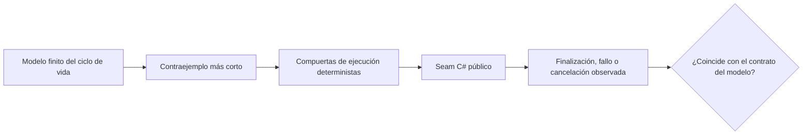

Las lecciones [6](../06-channels/), [7](../07-tpl-dataflow/), [8](../08-rx-net/) y [9](../09-choosing-streams/) ejecutan pipelines C#. Muestran qué hizo un ordenamiento elegido. Esta lección añade una herramienta complementaria: un [oráculo de especificación con redes de Petri](../../petri-nets/14-on-our-systems/) acotado que enumera cada marcado de un ciclo de vida deliberadamente pequeño.

El oráculo **no ejecuta** el pipeline de producción. Responde una pregunta más limitada antes de escribir la prueba de ejecución: ¿qué estados de éxito, fallo y cancelación debe distinguir esa prueba, y qué intercalado refutaría el contrato esperado?

## Empezar por el contrato, no por la API

El modelo ejecutable tiene un elemento, un productor, un consumidor y una plaza en la cola. Ejecútalo desde la raíz del repositorio:

```bash
dotnet test code/petri-nets/Tests -c Release --filter PipelineLifecycleTests
dotnet run --project code/petri-nets/Examples -c Release -- l14
```

Su grafo de alcanzabilidad completo tiene ocho marcados y tres marcados muertos terminales: `succeeded`, `failed` y `cancelled`. Las pruebas también demuestran el invariante de cola Channel `free + queued = 1`. Consulta la [lección Petri](../../petri-nets/14-on-our-systems/) para ver el modelo, el archivo PNML y la transcripción medida; esta lección se centra en traducir ese oráculo en mejores pruebas C#.



## Las mismas palabras no significan la misma capacidad

La primera mejora de diseño consiste en dejar de llamar «pipeline acotado» a tres cosas distintas.

| Mecanismo | Qué está acotado | Qué puede significar la plaza Petri `free` | Qué debe seguir explícito |
|---|---|---|---|
| [`Channel<T>`](https://learn.microsoft.com/dotnet/core/extensions/channels) | elementos en cola | una plaza disponible en la cola | la finalización del writer, el vaciado de la cola y el asentamiento del reader son observaciones separadas |
| [TPL Dataflow](https://learn.microsoft.com/dotnet/standard/parallel-programming/dataflow-task-parallel-library) | elementos en cola, en ejecución y salidas retenidas en un bloque de ejecución | no la plaza `free` actual; hay que refinar el modelo | finalización de bloques, consumo de salidas, fallos propagados y tareas recolectoras externas |
| [Rx.NET](https://github.com/dotnet/reactive) | nada por defecto | no hay equivalente hasta añadir un puente acotado | `OnCompleted`, `OnError`, liberación de la suscripción y asentamiento del trabajo planificado |

Por tanto, `free + queued = 1` es un invariante útil de la cola Channel, no una ley universal de backpressure. Copiarlo en una prueba de Dataflow o Rx produciría una demostración precisa del sistema equivocado.

## Convertir un contraejemplo en una prueba determinista

No traduzcas una transición Petri como `Task.Delay`. Tradúcela como una compuerta controlada por la prueba: [`TaskCompletionSource`](https://learn.microsoft.com/dotnet/api/system.threading.tasks.taskcompletionsource), una barrera, una dependencia falsa o un scheduler controlable.

| Camino del modelo | Ordenamiento de ejecución que forzar | Observación exigida en el seam público |
|---|---|---|
| `write → read → consume → settle_success` | liberar al consumidor después de una escritura aceptada | writer cerrado, elemento observado y tareas de productor y consumidor terminadas |
| `producer_fail → settle_producer_failure` | hacer fallar al productor antes de su primera escritura aceptada | el error es observable y ningún reader espera para siempre |
| `write → read → consumer_fail` | dejar que el consumidor tome el elemento y luego hacerlo fallar | el productor se desbloquea o cancela, y todas las tareas poseídas se esperan |
| `cancel` | solicitar la cancelación antes de iniciar el trabajo | se observa la cancelación y todos los participantes se asientan |

El oráculo actual de un elemento no puede reproducir un productor ya bloqueado por backpressure cuando falla el consumidor. Su transición de cancelación también es atómica y anterior al inicio. Son supuestos documentados, no resultados de prueba ausentes. Para cubrir esos ordenamientos, refina primero el modelo con al menos dos elementos y plazas separadas `cancel_requested`, `producer_settled` y `consumer_settled`; después deriva las compuertas de ejecución de los nuevos caminos más cortos.

## Diseño de pruebas por mecanismo

### `Channel<T>`

Usa un canal acotado con `capacity: 1` y conserva referencias a ambas tareas participantes. Una aserción de éxito debe esperar al writer, vaciar el reader y esperar al consumidor. Una aserción de fallo debe demostrar que la excepción cruza el seam público **y** que ningún participante queda incompleto. [`TryComplete(error)`](https://learn.microsoft.com/dotnet/api/system.threading.channels.channelwriter-1.trycomplete) es un evento; no demuestra que el reader haya observado el error.

El oráculo mejora la prueba haciendo visibles los tokens restantes. Si un marcado terminal aún contiene `queued` o `producer`, la prueba de ejecución análoga debe inspeccionar el elemento en cola o la tarea inacabada en vez de aceptar solo una excepción.

### TPL Dataflow

No reutilices el invariante de capacidad de Channel. El `BoundedCapacity` de un bloque de ejecución incluye un elemento mientras se ejecuta su delegado. Un propagador como `TransformBlock<TInput,TOutput>` también puede retener una salida terminada hasta que un destino la acepte o la prueba la consuma. Modela plazas separadas `queued`, `executing` y `output_buffered`, y expresa después el invariante del bloque realmente configurado.

Distingue también `PropagateCompletion` del asentamiento de todo el pipeline. Espera el `Completion` de cada bloque y cualquier tarea recolectora fuera del grafo. Un destino enlazado puede terminar mientras una tarea lateral aún posee trabajo; el oráculo debe dar su propia plaza a ese participante.

### Rx.NET

Rx no tiene un contrato de backpressure integrado, así que una plaza Petri acotada solo corresponde a Rx después de añadir un puente o una política de buffer explícita. Sin ellos, modela las notificaciones y la vida de la suscripción: `subscribed`, `next_in_flight`, `completed`, `errored`, `disposed` y, cuando corresponda, `scheduled_work_settled`.

Un scheduler de tiempo virtual controla el tiempo, no el trabajo asíncrono arbitrario. La prueba de ejecución debe observar por separado las tareas creadas fuera del scheduler. Liberar la suscripción no es `OnCompleted`, y ninguna de las dos cosas demuestra que el trabajo externo se haya asentado.

## Uso práctico en GA

Los ejemplos de GA de las lecciones 6 y 9 contienen justo los seams de ciclo de vida donde este método resulta rentable: generación acotada de voicings, un consumidor que puede detenerse antes y fallos de productor que deben llegar al llamador. Los ejemplos del curso reproducen la forma de esos mecanismos en revisiones fijadas; no son pruebas de los binarios actuales de GA.

Para un cambio en GA, sigue esta secuencia:

1. Fijar la revisión objetivo de GA y nombrar el seam público que se probará.
2. Escribir el modelo Petri acotado más pequeño que contenga el ordenamiento sospechoso.
3. Exigir un grafo de alcanzabilidad completo y clasificar cada marcado muerto como éxito, fallo o cancelación.
4. Extraer el contraejemplo más corto y reproducirlo con compuertas C# deterministas.
5. Corregir GA solo después de que una prueba de ejecución fallida demuestre que el camino modelado es real.
6. Conservar el modelo como oráculo de diseño y la prueba de ejecución como evidencia de implementación.

Esto es especialmente útil para errores de concurrencia que superan miles de iteraciones de estrés hasta que aparece un ordenamiento desafortunado. La red enumera un espacio de estados finito; la prueba C# demuestra que la API real sigue el mismo contrato de ciclo de vida.

## Ejercicios

1. Extiende el modelo a dos escrituras y deriva una prueba de Channel donde el segundo writer queda bloqueado cuando falla el consumidor.
2. Sustituye el mapeo de Channel por un [`TransformBlock`](https://learn.microsoft.com/dotnet/api/system.threading.tasks.dataflow.transformblock-2) de Dataflow. Define un invariante que cuente elementos en cola, en ejecución y salidas retenidas.
3. Modela la liberación de Rx por separado de la finalización y escribe una prueba de tiempo virtual que demuestre qué notificación se observa.
4. Elige un pipeline actual de GA. Registra su revisión exacta, seam público, tareas poseídas y observaciones terminales antes de proponer una corrección.

<details>
<summary>Pistas de solución</summary>

1. Añade un segundo token de trabajo y conserva un único token `free`. El camino de fallo mínimo debe llenar la plaza, iniciar la segunda escritura, hacer fallar al consumidor y dejar al segundo writer sin asentarse hasta que se active la política de fallo.
2. Separa `queued`, `executing` y `output_buffered`. Para este `TransformBlock` secuencial, prueba `free + queued + executing + output_buffered = configured capacity`, y consume la salida antes de esperar que se acepte la entrada siguiente. Si cambian el orden o el paralelismo, refina de nuevo el modelo en lugar de reutilizar esta ecuación sin cambios.
3. Da plazas terminales distintas a `disposed` y `completed`. Avanza el tiempo virtual hasta la notificación y verifica por separado que las tareas creadas externamente se hayan asentado.
4. Un registro suficiente nombra el SHA de commit, el método público, cada tarea o suscripción poseída, las compuertas forzadas, el resultado terminal esperado y el comando que lo reproduce.

</details>

## Qué recordar

- La red de Petri es un oráculo de especificación, no el runtime.
- Capacidad significa elementos en cola para el Channel modelado, pero elementos en cola, en ejecución y a veces salidas retenidas para un bloque Dataflow; Rx es ilimitado salvo que el diseño añada un límite.
- Cancelación solicitada, finalización señalada, cola vacía y asentamiento de cada participante son hechos distintos.
- Deriva compuertas deterministas de un contraejemplo mínimo; no dependas de pausas ni de la suerte de una prueba de estrés.
- Para GA, un modelo sugiere el ordenamiento de regresión, mientras una prueba contra una revisión fijada del repositorio aporta la evidencia.
