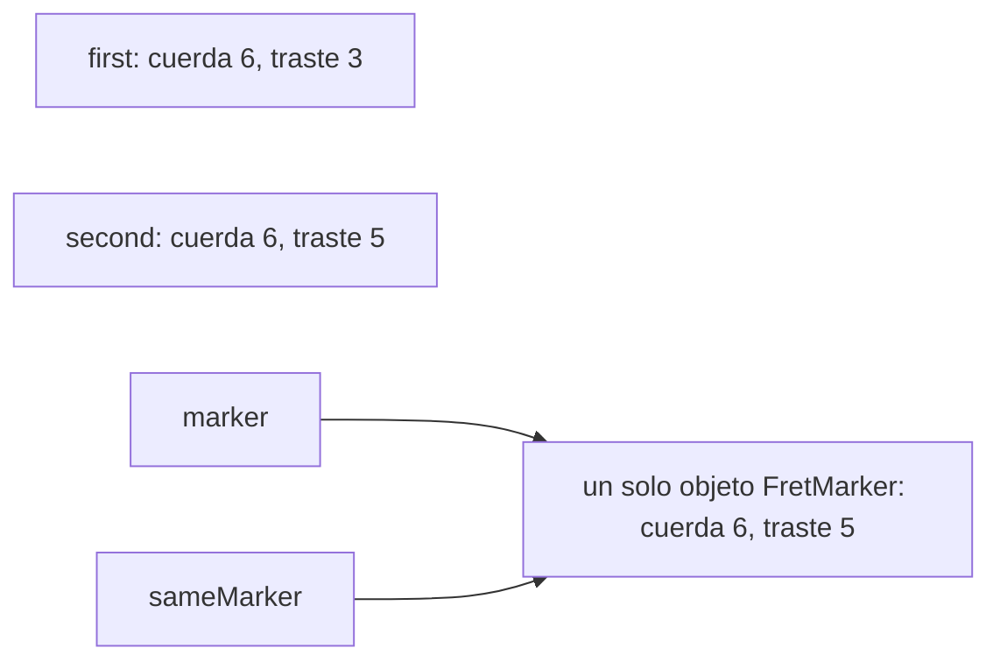

En la lección 5, dos variables de tipo clase podían señalar el mismo objeto, y un cambio hecho mediante una se veía mediante la otra. En cambio, muchas cosas que maneja un programa son simples datos: una posición en el mástil, una nota, la calidad de un acorde. Para ellas, compartir un solo objeto rara vez es lo que se busca. C# ofrece otras tres familias de tipos para eso: la [**estructura**](https://learn.microsoft.com/dotnet/csharp/language-reference/builtin-types/struct) (`struct`), que se copia entera en cada asignación; el [**record**](https://learn.microsoft.com/dotnet/csharp/language-reference/builtin-types/record), que se compara por sus datos; y la [**enumeración**](https://learn.microsoft.com/dotnet/csharp/language-reference/builtin-types/enum) (`enum`), una lista fija de opciones con nombre.

Todos los programas de esta lección están en [`code/csharp-beginner`](https://github.com/spareilleux/learn/tree/main/code/csharp-beginner); ejecuta uno con [`dotnet run`](https://learn.microsoft.com/dotnet/core/tools/dotnet-run) seguido de su ruta, por ejemplo `examples/l06_copies.cs`. `check.sh` compara sus salidas, y los errores del compilador de los fragmentos rechazados, con los archivos de `expected/`.

## Tipos de valor y tipos de referencia

Abajo, `FretPosition` es una estructura y `FretMarker` una clase. Guardan los mismos dos números, y el programa les hace lo mismo a las dos:

```csharp
// Una estructura es un tipo de valor: asignarla copia los datos
FretPosition first = new FretPosition(6, 3);    // sol en la cuerda mi grave
FretPosition second = first;
second.Fret = 5;
Console.WriteLine($"first: string {first.StringNumber}, fret {first.Fret}");
Console.WriteLine($"second: string {second.StringNumber}, fret {second.Fret}");

// Una clase es un tipo de referencia: asignarla copia la referencia (lección 5)
FretMarker marker = new FretMarker(6, 3);
FretMarker sameMarker = marker;
sameMarker.Fret = 5;
Console.WriteLine($"marker: string {marker.StringNumber}, fret {marker.Fret}");

// Un método recibe una copia de la estructura, y una copia de la referencia al objeto
MoveUpOctave(first);
MoveMarkerUpOctave(marker);
Console.WriteLine($"after the methods: first at fret {first.Fret}, marker at fret {marker.Fret}");

// Equals compara los campos de una estructura, las referencias de una clase
Console.WriteLine($"first.Equals(new FretPosition(6, 3)): {first.Equals(new FretPosition(6, 3))}");
Console.WriteLine($"marker.Equals(new FretMarker(6, 17)): {marker.Equals(new FretMarker(6, 17))}");

void MoveUpOctave(FretPosition position) => position.Fret += 12;
void MoveMarkerUpOctave(FretMarker target) => target.Fret += 12;

struct FretPosition
{
    public int StringNumber { get; set; }
    public int Fret { get; set; }

    public FretPosition(int stringNumber, int fret)
    {
        StringNumber = stringNumber;
        Fret = fret;
    }
}

sealed class FretMarker
{
    public int StringNumber { get; set; }
    public int Fret { get; set; }

    public FretMarker(int stringNumber, int fret)
    {
        StringNumber = stringNumber;
        Fret = fret;
    }
}
```

```text
first: string 6, fret 3
second: string 6, fret 5
marker: string 6, fret 5
after the methods: first at fret 3, marker at fret 17
first.Equals(new FretPosition(6, 3)): True
marker.Equals(new FretMarker(6, 17)): False
```

Una estructura es un [**tipo de valor**](https://learn.microsoft.com/dotnet/csharp/language-reference/builtin-types/value-types): la variable contiene los datos mismos. `second = first` copia los dos números en `second`, así que cambiar `second` no toca `first`. Una clase es un [**tipo de referencia**](https://learn.microsoft.com/dotnet/csharp/language-reference/keywords/reference-types): la variable contiene una referencia a un objeto, y `sameMarker = marker` copia la referencia. Sigue habiendo un solo marcador, y las dos variables lo ven moverse.



Los métodos siguen la misma regla. `MoveUpOctave` recibe una copia de `first` y mueve la copia, que desaparece cuando el método termina: `first` sigue en el traste 3. `MoveMarkerUpOctave` recibe una copia de la referencia, así que mueve el único marcador, del traste 5 al 17. La lección 4 mostraba lo mismo con un `int` y un array: los tipos numéricos de la lección 2, `bool` y `char` son estructuras; `string`, los arrays y `List<T>` son clases.

La comparación también sigue esta regla. El `Equals` de una estructura compara sus campos uno a uno ([`ValueType.Equals`](https://learn.microsoft.com/dotnet/api/system.valuetype.equals)), así que dos posiciones distintas en la cuerda 6, traste 3, son iguales. El `Equals` de una clase compara referencias: un marcador nuevo en el mismo lugar es otro objeto, de modo que no es igual.

### Dos errores con las estructuras

Una estructura que declaras no tiene operador `==`, salvo que escribas uno. El fragmento rechazado `compile_fail/l06_struct_equals.cs` lo intenta:

```csharp
FretPosition first = new FretPosition(6, 3);
Console.WriteLine(first == new FretPosition(6, 3));
```

```text
l06_struct_equals.cs(2,19): error CS0019: Operator '==' cannot be applied to operands of type 'FretPosition' and 'FretPosition'
```

El segundo error llega con las listas. `shape[0]` pide a la [`List<T>`](https://learn.microsoft.com/dotnet/api/system.collections.generic.list-1) su primer elemento, y para una estructura la lista devuelve una copia. Modificar una copia que se descarta enseguida no cambiaría nada, así que el compilador lo rechaza (`compile_fail/l06_list_struct_element.cs`):

```csharp
List<FretPosition> shape = [new FretPosition(6, 3), new FretPosition(5, 5)];
shape[0].Fret = 5;
```

```text
l06_list_struct_element.cs(2,1): error CS1612: Cannot modify the return value of 'List<FretPosition>.this[int]' because it is not a variable
```

Lee el elemento en una variable, modifica la variable y guárdala de nuevo con `shape[0] = position;`. El ejercicio 3 hace lo mismo en un solo paso, con `with`.

Las estructuras de esta sección solo son modificables para mostrar la copia. Las recomendaciones de Microsoft para [elegir entre una clase y una estructura](https://learn.microsoft.com/dotnet/standard/design-guidelines/choosing-between-class-and-struct) solo aconsejan una estructura para un valor pequeño que no cambia una vez creado, y una [`readonly struct`](https://learn.microsoft.com/dotnet/csharp/language-reference/builtin-types/struct#readonly-struct) hace que el compilador lo imponga. La sección siguiente muestra la forma corta de escribir una.

## Los records: comparados por sus datos

Un record declara, en una línea, un tipo hecho de valores con nombre:

```csharp
// Un record: el compilador escribe el constructor, las propiedades, ToString y la igualdad
Note c4 = new Note("C", 4);
Note middleC = new Note("C", 4);
Note c5 = c4 with { Octave = 5 };    // una copia con una propiedad cambiada

Console.WriteLine(c4);
Console.WriteLine(c5);
Console.WriteLine($"c4 == middleC: {c4 == middleC}");
Console.WriteLine($"same object: {ReferenceEquals(c4, middleC)}");
Console.WriteLine($"c4 == c5: {c4 == c5}");

// Una clase con los mismos datos compara referencias
NoteObject a = new NoteObject("C", 4);
NoteObject b = new NoteObject("C", 4);
Console.WriteLine($"two NoteObject: {a == b}");

// Un record struct es un tipo de valor con las mismas comodidades
Position g = new Position(6, 3);
Position a2 = g with { Fret = 5 };
Console.WriteLine($"{g} -> {a2}");
Console.WriteLine($"g == new Position(6, 3): {g == new Position(6, 3)}");

record Note(string Name, int Octave);

readonly record struct Position(int StringNumber, int Fret);

sealed class NoteObject
{
    public string Name { get; }
    public int Octave { get; }

    public NoteObject(string name, int octave)
    {
        Name = name;
        Octave = octave;
    }
}
```

```text
Note { Name = C, Octave = 4 }
Note { Name = C, Octave = 5 }
c4 == middleC: True
same object: False
c4 == c5: False
two NoteObject: False
Position { StringNumber = 6, Fret = 3 } -> Position { StringNumber = 6, Fret = 5 }
g == new Position(6, 3): True
```

`record Note(string Name, int Octave);` da a `Note` un constructor de dos parámetros, una propiedad pública para cada uno, un `ToString` que los muestra, y un `Equals` y un `==` que los comparan. Compáralo con las once líneas de `NoteObject`, que sigue sin `ToString` y compara referencias.

Un `record` es una clase: `c4` y `middleC` son dos objetos, como confirma [`ReferenceEquals`](https://learn.microsoft.com/dotnet/api/system.object.referenceequals), y aun así `c4 == middleC` vale `True`, porque sus datos son los mismos. La [expresión `with`](https://learn.microsoft.com/dotnet/csharp/language-reference/operators/with-expression) hace una copia con algunas propiedades cambiadas: `c5` es una nota nueva, y `c4` sigue en la octava 4.

`readonly record struct Position(...)` aplica la misma idea a un tipo de valor: se copia al asignarlo como las estructuras de la sección anterior, con un `==` y un `ToString` legible, y con propiedades que ya no pueden cambiar una vez construido el valor.

Las propiedades de `Note` son **init-only**: se les puede dar un valor al crear el record, nunca después. El fragmento rechazado `compile_fail/l06_record_init_only.cs` intenta `c4.Octave = 5;`:

```text
l06_record_init_only.cs(2,1): error CS8852: Init-only property or indexer 'Note.Octave' can only be assigned in an object initializer, or on 'this' or 'base' in an instance constructor or an 'init' accessor.
```

Para obtener una nota en otra octava, escribe `c4 with { Octave = 5 }`. En un simple `record struct`, sin `readonly`, las propiedades declaradas entre los paréntesis sí pueden cambiar después de la creación; la [página de los records](https://learn.microsoft.com/dotnet/csharp/language-reference/builtin-types/record) detalla las diferencias.

[Guitar Alchemist](https://github.com/GuitarAlchemist/ga) declara así sus posiciones en el mástil: [`public readonly record struct PositionLocation(Str Str, Fret Fret)`](https://github.com/GuitarAlchemist/ga/blob/5c3a52ab40d0d433f8f68dbbd0590f70c8d8cf26/Common/GA.Domain.Core/Instruments/Positions/PositionLocation.cs#L5), en el commit `5c3a52a`. Sus `Str` y [`Fret`](https://github.com/GuitarAlchemist/ga/blob/5c3a52ab40d0d433f8f68dbbd0590f70c8d8cf26/Common/GA.Domain.Core/Instruments/Primitives/Fret.cs#L16) son a su vez tipos `readonly record struct`, en lugar de simples `int`.

## Las enumeraciones: un conjunto fijo de nombres

La calidad de un acorde es una opción entre pocas: mayor, menor, disminuido… Una `enum` da un nombre a cada opción:

```csharp
// Una enum nombra un conjunto fijo de opciones; cada nombre representa un número
ChordQuality quality = ChordQuality.Minor;
Console.WriteLine(quality);
Console.WriteLine((int)quality);
Console.WriteLine($"A{Suffix(quality)}");

foreach (ChordQuality q in Enum.GetValues<ChordQuality>())
{
    Console.WriteLine($"{(int)q} {q}: C{Suffix(q)}");
}

ChordQuality unset = default;               // el valor 0
ChordQuality zero = 0;                      // el literal 0 se convierte sin cast
Console.WriteLine($"default: {unset}, 0: {zero}");

ChordQuality strange = (ChordQuality)7;     // un cast acepta cualquier int
Console.WriteLine($"cast from 7: {strange}, defined: {Enum.IsDefined(strange)}");

ChordQuality parsed = Enum.Parse<ChordQuality>("Diminished");
Console.WriteLine($"parsed: {parsed} = {(int)parsed}");

string Suffix(ChordQuality q) => q switch
{
    ChordQuality.Major => "",
    ChordQuality.Minor => "m",
    ChordQuality.Diminished => "dim",
    ChordQuality.Augmented => "aug",
    _ => "?",
};

enum ChordQuality
{
    Other,
    Major,
    Minor,
    Diminished,
    Augmented,
}
```

```text
Minor
2
Am
0 Other: C?
1 Major: C
2 Minor: Cm
3 Diminished: Cdim
4 Augmented: Caug
default: Other, 0: Other
cast from 7: 7, defined: False
parsed: Diminished = 3
```

Cada nombre representa un `int`, numerado desde 0 en el orden de la declaración: `Minor` vale 2. `Console.WriteLine` muestra el nombre, y el cast `(int)` da el número. [`Enum.GetValues<ChordQuality>()`](https://learn.microsoft.com/dotnet/api/system.enum.getvalues) enumera los valores, ordenados por número, y [`Enum.Parse`](https://learn.microsoft.com/dotnet/api/system.enum.parse) obtiene un valor a partir de su nombre escrito como texto. Una expresión `switch`, vista en la lección 3, es la forma habitual de dar a cada opción su propio resultado.

Una enumeración es un tipo de valor, y su valor predeterminado es 0, el primer nombre. Por eso las [recomendaciones de Microsoft para las enumeraciones](https://learn.microsoft.com/dotnet/standard/design-guidelines/enum) piden un miembro que valga cero y tenga sentido como valor predeterminado. El [`ChordQuality`](https://github.com/GuitarAlchemist/ga/blob/5c3a52ab40d0d433f8f68dbbd0590f70c8d8cf26/Common/GA.Domain.Core/Theory/Harmony/ChordQuality.cs#L10-L23) de Guitar Alchemist empieza por `Other` por esa razón; la enumeración más pequeña de esta lección copia la idea.

Números y nombres no se mezclan libremente. El literal `0` se convierte solo en cualquier enumeración, como muestra `zero`, pero cualquier otro número necesita un cast. El fragmento rechazado `compile_fail/l06_int_to_enum.cs` escribe `ChordQuality quality = 2;`:

```text
l06_int_to_enum.cs(1,24): error CS0266: Cannot implicitly convert type 'int' to 'ChordQuality'. An explicit conversion exists (are you missing a cast?)
```

El cast, por su parte, no comprueba nada: `(ChordQuality)7` se acepta y muestra `7`, un valor sin nombre. [`Enum.IsDefined`](https://learn.microsoft.com/dotnet/api/system.enum.isdefined) indica si un valor tiene nombre. La [referencia de las enumeraciones](https://learn.microsoft.com/dotnet/csharp/language-reference/builtin-types/enum#implicit-conversions-from-zero) advierte sobre ambas conversiones.

### Una expresión switch sobre una enum también necesita `_`

Como una enumeración puede contener números sin nombre, una expresión `switch` con un brazo por nombre sigue sin estar completa. `examples/l06_enum_switch_warning.cs`:

```csharp
ChordQuality quality = (ChordQuality)7;

// Cada nombre tiene su brazo, y aun así el compilador avisa: una enum puede contener otros números
string suffix = quality switch
{
    ChordQuality.Other => "?",
    ChordQuality.Major => "",
    ChordQuality.Minor => "m",
    ChordQuality.Diminished => "dim",
    ChordQuality.Augmented => "aug",
};
Console.WriteLine(suffix);
```

```text
l06_enum_switch_warning.cs(4,25): warning CS8524: The switch expression does not handle some values of its input type (it is not exhaustive) involving an unnamed enum value. For example, the pattern '(ChordQuality)5' is not covered.
Unhandled exception. System.Runtime.CompilerServices.SwitchExpressionException: Non-exhaustive switch expression failed to match its input.
Unmatched value was 7.
```

Se omiten las líneas de la traza de pila, que empiezan por `at`. La advertencia es [CS8524](https://learn.microsoft.com/dotnet/csharp/language-reference/compiler-messages/pattern-matching-warnings), prima del CS8509 de la lección 3. Su ejemplo, `(ChordQuality)5`, es el primer número después del último nombre, no el 7 con el que falla el programa. El brazo `_ => "?"` de `Suffix`, más arriba, cubre ambos.

## Ejercicios

### Ejercicio 1 — predecir las copias

Sin ejecutarlo, predice lo que muestra `exercises/l06_ex_predict.cs`. `Tempo` es una estructura, `Metronome` una clase.

```csharp
Tempo a = new Tempo(120);
Tempo b = a;
b.Bpm = 90;

Metronome m1 = new Metronome(120);
Metronome m2 = m1;
m2.Bpm = 90;

Console.WriteLine($"{a.Bpm} {b.Bpm} {m1.Bpm} {m2.Bpm}");

struct Tempo
{
    public int Bpm { get; set; }

    public Tempo(int bpm) => Bpm = bpm;
}

sealed class Metronome
{
    public int Bpm { get; set; }

    public Metronome(int bpm) => Bpm = bpm;
}
```

<details>
<summary>Solución</summary>

```text
120 90 90 90
```

`b = a` copia el tempo: `a` conserva 120. `m2 = m1` copia la referencia: solo hay un metrónomo, y está a 90 mediante ambas variables.

</details>

### Ejercicio 2 — los acordes de do mayor

Declara una enumeración `ChordQuality` con `Other`, `Major`, `Minor` y `Diminished`, y un record `Chord(string Root, ChordQuality Quality)` con un método `Symbol()` que devuelva `C`, `Dm` o `Bdim`. Pon los siete acordes de do mayor en una `List<Chord>`, muestra sus símbolos en una línea y comprueba con [`Contains`](https://learn.microsoft.com/dotnet/api/system.collections.generic.list-1.contains) si la lista contiene un nuevo `Chord("A", ChordQuality.Minor)`, y el mismo acorde convertido en mayor con `with`. La solución comprobada está en `exercises/l06_ex_chords.cs`.

<details>
<summary>Solución</summary>

```csharp
List<Chord> cMajor =
[
    new Chord("C", ChordQuality.Major),
    new Chord("D", ChordQuality.Minor),
    new Chord("E", ChordQuality.Minor),
    new Chord("F", ChordQuality.Major),
    new Chord("G", ChordQuality.Major),
    new Chord("A", ChordQuality.Minor),
    new Chord("B", ChordQuality.Diminished),
];

List<string> symbols = [];
foreach (Chord chord in cMajor)
{
    symbols.Add(chord.Symbol());
}
Console.WriteLine(string.Join(" ", symbols));

Chord am = new Chord("A", ChordQuality.Minor);
Chord aMajor = am with { Quality = ChordQuality.Major };
Console.WriteLine($"Contains {am.Symbol()}: {cMajor.Contains(am)}");
Console.WriteLine($"Contains {aMajor.Symbol()}: {cMajor.Contains(aMajor)}");

record Chord(string Root, ChordQuality Quality)
{
    public string Symbol() => Quality switch
    {
        ChordQuality.Major => Root,
        ChordQuality.Minor => $"{Root}m",
        ChordQuality.Diminished => $"{Root}dim",
        _ => $"{Root}?",
    };
}

enum ChordQuality
{
    Other,
    Major,
    Minor,
    Diminished,
}
```

```text
C Dm Em F G Am Bdim
Contains Am: True
Contains A: False
```

`Contains` compara con `Equals`. El objeto `am` nunca se puso en la lista, pero un record compara datos, así que encuentra el la menor de la lista. Con una clase que compara referencias, como `NoteObject`, la misma búsqueda responde `False`. Un record puede tener métodos después de su línea de declaración, entre llaves, como una clase.

</details>

### Ejercicio 3 — mover una forma de acorde

`List<Position> shape = [new Position(6, 3), new Position(5, 5), new Position(4, 5)];` es un power chord G5, con `readonly record struct Position(int StringNumber, int Fret)`. Sube la forma dos trastes, a A5, y muéstrala como `6:5 5:7 4:7`. `shape[i].Fret += 2` se rechaza: las propiedades de `Position` son init-only, y el compilador responde con el error CS8852 de la sección de los records (`compile_fail/l06_readonly_position.cs`). La solución comprobada está en `exercises/l06_ex_move_shape.cs`.

<details>
<summary>Solución</summary>

```csharp
// G5, un power chord: cuerda 6 traste 3, cuerda 5 traste 5, cuerda 4 traste 5
List<Position> shape = [new Position(6, 3), new Position(5, 5), new Position(4, 5)];

// shape[i].Fret += 2 se rechaza: se sustituye cada elemento por una copia movida
for (int i = 0; i < shape.Count; i++)
{
    shape[i] = shape[i] with { Fret = shape[i].Fret + 2 };
}

List<string> cells = [];
foreach (Position p in shape)
{
    cells.Add($"{p.StringNumber}:{p.Fret}");
}
Console.WriteLine(string.Join(" ", cells));

readonly record struct Position(int StringNumber, int Fret);
```

```text
6:5 5:7 4:7
```

`with` construye una copia movida, y `shape[i] = …` la guarda en lugar del elemento anterior. Con un tipo `readonly`, es la única forma: ni siquiera una variable local de tipo `Position` puede cambiar su `Fret`, y el compilador vuelve a responder CS8852.

</details>

## Lo que debes recordar

- Una estructura es un tipo de valor: asignarla, o pasarla a un método, copia los datos.
- Una clase es un tipo de referencia: asignarla copia la referencia, y ambas variables llegan al mismo objeto.
- Un record compara sus datos con `==` y `Equals`, los muestra con `ToString` y hace copias modificadas con `with`.
- Una enumeración nombra un conjunto fijo de opciones; cada nombre representa un número, y el valor predeterminado es 0.
- Un cast a una enumeración acepta cualquier número: compruébalo con `Enum.IsDefined`, y da a una expresión `switch` un brazo `_`.

La siguiente lección, [interfaces y herencia](../#plan), mostrará clases que comparten comportamiento.

## Fuentes

- [Tipos de valor](https://learn.microsoft.com/dotnet/csharp/language-reference/builtin-types/value-types), [tipos de referencia](https://learn.microsoft.com/dotnet/csharp/language-reference/keywords/reference-types), [tipos de estructura](https://learn.microsoft.com/dotnet/csharp/language-reference/builtin-types/struct), [valores predeterminados](https://learn.microsoft.com/dotnet/csharp/language-reference/builtin-types/default-values)
- [Records](https://learn.microsoft.com/dotnet/csharp/language-reference/builtin-types/record), [los records en los fundamentos de C#](https://learn.microsoft.com/dotnet/csharp/fundamentals/types/records), [la expresión `with`](https://learn.microsoft.com/dotnet/csharp/language-reference/operators/with-expression)
- [Comparaciones de igualdad](https://learn.microsoft.com/dotnet/csharp/programming-guide/statements-expressions-operators/equality-comparisons), [operadores de igualdad](https://learn.microsoft.com/dotnet/csharp/language-reference/operators/equality-operators), [`ValueType.Equals`](https://learn.microsoft.com/dotnet/api/system.valuetype.equals), [`Object.ReferenceEquals`](https://learn.microsoft.com/dotnet/api/system.object.referenceequals)
- [Tipos de enumeración](https://learn.microsoft.com/dotnet/csharp/language-reference/builtin-types/enum), [`Enum.GetValues`](https://learn.microsoft.com/dotnet/api/system.enum.getvalues), [`Enum.IsDefined`](https://learn.microsoft.com/dotnet/api/system.enum.isdefined), [`Enum.Parse`](https://learn.microsoft.com/dotnet/api/system.enum.parse)
- Recomendaciones de diseño: [elegir entre clase y estructura](https://learn.microsoft.com/dotnet/standard/design-guidelines/choosing-between-class-and-struct), [diseño de enumeraciones](https://learn.microsoft.com/dotnet/standard/design-guidelines/enum)
- [Advertencia del compilador CS8524](https://learn.microsoft.com/dotnet/csharp/language-reference/compiler-messages/pattern-matching-warnings)
