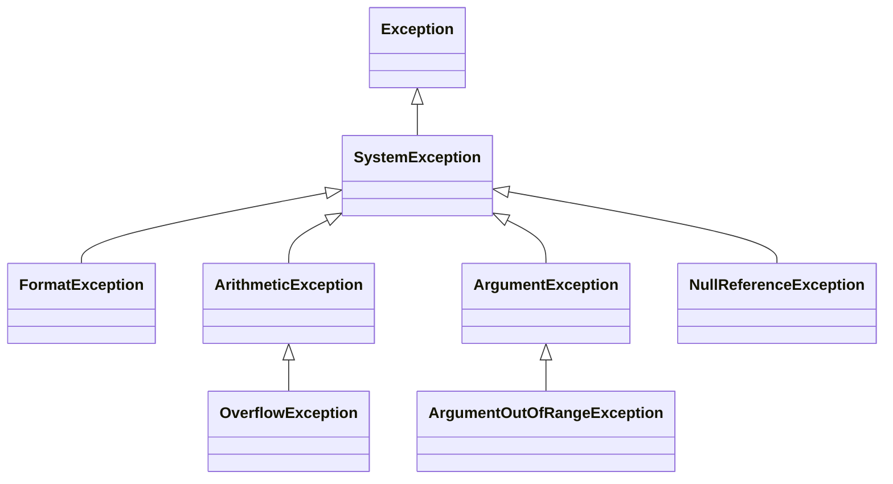

Varios programas de las lecciones anteriores terminaban con `Unhandled exception`: un `switch` sin brazo que coincidiera en la lección 3, un índice más allá del final de un array y una cadena `null` en la lección 4. Una [**excepción**](https://learn.microsoft.com/dotnet/csharp/fundamentals/exceptions/) es la forma en que .NET informa de un error que ocurre mientras un programa se ejecuta. Esta lección muestra cómo capturar una y seguir adelante, cómo garantizar que un código se ejecute siempre, y cómo lanzar una tú mismo. Su segunda mitad vuelve sobre `null`: el compilador puede encontrar la mayoría de los valores `null` que harían fallar un programa, si lees sus advertencias.

Todos los programas de esta lección están en [`code/csharp-beginner`](https://github.com/spareilleux/learn/tree/main/code/csharp-beginner); ejecuta uno con [`dotnet run`](https://learn.microsoft.com/dotnet/core/tools/dotnet-run) seguido de su ruta, por ejemplo `examples/l08_try_catch.cs`. `check.sh` compara sus salidas, y los errores del compilador de los fragmentos rechazados, con los archivos de `expected/`.

## Capturar una excepción: try y catch

[`int.Parse`](https://learn.microsoft.com/dotnet/api/system.int32.parse), visto en la lección 2, lanza una excepción cuando su texto no es un número. Una [instrucción `try`](https://learn.microsoft.com/dotnet/csharp/language-reference/statements/exception-handling-statements) la captura:

```csharp
// int.Parse lanza una excepción cuando el texto no es un número: catch la trata, y el bucle sigue
string[] inputs = ["5", "twelve", "99999999999", ""];

foreach (string text in inputs)
{
    try
    {
        int fret = int.Parse(text);
        Console.WriteLine($"'{text}': fret {fret}");
    }
    catch (FormatException ex)
    {
        Console.WriteLine($"'{text}': not a number ({ex.Message})");
    }
    catch (OverflowException)
    {
        Console.WriteLine($"'{text}': too large for an int");
    }
}

Console.WriteLine("done");
```

```text
'5': fret 5
'twelve': not a number (The input string 'twelve' was not in a correct format.)
'99999999999': too large for an int
'': not a number (The input string '' was not in a correct format.)
done
```

El bloque `try` contiene el código que puede fallar. Cuando una de sus instrucciones lanza una excepción, el resto del bloque se salta: para `twelve`, la línea que muestra el traste nunca se ejecuta. C# examina entonces las cláusulas `catch` en orden y ejecuta la primera cuyo tipo coincide con la excepción: una [`FormatException`](https://learn.microsoft.com/dotnet/api/system.formatexception) para un texto que no es un número, una [`OverflowException`](https://learn.microsoft.com/dotnet/api/system.overflowexception) para un número demasiado grande para un `int`. Después del bloque `catch`, el programa sigue tras toda la instrucción `try`, aquí con el texto siguiente del bucle, y llega a `done`.

`catch (FormatException ex)` llama `ex` al objeto excepción; su propiedad [`Message`](https://learn.microsoft.com/dotnet/api/system.exception.message) describe el error. `catch (OverflowException)` no le da nombre, porque ese bloque no necesita el objeto.

Si ningún `catch` coincide, la excepción sale del método y sube al código que lo llamó, después al que llamó a ese código, y así sucesivamente. Si nada la captura, el programa se detiene con `Unhandled exception`, como en las lecciones 3 y 4.

### Las excepciones son clases

Una excepción es un objeto, y su tipo es una clase derivada de [`Exception`](https://learn.microsoft.com/dotnet/api/system.exception), como en la lección 7. Estas son las excepciones de este curso y sus clases base:



Una cláusula `catch` también captura las clases derivadas de su tipo, así que `catch (Exception)` las captura todas. Por eso importa el orden de las cláusulas. En `compile_fail/l08_catch_order.cs`, `catch (Exception)` va primero, y la cláusula `FormatException` que le sigue nunca podría ejecutarse:

```csharp
try
{
    Console.WriteLine(int.Parse("twelve"));
}
catch (Exception)
{
    Console.WriteLine("something went wrong");
}
catch (FormatException)
{
    Console.WriteLine("not a number");
}
```

```text
l08_catch_order.cs(9,8): error CS0160: A previous catch clause already catches all exceptions of this or of a super type ('Exception')
```

Pon primero los tipos más precisos. Un `catch (Exception)` que esconde todos los errores tras un único mensaje vago hace que los bugs sean difíciles de encontrar: captura las excepciones que sabes tratar.

Segundo error: una variable asignada dentro de un bloque `try` puede seguir sin valor después de él. En `compile_fail/l08_unassigned_after_try.cs`, si `int.Parse` lanza una excepción, `fret` nunca recibe uno:

```csharp
int fret;
try
{
    fret = int.Parse("twelve");
}
catch (FormatException)
{
    Console.WriteLine("not a number");
}
Console.WriteLine(fret);
```

```text
l08_unassigned_after_try.cs(10,19): error CS0165: Use of unassigned local variable 'fret'
```

Dale un valor a la variable donde la declaras, úsala dentro del bloque `try`, o usa el `int.TryParse` de la lección 2, que no lanza ninguna excepción.

## finally: código que se ejecuta siempre

Un bloque `finally` se ejecuta cuando termina la instrucción `try`, sea cual sea la forma: normalmente, por un `return`, después de un `catch`, o con una excepción que sale del método.

```csharp
// finally se ejecuta en todos los casos: después de un return, después de un catch, y antes de que una excepción salga del método
Console.WriteLine(Tune("440"));
Console.WriteLine(Tune("A4"));

try
{
    Console.WriteLine(Tune("99999999999"));
}
catch (OverflowException)
{
    Console.WriteLine("caught by the caller: too large");
}

string Tune(string frequency)
{
    Console.WriteLine("tuner on");
    try
    {
        int hertz = int.Parse(frequency);
        return $"tuned to {hertz} Hz";
    }
    catch (FormatException)
    {
        return $"'{frequency}' is not a frequency";
    }
    finally
    {
        Console.WriteLine("tuner off");
    }
}
```

```text
tuner on
tuner off
tuned to 440 Hz
tuner on
tuner off
'A4' is not a frequency
tuner on
tuner off
caught by the caller: too large
```

`tuner off` aparece antes que `tuned to 440 Hz`: el método calcula su valor de retorno, ejecuta `finally`, y solo entonces devuelve el valor que muestra el llamador. Para `A4`, el `catch` devuelve un mensaje, y `finally` vuelve a ejecutarse. Para `99999999999`, `Tune` no tiene `catch` para una `OverflowException`: `finally` se ejecuta igualmente, después la excepción sale de `Tune`, y el `catch` del llamador la trata.

`finally` sirve para liberar lo que un método ha tomado, pase lo que pase: apagar el afinador aquí, cerrar un archivo en la lección 10.

## throw: cuando un método no puede hacer su trabajo

Un método puede lanzar él mismo una excepción, con [`throw`](https://learn.microsoft.com/dotnet/csharp/language-reference/statements/exception-handling-statements#the-throw-statement). Lo hace cuando no puede hacer lo que se le pide, en lugar de devolver una respuesta equivocada:

```csharp
// Un método que no puede hacer su trabajo lanza una excepción en lugar de devolver una respuesta equivocada
string[] standard = ["E2", "A2", "D3", "G3", "B3", "E4"];

Console.WriteLine(NoteOfString(standard, 6));
Console.WriteLine(NoteOfString(standard, 1));

try
{
    Console.WriteLine(NoteOfString(standard, 7));
}
catch (ArgumentOutOfRangeException ex)
{
    Console.WriteLine(ex.Message);
}

// Las cuerdas se numeran de 1, la más aguda, a 6, la más grave
string NoteOfString(string[] tuning, int stringNumber)
{
    if (stringNumber < 1 || stringNumber > tuning.Length)
    {
        throw new ArgumentOutOfRangeException(nameof(stringNumber), stringNumber, $"This tuning has strings 1 to {tuning.Length}.");
    }
    return tuning[tuning.Length - stringNumber];
}
```

```text
E2
E4
This tuning has strings 1 to 6. (Parameter 'stringNumber')
Actual value was 7.
```

`throw` crea un objeto excepción con `new` y lo envía hacia arriba, como las excepciones de .NET. [`ArgumentOutOfRangeException`](https://learn.microsoft.com/dotnet/api/system.argumentoutofrangeexception) es el tipo habitual para un argumento fuera de su rango válido; recibe el nombre del parámetro, su valor y un mensaje, y su `Message` añade los dos primeros al texto. [`nameof(stringNumber)`](https://learn.microsoft.com/dotnet/csharp/language-reference/operators/nameof) da el texto `"stringNumber"`, y sigue siendo correcto si cambias el nombre del parámetro.

Sin la comprobación, `NoteOfString(standard, 7)` calcularía el índice `-1` y fallaría con una `IndexOutOfRangeException` sobre un array que el llamador nunca vio. Con ella, el error nombra el argumento equivocado. Para las comprobaciones más comunes, `ArgumentOutOfRangeException` tiene métodos que hacen el `if` y el `throw` en una línea, como [`ThrowIfNegative`](https://learn.microsoft.com/dotnet/api/system.argumentoutofrangeexception.throwifnegative) y [`ThrowIfGreaterThan`](https://learn.microsoft.com/dotnet/api/system.argumentoutofrangeexception.throwifgreaterthan); los ejercicios 1 y 2 los usan.

Solo se puede lanzar una excepción. `compile_fail/l08_throw_string.cs` intenta `throw "fret out of range";`:

```text
l08_throw_string.cs(1,7): error CS0029: Cannot implicitly convert type 'string' to 'System.Exception'
```

¿Cuándo debe un método lanzar una excepción, y cuándo devolver un valor que diga que ha fallado? Una excepción es para una llamada que no debería haber ocurrido, como la cuerda 7 de una guitarra de seis cuerdas. Cuando un fallo es normal, como un usuario que escribe un número equivocado, es mejor un método que lo informe: el `int.TryParse` de la lección 2 devuelve `false` en lugar de lanzar una excepción. La guía de .NET de [procedimientos recomendados para excepciones](https://learn.microsoft.com/dotnet/standard/exceptions/best-practices-for-exceptions#call-try-methods-to-avoid-exceptions) recomienda estos métodos *Try*. Guitar Alchemist ofrece ambos para sus trastes: en el commit `5c3a52a`, el [constructor de `Fret`](https://github.com/GuitarAlchemist/ga/blob/5c3a52ab40d0d433f8f68dbbd0590f70c8d8cf26/Common/GA.Domain.Core/Instruments/Primitives/Fret.cs#L35-L43) comprueba que el número esté entre -1 (apagada) y 36 y documenta una `ArgumentOutOfRangeException`, mientras que [`Fret.TryCreate`](https://github.com/GuitarAlchemist/ga/blob/5c3a52ab40d0d433f8f68dbbd0590f70c8d8cf26/Common/GA.Domain.Core/Instruments/Primitives/Fret.cs#L92-L94) devuelve un resultado que contiene o bien el traste, o bien un mensaje de error. Una sonda en ese commit confirmó ambos, y encontró la misma comprobación detrás de `Fret.FromValue(50)` y de la conversión implícita `Fret f = 50;`: las tres lanzan una `ArgumentOutOfRangeException`, mientras que `Fret.TryCreate(50)` devuelve el error `Fret number must be between -1 (muted) and 36, got 50`.

## Seguridad frente a null: dejar que el compilador encuentre los null

La lección 4 presentó `string?`, los operadores `?.` y `??`, y la advertencia CS8602. Una [`NullReferenceException`](https://learn.microsoft.com/dotnet/api/system.nullreferenceexception) es la excepción que se obtiene cuando un programa lee un miembro de `null`. El [análisis de nulabilidad](https://learn.microsoft.com/dotnet/csharp/nullable-references) del compilador avisa antes de la ejecución, pero no siempre en la línea que falla. `examples/l08_null_warnings.cs` se ejecuta sin entrada:

```csharp
string? answer = Console.ReadLine();     // sin entrada: ReadLine devuelve null
string title = answer;                   // un string? entra en un string

Song song = new Song();
Console.WriteLine(song.Title.Length);    // ninguna advertencia en esta línea, y sin embargo Title es null

class Song
{
    public string Title { get; set; }    // ningún constructor la asigna
}
```

```text
l08_null_warnings.cs(2,16): warning CS8600: Converting null literal or possible null value to non-nullable type.
l08_null_warnings.cs(9,19): warning CS8618: Non-nullable property 'Title' must contain a non-null value when exiting constructor. Consider adding the 'required' modifier or declaring the property as nullable.
Unhandled exception. System.NullReferenceException: Object reference not set to an instance of an object.
```

El compilador las muestra en el orden de las líneas en Linux, pero Windows y macOS muestran primero la advertencia CS8618: el orden puede cambiar, las advertencias no. Dos advertencias, dos problemas distintos:

- **CS8600** en la línea 2: `answer` puede ser `null`, y `title` es un `string`, un tipo que promete no contener `null`. La promesa se rompe donde entra el valor.
- **CS8618** en la línea 9: `Title` es un `string`, pero ningún constructor le da un valor, así que un `Song` nuevo tiene un `Title` que es `null`. La advertencia está en la declaración de la propiedad. La línea que lee `song.Title.Length` no recibe ninguna, porque el compilador confía ahí en el tipo `string`, y es la línea que falla.

Una advertencia de nulabilidad señala el lugar por donde entra `null`, que puede estar lejos del lugar donde causa daño. Léelas todas. La [lista de advertencias de nulabilidad](https://learn.microsoft.com/dotnet/csharp/language-reference/compiler-messages/nullable-warnings) explica cada una, con sus correcciones habituales. Aquí, `examples/l08_null_fixed.cs` corrige las dos:

```csharp
// El mismo programa sin advertencias: ?? da un valor, required obliga al llamador a asignar Title
string title = Console.ReadLine() ?? "untitled";

Song song = new Song { Title = title };
Console.WriteLine($"{song.Title}: {song.Title.Length} letters");

class Song
{
    public required string Title { get; init; }
}
```

```text
untitled: 8 letters
```

`??` sustituye una respuesta `null` por `"untitled"`, así que `title` nunca es `null`. El modificador [`required`](https://learn.microsoft.com/dotnet/csharp/language-reference/keywords/required) hace que el compilador compruebe que cada `new Song` asigna `Title`, entre llaves después de la llamada al constructor; por eso CS8618 lo sugiere. `compile_fail/l08_required_missing.cs` lo olvida, con `new Song()` solo:

```text
l08_required_missing.cs(1,17): error CS9035: Required member 'Song.Title' must be set in the object initializer or attribute constructor.
```

Un título que falta es ahora un error en la compilación en lugar de un fallo en la ejecución. Declarar la propiedad `string?` sería la otra corrección, cuando una canción sin título tiene sentido: entonces cada uso de `Title` tiene que tratar `null`.

### `!` calla la advertencia, no el null

El [operador que permite valores null](https://learn.microsoft.com/dotnet/csharp/language-reference/operators/null-forgiving) `!`, después de una expresión, le dice al compilador: «esto no es `null`, confía en mí». La advertencia desaparece. El `null`, no:

```csharp
string? FindTuning(string name) => name == "standard" ? "E A D G B E" : null;

string tuning = FindTuning("drop D")!;   // ! calla la advertencia, no el null
Console.WriteLine(tuning.Length);
```

```text
Unhandled exception. System.NullReferenceException: Object reference not set to an instance of an object.
```

El programa compila sin advertencia y falla, exactamente como la versión de la lección 4 que tenía una advertencia. Usa `!` solo cuando sabes algo que el compilador no puede ver, y prefiere `??`, un `if` o una variable `string?`.

### Convertir las advertencias de nulabilidad en errores

Una advertencia no detiene la compilación, así que es fácil ignorarla. La propiedad `WarningsAsErrors` convierte advertencias en errores, y su valor `nullable` [selecciona todas las advertencias de nulabilidad](https://learn.microsoft.com/dotnet/csharp/language-reference/compiler-options/errors-warnings#warningsaserrors-and-warningsnotaserrors). Una aplicación basada en archivos define una propiedad con una línea [`#:property`](https://learn.microsoft.com/dotnet/core/sdk/file-based-apps#property) al principio; `compile_fail/l08_nullable_errors.cs` añade una a la advertencia de la lección 4:

```csharp
#:property WarningsAsErrors=nullable
string? FindTuning(string name) => name == "standard" ? "E A D G B E" : null;

string? tuning = FindTuning("drop D");
Console.WriteLine(tuning.Length);
```

```text
l08_nullable_errors.cs(5,19): error CS8602: Dereference of a possibly null reference.
```

El mismo CS8602 es ahora un error, y el programa no se ejecuta. En un proyecto, la propiedad va en el archivo `.csproj` de la lección 1: `<WarningsAsErrors>nullable</WarningsAsErrors>`.

Guitar Alchemist eligió lo contrario. En el commit `5c3a52a`, su [`Directory.Build.props`](https://github.com/GuitarAlchemist/ga/blob/5c3a52ab40d0d433f8f68dbbd0590f70c8d8cf26/Directory.Build.props#L19-L21) pone quince advertencias de nulabilidad en [`NoWarn`](https://learn.microsoft.com/dotnet/csharp/language-reference/compiler-options/errors-warnings#nowarn), la propiedad que silencia advertencias, «to achieve a clean baseline» (para lograr una base limpia), y su [`Directory.Build.targets`](https://github.com/GuitarAlchemist/ga/blob/5c3a52ab40d0d433f8f68dbbd0590f70c8d8cf26/Directory.Build.targets#L7) las enumera una segunda vez. El [diario](../journal/#2026-10-02--excepciones-y-seguridad-frente-a-null) midió lo que ocultan. Sin las dos listas, GA.Domain.Core y GA.Core compilan sin una sola advertencia de nulabilidad: las listas no ocultan nada hoy. Pero un archivo de prueba con siete errores de nulabilidad, añadido a GA.Domain.Core, compiló sin advertencias con las listas, y recibió sus siete advertencias sin ellas. Silenciar una advertencia también silencia los errores que aún están por venir.

## Ejercicios

### Ejercicio 1 — ¿por dónde va el programa?

Sin ejecutarlo, predice las líneas que muestra `exercises/l08_ex_predict.cs`. `ThrowIfGreaterThan(fret, 24)` lanza una `ArgumentOutOfRangeException` cuando `fret` es mayor que 24.

```csharp
Console.WriteLine("start");
try
{
    Console.WriteLine(Check(3));
    Console.WriteLine(Check(30));
    Console.WriteLine("after 30");
}
catch (ArgumentOutOfRangeException)
{
    Console.WriteLine("out of range");
}
finally
{
    Console.WriteLine("finally");
}
Console.WriteLine("end");

string Check(int fret)
{
    ArgumentOutOfRangeException.ThrowIfGreaterThan(fret, 24);
    return $"fret {fret}";
}
```

<details>
<summary>Solución</summary>

```text
start
fret 3
out of range
finally
end
```

`Check(30)` lanza una excepción dentro del bloque `try`, así que `after 30` se salta. El `catch` coincide, `finally` se ejecuta después, y el programa sigue con `end`: la excepción se ha tratado.

</details>

### Ejercicio 2 — un lector de trastes que no se detiene

Lee trastes escritos uno por línea hasta el final de la entrada. Escribe un método `ParseFret(string text)` que devuelva el traste, y lance una excepción cuando el texto no es un número o el traste está fuera de 0 a 24. El bucle captura las excepciones, muestra una línea por cada entrada, y al final muestra cuántos trastes eran válidos y el más alto. Con las líneas `3`, `12`, `x`, `30`, `-1` y `7` como entrada (`input/l08_ex_frets.txt`), el programa muestra la salida de abajo. La solución comprobada está en `exercises/l08_ex_frets.cs`.

<details>
<summary>Solución</summary>

```csharp
// Ejercicio 2: leer trastes, uno por línea, e informar de los malos sin detenerse
int valid = 0;
int highest = 0;
string? line;
while ((line = Console.ReadLine()) != null)
{
    try
    {
        int fret = ParseFret(line);
        valid++;
        highest = Math.Max(highest, fret);
        Console.WriteLine($"{line}: ok");
    }
    catch (FormatException)
    {
        Console.WriteLine($"{line}: not a number");
    }
    catch (ArgumentOutOfRangeException)
    {
        Console.WriteLine($"{line}: out of range (0 to 24)");
    }
}
Console.WriteLine($"{valid} valid frets, highest {highest}");

int ParseFret(string text)
{
    int fret = int.Parse(text);
    ArgumentOutOfRangeException.ThrowIfNegative(fret);
    ArgumentOutOfRangeException.ThrowIfGreaterThan(fret, 24);
    return fret;
}
```

```text
3: ok
12: ok
x: not a number
30: out of range (0 to 24)
-1: out of range (0 to 24)
7: ok
3 valid frets, highest 12
```

`ParseFret` no captura nada: `int.Parse` lanza la `FormatException` para `x`, y las dos comprobaciones lanzan una excepción para `30` y `-1`. El bucle decide qué hacer con cada excepción. `-1` es un `int` válido, así que `int.Parse` lo acepta, y `ThrowIfNegative` lo rechaza. Cuando se ejecuta `valid++`, el traste ha pasado todas las comprobaciones.

</details>

### Ejercicio 3 — eliminar las advertencias

`exercises/l08_ex_null_start.cs` compila con cuatro advertencias, y después falla:

```csharp
// Ejercicio 3, punto de partida: cuatro advertencias, y después un fallo
string? FindCapo(string song) => song == "Here Comes the Sun" ? "fret 7" : null;

Practice practice = new Practice();
practice.Song = "Blackbird";
string capo = FindCapo(practice.Song);
Console.WriteLine($"{practice.Song}: {capo.ToUpper()}");
Console.WriteLine($"notes: {practice.Notes.Length} letters");

class Practice
{
    public string Song { get; set; }
    public string Notes { get; set; }
}
```

```text
l08_ex_null_start.cs(6,15): warning CS8600: Converting null literal or possible null value to non-nullable type.
l08_ex_null_start.cs(7,39): warning CS8602: Dereference of a possibly null reference.
l08_ex_null_start.cs(12,19): warning CS8618: Non-nullable property 'Song' must contain a non-null value when exiting constructor. Consider adding the 'required' modifier or declaring the property as nullable.
l08_ex_null_start.cs(13,19): warning CS8618: Non-nullable property 'Notes' must contain a non-null value when exiting constructor. Consider adding the 'required' modifier or declaring the property as nullable.
Unhandled exception. System.NullReferenceException: Object reference not set to an instance of an object.
```

Corrígelo sin usar `!`: cada práctica tiene una canción, pero no siempre notas, y una canción sin cejilla muestra `NO CAPO`. Pruébalo después con dos prácticas, `Blackbird` sin notas y `Here Comes the Sun` con las notas `strum lightly`. La solución comprobada está en `exercises/l08_ex_null.cs`.

<details>
<summary>Solución</summary>

```csharp
// Ejercicio 3: el mismo programa sin advertencias, y sin !
string? FindCapo(string song) => song == "Here Comes the Sun" ? "fret 7" : null;

Practice[] week = [new Practice { Song = "Blackbird" }, new Practice { Song = "Here Comes the Sun", Notes = "strum lightly" }];

foreach (Practice practice in week)
{
    string capo = FindCapo(practice.Song) ?? "no capo";
    Console.WriteLine($"{practice.Song}: {capo.ToUpper()}");
    Console.WriteLine($"notes: {practice.Notes?.Length ?? 0} letters");
}

class Practice
{
    public required string Song { get; init; }
    public string? Notes { get; set; }
}
```

```text
Blackbird: NO CAPO
notes: 0 letters
Here Comes the Sun: FRET 7
notes: 13 letters
```

Cada advertencia tiene su propia corrección. `Song` siempre está, así que pasa a ser `required`. `Notes` puede faltar, así que pasa a ser `string?`, y la línea que la muestra trata `null` con `?.` y `??`. `FindCapo` puede devolver `null`, así que `??` le da un valor a `capo`. El fallo del programa de partida ocurría en la línea 7, la de la advertencia CS8602: `capo` era `null` para `Blackbird`.

</details>

## Lo que debes recordar

- `try` contiene código que puede fallar; el primer `catch` cuyo tipo coincide trata la excepción, y el programa sigue después de la instrucción `try`.
- Un `catch` también captura las clases derivadas de su tipo: pon primero los tipos más precisos (error CS0160).
- `finally` se ejecuta pase lo que pase: después de un `return`, después de un `catch`, o antes de que una excepción salga del método.
- Un método que no puede hacer su trabajo lanza una excepción, como `ArgumentOutOfRangeException`; cuando el fallo es normal, es mejor un método *Try* que devuelve `false`.
- Una advertencia de nulabilidad muestra por dónde entra `null`, que no siempre es donde falla el programa. Corrígela con `??`, `required`, `string?` o un `if`; `!` solo la esconde.
- `WarningsAsErrors` con el valor `nullable` convierte las advertencias de nulabilidad en errores.

La siguiente lección, [colecciones y LINQ](../09-collections-and-linq/), mostrará cómo guardar y consultar muchos valores a la vez.

## Fuentes

- [Excepciones y control de excepciones](https://learn.microsoft.com/dotnet/csharp/fundamentals/exceptions/), [instrucciones de control de excepciones: `throw`, `try`, `catch`, `finally`](https://learn.microsoft.com/dotnet/csharp/language-reference/statements/exception-handling-statements), [procedimientos recomendados para excepciones](https://learn.microsoft.com/dotnet/standard/exceptions/best-practices-for-exceptions)
- Tipos de excepción: [`Exception`](https://learn.microsoft.com/dotnet/api/system.exception), [`Exception.Message`](https://learn.microsoft.com/dotnet/api/system.exception.message), [`FormatException`](https://learn.microsoft.com/dotnet/api/system.formatexception), [`OverflowException`](https://learn.microsoft.com/dotnet/api/system.overflowexception), [`ArgumentOutOfRangeException`](https://learn.microsoft.com/dotnet/api/system.argumentoutofrangeexception), [`NullReferenceException`](https://learn.microsoft.com/dotnet/api/system.nullreferenceexception)
- [`nameof`](https://learn.microsoft.com/dotnet/csharp/language-reference/operators/nameof), [`required`](https://learn.microsoft.com/dotnet/csharp/language-reference/keywords/required), [`init`](https://learn.microsoft.com/dotnet/csharp/language-reference/keywords/init), [el operador que permite valores null `!`](https://learn.microsoft.com/dotnet/csharp/language-reference/operators/null-forgiving), [`??`](https://learn.microsoft.com/dotnet/csharp/language-reference/operators/null-coalescing-operator)
- [Tipos de referencia que aceptan valores null](https://learn.microsoft.com/dotnet/csharp/nullable-references), [advertencias de nulabilidad](https://learn.microsoft.com/dotnet/csharp/language-reference/compiler-messages/nullable-warnings), [`WarningsAsErrors`](https://learn.microsoft.com/dotnet/csharp/language-reference/compiler-options/errors-warnings#warningsaserrors-and-warningsnotaserrors), [`#:property` en las aplicaciones basadas en archivos](https://learn.microsoft.com/dotnet/core/sdk/file-based-apps#property)
- Errores del compilador [CS0160](https://learn.microsoft.com/dotnet/csharp/misc/cs0160) y [CS0165](https://learn.microsoft.com/dotnet/csharp/language-reference/compiler-messages/cs0165)
