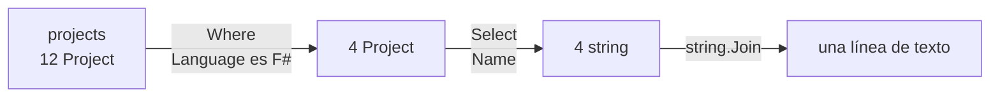

La `List<T>` de la lección 4 guarda sus elementos en orden y los encuentra por su posición. Otras dos colecciones responden a otras preguntas. Un **diccionario** responde a «¿cuál es el valor para este nombre?», y un **conjunto** responde a «¿está este valor en el grupo?». La segunda mitad de la lección presenta **LINQ**, una serie de métodos que cuentan, filtran y ordenan una colección, en una línea cada uno. Con ellos, los bucles que la lección 4 escribió a mano para los proyectos de Guitar Alchemist se convierten en una sola línea.

Todos los programas de esta lección están en [`code/csharp-beginner`](https://github.com/spareilleux/learn/tree/main/code/csharp-beginner); ejecuta uno con [`dotnet run`](https://learn.microsoft.com/dotnet/core/tools/dotnet-run) seguido de su ruta, por ejemplo `examples/l09_dictionary.cs`. `check.sh` compara sus salidas, y los errores del compilador de los fragmentos rechazados, con los archivos de `expected/`.

## Dictionary: un valor para cada clave

Un [`Dictionary<TKey, TValue>`](https://learn.microsoft.com/dotnet/api/system.collections.generic.dictionary-2) guarda pares: una **clave**, y el **valor** que le corresponde. Cada clave aparece una sola vez. Sus dos tipos van entre los corchetes angulares: `Dictionary<string, int>` tiene claves `string` y valores `int`. Aquí la clave es el nombre de una nota y el valor es su número de semitonos por encima de C, la tabla que la lección 3 escribió como un `switch`:

```csharp
// Un Dictionary<string, int>: el nombre de cada nota (la clave) da su número de semitonos por encima de C (el valor)
var semitones = new Dictionary<string, int>
{
    ["C"] = 0, ["D"] = 2, ["E"] = 4, ["F"] = 5, ["G"] = 7, ["A"] = 9, ["B"] = 11,
};
Console.WriteLine($"{semitones.Count} notes; G is {semitones["G"]} semitones above C");

semitones["F#"] = 6;            // una clave que aún no está: se añade
semitones.Add("Bb", 10);        // Add también añade...
try
{
    semitones.Add("C", 0);      // ...pero rechaza una clave que ya está
}
catch (ArgumentException ex)
{
    Console.WriteLine(ex.Message);
}
Console.WriteLine($"{semitones.Count} notes");

Console.WriteLine(semitones.ContainsKey("Bb"));
Console.WriteLine(semitones.ContainsKey("H"));   // H es B en la notación alemana, aquí no es una clave

if (semitones.TryGetValue("H", out int h))
{
    Console.WriteLine($"H is {h} semitones above C");
}
else
{
    Console.WriteLine("no H in this dictionary");
}

Console.WriteLine(string.Join(" ", semitones));   // cada elemento es un KeyValuePair<string, int>
```

```text
7 notes; G is 7 semitones above C
An item with the same key has already been added. Key: C
9 notes
True
False
no H in this dictionary
[C, 0] [D, 2] [E, 4] [F, 5] [G, 7] [A, 9] [B, 11] [F#, 6] [Bb, 10]
```

- `["C"] = 0` entre las llaves pone el valor 0 bajo la clave `"C"` al crear el diccionario.
- `semitones["G"]` lee el valor de una clave, con los mismos corchetes que un array, pero con una clave en lugar de una posición.
- `semitones["F#"] = 6` añade la clave si no está, y reemplaza su valor si está.
- [`Add`](https://learn.microsoft.com/dotnet/api/system.collections.generic.dictionary-2.add) también añade una clave, pero lanza una [`ArgumentException`](https://learn.microsoft.com/dotnet/api/system.argumentexception) si la clave ya está: el `catch` de la lección 8 muestra su mensaje.
- [`ContainsKey`](https://learn.microsoft.com/dotnet/api/system.collections.generic.dictionary-2.containskey) dice si una clave está.
- [`TryGetValue`](https://learn.microsoft.com/dotnet/api/system.collections.generic.dictionary-2.trygetvalue) es un método *Try*, como los de la lección 8: devuelve `false` cuando falta la clave, y pone el valor en su variable `out` cuando está.
- Cada elemento de un diccionario es un [`KeyValuePair<string, int>`](https://learn.microsoft.com/dotnet/api/system.collections.generic.keyvaluepair-2), con un `Key` y un `Value`; `string.Join` lo muestra como `[key, value]`.

Un diccionario guarda la tabla como datos, no como código: un programa puede llenarlo mientras se ejecuta, y la [lección 10](../10-files-and-text/) llenará uno a partir de un archivo.

Un diccionario se lee por clave, no por posición. Pedir el elemento 0 de un diccionario cuyas claves son cadenas es un error de tipo:

```csharp
var semitones = new Dictionary<string, int> { ["C"] = 0, ["D"] = 2, ["E"] = 4 };
Console.WriteLine(semitones[0]);
```

```text
l09_dictionary_by_position.cs(2,29): error CS1503: Argument 1: cannot convert from 'int' to 'string'
```

### Una clave que falta lanza una excepción

Leer una clave que no está en el diccionario no devuelve 0 ni `null`, lanza una excepción:

```csharp
// Leer una clave que no está en el diccionario lanza una excepción
var semitones = new Dictionary<string, int>
{
    ["C"] = 0, ["D"] = 2, ["E"] = 4, ["F"] = 5, ["G"] = 7, ["A"] = 9, ["B"] = 11,
};

string note = "H";
Console.WriteLine($"{note} is {semitones[note]} semitones above C");
```

```text
Unhandled exception. System.Collections.Generic.KeyNotFoundException: The given key 'H' was not present in the dictionary.
```

Se aplica la regla de la lección 8. Cuando una clave que falta es un bug del programa, el indexador `semitones[note]` y su [`KeyNotFoundException`](https://learn.microsoft.com/dotnet/api/system.collections.generic.keynotfoundexception) son lo correcto: el programa se detiene donde está el bug. Cuando una clave que falta es algo normal, como una nota escrita por un usuario, usa `TryGetValue`.

### Contar con un diccionario

Un diccionario puede contar: la clave es lo que cuentas, el valor es cuántas veces lo has visto.

```csharp
// Cuántas veces aparece cada nota en la primera frase de la Oda a la alegría de Beethoven
string[] melody = ["E", "E", "F", "G", "G", "F", "E", "D", "C", "C", "D", "E", "E", "D", "D"];

var counts = new Dictionary<string, int>();
foreach (string note in melody)
{
    counts[note] = counts.GetValueOrDefault(note) + 1;   // 0 + 1 la primera vez
}

foreach (var (note, count) in counts)
{
    Console.WriteLine($"{note}: {count}");
}
```

```text
E: 5
F: 2
G: 2
D: 4
C: 2
```

[`GetValueOrDefault`](https://learn.microsoft.com/dotnet/api/system.collections.generic.collectionextensions.getvalueordefault) devuelve el valor de la clave, o 0, el valor por defecto de un `int`, cuando la clave aún no está. El primer `E` guarda por tanto 0 + 1, y cada `E` siguiente reemplaza la cuenta por una más. `foreach (var (note, count) in counts)` descompone cada `KeyValuePair` en dos variables, su clave y su valor.

### No cuentes con el orden de un diccionario

Las notas salieron en el orden de su primera aparición: E, F, G, D, C. La documentación de `Dictionary` no lo promete; dice que el orden de los elementos no está definido: «The order in which the items are returned is undefined.» Esto es lo que hace .NET 10 cuando se quita una clave y después se añade otra:

```csharp
// El orden de un foreach sobre un diccionario: quitar una clave, añadir otra
var semitones = new Dictionary<string, int> { ["C"] = 0, ["D"] = 2, ["E"] = 4, ["G"] = 7, ["A"] = 9 };
Console.WriteLine(string.Join(" ", semitones.Keys));

semitones.Remove("D");
semitones.Add("F#", 6);
Console.WriteLine(string.Join(" ", semitones.Keys));
```

```text
C D E G A
C F# E G A
```

`F#` se añadió el último pero sale en segundo lugar, en el sitio que dejó `D`. Mientras un programa solo añade claves, el orden parece el orden en que se añadieron; basta un [`Remove`](https://learn.microsoft.com/dotnet/api/system.collections.generic.dictionary-2.remove) para romperlo. Cuando el orden importa, ordena: `OrderBy`, más abajo, lo hace, y el ejercicio 2 ordena las cuentas de la melodía. El [diario](../journal/#2026-10-02--colecciones-y-linq) registra este experimento, con la hipótesis escrita antes de ejecutarlo.

## HashSet: cada valor una sola vez

Un [`HashSet<T>`](https://learn.microsoft.com/dotnet/api/system.collections.generic.hashset-1) es un **conjunto**: guarda cada valor como mucho una vez, y responde rápido a «¿está este valor?». Las notas de un acorde son un conjunto: el acorde de do mayor es C, E y G, en cualquier orden, y añadir un segundo E no cambia el acorde.

```csharp
// Un HashSet<string> guarda cada valor una sola vez: las notas de un acorde
HashSet<string> cMajor = ["C", "E", "G"];
HashSet<string> aMinor = ["A", "C", "E"];

Console.WriteLine(cMajor.Add("E"));     // False: E ya está
Console.WriteLine(cMajor.Add("B"));     // True: C E G B es Cmaj7
Console.WriteLine($"{cMajor.Count} notes, contains G: {cMajor.Contains("G")}");
cMajor.Remove("B");

// IntersectWith, UnionWith y ExceptWith cambian el conjunto sobre el que se llaman: trabaja con una copia
var common = new HashSet<string>(cMajor);
common.IntersectWith(aMinor);
Console.WriteLine($"in both chords: {string.Join(" ", common)}");

var all = new HashSet<string>(cMajor);
all.UnionWith(aMinor);
Console.WriteLine($"in either chord: {string.Join(" ", all)}");

var onlyC = new HashSet<string>(cMajor);
onlyC.ExceptWith(aMinor);
Console.WriteLine($"only in C major: {string.Join(" ", onlyC)}");

HashSet<string> sameNotes = ["G", "C", "E"];
Console.WriteLine(cMajor.SetEquals(sameNotes));  // True: las mismas notas, escritas en otro orden

HashSet<string> cSharp = ["C#", "F", "G#"];
HashSet<string> dFlat = ["Db", "F", "Ab"];
Console.WriteLine(cSharp.SetEquals(dFlat));      // False: las cadenas difieren, los sonidos no
```

```text
False
True
4 notes, contains G: True
in both chords: C E
in either chord: C E G A
only in C major: G
True
False
```

- [`Add`](https://learn.microsoft.com/dotnet/api/system.collections.generic.hashset-1.add) devuelve `false` cuando el valor ya está en el conjunto, y no cambia nada.
- [`IntersectWith`](https://learn.microsoft.com/dotnet/api/system.collections.generic.hashset-1.intersectwith) conserva los valores que también están en el otro conjunto: C y E, las dos notas que comparten do mayor y la menor. [`UnionWith`](https://learn.microsoft.com/dotnet/api/system.collections.generic.hashset-1.unionwith) añade los valores del otro conjunto, y [`ExceptWith`](https://learn.microsoft.com/dotnet/api/system.collections.generic.hashset-1.exceptwith) los quita. Estos tres cambian el propio conjunto, así que el programa trabaja con copias hechas con `new HashSet<string>(cMajor)`.
- [`SetEquals`](https://learn.microsoft.com/dotnet/api/system.collections.generic.hashset-1.setequals) compara los contenidos e ignora el orden.

La última línea es un límite de este programa, no de `HashSet`. Do sostenido y re bemol son la misma tecla del piano, pero `"C#"` y `"Db"` son cadenas distintas, así que los dos conjuntos difieren. Un programa que deba tratarlas como la misma nota compara números, los semitonos del diccionario de arriba, en lugar de nombres.

Un conjunto no tiene posiciones. Su documentación dice que «is not sorted and cannot contain duplicate elements» (no está ordenado y no puede contener elementos duplicados), y no tiene indexador:

```csharp
HashSet<string> chord = ["C", "E", "G"];
Console.WriteLine(chord[0]);
```

```text
l09_hashset_index.cs(2,19): error CS0021: Cannot apply indexing with [] to an expression of type 'HashSet<string>'
```

| | `List<T>` | `Dictionary<TKey, TValue>` | `HashSet<T>` |
|---|---|---|---|
| Guarda | elementos en orden | un valor por clave | cada valor una sola vez |
| Buscar un elemento por | posición, `list[2]` | clave, `dict["G"]` | valor, `set.Contains("G")` |
| Un duplicado | se conserva | clave: `Add` lanza una excepción, `[key] =` reemplaza | `Add` devuelve `false` |
| Úsalo cuando | el orden importa | buscas cosas por nombre | preguntas «¿está?» |

## LINQ: contar, filtrar y ordenar en una línea

La lección 4 escribió un método con un bucle para cada pregunta sobre los proyectos de GA: cuántos empiezan por `GA.Business.`, cuáles están en F#, qué nombre es el más largo. [**LINQ**](https://learn.microsoft.com/dotnet/csharp/linq/) (*Language-Integrated Query*, consulta integrada en el lenguaje) es una serie de métodos que tienen todas las colecciones: arrays, listas, diccionarios y conjuntos. Cada método recibe un pequeño fragmento de código que dice qué buscar.

### Lambdas

Ese fragmento de código es una [**expresión lambda**](https://learn.microsoft.com/dotnet/csharp/language-reference/operators/lambda-expressions), un método sin nombre, escrito donde se usa. `Project` es un record, como los de la lección 6, con un nombre y un lenguaje:

```csharp
// Una lambda y un método con nombre que hacen el mismo trabajo
List<Project> projects =
[
    new Project("GA.Core", "C#"),
    new Project("GA.Business.Config", "F#"),
    new Project("GA.Business.DSL", "F#"),
];

Console.WriteLine(projects.Count(p => p.Language == "F#"));
Console.WriteLine(projects.Count(IsFSharp));

bool IsFSharp(Project p) => p.Language == "F#";

record Project(string Name, string Language);
```

```text
2
2
```

En `p => p.Language == "F#"`, a la izquierda de `=>` está el parámetro de la lambda, `p`; a la derecha, el valor que devuelve, aquí un `bool`. [`Count`](https://learn.microsoft.com/dotnet/api/system.linq.enumerable.count) la llama una vez por cada proyecto y cuenta las respuestas `true`. El método `IsFSharp`, escrito con `=>` como en la lección 8, hace el mismo trabajo, y `Count` también lo acepta; la lambda evita dar un nombre a un código que se usa en un solo sitio. El compilador deduce el tipo de `p` a partir de la colección: en una `List<Project>`, `p` es un `Project`.

### Where, Select, OrderBy y los demás

La lección 4 guardaba los proyectos en dos arrays que debían ir a la par. Con los records de la lección 6, cada proyecto es un solo objeto con un nombre y un lenguaje, y LINQ responde a cada pregunta en una línea:

```csharp
// Los doce proyectos de GuitarAlchemist/ga de la lección 4, como una sola lista de records, consultada con LINQ
List<Project> projects =
[
    new Project("GA.Core", "C#"),
    new Project("GA.Domain.Core", "C#"),
    new Project("GA.Business.Config", "F#"),
    new Project("GA.Business.Core", "C#"),
    new Project("GA.Business.DSL", "F#"),
    new Project("GA.Business.AI", "C#"),
    new Project("GA.Business.ML", "C#"),
    new Project("GA.Business.ProbabilisticGrammar", "F#"),
    new Project("GA.Business.Core.Generated", "F#"),
    new Project("GA.Infrastructure", "C#"),
    new Project("GA.Presentation", "C#"),
    new Project("GA.Testing.Semantic", "C#"),
];

int business = projects.Count(p => p.Name.StartsWith("GA.Business."));
Console.WriteLine($"{business} projects start with GA.Business.");

IEnumerable<string> fsharp = projects.Where(p => p.Language == "F#").Select(p => p.Name);
Console.WriteLine($"F#: {string.Join(", ", fsharp)}");

Project longest = projects.OrderByDescending(p => p.Name.Length).First();
Console.WriteLine($"Longest name: {longest.Name}");

Console.WriteLine("Sorted by language, then by name:");
foreach (Project project in projects.OrderBy(p => p.Language).ThenBy(p => p.Name).Take(4))
{
    Console.WriteLine($"  {project.Language} {project.Name}");
}

Console.WriteLine($"Any F#? {projects.Any(p => p.Language == "F#")}");
Console.WriteLine($"All start with GA.? {projects.All(p => p.Name.StartsWith("GA."))}");

Project? rust = projects.FirstOrDefault(p => p.Language == "Rust");
Console.WriteLine(rust?.Name ?? "no Rust project");

List<string> csharp = projects.Where(p => p.Language == "C#").Select(p => p.Name).ToList();
Console.WriteLine($"{csharp.Count} C# projects, the first is {csharp[0]}");

record Project(string Name, string Language);
```

```text
7 projects start with GA.Business.
F#: GA.Business.Config, GA.Business.DSL, GA.Business.ProbabilisticGrammar, GA.Business.Core.Generated
Longest name: GA.Business.ProbabilisticGrammar
Sorted by language, then by name:
  C# GA.Business.AI
  C# GA.Business.Core
  C# GA.Business.ML
  C# GA.Core
Any F#? True
All start with GA.? True
no Rust project
8 C# projects, the first is GA.Core
```

Las respuestas son las de la lección 4, sin sus tres métodos ni sus bucles. Una cadena de métodos se lee de izquierda a derecha, y cada método trabaja con lo que devolvió el anterior:



| Método | Devuelve | Aquí |
|---|---|---|
| `Count` | cuántos elementos cumplen la condición | 7 proyectos empiezan por `GA.Business.` |
| [`Where`](https://learn.microsoft.com/dotnet/api/system.linq.enumerable.where) | los elementos que cumplen la condición | los proyectos F# |
| [`Select`](https://learn.microsoft.com/dotnet/api/system.linq.enumerable.select) | un valor nuevo por elemento | el nombre de cada proyecto |
| [`OrderBy`](https://learn.microsoft.com/dotnet/api/system.linq.enumerable.orderby), [`OrderByDescending`](https://learn.microsoft.com/dotnet/api/system.linq.enumerable.orderbydescending), [`ThenBy`](https://learn.microsoft.com/dotnet/api/system.linq.enumerable.thenby) | los elementos, ordenados por una clave; `ThenBy` desempata | por lenguaje, después por nombre |
| [`First`](https://learn.microsoft.com/dotnet/api/system.linq.enumerable.first), [`FirstOrDefault`](https://learn.microsoft.com/dotnet/api/system.linq.enumerable.firstordefault) | el primer elemento (que cumple la condición) | el nombre más largo; ningún proyecto Rust |
| [`Any`](https://learn.microsoft.com/dotnet/api/system.linq.enumerable.any), [`All`](https://learn.microsoft.com/dotnet/api/system.linq.enumerable.all) | si un elemento, o todos, cumplen la condición | `True`, `True` |
| [`Take`](https://learn.microsoft.com/dotnet/api/system.linq.enumerable.take) | los *n* primeros elementos | solo cuatro líneas |
| [`ToList`](https://learn.microsoft.com/dotnet/api/system.linq.enumerable.tolist) | una `List<T>` nueva con los elementos | los proyectos C# |

`First` lanza una [`InvalidOperationException`](https://learn.microsoft.com/dotnet/api/system.invalidoperationexception) cuando ningún elemento cumple la condición; `FirstOrDefault` devuelve `null` en su lugar, así que su resultado es un `Project?`, y `?.` y `??`, de la lección 8, tratan el proyecto que falta. `OrderBy` hace una ordenación *estable*, según su documentación: dos proyectos con la misma clave conservan su orden, y `ThenBy` decide entre ellos.

`Where` y `Select` devuelven un [`IEnumerable<T>`](https://learn.microsoft.com/dotnet/api/system.collections.generic.ienumerable-1), una secuencia que se puede leer con `foreach`, no una `List<T>`. Poner el resultado en una variable de tipo lista es un error, y `ToList` es la solución:

```csharp
List<string> names = ["GA.Core", "GA.Business.DSL", "GA.Business.AI"];
List<string> business = names.Where(n => n.StartsWith("GA.Business."));
```

```text
l09_where_is_not_a_list.cs(2,25): error CS0266: Cannot implicitly convert type 'System.Collections.Generic.IEnumerable<string>' to 'System.Collections.Generic.List<string>'. An explicit conversion exists (are you missing a cast?)
```

La lambda que se le da a `Where` debe devolver un `bool`, «lo conservo o no». Una lambda que devuelve un número recibe dos errores en el mismo lugar:

```csharp
List<string> names = ["GA.Core", "GA.Business.DSL", "GA.Business.AI"];
var longNames = names.Where(n => n.Length);
```

```text
l09_lambda_not_bool.cs(2,34): error CS0029: Cannot implicitly convert type 'int' to 'bool'
l09_lambda_not_bool.cs(2,34): error CS1662: Cannot convert lambda expression to intended delegate type because some of the return types in the block are not implicitly convertible to the delegate return type
```

`n => n.Length > 20` devuelve un `bool` y compila.

### Una consulta se ejecuta cuando se lee

`Where` no calcula su resultado cuando se ejecuta la línea. Devuelve una consulta que lo calcula cada vez que algo la lee, con un `foreach`, `string.Join` o `ToList`:

```csharp
// Una consulta se ejecuta cuando se lee, no cuando se escribe; ToList guarda el resultado de una ejecución
List<int> frets = [0, 3, 5, 7];

IEnumerable<int> high = frets.Where(f => f >= 5);
List<int> highNow = frets.Where(f => f >= 5).ToList();

frets.Add(12);

Console.WriteLine($"query:  {string.Join(" ", high)}");
Console.WriteLine($"ToList: {string.Join(" ", highNow)}");
```

```text
query:  5 7 12
ToList: 5 7
```

El traste 12 se añadió después de las dos líneas, y la consulta lo encuentra igualmente, porque `string.Join` la ejecutó después del `Add`. `ToList` la ejecutó una vez, antes del `Add`, y guardó ese resultado. Esto se llama [ejecución diferida](https://learn.microsoft.com/dotnet/standard/linq/deferred-execution-lazy-evaluation). Llama a `ToList` cuando quieras el resultado tal como está ahora, o cuando vayas a leerlo varias veces.

## No cambies una colección dentro de su propio foreach

Un `foreach` sobre una lista se detiene con una excepción si la lista cambia durante el bucle:

```csharp
// Quitar elementos de una lista dentro de un foreach sobre esa misma lista
List<string> strings = ["E2", "A2", "D3", "G3", "B3", "E4"];

foreach (string s in strings)
{
    if (s.StartsWith("E"))
    {
        strings.Remove(s);
    }
}

Console.WriteLine(string.Join(" ", strings));
```

```text
Unhandled exception. System.InvalidOperationException: Collection was modified; enumeration operation may not execute.
```

El `foreach` no puede saber qué elemento viene después una vez que la lista ha movido sus elementos, así que se niega a continuar. El ejercicio 3 quita las cuerdas de mi de dos formas que funcionan.

Un diccionario es una excepción a la regla. Desde .NET Core 3.0, su documentación dice que `Remove` «may be safely called without invalidating active enumerators» (puede llamarse con seguridad sin invalidar los enumeradores activos). Añadir una clave sigue deteniendo el bucle:

```csharp
// Un diccionario permite Remove dentro de su propio foreach, pero no añadir una clave
var semitones = new Dictionary<string, int> { ["C"] = 0, ["D"] = 2, ["E"] = 4 };

foreach (var (name, value) in semitones)
{
    if (name == "D")
    {
        semitones.Remove(name);
    }
}
Console.WriteLine($"after Remove: {string.Join(" ", semitones.Keys)}");

try
{
    foreach (var (name, value) in semitones)
    {
        if (name == "C")
        {
            semitones["B"] = 11;
        }
    }
}
catch (InvalidOperationException ex)
{
    Console.WriteLine($"adding a key: {ex.Message}");
}
```

```text
after Remove: C E
adding a key: Collection was modified; enumeration operation may not execute.
```

## En Guitar Alchemist

En el commit `5c3a52a`, Guitar Alchemist usa las tres colecciones de esta lección, y LINQ, en código que un principiante puede leer.

**Un diccionario que resuelve el problema de do sostenido y re bemol.** [`ChordVocabulary.PitchClasses`](https://github.com/GuitarAlchemist/ga/blob/5c3a52ab40d0d433f8f68dbbd0590f70c8d8cf26/Common/GA.Business.ML/Agents/ChordVocabulary.cs#L23) asocia cada forma de escribir una nota con su *clase de altura*, su número de semitonos por encima de C, de 0 a 11, como el primer diccionario de esta lección. `"C#"` y `"Db"` dan ambos 1: un programa que convierte los nombres en números antes de compararlos trata los dos como la misma nota. El diccionario se crea con [`StringComparer.OrdinalIgnoreCase`](https://learn.microsoft.com/dotnet/api/system.stringcomparer.ordinalignorecase), que hace que `"c#"` encuentre la clave `"C#"`, y [`TryGetPitchClass`](https://github.com/GuitarAlchemist/ga/blob/5c3a52ab40d0d433f8f68dbbd0590f70c8d8cf26/Common/GA.Business.ML/Agents/ChordVocabulary.cs#L35) lo lee con `TryGetValue`, porque un usuario puede escribir una nota que no existe. Las observaciones de la clase explican por qué existe: dos copias de la tabla «had drifted in a load-bearing way» (se habían separado en un punto del que dependía el código). En ese commit, 18 archivos de GA asocian `"Db"` a 1 en una tabla propia, esta incluida.

**Un conjunto que mantiene sus notas en orden.** [`PitchClassSet`](https://github.com/GuitarAlchemist/ga/blob/5c3a52ab40d0d433f8f68dbbd0590f70c8d8cf26/Common/GA.Domain.Core/Theory/Atonal/PitchClassSet.cs#L28), el conjunto de notas de GA, implementa [`IReadOnlySet<PitchClass>`](https://learn.microsoft.com/dotnet/api/system.collections.generic.ireadonlyset-1), la interfaz de un conjunto que no se puede modificar, y guarda sus notas en un [`ImmutableSortedSet`](https://learn.microsoft.com/dotnet/api/system.collections.immutable.immutablesortedset-1) ([línea 37](https://github.com/GuitarAlchemist/ga/blob/5c3a52ab40d0d433f8f68dbbd0590f70c8d8cf26/Common/GA.Domain.Core/Theory/Atonal/PitchClassSet.cs#L37)). A diferencia de un `HashSet`, siempre da sus notas en orden creciente, de 0 a 11, y dos conjuntos con las mismas notas son iguales ([línea 780](https://github.com/GuitarAlchemist/ga/blob/5c3a52ab40d0d433f8f68dbbd0590f70c8d8cf26/Common/GA.Domain.Core/Theory/Atonal/PitchClassSet.cs#L780)).

**Una ordenación que un diccionario conserva por casualidad.** `MusicalKnowledgeService` cuenta las entradas de cada artista en los datos musicales de GA. La [línea 226](https://github.com/GuitarAlchemist/ga/blob/5c3a52ab40d0d433f8f68dbbd0590f70c8d8cf26/Common/GA.Business.Config/Configuration/MusicalKnowledgeService.cs#L226) dice `foreach (var artist in GetAllArtists().Take(20)) // Top 20 artists`, y la [línea 235](https://github.com/GuitarAlchemist/ga/blob/5c3a52ab40d0d433f8f68dbbd0590f70c8d8cf26/Common/GA.Business.Config/Configuration/MusicalKnowledgeService.cs#L235) devuelve `breakdown.OrderByDescending(kvp => kvp.Value).ToDictionary(kvp => kvp.Key, kvp => kvp.Value)`. Dos puntos de esta lección se encuentran ahí:

- `GetAllArtists` termina con `OrderBy(a => a)` ([línea 125](https://github.com/GuitarAlchemist/ga/blob/5c3a52ab40d0d433f8f68dbbd0590f70c8d8cf26/Common/GA.Business.Config/Configuration/MusicalKnowledgeService.cs#L125)): los artistas llegan en orden alfabético, así que `Take(20)` se queda con los 20 primeros del alfabeto, no con los 20 que tienen más entradas. La ordenación por número de entradas llega después del corte.
- [`ToDictionary`](https://learn.microsoft.com/dotnet/api/system.linq.enumerable.todictionary) pone el resultado ordenado en un diccionario, cuyo orden no está prometido. Sale ordenado porque no se quita nada de él, como muestra el experimento de esta lección; una lista conservaría el orden con seguridad.

Una [sonda](https://github.com/spareilleux/learn/blob/main/code/csharp-beginner/ga-probes/artists.cs) ejecutó este código en ese commit y encontró otra cosa: solo 16 artistas, así que `Take(20)` todavía no deja fuera a ninguno. Tres de los cuatro archivos YAML que lee el servicio no se cargan:

- en `ChordProgressions.yaml`, [`Function`](https://github.com/GuitarAlchemist/ga/blob/5c3a52ab40d0d433f8f68dbbd0590f70c8d8cf26/Common/GA.Business.Config/ChordProgressions.yaml#L93) es una sola cadena donde la clase de C# espera una `List<string>` ([línea 16](https://github.com/GuitarAlchemist/ga/blob/5c3a52ab40d0d433f8f68dbbd0590f70c8d8cf26/Common/GA.Business.Config/Configuration/ChordProgressionsConfigLoader.cs#L16));
- en `GuitarTechniques.yaml`, [`Applications`](https://github.com/GuitarAlchemist/ga/blob/5c3a52ab40d0d433f8f68dbbd0590f70c8d8cf26/Common/GA.Business.Config/GuitarTechniques.yaml#L23) contiene cadenas donde la clase espera objetos ([línea 20](https://github.com/GuitarAlchemist/ga/blob/5c3a52ab40d0d433f8f68dbbd0590f70c8d8cf26/Common/GA.Business.Config/Configuration/GuitarTechniquesConfigLoader.cs#L20));
- la [línea 95](https://github.com/GuitarAlchemist/ga/blob/5c3a52ab40d0d433f8f68dbbd0590f70c8d8cf26/Common/GA.Business.Config/SpecializedTunings.yaml#L95) de `SpecializedTunings.yaml` no es YAML válido.

Cada cargador [captura la excepción](https://github.com/GuitarAlchemist/ga/blob/5c3a52ab40d0d433f8f68dbbd0590f70c8d8cf26/Common/GA.Business.Config/Configuration/ChordProgressionsConfigLoader.cs#L137), muestra una línea y sigue con un solo elemento de ejemplo. Es lo contrario de la regla de la lección 8: este `catch` oculta un error en lugar de tratar un fallo normal. La [tabla QA del diario](../journal/#qa) registra las mediciones; la [lección 10](../10-files-and-text/) lee archivos.

## Ejercicios

### Ejercicio 1 — predecir la salida

Anota lo que muestra cada línea, y después ejecuta `exercises/l09_ex_predict.cs`:

```csharp
// Ejercicio 1: anota lo que muestra cada línea, y después ejecuta el programa
HashSet<string> notes = ["C", "E", "G"];
Console.WriteLine(notes.Add("E"));
Console.WriteLine(notes.Count);

var capos = new Dictionary<string, int> { ["Here Comes the Sun"] = 7 };
capos["Blackbird"] = 0;
capos["Here Comes the Sun"] = 2;
Console.WriteLine(capos.Count);
Console.WriteLine(capos["Here Comes the Sun"]);

List<int> frets = [3, 0, 12, 5];
IEnumerable<int> sorted = frets.OrderBy(f => f);
frets.Add(1);
Console.WriteLine(string.Join(" ", sorted));
```

<details>
<summary>Solución</summary>

```text
False
3
2
2
0 1 3 5 12
```

- `Add("E")` devuelve `False`: E ya está en el conjunto, que conserva 3 notas.
- `capos["Here Comes the Sun"] = 2` reemplaza el valor de una clave que ya está; no añade nada, así que el diccionario tiene 2 claves, y el valor es ahora 2.
- `OrderBy` devuelve una consulta, que se ejecuta cuando `string.Join` la lee, después del `Add`: el 1 está en el resultado.

</details>

### Ejercicio 2 — las notas más frecuentes primero

Parte de `examples/l09_count_notes.cs` y muestra las cuentas de la nota más frecuente a la menos frecuente; las notas con la misma cuenta van en orden alfabético. Usa `OrderByDescending` y `ThenBy` sobre el diccionario: cada elemento es un `KeyValuePair`, con `Key` y `Value`.

<details>
<summary>Solución</summary>

```csharp
// Ejercicio 2: las notas de la melodía, la más frecuente primero; las cuentas iguales en orden alfabético
string[] melody = ["E", "E", "F", "G", "G", "F", "E", "D", "C", "C", "D", "E", "E", "D", "D"];

var counts = new Dictionary<string, int>();
foreach (string note in melody)
{
    counts[note] = counts.GetValueOrDefault(note) + 1;
}

foreach (var (note, count) in counts.OrderByDescending(pair => pair.Value).ThenBy(pair => pair.Key))
{
    Console.WriteLine($"{note}: {count}");
}
```

```text
E: 5
D: 4
C: 2
F: 2
G: 2
```

Sin `ThenBy`, C, F y G conservarían el orden del diccionario, porque la ordenación es estable, y ese orden no está prometido. `ThenBy(pair => pair.Key)` hace que la salida sea la misma haga lo que haga el diccionario.

</details>

### Ejercicio 3 — quitar las cuerdas de mi

Corrige `examples/l09_modify_while_looping.cs` para que muestre `A2 D3 G3 B3` sin cambiar la lista dentro de su propio `foreach`. Encuentra dos formas: una que cambia la lista, con [`List<T>.RemoveAll`](https://learn.microsoft.com/dotnet/api/system.collections.generic.list-1.removeall), y otra que construye una lista nueva con LINQ y conserva la original.

<details>
<summary>Solución</summary>

```csharp
// Ejercicio 3: quitar las cuerdas de mi sin cambiar la lista dentro de su propio foreach
List<string> strings = ["E2", "A2", "D3", "G3", "B3", "E4"];

// RemoveAll recibe una lambda y quita cada elemento para el que devuelve true
List<string> first = new List<string>(strings);
first.RemoveAll(s => s.StartsWith("E"));
Console.WriteLine(string.Join(" ", first));

// O construir una lista nueva con Where, y conservar la original
List<string> second = strings.Where(s => !s.StartsWith("E")).ToList();
Console.WriteLine(string.Join(" ", second));
Console.WriteLine(string.Join(" ", strings));
```

```text
A2 D3 G3 B3
A2 D3 G3 B3
E2 A2 D3 G3 B3 E4
```

`RemoveAll` recorre la propia lista y mueve los elementos que conserva, así que ningún `foreach` está en curso cuando la lista cambia. `Where` lee la lista sin cambiarla, y `ToList` copia lo que conserva en una lista nueva.

</details>

### Ejercicio 4 — los acordes de do mayor

Los seis acordes construidos sobre las notas de do mayor están en un diccionario cuyos valores son conjuntos:

```csharp
// Ejercicio 4: los seis acordes de do mayor, cada uno un conjunto de notas
var chords = new Dictionary<string, HashSet<string>>
{
    ["C"] = ["C", "E", "G"],
    ["Dm"] = ["D", "F", "A"],
    ["Em"] = ["E", "G", "B"],
    ["F"] = ["F", "A", "C"],
    ["G"] = ["G", "B", "D"],
    ["Am"] = ["A", "C", "E"],
};
```

1. Muestra los acordes que contienen a la vez E y G.
2. Muestra los demás acordes, del que comparte más notas con C al que comparte menos, y después por nombre, con el número de notas que comparten.

<details>
<summary>Solución</summary>

```csharp
// 1. Los acordes que contienen a la vez E y G
IEnumerable<string> withEAndG = chords
    .Where(pair => pair.Value.Contains("E") && pair.Value.Contains("G"))
    .Select(pair => pair.Key);
Console.WriteLine($"E and G: {string.Join(" ", withEAndG)}");

// 2. Los demás acordes, por el número de notas que comparten con C, y después por nombre
var others = chords
    .Where(pair => pair.Key != "C")
    .OrderByDescending(pair => CommonWithC(pair.Value))
    .ThenBy(pair => pair.Key);
foreach (var (name, notes) in others)
{
    Console.WriteLine($"{name}: {CommonWithC(notes)} in common with C");
}

int CommonWithC(HashSet<string> notes) => notes.Count(note => chords["C"].Contains(note));
```

```text
E and G: C Em
Am: 2 in common with C
Em: 2 in common with C
F: 1 in common with C
G: 1 in common with C
Dm: 0 in common with C
```

Una cadena de métodos LINQ puede ocupar varias líneas, cada una empezando por su `.`. `CommonWithC` es un método como los de la lección 4, escrito con `=>` como en la lección 8; el `Count` de LINQ funciona con un conjunto igual que con una lista. Am y Em comparten dos notas con C, por eso una canción puede a menudo usar uno en lugar del otro.

</details>

## Lo que debes recordar

- Un `Dictionary<TKey, TValue>` encuentra un valor por su clave. `dict[key]` lanza `KeyNotFoundException` cuando falta la clave; `TryGetValue` devuelve `false`. `dict[key] = value` añade o reemplaza; `Add` lanza una excepción con una clave que ya está.
- El orden de un `foreach` sobre un diccionario no está prometido: después de un `Remove`, una clave nueva puede ocupar el lugar de la quitada. Ordena cuando el orden importa.
- Un `HashSet<T>` guarda cada valor una sola vez, no tiene posiciones, y compara contenidos con `SetEquals`. `IntersectWith`, `UnionWith` y `ExceptWith` cambian el propio conjunto.
- Una lambda `x => ...` es un método sin nombre. `Where`, `Select`, `OrderBy`, `Count`, `Any` y `First` de LINQ reciben una y funcionan con todas las colecciones.
- `Where` y `Select` devuelven un `IEnumerable<T>` que se ejecuta cuando se lee; `ToList` hace una lista con el resultado tal como está ahora.
- No añadas ni quites elementos de una lista dentro de un `foreach` sobre ella: usa `RemoveAll`, o construye una lista nueva.

La siguiente lección, [archivos y texto](../10-files-and-text/), leerá los proyectos de Guitar Alchemist de un archivo CSV en lugar de copiarlos a mano.

## Fuentes

- Colecciones: [`Dictionary<TKey, TValue>`](https://learn.microsoft.com/dotnet/api/system.collections.generic.dictionary-2), [`Add`](https://learn.microsoft.com/dotnet/api/system.collections.generic.dictionary-2.add), [`ContainsKey`](https://learn.microsoft.com/dotnet/api/system.collections.generic.dictionary-2.containskey), [`TryGetValue`](https://learn.microsoft.com/dotnet/api/system.collections.generic.dictionary-2.trygetvalue), [`Remove`](https://learn.microsoft.com/dotnet/api/system.collections.generic.dictionary-2.remove), [`KeyValuePair<TKey, TValue>`](https://learn.microsoft.com/dotnet/api/system.collections.generic.keyvaluepair-2), [`GetValueOrDefault`](https://learn.microsoft.com/dotnet/api/system.collections.generic.collectionextensions.getvalueordefault), [`HashSet<T>`](https://learn.microsoft.com/dotnet/api/system.collections.generic.hashset-1), [`List<T>.RemoveAll`](https://learn.microsoft.com/dotnet/api/system.collections.generic.list-1.removeall), [`IEnumerable<T>`](https://learn.microsoft.com/dotnet/api/system.collections.generic.ienumerable-1)
- Excepciones: [`ArgumentException`](https://learn.microsoft.com/dotnet/api/system.argumentexception), [`KeyNotFoundException`](https://learn.microsoft.com/dotnet/api/system.collections.generic.keynotfoundexception), [`InvalidOperationException`](https://learn.microsoft.com/dotnet/api/system.invalidoperationexception)
- LINQ: [información general](https://learn.microsoft.com/dotnet/csharp/linq/), [expresiones lambda](https://learn.microsoft.com/dotnet/csharp/language-reference/operators/lambda-expressions), [ejecución diferida](https://learn.microsoft.com/dotnet/standard/linq/deferred-execution-lazy-evaluation), [los métodos de `Enumerable`](https://learn.microsoft.com/dotnet/api/system.linq.enumerable)
- Errores del compilador [CS1503](https://learn.microsoft.com/dotnet/csharp/misc/cs1503), [CS0021](https://learn.microsoft.com/dotnet/csharp/misc/cs0021), [CS0266](https://learn.microsoft.com/dotnet/csharp/language-reference/compiler-messages/cs0266), [CS0029](https://learn.microsoft.com/dotnet/csharp/language-reference/compiler-messages/cs0029), [CS1662](https://learn.microsoft.com/dotnet/csharp/language-reference/compiler-messages/lambda-expression-errors)
