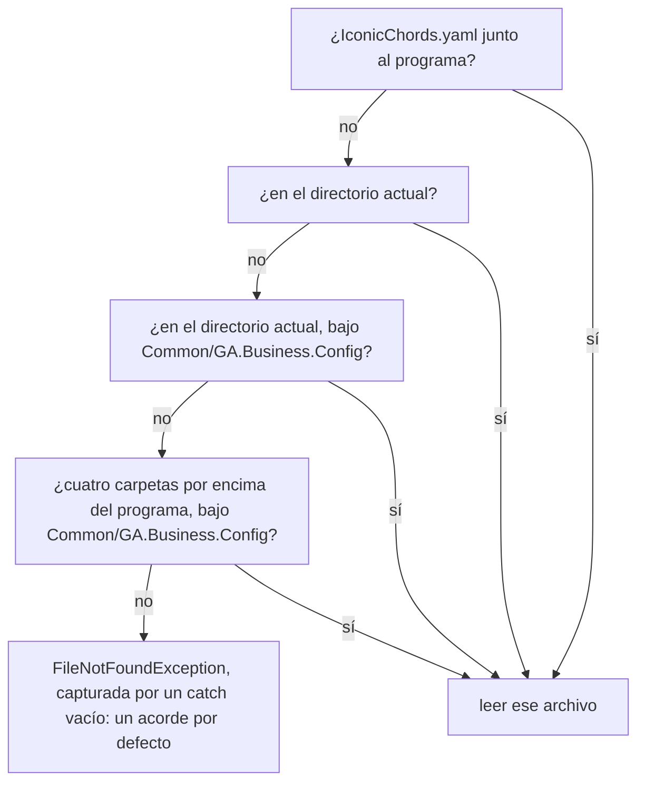

import { Tabs, TabItem } from '@astrojs/starlight/components';

Hasta ahora, todo lo que sabía un programa desaparecía cuando se detenía. Un **archivo** guarda texto en el disco: un programa puede escribirlo, y el mismo programa, otro o una persona pueden leerlo más tarde. Esta lección escribe y lee archivos de texto, construye sus rutas y lee un archivo CSV, una tabla escrita como texto, con los proyectos de [Guitar Alchemist](https://github.com/GuitarAlchemist/ga) que las lecciones 4 y 9 escribieron a mano.

Todos los programas de esta lección están en [`code/csharp-beginner`](https://github.com/spareilleux/learn/tree/main/code/csharp-beginner). Ejecútalos desde esa carpeta, por ejemplo con `dotnet run examples/l10_write_read.cs`: varios crean allí un archivo y lo borran antes de terminar, y el archivo CSV está en su carpeta `data`. `check.sh` compara sus salidas, y los errores del compilador de los fragmentos rechazados, con los archivos de `expected/`.

## Escribir un archivo y volver a leerlo

La clase estática [`File`](https://learn.microsoft.com/dotnet/api/system.io.file), del espacio de nombres `System.IO` que toda aplicación basada en archivos puede usar sin `using`, lee y escribe un archivo entero en una sola llamada:

```csharp
// Escribir un archivo de texto, añadirle texto, volver a leerlo y después borrarlo
string path = "practice.txt";

File.WriteAllText(path, "Monday: 30 minutes\n");       // crea el archivo, o reemplaza su contenido
File.AppendAllText(path, "Tuesday: 45 minutes\n");     // añade al final
Console.WriteLine(File.Exists(path));

string text = File.ReadAllText(path);                   // el archivo entero en una sola cadena
Console.Write(text);

string[] lines = File.ReadAllLines(path);               // una cadena por línea, sin los saltos de línea
Console.WriteLine($"{lines.Length} lines, the last one: {lines[^1]}");

File.WriteAllLines(path, ["E2", "A2", "D3", "G3", "B3", "E4"]);   // reemplaza el contenido, un elemento por línea
Console.WriteLine(string.Join(" ", File.ReadAllLines(path)));

File.Delete(path);
Console.WriteLine(File.Exists(path));
```

```text
True
Monday: 30 minutes
Tuesday: 45 minutes
2 lines, the last one: Tuesday: 45 minutes
E2 A2 D3 G3 B3 E4
False
```

| Método | Qué hace |
|---|---|
| [`File.WriteAllText(path, text)`](https://learn.microsoft.com/dotnet/api/system.io.file.writealltext) | crea el archivo, o reemplaza lo que contenía, con `text` |
| [`File.AppendAllText(path, text)`](https://learn.microsoft.com/dotnet/api/system.io.file.appendalltext) | añade `text` al final, y crea el archivo si hace falta |
| [`File.ReadAllText(path)`](https://learn.microsoft.com/dotnet/api/system.io.file.readalltext) | el archivo entero, como un solo `string` |
| [`File.ReadAllLines(path)`](https://learn.microsoft.com/dotnet/api/system.io.file.readalllines) | un `string[]`, un elemento por línea, sin los saltos de línea |
| [`File.WriteAllLines(path, lines)`](https://learn.microsoft.com/dotnet/api/system.io.file.writealllines) | escribe cada elemento de una colección en su propia línea |
| [`File.Exists(path)`](https://learn.microsoft.com/dotnet/api/system.io.file.exists) | `true` si el archivo está ahí |
| [`File.Delete(path)`](https://learn.microsoft.com/dotnet/api/system.io.file.delete) | borra el archivo; no hace nada si no está ahí |

`"\n"` es el salto de línea dentro de una cadena. `Console.Write`, sin `Line`, muestra el texto tal cual: el archivo ya termina con un salto de línea.

`ReadAllText` devuelve un solo `string`, así que no puede ir en un array. El compilador lo dice antes de que el programa se ejecute:

```csharp
// ReadAllText devuelve una sola cadena, no un array de líneas
string[] lines = File.ReadAllText("practice.txt");
```

```text
l10_readalltext_array.cs(2,18): error CS0029: Cannot implicitly convert type 'string' to 'string[]'
```

### Cuando el archivo no está

Leer un archivo que no existe lanza una excepción, el tipo de fallo normal que captura la lección 8. La excepción dice qué falta: el archivo, o una carpeta en el camino hasta él.

```csharp
// Leer un archivo que no está lanza una excepción: cuál depende de lo que falta
try
{
    string text = File.ReadAllText("missing.txt");
}
catch (FileNotFoundException ex)
{
    Console.WriteLine($"{ex.GetType().Name}: {Path.GetFileName(ex.FileName)}");
}

try
{
    string text = File.ReadAllText(Path.Combine("nowhere", "missing.txt"));
}
catch (DirectoryNotFoundException ex)
{
    Console.WriteLine(ex.GetType().Name);
}

// Preguntar antes evita la excepción, pero el archivo aún puede desaparecer entre las dos líneas
if (File.Exists("missing.txt"))
{
    Console.WriteLine(File.ReadAllText("missing.txt"));
}
else
{
    Console.WriteLine("No missing.txt here");
}
```

```text
FileNotFoundException: missing.txt
DirectoryNotFoundException
No missing.txt here
```

[`FileNotFoundException`](https://learn.microsoft.com/dotnet/api/system.io.filenotfoundexception) lleva la ruta del archivo en `FileName`; el programa solo muestra el nombre, con `Path.GetFileName`, para que su salida sea la misma en todos los ordenadores. [`DirectoryNotFoundException`](https://learn.microsoft.com/dotnet/api/system.io.directorynotfoundexception) significa que falta una carpeta de la ruta. Captúralas donde el programa pueda hacer algo útil, como pedir otro archivo; un `catch` que solo muestra un mensaje y sigue adelante oculta el problema, como enseña Guitar Alchemist al final de esta lección.

## Rutas

Una **ruta** dice dónde está un archivo: una lista de nombres de carpetas, y después el nombre del archivo. Windows los separa con una barra invertida, `\`, mientras que Linux y macOS usan una barra, `/`. La clase estática [`Path`](https://learn.microsoft.com/dotnet/api/system.io.path) construye y descompone rutas con el separador correcto, así que el mismo programa funciona en todas partes:

```csharp
// Path construye y descompone rutas de archivos sin preocuparse del sistema operativo
string path = Path.Combine("data", "ga-projects.csv");   // data\ga-projects.csv en Windows, data/ga-projects.csv en los demás

Console.WriteLine(Path.GetFileName(path));
Console.WriteLine(Path.GetFileNameWithoutExtension(path));
Console.WriteLine(Path.GetExtension(path));
Console.WriteLine(Path.GetFileName(Path.ChangeExtension(path, ".json")));
Console.WriteLine(Path.GetFileName(Path.GetDirectoryName(path)));
Console.WriteLine(Path.IsPathRooted(path));               // False: una ruta relativa

// El separador es la única diferencia entre los sistemas
Console.WriteLine(path == "data" + Path.DirectorySeparatorChar + "ga-projects.csv");
```

```text
ga-projects.csv
ga-projects
.csv
ga-projects.json
data
False
True
```

<Tabs syncKey="os">
<TabItem label="Windows">

`Path.Combine("data", "ga-projects.csv")` da `data\ga-projects.csv`. Una ruta completa empieza con una letra de unidad, por ejemplo `C:\Users\you\learn\code\csharp-beginner\data\ga-projects.csv`.

</TabItem>
<TabItem label="Linux / WSL">

`Path.Combine("data", "ga-projects.csv")` da `data/ga-projects.csv`. Una ruta completa empieza en la raíz, `/`, por ejemplo `/home/you/learn/code/csharp-beginner/data/ga-projects.csv`.

</TabItem>
<TabItem label="macOS">

`Path.Combine("data", "ga-projects.csv")` da `data/ga-projects.csv`. Una ruta completa empieza en la raíz, `/`, por ejemplo `/Users/you/learn/code/csharp-beginner/data/ga-projects.csv`.

</TabItem>
</Tabs>

[`Path.Combine`](https://learn.microsoft.com/dotnet/api/system.io.path.combine) une las piezas con [`Path.DirectorySeparatorChar`](https://learn.microsoft.com/dotnet/api/system.io.path.directoryseparatorchar); [`GetFileName`](https://learn.microsoft.com/dotnet/api/system.io.path.getfilename), [`GetFileNameWithoutExtension`](https://learn.microsoft.com/dotnet/api/system.io.path.getfilenamewithoutextension), [`GetExtension`](https://learn.microsoft.com/dotnet/api/system.io.path.getextension), [`ChangeExtension`](https://learn.microsoft.com/dotnet/api/system.io.path.changeextension) y [`GetDirectoryName`](https://learn.microsoft.com/dotnet/api/system.io.path.getdirectoryname) descomponen una ruta. Ninguno mira el disco: trabajan con el texto de la ruta. Una ruta que empieza con una unidad o con `/` es *con raíz* (*rooted*), o absoluta; [`IsPathRooted`](https://learn.microsoft.com/dotnet/api/system.io.path.ispathrooted) dice `False` para `data/ga-projects.csv`, una ruta *relativa*.

Escribir una ruta de Windows en una cadena normal falla de otra forma: en una cadena, una barra invertida empieza una [secuencia de escape](https://learn.microsoft.com/dotnet/csharp/programming-guide/strings/#string-escape-sequences), como `\n`.

```csharp
// En una cadena normal, una barra invertida empieza una secuencia de escape, y \g no es una
string path = "data\ga-projects.csv";
```

```text
l10_backslash.cs(2,20): error CS1009: Unrecognized escape sequence
```

`\g` no es una secuencia de escape, así que el compilador la rechaza. `"data\new.csv"` compilaría, con un salto de línea en medio del nombre, porque `\n` sí lo es. Una [cadena textual](https://learn.microsoft.com/dotnet/csharp/language-reference/tokens/verbatim) (*verbatim*), `@"data\ga-projects.csv"`, toma las barras invertidas tal cual, pero entonces la ruta solo funciona en Windows; `Path.Combine` funciona en todas partes.

### Una ruta relativa parte del directorio actual

Una ruta relativa se completa con el **directorio actual**: la carpeta en la que estaba la terminal cuando empezó `dotnet run`, no la carpeta del archivo `.cs`. Una aplicación basada en archivos también puede pedir la carpeta de su propio archivo, con [`AppContext.GetData`](https://learn.microsoft.com/dotnet/api/system.appcontext.getdata)`("EntryPointFileDirectoryPath")`, una de las [rutas que `dotnet run` da a una aplicación basada en archivos desde .NET 10](https://learn.microsoft.com/dotnet/core/whats-new/dotnet-10/sdk#file-based-apps-enhancements):

```csharp
// Una ruta relativa parte del directorio actual: la carpeta desde la que se inició dotnet run
string relative = Path.Combine("data", "ga-projects.csv");
Console.WriteLine($"From the current directory: {File.Exists(relative)}");

// Una aplicación basada en archivos puede pedir la carpeta de su archivo .cs, sea cual sea el directorio actual
string folder = (string)AppContext.GetData("EntryPointFileDirectoryPath")!;
string fromProgram = Path.Combine(folder, "..", "data", "ga-projects.csv");
Console.WriteLine($"From the program's folder: {File.Exists(fromProgram)}");
```

Desde `code/csharp-beginner`, con `dotnet run examples/l10_where.cs`:

```text
From the current directory: True
From the program's folder: True
```

Desde la raíz del repositorio, dos carpetas más arriba, con `dotnet run code/csharp-beginner/examples/l10_where.cs`:

```text
From the current directory: False
From the program's folder: True
```

El mismo programa, sin cambios, encuentra el archivo o no según desde dónde se inicie. `".."` es la carpeta padre, aquí `code/csharp-beginner` vista desde `examples`. `GetData` devuelve un `object?`: la conversión `(string)` y el `!` de la lección 8 dicen que es una cadena y que no es `null` cuando el programa se ejecuta con `dotnet run app.cs`. Un programa basado en proyecto no tiene esa entrada; [`AppContext.BaseDirectory`](https://learn.microsoft.com/dotnet/api/system.appcontext.basedirectory), la carpeta del programa compilado, es lo que usa para encontrar un archivo que la compilación copió junto a él. Para una aplicación basada en archivos, esa carpeta es temporal, bajo `dotnet/runfile` en la carpeta temporal del sistema ([aplicaciones basadas en archivos](https://learn.microsoft.com/dotnet/core/sdk/file-based-apps#build-applications)). `check.sh` ejecuta este programa desde las dos carpetas, en Linux, Windows y macOS.

## Líneas y saltos de línea

Una línea termina con un carácter de salto de línea, `\n`. Windows suele terminar una línea con dos caracteres, `\r\n`. `ReadAllLines` entiende los dos; dividir el texto entero por `'\n'` no:

```csharp
// Las mismas tres líneas, terminadas por \n (Linux, macOS) o por \r\n (Windows)
string[] endings = ["\n", "\r\n"];
foreach (string ending in endings)
{
    string name = ending == "\n" ? "LF" : "CRLF";
    File.WriteAllText("tuning.txt", "E2" + ending + "A2" + ending + "D3" + ending);

    string[] split = File.ReadAllText("tuning.txt").Split('\n');
    string[] lines = File.ReadAllLines("tuning.txt");

    Console.WriteLine($"{name}, Split('\\n'): {split.Length} items, lengths {string.Join(" ", split.Select(s => s.Length))}");
    Console.WriteLine($"{name}, ReadAllLines: {lines.Length} lines, lengths {string.Join(" ", lines.Select(s => s.Length))}");
    Console.WriteLine($"{name}, first line is \"E2\": {split[0] == "E2"} with Split, {lines[0] == "E2"} with ReadAllLines");
}
File.Delete("tuning.txt");
```

```text
LF, Split('\n'): 4 items, lengths 2 2 2 0
LF, ReadAllLines: 3 lines, lengths 2 2 2
LF, first line is "E2": True with Split, True with ReadAllLines
CRLF, Split('\n'): 4 items, lengths 3 3 3 0
CRLF, ReadAllLines: 3 lines, lengths 2 2 2
CRLF, first line is "E2": False with Split, True with ReadAllLines
```

Dos trampas aparecen en `Split('\n')`:

- el último salto de línea no va seguido de nada, así que `Split` devuelve un elemento más que líneas hay, uno vacío;
- con `\r\n`, cada pieza conserva su `\r`: `"E2\r"` tiene tres caracteres, y no es igual a `"E2"`. Un programa que divide así funciona en la máquina Linux de su autor y falla en una con Windows.

`ReadAllLines` quita los saltos de línea de los dos tipos y no añade ninguna línea vacía al final. `\\n` en el programa muestra una barra invertida y una `n`, y `\"` muestra unas comillas: las dos también son secuencias de escape.

Para un archivo grande, [`File.ReadLines`](https://learn.microsoft.com/dotnet/api/system.io.file.readlines) lee una línea cada vez, cuando un `foreach` o un método LINQ la pide, como las consultas de la lección 9, que se ejecutan cuando se leen. Devuelve un `IEnumerable<string>`, que no tiene `Length`:

```csharp
// ReadLines da un IEnumerable<string>, leído a demanda: no tiene Length
int count = File.ReadLines("practice.txt").Length;
```

```text
l10_readlines_length.cs(2,44): error CS1061: 'IEnumerable<string>' does not contain a definition for 'Length' and no accessible extension method 'Length' accepting a first argument of type 'IEnumerable<string>' could be found (are you missing a using directive or an assembly reference?)
```

El `Count()` de LINQ cuenta las líneas leyéndolas todas.

## Leer un archivo CSV

Un archivo **CSV**, por *comma-separated values* (valores separados por comas), es una tabla escrita como texto: una línea por fila, los valores separados por comas, y normalmente una primera línea, la *cabecera*, con los nombres de las columnas. `code/csharp-beginner/data/ga-projects.csv` contiene los doce proyectos de Guitar Alchemist de la lección 4, con el número de archivos `.cs` y `.fs` de cada uno en el commit `5c3a52a`:

```csv
Name,Language,CsFiles,FsFiles
GA.Core,C#,67,0
GA.Domain.Core,C#,209,0
GA.Business.Config,F#,8,11
```

El programa lee cada línea, la corta por las comas con [`Split`](https://learn.microsoft.com/dotnet/api/system.string.split), y la convierte en el record `Project` de la lección 9, con dos números más:

```csharp
// Leer los proyectos de Guitar Alchemist de un archivo CSV: una línea por proyecto, valores separados por comas
string[] lines = File.ReadAllLines(Path.Combine("data", "ga-projects.csv"));
Console.WriteLine($"Header: {lines[0]}");

List<Project> projects = [];
foreach (string line in lines.Skip(1))                   // todas las líneas menos la cabecera
{
    string[] fields = line.Split(',');
    projects.Add(new Project(fields[0], fields[1], int.Parse(fields[2]), int.Parse(fields[3])));
}
Console.WriteLine($"{projects.Count} projects");

foreach (Project p in projects.OrderByDescending(p => p.CsFiles + p.FsFiles).Take(3))
{
    Console.WriteLine($"{p.Name}: {p.CsFiles + p.FsFiles} files");
}

Console.WriteLine($"C# files in F# projects: {projects.Where(p => p.Language == "F#").Sum(p => p.CsFiles)}");
Console.WriteLine($"Projects without a source file: {string.Join(", ", projects.Where(p => p.CsFiles + p.FsFiles == 0).Select(p => p.Name))}");

record Project(string Name, string Language, int CsFiles, int FsFiles);
```

```text
Header: Name,Language,CsFiles,FsFiles
12 projects
GA.Business.ML: 226 files
GA.Domain.Core: 209 files
GA.Core: 67 files
C# files in F# projects: 8
Projects without a source file: GA.Presentation
```

[`Skip(1)`](https://learn.microsoft.com/dotnet/api/system.linq.enumerable.skip) deja fuera la cabecera, y [`Sum`](https://learn.microsoft.com/dotnet/api/system.linq.enumerable.sum) suma un número por elemento, igual que `Count` los cuenta. Los propios datos traen dos sorpresas. El proyecto F# `GA.Business.Config` contiene ocho archivos C#: la lección 9 ya los vio, son sus servicios de conocimiento musical, que compila otro proyecto. `GA.Presentation` no tiene ningún archivo fuente, solo su archivo de proyecto.

### Una coma dentro de un valor

Un valor que contiene el separador, como el nombre de un grupo, se pone entre comillas dobles. Un `Split` simple no sabe nada de comillas:

```csharp
using Microsoft.VisualBasic.FileIO;

// Un valor que contiene una coma se pone entre comillas, y un Split simple lo corta igualmente
string line = "\"Crosby, Stills & Nash\",Suite: Judy Blue Eyes,1969";
string[] split = line.Split(',');
Console.WriteLine($"Split: {split.Length} fields: {string.Join(" | ", split)}");

// TextFieldParser, que viene con .NET, entiende las comillas
using TextFieldParser parser = new TextFieldParser(new StringReader(line));
parser.SetDelimiters(",");
parser.HasFieldsEnclosedInQuotes = true;
string[] fields = parser.ReadFields()!;
Console.WriteLine($"TextFieldParser: {fields.Length} fields: {string.Join(" | ", fields)}");
```

```text
Split: 4 fields: "Crosby |  Stills & Nash" | Suite: Judy Blue Eyes | 1969
TextFieldParser: 3 fields: Crosby, Stills & Nash | Suite: Judy Blue Eyes | 1969
```

[`TextFieldParser`](https://learn.microsoft.com/dotnet/api/microsoft.visualbasic.fileio.textfieldparser) viene de la biblioteca de Visual Basic, que forma parte de .NET, así que C# puede usarlo con un `using`. `Split` basta para un archivo que escribes tú mismo y cuyos valores nunca contienen una coma, como `ga-projects.csv`; un archivo que viene de otra parte necesita un lector que trate las comillas. La lección 12 añade un paquete NuGet, una biblioteca hecha por otros, y los lectores de CSV son una razón frecuente para añadir uno. El `using` delante de `TextFieldParser parser` es el tema de la sección que viene después de la siguiente.

### Números en un archivo CSV

La lección 2 mostró que leer `"1.5"` depende de la cultura de la máquina. Escribir también: con la cultura francesa, el separador decimal es una coma, el separador de las columnas del CSV. Guitar Alchemist construye las filas de sus datos de entrenamiento para un modelo de aprendizaje automático con esta línea ([NaturalnessTrainingDataGenerator.cs:160](https://github.com/GuitarAlchemist/ga/blob/5c3a52ab40d0d433f8f68dbbd0590f70c8d8cf26/Common/GA.Business.ML/Naturalness/NaturalnessTrainingDataGenerator.cs#L160)), después de una etiqueta `1,` o `0,` ([línea 78](https://github.com/GuitarAlchemist/ga/blob/5c3a52ab40d0d433f8f68dbbd0590f70c8d8cf26/Common/GA.Business.ML/Naturalness/NaturalnessTrainingDataGenerator.cs#L78)). El programa escribe una de esas filas en una máquina canadiense, y después en una francesa:

```csharp
using System.Globalization;

// Una fila del CSV de naturalidad de Guitar Alchemist, escrita como la escribe su generador:
// la etiqueta, y después $"{deltaAvg:F2},{deltaAvg:F2},{changedStrings},{deltaStretch},{sharedStrings}"
double deltaAvg = 2.5;
int changedStrings = 2;
double deltaStretch = 1;
int sharedStrings = 4;

string[] cultures = ["en-CA", "fr-FR"];
foreach (string name in cultures)
{
    CultureInfo.CurrentCulture = new CultureInfo(name);   // como en una máquina canadiense, y después en una francesa
    string row = $"1,{deltaAvg:F2},{deltaAvg:F2},{changedStrings},{deltaStretch},{sharedStrings}";
    Console.WriteLine($"{name}: {row} -> {row.Split(',').Length} fields");
}

// string.Create con la cultura invariable escribe un punto en todas las máquinas
string invariant = string.Create(CultureInfo.InvariantCulture,
    $"1,{deltaAvg:F2},{deltaAvg:F2},{changedStrings},{deltaStretch},{sharedStrings}");
Console.WriteLine($"Invariant: {invariant} -> {invariant.Split(',').Length} fields");

// Para volver a leerla: analizarla con la misma cultura que la que la escribió
double read = double.Parse(invariant.Split(',')[1], CultureInfo.InvariantCulture);
Console.WriteLine(read == deltaAvg);
```

```text
en-CA: 1,2.50,2.50,2,1,4 -> 6 fields
fr-FR: 1,2,50,2,50,2,1,4 -> 8 fields
Invariant: 1,2.50,2.50,2,1,4 -> 6 fields
True
```

En una máquina francesa, cada `2.50` se convierte en `2,50`, y las seis columnas de la cabecera se convierten en ocho valores: un programa que lee el archivo pone entonces cada número en la columna equivocada. [`CultureInfo.CurrentCulture`](https://learn.microsoft.com/dotnet/api/system.globalization.cultureinfo.currentculture) es la cultura que usa `$"..."`; el programa la cambia para imitar cada máquina. [`string.Create`](https://learn.microsoft.com/dotnet/api/system.string.create) con [`CultureInfo.InvariantCulture`](https://learn.microsoft.com/dotnet/api/system.globalization.cultureinfo.invariantculture) construye la misma cadena en todas las máquinas, y `double.Parse` con la misma cultura la vuelve a leer. Los números enteros, como `changedStrings` y `deltaStretch`, que es un `double` que vale 1, se escriben sin separador en todas las culturas. La regla para un archivo: escribe y lee los números con la cultura invariable, y deja la cultura de la máquina para lo que una persona lee en la pantalla.

## Flujos y `using`

`ReadAllText` y `WriteAllText` abren el archivo, hacen su trabajo y lo cierran. Para escribir un archivo poco a poco, un [`StreamWriter`](https://learn.microsoft.com/dotnet/api/system.io.streamwriter) lo mantiene abierto entre llamadas, y el programa debe cerrarlo cuando termina. La instrucción [`using`](https://learn.microsoft.com/dotnet/csharp/language-reference/statements/using) lo hace al final de su bloque:

```csharp
// Escribir línea a línea con un StreamWriter, y después leer línea a línea con File.ReadLines
string path = "frets.txt";

using (StreamWriter writer = new StreamWriter(path))
{
    for (int fret = 0; fret <= 12; fret += 3)
    {
        writer.WriteLine($"Fret {fret}: {110 * Math.Pow(2, fret / 12.0):F1} Hz");
    }
}   // salir del bloque using cierra el archivo, incluso después de una excepción

// ReadLines lee una línea cada vez, cuando el foreach la pide, como una consulta LINQ
foreach (string line in File.ReadLines(path))
{
    Console.WriteLine(line);
}
Console.WriteLine($"First line with 220: {File.ReadLines(path).First(l => l.Contains("220"))}");
File.Delete(path);
```

```text
Fret 0: 110.0 Hz
Fret 3: 130.8 Hz
Fret 6: 155.6 Hz
Fret 9: 185.0 Hz
Fret 12: 220.0 Hz
First line with 220: Fret 12: 220.0 Hz
```

Las frecuencias son las de la lección 2: cada traste multiplica la frecuencia de la cuerda La, 110 Hz, por la raíz duodécima de 2. Se escriben para que las lea una persona, con la cultura de la máquina: en una máquina francesa, el archivo contiene `110,0`. Una declaración `using`, sin llaves, como la que va delante de `TextFieldParser` más arriba, cierra el objeto al final del bloque que la contiene, aquí el final del programa.

Lo que hace `using` es llamar a [`Dispose`](https://learn.microsoft.com/dotnet/api/system.idisposable.dispose). Hasta entonces, un `StreamWriter` guarda en memoria lo que recibe, y lo escribe en el disco en trozos más grandes:

```csharp
// Un StreamWriter guarda el texto en memoria y lo escribe en el disco más tarde
StreamWriter writer = new StreamWriter("notes.txt");
writer.Write("E2 A2 D3");
Console.WriteLine($"Before Dispose: {new FileInfo("notes.txt").Length} bytes");

writer.Dispose();                                         // escribe lo que queda, y después cierra el archivo
Console.WriteLine($"After Dispose: {new FileInfo("notes.txt").Length} bytes");
File.Delete("notes.txt");
```

```text
Before Dispose: 0 bytes
After Dispose: 8 bytes
```

[`FileInfo.Length`](https://learn.microsoft.com/dotnet/api/system.io.fileinfo.length) es el tamaño del archivo en el disco. Un programa que olvida liberar su `StreamWriter` puede terminar con un archivo vacío o cortado, y mantiene el archivo abierto hasta que termina: mientras tanto, Windows no deja que otro programa lo cambie o lo borre. Pon cada `StreamWriter`, [`StreamReader`](https://learn.microsoft.com/dotnet/api/system.io.streamreader) u otro objeto [`IDisposable`](https://learn.microsoft.com/dotnet/api/system.idisposable) en un `using`.

### Caracteres y bytes

Un archivo contiene bytes, y un archivo de texto son caracteres convertidos en bytes por una **codificación**. .NET escribe [UTF-8](https://learn.microsoft.com/dotnet/standard/base-types/character-encoding-introduction) por defecto: un byte para una letra inglesa, dos para `é`. Una opción añade tres bytes al principio del archivo:

```csharp
using System.Text;

// "Ré" son dos caracteres; ¿cuántos bytes recibe el archivo?
File.WriteAllText("note.txt", "Ré");
byte[] bytes = File.ReadAllBytes("note.txt");
Console.WriteLine($"Default:       {bytes.Length} bytes: {Convert.ToHexString(bytes)}");

// Encoding.UTF8 añade una marca de orden de bytes (BOM), EF BB BF, al principio del archivo
File.WriteAllText("note.txt", "Ré", Encoding.UTF8);
bytes = File.ReadAllBytes("note.txt");
Console.WriteLine($"Encoding.UTF8: {bytes.Length} bytes: {Convert.ToHexString(bytes)}");

// ReadAllText reconoce la marca y la quita
string text = File.ReadAllText("note.txt");
Console.WriteLine($"Read back: {text}, {text.Length} characters");
File.Delete("note.txt");
```

```text
Default:       3 bytes: 52C3A9
Encoding.UTF8: 6 bytes: EFBBBF52C3A9
Read back: Ré, 2 characters
```

`52` es `R`, y `C3 A9` es `é`. [`File.ReadAllBytes`](https://learn.microsoft.com/dotnet/api/system.io.file.readallbytes) da los bytes en bruto, y [`Convert.ToHexString`](https://learn.microsoft.com/dotnet/api/system.convert.tohexstring) los muestra en hexadecimal. Sin codificación, `WriteAllText` escribe UTF-8 sin marca; [`Encoding.UTF8`](https://learn.microsoft.com/dotnet/api/system.text.encoding.utf8) añade la *marca de orden de bytes* (*byte order mark*), `EF BB BF`. `ReadAllText` y `ReadAllLines` la reconocen y la quitan, pero un programa que lee los bytes de otra forma puede encontrar tres caracteres extraños delante del nombre de la primera columna. No indiques la codificación salvo que la necesite el programa que lee el archivo.

## En Guitar Alchemist

En el commit `5c3a52a`, Guitar Alchemist lee varios archivos de datos, y su código muestra cada punto de esta lección. Una [sonda](https://github.com/spareilleux/learn/blob/main/code/csharp-beginner/ga-probes/files.cs) ejecutó parte de él.

**Dónde busca GA un archivo.** Los servicios de conocimiento musical de la lección 9 leen archivos YAML. [`IconicChordsConfigLoader.FindYamlFile`](https://github.com/GuitarAlchemist/ga/blob/5c3a52ab40d0d433f8f68dbbd0590f70c8d8cf26/Common/GA.Business.Config/Configuration/IconicChordsConfigLoader.cs#L91-L105) prueba cuatro rutas y se queda con la primera que existe, con `possiblePaths.FirstOrDefault(File.Exists)`: un método dado a LINQ en lugar de una lambda, como `Count(IsFSharp)` en la lección 9.



La compilación copia los archivos YAML junto al programa, así que la primera ruta suele ganar. Cuando no es así, dos rutas dependen del directorio actual, y la última respuesta es una excepción que un [`catch` vacío](https://github.com/GuitarAlchemist/ga/blob/5c3a52ab40d0d433f8f68dbbd0590f70c8d8cf26/Common/GA.Business.Config/Configuration/IconicChordsConfigLoader.cs#L25-L28) se traga, antes de que el cargador devuelva un solo acorde, «C Major Triad». La sonda se ejecutó tres veces: tal como se compiló, y después, tras borrar los archivos YAML que tenía al lado, desde dos carpetas:

| Iniciada desde | Ruta encontrada | Acordes icónicos |
|---|---|---|
| `ga-probes`, con los archivos junto al programa | la primera | 17, el primero «Hendrix Chord» |
| `ga-probes`, sin ellos | ninguna | 1, «C Major Triad» |
| la raíz del código de GA, sin ellos | la tercera | 17 |

No se muestra nada en el segundo caso: el programa sigue con un acorde en lugar de diecisiete. [GaCLI](https://github.com/GuitarAlchemist/ga/blob/5c3a52ab40d0d433f8f68dbbd0590f70c8d8cf26/GaCLI/Program.cs#L17-L19), la herramienta de línea de comandos de GA, comete el error de `l10_where.cs` al revés: su proyecto [copia `appsettings.yaml` junto al programa](https://github.com/GuitarAlchemist/ga/blob/5c3a52ab40d0d433f8f68dbbd0590f70c8d8cf26/GaCLI/GaCLI.csproj#L59-L61), pero el programa lo lee desde el directorio actual, como archivo opcional. Iniciado desde otra carpeta, la raíz del repositorio por ejemplo, se ejecutaría sin su configuración y sin decir nada: esto viene de leer el código, que la sonda no ejecutó, y está *por verificar*.

**Un archivo que no está ni incrustado ni copiado.** [`ScaleVideoUrlById`](https://github.com/GuitarAlchemist/ga/blob/5c3a52ab40d0d433f8f68dbbd0590f70c8d8cf26/Common/GA.Domain.Core/Theory/Tonal/Scales/ScaleVideoUrlById.cs#L27-L52) da la URL de un vídeo para cada escala. Busca sus datos dentro de la biblioteca compilada, como un *recurso* llamado `GA.Domain.Core.Scales.Data.scale_video_urls.json`, y después en un archivo `Scales/Data/scale_video_urls.json` junto a la biblioteca. El archivo, con 1490 URL, está en `Theory/Tonal/Scales/Data/`, y el proyecto ni lo incrusta ni lo copia: las dos búsquedas fallan, y el código devuelve un diccionario vacío. La sonda no encontró ningún recurso en la biblioteca, ningún archivo junto a ella, y 0 escalas con vídeo. `PitchClassSet.ScaleVideoUrl` y `ScaleMetadataRegistry.GetMetadata`, que lo llaman, nunca obtienen de él una URL.

**Números y líneas.** Las filas de naturalidad de la sección sobre los números vienen del [generador de datos de entrenamiento](https://github.com/GuitarAlchemist/ga/blob/5c3a52ab40d0d433f8f68dbbd0590f70c8d8cf26/Common/GA.Business.ML/Naturalness/NaturalnessTrainingDataGenerator.cs#L160) de GA, que la sonda no ejecutó: necesita una colección de tablaturas. Su comando muestra después el número de filas como [`csvContent.Split('\n').Length - 1`](https://github.com/GuitarAlchemist/ga/blob/5c3a52ab40d0d433f8f68dbbd0590f70c8d8cf26/GaCLI/Commands/GenerateNaturalnessDataCommand.cs#L38): el `- 1` quita el elemento vacío tras el último salto de línea, pero la cabecera sigue contando como fila, así que el mensaje da una fila más de las que contienen los datos.

La [tabla QA del diario](../journal/#qa) registra estas mediciones.

## Ejercicios

### Ejercicio 1 — predecir la salida

Anota lo que muestra cada línea, y después ejecuta `exercises/l10_ex_predict.cs`:

```csharp
// Ejercicio 1: predice cada línea antes de ejecutar el programa
File.WriteAllText("chords.txt", "C\nG\nAm\nF\n");
Console.WriteLine(File.ReadAllLines("chords.txt").Length);
Console.WriteLine(File.ReadAllText("chords.txt").Split('\n').Length);

File.AppendAllText("chords.txt", "C");
Console.WriteLine(File.ReadAllLines("chords.txt").Length);
Console.WriteLine(File.ReadAllLines("chords.txt")[^1]);

File.WriteAllText("chords.txt", "");
Console.WriteLine(File.ReadAllLines("chords.txt").Length);

File.Delete("chords.txt");
Console.WriteLine(File.Exists("chords.txt"));
```

<details>
<summary>Solución</summary>

```text
4
5
5
C
0
False
```

- Cuatro líneas, cada una terminada por `\n`: `ReadAllLines` da 4, y `Split('\n')` da 5, el último vacío.
- `AppendAllText` añade `C` después del último salto de línea: una quinta línea, sin salto de línea propio, que `ReadAllLines` también lee.
- `WriteAllText` con `""` vacía el archivo sin borrarlo: 0 líneas. Después de `Delete`, el archivo ya no está.

</details>

### Ejercicio 2 — archivos por lenguaje

Lee `data/ga-projects.csv` y muestra el número de archivos fuente, `.cs` y `.fs` juntos, de los proyectos C# y de los proyectos F#. Usa un diccionario como en la lección 9, y `File.ReadLines`.

<details>
<summary>Solución</summary>

```csharp
// Ejercicio 2: el número de archivos fuente por lenguaje, a partir de data/ga-projects.csv
var files = new Dictionary<string, int>();
foreach (string line in File.ReadLines(Path.Combine("data", "ga-projects.csv")).Skip(1))
{
    string[] fields = line.Split(',');
    string language = fields[1];
    files[language] = files.GetValueOrDefault(language) + int.Parse(fields[2]) + int.Parse(fields[3]);
}

foreach (var pair in files.OrderBy(pair => pair.Key))
{
    Console.WriteLine($"{pair.Key}: {pair.Value} files");
}
```

```text
C#: 557 files
F#: 75 files
```

`int.Parse` es seguro aquí sea cual sea la máquina: un número entero no tiene separador decimal. `OrderBy` garantiza el orden del diccionario.

</details>

### Ejercicio 3 — un archivo CSV de la afinación

Escribe las seis cuerdas de la guitarra en `tuning.csv`, con una cabecera `String,Note,Frequency`, y las frecuencias con dos decimales y un punto en todas las máquinas: 82.41, 110, 146.83, 196, 246.94 y 329.63 Hz, de la cuerda 6, E2, a la cuerda 1, E4. Muestra el archivo, y después vuelve a leerlo y muestra la frecuencia media, también con un punto.

<details>
<summary>Solución</summary>

```csharp
using System.Globalization;

// Ejercicio 3: escribir la afinación en un archivo CSV que todas las máquinas leen igual, y después volver a leerlo
string[] notes = ["E2", "A2", "D3", "G3", "B3", "E4"];
double[] hertz = [82.41, 110, 146.83, 196, 246.94, 329.63];

List<string> rows = ["String,Note,Frequency"];
for (int i = 0; i < notes.Length; i++)
{
    rows.Add(string.Create(CultureInfo.InvariantCulture, $"{6 - i},{notes[i]},{hertz[i]:F2}"));
}
File.WriteAllLines("tuning.csv", rows);
Console.Write(File.ReadAllText("tuning.csv"));

double total = 0;
foreach (string line in File.ReadLines("tuning.csv").Skip(1))
{
    total += double.Parse(line.Split(',')[2], CultureInfo.InvariantCulture);
}
Console.WriteLine($"Average: {(total / notes.Length).ToString("F2", CultureInfo.InvariantCulture)} Hz");
File.Delete("tuning.csv");
```

```text
String,Note,Frequency
6,E2,82.41
5,A2,110.00
4,D3,146.83
3,G3,196.00
2,B3,246.94
1,E4,329.63
Average: 185.30 Hz
```

La cultura invariable se usa tres veces: para escribir cada fila, para leer cada frecuencia y para mostrar la media. [`ToString("F2", culture)`](https://learn.microsoft.com/dotnet/api/system.double.tostring) es la forma de método de `{value:F2}`.

</details>

### Ejercicio 4 — desde cualquier carpeta

Cambia `l10_csv.cs` para que encuentre `data/ga-projects.csv` desde su propia carpeta, sea cual sea el directorio actual, y muestre un mensaje claro, con la ruta completa que probó, cuando el archivo no está. Muestra el número de proyectos y el número de proyectos F#. Devuelve 1 cuando falta el archivo, 0 en caso contrario: `return` en el nivel superior termina el programa con ese código de salida.

<details>
<summary>Solución</summary>

```csharp
// Ejercicio 4: encontrar data/ga-projects.csv desde la carpeta del programa, y decirlo claramente cuando no está
string folder = (string)AppContext.GetData("EntryPointFileDirectoryPath")!;
string path = Path.GetFullPath(Path.Combine(folder, "..", "data", "ga-projects.csv"));

if (!File.Exists(path))
{
    Console.WriteLine($"Can't find {path}");
    return 1;
}

string[] lines = File.ReadAllLines(path);
int fsharp = lines.Skip(1).Count(line => line.Split(',')[1] == "F#");
Console.WriteLine($"{lines.Length - 1} projects in {Path.GetFileName(path)}, {fsharp} in F#");
return 0;
```

```text
12 projects in ga-projects.csv, 4 in F#
```

[`Path.GetFullPath`](https://learn.microsoft.com/dotnet/api/system.io.path.getfullpath) quita el `..` y da una ruta absoluta, que le dice al lector del mensaje exactamente dónde buscó el programa. El cargador de GA, más arriba, hace lo contrario: prueba cuatro sitios y no dice nada.

</details>

## Lo que debes recordar

- `File.ReadAllText`, `ReadAllLines`, `WriteAllText`, `WriteAllLines` y `AppendAllText` leen o escriben un archivo entero en una sola llamada. Un archivo que falta lanza `FileNotFoundException`; una carpeta que falta, `DirectoryNotFoundException`.
- Construye las rutas con `Path.Combine`, nunca pegando `\` o `/`. En una cadena normal, una barra invertida empieza una secuencia de escape.
- Una ruta relativa parte del directorio actual, la carpeta desde la que se inició `dotnet run`. Una aplicación basada en archivos encuentra su propia carpeta con `AppContext.GetData("EntryPointFileDirectoryPath")`.
- `ReadAllLines` entiende `\n` y `\r\n`; `Split('\n')` conserva el `\r` y añade un elemento vacío tras el último salto de línea. `ReadLines` lee a demanda y devuelve un `IEnumerable<string>`.
- Una línea CSV se divide con `Split(',')` solo si ningún valor contiene una coma. Escribe y lee los números de un archivo con `CultureInfo.InvariantCulture`.
- Pon un `StreamWriter` o un `StreamReader` en un `using`: hasta `Dispose`, el texto puede seguir en memoria.
- `WriteAllText` escribe UTF-8 sin marca de orden de bytes; `Encoding.UTF8` añade una.

La siguiente lección, [pruebas unitarias](../11-unit-tests/), comprobará los métodos de estas lecciones con xUnit y `dotnet test`.

## Fuentes

- Archivos: [tareas de E/S comunes](https://learn.microsoft.com/dotnet/standard/io/common-i-o-tasks), [`File`](https://learn.microsoft.com/dotnet/api/system.io.file), [`File.ReadLines`](https://learn.microsoft.com/dotnet/api/system.io.file.readlines), [`FileInfo.Length`](https://learn.microsoft.com/dotnet/api/system.io.fileinfo.length), [`FileNotFoundException`](https://learn.microsoft.com/dotnet/api/system.io.filenotfoundexception), [`DirectoryNotFoundException`](https://learn.microsoft.com/dotnet/api/system.io.directorynotfoundexception)
- Rutas: [formatos de ruta de archivo en Windows](https://learn.microsoft.com/dotnet/standard/io/file-path-formats), [`Path`](https://learn.microsoft.com/dotnet/api/system.io.path), [`Path.Combine`](https://learn.microsoft.com/dotnet/api/system.io.path.combine), [`Path.GetFullPath`](https://learn.microsoft.com/dotnet/api/system.io.path.getfullpath), [`AppContext.GetData`](https://learn.microsoft.com/dotnet/api/system.appcontext.getdata), [`AppContext.BaseDirectory`](https://learn.microsoft.com/dotnet/api/system.appcontext.basedirectory), [aplicaciones basadas en archivos](https://learn.microsoft.com/dotnet/core/sdk/file-based-apps), [novedades del SDK de .NET 10](https://learn.microsoft.com/dotnet/core/whats-new/dotnet-10/sdk#file-based-apps-enhancements)
- Texto: [secuencias de escape](https://learn.microsoft.com/dotnet/csharp/programming-guide/strings/#string-escape-sequences), [cadenas textuales](https://learn.microsoft.com/dotnet/csharp/language-reference/tokens/verbatim), [codificación de caracteres](https://learn.microsoft.com/dotnet/standard/base-types/character-encoding-introduction), [`Encoding.UTF8`](https://learn.microsoft.com/dotnet/api/system.text.encoding.utf8), [`TextFieldParser`](https://learn.microsoft.com/dotnet/api/microsoft.visualbasic.fileio.textfieldparser), [`CultureInfo.InvariantCulture`](https://learn.microsoft.com/dotnet/api/system.globalization.cultureinfo.invariantculture), [`string.Create`](https://learn.microsoft.com/dotnet/api/system.string.create)
- Flujos: [`StreamWriter`](https://learn.microsoft.com/dotnet/api/system.io.streamwriter), [`StreamReader`](https://learn.microsoft.com/dotnet/api/system.io.streamreader), [la instrucción `using`](https://learn.microsoft.com/dotnet/csharp/language-reference/statements/using), [`IDisposable`](https://learn.microsoft.com/dotnet/api/system.idisposable)
- Errores del compilador [CS0029](https://learn.microsoft.com/dotnet/csharp/language-reference/compiler-messages/cs0029), [CS1009](https://learn.microsoft.com/dotnet/csharp/language-reference/compiler-messages/string-literal), [CS1061](https://learn.microsoft.com/dotnet/csharp/language-reference/compiler-messages/cs1061)
