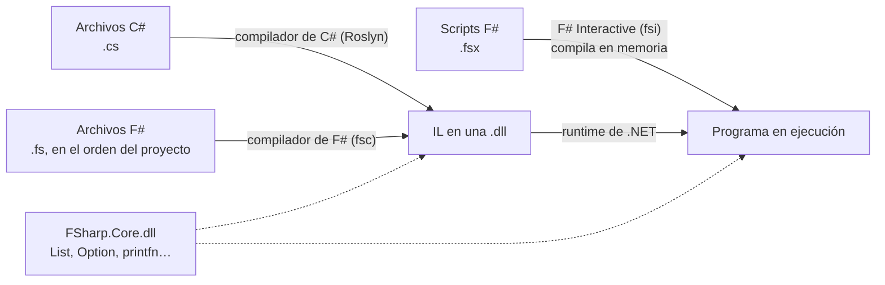
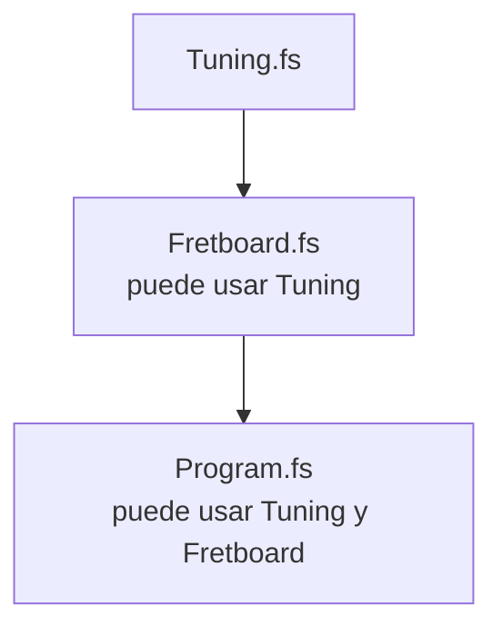

import { Tabs, TabItem } from '@astrojs/starlight/components';

Código: los scripts [`examples/l01_*.fsx`](https://github.com/spareilleux/learn/tree/14eebfd073566c52654d9f5671d893d392308871/code/fsharp/examples), los fragmentos rechazados en [`compile_fail/`](https://github.com/spareilleux/learn/tree/14eebfd073566c52654d9f5671d893d392308871/code/fsharp/compile_fail), la sesión [`sessions/l01_fsi.txt`](https://github.com/spareilleux/learn/blob/14eebfd073566c52654d9f5671d893d392308871/code/fsharp/sessions/l01_fsi.txt) y los proyectos [`l01-project`](https://github.com/spareilleux/learn/tree/14eebfd073566c52654d9f5671d893d392308871/code/fsharp/l01-project/Hello) y [`l01-order`](https://github.com/spareilleux/learn/tree/14eebfd073566c52654d9f5671d893d392308871/code/fsharp/l01-order/Hello).

## F# en el panorama de .NET

F# es un lenguaje .NET, como C#. Su compilador convierte los archivos `.fs` en el mismo lenguaje intermedio (IL) y los mismos archivos `.dll`, que ejecuta el mismo runtime. Un proyecto C# puede referenciar una biblioteca F#, y al revés.



Tres cosas difieren de C#:

- **FSharp.Core.** Los programas F# usan una biblioteca propia, [FSharp.Core](https://fsharp.github.io/fsharp-core-docs/), para las listas, las opciones, `printfn` y el resto de las funciones básicas. El SDK la añade a cada proyecto F#, y un programa publicado incluye su `FSharp.Core.dll`.
- **F# Interactive.** El SDK contiene un REPL y un ejecutor de scripts, [`dotnet fsi`](https://learn.microsoft.com/dotnet/fsharp/tools/fsharp-interactive/). F# lo tiene desde sus primeras versiones; C# obtuvo las aplicaciones de archivo con .NET 10.
- **El orden de los archivos.** Un proyecto F# compila sus archivos en el orden en que los lista su `.fsproj`, y un archivo solo puede usar lo que definen los archivos que están por encima. [Los archivos compilan en orden](#los-archivos-compilan-en-orden) explica por qué.

## Comprobar el SDK

F# viene con el SDK de .NET: no hay nada más que instalar. Si `dotnet --version` no responde, instala el SDK de .NET 10 como explica la [lección 1 de C# para principiantes](../../csharp-beginner/01-first-program/#instalar-el-sdk-de-net) para cada sistema.

```text
> dotnet --version
10.0.112
> dotnet fsi --help
Microsoft (R) F# Interactive version 14.0.112.0 for F# 10.0
Copyright (c) Microsoft Corporation. All Rights Reserved.
…
```

F# Interactive 14.0.112 es la versión de la herramienta; **F# 10.0** es la versión del lenguaje, la que describe [Novedades de F# 10](https://learn.microsoft.com/dotnet/fsharp/whats-new/fsharp-10). La carpeta del curso contiene un [`global.json`](https://github.com/spareilleux/learn/blob/14eebfd073566c52654d9f5671d893d392308871/code/fsharp/global.json) que selecciona un SDK de la versión 10, ya que mi máquina también tiene una versión preliminar de .NET 11.

## F# Interactive

`dotnet fsi` solo inicia una sesión interactiva. Escribes código, lo terminas con dos puntos y coma `;;`, y F# Interactive lo compila, lo ejecuta e imprime lo que ha definido:

```text
> let strings = 6;;
val strings: int = 6

> strings * 22;;
val it: int = 132

> let greet name = "Hello, " + name;;
val greet: name: string -> string

> greet "F#";;
val it: string = "Hello, F#"

> #quit;;
```

- `let strings = 6` define un valor. F# Interactive responde con su **nombre, tipo y valor**: `val strings: int = 6`. No escribiste ningún tipo: el compilador lo *infirió* a partir de `6`.
- Una expresión sin `let`, como `strings * 22`, recibe el nombre `it`.
- `greet` es una función. Su tipo, `name: string -> string`, se lee «toma una cadena llamada `name` y devuelve una cadena». El compilador sabe que `name` es una cadena porque `"Hello, " + name` la suma a una cadena. La [lección 2](../02-values-and-functions/) vuelve sobre la inferencia y las flechas `->`.
- `#quit;;` sale de la sesión.

El curso comprueba esta sesión: [`check.sh`](https://github.com/spareilleux/learn/blob/14eebfd073566c52654d9f5671d893d392308871/code/fsharp/check.sh) escribe las líneas de [`sessions/l01_fsi.txt`](https://github.com/spareilleux/learn/blob/14eebfd073566c52654d9f5671d893d392308871/code/fsharp/sessions/l01_fsi.txt) en `dotnet fsi --nologo` y compara las respuestas. En C#, las herramientas más cercanas son la ventana C# Interactive de Visual Studio y los [notebooks de .NET Interactive](https://github.com/dotnet/interactive); Java tiene `jshell`.

## Tu primer script

Un script es un archivo con la extensión `.fsx`. Crea `hello.fsx` con una línea:

```fsharp
printfn "Hello, world!"
```

```text
> dotnet fsi hello.fsx
Hello, world!
```

[`printfn`](https://fsharp.github.io/fsharp-core-docs/reference/fsharp-core-extratopleveloperators.html#printfn) imprime una línea, como `Console.WriteLine`. No hay paréntesis alrededor de su argumento ni punto y coma al final: en F#, una función se llama escribiendo sus argumentos después de ella, separados por espacios, y un salto de línea termina la expresión.

Un script más largo se ejecuta de arriba abajo, como las instrucciones de nivel superior de un archivo C#:

```fsharp
// Un script se ejecuta de arriba abajo, como las instrucciones de nivel superior de un archivo C#
let tuning = "E2 A2 D3 G3 B3 E4"   // let da un nombre a un valor
let strings = 6

printfn "Guitar Alchemist tunes a guitar like this: %s" tuning
printfn "%d strings, %d frets each" strings 22

// Cadenas interpoladas: {expression}, o %d{expression} para comprobar también el tipo
printfn $"{strings} strings x 22 frets = {strings * 22} positions"
printfn $"%d{strings} strings"

// %A imprime cualquier valor tal como lo escribe F#
printfn "%A" [ "E2"; "A2"; "D3"; "G3"; "B3"; "E4" ]
```

```text
> dotnet fsi examples/l01_script.fsx
Guitar Alchemist tunes a guitar like this: E2 A2 D3 G3 B3 E4
6 strings, 22 frets each
6 strings x 22 frets = 132 positions
6 strings
["E2"; "A2"; "D3"; "G3"; "B3"; "E4"]
```

- `%s`, `%d` y `%A` son **especificadores de formato**: una cadena, un entero y cualquier valor. `printfn "%d strings, %d frets each" strings 22` toma un argumento por especificador. La página de [formato de texto sin formato](https://learn.microsoft.com/dotnet/fsharp/language-reference/plaintext-formatting) los enumera todos.
- `$"…"` es una [cadena interpolada](https://learn.microsoft.com/dotnet/fsharp/language-reference/interpolated-strings), como en C#. `%d{strings}` añade una comprobación de tipo al hueco.
- `[ "E2"; "A2"; … ]` es una lista; sus elementos se separan con `;`. La lección 5 trata de las listas.
- `//` empieza un comentario, como en C#. `(* … *)` rodea un comentario de varias líneas.

La afinación es la predeterminada de Guitar Alchemist, escrita `E2 A2 D3 G3 B3 E4` en [`Tuning.cs`](https://github.com/GuitarAlchemist/ga/blob/32f143c866c126338b332e384e4a615cd4b44381/Common/GA.Domain.Core/Instruments/Tuning.cs#L20-L23).

## Se comprueba el tipo de la cadena de formato

En C#, `Console.WriteLine("{0} strings", "six")` compila: los marcadores aceptan cualquier cosa. En F#, el compilador lee la cadena de formato:

```fsharp
let strings = "six"
printfn "Starting the script"
printfn "%d strings" strings
```

```text
> dotnet fsi compile_fail/l01_format_type.fsx
l01_format_type.fsx(3,22): error FS0001: The type 'string' is not compatible with any of the types byte,int16,int32,int64,sbyte,uint16,uint32,uint64,nativeint,unativeint, arising from the use of a printf-style format string
```

El mensaje tiene las mismas partes que un error de C#: archivo, `(línea,columna)`, `error`, un código y el texto. Los códigos de F# empiezan por `FS`; la página de [mensajes del compilador](https://learn.microsoft.com/dotnet/fsharp/language-reference/compiler-messages/) documenta algunos. `FS0001` es el más común: una discrepancia de tipos.

Fíjate en lo que no ocurrió: `Starting the script` no se imprimió. F# Interactive **comprueba todo el script antes de ejecutar cualquier parte**. Un script con un error no ejecuta nada.

## La indentación es sintaxis

F# no tiene llaves alrededor de los bloques: la indentación indica dónde empieza y termina un bloque, como en Python. La documentación de F# la llama la [regla del fuera de juego](https://learn.microsoft.com/dotnet/fsharp/language-reference/code-formatting-guidelines#indentation) (*offside rule*).

```fsharp
let describe name =
    let label = name + " major"
  label

printfn "%s" (describe "C")
```

```text
l01_indentation.fsx(2,5): error FS0588: The block following this 'let' is unfinished. Every code block is an expression and must have a result. 'let' cannot be the final code element in a block. Consider giving this block an explicit result.
```

El cuerpo de `describe` es el bloque indentado debajo. `label`, indentado con dos espacios en lugar de cuatro, está fuera de ese bloque, así que el bloque termina con `let label = …` y no tiene resultado. El mensaje dice algo importante sobre F#: **cada bloque es una expresión y tiene un resultado**, el valor de su última línea. No hay `return`:

```fsharp
let describe name =
    let label = name + " major"
    label   // la última expresión del bloque es el resultado de la función

printfn "%s" (describe "C")
```

```text
C major
```

Usa espacios, no tabulaciones: F# rechaza las tabulaciones en la indentación. Cuatro espacios es la convención de la [guía de estilo de F#](https://learn.microsoft.com/dotnet/fsharp/style-guide/formatting).

## Referenciar un paquete NuGet

Un script puede usar un paquete NuGet con `#r "nuget: …"`. F# Interactive lo descarga en la primera ejecución y lo guarda en la caché de NuGet:

```fsharp
// Un script puede referenciar un paquete NuGet: dotnet fsi lo descarga en la primera ejecución
#r "nuget: FParsec, 1.1.1"

open FParsec

// FParsec es la biblioteca de parsers del DSL musical de Guitar Alchemist (lección 11)
printfn "%A" (run pint32 "22")
printfn "%A" (run pint32 "twenty-two")
```

```text
Success: 22
Failure:
Error in Ln: 1 Col: 1
twenty-two
^
Expecting: integer number (32-bit, signed)
```

- `open FParsec` es el `using FParsec;` de C# y el `import` de Java.
- [FParsec](https://www.quanttec.com/fparsec/) es una biblioteca de combinadores de parsers. `run pint32 "22"` ejecuta el parser de un entero de 32 bits sobre el texto. El proyecto `GA.Business.DSL` de GA usa FParsec 1.1.1 para analizar símbolos de acordes; la lección 4 ejecuta ese parser.

Las aplicaciones de archivo de C# tienen la misma función con `#:package`. La [página de F# Interactive](https://learn.microsoft.com/dotnet/fsharp/tools/fsharp-interactive/#referencing-packages-in-f-interactive) describe las demás directivas: `#load` carga otro archivo `.fs` o `.fsx`, `#r` una `.dll`, `#I` añade una carpeta de búsqueda.

## Un proyecto

Los scripts sirven para explorar y para herramientas. Una aplicación o una biblioteca es un proyecto:

```text
> dotnet new console -lang "F#" -o Hello
The template "Console App" was created successfully.

Processing post-creation actions...
Restoring C:\Users\spare\…\Hello\Hello.fsproj:
  Determining projects to restore...
  Restored C:\Users\spare\…\Hello\Hello.fsproj (in 535 ms).
Restore succeeded.
```

La plantilla escribe dos archivos:

```xml
<Project Sdk="Microsoft.NET.Sdk">

  <PropertyGroup>
    <OutputType>Exe</OutputType>
    <TargetFramework>net10.0</TargetFramework>
  </PropertyGroup>

  <ItemGroup>
    <Compile Include="Program.fs" />
  </ItemGroup>

</Project>
```

```fsharp
// For more information see https://aka.ms/fsharp-console-apps
printfn "Hello from F#"
```

Compara con el `.csproj` de `dotnet new console` en C#: no hay `ImplicitUsings` ni `Nullable`, y hay un `ItemGroup` que **enumera los archivos fuente**. Un proyecto C# compila todos los archivos `.cs` de su carpeta; un proyecto F# compila los archivos de sus elementos `Compile`, en ese orden, y nada más.

Añadamos un archivo. El proyecto de [`l01-project/Hello`](https://github.com/spareilleux/learn/tree/14eebfd073566c52654d9f5671d893d392308871/code/fsharp/l01-project/Hello) tiene un `Tuning.fs`:

```fsharp
module Tuning

let standard = "E2 A2 D3 G3 B3 E4"

let describe name = name + " tuning: " + standard
```

listado antes de `Program.fs`:

```xml
  <ItemGroup>
    <Compile Include="Tuning.fs" />
    <Compile Include="Program.fs" />
  </ItemGroup>
```

y `Program.fs` lo usa:

```fsharp
// For more information see https://aka.ms/fsharp-console-apps
printfn "Hello from F#"

// Program.fs es el último archivo de Hello.fsproj: ve Tuning.fs, listado por encima
printfn "%s" (Tuning.describe "Standard")
```

```text
> dotnet run --project l01-project/Hello
Hello from F#
Standard tuning: E2 A2 D3 G3 B3 E4
```

`module Tuning` pone las definiciones del archivo en un módulo llamado `Tuning`, que compila a una clase estática; `Tuning.describe` llama a una función de ese módulo. La lección 6 trata de los módulos y los espacios de nombres.

<Tabs syncKey="os">
<TabItem label="Windows">

`dotnet build` escribe el programa en `bin\Debug\net10.0\`: `Hello.dll`, `Hello.exe` y `FSharp.Core.dll`, con carpetas como `cs`, `de`, `es` y `fr` que contienen los recursos traducidos de FSharp.Core.

</TabItem>
<TabItem label="Linux / WSL">

`dotnet build` escribe el programa en `bin/Debug/net10.0/`: `Hello.dll`, un ejecutable `Hello` y `FSharp.Core.dll`, con carpetas como `cs`, `de`, `es` y `fr` para los mensajes traducidos de FSharp.Core (*por verificar*: compilé el proyecto en Windows, y en Linux solo en CI).

</TabItem>
<TabItem label="macOS">

`dotnet build` escribe el programa en `bin/Debug/net10.0/`: `Hello.dll`, un ejecutable `Hello` y `FSharp.Core.dll`, con carpetas como `cs`, `de`, `es` y `fr` para los mensajes traducidos de FSharp.Core (*por verificar*: compilé el proyecto en Windows, y en macOS solo en CI).

</TabItem>
</Tabs>

## Los archivos compilan en orden

Ahora un proyecto con el orden equivocado. En [`l01-order/Hello`](https://github.com/spareilleux/learn/tree/14eebfd073566c52654d9f5671d893d392308871/code/fsharp/l01-order/Hello), `Fretboard.fs` usa `Tuning`, pero el proyecto lo lista primero:

```xml
  <ItemGroup>
    <Compile Include="Fretboard.fs" />
    <Compile Include="Tuning.fs" />
    <Compile Include="Program.fs" />
  </ItemGroup>
```

```fsharp
module Fretboard

// Usa Tuning, que Hello.fsproj lista después de este archivo
let positions frets = Tuning.strings * (frets + 1)
```

```text
> dotnet build l01-order/Hello
Fretboard.fs(4,23): error FS0039: The value, namespace, type or module 'Tuning' is not defined.
```

`Tuning` existe, pero está definido *después* de `Fretboard.fs`, así que `Fretboard.fs` no puede verlo. Mover `Tuning.fs` por encima de `Fretboard.fs` arregla la compilación.



No es una limitación que F# olvidó quitar; es una decisión de diseño. Como un archivo solo depende de los archivos que están por encima, **no hay ciclos de dependencias entre archivos**, y un proyecto se puede leer de arriba abajo: primero los tipos básicos, al final el programa. La inferencia de tipos también se apoya en ello: el compilador comprueba cada archivo conociendo todo lo que está por encima. Rider, Visual Studio e Ionide permiten subir y bajar archivos en el proyecto.

Los proyectos reales muestran la misma estructura. El [`GA.Business.DSL.fsproj`](https://github.com/GuitarAlchemist/ga/blob/32f143c866c126338b332e384e4a615cd4b44381/Common/GA.Business.DSL/GA.Business.DSL.fsproj#L8-L57) de GA lista 48 archivos: primero los tipos (`Types/ChordAst.fs`, `Types/MusicalSetTypes.fs`…), después los parsers que producen esos tipos, los generadores que los representan, los servicios que usan ambos y `Library.fs` al final. El [`Tars.Core.fsproj`](https://github.com/GuitarAlchemist/tars/blob/87464ce583c42cd11c3d76836e05842377455b24/v2/src/Tars.Core/Tars.Core.fsproj#L32-L37) de TARS guarda una huella del problema de orden en un comentario:

```xml
    <Compile Include="SymbolicReflection.fs" />
    <!-- Moved here for dependency reasons -->
    <Compile Include="WorkflowOfThought\ExecutionTypes.fs" />
    <Compile Include="WorkflowOfThought\AgentRegistry.fs" />
    <Compile Include="WorkflowOfThought\TraceTypes.fs" />
    <Compile Include="Abstractions.fs" />
```

Estos tres archivos de la carpeta `WorkflowOfThought` están en medio de la lista, mientras que los otros diez archivos de esa carpeta vienen al final: archivos intermedios dependen de ellos. El proyecto también pone `EnableDefaultCompileItems` a `false`, lo que solo garantiza que el SDK no añade ningún archivo por su cuenta.

La lista explícita tiene una consecuencia que los desarrolladores C# no esperan: **un archivo `.fs` que no está en la lista no se compila**, aunque esté en la carpeta del proyecto. La carpeta `v2/src` de TARS contiene nueve archivos `.fs` (`Fibonacci.fs`, `Program.fs`, `Main.fs`…) que ningún proyecto lista: nada los compila, y nada te avisa. El [diario](../journal/) tiene los detalles.

## El punto de entrada

Una aplicación de consola empieza al principio de su **último archivo**, como `Program.fs` arriba. Un desarrollador C# también puede conservar el método `Main` de siempre, con el atributo [`[<EntryPoint>]`](https://learn.microsoft.com/dotnet/fsharp/language-reference/functions/entry-point). El servidor de lenguaje del DSL musical de GA, [`GaMusicTheoryLsp`](https://github.com/GuitarAlchemist/ga/blob/32f143c866c126338b332e384e4a615cd4b44381/Apps/GaMusicTheoryLsp/Program.fs#L8-L20), lo hace así:

```fsharp
[<EntryPoint>]
let main argv =
    eprintfn "Starting Music Theory DSL Language Server..."
    eprintfn "Listening on stdin/stdout for LSP messages..."

    try
        // Run the LSP server
        LanguageServer.run ()
        0
    with ex ->
        eprintfn "Fatal error: %s" ex.Message
        eprintfn "Stack trace: %s" ex.StackTrace
        1
```

- `[<EntryPoint>]` es un atributo: F# escribe los atributos entre `[<` y `>]`, donde C# usa `[` y `]`.
- `main` recibe los argumentos de la línea de comandos `argv` (un `string[]`) y devuelve el código de salida: `0` o `1`, la última expresión de cada rama. Es el `static int Main(string[] args)` de C#.
- `eprintfn` imprime en la salida de error, lo que importa aquí: un servidor de lenguaje habla con el editor por la salida estándar.
- `try … with ex ->` es `try … catch (Exception ex)`, y también es una expresión: su valor es `0` o `1`.

El punto de entrada debe ser la última declaración del último archivo.

## Elegir un editor

| Editor | Sistemas | Soporte de F# |
|---|---|---|
| [Visual Studio Code](https://code.visualstudio.com/) con [Ionide](https://ionide.io/) | Windows, Linux, macOS | gratuito; Ionide es la extensión de F# de la comunidad, construida sobre el servicio del compilador de F# |
| [JetBrains Rider](https://www.jetbrains.com/rider/) | Windows, Linux, macOS | F# integrado; gratuito para uso no comercial |
| [Visual Studio](https://visualstudio.microsoft.com/) | Windows | F# integrado; la edición Community es gratuita para particulares |

Los tres pueden enviar las líneas seleccionadas de un script a F# Interactive, con <kbd>Alt</kbd>+<kbd>Enter</kbd> por defecto (*por verificar*: las lecciones de este curso se ejecutaron desde la línea de comandos, no desde un editor). Las licencias cambian con el tiempo: lee las condiciones de cada editor al instalarlo.

## Puntos clave

- F# compila al mismo IL que C# y usa FSharp.Core; F# 10 viene con el SDK de .NET 10.
- `dotnet fsi` es un REPL (termina cada entrada con `;;`) y ejecuta scripts `.fsx`; un script se comprueba entero antes de ejecutar cualquier parte, y puede referenciar paquetes NuGet con `#r "nuget: …"`.
- Se comprueba el tipo de las cadenas de formato de `printfn`; el resultado de un bloque es su última expresión, y la indentación delimita los bloques.
- Un proyecto F# lista sus archivos en el `.fsproj` y los compila en ese orden; un archivo solo ve los archivos que están por encima, y los archivos que no están en la lista no se compilan.
- Una aplicación de consola empieza al principio de su último archivo, o en una función marcada con `[<EntryPoint>]`.

## Ejercicios

1. Escribe un script `chord.fsx` que imprima el nombre de un acorde, las seis cuerdas y los trastes de un acorde de do mayor (`x 3 2 0 1 0`), y luego la suma de los tres trastes pisados calculada por F#. Usa `printfn` con un especificador de formato para cada valor.

<details>
<summary>Solución</summary>

[`exercises/l01_ex_chord.fsx`](https://github.com/spareilleux/learn/blob/14eebfd073566c52654d9f5671d893d392308871/code/fsharp/exercises/l01_ex_chord.fsx):

```fsharp
// Un acorde de do mayor (x32010): su nombre, las cuerdas y los trastes que hay que pisar
let name = "C major"
let frets = "x 3 2 0 1 0"

printfn "%s" name
printfn "E A D G B E"
printfn "%s" frets
printfn "Frets played: %d" (3 + 2 + 1)
```

```text
C major
E A D G B E
x 3 2 0 1 0
Frets played: 6
```

Los paréntesis alrededor de `3 + 2 + 1` son necesarios: sin ellos, `printfn "Frets played: %d" 3 + 2 + 1` le daría `3` a `printfn` y luego intentaría sumar `2` a lo que devuelve `printfn`. La aplicación de funciones tiene más prioridad que los operadores.

</details>

2. El [`Scripts/ModesConfig.fsx`](https://github.com/GuitarAlchemist/ga/blob/32f143c866c126338b332e384e4a615cd4b44381/Scripts/ModesConfig.fsx#L20-L21) de GA imprime los nombres alternativos de un modo con esta línea. Aquí está reducida a una lista; ejecútala, corrige lo que F# señale y vuelve a ejecutarla hasta que funcione.

```fsharp
// Reducido a partir de Scripts/ModesConfig.fsx de Guitar Alchemist: la misma línea printfn, con una lista en lugar del archivo de configuración
let names = [ "Major"; "Ionian mode" ]
printfn $"  Alternate Names: %s{String.Join(", ", names)}"
```

<details>
<summary>Solución</summary>

La primera ejecución se detiene en la cadena:

```text
l01_ex_modes.fsx(3,45): error FS3373: Invalid interpolated string. Single quote or verbatim string literals may not be used in interpolated expressions in single quote or verbatim strings. Consider using an explicit 'let' binding for the interpolation expression or use a triple quote string as the outer string literal.

l01_ex_modes.fsx(3,47): error FS3373: Invalid interpolated string. Single quote or verbatim string literals may not be used in interpolated expressions in single quote or verbatim strings. Consider using an explicit 'let' binding for the interpolation expression or use a triple quote string as the outer string literal.
```

Una cadena interpolada entre comillas dobles simples, `$"…"`, no puede contener `", "` dentro de sus huecos: F# lee la `"` como el final de la cadena. Como sugiere el mensaje, una cadena entre comillas triples `$"""…"""` puede contener comillas. La segunda ejecución llega más lejos:

```text
l01_ex_modes_step2.fsx(3,42): error FS0039: The value, constructor, namespace or type 'Join' is not defined.
```

`String.Join` es `System.String.Join`. Sin `open System`, `String` es el [módulo `String`](https://fsharp.github.io/fsharp-core-docs/reference/fsharp-core-stringmodule.html) de FSharp.Core, que tiene `String.concat` pero no `Join`. El script corregido ([`exercises/l01_ex_modes_fixed.fsx`](https://github.com/spareilleux/learn/blob/14eebfd073566c52654d9f5671d893d392308871/code/fsharp/exercises/l01_ex_modes_fixed.fsx)):

```fsharp
// Paso 3: String.Join es System.String.Join, así que el script necesita open System
open System

let names = [ "Major"; "Ionian mode" ]
printfn $"""  Alternate Names: %s{String.Join(", ", names)}"""
```

```text
  Alternate Names: Major, Ionian mode
```

El script de GA tiene la misma línea, y ningún `open System`: no se ejecuta. El [diario](../journal/) describe qué más lo detiene.

</details>

3. En el proyecto de [Un proyecto](#un-proyecto), borra la línea `module Tuning` al principio de `Tuning.fs` y compila. ¿Qué dice el compilador, y por qué `Program.fs` no necesita esa línea?

<details>
<summary>Solución</summary>

```text
Tuning.fs(1,1): error FS0222: Files in libraries or multiple-file applications must begin with a namespace or module declaration, e.g. 'namespace SomeNamespace.SubNamespace' or 'module SomeNamespace.SomeModule'. Only the last source file of an application may omit such a declaration.
```

Cada archivo de un proyecto, salvo el último, debe decir a qué módulo o espacio de nombres pertenecen sus definiciones, para que los demás archivos puedan nombrarlas (`Tuning.describe`). El último archivo de una aplicación es el propio programa: no viene nada después que necesite llamarlo por su nombre, así que puede omitir la declaración. El proyecto es [`l01-ex-module/Hello`](https://github.com/spareilleux/learn/tree/14eebfd073566c52654d9f5671d893d392308871/code/fsharp/l01-ex-module/Hello).

</details>

## Fuentes

- [Introducción a F#](https://learn.microsoft.com/dotnet/fsharp/get-started/), [F# Interactive](https://learn.microsoft.com/dotnet/fsharp/tools/fsharp-interactive/)
- [Novedades de F# 10](https://learn.microsoft.com/dotnet/fsharp/whats-new/fsharp-10)
- [Formato de texto sin formato](https://learn.microsoft.com/dotnet/fsharp/language-reference/plaintext-formatting), [cadenas interpoladas](https://learn.microsoft.com/dotnet/fsharp/language-reference/interpolated-strings)
- [Directrices de formato de código: indentación](https://learn.microsoft.com/dotnet/fsharp/language-reference/code-formatting-guidelines), [directrices de formato de F#](https://learn.microsoft.com/dotnet/fsharp/style-guide/formatting)
- [Módulos](https://learn.microsoft.com/dotnet/fsharp/language-reference/modules), [aplicaciones de consola y punto de entrada](https://learn.microsoft.com/dotnet/fsharp/language-reference/functions/entry-point)
- [La especificación del lenguaje F#](https://fsharp.org/specs/language-spec/), sección sobre el orden de compilación de los archivos
