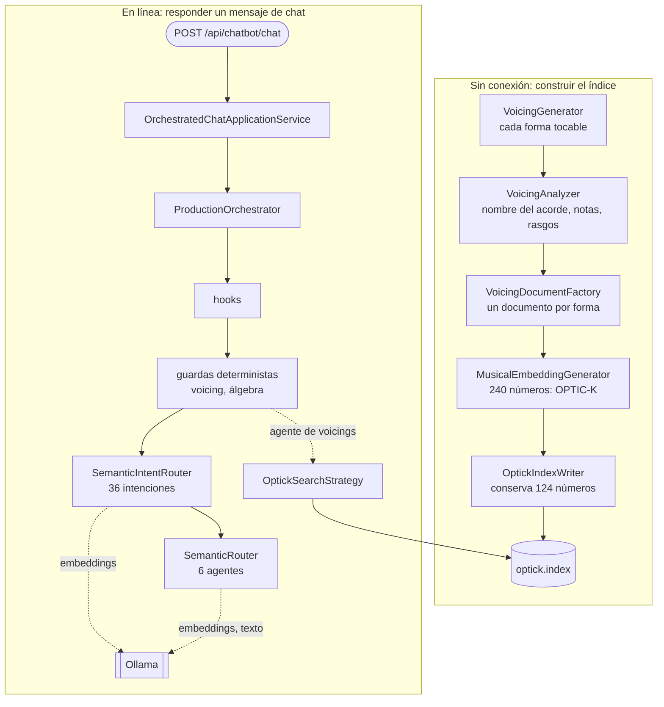

"La IA de GA" no es un solo componente. Es una cadena que calcula un vector para cada forma de acorde que se puede tocar en una guitarra y los guarda en un archivo, y un host web que responde mensajes de chat, a veces con ese archivo, a veces con código C# normal, a veces con un modelo de lenguaje. Esta lección dibuja ambos, luego abre el host del chatbot y enumera lo que registra de verdad, para que cada una de las tres lecciones siguientes amplíe una caja del mapa.

Todos los enlaces a GA apuntan al commit [`a826864`](https://github.com/GuitarAlchemist/ga/tree/a826864f3a012cad88e415954bf57eca0ce12aa6).

## Ejecutar el código

El programa del curso está en [`code/ga-ai`](https://github.com/spareilleux/learn/tree/main/code/ga-ai). La primera ejecución clona en `code/ga-ai/.ga` las partes de GA que necesita, lo compila todo y compara cada lección con su salida esperada:

```bash
bash code/ga-ai/check.sh
```

En Windows, ejecútalo desde Git Bash; los comandos son los mismos en los tres sistemas. El clon es sin blobs y disperso: [`fetch-ga.sh`](https://github.com/spareilleux/learn/blob/8e335d7/code/ga-ai/fetch-ga.sh) extrae 17 carpetas de proyectos, unos 11 MB de código fuente, y nunca toca un clon de GA que ya tengas. En los runners de CI, una ejecución completa, clon y compilación incluidos, tarda 1,5 minutos en Linux y 3 en Windows. Después, cada lección se ejecuta por separado:

```bash
dotnet run --project code/ga-ai/GaAi -c Release -- l1
```

## Cinco capas

El [`CLAUDE.md`](https://github.com/GuitarAlchemist/ga/blob/a826864f3a012cad88e415954bf57eca0ce12aa6/CLAUDE.md#L20-L30) de GA describe un modelo estricto de cinco capas, de abajo arriba, y una regla: el código de IA va en la capa 4, la orquestación en la capa 5, nunca más abajo.

| Capa | Proyectos | Lo que el lado de IA toma de ella |
|---|---|---|
| 1. Core | `GA.Core`, `GA.Domain.Core` | notas, clases de altura, el mástil, clases de conjuntos: los lee el [curso de teoría musical](../../music-theory-ga/) |
| 2. Dominio | `GA.Business.Core`, `GA.Business.Config` | los records que rellena un análisis de voicing |
| 3. Análisis | generación y análisis de voicings (en `GA.Domain.Services` en este commit) | `VoicingGenerator`, `VoicingAnalyzer` |
| 4. IA/ML | `GA.Business.ML` | el esquema OPTIC-K, el generador de embeddings, el lector del índice y la búsqueda, los agentes y las intenciones |
| 5. Orquestación | `GA.Business.Core.Orchestration` | `ProductionOrchestrator`, el plugin de skills, los servicios de precalentamiento |

Los proyectos de la capa 3 que nombra `CLAUDE.md`, `GA.Business.Core.Harmony` y `GA.Business.Core.Fretboard`, no son los que contienen el código de voicings en este commit: `VoicingGenerator` y `VoicingAnalyzer` están en `Common/GA.Domain.Services`. Las aplicaciones están por encima de las cinco capas: el host del chatbot es [`Apps/GaChatbot.Api`](https://github.com/GuitarAlchemist/ga/tree/a826864f3a012cad88e415954bf57eca0ce12aa6/Apps/GaChatbot.Api), y la herramienta que escribe el índice es un proyecto de demostración, [`Demos/Music Theory/FretboardVoicingsCLI`](https://github.com/GuitarAlchemist/ga/tree/a826864f3a012cad88e415954bf57eca0ce12aa6/Demos/Music%20Theory/FretboardVoicingsCLI).

## Dos cadenas

El diagrama muestra las dos mitades. El primer grupo es trabajo que se hace una vez, sin conexión: cada forma de acorde tocable se convierte en un vector, y los vectores van a un archivo. El segundo grupo es el trabajo que se hace para cada mensaje de chat.



La lección 2 abre la caja del embedding, la lección 3 el índice y su búsqueda, la lección 4 el orquestador. Dos observaciones desde ya:

- **Se usa el mismo esquema en los dos lados.** Una consulta de búsqueda se convierte en un vector con las mismas particiones y los mismos pesos que las formas almacenadas, para que un producto escalar entre ellos tenga sentido. Si los dos se separan, la cabecera del archivo del índice lleva un hash de la disposición, y el lector rechaza un archivo escrito con otra (lección 3).
- **El servidor de modelos es opcional para algunos caminos y obligatorio para otros.** GA habla con [Ollama](https://ollama.com/), un servidor local de modelos de pesos abiertos, a través de [Microsoft.Extensions.AI](https://learn.microsoft.com/dotnet/ai/microsoft-extensions-ai): `IEmbeddingGenerator` para los embeddings, `IChatClient` para el texto. La lección 4 muestra qué preguntas sobreviven sin él.

## Los repositorios hermanos

El [`CLAUDE.md`](https://github.com/GuitarAlchemist/ga/blob/a826864f3a012cad88e415954bf57eca0ce12aa6/CLAUDE.md#L55-L59) de GA nombra tres repositorios que intercambian archivos con él:

- **[ix](https://github.com/GuitarAlchemist/ix)**, algoritmos de aprendizaje automático en Rust, "produces `state/voicings/optick.index` consumed by GA's RAG layer", y entrena autoencoders dispersos sobre él. En el código de GA, sin embargo, el archivo lo escribe el `OptickIndexWriter` en C# de `FretboardVoicingsCLI`: la propia [skill `optic-k-rebuild`](https://github.com/GuitarAlchemist/ga/blob/a826864f3a012cad88e415954bf57eca0ce12aa6/.claude/skills/optic-k-rebuild/SKILL.md#L71-L112) de GA construye el índice con esa CLI y después ejecuta sobre él los diagnósticos de ix. Si ix también puede escribir el archivo está *por verificar*. El [curso de IX](../../machine-learning-ix/) lee el código de ix en otro commit.
- **[Demerzel](https://github.com/GuitarAlchemist/Demerzel)**, gobernanza: sus pipelines ejecutan las revisiones que describen los contratos de GA, y genera los módulos de [Streeling](../../streeling/) de este sitio.
- **[TARS](https://github.com/GuitarAlchemist/tars)**, en F#, se describe como un "cross-model theory validator". Nada en este curso lo llama.

## Lo que registra el host del chatbot

El host canónico del chatbot es `GaChatbot.Api`: el [documento de superficies de chat](https://github.com/GuitarAlchemist/ga/blob/a826864f3a012cad88e415954bf57eca0ce12aa6/docs/architecture/chat-surfaces.md#L16-L21) de GA lo afirma desde el 2026-05-13, y dice que sirve la demo pública en `demos.guitaralchemist.com/chatbot/`. El host tiene tres modos. [`AddMinimalChatbotApi`](https://github.com/GuitarAlchemist/ga/blob/a826864f3a012cad88e415954bf57eca0ce12aa6/Apps/GaChatbot.Api/Extensions/ServiceCollectionExtensions.cs#L22-L50) lee `Chatbot:Mode`, `direct` por defecto: `direct` envía cada mensaje al modelo, `routed` usa un enrutador ligero, y `full` (u `orchestrated`) registra toda la pila de orquestación. El curso usa `full`.

En lugar de leer los registros, el programa arranca el host y le pregunta a su contenedor. [`WebApplicationFactory<TEntryPoint>`](https://learn.microsoft.com/aspnet/core/test/integration-tests) es la clase que usan las pruebas de integración de ASP.NET Core: ejecuta el `Program` de una aplicación dentro del proceso de prueba, con un servidor en memoria, y permite a quien la llama sustituir configuración y servicios. El [`ChatHost.cs`](https://github.com/spareilleux/learn/blob/8e335d7/code/ga-ai/GaAi/ChatHost.cs#L38-L43) del curso es su versión para un programa de consola:

```csharp
builder.UseSetting("Chatbot:Mode", "full");
builder.UseSetting("Chatbot:PathBase", "");
builder.UseSetting("Ollama:BaseUrl", DeadOllama);
builder.UseSetting("Ollama:Endpoint", DeadOllama);
builder.UseSetting("VoicingSearch:OpticIndexPath", Lesson3.IndexPath);
builder.UseSetting("IX:External:Enabled", "false");
```

`DeadOllama` es `http://127.0.0.1:9`, un puerto en el que nada escucha, así que cada llamada al modelo falla al instante, como en un runner de CI. El índice es uno pequeño que construye la lección 3. La memoria del chat, que GA guarda por defecto en `~/.ga`, se redirige a archivos junto al programa, de modo que una ejecución nunca lee ni modifica la del autor. Después, [`Lesson1.cs`](https://github.com/spareilleux/learn/blob/8e335d7/code/ga-ai/GaAi/Lesson1.cs) resuelve algunos servicios:

```text
== Orchestrator and application service
IHarmonicChatOrchestrator        ProductionOrchestrator
IChatApplicationService (host)   OrchestratedChatApplicationService
```

### 36 intenciones

Una **intención** (intent), aquí, es un objeto C# que sabe responder a un tipo de pregunta, con una lista de prompts de ejemplo. El enrutador semántico de intenciones compara un mensaje con esos ejemplos (lección 4). El host registra 36:

```text
== Intents the semantic router chooses from (36)
id                           examples  first example
skill.chordinfo              32        What is a C major chord?
skill.scaleinfo              24        What notes are in C major?
skill.modes                  37        What are the modes of the major scale
skill.interval               13        What is the interval between C and G?
skill.fretspan               0         (none)
skill.chordsubstitution      12        Tritone substitution for G7
skill.beginnerchords         7         Show me some easy beginner chords
skill.progressionmood        15        How do I make this progression sound darker?
skill.circleoffifths         10        Explain the circle of fifths
skill.practiceroutine        9         give me a 20 minute practice routine
skill.genreessentials        8         essential chords for blues guitar
skill.whatcanyoudo           14        what can you do
skill.transpose              13        transpose this progression down a half step
skill.commontones            9         What notes do Cmaj7 and Am7 share?
skill.diatonicchords         20        Give me the diatonic chords in C major
skill.relativekey            12        What is the relative minor of G major
skill.theorycomparison       7         What is the difference between major and minor
skill.settheoryequivalence   5         Are pitch classes 0,1,4 and 0,1,6 equivalent under inversion
skill.capo                   10        What shape do I play in E with capo 4
skill.voiceleading           10        voice leading from C to F
skill.alternatetunings       12        what is DADGAD tuning
skill.intervalclassvector    10        what is the interval-class vector of Cmaj7
skill.grothendieckdelta      10        how harmonically far is Am from D7
skill.icvneighbors           10        which chords are most similar to Dm7
skill.icvshortestpath        10        shortest harmonic path from Cmaj7 to G7
skill.grothendieckparse      10        parse C ⊗ G
skill.chordvoicings          12        voicings for Cmaj7
skill.improvisation          17        what scale can I use to solo over Cmaj7?
skill.outsidenotes           10        why does F sound outside over Cmaj7
skill.keyidentification      7         What key is C Am F G in?
skill.progressioncompletion  5         What chord comes next after C G Am?
skill.rememberthis           7         remember that I prefer drop-2 voicings for jazz comping
algebra                      13        Are 0146 and 0137 z-related?
tab.optimize                 5         Make this progression smoother to play
tab.analyze                  4         Analyse this tab
voicing                      11        Show me Drop 2 voicings of Cmaj7
```

32 de ellas envuelven una **skill**, una clase que implementa `IOrchestratorSkill` y que [`GaPlugin`](https://github.com/GuitarAlchemist/ga/blob/a826864f3a012cad88e415954bf57eca0ce12aa6/Common/GA.Business.Core.Orchestration/Plugins/GaPlugin.cs#L32-L40) registra tres veces: como ella misma, como `IOrchestratorSkill` y envuelta en un `OrchestratorSkillIntent`. Una de ellas, `skill.fretspan`, no tiene ningún ejemplo, y el enrutador [ignora las intenciones sin ejemplos](https://github.com/GuitarAlchemist/ga/blob/a826864f3a012cad88e415954bf57eca0ce12aa6/Common/GA.Business.ML/Agents/Intents/SemanticIntentRouter.cs#L95-L96): nunca puede elegirse por similitud.

### 6 agentes y 4 hooks

Un **agente**, en el código de GA, es una clase que responde con un modelo de lenguaje, llamando a herramientas si hace falta. Los mensajes que ninguna intención reclama van a uno de estos seis:

```text
== Agents behind the LLM path (6)
tab          TabAgent
theory       TheoryAgent
technique    TechniqueAgent
composer     ComposerAgent
critic       CriticAgent
voicing      VoicingAgent

== Hooks, in the order they run (4)
PromptSanitizationHook
MemoryHook
MemoryWriteHook
ObservabilityHook
```

Un **hook** se ejecuta en puntos fijos de cada petición: cuando llega, antes y después de una skill, cuando sale la respuesta. Es la misma idea que los hooks del [curso de programación agéntica](../../agentic-coding/03-hooks-skills-subagents/), vista desde el otro lado: allí, código alrededor de un agente que usas; aquí, código alrededor de los agentes que ejecuta GA.

La última línea de la lección une las dos cadenas:

```text
== The embedding every voicing gets
OPTIC-K-v1.8, 240 dims in 11 partitions, 124 of them searched
```

## Lo que el chatbot debe llegar a ser

La [hoja de ruta del chatbot](https://github.com/GuitarAlchemist/ga/blob/a826864f3a012cad88e415954bf57eca0ce12aa6/docs/plans/2026-05-07-chatbot-roadmap.md#L23-L25) de GA enuncia su estrella polar en una frase: el chatbot es "the conversational front end to the Guitar Alchemist domain", en el que "each user query is **routed by intent**, **answered by the domain**, **formatted by the skill**, and **shaped by the LLM only at the prose layer**". El modelo escribe frases; los hechos vienen de la teoría musical tipada de GA.

La issue [#623](https://github.com/GuitarAlchemist/ga/issues/623), abierta el 2026-08-01 y marcada como P0, lo convierte en un objetivo visible para el usuario: un guitarrista da una progresión de acordes y una afinación, y recibe la tonalidad y las funciones de los acordes, opciones de escalas y arpegios, voicings tocables con poco movimiento de la mano entre ellos y una explicación de los compromisos. La issue [#589](https://github.com/GuitarAlchemist/ga/issues/589) nombra el riesgo al que responde: "free-form LLM text asserting music-theory claims nothing validates", y propone que el modelo solo rellene una estructura JSON que el motor de teoría comprueba.

Dónde están las cosas, hasta donde este curso puede saberlo el 2026-09-14:

| Estado | Qué | Evidencia |
|---|---|---|
| Funciona, verificado aquí | vectores OPTIC-K, el escritor y el lector del índice, la búsqueda por cifrado, los caminos de álgebra y de voicings del chatbot, las skills llamadas directamente | lecciones 2 a 4, ejecutadas en CI sin modelo |
| Funciona con un modelo, no verificado aquí | enrutamiento por embeddings, los seis agentes, respuestas en prosa | necesita Ollama; este curso no lo ejecuta (*por verificar*) |
| Problemas conocidos, abiertos | la partición CONTEXT no transporta nada ([#616](https://github.com/GuitarAlchemist/ga/issues/616)); consejos erróneos sobre acordes prestados ([#567](https://github.com/GuitarAlchemist/ga/issues/567)); "E-flat major" leído como E mayor ([#554](https://github.com/GuitarAlchemist/ga/issues/554)); tonalidades de cadencias ([#614](https://github.com/GuitarAlchemist/ga/issues/614)) | issues de GA, abiertas el 2026-09-14 |
| Planeado | el coach de progresión a voicings ([#623](https://github.com/GuitarAlchemist/ga/issues/623)); salida estructurada validada ([#589](https://github.com/GuitarAlchemist/ga/issues/589)) | propuestas, abiertas |
| Investigación | modelos latentes del mundo y planificación sobre OPTIC-K ([#605](https://github.com/GuitarAlchemist/ga/issues/605), [#610](https://github.com/GuitarAlchemist/ga/issues/610), [#611](https://github.com/GuitarAlchemist/ga/issues/611), [#606](https://github.com/GuitarAlchemist/ga/issues/606), [#607](https://github.com/GuitarAlchemist/ga/issues/607)) | spikes, abiertas |

Las lecciones amplían la fila de "problemas conocidos": el curso encontró más de una docena de diferencias entre el código de GA y sus documentos, enumeradas en el [diario](../journal/).

## Ejercicios

1. Sin ejecutar nada, ¿qué camino responde "Are 0146 and 0137 z-related?": una intención, un agente, o algo anterior a ambos? Mira la lista de intenciones de arriba y el diagrama.
2. El host se arranca con `Chatbot:Mode` en su valor por defecto. ¿Qué `IChatApplicationService` resuelve, y qué le pasa a cada mensaje?
3. ¿Por qué el programa del curso redirige `MemoryStore` y `ChatTranscriptStore` en lugar de dejar que GA use sus valores por defecto?

<details>
<summary>Soluciones</summary>

1. Algo anterior a ambos: `ProductionOrchestrator` ejecuta una comprobación determinista de álgebra antes de cualquier enrutamiento por intenciones ([líneas 359-373](https://github.com/GuitarAlchemist/ga/blob/a826864f3a012cad88e415954bf57eca0ce12aa6/Common/GA.Business.Core.Orchestration/Services/ProductionOrchestrator.cs#L359-L373)). El prompt contiene "z-related", una de las palabras clave del clasificador. La intención `algebra` también existe, con este mismo prompt como primer ejemplo, pero el camino rápido responde antes de que se consulte al enrutador. La lección 4 muestra la respuesta: `routingMethod ix-algebra`.
2. `DirectChatApplicationService`: el modo por defecto es `direct` ([línea 22](https://github.com/GuitarAlchemist/ga/blob/a826864f3a012cad88e415954bf57eca0ce12aa6/Apps/GaChatbot.Api/Extensions/ServiceCollectionExtensions.cs#L22)), y en ese modo cada mensaje va directamente al modelo de chat con un prompt de sistema. Con el modelo inaccesible, todos los mensajes fallan.
3. Porque los valores por defecto son archivos en el directorio personal del usuario, `~/.ga`: una prueba que escribe un turno de chat cambiaría la memoria real del autor, y una prueba que la lee dependería de ella. Apuntar los dos almacenes a una carpeta nueva hace la ejecución repetible e inofensiva. `ConfigureTestServices` registra los reemplazos después de los registros propios de la aplicación, así que ganan ellos.

</details>

## Puntos clave

- La IA de GA son dos cadenas que comparten un esquema: sin conexión, las formas de acorde se convierten en vectores OPTIC-K de 240 números guardados en un índice; en línea, un mensaje de chat pasa por hooks, guardas deterministas, 36 intenciones y 6 agentes.
- El código de IA vive en `GA.Business.ML` (capa 4), la orquestación en `GA.Business.Core.Orchestration` (capa 5); el host del chatbot es `GaChatbot.Api`, y el escritor del índice es una CLI en `Demos`.
- `WebApplicationFactory` permite a un simple programa de consola arrancar un host real de ASP.NET Core, sustituir su configuración y sus servicios y leer su contenedor: el mapa más fiable de lo que está registrado.
- La estrella polar es un chatbot en el que responde el dominio y el modelo solo redacta; el coach planeado y la salida estructurada son pasos hacia ella, y varios problemas conocidos se interponen.

## Fuentes

- GuitarAlchemist/ga en [`a826864`](https://github.com/GuitarAlchemist/ga/tree/a826864f3a012cad88e415954bf57eca0ce12aa6): `CLAUDE.md`, `docs/architecture/chat-surfaces.md`, `docs/plans/2026-05-07-chatbot-roadmap.md`, `Apps/GaChatbot.Api/Extensions/ServiceCollectionExtensions.cs`, `Common/GA.Business.Core.Orchestration/Plugins/GaPlugin.cs`, `Common/GA.Business.Core.Orchestration/Services/ProductionOrchestrator.cs`.
- Issues de GA [#554](https://github.com/GuitarAlchemist/ga/issues/554), [#567](https://github.com/GuitarAlchemist/ga/issues/567), [#589](https://github.com/GuitarAlchemist/ga/issues/589), [#605](https://github.com/GuitarAlchemist/ga/issues/605), [#606](https://github.com/GuitarAlchemist/ga/issues/606), [#607](https://github.com/GuitarAlchemist/ga/issues/607), [#610](https://github.com/GuitarAlchemist/ga/issues/610), [#611](https://github.com/GuitarAlchemist/ga/issues/611), [#614](https://github.com/GuitarAlchemist/ga/issues/614), [#616](https://github.com/GuitarAlchemist/ga/issues/616), [#623](https://github.com/GuitarAlchemist/ga/issues/623), leídas el 2026-09-14.
- Microsoft Learn: [Pruebas de integración en ASP.NET Core](https://learn.microsoft.com/aspnet/core/test/integration-tests), [Bibliotecas Microsoft.Extensions.AI](https://learn.microsoft.com/dotnet/ai/microsoft-extensions-ai).
- [Ollama](https://ollama.com/).
