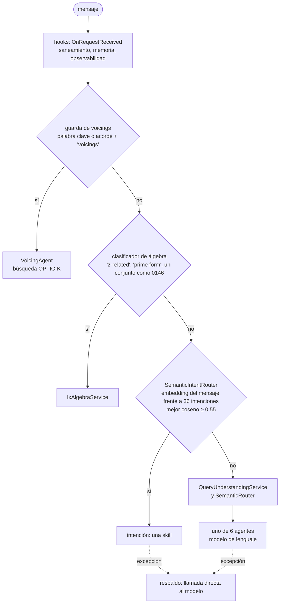

Las lecciones anteriores llamaban a las clases de GA una por una. Esta envía peticiones HTTP al propio host del chatbot, `GaChatbot.Api`, arrancado en el proceso del curso como en la lección 1, con el índice de la lección 3 y una dirección de modelo donde no escucha nadie. Entran cuatro mensajes; lo que sale, respuestas, trazas y errores, muestra el orden en que GA intenta responder y qué depende de un modelo.

Todos los enlaces a GA apuntan al commit [`a826864`](https://github.com/GuitarAlchemist/ga/tree/a826864f3a012cad88e415954bf57eca0ce12aa6). Las salidas proceden de:

```bash
dotnet run --project code/ga-ai/GaAi -c Release -- l4
```

## El orden de los intentos

`POST /api/chatbot/chat` llega a [`ChatbotController.Chat`](https://github.com/GuitarAlchemist/ga/blob/a826864f3a012cad88e415954bf57eca0ce12aa6/Apps/GaChatbot.Api/Controllers/ChatbotController.cs#L102-L109), y luego a [`OrchestratedChatApplicationService`](https://github.com/GuitarAlchemist/ga/blob/a826864f3a012cad88e415954bf57eca0ce12aa6/Apps/GaChatbot.Api/Services/OrchestratedChatApplicationService.cs#L43-L125), que llama al orquestador y recurre a una llamada simple al modelo si algo sale mal. [`ProductionOrchestrator.AnswerAsync`](https://github.com/GuitarAlchemist/ga/blob/a826864f3a012cad88e415954bf57eca0ce12aa6/Common/GA.Business.Core.Orchestration/Services/ProductionOrchestrator.cs#L304-L520) prueba, por orden:



| Paso | ¿Necesita un modelo? | Código |
|---|---|---|
| hooks | no | [líneas 318-339](https://github.com/GuitarAlchemist/ga/blob/a826864f3a012cad88e415954bf57eca0ce12aa6/Common/GA.Business.Core.Orchestration/Services/ProductionOrchestrator.cs#L318-L339) |
| guarda de voicings: una palabra clave como "voicings" o "fingering", o un cifrado de acorde seguido de "shape" o "voicings" | no | [líneas 343-357](https://github.com/GuitarAlchemist/ga/blob/a826864f3a012cad88e415954bf57eca0ce12aa6/Common/GA.Business.Core.Orchestration/Services/ProductionOrchestrator.cs#L343-L357), [779-787](https://github.com/GuitarAlchemist/ga/blob/a826864f3a012cad88e415954bf57eca0ce12aa6/Common/GA.Business.Core.Orchestration/Services/ProductionOrchestrator.cs#L779-L787) |
| vía rápida de álgebra: una palabra clave o un patrón de conjunto de clases de altura | no | [líneas 359-373](https://github.com/GuitarAlchemist/ga/blob/a826864f3a012cad88e415954bf57eca0ce12aa6/Common/GA.Business.Core.Orchestration/Services/ProductionOrchestrator.cs#L359-L373), [`KeywordAlgebraPromptClassifier`](https://github.com/GuitarAlchemist/ga/blob/a826864f3a012cad88e415954bf57eca0ce12aa6/Common/GA.Business.Core.Orchestration/Services/KeywordAlgebraPromptClassifier.cs) |
| enrutador semántico de intenciones | **embeddings** | [línea 403](https://github.com/GuitarAlchemist/ga/blob/a826864f3a012cad88e415954bf57eca0ce12aa6/Common/GA.Business.Core.Orchestration/Services/ProductionOrchestrator.cs#L403), [`SemanticIntentRouter`](https://github.com/GuitarAlchemist/ga/blob/a826864f3a012cad88e415954bf57eca0ce12aa6/Common/GA.Business.ML/Agents/Intents/SemanticIntentRouter.cs#L87-L160) |
| extracción de filtros y enrutamiento a agentes, en paralelo | **texto y embeddings** | [líneas 501-506](https://github.com/GuitarAlchemist/ga/blob/a826864f3a012cad88e415954bf57eca0ce12aa6/Common/GA.Business.Core.Orchestration/Services/ProductionOrchestrator.cs#L501-L506) |

El enrutador de intenciones es un clasificador de vecinos más cercanos sobre embeddings de texto: calcula el embedding del mensaje, lo compara con la descripción y los ejemplos de cada intención, conserva el mejor coseno de cada intención, añade pequeñas bonificaciones por patrones de superficie, y acepta la mejor intención si alcanza `DefaultMinConfidence`, 0,55 ([línea 47](https://github.com/GuitarAlchemist/ga/blob/a826864f3a012cad88e415954bf57eca0ce12aa6/Common/GA.Business.ML/Agents/Intents/SemanticIntentRouter.cs#L36-L47)). Los embeddings vienen de Ollama. Las dos guardas que tiene delante son las partes que no lo necesitan, y las dos se pusieron ahí a propósito: la guarda de voicings porque el enrutador enviaba "Show me Drop 2 voicings of Cmaj7" a la skill de modos, y la vía de álgebra porque, sin endpoint de embeddings, los "CI runners without Ollama" fallan "and 500s when the LLM is ALSO unreachable" ([líneas 359-368](https://github.com/GuitarAlchemist/ga/blob/a826864f3a012cad88e415954bf57eca0ce12aa6/Common/GA.Business.Core.Orchestration/Services/ProductionOrchestrator.cs#L359-L368)).

## Una pregunta de álgebra

El [`Lesson4.cs`](https://github.com/spareilleux/learn/blob/8e335d7/code/ga-ai/GaAi/Lesson4.cs) del curso envía `{ "message": "..." }` con el `HttpClient` de [`WebApplicationFactory`](https://learn.microsoft.com/aspnet/core/test/integration-tests), e imprime los campos de la respuesta JSON:

```text
== POST /api/chatbot/chat "Are 0146 and 0137 z-related?"
HTTP 200
agentId        algebra
routingMethod  ix-algebra
confidence     1.00
grounding      ix-compatible 7b02a56 z-relation
  left         [0,1,4,6]
  right        [0,1,3,7]
  leftIcv      <1 1 1 1 1 1>
  rightIcv     <1 1 1 1 1 1>
  zRelated     True
answer:
  | [0,1,4,6] and [0,1,3,7] are Z-related: they share ICV <1 1 1 1 1 1> but have different prime forms.
trace:
  chat.request             completed
  orchestration.answer     completed
  orchestration.route      completed
  agent.semantic_result    completed
  notation.vextab          completed
  response.emit            completed
```

El clasificador de álgebra reconoció "z-related", así que no se consultó ningún modelo. La respuesta dice quién respondió (`agentId`), cómo se eligió (`routingMethod`), con qué confianza y sobre qué **anclaje** (grounding): una fuente, una revisión y los hechos en los que se apoya la respuesta. Las clases de conjuntos y su vector interválico compartido son las del [curso de teoría musical](../../music-theory-ga/04-set-classes/). Es la estrella polar de la lección 1 en miniatura: el dominio calculó los hechos, y la frase solo los repite.

La **traza** es la lista de pasos que el host registró para el panel derecho de la página de chat de GA. El curso imprime los nombres y los estados de los pasos; el host también registra duraciones y atributos como `routing.method`, omitidos aquí porque las duraciones cambian en cada ejecución.

## Una pregunta de voicings

````text
== POST /api/chatbot/chat "Show me Cmaj7 voicings"
HTTP 200
agentId        voicing
routingMethod  deterministic-voicing
confidence     0.92
grounding      (none)
answer:
  | Found 2 voicings matching chord Cmaj7:
  |
  | - **Cmaj7** `3-0-x-2-3-x` (guitar, score 0.369)
  | ```vextab
  | 6/3 5/0 3/2 2/3
  | ```
  | - **Cmaj7** `3-0-0-2-3-x` (guitar, score 0.369)
  | ```vextab
  | 6/3 5/0 4/0 3/2 2/3
  | ```
trace:
  chat.request             completed
  orchestration.answer     completed
  orchestration.route      completed
  agent.semantic_result    completed
  notation.vextab          completed
  response.emit            completed
````

"voicings" activó la guarda, y respondió [`VoicingAgent`](https://github.com/GuitarAlchemist/ga/blob/a826864f3a012cad88e415954bf57eca0ce12aa6/Common/GA.Business.ML/Agents/VoicingAgent.cs#L46-L150). A pesar de su nombre y de su parámetro `IChatClient`, no llamó al modelo: un parser tipado extrajo el cifrado `Cmaj7`, [`MusicalQueryEncoder`](https://github.com/GuitarAlchemist/ga/blob/a826864f3a012cad88e415954bf57eca0ce12aa6/Common/GA.Business.ML/Search/MusicalQueryEncoder.cs#L43-L109) construyó el vector de consulta, y la búsqueda con el filtro `ChordName` devolvió las dos formas de la lección 3, con la misma puntuación, 0.369. La etiqueta de "agente", en GA, designa una clase que *puede* usar el modelo.

Después, [`PlayableNotationFormatter`](https://github.com/GuitarAlchemist/ga/blob/a826864f3a012cad88e415954bf57eca0ce12aa6/Common/GA.Business.ML/Notation/PlayableNotationFormatter.cs#L31-L53) añadió un bloque [VexTab](https://vexflow.com/vextab/) bajo cada diagrama, para que la página pueda dibujar una tablatura. Lee el diagrama empezando por la E grave: el elemento 0 se convierte en la cuerda 6. Los diagramas de GA empiezan por la E aguda, así que `3-0-x-2-3-x` (C, E, B y G desde el bajo hacia arriba) se convierte en `6/3 5/0 3/2 2/3`: G, A, A y D. El acorde que aparece bajo "Cmaj7" no es un Cmaj7. Es otra vez el problema del orden del diagrama de la lección 2, ahora delante de un usuario.

## Una pregunta para una skill

```text
== POST /api/chatbot/chat "What is the relative minor of C major?"
HTTP 500
logged:
  Error ExceptionHandlerMiddleware: An unhandled exception has occurred while executing the request. [HttpRequestException at DirectChatApplicationService.GenerateAnswerAsync, DirectChatApplicationService.cs:96]
  Error OrchestratedChatApplicationService: Chat orchestration failed. Falling back to direct chat client. [HttpRequestException at SemanticRouter.EnsureEmbeddingsInitializedAsync, SemanticRouter.cs:251]
  Warning QueryUnderstandingService: [QueryUnderstanding] Failed to extract filters [HttpRequestException at OllamaGenerateClient.GenerateAsync, OllamaGenerateClient.cs:46]
  Warning SemanticIntentRouter: SemanticIntentRouter: example embedding failed; router will degrade to fallback [HttpRequestException at SemanticIntentRouter.EnsureExamplesEmbeddedAsync, SemanticIntentRouter.cs:370]
  Warning SemanticIntentRouter: SemanticIntentRouter: query embedding failed; routing falls through to LLM path [HttpRequestException at SemanticIntentRouter.RouteAsync, SemanticIntentRouter.cs:111]
```

HTTP 500 y ninguna respuesta. El curso conserva los avisos y los errores del host, con el tipo de excepción y el marco de GA más interno, y los imprime ordenados. Puestos de nuevo en el orden en que ocurrieron:

1. Ninguna guarda coincidió, así que el orquestador consultó `SemanticIntentRouter`. Falló el cálculo de los embeddings de los ejemplos de las intenciones ([línea 370](https://github.com/GuitarAlchemist/ga/blob/a826864f3a012cad88e415954bf57eca0ce12aa6/Common/GA.Business.ML/Agents/Intents/SemanticIntentRouter.cs#L341-L385)), y luego el del embedding de la consulta ([línea 111](https://github.com/GuitarAlchemist/ga/blob/a826864f3a012cad88e415954bf57eca0ce12aa6/Common/GA.Business.ML/Agents/Intents/SemanticIntentRouter.cs#L106-L127)). Los dos se capturan: el enrutador registra un aviso y devuelve `null`, "ninguna intención".
2. El orquestador pasó a `QueryUnderstandingService`, cuya llamada al modelo falló y también se capturó.
3. En paralelo, [`SemanticRouter.RouteAsync`](https://github.com/GuitarAlchemist/ga/blob/a826864f3a012cad88e415954bf57eca0ce12aa6/Common/GA.Business.ML/Agents/SemanticRouter.cs#L68-L104) llamó a `EnsureEmbeddingsInitializedAsync`, que calcula los embeddings de las descripciones de los seis agentes ([línea 251](https://github.com/GuitarAlchemist/ga/blob/a826864f3a012cad88e415954bf57eca0ce12aa6/Common/GA.Business.ML/Agents/SemanticRouter.cs#L233-L258)). Nada en `RouteAsync` captura esa excepción. `RouteAsync` tiene un respaldo por palabras clave, en el paso 3 de sus propios comentarios, `semanticResult ?? KeywordRoute(query)`: nunca se alcanza.
4. `OrchestratedChatApplicationService` capturó la excepción, registró "Chat orchestration failed. Falling back to direct chat client." ([líneas 109-124](https://github.com/GuitarAlchemist/ga/blob/a826864f3a012cad88e415954bf57eca0ce12aa6/Apps/GaChatbot.Api/Services/OrchestratedChatApplicationService.cs#L109-L124)) y llamó a [`DirectChatApplicationService`](https://github.com/GuitarAlchemist/ga/blob/a826864f3a012cad88e415954bf57eca0ce12aa6/Apps/GaChatbot.Api/Services/DirectChatApplicationService.cs#L69-L99), que llama al modelo, otra vez, y lanza una excepción en la línea 96. Esa sí llega al gestor de excepciones de ASP.NET Core: 500.

La pregunta no necesita ningún modelo. La skill correspondiente existe, y el programa la llama directamente, sin el enrutador:

```text
== The skill.relativekey intent, called directly with "What is the relative minor of C major?"
confidence     1.00
  | The relative minor of **C major** is **Am**.
  |
  | Both share the same key signature (no sharps or flats). Same notes, different tonal center — the relative minor starts on the 6th degree of the major scale.
```

Confianza 1.00, la respuesta correcta, calculada por el código de dominio de GA. Antes de que existiera el enrutador semántico, el método `CanHandle` de cada skill decidía con palabras clave. El orquestador ya no lo llama, pero las skills todavía lo implementan:

```text
== IOrchestratorSkill.CanHandle for each prompt (the keyword path the orchestrator no longer calls)
Are 0146 and 0137 z-related?             (none)
Show me Cmaj7 voicings                   ChordVoicings
What is the relative minor of C major?   ScaleInfo
Why does a ii-V-I sound resolved?        (none)
```

La vía por palabras clave tampoco habría salvado esta pregunta: elige `ScaleInfo`, no la skill de tonalidad relativa. La hoja de ruta de GA incluye "replacing semantic routing with regex" entre sus [no objetivos](https://github.com/GuitarAlchemist/ga/blob/a826864f3a012cad88e415954bf57eca0ce12aa6/docs/plans/2026-05-07-chatbot-roadmap.md#L46-L49), y esta salida muestra por qué las palabras clave solas son débiles. También muestra el coste de esa elección: en `a826864`, cuando el servidor de embeddings está caído, toda pregunta que no captura ninguna guarda termina en un 500, incluidas las que una skill determinista responde con certeza.

## Una pregunta para el modelo

```text
== POST /api/chatbot/chat "Why does a ii-V-I sound resolved?"
HTTP 500
logged:
  Error ExceptionHandlerMiddleware: An unhandled exception has occurred while executing the request. [HttpRequestException at DirectChatApplicationService.GenerateAnswerAsync, DirectChatApplicationService.cs:96]
  Error OrchestratedChatApplicationService: Chat orchestration failed. Falling back to direct chat client. [HttpRequestException at SemanticRouter.EnsureEmbeddingsInitializedAsync, SemanticRouter.cs:251]
  Warning QueryUnderstandingService: [QueryUnderstanding] Failed to extract filters [HttpRequestException at OllamaGenerateClient.GenerateAsync, OllamaGenerateClient.cs:46]
  Warning SemanticIntentRouter: SemanticIntentRouter: example embedding failed; router will degrade to fallback [HttpRequestException at SemanticIntentRouter.EnsureExamplesEmbeddedAsync, SemanticIntentRouter.cs:370]
  Warning SemanticIntentRouter: SemanticIntentRouter: query embedding failed; routing falls through to LLM path [HttpRequestException at SemanticIntentRouter.RouteAsync, SemanticIntentRouter.cs:111]
```

Las mismas cinco líneas de log. Esta sí necesita un modelo: explicar por qué una cadencia suena resuelta es prosa, y ninguna skill la reclama. Lo que responden los seis agentes de la lección 1 con Ollama en marcha no lo verifica este curso (*por verificar*). Sin modelo, el resultado correcto sería un mensaje claro de "el asistente no está disponible"; en su lugar, el host devuelve un 500 desde su gestor de excepciones. La issue [#589](https://github.com/GuitarAlchemist/ga/issues/589) describe adónde quiere llevar GA esta vía: el modelo propone una estructura tipada, y el motor de teoría la valida antes de que el usuario vea nada.

## Una condición de carrera en la propia CI del curso

La primera versión de esta lección pasaba en Windows y fallaba en Linux y macOS. En esos dos sistemas, las líneas de log de la petición del relativo menor aparecían también bajo la petición de álgebra, la primera enviada. La causa es [`IntentEmbeddingWarmupService`](https://github.com/GuitarAlchemist/ga/blob/a826864f3a012cad88e415954bf57eca0ce12aa6/Common/GA.Business.Core.Orchestration/Services/IntentEmbeddingWarmupService.cs#L27-L66), un [servicio hospedado](https://learn.microsoft.com/aspnet/core/fundamentals/host/hosted-services) cuyo `StartAsync` lanza el cálculo de los embeddings de los ejemplos de cada intención y vuelve de inmediato:

```csharp
public Task StartAsync(CancellationToken cancellationToken)
{
    // Lanzar y olvidar: el arranque del host no debe bloquearse con esto.
    _ = Task.Run(() => WarmAsync(cancellationToken), cancellationToken);
    return Task.CompletedTask;
}
```

Para un servidor real es razonable: el primer usuario no espera un minuto a la caché. Para una prueba, significa que los avisos del precalentamiento caen en la petición que se esté ejecutando en ese momento, y ese momento depende de la máquina. El curso ahora espera la última línea de log del propio precalentamiento, "cache warmed" o "warmup failed", antes de enviar nada, y lanza una excepción a los dos minutos ([`ChatHost.WaitForWarmup`](https://github.com/spareilleux/learn/blob/8e335d7/code/ga-ai/GaAi/ChatHost.cs#L23-L34)). Una línea de log es una señal débil para sincronizarse; un servicio hospedado que expusiera un `Task` para su finalización sería una señal mejor.

## Ejercicios

1. ¿Qué vía responde a "What voicings of G7 are easy?", y necesita un modelo?
2. `SemanticRouter.RouteAsync` tiene un respaldo por palabras clave. Cambia el menor código posible para que un mensaje llegue a él cuando el servidor de embeddings está caído. ¿Dónde pondrías un `try`, y qué debería capturar?
3. Con tu cambio del ejercicio 2, ¿obtendría "What is the relative minor of C major?" una respuesta correcta sin conexión?
4. El curso imprime los nombres de los pasos de la traza, pero no sus duraciones. ¿Por qué, y qué harías para probar las duraciones de todos modos?

<details>
<summary>Soluciones</summary>

1. La guarda de voicings: "voicings" es una de sus palabras clave ([línea 128](https://github.com/GuitarAlchemist/ga/blob/a826864f3a012cad88e415954bf57eca0ce12aa6/Common/GA.Business.Core.Orchestration/Services/ProductionOrchestrator.cs#L128-L134)). Después, `VoicingAgent` extrae `G7` con el parser tipado, y no necesita modelo. Lo que "easy" le hace a la búsqueda depende del extractor y del filtro de comodidad; no se comprueba aquí (*por verificar*).
2. Por ejemplo en `RouteAsync`, alrededor del bloque semántico:

   ```csharp
   if (textEmbeddings != null)
   {
       try
       {
           await EnsureEmbeddingsInitializedAsync(cancellationToken);
           semanticResult = await SemanticRouteAsync(query, cancellationToken);
           // ... la comprobación de confianza, sin cambios
       }
       catch (HttpRequestException ex)
       {
           _logger.LogWarning(ex, "Agent embeddings unavailable; using keyword routing");
       }
   }
   ```

   Captura la excepción que produce un servidor caído, `HttpRequestException`, no `Exception`, para que un error real siga saliendo a la luz; deja pasar `OperationCanceledException`, la cancelación del llamador. No se ha compilado ni ejecutado contra GA (*por verificar*): el paso de enrutamiento por LLM que viene después también llama al modelo, y quizá necesite el mismo tratamiento.
3. No. El enrutador por palabras clave elige uno de los seis agentes, y un agente responde con el modelo, que está caído. A la skill de tonalidad relativa solo se llega a través del enrutador de intenciones, que necesita embeddings. Una respuesta sin conexión necesita una ruta determinista hacia la skill: su `CanHandle`, una pista por palabras clave o una caché de embeddings de intenciones calculados de antemano.
4. Las duraciones cambian en cada ejecución y en cada máquina, así que una comparación exacta con `expected/` fallaría siempre. Una prueba puede afirmar propiedades en su lugar: toda duración es no negativa, los pasos están en orden, y el total queda por debajo de un límite generoso.

</details>

## Puntos clave

- El chatbot de GA prueba, por orden: los hooks, una guarda de voicings, un clasificador de álgebra, un enrutador de intenciones basado en embeddings sobre 36 intenciones, y luego un enrutamiento basado en el modelo hacia 6 agentes; una orquestación fallida recurre a una llamada directa al modelo.
- Sin servidor de modelos, las dos guardas siguen respondiendo, con hechos de anclaje y una traza; todo lo demás termina en HTTP 500 en `a826864`, porque una excepción no capturada en el enrutamiento a agentes se salta el respaldo por palabras clave, y el propio respaldo necesita el modelo.
- "Agente" designa una clase que puede usar un modelo: `VoicingAgent` responde a "Show me Cmaj7 voicings" solo con un parser y el índice OPTIC-K.
- La tablatura que aparece bajo los voicings lee los diagramas de GA en el orden de cuerdas equivocado, así que el acorde dibujado no es el acorde nombrado.
- Un precalentamiento de tipo lanzar y olvidar en un servicio hospedado hace que los logs de un host dependan de los tiempos; las pruebas necesitan una señal de finalización, y la CI en varios sistemas es lo que reveló la condición de carrera.

## Fuentes

- GuitarAlchemist/ga en [`a826864`](https://github.com/GuitarAlchemist/ga/tree/a826864f3a012cad88e415954bf57eca0ce12aa6): `Apps/GaChatbot.Api` (`Controllers/ChatbotController.cs`, `Services/OrchestratedChatApplicationService.cs`, `Services/DirectChatApplicationService.cs`), `Common/GA.Business.Core.Orchestration/Services` (`ProductionOrchestrator.cs`, `KeywordAlgebraPromptClassifier.cs`, `IntentEmbeddingWarmupService.cs`), `Common/GA.Business.ML/Agents` (`SemanticRouter.cs`, `VoicingAgent.cs`, `Intents/SemanticIntentRouter.cs`), `Common/GA.Business.ML/Notation/PlayableNotationFormatter.cs`, `docs/plans/2026-05-07-chatbot-roadmap.md`.
- Issue de GA [#589](https://github.com/GuitarAlchemist/ga/issues/589), leída el 2026-09-14.
- Microsoft Learn: [Pruebas de integración en ASP.NET Core](https://learn.microsoft.com/aspnet/core/test/integration-tests), [Tareas en segundo plano con servicios hospedados](https://learn.microsoft.com/aspnet/core/fundamentals/host/hosted-services), [Control de errores en ASP.NET Core](https://learn.microsoft.com/aspnet/core/fundamentals/error-handling).
- [VexTab](https://vexflow.com/vextab/).
